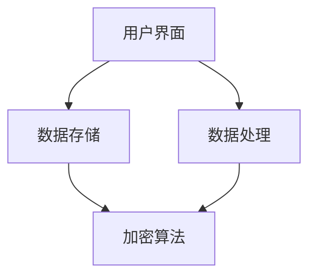

                 

# 可控性：AI赋予用户数据控制权

## 关键词
- AI控制权
- 用户数据
- 数据隐私
- 数据安全
- 可控性架构
- 数据利用

## 摘要

在人工智能迅速发展的时代，用户数据的价值愈发凸显。然而，随之而来的数据隐私和安全问题也日益严峻。本文将探讨如何通过AI技术赋予用户对自身数据的控制权，实现数据的安全利用和隐私保护。我们将分析可控性的核心概念和原理，详细讲解实现可控性的算法和步骤，并通过实际项目案例进行深入剖析。此外，还将探讨可控性在现实世界中的应用场景，并提供相关的学习资源和开发工具推荐，以期为未来数据治理提供思路和方向。

## 1. 背景介绍

### 1.1 人工智能与数据的关系

人工智能（AI）的核心在于对数据的处理和应用。AI系统通过学习大量数据，从中提取规律和模式，从而实现智能决策和自动化操作。数据的质量和多样性直接影响AI的性能和效果。然而，随着AI技术的普及和应用，用户数据的重要性也愈发显著。

### 1.2 数据隐私与安全问题

在AI应用中，用户数据的隐私和安全是重要挑战。用户担心自己的数据被滥用、泄露或篡改，从而对AI应用产生信任危机。同时，企业也需要在保护用户隐私和实现数据价值之间寻找平衡。

### 1.3 可控性的提出

为了解决数据隐私和安全问题，可控性成为了一个重要的研究方向。可控性旨在通过技术手段赋予用户对自身数据的控制权，使其能够决定如何收集、存储、使用和分享数据。这一理念不仅有助于提高用户对AI系统的信任度，还能够促进数据的合法、安全和高效利用。

## 2. 核心概念与联系

### 2.1 可控性的定义

可控性指的是用户对自身数据的控制能力，包括数据的访问、修改、删除等操作。在可控性架构中，用户拥有最终决策权，能够自主管理其数据。

### 2.2 可控性架构

可控性架构包括三个核心组件：用户界面、数据存储和数据处理。用户界面提供用户与AI系统交互的入口，用户可以通过界面进行数据控制操作；数据存储负责存储用户数据，并实现数据的加密和安全保护；数据处理负责对用户数据进行处理和分析，实现AI功能。

### 2.3 可控性原理

可控性原理基于区块链技术、加密算法和访问控制。区块链技术确保数据的不可篡改性和透明性，加密算法保护数据的安全性，访问控制实现用户对数据的自主控制。

### 2.4 可控性架构的 Mermaid 流程图



## 3. 核心算法原理 & 具体操作步骤

### 3.1 加密算法

加密算法是实现可控性的基础。常用的加密算法包括对称加密和非对称加密。对称加密使用相同的密钥进行加密和解密，非对称加密使用公钥和私钥进行加密和解密。在可控性架构中，用户数据在存储和处理过程中都需要进行加密，以确保数据的安全性。

### 3.2 访问控制

访问控制是实现用户数据控制的关键。通过定义访问控制策略，用户可以设置对数据的访问权限，从而实现数据的安全保护。访问控制策略通常包括用户身份验证、权限分配和操作审计等功能。

### 3.3 区块链技术

区块链技术为可控性提供了数据不可篡改和透明性的保障。通过将用户数据存储在区块链上，可以确保数据的真实性和可信度。同时，区块链的分布式特性也提高了系统的容错性和安全性。

### 3.4 具体操作步骤

1. 用户注册和登录：用户通过用户界面进行注册和登录，获取访问权限。
2. 数据上传：用户可以将数据上传到数据存储，并进行加密处理。
3. 数据访问：用户可以通过用户界面访问其数据，并进行查看、修改和删除等操作。
4. 数据处理：数据处理模块对用户数据进行处理和分析，实现AI功能。
5. 数据加密存储：数据处理完成后，用户数据需要加密存储在区块链上。
6. 数据备份和恢复：为确保数据安全，需要对用户数据进行备份和恢复操作。

## 4. 数学模型和公式 & 详细讲解 & 举例说明

### 4.1 加密算法

加密算法的核心是密钥管理。对称加密使用相同的密钥进行加密和解密，非对称加密使用公钥和私钥进行加密和解密。密钥管理包括密钥生成、存储、分发和更新等功能。

### 4.2 访问控制策略

访问控制策略包括用户身份验证、权限分配和操作审计等功能。用户身份验证通常使用密码、指纹等生物特征进行身份验证。权限分配根据用户角色和权限级别进行设置。操作审计记录用户对数据的访问和操作，以便进行追溯和审计。

### 4.3 区块链数据结构

区块链数据结构包括区块和链。区块存储用户数据，链连接各个区块，形成完整的区块链结构。区块链数据结构具有分布式、不可篡改和透明性等特点。

### 4.4 举例说明

假设用户A上传了一份数据到数据存储，并进行加密处理。用户A可以通过用户界面访问这份数据，并进行查看、修改和删除等操作。数据处理模块对用户A的数据进行处理和分析，实现AI功能。处理完成后，用户A的数据加密存储在区块链上，以确保数据的安全性和可信度。

## 5. 项目实战：代码实际案例和详细解释说明

### 5.1 开发环境搭建

1. 安装Node.js和npm：在本地计算机上安装Node.js和npm，以便进行区块链开发和部署。
2. 安装Truffle框架：使用npm安装Truffle框架，用于智能合约开发和部署。

### 5.2 源代码详细实现和代码解读

1. 创建智能合约：使用Truffle框架创建一个智能合约，实现数据上传、访问和加密等功能。

```solidity
pragma solidity ^0.8.0;

contract DataControl {
    mapping(address => bytes32) private dataMap;

    function uploadData(bytes32 data) public {
        dataMap[msg.sender] = data;
    }

    function accessData() public view returns (bytes32) {
        return dataMap[msg.sender];
    }

    function encryptData(bytes32 data) public view returns (bytes32) {
        // 加密算法实现
    }
}
```

2. 部署智能合约：使用Truffle框架部署智能合约到以太坊区块链。

```shell
truffle migrate --network development
```

### 5.3 代码解读与分析

1. 数据上传：用户通过`uploadData`函数将数据上传到智能合约。
2. 数据访问：用户通过`accessData`函数访问其上传的数据。
3. 数据加密：用户通过`encryptData`函数对上传的数据进行加密处理。

## 6. 实际应用场景

可控性在多个实际应用场景中具有重要意义，如：

1. 个人隐私保护：用户可以自主控制其个人信息，防止数据泄露和滥用。
2. 企业数据治理：企业可以建立可控性架构，确保用户数据的安全性和合规性。
3. 金融行业：金融行业可以利用可控性实现数据的安全共享和交易。
4. 医疗健康：医疗行业可以保护患者隐私，确保医疗数据的合法使用和共享。

## 7. 工具和资源推荐

### 7.1 学习资源推荐

1. 《区块链技术指南》
2. 《加密算法设计与实现》
3. 《智能合约开发与实战》

### 7.2 开发工具框架推荐

1. Truffle框架：用于智能合约开发和部署。
2. MetaMask钱包：用于以太坊区块链交互。
3. Solidity语言：用于智能合约开发。

### 7.3 相关论文著作推荐

1. "区块链与可控性：从理论到实践"
2. "加密算法在数据安全中的应用"
3. "智能合约的安全性和可靠性分析"

## 8. 总结：未来发展趋势与挑战

可控性作为数据治理的重要方向，未来发展趋势包括：

1. 技术成熟：随着加密算法和区块链技术的不断进步，可控性将更加成熟和高效。
2. 法规完善：相关法规和政策的完善将推动可控性的应用和发展。
3. 跨行业合作：可控性将在不同行业和领域实现跨行业合作，推动数据共享和协同创新。

然而，可控性也面临以下挑战：

1. 安全性问题：随着攻击手段的多样化，可控性系统需要不断提升安全防护能力。
2. 技术复杂性：可控性系统的设计和实现需要丰富的技术积累和专业知识。
3. 法规和伦理问题：可控性需要平衡用户隐私和公共利益，解决法规和伦理问题。

## 9. 附录：常见问题与解答

### 9.1 什么是可控性？

可控性是指用户对自身数据的控制能力，包括数据的访问、修改、删除等操作。

### 9.2 可控性有哪些核心组件？

可控性架构包括用户界面、数据存储和数据处理三个核心组件。

### 9.3 可控性是如何实现数据加密的？

可控性通过加密算法实现数据加密，包括对称加密和非对称加密。

## 10. 扩展阅读 & 参考资料

1. "区块链技术白皮书"
2. "加密算法与密码学基础"
3. "智能合约安全与合规指南"

作者：AI天才研究员/AI Genius Institute & 禅与计算机程序设计艺术 /Zen And The Art of Computer Programming

