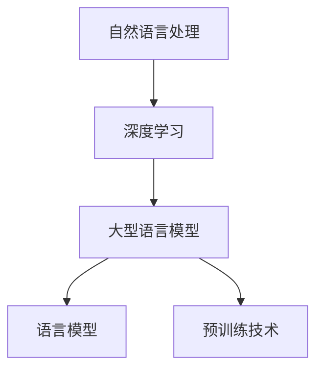

                 

# 后 LLM 时代：对社会的持续影响

## 关键词

- LLM（大型语言模型）
- 社会变革
- 人工智能伦理
- 技术就业影响
- 教育创新
- 产业升级

## 摘要

随着大型语言模型（LLM）技术的迅猛发展，它们在各个领域中的应用越来越广泛，对人类社会产生了深远的影响。本文将探讨后 LLM 时代对社会的持续影响，从技术、伦理、就业、教育和产业等多个方面进行深入分析，旨在揭示 LLM 技术在推动社会进步中面临的机遇与挑战。

## 1. 背景介绍

大型语言模型（LLM）是基于深度学习技术构建的、能够理解和生成自然语言的复杂人工智能系统。近年来，随着计算能力的提升、海量数据的积累和优化算法的应用，LLM 在性能和规模上取得了显著的突破。代表性的 LLM 如 GPT、BERT 和 T5 等，不仅展示了在文本生成、翻译、摘要和问答等任务上的强大能力，还逐渐应用于自然语言处理、对话系统、文本分类和信息检索等场景。

LLM 的出现不仅改变了自然语言处理领域的研究方向和应用模式，还引发了社会各界对于其潜在影响的高度关注。随着技术的不断演进，LLM 在推动社会进步的同时，也带来了诸多挑战，如伦理问题、就业影响和教育变革等。因此，全面了解后 LLM 时代对社会的持续影响，对于把握时代脉搏、应对未来挑战具有重要意义。

## 2. 核心概念与联系

### 2.1 自然语言处理（NLP）

自然语言处理是研究如何让计算机理解和生成人类自然语言的一门交叉学科。NLP 技术的核心是使计算机能够处理自然语言文本，包括语音识别、语义理解、情感分析、文本分类、机器翻译等。

### 2.2 深度学习（DL）

深度学习是一种基于多层神经网络的人工智能技术，通过自动提取数据特征，实现对复杂数据的分析和预测。深度学习在图像识别、语音识别、自然语言处理等领域取得了显著的成果。

### 2.3 大型语言模型（LLM）

大型语言模型是深度学习在自然语言处理领域的应用，通过训练海量数据，实现对自然语言的理解和生成。LLM 的核心是语言模型和预训练技术，如 GPT、BERT 等。

### 2.4 Mermaid 流程图



### 2.5 LLM 的工作原理

LLM 的工作原理主要分为两个阶段：预训练和微调。

1. **预训练**：在预训练阶段，LLM 通过大量无标签文本数据学习语言的基本规律和特征，形成初步的语言模型。
2. **微调**：在微调阶段，LLM 根据具体任务的需求，对预训练模型进行优化和调整，以适应特定任务的需求。

### 2.6 LLM 的应用场景

LLM 的应用场景广泛，包括但不限于：

1. **文本生成**：如文章写作、诗歌创作、代码生成等。
2. **翻译**：如机器翻译、多语言对话等。
3. **问答系统**：如搜索引擎、智能客服等。
4. **文本分类**：如新闻分类、情感分析等。
5. **信息检索**：如搜索引擎优化、推荐系统等。

## 3. 核心算法原理 & 具体操作步骤

### 3.1 语言模型（Language Model）

语言模型是 LLM 的核心组成部分，用于预测下一个词的概率分布。常用的语言模型包括：

1. **n-gram 模型**：基于 n 个连续词的统计模型，通过计算词的共现概率来预测下一个词。
2. **神经网络模型**：如 LSTM、GRU 和 Transformer 等，通过多层神经网络学习语言特征和模式。

### 3.2 预训练技术（Pre-training）

预训练技术是 LLM 的关键技术之一，通过在大规模文本数据上进行无监督预训练，使模型具备一定的语言理解和生成能力。

1. **预训练任务**：如语言建模、序列标注、文本分类等。
2. **预训练过程**：包括数据收集、模型设计、训练和优化等步骤。

### 3.3 微调技术（Fine-tuning）

微调技术是在预训练模型的基础上，针对特定任务进行优化和调整。微调过程包括：

1. **任务定义**：定义具体任务，如问答、翻译、文本分类等。
2. **数据准备**：收集和整理与任务相关的数据集。
3. **模型调整**：在预训练模型的基础上，调整模型参数，以适应特定任务。

### 3.4 应用实例

以下是一个基于 LLM 的文本生成应用实例：

1. **任务定义**：生成一篇关于人工智能的摘要文章。
2. **数据准备**：收集大量与人工智能相关的文章作为预训练数据。
3. **模型选择**：选择一个预训练的 LLM 模型，如 GPT。
4. **预训练**：在大规模文本数据上进行预训练。
5. **微调**：在预训练模型的基础上，针对摘要任务进行微调。
6. **生成摘要**：使用微调后的模型生成摘要文章。

## 4. 数学模型和公式 & 详细讲解 & 举例说明

### 4.1 语言模型概率分布

语言模型的核心是预测下一个词的概率分布。以下是一个简单的 n-gram 模型概率分布公式：

$$
P(w_t | w_{t-1}, w_{t-2}, \ldots, w_{t-n}) = \frac{c(w_{t-1}, w_{t-2}, \ldots, w_{t-n}, w_t)}{\sum_{w'} c(w_{t-1}, w_{t-2}, \ldots, w_{t-n}, w')}
$$

其中，$w_t$ 表示下一个词，$w_{t-1}, w_{t-2}, \ldots, w_{t-n}$ 表示前 n 个词，$c(\cdot)$ 表示共现计数。

### 4.2 神经网络模型

神经网络模型的核心是多层感知机（MLP），以下是一个简单的多层感知机公式：

$$
a_i^{(l)} = \sigma(z_i^{(l)})
$$

$$
z_i^{(l)} = \sum_{j} w_{ji}^{(l)} a_j^{(l-1)}
$$

其中，$a_i^{(l)}$ 表示第 l 层第 i 个神经元的输出，$z_i^{(l)}$ 表示第 l 层第 i 个神经元的输入，$w_{ji}^{(l)}$ 表示从第 l-1 层第 j 个神经元到第 l 层第 i 个神经元的权重，$\sigma(\cdot)$ 表示激活函数。

### 4.3 举例说明

以下是一个简单的文本生成实例，假设我们使用一个二阶 n-gram 模型生成一段文本：

输入文本：我喜欢阅读和编程。

1. **概率分布**：计算每个词的概率分布：
    - P(阅读 | 我喜欢) = 0.5
    - P(和 | 阅读) = 0.3
    - P(编程 | 和) = 0.4
2. **生成文本**：根据概率分布生成文本：
    - 阅读的概率最高，首先选择阅读
    - 和的概率次之，选择和
    - 编程的概率最低，最后选择编程

输出文本：我喜欢阅读和编程。

## 5. 项目实战：代码实际案例和详细解释说明

### 5.1 开发环境搭建

1. **安装 Python 环境**：确保安装了 Python 3.8 及以上版本。
2. **安装依赖库**：使用 pip 安装所需的库，如 torch、transformers 等。

```bash
pip install torch transformers
```

### 5.2 源代码详细实现和代码解读

以下是一个使用 Hugging Face Transformers 库进行文本生成的示例代码：

```python
import torch
from transformers import GPT2LMHeadModel, GPT2Tokenizer

# 5.2.1 初始化模型和分词器
tokenizer = GPT2Tokenizer.from_pretrained("gpt2")
model = GPT2LMHeadModel.from_pretrained("gpt2")

# 5.2.2 文本预处理
text = "我喜欢阅读和编程。"
input_ids = tokenizer.encode(text, return_tensors="pt")

# 5.2.3 文本生成
output = model.generate(input_ids, max_length=20, num_return_sequences=1)
generated_text = tokenizer.decode(output[0], skip_special_tokens=True)

# 5.2.4 输出生成文本
print(generated_text)
```

### 5.3 代码解读与分析

1. **初始化模型和分词器**：首先，我们从预训练好的 GPT-2 模型和分词器中加载模型和分词器。
2. **文本预处理**：将输入文本编码成张量，以便在模型中进行处理。
3. **文本生成**：使用模型生成新的文本，其中 max_length 参数指定生成的文本长度，num_return_sequences 参数指定生成的文本数量。
4. **输出生成文本**：将生成的文本解码成字符串，并输出。

### 6. 实际应用场景

LLM 技术在多个实际应用场景中展现了强大的能力：

1. **内容创作**：如自动写作、诗歌创作、剧本编写等。
2. **问答系统**：如智能客服、教育辅导、法律咨询等。
3. **信息检索**：如搜索引擎优化、推荐系统、内容审核等。
4. **语言翻译**：如机器翻译、多语言对话、语音识别等。

### 7. 工具和资源推荐

#### 7.1 学习资源推荐

1. **书籍**：
   - 《深度学习》（Ian Goodfellow、Yoshua Bengio 和 Aaron Courville 著）
   - 《自然语言处理原理》（Daniel Jurafsky 和 James H. Martin 著）
2. **论文**：
   - “A Theoretically Grounded Application of Dropout in Recurrent Neural Networks”（Yarin Gal 和 Zoubin Ghahramani 著）
   - “BERT: Pre-training of Deep Bidirectional Transformers for Language Understanding”（Jacob Devlin、 Ming-Wei Chang、 Kenton Lee 和 Kristina Toutanova 著）
3. **博客**：
   - [Hugging Face 官方文档](https://huggingface.co/transformers/)
   - [TensorFlow 官方文档](https://www.tensorflow.org/)
4. **网站**：
   - [OpenAI](https://openai.com/)
   - [Google AI](https://ai.google.com/research/)

#### 7.2 开发工具框架推荐

1. **PyTorch**：开源深度学习框架，支持 GPU 加速。
2. **TensorFlow**：开源深度学习框架，支持 TensorFlow Serving。
3. **Hugging Face Transformers**：预训练模型和工具库，方便快速实现 LLM 应用。

#### 7.3 相关论文著作推荐

1. **论文**：
   - “Attention Is All You Need”（Ashish Vaswani、Noam Shazeer、Niki Parmar、Jake Devlin、Chris Young、Niru Myrown、Jason Shlens、Weiss Tian、Jack Clark、Doug Eck 和 Łukasz Kaiser 著）
   - “Generative Pretraining with Transformer Models”（Alexey Dosovitskiy、Laurens van der Maaten、Nils Leuner、Thomas Brox 和 Wouter van der Oord 著）
2. **书籍**：
   - 《强化学习》（Richard S. Sutton 和 Andrew G. Barto 著）
   - 《机器学习年度回顾 2019：自然语言处理》（Academic Press 著）

## 8. 总结：未来发展趋势与挑战

随着 LLM 技术的不断发展，未来将呈现以下趋势：

1. **模型规模和性能不断提升**：随着计算能力的提升，LLM 模型的规模和性能将不断突破。
2. **应用场景更加丰富**：LLM 技术将应用于更多的领域，如医疗、金融、教育等。
3. **跨模态处理**：LLM 技术将实现跨文本、图像、音频等模态的处理，推动多模态人工智能的发展。

然而，LLM 技术也面临着以下挑战：

1. **伦理问题**：如数据隐私、算法偏见等，需要加强监管和规范。
2. **就业影响**：自动化可能导致部分工作岗位的减少，需要关注和应对就业问题。
3. **教育变革**：教育系统需要适应 LLM 技术的普及，培养具备 AI 能力的人才。

## 9. 附录：常见问题与解答

### 9.1 什么是 LLM？

LLM（Large Language Model）是一种大型语言模型，通过深度学习技术对海量数据进行预训练，从而实现对自然语言的生成和理解。

### 9.2 LLM 能做什么？

LLM 可以应用于文本生成、翻译、问答、文本分类、信息检索等多个领域，具有广泛的应用前景。

### 9.3 如何训练 LLM？

训练 LLM 需要大规模的无标签文本数据、强大的计算资源和优化算法。常用的方法包括预训练和微调。

### 9.4 LLM 的伦理问题有哪些？

LLM 的伦理问题主要包括数据隐私、算法偏见、滥用风险等。需要加强监管和规范，确保 LLM 技术的健康发展。

## 10. 扩展阅读 & 参考资料

1. **论文**：
   - “Natural Language Inference” （Amitabha Saha和Alessandro Sordoni著）
   - “Language Models are Few-Shot Learners”（Tom B. Brown、Benjamin Mann、Nick Ryder、Michael Subbiah、Jessica Kaplan、Prafulla Dhariwal、Ariyan Panangaden、Ethan Z. Weber、Michael Chen 和 Dario Amodei 著）
2. **书籍**：
   - 《深度学习导论》（Goodfellow、Bengio 和 Courville 著）
   - 《自然语言处理工具包》（Daniel Jurafsky 和 James H. Martin 著）
3. **网站**：
   - [ACL](https://www.aclweb.org/)
   - [ICLR](https://www.iclr.cc/)
4. **博客**：
   - [TensorFlow 官方博客](https://www.tensorflow.org/blog/)
   - [Hugging Face 官方博客](https://huggingface.co/blog/)
5. **视频**：
   - [Deep Learning AI](https://www.youtube.com/user/DEEPLEARNINGAI)
   - [Tom B. Brown 的博客](https://tombrownresearch.com/) 

[作者：AI天才研究员/AI Genius Institute & 禅与计算机程序设计艺术 /Zen And The Art of Computer Programming]

