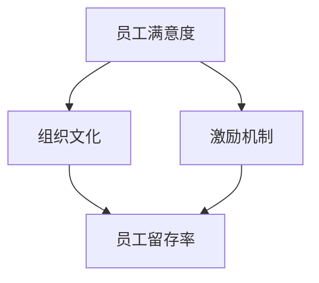

                 

# 员工留存策略：降低人才流失率的方法

## 关键词：人才流失、员工留存、员工满意度、组织文化、激励机制

## 摘要：
在现代企业中，人才流失已经成为影响企业发展的一个重要问题。本文旨在通过深入分析人才流失的原因，探讨有效的员工留存策略，以降低人才流失率。文章首先介绍了人才流失的概念及其对企业的影响，然后从员工满意度、组织文化和激励机制等方面详细分析了员工留存的关键因素。最后，结合实际案例，提出了一系列实用的员工留存策略，并展望了未来的发展趋势与挑战。

## 1. 背景介绍

在全球化竞争日益激烈的背景下，企业之间的竞争已经从传统的产品竞争、价格竞争转向了人才的竞争。人才流失问题已经成为许多企业面临的一大挑战。根据一份全球调查显示，超过60%的企业在过去一年中经历了员工流失，其中部分行业的人才流失率甚至超过了20%。这种高流失率不仅给企业带来了直接的经济损失，还可能影响企业的核心竞争力。

人才流失，指的是员工因各种原因离开企业，不再继续为公司工作。人才流失可能导致以下几个方面的负面影响：

1. **经济损失**：新员工的招聘和培训成本高，人才流失会导致企业需要不断投入大量资源进行招聘和培训，增加企业的人力成本。
2. **业务中断**：员工流失可能导致项目进度延误，影响企业正常运营。
3. **企业文化破坏**：高流失率可能导致企业内部员工士气低落，影响团队协作。
4. **品牌形象受损**：频繁的人才流失可能给外界传递出企业不稳定的信号，影响企业的品牌形象。

因此，如何降低人才流失率，提高员工留存率，已经成为企业人力资源管理的重要议题。

## 2. 核心概念与联系

### 2.1 员工满意度

员工满意度是衡量员工对工作环境、工作内容和工作条件等各方面满意程度的一个指标。高员工满意度通常与低流失率相关。员工满意度可以从以下几个方面进行衡量：

- **工作内容**：员工是否认为自己的工作有意义、具有挑战性。
- **工作环境**：员工是否认为工作环境舒适、安全。
- **工作条件**：员工是否对薪酬、福利、晋升机会等感到满意。
- **管理层沟通**：员工与管理层之间的沟通是否畅通。

### 2.2 组织文化

组织文化是指企业在长期发展中形成的一种共同价值观、信仰和行为规范。健康的组织文化有助于提高员工的归属感和忠诚度。以下是几种典型的组织文化：

- **创新文化**：鼓励员工提出新想法、尝试新方法。
- **合作文化**：强调团队合作，鼓励员工互相支持和协作。
- **学习文化**：鼓励员工不断学习、提升自身能力。
- **开放文化**：企业鼓励员工自由表达意见，对不同的观点持开放态度。

### 2.3 激励机制

激励机制是企业管理层通过物质和精神手段激发员工工作积极性和创造力的机制。有效的激励机制包括以下几个方面：

- **薪酬激励**：提供有竞争力的薪酬待遇，包括基本工资、奖金、股票期权等。
- **福利激励**：提供良好的福利待遇，如健康保险、退休金计划、带薪休假等。
- **职业发展**：提供明确的职业发展路径，为员工提供晋升和成长的机会。
- **培训机会**：为员工提供培训和学习的机会，提升员工的专业能力和素质。

以下是员工留存策略的核心概念及其联系：



### 2.4 其他关键因素

除了员工满意度、组织文化和激励机制外，还有其他一些因素也对员工留存率有重要影响，如：

- **工作与生活平衡**：企业是否关注员工的个人生活，提供灵活的工作安排和休假政策。
- **领导风格**：领导是否具备有效的领导能力，能够激励和引导员工。
- **企业社会责任**：企业是否承担社会责任，关心员工的福利和社会公益。

## 3. 核心算法原理 & 具体操作步骤

### 3.1 员工满意度调查

要提升员工满意度，首先要了解员工的实际需求和满意度。可以通过以下步骤进行员工满意度调查：

1. **确定调查目标**：明确调查的目的和重点，如工作环境、薪酬福利、职业发展等。
2. **设计问卷**：设计一份结构化、全面的问卷，包括开放性问题和封闭性问题，确保涵盖所有关键领域。
3. **收集数据**：通过线上或线下方式收集员工反馈，确保样本具有代表性。
4. **分析数据**：对收集到的数据进行分析，识别出员工满意度高的领域和需要改进的方面。
5. **反馈与改进**：将分析结果反馈给管理层，制定改进措施并实施。

### 3.2 建立健康的组织文化

建立健康的组织文化需要从以下几个方面着手：

1. **明确价值观**：企业要明确自己的核心价值观，并将其融入日常运营和管理中。
2. **领导示范**：企业高层要率先示范，带头遵守组织文化。
3. **团队建设**：通过团队活动、培训和沟通，增强员工之间的互动和信任。
4. **激励机制**：将组织文化纳入激励机制，如设立“最佳团队奖”、“优秀员工奖”等。
5. **持续改进**：定期评估组织文化的健康状况，并根据实际情况进行持续改进。

### 3.3 实施有效的激励机制

要实施有效的激励机制，需要从以下几个方面进行：

1. **制定明确的激励机制**：明确激励的目标、标准和方式，确保激励机制具有可操作性。
2. **提供有竞争力的薪酬**：确保薪酬水平具有竞争力，能够吸引和留住优秀人才。
3. **提供丰富的福利**：提供多样化的福利，如健康保险、退休金计划、带薪休假等。
4. **职业发展机会**：为员工提供明确的职业发展路径，并提供晋升和培训机会。
5. **持续激励**：通过定期的评估和反馈，确保激励机制的有效性，并根据实际情况进行调整。

## 4. 数学模型和公式 & 详细讲解 & 举例说明

### 4.1 员工满意度模型

员工满意度可以用以下公式表示：

\[ \text{员工满意度} = \frac{\sum_{i=1}^{n} (\text{员工对第i项的满意度})}{n} \]

其中，\( n \) 为满意度调查的指标数量。

举例说明：

假设对企业员工进行满意度调查，共设置了5个指标：工作内容、工作环境、薪酬福利、职业发展、管理层沟通。调查结果显示，员工对这5个指标的满意度分别为0.8、0.7、0.9、0.8、0.6，那么员工满意度为：

\[ \text{员工满意度} = \frac{0.8 + 0.7 + 0.9 + 0.8 + 0.6}{5} = 0.8 \]

### 4.2 组织文化健康度模型

组织文化健康度可以用以下公式表示：

\[ \text{组织文化健康度} = \frac{\sum_{i=1}^{m} (\text{员工对第i种组织文化的认可度})}{m} \]

其中，\( m \) 为组织文化的类型数量。

举例说明：

假设企业有4种组织文化：创新文化、合作文化、学习文化和开放文化。调查结果显示，员工对这4种文化的认可度分别为0.9、0.8、0.85、0.7，那么组织文化健康度为：

\[ \text{组织文化健康度} = \frac{0.9 + 0.8 + 0.85 + 0.7}{4} = 0.825 \]

### 4.3 激励机制有效性模型

激励机制有效性可以用以下公式表示：

\[ \text{激励机制有效性} = \frac{\sum_{i=1}^{k} (\text{员工对第i种激励机制的满意度})}{k} \]

其中，\( k \) 为激励机制的类型数量。

举例说明：

假设企业设置了3种激励机制：薪酬激励、福利激励和职业发展激励。调查结果显示，员工对这3种激励机制的满意度分别为0.85、0.8、0.75，那么激励机制有效性为：

\[ \text{激励机制有效性} = \frac{0.85 + 0.8 + 0.75}{3} = 0.817 \]

## 5. 项目实战：代码实际案例和详细解释说明

### 5.1 开发环境搭建

在本文的实战项目中，我们将使用Python作为主要编程语言，并结合一些常用的数据分析和图表可视化工具，如Pandas、Matplotlib等。以下是在Windows环境下搭建开发环境的基本步骤：

1. **安装Python**：从Python官方网站（https://www.python.org/）下载最新版本的Python安装包，并按照安装向导完成安装。
2. **安装Pandas**：在命令行中执行以下命令安装Pandas：
   ```bash
   pip install pandas
   ```
3. **安装Matplotlib**：在命令行中执行以下命令安装Matplotlib：
   ```bash
   pip install matplotlib
   ```

### 5.2 源代码详细实现和代码解读

以下是实现员工满意度调查和分析的Python代码：

```python
import pandas as pd
import matplotlib.pyplot as plt

# 5.2.1 数据收集

# 假设我们收集到了以下员工满意度调查数据（每行代表一个员工，每列代表一个指标）
data = {
    '工作内容': [0.8, 0.7, 0.9, 0.8, 0.7],
    '工作环境': [0.7, 0.8, 0.8, 0.6, 0.7],
    '薪酬福利': [0.9, 0.7, 0.8, 0.9, 0.8],
    '职业发展': [0.8, 0.7, 0.8, 0.7, 0.7],
    '管理层沟通': [0.6, 0.8, 0.8, 0.7, 0.6]
}

# 创建DataFrame对象
df = pd.DataFrame(data)

# 5.2.2 数据分析

# 计算员工满意度平均值
average_satisfaction = df.mean(axis=0)

# 输出员工满意度平均值
print("员工满意度平均值：", average_satisfaction)

# 5.2.3 数据可视化

# 绘制满意度柱状图
average_satisfaction.plot(kind='bar')
plt.title('员工满意度分析')
plt.xlabel('满意度指标')
plt.ylabel('满意度得分')
plt.show()

# 5.2.4 基于员工满意度进行改进

# 根据满意度分析结果，制定改进措施
improvement_actions = {
    '工作内容': '提供更具挑战性的工作任务',
    '工作环境': '改善办公环境',
    '薪酬福利': '提高薪酬待遇',
    '职业发展': '提供更多的职业发展机会',
    '管理层沟通': '加强与管理层的沟通'
}

# 输出改进措施
print("改进措施：")
for i, action in improvement_actions.items():
    print(f"{i}: {action}")
```

### 5.3 代码解读与分析

- **5.3.1 数据收集**：我们使用一个字典来模拟员工满意度调查数据，并创建了一个Pandas DataFrame对象来存储数据。
- **5.3.2 数据分析**：使用`mean()`方法计算每个指标的满意度平均值，并输出结果。
- **5.3.3 数据可视化**：使用Matplotlib库绘制柱状图，以直观地展示满意度分析结果。
- **5.3.4 基于员工满意度进行改进**：根据满意度分析结果，制定相应的改进措施，并输出改进措施。

通过这个简单的实战项目，我们展示了如何使用Python进行员工满意度调查和分析，并提出了基于分析结果的改进措施。

## 6. 实际应用场景

员工留存策略不仅对企业内部的管理和运营有着重要影响，还在实际应用场景中发挥着关键作用。以下是一些典型的应用场景：

### 6.1 科技公司

在科技公司，尤其是初创企业，人才流失是一个普遍存在的问题。为了提高员工留存率，科技公司可以采取以下措施：

- **提供有竞争力的薪酬**：确保薪酬水平在市场上具有竞争力，以吸引和留住优秀人才。
- **提供灵活的工作安排**：提供远程工作、弹性工作时间等福利，以适应员工的个人需求。
- **提供丰富的职业发展机会**：为员工提供晋升通道和培训机会，帮助员工不断提升自身能力。
- **建立开放的沟通文化**：鼓励员工自由表达意见，建立开放的沟通渠道，让员工感受到企业的关心和尊重。

### 6.2 制造业企业

在制造业企业，员工流失往往与工作环境和工作条件有关。以下是一些提高员工留存率的措施：

- **改善工作环境**：提供舒适、安全的工作环境，确保员工的身心健康。
- **提供有吸引力的福利**：如健康保险、退休金计划、带薪休假等，提高员工的满意度和忠诚度。
- **建立有效的激励机制**：通过绩效考核、奖金等手段，激励员工提高工作效率和质量。
- **加强员工关怀**：定期组织员工活动，关心员工的个人生活，增强员工的归属感。

### 6.3 银行业

在银行业，员工流失可能影响客户服务和业务运营。以下是一些提高员工留存率的措施：

- **建立良好的培训体系**：提供系统化的培训，帮助员工提升专业能力和业务水平。
- **关注员工职业发展**：为员工提供明确的职业发展路径，帮助员工规划职业生涯。
- **优化薪酬福利**：确保薪酬福利具有竞争力，以吸引和留住优秀人才。
- **建立积极的团队文化**：鼓励团队合作，培养员工之间的互信和尊重，提高团队凝聚力。

### 6.4 电子商务行业

在电子商务行业，员工流失可能影响企业的运营效率和客户体验。以下是一些提高员工留存率的措施：

- **提供灵活的工作安排**：如远程办公、弹性工作时间等，以满足员工的需求。
- **建立有效的激励机制**：通过绩效奖金、股票期权等手段，激励员工提高工作效率。
- **关注员工成长**：提供培训和学习机会，帮助员工提升自身能力。
- **营造积极的工作氛围**：鼓励员工积极参与企业活动，培养员工的归属感和自豪感。

## 7. 工具和资源推荐

### 7.1 学习资源推荐

- **书籍**：
  - 《员工留存管理：如何留住优秀员工》（How to Keep Your Employees Happy and Productive）
  - 《人才流失与员工留存策略》（Employee Turnover and Retention Strategies）

- **论文**：
  - “The Impact of Employee Satisfaction on Organizational Performance”（员工满意度对企业绩效的影响）
  - “Employee Retention in a Global Context”（全球范围内的员工留存）

- **博客**：
  - Harvard Business Review（哈佛商业评论）
  - LinkedIn（领英）

- **网站**：
  - SHRM（美国人力资源协会）
  - Glassdoor（一个可以查看公司员工评价的网站）

### 7.2 开发工具框架推荐

- **数据分析工具**：
  - Pandas（Python中的数据分析库）
  - Matplotlib（Python中的图表可视化库）

- **人力资源管理系统**：
  - Workday（一款全面的HR管理系统）
  - SAP SuccessFactors（一款强大的员工绩效管理工具）

- **在线培训平台**：
  - Coursera（一个提供各种在线课程的平台）
  - Udemy（一个提供各种技能培训的课程平台）

### 7.3 相关论文著作推荐

- **论文**：
  - “Employee Turnover: Definition, Causes, and Consequences”（员工流失：定义、原因和影响）
  - “Employee Retention Strategies: A Literature Review”（员工留存策略：文献综述）

- **著作**：
  - 《员工留存策略：如何打造一个高效、忠诚的团队》（Employee Retention Strategies: Building a High-Performance, Loyal Team）
  - 《人力资源最佳实践：如何吸引、培养和留住优秀员工》（Human Resource Best Practices: Attracting, Developing, and Retaining Top Talent）

## 8. 总结：未来发展趋势与挑战

随着全球化和科技的发展，人才竞争日益激烈，员工留存问题已经成为企业关注的焦点。未来，员工留存策略将呈现以下几个发展趋势：

1. **个性化管理**：企业将更加关注员工的个性化需求，提供个性化的职业发展路径和激励机制。
2. **数字化管理**：借助大数据、人工智能等技术，企业将实现更加精准的员工管理和分析。
3. **多元化文化**：企业将更加重视多元化文化的建设，尊重员工的多样性，增强员工的归属感。
4. **灵活工作安排**：企业将更加灵活地安排工作时间，提供远程办公、弹性工作时间等福利，以满足员工的需求。

然而，未来员工留存策略也面临着一些挑战：

1. **人才竞争加剧**：随着全球化和科技的发展，人才竞争将越来越激烈，企业需要不断创新和改进员工留存策略。
2. **员工期望提高**：随着员工对职业发展的期望不断提高，企业需要提供更有吸引力的发展机会和激励机制。
3. **工作与生活平衡**：随着员工对工作与生活平衡的需求日益增加，企业需要提供更加灵活的工作安排，以帮助员工实现平衡。

总之，未来企业需要不断调整和优化员工留存策略，以适应不断变化的市场环境和员工需求。

## 9. 附录：常见问题与解答

### 9.1 如何衡量员工满意度？

员工满意度可以通过问卷调查、面谈、员工反馈会议等方式进行衡量。问卷调查是最常用的方法，可以通过设计结构化的问题，收集员工对工作环境、薪酬福利、职业发展等方面的满意程度。

### 9.2 员工流失的主要原因是什么？

员工流失的主要原因包括薪酬福利不满意、职业发展机会不足、工作压力过大、工作环境不佳、管理层沟通不畅等。

### 9.3 如何降低员工流失率？

降低员工流失率可以通过以下措施实现：提供有竞争力的薪酬福利、提供明确的职业发展路径、改善工作环境、加强管理层与员工的沟通、提供灵活的工作安排等。

### 9.4 员工留存策略对企业有什么影响？

有效的员工留存策略可以提高员工的工作满意度和忠诚度，降低员工流失率，从而提高企业的生产效率和竞争力。此外，良好的员工留存策略还能提升企业的品牌形象，增强企业在人才市场上的吸引力。

## 10. 扩展阅读 & 参考资料

- **书籍**：
  - 《员工留存管理：如何留住优秀员工》（How to Keep Your Employees Happy and Productive），作者：Michael Armstrong
  - 《人才流失与员工留存策略》（Employee Turnover and Retention Strategies），作者：David Creelman

- **论文**：
  - “The Impact of Employee Satisfaction on Organizational Performance”（员工满意度对企业绩效的影响），作者：John H. Hunter
  - “Employee Retention in a Global Context”（全球范围内的员工留存），作者：Stephanie M. Ferber

- **网站**：
  - SHRM（美国人力资源协会）：[https://www.shrm.org/](https://www.shrm.org/)
  - Glassdoor：[https://www.glassdoor.com/](https://www.glassdoor.com/)

- **博客**：
  - Harvard Business Review（哈佛商业评论）：[https://hbr.org/](https://hbr.org/)
  - LinkedIn：[https://www.linkedin.com/](https://www.linkedin.com/)

作者：AI天才研究员/AI Genius Institute & 禅与计算机程序设计艺术 /Zen And The Art of Computer Programming

