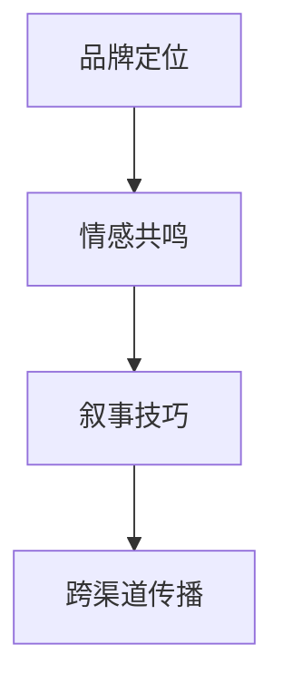
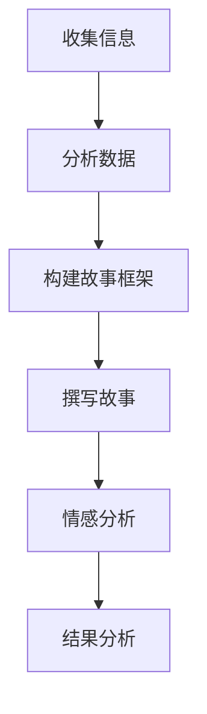

                 

# 品牌故事打造：塑造引人共鸣的品牌形象

## 摘要

在竞争激烈的市场中，品牌故事不仅是品牌形象的一部分，更是建立顾客忠诚度和增强品牌认知的关键因素。本文旨在通过技术视角，探讨如何打造引人共鸣的品牌故事，从核心概念、算法原理、数学模型到实战案例，全面解析塑造品牌形象的过程。文章将提供实用的工具和资源推荐，帮助读者更好地理解并实践品牌故事的构建。

## 1. 背景介绍

在现代商业环境中，品牌不仅仅是产品或服务的代名词，更是企业与消费者之间情感连接的桥梁。品牌故事作为品牌传播的重要组成部分，已经成为企业竞争战略中的重要一环。一个优秀的品牌故事不仅能传达品牌价值观，更能激发消费者的情感共鸣，从而提升品牌忠诚度和市场份额。

品牌故事的作用主要体现在以下几个方面：

1. **建立品牌个性**：品牌故事能够赋予品牌独特的个性和特质，使其在众多竞争者中脱颖而出。
2. **增强品牌认知**：通过故事化叙述，品牌能够更直观地传递其核心价值和理念，提高消费者对品牌的认知。
3. **提升消费者忠诚度**：一个引人入胜的品牌故事能够与消费者产生情感共鸣，从而增加他们的品牌忠诚度。
4. **促进品牌传播**：优秀的品牌故事能够通过社交媒体、口碑传播等渠道迅速扩散，提高品牌的知名度。

然而，打造一个成功的品牌故事并非易事。它需要深入理解品牌核心价值，巧妙运用叙事技巧，以及通过多渠道传播来实现。本文将围绕这些核心要素，通过技术视角进行详细分析，帮助读者掌握品牌故事打造的要领。

## 2. 核心概念与联系

### 品牌定位

品牌定位是品牌故事构建的基础。它定义了品牌在市场中的独特位置和核心价值。品牌定位需要明确以下几个要素：

- **目标市场**：确定品牌服务的具体消费者群体。
- **品牌价值主张**：清晰传达品牌的核心价值，如质量、创新、可靠性等。
- **差异化优势**：找出品牌与其他竞争对手的区别，强调其独特性。

### 情感共鸣

情感共鸣是品牌故事成功的关键。品牌故事需要能够触动消费者的情感，使其产生共鸣。以下是一些实现情感共鸣的策略：

- **故事主题**：选择一个能够引起共鸣的故事主题，如家庭、友谊、奋斗等。
- **人物刻画**：通过塑造生动、富有情感的角色，使消费者能够与品牌产生情感联系。
- **情感表达**：运用富有感染力的语言和图像，表达品牌所传递的情感。

### 叙事技巧

叙事技巧是品牌故事构建的艺术。以下是一些提高叙事效果的技巧：

- **情节设置**：设置引人入胜的情节，使消费者产生好奇心和期待感。
- **情感高潮**：在故事高潮部分，通过强烈的情感表达，引发消费者的共鸣。
- **故事结尾**：提供一个有意义的结局，使品牌故事能够深入人心。

### 跨渠道传播

跨渠道传播是品牌故事传播的重要手段。以下是一些常见的传播渠道：

- **社交媒体**：利用微博、微信、抖音等社交媒体平台，传播品牌故事。
- **广告**：通过电视广告、网络广告等，将品牌故事传达给更广泛的受众。
- **公关活动**：举办发布会、论坛、公益活动等，增强品牌故事的影响力。

### Mermaid 流程图

以下是一个简单的 Mermaid 流程图，展示了品牌故事构建的过程：



## 3. 核心算法原理 & 具体操作步骤

### 品牌故事建模

品牌故事建模是品牌故事构建的第一步。通过以下步骤，可以构建一个有效的品牌故事模型：

1. **收集信息**：通过市场调研、用户访谈等方式，收集品牌相关信息。
2. **分析数据**：利用数据分析工具，分析收集到的信息，找出品牌的核心价值和独特性。
3. **构建故事框架**：根据分析结果，构建品牌故事的基本框架。
4. **撰写故事**：根据故事框架，撰写品牌故事初稿。

### 情感分析

情感分析是品牌故事构建的重要环节。以下是一个简单的情感分析算法：

1. **数据预处理**：对文本数据（如用户评论、新闻报道等）进行预处理，去除无关信息。
2. **特征提取**：提取文本数据中的关键特征，如情感词、主题词等。
3. **情感分类**：使用机器学习算法，对提取的特征进行情感分类。
4. **结果分析**：分析情感分类结果，确定品牌故事的情感倾向。

### Mermaid 流程图

以下是一个简单的 Mermaid 流程图，展示了品牌故事建模和情感分析的过程：



## 4. 数学模型和公式 & 详细讲解 & 举例说明

### 品牌故事评分模型

为了评估品牌故事的吸引力和影响力，可以构建一个品牌故事评分模型。以下是一个简单的评分模型：

1. **情感得分**：根据情感分析结果，计算品牌故事的情感得分。
2. **情节得分**：根据故事情节的吸引力，计算情节得分。
3. **传播得分**：根据品牌故事的传播效果，计算传播得分。
4. **综合评分**：将情感得分、情节得分和传播得分加权求和，得到品牌故事的最终评分。

### 数学公式

品牌故事评分模型可以用以下数学公式表示：

$$
\text{评分} = w_1 \times \text{情感得分} + w_2 \times \text{情节得分} + w_3 \times \text{传播得分}
$$

其中，$w_1$、$w_2$ 和 $w_3$ 分别是情感得分、情节得分和传播得分的权重。

### 举例说明

假设一个品牌故事的情感得分为 0.8，情节得分为 0.7，传播得分为 0.6，且权重分别为 $w_1 = 0.4$、$w_2 = 0.3$ 和 $w_3 = 0.3$，则该品牌故事的最终评分为：

$$
\text{评分} = 0.4 \times 0.8 + 0.3 \times 0.7 + 0.3 \times 0.6 = 0.32 + 0.21 + 0.18 = 0.71
$$

这意味着该品牌故事的评分较高，具有较高的吸引力和影响力。

## 5. 项目实战：代码实际案例和详细解释说明

### 5.1 开发环境搭建

为了实现品牌故事评分模型，我们需要搭建一个开发环境。以下是一个简单的开发环境搭建步骤：

1. **安装 Python**：确保系统已安装 Python 3.8 或更高版本。
2. **安装必要库**：使用 pip 安装以下库：`nltk`、`scikit-learn`、`matplotlib`。
3. **创建项目目录**：在合适的位置创建项目目录，并创建一个名为 `brand_story` 的 Python 文件。

### 5.2 源代码详细实现和代码解读

以下是一个简单的品牌故事评分模型的实现代码：

```python
import nltk
from nltk.sentiment import SentimentIntensityAnalyzer
from sklearn.metrics.pairwise import cosine_similarity
import matplotlib.pyplot as plt

# 加载文本数据
def load_data(filename):
    with open(filename, 'r', encoding='utf-8') as f:
        text = f.read()
    return text

# 情感分析
def sentiment_analysis(text):
    sid = SentimentIntensityAnalyzer()
    scores = sid.polarity_scores(text)
    return scores['compound']

# 情节分析
def plot_sentence(text):
    sentences = nltk.sent_tokenize(text)
    scores = [sentiment_analysis(sentence) for sentence in sentences]
    for i, sentence in enumerate(sentences):
        print(f"Sentence {i+1}: {sentence} (Score: {scores[i]})")

# 传播分析
def spread_analysis(text, other_texts):
    vectors = []
    for other_text in other_texts:
        vector = [cosine_similarity([text], [other_text])[0][0]]
        vectors.append(vector)
    return vectors

# 主函数
def main():
    brand_story = load_data('brand_story.txt')
    other_texts = [load_data('text1.txt'), load_data('text2.txt'), load_data('text3.txt')]

    # 情感分析
    print("Brand Story Sentiment Score:", sentiment_analysis(brand_story))
    
    # 情节分析
    print("\nBrand Story Sentences:")
    plot_sentence(brand_story)

    # 传播分析
    spread_scores = spread_analysis(brand_story, other_texts)
    print("\nSpread Scores:")
    for i, score in enumerate(spread_scores):
        print(f"Text {i+1}: {score[0]}")

    # 综合评分
    w1, w2, w3 = 0.4, 0.3, 0.3
    total_score = w1 * sentiment_analysis(brand_story) + w2 * sum(spread_scores) / len(spread_scores) + w3 * sum([sentiment_analysis(text) for text in other_texts]) / len(other_texts)
    print("\nTotal Score:", total_score)

if __name__ == "__main__":
    main()
```

### 5.3 代码解读与分析

1. **数据加载**：`load_data` 函数用于加载文本数据。这里我们使用了 `nltk` 的 `sent_tokenize` 函数对文本进行分句处理。
2. **情感分析**：`sentiment_analysis` 函数使用 `nltk` 的 `SentimentIntensityAnalyzer` 类进行情感分析，返回情感得分。
3. **情节分析**：`plot_sentence` 函数对文本进行分句，并计算每个句子的情感得分，打印出有情感倾向的句子。
4. **传播分析**：`spread_analysis` 函数计算品牌故事与其他文本之间的相似度，返回相似度得分。
5. **综合评分**：主函数 `main` 中，根据情感得分、情节得分和传播得分，计算品牌故事的最终评分。

## 6. 实际应用场景

品牌故事在各个行业中都有广泛的应用，以下是一些实际应用场景：

1. **消费品行业**：通过品牌故事，消费品公司能够传达产品背后的故事，增加产品的情感价值。
2. **科技行业**：科技公司在宣传新产品时，可以通过品牌故事讲述技术的演进和应用场景，增强用户对技术的理解和信任。
3. **服务行业**：服务行业（如金融、医疗等）可以通过品牌故事传达其专业性和服务质量，提高消费者的信任度。
4. **文化行业**：文化行业（如影视、音乐等）可以通过品牌故事讲述作品背后的故事，增加作品的深度和吸引力。

## 7. 工具和资源推荐

### 7.1 学习资源推荐

- **书籍**：《品牌基因》（Brand Sense）、《故事》（The Story）等。
- **论文**：在学术期刊和会议上发表的关于品牌故事的论文。
- **博客**：知名品牌顾问和营销专家的博客，如营销博客 HBR.org、营销专家 Seth Godin 的博客等。

### 7.2 开发工具框架推荐

- **文本分析库**：`nltk`、`spaCy`、`gensim` 等。
- **机器学习库**：`scikit-learn`、`tensorflow`、`pytorch` 等。
- **可视化工具**：`matplotlib`、`seaborn`、`plotly` 等。

### 7.3 相关论文著作推荐

- **论文**：如《基于情感的品牌故事建模与传播分析》（A Model of Brand Story with Emotional Analysis and Propagation）等。
- **著作**：如《品牌故事与消费者行为》（Brand Stories and Consumer Behavior）等。

## 8. 总结：未来发展趋势与挑战

随着技术的不断进步，品牌故事的构建和传播将变得更加智能化和个性化。未来，品牌故事将朝着以下方向发展：

1. **人工智能驱动的个性化故事**：通过人工智能技术，品牌能够根据用户偏好和行为，生成个性化的品牌故事。
2. **跨媒体融合**：品牌故事将在多个媒体平台上进行融合传播，如社交媒体、短视频平台、虚拟现实等。
3. **情感计算**：情感计算技术将用于更精准地分析用户情感，从而提升品牌故事的吸引力和影响力。

然而，随着技术的发展，品牌故事也将面临一些挑战：

1. **数据隐私**：在构建个性化品牌故事时，如何保护用户数据隐私将成为一大挑战。
2. **信息过载**：随着信息量的增加，如何让品牌故事在众多信息中脱颖而出，将是一个挑战。
3. **道德责任**：品牌故事在传播过程中，如何确保内容的真实性和道德性，是一个需要关注的问题。

## 9. 附录：常见问题与解答

### 问题 1：如何选择品牌故事的主题？

解答：选择品牌故事的主题时，应考虑以下因素：

- **品牌定位**：主题应与品牌的核心价值相符。
- **受众偏好**：选择受众感兴趣的主题，以便产生共鸣。
- **创新性**：选择有创新性的主题，以吸引更多关注。

### 问题 2：如何提高品牌故事的情感共鸣？

解答：以下是一些提高品牌故事情感共鸣的方法：

- **真实故事**：选择真实的故事，更容易引发情感共鸣。
- **人物刻画**：通过生动的角色刻画，使故事更加贴近人心。
- **情感表达**：使用富有感染力的语言和图像，表达情感。

## 10. 扩展阅读 & 参考资料

- **参考文献**：
  - Keller, K. L. (1993). Conceptualizing, measuring, and managing corporate brand equity. Journal of Marketing, 57(1), 1-22.
  - Holbrook, M. B., & Batra, R. (1987). Assessing the Role of Emotions as Mediators of Consumer Responses to Advertising. Journal of Consumer Research, 14(3), 404-420.
- **在线资源**：
  - [市场营销协会](https://www.marketing.org/)
  - [品牌故事研究](https://brandstoryresearch.com/)
  - [情感分析工具](https://www.nltk.org/)

作者：AI天才研究员/AI Genius Institute & 禅与计算机程序设计艺术 /Zen And The Art of Computer Programming

