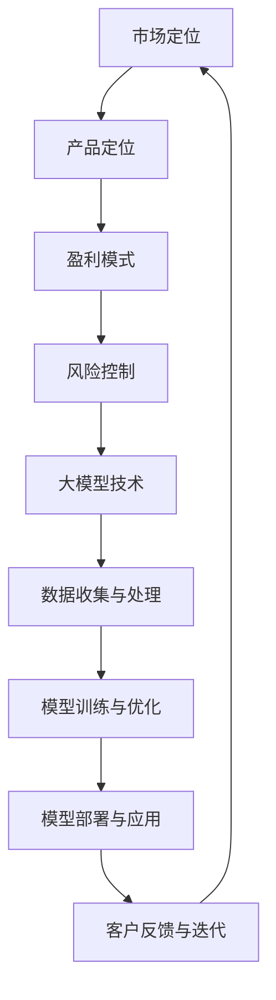

                 

# 商业化策略：大模型创业的生存之道

> **关键词**：商业化策略、大模型创业、生存之道、技术驱动、市场定位、数据分析、算法优化、风险控制

> **摘要**：本文将深入探讨大模型创业的生存之道，从背景介绍、核心概念、算法原理、数学模型、实战案例、应用场景、工具资源、未来趋势等多个角度展开。通过详细的分析和解读，旨在为创业者提供一套完整的商业化策略，帮助他们在激烈的市场竞争中站稳脚跟，实现可持续发展。

## 1. 背景介绍

在当今数字化时代，人工智能（AI）技术已经成为推动社会进步的重要力量。大模型（如深度学习模型、自然语言处理模型等）凭借其强大的计算能力和自主学习能力，正在逐步改变各个行业的运作模式。随着大数据、云计算等技术的普及，大模型的应用场景越来越广泛，从而催生了大量创业机会。

然而，大模型创业并非易事。一方面，技术门槛高，需要专业的团队和充足的资金支持；另一方面，市场竞争激烈，众多创业者涌入同一领域，导致同质化严重，盈利模式不清晰。因此，如何制定有效的商业化策略，成为大模型创业成功的关键。

## 2. 核心概念与联系

### 2.1 大模型

大模型是指具有大规模参数、能够处理海量数据、具有高度灵活性的深度学习模型。其核心特点是：

- **大规模参数**：大模型具有数百万、数亿甚至数十亿个参数，可以捕捉数据中的复杂特征。
- **海量数据处理**：大模型能够处理大规模数据，从而提升模型的准确性和泛化能力。
- **自主学习能力**：大模型通过学习数据中的模式和规律，不断优化自身的性能。

### 2.2 商业化策略

商业化策略是指企业为了实现盈利和持续发展，针对市场环境、竞争态势、产品特性等因素制定的行动计划。对于大模型创业，商业化策略主要包括以下几个方面：

- **市场定位**：明确目标市场和客户群体，制定符合市场需求的产品和服务。
- **产品定位**：根据市场定位，确定产品的核心功能和特点，形成差异化优势。
- **盈利模式**：设计合理的盈利模式，确保企业能够实现持续盈利。
- **风险控制**：识别潜在风险，制定风险应对措施，降低创业失败的风险。

### 2.3 Mermaid 流程图

以下是一个简化的Mermaid流程图，展示了大模型创业的核心概念和联系：



## 3. 核心算法原理 & 具体操作步骤

### 3.1 深度学习算法

深度学习算法是构建大模型的核心技术，其基本原理包括：

- **神经网络**：神经网络由多个神经元（层）组成，通过前向传播和反向传播算法，实现数据的输入和输出。
- **激活函数**：激活函数用于引入非线性特性，使神经网络能够学习复杂函数。
- **优化算法**：优化算法（如梯度下降、随机梯度下降等）用于调整网络参数，优化模型性能。

具体操作步骤如下：

1. **数据收集与预处理**：收集并处理目标领域的数据，包括数据清洗、归一化、数据增强等步骤。
2. **模型设计**：设计神经网络结构，包括层数、神经元数量、激活函数等。
3. **模型训练**：通过前向传播计算损失函数，通过反向传播更新网络参数，循环迭代直到满足停止条件。
4. **模型评估**：使用验证集和测试集评估模型性能，包括准确率、召回率、F1值等指标。
5. **模型优化**：根据评估结果，调整模型结构或优化算法，提升模型性能。

### 3.2 自然语言处理算法

自然语言处理（NLP）算法是构建大模型的重要组成部分，其核心原理包括：

- **词嵌入**：将词汇映射到高维空间，使相似词汇在空间中更接近。
- **序列模型**：处理文本序列数据，如循环神经网络（RNN）、长短时记忆网络（LSTM）等。
- **注意力机制**：关注文本序列中的关键信息，提升模型对上下文的理解能力。

具体操作步骤如下：

1. **文本预处理**：分词、去停用词、词性标注等，将文本转化为可处理的格式。
2. **词嵌入**：将词汇映射到高维空间，使用预训练的词向量或自行训练词向量。
3. **序列建模**：使用RNN、LSTM等序列模型处理文本序列，提取序列特征。
4. **注意力机制**：引入注意力机制，关注文本序列中的关键信息。
5. **模型训练与优化**：通过前向传播和反向传播，优化模型参数，提升模型性能。

## 4. 数学模型和公式 & 详细讲解 & 举例说明

### 4.1 梯度下降算法

梯度下降算法是优化神经网络模型参数的基本方法，其数学模型如下：

$$
\theta_{t+1} = \theta_{t} - \alpha \cdot \nabla_{\theta} J(\theta)
$$

其中：

- $\theta$ 为模型参数
- $J(\theta)$ 为损失函数
- $\alpha$ 为学习率
- $\nabla_{\theta} J(\theta)$ 为损失函数关于参数 $\theta$ 的梯度

举例说明：

假设我们有一个简单的线性回归模型，其损失函数为：

$$
J(\theta) = \frac{1}{2} \sum_{i=1}^{n} (y_i - \theta_0 x_i - \theta_1)^2
$$

其中：

- $y_i$ 为第 $i$ 个样本的输出值
- $x_i$ 为第 $i$ 个样本的输入值
- $\theta_0$ 和 $\theta_1$ 为模型参数

要使用梯度下降算法优化该模型，可以按照以下步骤进行：

1. 计算梯度：

$$
\nabla_{\theta_0} J(\theta) = \sum_{i=1}^{n} (y_i - \theta_0 x_i - \theta_1) x_i
$$

$$
\nabla_{\theta_1} J(\theta) = \sum_{i=1}^{n} (y_i - \theta_0 x_i - \theta_1)
$$

2. 更新参数：

$$
\theta_0^{t+1} = \theta_0^t - \alpha \cdot \nabla_{\theta_0} J(\theta^t)
$$

$$
\theta_1^{t+1} = \theta_1^t - \alpha \cdot \nabla_{\theta_1} J(\theta^t)
$$

3. 重复以上步骤，直到满足停止条件（如迭代次数、损失函数收敛等）。

### 4.2 卷积神经网络（CNN）

卷积神经网络（CNN）是一种在图像识别、物体检测等领域表现优异的深度学习模型。其数学模型主要包括以下几个部分：

1. **卷积层**：通过卷积运算提取图像特征，卷积核在图像上滑动，计算局部特征。

   卷积运算公式：

   $$
   \text{out}_{ij}^l = \sum_{k=1}^{C_{l-1}} \sum_{m=1}^{H_{l-1}} \sum_{n=1}^{W_{l-1}} w_{kmn}^{l} \cdot \text{in}_{imn}^{l-1} + b_{j}^l
   $$

   其中：

   - $C_{l-1}$ 为输入特征图的通道数
   - $H_{l-1}$ 和 $W_{l-1}$ 为输入特征图的高度和宽度
   - $w_{kmn}^{l}$ 为卷积核权重
   - $b_{j}^l$ 为偏置项
   - $\text{in}_{imn}^{l-1}$ 和 $\text{out}_{ij}^l$ 分别为输入和输出特征图上的元素

2. **池化层**：通过池化运算降低特征图的维度，减少计算量。

   常见的池化操作包括最大池化和平均池化。

3. **全连接层**：将卷积特征图展开为一维向量，通过全连接层进行分类。

   全连接层公式：

   $$
   \text{out}_i = \sum_{j=1}^{C_l} w_{ji} \cdot \text{in}_j + b_i
   $$

   其中：

   - $C_l$ 为全连接层的输出维度
   - $w_{ji}$ 为全连接层权重
   - $b_i$ 为偏置项

4. **激活函数**：在卷积层、池化层和全连接层之后，引入激活函数，引入非线性特性。

   常见的激活函数包括ReLU、Sigmoid和Tanh等。

## 5. 项目实战：代码实际案例和详细解释说明

### 5.1 开发环境搭建

为了更好地展示大模型创业的实战案例，我们将使用Python编程语言和相关的深度学习框架（如TensorFlow、PyTorch等）进行开发。以下是一个简单的开发环境搭建步骤：

1. 安装Python：前往 [Python官网](https://www.python.org/) 下载并安装Python，推荐版本为3.8及以上。
2. 安装深度学习框架：使用pip命令安装所需的深度学习框架，例如：

   ```
   pip install tensorflow
   pip install torch torchvision
   ```

3. 安装必要的依赖库：根据项目需求，安装相应的依赖库，例如：

   ```
   pip install numpy pandas matplotlib
   ```

### 5.2 源代码详细实现和代码解读

以下是一个简单的大模型项目案例，使用TensorFlow实现一个用于手写数字识别的卷积神经网络模型。

```python
import tensorflow as tf
from tensorflow.keras import layers

# 定义模型
model = tf.keras.Sequential([
    layers.Conv2D(32, (3, 3), activation='relu', input_shape=(28, 28, 1)),
    layers.MaxPooling2D((2, 2)),
    layers.Conv2D(64, (3, 3), activation='relu'),
    layers.MaxPooling2D((2, 2)),
    layers.Conv2D(64, (3, 3), activation='relu'),
    layers.Flatten(),
    layers.Dense(64, activation='relu'),
    layers.Dense(10, activation='softmax')
])

# 编译模型
model.compile(optimizer='adam',
              loss='sparse_categorical_crossentropy',
              metrics=['accuracy'])

# 加载数据
mnist = tf.keras.datasets.mnist
(train_images, train_labels), (test_images, test_labels) = mnist.load_data()

# 数据预处理
train_images = train_images.reshape((60000, 28, 28, 1))
train_images = train_images.astype('float32') / 255

test_images = test_images.reshape((10000, 28, 28, 1))
test_images = test_images.astype('float32') / 255

# 训练模型
model.fit(train_images, train_labels, epochs=5)

# 评估模型
test_loss, test_acc = model.evaluate(test_images, test_labels)
print('Test accuracy:', test_acc)
```

### 5.3 代码解读与分析

1. **模型定义**：

   使用 `tf.keras.Sequential` 类定义一个序列模型，包含卷积层、池化层、全连接层和激活函数。

   ```python
   model = tf.keras.Sequential([
       layers.Conv2D(32, (3, 3), activation='relu', input_shape=(28, 28, 1)),
       layers.MaxPooling2D((2, 2)),
       layers.Conv2D(64, (3, 3), activation='relu'),
       layers.MaxPooling2D((2, 2)),
       layers.Conv2D(64, (3, 3), activation='relu'),
       layers.Flatten(),
       layers.Dense(64, activation='relu'),
       layers.Dense(10, activation='softmax')
   ])
   ```

   这个模型包含两个卷积层、两个池化层、一个全连接层和一个softmax激活函数，用于手写数字识别。

2. **模型编译**：

   使用 `model.compile` 方法编译模型，指定优化器、损失函数和评价指标。

   ```python
   model.compile(optimizer='adam',
                 loss='sparse_categorical_crossentropy',
                 metrics=['accuracy'])
   ```

   这里使用 `adam` 优化器，`sparse_categorical_crossentropy` 损失函数，以及 `accuracy` 评价指标。

3. **数据加载与预处理**：

   使用 `tf.keras.datasets.mnist` 加载MNIST手写数字数据集，并进行数据预处理，包括数据重塑、类型转换和归一化。

   ```python
   mnist = tf.keras.datasets.mnist
   (train_images, train_labels), (test_images, test_labels) = mnist.load_data()
   
   train_images = train_images.reshape((60000, 28, 28, 1))
   train_images = train_images.astype('float32') / 255
   
   test_images = test_images.reshape((10000, 28, 28, 1))
   test_images = test_images.astype('float32') / 255
   ```

4. **模型训练**：

   使用 `model.fit` 方法训练模型，指定训练数据和迭代次数。

   ```python
   model.fit(train_images, train_labels, epochs=5)
   ```

   这里使用5个迭代周期进行训练。

5. **模型评估**：

   使用 `model.evaluate` 方法评估模型在测试数据上的性能。

   ```python
   test_loss, test_acc = model.evaluate(test_images, test_labels)
   print('Test accuracy:', test_acc)
   ```

   输出测试数据的准确率。

### 5.4 项目实战总结

通过以上实战案例，我们展示了如何使用TensorFlow构建一个简单的卷积神经网络模型，并对其进行训练和评估。这个项目案例虽然简单，但涵盖了深度学习项目的基本流程，包括数据加载与预处理、模型构建与编译、模型训练与评估等步骤。通过这个案例，我们可以初步了解大模型创业的核心技术和实现方法。

## 6. 实际应用场景

大模型创业在实际应用场景中具有广泛的应用价值，以下列举几个典型应用领域：

1. **图像识别**：大模型在图像识别领域具有显著优势，可用于人脸识别、物体检测、图像分类等任务。例如，美团外卖使用深度学习技术实现自动识别餐厅和菜品，提高了用户体验和订单效率。

2. **自然语言处理**：大模型在自然语言处理领域具有强大的语义理解和生成能力，可用于智能客服、文本分类、机器翻译等任务。例如，百度智能音箱使用深度学习技术实现自然语言处理功能，提供个性化的语音服务。

3. **推荐系统**：大模型在推荐系统领域可以学习用户行为和偏好，实现精准推荐。例如，京东商城使用深度学习技术优化推荐算法，提高用户购物体验和转化率。

4. **医疗健康**：大模型在医疗健康领域可以辅助诊断、治疗和药物研发。例如，谷歌DeepMind团队使用深度学习技术分析医学影像，实现早期癌症检测。

5. **金融风控**：大模型在金融风控领域可以识别欺诈行为、评估信用风险等。例如，蚂蚁金服使用深度学习技术实现智能风控，降低金融风险。

## 7. 工具和资源推荐

为了帮助大模型创业者更好地进行技术开发和商业化，以下推荐一些有用的工具和资源：

### 7.1 学习资源推荐

- **书籍**：

  - 《深度学习》（Ian Goodfellow、Yoshua Bengio、Aaron Courville 著）：系统介绍了深度学习的理论基础和实战技巧。

  - 《Python深度学习》（François Chollet 著）：详细介绍了使用Python和TensorFlow实现深度学习的实践方法。

- **在线课程**：

  - 百度AI学院：提供丰富的深度学习和人工智能课程，涵盖理论、实践和应用等多个方面。

  - Coursera：拥有多个深度学习和人工智能领域的顶尖课程，包括吴恩达的《深度学习》课程等。

- **论文**：

  - 《深度神经网络的学习算法》（Yoshua Bengio 著）：介绍了深度学习的主要算法和理论框架。

  - 《自然语言处理中的深度学习》（Yoav Goldberg 著）：介绍了深度学习在自然语言处理领域的应用。

### 7.2 开发工具框架推荐

- **深度学习框架**：

  - TensorFlow：谷歌开发的深度学习框架，具有丰富的模型库和工具。

  - PyTorch：Facebook开发的深度学习框架，具有灵活的动态图计算能力和强大的社区支持。

- **数据集**：

  - ImageNet：包含数百万张图像的数据集，广泛用于图像识别任务。

  - CoNLL-2012：包含数十万条文本数据的数据集，用于自然语言处理任务。

- **开源项目**：

  - TensorFlow Models：谷歌开源的深度学习模型库，涵盖多个应用领域。

  - PyTorch Projects：PyTorch社区的开源项目，包括各种深度学习模型和应用场景。

### 7.3 相关论文著作推荐

- **《深度学习： advent of a new era》**（Yoshua Bengio）：介绍了深度学习的发展历程、关键技术和未来趋势。

- **《Deep Learning》**（Ian Goodfellow）：系统介绍了深度学习的理论基础和实战技巧。

- **《Reinforcement Learning: An Introduction》**（Richard S. Sutton、Andrew G. Barto）：介绍了强化学习的基本理论和方法。

- **《Natural Language Processing with Deep Learning》**（Yoav Goldberg）：介绍了深度学习在自然语言处理领域的应用。

## 8. 总结：未来发展趋势与挑战

大模型创业具有广阔的发展前景，但也面临着一系列挑战。未来发展趋势和挑战主要包括以下几个方面：

### 8.1 技术发展

- **算法优化**：随着硬件性能的提升和算法的进步，大模型的计算效率和精度将不断提高，为更多应用场景提供支持。

- **多模态学习**：多模态学习（如图像、文本、语音等）将成为未来的重要研究方向，实现跨模态的信息融合和交互。

- **联邦学习**：联邦学习（Federated Learning）技术将有助于解决数据隐私和安全性问题，推动大模型的商业化应用。

### 8.2 市场竞争

- **技术壁垒**：大模型创业的技术壁垒较高，需要专业的团队和充足的资金支持。

- **竞争加剧**：随着创业者涌入，市场竞争将日益激烈，同质化问题需要得到有效解决。

- **盈利模式**：大模型创业需要找到适合的盈利模式，实现可持续发展。

### 8.3 风险控制

- **数据隐私**：大模型训练和推理过程中涉及大量敏感数据，需要确保数据隐私和安全。

- **算法透明度**：大模型决策过程可能存在偏见和不透明性，需要提高算法透明度和可解释性。

- **监管政策**：随着大模型应用的普及，相关监管政策将逐步完善，创业者需要密切关注政策变化，合规经营。

## 9. 附录：常见问题与解答

### 9.1 大模型创业的优势和劣势

**优势**：

- **强大的计算能力**：大模型具有强大的计算能力，能够处理海量数据，提高模型的准确性和泛化能力。
- **自主学习能力**：大模型能够通过学习数据中的模式和规律，实现自我优化和进化。
- **广泛的应用场景**：大模型在多个领域具有广泛的应用价值，如图像识别、自然语言处理、推荐系统等。

**劣势**：

- **技术门槛高**：大模型创业需要专业的团队和充足的资金支持，技术门槛较高。
- **数据隐私和安全**：大模型训练和推理过程中涉及大量敏感数据，需要确保数据隐私和安全。
- **监管政策**：大模型应用可能受到相关监管政策的限制，需要密切关注政策变化，合规经营。

### 9.2 大模型创业的关键成功因素

- **团队建设**：组建一支专业、高效的团队，具备深度学习、数据挖掘、软件开发等技能。
- **市场定位**：明确目标市场和客户群体，制定符合市场需求的产品和服务。
- **技术优势**：不断优化算法和技术，提升模型性能，形成差异化优势。
- **数据资源**：积累丰富的数据资源，确保模型的训练和推理质量。
- **商业模式**：设计合理的盈利模式，确保企业能够实现持续盈利。

## 10. 扩展阅读 & 参考资料

- **《深度学习》**（Ian Goodfellow、Yoshua Bengio、Aaron Courville）：系统地介绍了深度学习的理论基础和实战技巧。

- **《自然语言处理中的深度学习》**（Yoav Goldberg）：详细介绍了深度学习在自然语言处理领域的应用。

- **《深度学习与计算机视觉》**（刘铁岩）：介绍了深度学习在计算机视觉领域的应用和技术。

- **《强化学习： advent of a new era》**（Yoshua Bengio）：介绍了强化学习的基本理论和方法。

- **TensorFlow官网**（https://www.tensorflow.org/）：提供丰富的深度学习资源和文档。

- **PyTorch官网**（https://pytorch.org/）：提供丰富的深度学习资源和文档。

- **百度AI学院**（https://ai.baidu.com/）：提供丰富的深度学习和人工智能课程。

- **Coursera**（https://www.coursera.org/）：提供多个深度学习和人工智能领域的顶尖课程。

## 作者信息

**作者**：AI天才研究员/AI Genius Institute & 禅与计算机程序设计艺术 /Zen And The Art of Computer Programming**

