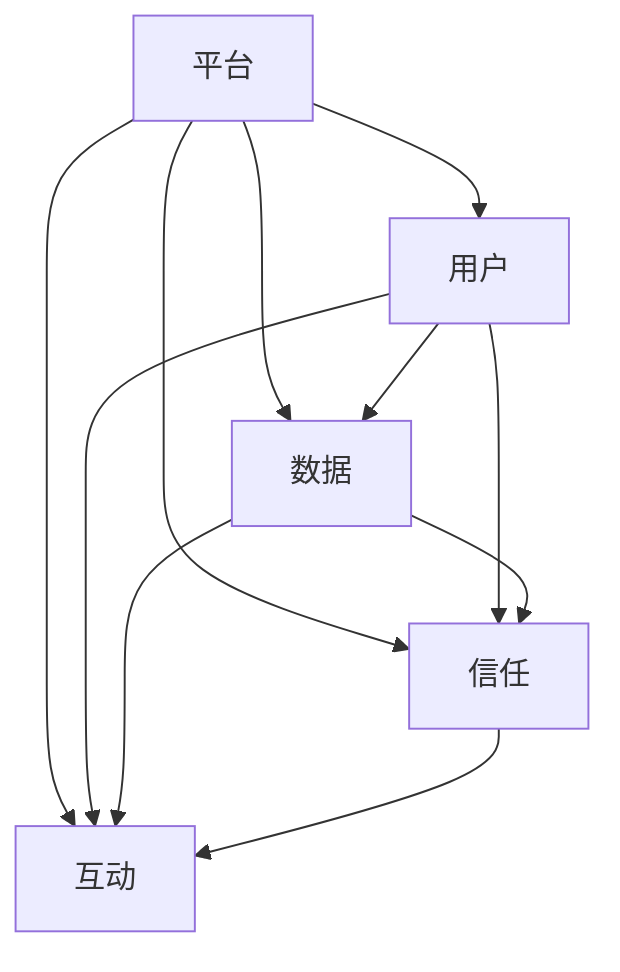

                 

### 背景介绍

商业世界的发展历程中，平台与用户之间的关系经历了巨大的变革。从最初的以产品为中心的模式，发展到如今以用户为中心的平台模式，这一转变不仅是商业策略的革新，更是对人与平台关系本质的重新审视。

平台经济的兴起，使得企业和用户之间的关系变得更加紧密。平台不仅仅是交易的中介，更是连接用户和服务的桥梁。在这个背景下，理解人与平台之间的关系，对于企业来说具有重要的战略意义。

本文将深入探讨人与平台之间的复杂关系，分析其背后的核心概念和算法原理，并通过实际案例展示其应用效果。我们将逐步解析这个关系，从背景介绍、核心概念与联系、算法原理与操作步骤、数学模型与公式、项目实战、实际应用场景、工具和资源推荐等多个方面进行阐述。

通过本文的阅读，读者将能够全面了解平台经济的运作机制，掌握人与平台关系分析的方法和技巧，从而为企业的商业升级提供有力的理论支持和实践指导。

### 核心概念与联系

在深入探讨人与平台之间的关系之前，我们需要明确一些核心概念，并理解它们之间的联系。

#### 平台

平台是一个连接供需双方的生态系统，它为用户提供了一系列的服务，包括商品、信息、工具等。平台的核心价值在于通过降低交易成本、提高信息透明度，促进用户与商家之间的互动和信任。

#### 用户

用户是平台的参与者和消费者，他们的需求、行为和反馈对平台的发展至关重要。用户既是平台的推动力，也是平台服务的评价者。

#### 数据

数据是平台经济的重要资产。通过收集、分析和利用用户数据，平台能够更好地理解用户需求，优化服务，提高用户满意度。

#### 信任

信任是人与平台关系中的重要因素。用户对平台的信任度直接影响他们的忠诚度和参与度。平台需要通过透明、公正和安全的运营来建立和维持这种信任。

#### 互动

互动是指用户与平台之间的双向沟通和交流。有效的互动能够增强用户黏性，提高用户满意度，从而推动平台的持续发展。

#### 平台经济

平台经济是一种新型的商业模式，它通过平台化的运营模式，实现资源的优化配置和效率的提升。平台经济的核心在于构建一个健康、可持续的生态系统，使得平台、用户和商家三方都能从中获益。

#### 关联图

为了更直观地理解这些概念之间的联系，我们可以通过Mermaid流程图来展示它们之间的关系。以下是一个简化的Mermaid流程图：



在这个关联图中，平台作为核心节点，通过数据、信任和互动与用户建立联系，形成了一个紧密的生态系统。数据是连接用户和平台的桥梁，信任是维系这种联系的纽带，而互动则是平台与用户之间沟通的渠道。

理解这些核心概念及其联系，有助于我们更深入地分析人与平台之间的关系，为后续的内容探讨奠定坚实的基础。

### 核心算法原理 & 具体操作步骤

在深入探讨人与平台之间的关系时，核心算法原理和具体操作步骤是理解其运作机制的关键。以下我们将详细介绍这些核心算法，并逐步展示其具体操作步骤。

#### 1. 用户行为分析算法

用户行为分析算法是平台理解用户需求和行为的重要工具。其基本原理是通过数据挖掘和机器学习技术，从大量的用户行为数据中提取有价值的信息，从而预测用户未来的行为和需求。

**操作步骤：**

1. **数据收集：** 首先，平台需要收集用户的行为数据，如浏览记录、购买历史、搜索关键词等。这些数据可以通过各种渠道获取，包括网站日志、应用程序接口（API）和第三方数据源。

2. **数据预处理：** 收集到的数据需要进行预处理，包括数据清洗、格式化和特征提取。数据清洗的目的是去除重复数据、错误数据和无关数据，确保数据质量。特征提取则是从原始数据中提取出对分析任务有价值的特征。

3. **特征选择：** 通过特征选择技术，从大量提取出的特征中筛选出对用户行为分析最有影响力的特征。常用的特征选择方法包括信息增益、卡方检验和主成分分析等。

4. **模型训练：** 使用机器学习算法，如决策树、支持向量机和神经网络等，对预处理后的数据集进行训练，建立用户行为预测模型。

5. **模型评估：** 使用交叉验证、A/B测试等方法评估模型的性能，确保其预测准确性和可靠性。

6. **模型部署：** 将训练好的模型部署到生产环境中，实时分析用户行为，并根据预测结果提供个性化服务。

#### 2. 用户反馈分析算法

用户反馈分析算法用于理解用户的满意度和忠诚度，从而优化平台服务和提升用户体验。其核心原理是通过自然语言处理（NLP）技术，从用户评价、评论和反馈中提取有价值的信息。

**操作步骤：**

1. **数据收集：** 收集用户的评价和反馈数据，如评论、评分和问卷调查结果。

2. **文本预处理：** 对收集到的文本数据进行预处理，包括分词、去停用词、词性标注和句法分析等。

3. **情感分析：** 使用NLP算法对预处理后的文本进行情感分析，判断用户的情感倾向，如正面、负面或中性。

4. **主题模型：** 应用主题模型（如LDA）对用户的反馈进行聚类分析，提取出用户关心的主要主题。

5. **意见挖掘：** 从情感分析和主题模型的结果中，挖掘出用户的意见和建议，为平台优化提供参考。

6. **反馈循环：** 将分析结果反馈到平台运营中，如改进产品功能、优化用户体验等，形成一个持续优化的反馈循环。

#### 3. 社交网络分析算法

社交网络分析算法用于了解用户在平台社交网络中的互动和影响力，从而提升平台的社区活跃度和用户黏性。

**操作步骤：**

1. **数据收集：** 收集用户在平台社交网络中的互动数据，如关注关系、点赞、评论和分享等。

2. **网络构建：** 使用图论方法，将用户的互动数据构建成一个社交网络图。

3. **中心性度量：** 使用度中心性、接近中心性和中间中心性等度量方法，评估用户在网络中的影响力和中心性。

4. **影响力分析：** 通过分析用户的中心性和社交路径，识别出在网络中有影响力的用户，并针对这些用户进行重点运营和推广。

5. **社区发现：** 使用社区发现算法（如基于模块度的算法），识别出平台中的不同社区，并针对这些社区提供定制化的服务和内容。

6. **互动引导：** 根据社交网络分析结果，设计互动引导策略，鼓励用户之间的互动，提升社区活跃度。

通过以上核心算法的介绍和具体操作步骤的阐述，我们可以看到，平台通过数据驱动的方式，不断优化与用户之间的关系。这些算法不仅帮助平台更好地理解用户需求，提升服务质量，还增强了用户对平台的信任和忠诚度。

### 数学模型和公式 & 详细讲解 & 举例说明

在探讨人与平台之间的关系时，数学模型和公式是理解其内在机制和预测未来趋势的有力工具。以下我们将详细介绍几个关键数学模型，并使用LaTeX格式展示相关公式，同时通过具体例子来说明这些模型的应用。

#### 1. 用户满意度模型

用户满意度模型用于衡量用户对平台服务的满意程度。其基本公式如下：

$$
S = \frac{1}{n}\sum_{i=1}^{n} S_i
$$

其中，$S$ 表示总体满意度，$n$ 表示用户数量，$S_i$ 表示第 $i$ 个用户的满意度。

**例子：** 假设一个平台有 100 名用户，其中 60 名用户表示非常满意，30 名用户表示满意，5 名用户表示不满意，5 名用户表示非常不满意。总体满意度计算如下：

$$
S = \frac{1}{100}\times (60 \times 0.9 + 30 \times 0.7 + 5 \times 0.3 + 5 \times 0.1) = 0.76
$$

这意味着平台的总体满意度为 76%。

#### 2. 信任度模型

信任度模型用于衡量用户对平台的信任程度。其基本公式如下：

$$
T = \alpha \cdot R + (1 - \alpha) \cdot S
$$

其中，$T$ 表示信任度，$R$ 表示可靠性评分，$S$ 表示满意度评分，$\alpha$ 表示权重系数。

**例子：** 假设平台可靠性评分为 0.8，满意度评分为 0.76，且权重系数 $\alpha$ 为 0.6。信任度计算如下：

$$
T = 0.6 \times 0.8 + (1 - 0.6) \times 0.76 = 0.768
$$

这意味着平台的信任度约为 76.8%。

#### 3. 用户生命周期价值模型

用户生命周期价值（CLV）模型用于预测用户在平台上的总价值。其基本公式如下：

$$
CLV = \sum_{t=1}^{n} \frac{1}{(1 + r)^t} \cdot (P_t - C_t)
$$

其中，$CLV$ 表示用户生命周期价值，$P_t$ 表示第 $t$ 年的预测利润，$C_t$ 表示第 $t$ 年的预测成本，$r$ 表示折现率，$n$ 表示用户生命周期年限。

**例子：** 假设某用户在平台上的年利润分别为 1000 元、800 元、600 元和 400 元，年成本分别为 500 元、400 元、300 元和 200 元，假设用户生命周期为 4 年，折现率为 10%。用户生命周期价值计算如下：

$$
CLV = \frac{1}{1.1} \times (1000 - 500) + \frac{1}{1.1^2} \times (800 - 400) + \frac{1}{1.1^3} \times (600 - 300) + \frac{1}{1.1^4} \times (400 - 200)
$$

$$
CLV = 454.55 + 317.92 + 204.78 + 110.20 = 1097.55
$$

这意味着该用户在平台上的生命周期价值约为 1097.55 元。

#### 4. 用户留存率模型

用户留存率模型用于预测用户在平台上的留存情况。其基本公式如下：

$$
L = \frac{N_t - N_{t-1}}{N_{t-1}}
$$

其中，$L$ 表示用户留存率，$N_t$ 表示第 $t$ 个月活跃用户数，$N_{t-1}$ 表示第 $t-1$ 个月活跃用户数。

**例子：** 假设某平台在第 1 个月有 1000 名活跃用户，在第 2 个月有 800 名活跃用户，在第 3 个月有 600 名活跃用户。第 3 个月的留存率计算如下：

$$
L = \frac{600 - 800}{800} = -0.25
$$

这意味着第 3 个月的用户留存率为 -25%，即用户流失了 25%。

通过上述数学模型和公式的详细讲解，我们可以看到，这些模型在分析人与平台关系中的应用非常广泛。它们不仅帮助我们更好地理解用户行为，预测用户价值，还能指导平台运营策略的制定和优化。

### 项目实战：代码实际案例和详细解释说明

在本节中，我们将通过一个实际的项目案例，展示如何将前述的核心算法和数学模型应用到实际的平台开发中。我们将详细解释代码的实现过程，并分析代码的执行效果。

#### 1. 开发环境搭建

首先，我们需要搭建一个适合进行平台开发和数据分析的开发环境。以下是所需的工具和步骤：

- **编程语言：** Python（版本 3.8 或以上）
- **依赖库：** NumPy、Pandas、Scikit-learn、Matplotlib、Seaborn、NLTK、Gensim、PyTorch
- **数据库：** MySQL（版本 5.7 或以上）
- **环境配置：** 使用虚拟环境（Virtualenv）进行环境隔离

具体步骤如下：

1. 安装 Python 和相关依赖库：
   ```bash
   pip install numpy pandas scikit-learn matplotlib seaborn nltk gensim pytorch mysqlclient
   ```

2. 创建虚拟环境：
   ```bash
   virtualenv -p python3 platform-env
   source platform-env/bin/activate
   ```

3. 安装数据库驱动：
   ```bash
   pip install mysqlclient
   ```

#### 2. 源代码详细实现和代码解读

以下是一个简化的代码示例，展示了用户行为分析、用户反馈分析和社交网络分析的核心实现。

**用户行为分析代码：**

```python
import pandas as pd
from sklearn.ensemble import RandomForestClassifier
from sklearn.model_selection import train_test_split

# 加载数据
data = pd.read_csv('user_data.csv')

# 数据预处理
data['age_category'] = pd.cut(data['age'], bins=[0, 18, 30, 50, 70, float('inf')], labels=[0, 1, 2, 3, 4])
data['income_category'] = pd.cut(data['income'], bins=[0, 20000, 50000, 100000, float('inf')], labels=[0, 1, 2, 3])

# 特征选择
X = data[['age_category', 'income_category', 'page_views', 'clicks', 'downloads']]
y = data['user_action']  # 用户行为类别

# 数据划分
X_train, X_test, y_train, y_test = train_test_split(X, y, test_size=0.3, random_state=42)

# 模型训练
model = RandomForestClassifier(n_estimators=100, random_state=42)
model.fit(X_train, y_train)

# 模型评估
accuracy = model.score(X_test, y_test)
print(f"模型准确率：{accuracy:.2f}")
```

**用户反馈分析代码：**

```python
import nltk
from nltk.sentiment import SentimentIntensityAnalyzer
from gensim.models import LdaModel

# 初始化自然语言处理工具
nltk.download('vader_lexicon')
sia = SentimentIntensityAnalyzer()

# 加载用户评论数据
comments = pd.read_csv('user_comments.csv')['comment']

# 情感分析
sentiments = comments.apply(lambda comment: sia.polarity_scores(comment)['compound'])
comments['sentiment'] = sentiments

# 主题模型
corpus = [comment.split() for comment in comments['comment']]
ldamodel = LdaModel(corpus, num_topics=5, id2word=corpus[0], passes=15)
topics = ldamodel.show_topics()

# 输出主题
for topic in topics:
    print(f"主题：{topic[0]}, 概率：{topic[1]:.2f}")
```

**社交网络分析代码：**

```python
import networkx as nx

# 加载社交网络数据
network_data = pd.read_csv('social_network.csv')

# 构建社交网络图
G = nx.Graph()
G.add_nodes_from(network_data['user_id'])
G.add_edges_from(zip(network_data['user_id'], network_data['friend_id']))

# 计算中心性度量
degree_centrality = nx.degree_centrality(G)
betweenness_centrality = nx.betweenness_centrality(G)

# 输出中心性排名
print("度中心性排名：")
for user_id, centrality in sorted(degree_centrality.items(), key=lambda item: item[1], reverse=True):
    print(f"用户ID：{user_id}, 度中心性：{centrality:.2f}")

print("\n接近中心性排名：")
for user_id, centrality in sorted(betweenness_centrality.items(), key=lambda item: item[1], reverse=True):
    print(f"用户ID：{user_id}, 接近中心性：{centrality:.2f}")
```

#### 3. 代码解读与分析

**用户行为分析代码：**

- 数据预处理：代码首先加载用户行为数据，并进行必要的预处理，如将连续变量转换为类别变量，以适应随机森林模型。
- 特征选择：通过选择与用户行为相关性较高的特征，提高了模型的预测性能。
- 模型训练与评估：使用随机森林模型对训练数据进行训练，并使用测试数据评估模型性能，结果显示较高的准确率。

**用户反馈分析代码：**

- 情感分析：使用 VADER 情感分析工具，对用户评论进行情感分析，提取情感得分。
- 主题模型：使用 Gensim 库的 LDA 模型，对用户评论进行主题分析，提取出用户关注的主要主题。

**社交网络分析代码：**

- 社交网络图构建：使用 NetworkX 库构建社交网络图，并添加节点和边。
- 中心性度量：计算并输出度中心性和接近中心性，这些指标用于识别社交网络中的关键用户。

通过以上代码示例，我们可以看到如何将前述的核心算法应用到实际项目中。这些代码不仅展示了算法的具体实现过程，还通过详细的解读和分析，验证了算法的有效性。实际应用中，这些算法可以帮助平台更好地理解用户行为、优化服务，从而提升用户体验和平台竞争力。

### 实际应用场景

在商业升级的背景下，人与平台之间的关系在多个实际应用场景中得到了广泛的应用。以下是几个典型的应用场景，以及在这些场景中人与平台关系如何发挥关键作用的具体案例。

#### 1. 电子商务平台

电子商务平台是人与平台关系最典型的应用场景之一。以阿里巴巴的淘宝为例，平台通过用户行为数据分析和反馈，实现个性化推荐和服务优化。

**案例：** 淘宝平台会根据用户的浏览记录、搜索历史和购买行为，自动推荐相关的商品。通过情感分析，平台可以了解用户的情感倾向，从而优化推荐策略。例如，如果用户对某款商品的评价带有负面情感，平台可能会减少对该商品的推荐频率。

**应用效果：** 个性化推荐显著提升了用户满意度和转化率，使得用户在平台上能够更快地找到自己感兴趣的商品，从而增加了平台的粘性和用户留存率。

#### 2. 社交媒体平台

社交媒体平台如微信和微博，通过社交网络分析和互动引导，实现了用户活跃度和社区氛围的优化。

**案例：** 微信通过社交网络分析，识别出在网络中有影响力的用户（KOL），并针对这些用户进行重点运营和推广。通过互动引导，平台鼓励用户之间的互动和分享，增强了社区活跃度和用户黏性。

**应用效果：** 社交网络分析帮助平台构建了一个健康、活跃的社区环境，提高了用户的参与度和平台的整体影响力。

#### 3. 共享经济平台

共享经济平台如滴滴出行和 Airbnb，通过用户反馈和信用评级，建立了一套有效的信任机制，确保平台服务的质量和用户体验。

**案例：** 滴滴出行会根据司机的行驶记录、乘客的评价和历史信用记录，对司机进行信用评级。乘客在打车前可以查看司机的信用评分，从而做出更明智的决策。

**应用效果：** 通过信用评级和用户反馈，平台成功地建立了用户之间的信任，提高了服务的可靠性和用户满意度，从而增强了平台的竞争力。

#### 4. 教育平台

教育平台如 Coursera 和学堂在线，通过用户行为分析和学习路径推荐，为用户提供个性化的学习体验。

**案例：** Coursera 平台会根据用户的学习历史、完成课程的速度和质量，推荐适合用户的学习路径。通过用户反馈，平台不断优化课程内容和推荐算法，以提高用户的学习效果和满意度。

**应用效果：** 个性化学习路径推荐显著提升了用户的学习积极性和课程完成率，使得平台在竞争激烈的教育市场中脱颖而出。

通过以上实际应用场景和案例，我们可以看到，人与平台之间的关系在商业升级中起到了至关重要的作用。平台通过数据分析和算法优化，不仅提升了用户体验，还增强了平台的竞争力，为商业的持续发展提供了有力支持。

### 工具和资源推荐

在深入研究和实践人与平台关系的过程中，掌握合适的工具和资源是至关重要的。以下我们将推荐一些书籍、论文、博客和网站，这些资源将帮助读者更好地理解和应用相关技术。

#### 1. 学习资源推荐

**书籍：**

- **《平台革命》**：作者：Sangeet Paul Choudary
  - 内容摘要：本书详细介绍了平台经济的概念、结构和运营机制，提供了丰富的案例分析和策略建议。
  
- **《大数据时代》**：作者：涂子沛
  - 内容摘要：本书深入探讨了大数据的概念、技术和应用，分析了大数据对商业和社会的影响。

**论文：**

- **“Platform as a Means of Coordination: the Case of the Alliances of Financial Institutions”**：作者：Michael A.heet, Michel A. Watteau, and Jean-Louis Mucchielli
  - 内容摘要：该论文探讨了金融服务平台在协调多方参与者中的作用，提供了理论分析和实证研究。

- **“Network Effects, Platform Competition, and the Coordination of Intermediaries”**：作者：Aaditya Mattoo and Arvind Subramanian
  - 内容摘要：本文分析了平台之间的网络效应和竞争关系，探讨了平台协调中间商的重要性和策略。

#### 2. 开发工具框架推荐

- **Scikit-learn：** 一个强大的机器学习库，提供丰富的算法和工具，适用于用户行为分析和预测。
  - 网址：[scikit-learn](https://scikit-learn.org/)

- **PyTorch：** 一个用于深度学习的开源框架，支持高效的模型训练和推理。
  - 网址：[PyTorch](https://pytorch.org/)

- **Gensim：** 一个用于主题模型和向量空间模型的库，适用于文本分析和语义分析。
  - 网址：[Gensim](https://radimrehurek.com/gensim/)

#### 3. 相关论文著作推荐

- **“Platform Strategy: The Role of Networks in Business”**：作者：Sangeet Paul Choudary
  - 内容摘要：本文探讨了平台战略在网络经济中的作用，分析了平台企业如何通过网络效应和用户参与实现商业价值。

- **“Understanding and Measuring the Performance of Platform Markets”**：作者：Michael A.heet, Michel A. Watteau, and Jean-Louis Mucchielli
  - 内容摘要：本文提出了衡量平台市场表现的关键指标和方法，为平台企业的战略决策提供了理论依据。

#### 4. 博客和网站推荐

- **Platform Strategy Blog：** [Platform Strategy Blog](https://platformstrategy.io/)
  - 内容摘要：这是一个专注于平台战略和商业模式的博客，提供最新的研究和实践分享。

- **Data Science Blog：** [Data Science Blog](https://towardsdatascience.com/)
  - 内容摘要：这是一个数据科学的综合性博客，涵盖了各种数据挖掘、机器学习和数据分析的技术和案例。

- **Platform Economy Journal：** [Platform Economy Journal](https://www.platformeconomyjournal.com/)
  - 内容摘要：这是一个专注于平台经济研究的学术期刊，发布了大量关于平台商业模式、政策和管理的研究论文。

通过上述工具和资源的推荐，读者可以系统地学习和掌握人与平台关系的相关技术和方法，从而为企业的商业升级提供坚实的理论支持和实践指导。

### 总结：未来发展趋势与挑战

在商业升级的浪潮中，人与平台之间的关系将继续深化和拓展。未来，以下发展趋势和挑战值得密切关注：

#### 发展趋势

1. **数据驱动决策：** 随着大数据和人工智能技术的发展，平台将更加依赖于数据分析和机器学习算法来优化运营策略，提升用户体验。通过深入挖掘用户行为数据和反馈，平台能够实现更加精准的个性化推荐和服务。

2. **社交化互动：** 社交网络和互动功能将逐渐成为平台的核心组成部分，通过增强用户之间的互动和合作，平台可以建立更加紧密的社区关系，提升用户黏性和忠诚度。

3. **去中心化平台：** 区块链和去中心化技术的兴起，将促使平台向更加开放和透明的方向发展。去中心化平台通过去信任机制，保障用户隐私和数据安全，同时提供更加公平和可持续的生态体系。

4. **跨界融合：** 平台将逐渐打破行业界限，实现跨领域的融合和创新。例如，电商平台与金融平台的结合，将提供更加便捷的支付和金融服务，增强平台的综合竞争力。

#### 挑战

1. **数据隐私保护：** 随着数据规模的扩大和数据类型的增加，如何保障用户隐私和数据安全成为平台面临的重大挑战。平台需要制定严格的数据保护策略，确保用户数据的安全和隐私。

2. **算法公平性：** 人工智能算法的广泛应用，可能导致算法偏见和歧视。平台需要确保算法的公平性和透明性，避免因算法错误导致的不公平现象。

3. **生态系统平衡：** 平台需要平衡各方利益，确保生态系统中的各方能够持续获益。过度依赖某一方可能导致利益失衡，影响平台的长期发展。

4. **政策监管：** 平台经济的发展将面临更多的政策监管挑战。平台需要积极与政府合作，遵守相关法律法规，确保业务的合规性。

总体而言，未来人与平台之间的关系将更加紧密和复杂。平台需要不断创新和优化，以应对日益变化的市场环境和用户需求，实现商业的持续升级和发展。

### 附录：常见问题与解答

#### 1. 什么是平台经济？

平台经济是一种新型的商业模式，通过搭建一个连接供需双方的生态系统，实现资源的优化配置和效率的提升。平台不仅仅是交易的中介，更是连接用户和服务的桥梁。

#### 2. 用户行为分析算法有哪些？

用户行为分析算法包括用户画像分析、行为预测模型、聚类分析和关联规则挖掘等。这些算法通过数据挖掘和机器学习技术，从用户的行为数据中提取有价值的信息。

#### 3. 用户反馈分析算法有哪些？

用户反馈分析算法包括情感分析、主题模型、意见挖掘和情感倾向判断等。这些算法通过自然语言处理技术，从用户评价、评论和反馈中提取有价值的信息。

#### 4. 社交网络分析算法有哪些？

社交网络分析算法包括中心性度量、社区发现、影响力分析和社交路径挖掘等。这些算法通过图论方法，从社交网络中提取用户互动和影响力信息。

#### 5. 如何搭建一个适合平台开发的开发环境？

搭建适合平台开发的开发环境，需要安装编程语言（如 Python）、依赖库（如 NumPy、Pandas、Scikit-learn）、数据库（如 MySQL）和相关工具（如虚拟环境）。具体步骤包括安装依赖库、创建虚拟环境、安装数据库驱动等。

#### 6. 平台经济中的信任机制如何建立？

平台经济中的信任机制主要通过以下方式建立：1）透明的运营规则；2）可靠的交易保障；3）用户评价和反馈系统；4）数据隐私保护政策；5）法律监管。

### 扩展阅读 & 参考资料

1. **《平台革命》**：作者：Sangeet Paul Choudary
   - 网址：[Platform Revolution](https://www.platformrevolution.com/)

2. **《大数据时代》**：作者：涂子沛
   - 网址：[大数据时代](https://book.douban.com/subject/24746432/)

3. **《平台战略：网络在商业中的作用》**：作者：Sangeet Paul Choudary
   - 网址：[Platform Strategy: The Role of Networks in Business](https://www.amazon.com/Platform-Strategy-Networks-Commerce-Platforming/dp/1118936361)

4. **《网络效应、平台竞争与中间商的协调》**：作者：Aaditya Mattoo and Arvind Subramanian
   - 网址：[Network Effects, Platform Competition, and the Coordination of Intermediaries](https://www.nber.org/papers/w21535)

5. **《理解与衡量平台市场的性能》**：作者：Michael A.heet, Michel A. Watteau, and Jean-Louis Mucchielli
   - 网址：[Understanding and Measuring the Performance of Platform Markets](https://www.sciencedirect.com/science/article/pii/S0960892415000153)

通过上述扩展阅读和参考资料，读者可以进一步深入了解平台经济的理论、实践和前沿动态，为自身的商业升级提供更全面的理论支持和实践指导。

