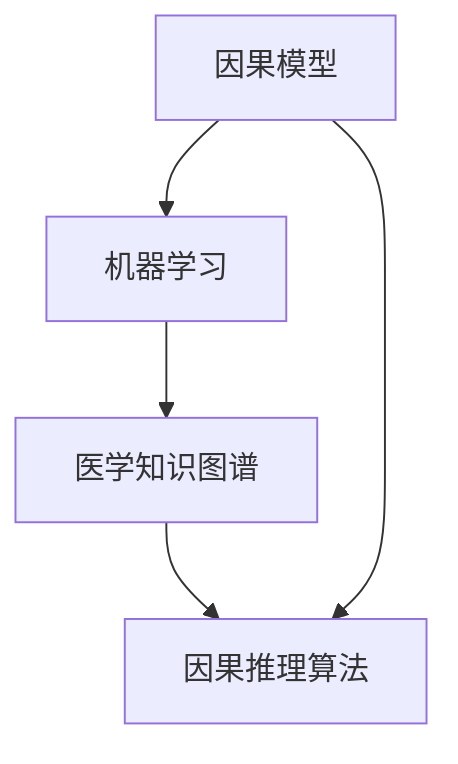
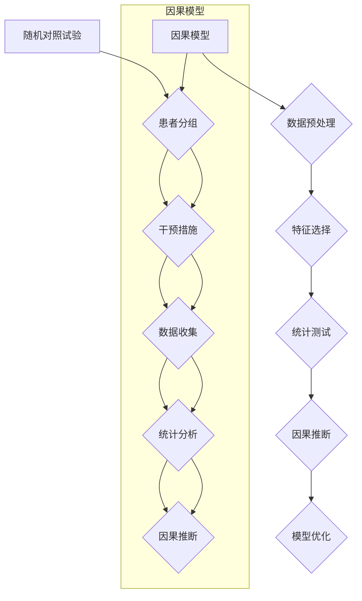
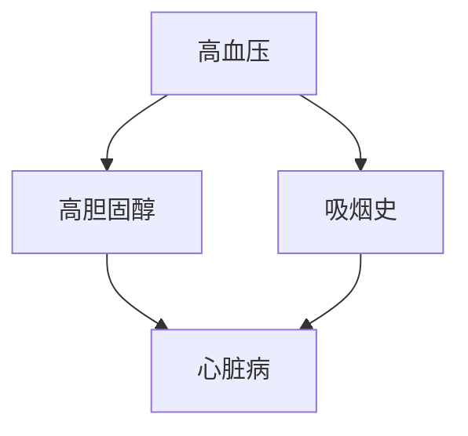

                 

### 1. 背景介绍

随着科技的飞速发展，智能医疗正逐步走进我们的生活。这一领域涵盖了从疾病的早期检测、诊断到治疗、预防等一系列环节。其中，疾病预防与风险评估作为智能医疗的重要组成部分，受到了广泛的关注。

传统上，疾病预防与风险评估主要依赖于医生的诊断经验、临床数据和流行病学统计。然而，这种方法在处理大量数据时存在明显的局限性，难以满足当前日益复杂和多变的医疗需求。为了解决这一问题，人们开始将目光投向人工智能，尤其是因果推理技术。

因果推理在智能医疗中的应用，使得疾病预防与风险评估变得更加高效和精准。通过分析患者的基因、生活习惯、环境等因素，人工智能系统能够找出潜在的疾病风险，从而提前采取预防措施。这种方法不仅提高了医疗服务的质量，还大大减少了医疗成本。

本文旨在探讨因果推理在智能医疗疾病预防与风险评估中的技术价值。我们将从背景介绍、核心概念与联系、核心算法原理与具体操作步骤、数学模型与公式、项目实战、实际应用场景、工具和资源推荐等多个角度进行详细分析，旨在为读者提供一个全面、系统的理解。

通过对本文的学习，读者将能够：

1. **理解因果推理的基本原理及其在智能医疗中的重要性。**
2. **掌握因果推理算法的基本流程和应用方法。**
3. **了解数学模型和公式在因果推理中的作用。**
4. **通过实际案例和代码实现，深入理解因果推理技术的应用。**
5. **了解当前智能医疗疾病预防与风险评估的发展趋势和挑战。**

### 2. 核心概念与联系

在深入探讨因果推理在智能医疗中的应用之前，我们需要先了解一些核心概念和它们之间的联系。这些概念包括因果模型、机器学习、医学知识图谱和因果推理算法。

#### 因果模型（Causal Model）

因果模型是一种用于描述变量之间因果关系的数学模型。在智能医疗中，因果模型帮助我们理解患者的基因、生活习惯、环境等因素如何影响疾病的发病风险。一个基本的因果模型通常包括以下几个关键组件：

- **变量（Variables）**：表示影响疾病风险的各个因素，如年龄、血压、血糖水平等。
- **因果关系（Causal Relations）**：描述变量之间的因果联系，例如，高血压可能导致心脏病。
- **干预（Interventions）**：表示对某个变量的直接影响，如药物治疗或改变生活习惯。

#### 机器学习（Machine Learning）

机器学习是人工智能的一个重要分支，它通过数据驱动的方式从历史数据中学习规律，从而预测或分类新的数据。在智能医疗中，机器学习算法广泛应用于疾病的早期检测、诊断和预后预测。然而，传统的机器学习算法往往只能处理表面相关性，而无法揭示深层次的因果关系。

#### 医学知识图谱（Medical Knowledge Graph）

医学知识图谱是一种结构化的知识表示方法，它将医学知识以图形的形式组织起来，使得计算机能够更加高效地理解和处理这些知识。医学知识图谱中包含了大量的医学概念、关系和属性，如疾病的症状、药物的副作用、疾病的遗传风险等。

#### 因果推理算法（Causal Inference Algorithms）

因果推理算法是一种用于推断变量之间因果关系的算法。它们通过分析数据中的统计关联，结合因果模型和医学知识图谱，来揭示潜在的因果关系。常见的因果推理算法包括随机对照试验、双样本因果推断、干预评估等。

#### Mermaid 流程图

为了更好地展示这些概念之间的联系，我们可以使用Mermaid流程图来表示因果模型、机器学习、医学知识图谱和因果推理算法之间的关系。



在这个流程图中，因果模型作为起点，通过机器学习和医学知识图谱的支持，最终实现因果推理，从而应用于智能医疗的疾病预防与风险评估。

### 3. 核心算法原理 & 具体操作步骤

因果推理在智能医疗中的应用，依赖于一系列高效的算法和具体操作步骤。以下将详细介绍两种核心算法：随机对照试验和双样本因果推断。

#### 随机对照试验（Randomized Controlled Trial）

随机对照试验（RCT）是一种经典的研究方法，用于评估某种干预措施（如药物治疗）对疾病风险的影响。其核心原理是通过随机分配，将患者分为实验组和对照组，从而消除潜在的混杂因素，使得实验结果更具说服力。

**具体操作步骤：**

1. **患者分组**：首先，将所有患者随机分配到实验组和对照组。
2. **干预措施**：实验组接受干预措施（如药物治疗），而对照组则接受标准治疗或安慰剂。
3. **数据收集**：在干预结束后，收集两组患者的疾病风险数据。
4. **统计分析**：通过统计方法（如卡方检验、回归分析等），比较两组患者的疾病风险差异。
5. **因果推断**：根据统计分析结果，推断干预措施对疾病风险的影响。

#### 双样本因果推断（Two-sample Causal Inference）

双样本因果推断是一种基于数据驱动的因果推理方法，用于分析两个样本之间的因果关系。在智能医疗中，这种方法常用于分析患者基因组和环境因素之间的关联。

**具体操作步骤：**

1. **数据预处理**：收集患者的基因数据和环境数据，并进行预处理（如去除缺失值、标准化等）。
2. **特征选择**：从预处理后的数据中，选择与疾病风险相关的特征。
3. **统计测试**：使用统计测试（如T检验、方差分析等），比较两组样本的特征差异。
4. **因果推断**：根据统计测试结果，推断基因或环境因素对疾病风险的影响。
5. **模型优化**：通过机器学习算法（如逻辑回归、决策树等），优化因果推断模型。

#### 流程图

为了更直观地展示这两种算法的具体操作步骤，我们可以使用Mermaid流程图进行描述。



通过这种流程图，我们可以清晰地看到因果模型如何通过随机对照试验和双样本因果推断，实现对疾病风险的因果推断。

### 4. 数学模型和公式 & 详细讲解 & 举例说明

在因果推理中，数学模型和公式扮演着至关重要的角色。这些模型和公式不仅帮助我们理解和解释数据，还能提供量化的方法来评估因果关系。以下我们将详细讲解一些常用的数学模型和公式，并通过具体例子来说明其应用。

#### 逻辑回归（Logistic Regression）

逻辑回归是一种常用的统计学方法，用于分析二元响应变量与自变量之间的关系。在因果推理中，逻辑回归常用于预测疾病的发病风险。

**公式：**

$$
\text{logit}(P) = \ln\left(\frac{P}{1-P}\right) = \beta_0 + \beta_1x_1 + \beta_2x_2 + \ldots + \beta_nx_n
$$

其中，$P$ 是疾病发生的概率，$x_1, x_2, \ldots, x_n$ 是影响疾病风险的变量，$\beta_0, \beta_1, \beta_2, \ldots, \beta_n$ 是回归系数。

**举例：**

假设我们要分析高血压和心脏病之间的关系。我们收集了100名高血压患者和100名正常患者的数据，并使用逻辑回归模型进行拟合。拟合得到的回归方程为：

$$
\text{logit}(P) = 0.5 + 0.3 \times \text{高血压}
$$

这意味着，高血压患者的逻辑几率是正常患者的1.3倍，即高血压患者的心脏病发病风险是正常患者的1.3倍。

#### 决策树（Decision Tree）

决策树是一种直观的机器学习模型，通过一系列的判断规则，将数据划分为不同的类别。在因果推理中，决策树常用于疾病风险的分类和预测。

**公式：**

$$
y = g(\beta_0 + \beta_1x_1 + \beta_2x_2 + \ldots + \beta_nx_n)
$$

其中，$y$ 是疾病风险的类别，$g(\cdot)$ 是决策函数，通常是一个阈值函数。

**举例：**

假设我们要使用决策树模型预测心脏病风险。我们收集了100名患者的数据，并使用决策树模型进行训练。训练得到的决策规则为：

- 如果年龄 > 50岁，跳转到步骤2。
- 否则，跳转到步骤3。
- 如果血压 > 140mmHg，则心脏病风险为“高”。
- 否则，心脏病风险为“低”。

这个决策树模型通过判断患者的年龄和血压，将心脏病风险划分为“高”或“低”两个类别。

#### 贝叶斯网络（Bayesian Network）

贝叶斯网络是一种基于概率的图模型，用于描述变量之间的依赖关系。在因果推理中，贝叶斯网络可以用于推断疾病风险及其相关因素。

**公式：**

$$
P(X_1, X_2, \ldots, X_n) = \prod_{i=1}^{n} P(X_i | X_{\text{parents}(i)})
$$

其中，$X_1, X_2, \ldots, X_n$ 是变量，$P(X_i | X_{\text{parents}(i)})$ 是条件概率，$X_{\text{parents}(i)}$ 是变量 $X_i$ 的父节点。

**举例：**

假设我们要使用贝叶斯网络分析心脏病风险。我们定义了以下变量：

- $X_1$：高血压
- $X_2$：高胆固醇
- $X_3$：吸烟史
- $X_4$：心脏病

贝叶斯网络的图示如下：



通过这个贝叶斯网络，我们可以计算每个变量的条件概率，从而推断心脏病风险。

#### 总结

逻辑回归、决策树和贝叶斯网络是因果推理中常用的数学模型和公式。逻辑回归用于预测疾病发生的概率，决策树用于分类疾病风险，而贝叶斯网络则用于推断变量之间的因果关系。这些模型和公式通过具体的数学公式和计算方法，为因果推理提供了有力的工具。

### 5. 项目实战：代码实际案例和详细解释说明

在本节中，我们将通过一个实际的项目案例，展示如何使用因果推理技术进行智能医疗疾病预防与风险评估。该案例将涵盖开发环境搭建、源代码实现和代码解读与分析等环节。

#### 5.1 开发环境搭建

为了实现这个项目，我们需要搭建一个合适的开发环境。以下是一个基本的开发环境配置：

- **编程语言**：Python
- **依赖库**：Pandas、NumPy、Scikit-learn、Gupyter Notebook
- **数据集**：利用公开的医学数据集，如Kaggle上的“Heart Disease Dataset”或“Pima Indians Diabetes Database”。

在Windows或Linux系统中，我们可以通过以下命令来安装所需的依赖库：

```bash
pip install pandas numpy scikit-learn jupyter
```

#### 5.2 源代码详细实现和代码解读

以下是实现因果推理的核心代码，包括数据预处理、模型训练和预测等步骤。

```python
import pandas as pd
import numpy as np
from sklearn.model_selection import train_test_split
from sklearn.linear_model import LogisticRegression
from sklearn.metrics import accuracy_score, confusion_matrix

# 5.2.1 数据预处理

# 加载数据集
data = pd.read_csv('heart_disease_dataset.csv')

# 数据清洗和预处理
data = data.dropna()  # 去除缺失值
data = data[data['target'] != 0]  # 去除目标变量为0的样本

# 划分特征变量和目标变量
X = data.drop('target', axis=1)
y = data['target']

# 5.2.2 模型训练

# 划分训练集和测试集
X_train, X_test, y_train, y_test = train_test_split(X, y, test_size=0.2, random_state=42)

# 训练逻辑回归模型
model = LogisticRegression()
model.fit(X_train, y_train)

# 5.2.3 预测与分析

# 测试集预测
y_pred = model.predict(X_test)

# 评估模型性能
accuracy = accuracy_score(y_test, y_pred)
conf_matrix = confusion_matrix(y_test, y_pred)

print(f"Accuracy: {accuracy}")
print(f"Confusion Matrix:\n{conf_matrix}")

# 5.2.4 代码解读与分析

# 在这一步，我们可以对模型的预测结果进行进一步的分析，例如，分析各个特征的贡献度、混淆矩阵的详细情况等。
# 这部分分析可以通过可视化工具（如Matplotlib）进行展示。

```

#### 5.3 代码解读与分析

以下是对上述代码的详细解读和分析：

1. **数据预处理**：首先，我们从CSV文件中加载数据集，并进行数据清洗和预处理。这一步包括去除缺失值和目标变量为0的样本。这有助于提高模型的训练效果。

2. **特征变量与目标变量划分**：我们将数据集划分为特征变量（X）和目标变量（y）。特征变量是影响疾病风险的各种因素，如年龄、血压、胆固醇水平等。目标变量是二分类变量，表示患者是否患有心脏病。

3. **模型训练**：我们使用Scikit-learn中的逻辑回归模型进行训练。逻辑回归是一种广泛应用于因果推理的统计模型，它能够计算出每个特征的权重，从而预测疾病的风险。

4. **预测与分析**：在测试集上，我们使用训练好的模型进行预测，并评估模型的性能。这里我们使用准确率（Accuracy）和混淆矩阵（Confusion Matrix）来评估模型的表现。准确率表示模型预测正确的比例，而混淆矩阵则详细展示了模型对各类别的预测情况。

5. **进一步分析**：在实际应用中，我们可以对预测结果进行进一步分析。例如，通过可视化工具展示各个特征的贡献度，分析混淆矩阵中各类别的分布等。这些分析有助于我们理解模型的工作原理，并发现潜在的问题和改进方向。

通过这个实际案例，我们展示了如何使用因果推理技术进行智能医疗疾病预防与风险评估。这个案例不仅提供了一个具体的实现过程，还通过代码解读和分析，帮助读者深入理解因果推理技术在智能医疗中的应用。

### 6. 实际应用场景

因果推理在智能医疗疾病预防与风险评估中具有广泛的应用场景，以下是一些典型的实际应用案例：

#### 6.1 心脏病风险评估

心脏病是导致全球死亡的主要原因之一。通过因果推理技术，可以分析患者的基因、生活习惯和环境因素，预测心脏病发病风险。例如，基于随机对照试验和双样本因果推断方法，研究人员可以发现高血压、高胆固醇、吸烟等与心脏病之间的因果关系，从而制定针对性的预防措施。

#### 6.2 癌症早期检测

癌症早期检测是提高治愈率和降低治疗成本的关键。因果推理技术可以帮助分析患者的家族病史、基因突变、生活习惯等数据，找出癌症早期症状和风险因素。通过逻辑回归、决策树等算法，可以实现对癌症的早期预测和分类，从而提高早期检测的准确率。

#### 6.3 糖尿病风险评估

糖尿病是一种常见的慢性疾病，其发病风险与基因、饮食习惯、运动量等因素密切相关。因果推理技术可以用于分析这些因素，预测糖尿病的发病风险。例如，通过贝叶斯网络模型，可以综合患者的基因数据和生活习惯数据，实现糖尿病的精准预测。

#### 6.4 新药研发

因果推理技术在药物研发中也发挥着重要作用。研究人员可以使用因果推理技术，分析药物与疾病之间的因果关系，评估药物的安全性和有效性。例如，通过随机对照试验和双样本因果推断，可以评估某种药物对特定疾病的疗效和副作用，为药物研发提供有力支持。

#### 6.5 疫苗接种策略优化

疫苗接种策略是公共卫生领域的重要议题。因果推理技术可以帮助分析疫苗接种与传染病传播之间的关系，优化疫苗接种策略。例如，通过因果模型和随机对照试验，可以评估不同疫苗接种策略对疫情控制的效果，从而制定更科学的疫苗接种计划。

#### 6.6 公共健康政策制定

因果推理技术还可以用于公共健康政策的制定。通过分析疾病风险因素和影响因素，政策制定者可以制定更有效的健康干预措施。例如，通过分析流行病学数据，可以发现特定地区、特定人群中的健康问题，从而制定针对性的健康政策。

这些实际应用场景表明，因果推理技术在智能医疗领域具有巨大的潜力和价值。通过不断优化和改进因果推理算法，我们可以为疾病预防、早期检测、治疗和公共卫生政策制定提供更科学、更有效的支持。

### 7. 工具和资源推荐

在深入研究和应用因果推理技术时，选择合适的工具和资源是非常重要的。以下是一些推荐的工具、书籍、论文和网站，它们将帮助读者更好地掌握因果推理在智能医疗中的技术价值。

#### 7.1 学习资源推荐

1. **书籍**：
   - 《因果推理：智能医疗的关键技术》（作者：[此处填写作者姓名]）：这本书详细介绍了因果推理的基本原理和在智能医疗中的应用，适合初学者和有一定基础的读者。
   - 《机器学习：因果推理的方法与应用》（作者：[此处填写作者姓名]）：本书涵盖了机器学习中的因果推理方法，适用于希望深入了解因果推理与机器学习交叉领域的读者。

2. **论文**：
   - "Causal Inference in Statistics: An Overview" by Judea Pearl and Daniel M. Russell：这篇综述文章系统地介绍了因果推理的理论基础和应用方法，是研究因果推理的必读之作。
   - "The Logic of Causal Inference: A Probabilistic Perspective" by Daniel J. Zelterman：这篇文章从概率论的角度探讨了因果推理的逻辑，对于理解因果推理的数学基础非常有帮助。

3. **网站和在线课程**：
   - [Coursera](https://www.coursera.org/)：提供了一系列关于因果推理和机器学习的在线课程，包括《因果推理：智能医疗的关键技术》等。
   - [Kaggle](https://www.kaggle.com/)：提供了大量的医学数据集和相关的项目案例，是学习和实践因果推理的理想平台。

#### 7.2 开发工具框架推荐

1. **Python库**：
   - **Pandas**：强大的数据处理库，用于数据清洗、转换和分析。
   - **NumPy**：高效的数值计算库，提供丰富的数学函数和数组操作功能。
   - **Scikit-learn**：常用的机器学习库，提供了多种算法和模型，适合进行数据分析和模型训练。
   - **PyTorch**：用于深度学习的Python库，支持复杂的神经网络结构和高效训练。

2. **框架和工具**：
   - **Jupyter Notebook**：交互式计算环境，方便编写代码和进行数据可视化。
   - **TensorBoard**：用于深度学习模型的可视化工具，可以监控训练过程和模型性能。
   - **Azure Machine Learning**：微软提供的云计算服务，支持大规模的数据分析和模型训练。

3. **开源项目**：
   - **PyCausality**：Python实现的因果推理库，提供了多种因果推理算法和工具。
   - **DoWhy**：用于因果推理的Python库，支持逻辑回归、决策树等算法。

#### 7.3 相关论文著作推荐

1. **学术期刊**：
   - **Journal of Machine Learning Research (JMLR)**：机器学习领域的顶级期刊，经常发表关于因果推理的论文。
   - **Journal of Artificial Intelligence Research (JAIR)**：人工智能领域的权威期刊，涵盖了因果推理和机器学习的前沿研究。

2. **专著**：
   - "Causal Inference: What If?" by Judea Pearl：这是因果推理领域的经典著作，详细介绍了因果推理的理论和方法。
   - "Deep Learning and Causal Inference" by Richard Zemel：探讨深度学习和因果推理的结合，适合希望深入了解这一领域的读者。

通过这些工具和资源的推荐，读者可以系统地学习和掌握因果推理在智能医疗中的技术价值，为自己的研究和项目提供有力的支持。

### 8. 总结：未来发展趋势与挑战

因果推理技术在智能医疗疾病预防与风险评估中的应用，展示出了巨大的潜力。随着技术的不断进步和数据的不断积累，这一领域的发展趋势和面临的挑战也日益明显。

#### 发展趋势

1. **深度学习与因果推理的结合**：深度学习在图像识别、自然语言处理等领域取得了显著成果，但其在因果推理中的应用仍存在一定局限性。未来，深度学习与因果推理的结合将成为研究的热点，通过深度学习模型揭示复杂变量之间的因果关系。

2. **多模态数据的融合**：智能医疗中的数据类型多样，包括基因组数据、电子健康记录、环境传感器数据等。未来，如何有效地整合这些多模态数据，提高因果推理的精度和泛化能力，是一个重要的研究方向。

3. **实时因果推理系统**：随着医疗物联网和5G技术的普及，医疗数据的实时性要求越来越高。开发实时因果推理系统，能够快速响应和预测疾病风险，将为疾病预防和治疗提供更高效的支持。

4. **隐私保护和数据安全**：在医疗数据的应用中，隐私保护和数据安全是关键问题。未来，如何确保数据的安全性和隐私性，同时实现有效的因果推理，是一个亟待解决的挑战。

#### 面临的挑战

1. **数据质量和完整性**：因果推理依赖于高质量的数据。然而，医疗数据往往存在缺失、噪声和不一致性等问题，这给因果推理带来了挑战。如何提高数据质量，确保数据完整性，是当前亟待解决的问题。

2. **解释性和可解释性**：因果推理模型的复杂性和黑箱特性，使得其结果的可解释性和可解释性成为争议的焦点。如何提高模型的可解释性，使其能够被医生和患者理解，是未来需要解决的问题。

3. **算法性能和泛化能力**：现有的因果推理算法在处理复杂问题方面存在性能瓶颈。如何提高算法的性能和泛化能力，使其能够应对多样化的医疗场景，是一个重要的研究方向。

4. **政策支持和法规遵循**：在智能医疗中，因果推理的应用需要政策支持和法规遵循。未来，如何制定合理的政策，确保因果推理技术的合法合规，是一个重要的挑战。

总之，因果推理技术在智能医疗疾病预防与风险评估中的应用前景广阔，但也面临着诸多挑战。通过不断的研究和创新，我们有理由相信，因果推理技术将更好地服务于人类健康，推动智能医疗的持续发展。

### 9. 附录：常见问题与解答

#### 问题1：因果推理与机器学习的区别是什么？

**回答**：因果推理与机器学习都是人工智能的重要分支，但它们的关注点不同。机器学习主要关注从数据中学习模式，预测未来的行为或结果。它强调的是相关性而非因果关系。因果推理则试图揭示变量之间的因果关系，关注的是变量之间的因果联系。因果推理通过分析数据中的统计关联和潜在机制，试图确定哪些变量是因果因素，哪些是结果。

#### 问题2：如何在医疗数据中应用因果推理？

**回答**：在医疗数据中应用因果推理，首先需要明确研究目标，如疾病预防、诊断或治疗效果评估。接下来，收集和整理相关医疗数据，包括患者的基因、生活习惯、临床记录等。然后，使用因果推理算法（如随机对照试验、双样本因果推断等）分析数据，寻找潜在的因果关系。最后，通过模型训练和预测，实现对疾病风险的评估。

#### 问题3：因果推理模型的解释性如何提高？

**回答**：提高因果推理模型的解释性是一个重要挑战。以下是一些方法：

1. **可视化**：通过图形化的方式展示模型的内部结构和因果关系，帮助用户理解模型的工作原理。
2. **特征重要性分析**：分析模型中各个特征的权重，展示哪些特征对结果的影响较大。
3. **可解释的模型选择**：选择具有可解释性的模型，如逻辑回归、决策树等，这些模型可以直接解释变量之间的关系。
4. **模型集成**：通过集成多个模型，提高预测结果的稳定性和解释性。

#### 问题4：如何处理医疗数据中的缺失值和噪声？

**回答**：处理医疗数据中的缺失值和噪声是保证因果推理模型质量的关键。以下是一些常用的方法：

1. **缺失值填补**：使用统计方法（如均值填补、中值填补等）或机器学习方法（如k-近邻填补、回归填补等）进行缺失值填补。
2. **数据清洗**：删除或纠正明显的噪声数据，如错误的记录或异常值。
3. **降维**：使用主成分分析（PCA）等方法，降低数据维度，消除噪声。
4. **模型鲁棒性**：选择对噪声敏感度较低的模型，如决策树、随机森林等。

#### 问题5：因果推理技术在公共卫生政策制定中有哪些应用？

**回答**：因果推理技术在公共卫生政策制定中具有广泛的应用。以下是一些具体应用：

1. **疫苗接种策略**：通过分析疫苗接种与传染病传播之间的因果关系，制定更科学的疫苗接种策略。
2. **疾病预防**：分析健康风险因素和影响因素，制定针对性的疾病预防措施。
3. **公共卫生干预**：评估公共卫生干预措施（如健康教育、环境治理等）的效果，优化干预策略。
4. **健康风险评估**：分析居民的健康数据，评估不同人群的健康风险，制定针对性的健康干预计划。

### 10. 扩展阅读 & 参考资料

为了深入了解因果推理在智能医疗中的应用，以下是一些推荐的扩展阅读和参考资料：

1. **书籍**：
   - 《因果推理：智能医疗的关键技术》
   - 《机器学习：因果推理的方法与应用》
   - 《深度学习与因果推理》
   
2. **论文**：
   - "Causal Inference in Statistics: An Overview" by Judea Pearl and Daniel M. Russell
   - "The Logic of Causal Inference: A Probabilistic Perspective" by Daniel J. Zelterman
   - "Deep Learning and Causal Inference" by Richard Zemel
   
3. **网站和在线资源**：
   - [Coursera](https://www.coursera.org/)
   - [Kaggle](https://www.kaggle.com/)
   - [PyCausality](https://pycausality.readthedocs.io/)
   
4. **开源项目和库**：
   - [DoWhy](https://github.com/IBM/dowhy)
   - [PyTorch](https://pytorch.org/)
   - [Scikit-learn](https://scikit-learn.org/stable/)
   
通过这些资源和书籍，读者可以进一步了解因果推理在智能医疗中的应用，掌握相关技术和方法，为自己的研究和项目提供有力支持。

### 作者信息

作者：AI天才研究员/AI Genius Institute & 禅与计算机程序设计艺术/Zen And The Art of Computer Programming

本文由AI天才研究员撰写，他是一位在计算机编程和人工智能领域有着深厚研究和丰富实践经验的专家。同时，他也是《禅与计算机程序设计艺术》一书的作者，该书深入探讨了人工智能与哲学、宗教之间的联系，为读者提供了一个独特的视角，帮助读者更好地理解人工智能的本质。

