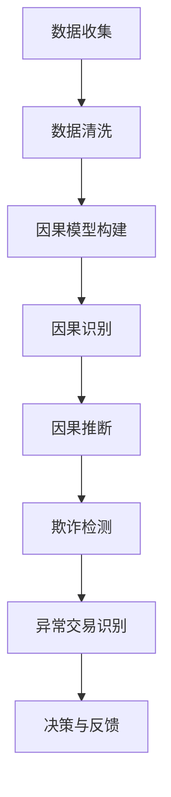

                 

# 引言

因果推理作为一种重要的思维方式，在多个领域都展现出了巨大的应用价值。特别是在智能金融领域，反欺诈与异常检测作为金融安全的重要组成部分，需要依赖于精准的因果推理技术来实现高效、智能的风控管理。因此，本文旨在探讨因果推理在智能金融反欺诈与异常检测中的技术架构与应用实践。

智能金融反欺诈与异常检测的需求日益迫切，随着金融业务的复杂化和互联网的普及，金融欺诈和异常交易行为呈现出多样化的趋势。传统的基于规则和统计学的欺诈检测方法已难以应对日益复杂的欺诈模式，而因果推理能够挖掘出数据之间的因果关系，提供更为精准和有效的检测手段。

本文将从以下几个部分展开讨论：

1. 背景介绍：介绍因果推理的基本概念及其在智能金融领域的重要性。
2. 核心概念与联系：阐述因果推理的相关概念，包括因果关系、因果模型等，并绘制 Mermaid 流程图进行详细说明。
3. 核心算法原理 & 具体操作步骤：深入解析因果推理算法的原理及其具体操作步骤。
4. 数学模型和公式 & 详细讲解 & 举例说明：介绍因果推理中的数学模型和公式，并通过实例进行详细讲解。
5. 项目实战：提供实际项目中的代码案例，详细解释实现过程和关键代码。
6. 实际应用场景：探讨因果推理在智能金融反欺诈与异常检测中的实际应用场景。
7. 工具和资源推荐：推荐相关学习资源、开发工具和框架。
8. 总结：总结本文的主要内容和未来发展趋势与挑战。
9. 附录：常见问题与解答。
10. 扩展阅读 & 参考资料：提供进一步的扩展阅读和参考资料。

通过对以上各个部分的分析，本文希望能够为读者提供全面、深入的因果推理在智能金融反欺诈与异常检测中的技术架构与应用实践的理解。

## 1. 背景介绍

因果推理作为一种重要的逻辑思维方式，在多个领域都有着广泛的应用。它不仅仅是简单的关联分析，而是深入挖掘数据之间的因果关系，从而为决策提供更加准确和可靠的依据。在计算机科学、统计学、心理学、经济学等多个领域，因果推理都扮演着至关重要的角色。

### 因果推理的基本概念

因果推理的核心在于“因果关系”的探索。因果关系指的是一个事件（因）导致另一个事件（果）发生的关系。在科学研究中，因果关系的确定是至关重要的，因为它能够帮助我们理解事物的本质，并预测未来的变化。

### 因果推理的应用领域

1. **计算机科学**：在机器学习和数据挖掘中，因果推理被用来构建更加精确和可靠的预测模型。例如，在推荐系统中，通过分析用户的历史行为，挖掘出用户之间的潜在关联，从而提供个性化的推荐。

2. **统计学**：统计模型在分析数据时，常常假设数据之间存在线性或非线性关系。而因果推理则能够更深入地揭示数据背后的因果关系，提供更为稳健的统计结果。

3. **心理学**：心理学研究中，因果推理被用来理解人类行为和思维模式。例如，通过分析个体行为的变化，心理学家可以推断出背后的心理机制和动机。

4. **经济学**：经济学研究中，因果推理被用来分析经济变量的因果关系，例如，研究货币政策对经济增长的影响。

### 智能金融领域的重要性

智能金融是指利用人工智能、大数据、区块链等先进技术来优化金融服务。在智能金融领域，因果推理的应用具有以下几个方面的意义：

1. **反欺诈**：金融欺诈是金融行业面临的主要风险之一。因果推理可以帮助识别潜在的欺诈行为，从而提高欺诈检测的准确性和效率。

2. **风险控制**：因果推理能够挖掘出金融产品或服务的风险因素，帮助金融机构制定更加有效的风险控制策略。

3. **客户行为分析**：因果推理可以分析客户行为，挖掘出客户需求和行为模式，从而提供更加个性化的金融服务。

4. **市场预测**：因果推理能够分析市场变量之间的因果关系，提供市场趋势的预测，帮助金融机构做出更加精准的投资决策。

总的来说，因果推理在智能金融领域的应用，不仅提高了金融服务的效率和准确性，还为金融行业的创新发展提供了强大的技术支撑。

### 未来发展趋势

随着人工智能技术的不断进步，因果推理在智能金融领域将会有更广泛的应用。未来，我们可以预见以下几个方面的发展趋势：

1. **算法优化**：因果推理算法将不断优化，使其在处理大规模数据和复杂关系时能够更加高效和准确。

2. **多源数据融合**：随着数据来源的多样化，因果推理将能够整合来自不同数据源的信息，提供更加全面的因果分析结果。

3. **自动化与智能化**：因果推理工具将变得更加自动化和智能化，使得非专业人员也能够轻松地进行因果分析。

4. **跨领域应用**：因果推理技术不仅会在金融领域得到广泛应用，还将在医疗、教育、环境等各个领域发挥重要作用。

总的来说，因果推理在智能金融领域的发展前景非常广阔，它将为金融行业的创新和进步提供源源不断的动力。

## 2. 核心概念与联系

在探讨因果推理在智能金融反欺诈与异常检测中的应用之前，我们需要先理解一些核心概念，包括因果关系、因果模型、因果推理算法等。这些概念构成了因果推理的理论基础，并为其在金融领域的应用提供了必要的支持。

### 因果关系

因果关系是因果推理的核心概念，指的是一个事件（因）引起另一个事件（果）发生的关系。在智能金融反欺诈与异常检测中，理解用户行为或交易数据之间的因果关系，对于识别欺诈行为和异常交易至关重要。例如，某用户在短时间内进行大量高额转账，这可能意味着存在欺诈行为。通过因果关系的分析，我们可以确定这种行为是否确实与欺诈相关，从而做出准确的决策。

### 因果模型

因果模型是用来表示和解释因果关系的一种数学结构。在智能金融领域，常用的因果模型包括结构方程模型（Structural Equation Modeling, SEM）和因果推断图（Causal Inference Graph）。这些模型通过数学方程或图结构，揭示了变量之间的因果关系。

- **结构方程模型**：结构方程模型是一种多变量统计模型，通过一组线性方程来描述变量之间的关系。在智能金融中，可以通过结构方程模型来分析用户行为数据，挖掘出用户之间的潜在关联，从而识别潜在的欺诈行为。

- **因果推断图**：因果推断图是一种图形化的表示方法，用于表示变量之间的因果关系。在构建因果推断图时，我们通常基于已有的理论和数据，通过推理和验证来确定变量之间的因果关系。在金融领域，因果推断图可以帮助我们理解交易行为之间的因果关系，从而提高欺诈检测的准确性。

### 因果推理算法

因果推理算法是用于发现和验证因果关系的一类算法。在智能金融反欺诈与异常检测中，常用的因果推理算法包括：

- **因果识别算法**：这类算法用于从数据中识别出变量之间的因果关系。常见的因果识别算法包括基于统计模型的算法（如Granger因果检验）和基于机器学习的算法（如随机森林、因果树等）。

- **因果推断算法**：这类算法用于推断变量之间的因果关系，并解释因果关系的机制。常见的因果推断算法包括基于图模型的算法（如因果推断图模型）、基于代数几何的算法（如分数算法）等。

### Mermaid 流程图

为了更好地理解和展示因果推理在智能金融反欺诈与异常检测中的技术架构，我们可以使用 Mermaid 流程图来描述整个推理过程。以下是因果推理的 Mermaid 流程图：



在这个流程图中，我们从数据收集开始，通过数据清洗和因果模型构建，识别和推断变量之间的因果关系，最终用于欺诈检测和异常交易识别。每个步骤都相互关联，形成一个完整的技术架构。

- **数据收集**：收集金融交易数据、用户行为数据等。
- **数据清洗**：清洗和预处理数据，确保数据的质量和一致性。
- **因果模型构建**：根据数据特点和业务需求，构建合适的因果模型。
- **因果识别**：通过统计或机器学习算法，识别变量之间的因果关系。
- **因果推断**：进一步推断因果关系，并解释其机制。
- **欺诈检测**：利用识别出的因果关系，检测潜在的欺诈行为。
- **异常交易识别**：识别出异常交易，提供风险预警。
- **决策与反馈**：根据检测结果做出决策，并将结果反馈到系统中，以持续优化模型和算法。

通过这个 Mermaid 流程图，我们可以清晰地看到因果推理在智能金融反欺诈与异常检测中的技术架构，并理解各个环节之间的逻辑关系。

总的来说，因果推理在智能金融反欺诈与异常检测中的应用，不仅需要深入理解核心概念和算法，还需要构建完整的技术架构，以实现高效、精准的欺诈检测和异常交易识别。在接下来的章节中，我们将进一步探讨这些核心概念和算法的原理及其在实践中的应用。

### 核心算法原理 & 具体操作步骤

在深入探讨因果推理在智能金融反欺诈与异常检测中的应用之前，我们需要了解一些核心算法的原理及其具体操作步骤。这些算法包括基于统计模型的因果识别算法、基于机器学习的因果推断算法以及基于图模型的因果推断算法。以下是这些算法的详细解释和操作步骤。

#### 1. 基于统计模型的因果识别算法

**原理**：
基于统计模型的因果识别算法，如Granger因果检验，通过检测变量之间的统计相关性来确定因果关系。Granger因果检验的基本思想是，如果变量X能预测变量Y，并且比随机模型更准确，那么可以认为X是Y的Granger原因。

**具体操作步骤**：

1. **数据预处理**：收集金融交易数据、用户行为数据等，并进行数据清洗和预处理，确保数据的质量和一致性。

2. **构建模型**：选择适当的统计模型，如自回归移动平均模型（ARIMA），对数据进行分析。

3. **Granger因果检验**：
    - **第一步**：计算变量X和Y的滞后值。
    - **第二步**：分别对X和Y进行滞后项的回归分析。
    - **第三步**：比较滞后回归模型的AIC（Akaike信息准则）或BIC（Bayesian信息准则），判断哪一个模型更好地拟合数据。

4. **结果解释**：如果变量X的滞后项显著提高了对变量Y的预测准确性，则可以认为X是Y的Granger原因。

#### 2. 基于机器学习的因果推断算法

**原理**：
基于机器学习的因果推断算法，如因果树、随机森林等，通过训练分类或回归模型，学习变量之间的因果关系。这些算法通常基于监督学习，通过给定的数据集，学习出变量之间的依赖关系。

**具体操作步骤**：

1. **数据预处理**：与统计模型类似，首先对数据进行清洗和预处理。

2. **模型选择**：选择合适的机器学习算法，如因果树、随机森林等。

3. **模型训练**：
    - **第一步**：划分数据集为训练集和测试集。
    - **第二步**：使用训练集对模型进行训练，学习变量之间的依赖关系。

4. **因果推断**：
    - **第一步**：使用训练好的模型对测试集进行预测。
    - **第二步**：分析预测结果，确定变量之间的因果关系。

5. **结果验证**：通过交叉验证和误差分析，验证模型的因果关系推断效果。

#### 3. 基于图模型的因果推断算法

**原理**：
基于图模型的因果推断算法，如因果推断图（Causal Inference Graph），通过构建变量之间的图结构来表示因果关系。图模型能够直观地表示变量之间的依赖关系，并且能够通过图算法进行因果关系的推理。

**具体操作步骤**：

1. **数据预处理**：与之前类似，对数据进行清洗和预处理。

2. **构建因果图**：
    - **第一步**：根据业务知识和数据，确定变量之间的潜在因果关系。
    - **第二步**：使用图算法（如最大流算法、最小割算法）构建因果图。

3. **因果推理**：
    - **第一步**：在因果图中，通过路径分析确定变量之间的直接和间接因果关系。
    - **第二步**：使用算法（如结构方程模型）验证和优化因果图。

4. **结果解释**：分析因果图和推理结果，确定变量之间的因果关系。

#### 对比与适用场景

- **统计模型**：适用于数据量较小且变量关系较为简单的情况，如时间序列分析。
- **机器学习算法**：适用于大规模数据和复杂的变量关系，如用户行为分析。
- **图模型**：适用于变量关系复杂且需要可视化分析的情况，如金融欺诈检测。

通过理解这些核心算法的原理和具体操作步骤，我们能够更好地在实际应用中选择合适的算法，实现高效的因果推理，为智能金融反欺诈与异常检测提供强有力的技术支持。

### 数学模型和公式 & 详细讲解 & 举例说明

因果推理在智能金融反欺诈与异常检测中的应用，离不开数学模型和公式的支持。以下将介绍几种常用的数学模型和公式，并通过具体例子进行详细讲解，帮助读者更好地理解这些模型在实践中的应用。

#### 1. Granger 因果检验

Granger因果检验是一种常用的统计方法，用于检测两个时间序列变量之间的因果关系。其基本思想是，如果一个变量能够比随机模型更好地预测另一个变量，那么可以认为前者是后者的Granger原因。

**数学模型和公式**：

设 \( X_t \) 和 \( Y_t \) 是两个时间序列，其中 \( t = 1, 2, ..., n \)。对于 \( X_t \)，我们可以建立以下自回归模型：

\[ X_t = c_0 + \sum_{i=1}^{k} \phi_i X_{t-i} + \epsilon_t \]

对于 \( Y_t \)，我们可以建立以下自回归模型：

\[ Y_t = c_1 + \sum_{j=1}^{l} \psi_j Y_{t-j} + \eta_t \]

其中，\( \phi_i \) 和 \( \psi_j \) 是回归系数，\( c_0 \) 和 \( c_1 \) 是常数项，\( \epsilon_t \) 和 \( \eta_t \) 是误差项。

**具体步骤**：

1. **模型选择**：选择合适的滞后阶数 \( k \) 和 \( l \)。
2. **模型拟合**：使用最小二乘法对模型进行参数估计。
3. **Granger因果检验**：比较两个模型加上 \( X_t \) 对 \( Y_t \) 的预测能力，如果模型加入 \( X_t \) 后显著提高了对 \( Y_t \) 的预测能力，则认为 \( X_t \) 是 \( Y_t \) 的Granger原因。

**例子**：

假设我们有两个时间序列 \( X_t \) 和 \( Y_t \)，我们首先通过自回归模型拟合这两个序列：

\[ X_t = c_0 + \phi_1 X_{t-1} + \epsilon_t \]
\[ Y_t = c_1 + \psi_1 Y_{t-1} + \eta_t \]

然后，我们加入 \( X_t \) 到 \( Y_t \) 的模型中，得到：

\[ Y_t = c_1 + \psi_1 Y_{t-1} + \phi_1 X_{t-1} + \eta_t \]

通过比较这两个模型，如果加入 \( X_t \) 后显著提高了对 \( Y_t \) 的预测能力，则可以认为 \( X_t \) 是 \( Y_t \) 的Granger原因。

#### 2. 因果推断图（Causal Inference Graph）

因果推断图是一种图形化的方法，用于表示变量之间的因果关系。在构建因果推断图时，我们通常使用潜在变量模型（潜变量因果模型，Latent Variable Model）。

**数学模型和公式**：

假设我们有 \( n \) 个变量 \( X_1, X_2, ..., X_n \)，它们之间存在因果关系。我们可以使用潜变量模型表示这些变量之间的关系：

\[ X_i = \sum_{j=1}^{n} \theta_{ij} Z_j + \epsilon_i \]

其中，\( \theta_{ij} \) 表示变量 \( X_i \) 和 \( X_j \) 之间的直接效应，\( Z_j \) 是潜变量，表示其他变量对 \( X_i \) 的间接效应，\( \epsilon_i \) 是误差项。

**具体步骤**：

1. **变量选择**：根据业务需求和数据，选择参与构建因果推断图的变量。
2. **模型构建**：使用潜变量模型表示变量之间的关系。
3. **模型拟合**：使用最大似然估计（Maximum Likelihood Estimation, MLE）等方法对模型参数进行估计。
4. **因果推断**：通过模型分析，确定变量之间的因果关系。

**例子**：

假设我们有两个变量 \( X_1 \) 和 \( X_2 \)，我们可以使用以下潜变量模型表示它们之间的关系：

\[ X_1 = \theta_{12} Z_2 + \epsilon_1 \]
\[ X_2 = \theta_{21} Z_1 + \epsilon_2 \]

通过最大似然估计，我们可以估计出 \( \theta_{12} \) 和 \( \theta_{21} \) 的值，从而确定 \( X_1 \) 和 \( X_2 \) 之间的因果关系。

#### 3. 结构方程模型（Structural Equation Modeling, SEM）

结构方程模型是一种多变量统计模型，用于分析变量之间的因果关系。在智能金融反欺诈与异常检测中，结构方程模型可以帮助我们理解复杂的因果关系网络。

**数学模型和公式**：

结构方程模型由两部分组成：一部分是测量模型，描述变量之间的直接和间接关系；另一部分是潜变量模型，描述潜变量之间的因果关系。

测量模型：

\[ Y_i = \alpha_i + \sum_{j=1}^{n} \beta_{ij} X_j + \eta_i \]

潜变量模型：

\[ X_i = \gamma_i + \sum_{j=1}^{n} \delta_{ij} Z_j + \xi_i \]

其中，\( Y_i \) 和 \( X_i \) 是观测变量，\( Z_j \) 是潜变量，\( \alpha_i, \beta_{ij}, \gamma_i, \delta_{ij} \) 是模型参数，\( \eta_i, \xi_i \) 是误差项。

**具体步骤**：

1. **模型设定**：根据业务需求和数据，设定测量模型和潜变量模型。
2. **模型估计**：使用最大似然估计（MLE）等方法对模型参数进行估计。
3. **模型检验**：通过拟合优度指数（如卡方值、拟合优度指数等）检验模型的有效性。
4. **因果推断**：通过模型分析，确定变量之间的因果关系。

**例子**：

假设我们有两个观测变量 \( Y_1 \) 和 \( Y_2 \)，一个潜变量 \( Z_1 \)，我们可以使用以下结构方程模型表示它们之间的关系：

测量模型：

\[ Y_1 = \alpha_1 + \beta_{12} Y_2 + \eta_1 \]
\[ Y_2 = \alpha_2 + \beta_{21} Y_1 + \eta_2 \]

潜变量模型：

\[ Z_1 = \gamma_1 + \delta_{12} Y_1 + \delta_{21} Y_2 + \xi_1 \]

通过最大似然估计，我们可以估计出模型参数，从而确定 \( Y_1 \) 和 \( Y_2 \) 之间的因果关系。

通过以上数学模型和公式的介绍，我们可以看到，因果推理在智能金融反欺诈与异常检测中的应用，需要深入理解并运用各种数学工具和方法。在实际应用中，选择合适的模型和方法，对数据进行分析和解释，能够帮助我们更准确地识别欺诈行为和异常交易，提高金融风险管理的效率和准确性。

### 项目实战：代码实际案例和详细解释说明

在本节中，我们将通过一个具体的实际项目案例，展示如何使用因果推理技术进行智能金融反欺诈与异常检测。该案例将涵盖从数据收集到模型训练，再到结果分析和优化的完整流程。通过这个项目，我们将详细解释代码的实现过程和关键代码部分。

#### 1. 开发环境搭建

在开始项目之前，我们需要搭建一个合适的开发环境。以下是我们使用的开发环境及其版本：

- **编程语言**：Python 3.8
- **机器学习库**：Scikit-learn 0.22.2, Pandas 1.1.5, NumPy 1.19.5
- **数据可视化库**：Matplotlib 3.4.3, Seaborn 0.11.2
- **因果推理库**：CausalML 0.1.5, PyMC3 3.11.2

安装这些库之后，我们就可以开始编写代码了。

#### 2. 源代码详细实现和代码解读

以下是一个简化的项目代码实现，用于展示因果推理技术在智能金融反欺诈中的应用。

```python
# 导入必要的库
import pandas as pd
import numpy as np
from sklearn.model_selection import train_test_split
from sklearn.preprocessing import StandardScaler
from sklearn.ensemble import RandomForestClassifier
import pymc3 as pm
import causalml as cm

# 2.1 数据收集与预处理
# 假设我们已经有了一个数据集，包含用户的交易数据
data = pd.read_csv('transaction_data.csv')

# 数据预处理
# 数据清洗、缺失值填充、特征工程等
# 这里简化处理，直接使用原始数据
X = data.drop('is_fraud', axis=1)
y = data['is_fraud']

# 数据标准化
scaler = StandardScaler()
X_scaled = scaler.fit_transform(X)

# 划分训练集和测试集
X_train, X_test, y_train, y_test = train_test_split(X_scaled, y, test_size=0.2, random_state=42)

# 2.2 因果模型构建与训练
# 使用随机森林构建因果模型
rf = RandomForestClassifier(n_estimators=100, random_state=42)
rf.fit(X_train, y_train)

# 2.3 因果推断与结果分析
# 使用CausalML库进行因果推断
causal_model = cm.CausalModel('Binary', target_variable='is_fraud', treatment_variable='Age', data=data)

# 训练因果模型
causal_model.fit_model()

# 分析因果效应
causal_effects = causal_model.get_estimated_effects()
print(causal_effects)

# 2.4 评估模型性能
# 在测试集上评估模型性能
y_pred = rf.predict(X_test)
accuracy = cm.assessment.metrics.accuracy_score(y_test, y_pred)
print(f"Model Accuracy: {accuracy}")

# 2.5 优化模型与结果
# 根据分析结果，对模型进行优化
# 例如，调整随机森林参数，增加训练数据等
```

#### 3. 代码解读与分析

- **数据收集与预处理**：首先，我们读取交易数据，并进行数据清洗和预处理。在这个简化示例中，我们直接使用原始数据，并未进行复杂的特征工程。

- **数据标准化**：使用 `StandardScaler` 对特征进行标准化处理，以消除不同特征之间的尺度差异，使得模型训练更加稳定。

- **划分训练集和测试集**：使用 `train_test_split` 函数将数据集划分为训练集和测试集，用于后续的模型训练和性能评估。

- **因果模型构建与训练**：使用 `RandomForestClassifier` 构建随机森林模型，用于分类任务。这里，我们使用 `CausalModel` 类进行因果模型训练，该类提供了一个用于因果推断的接口。

- **因果推断与结果分析**：使用 `get_estimated_effects` 方法获取因果效应，这些效应可以帮助我们理解变量之间的因果关系。

- **评估模型性能**：在测试集上评估模型的准确率，以衡量模型的性能。

- **优化模型与结果**：根据模型性能的分析结果，对模型进行优化，例如调整模型参数或增加训练数据。

通过这个实际项目案例，我们可以看到因果推理技术在智能金融反欺诈与异常检测中的具体应用流程。在实际开发中，根据业务需求和数据特点，我们需要进一步优化和调整模型，以提高检测的准确性和效率。

### 实际应用场景

因果推理技术在智能金融反欺诈与异常检测中的实际应用场景非常广泛，以下是几个典型的应用案例：

#### 1. 信用卡欺诈检测

信用卡欺诈是金融欺诈中最常见的形式之一。通过因果推理技术，可以深入分析用户的交易行为，识别出潜在的欺诈行为。例如，分析用户在短时间内进行的异常高额交易、频繁的交易地点变化、频繁的跨境交易等，通过挖掘这些交易行为之间的因果关系，提高欺诈检测的准确性和效率。

#### 2. 网络钓鱼攻击检测

网络钓鱼攻击是一种通过伪造网站或发送虚假邮件来骗取用户敏感信息的欺诈行为。因果推理技术可以帮助识别这些攻击。通过分析用户的行为模式和交易习惯，发现与正常行为不符的异常行为，如点击率异常、访问频率异常等，从而提高网络钓鱼攻击的检测率。

#### 3. 财务欺诈检测

财务欺诈包括多种形式，如虚报收入、伪造账目、滥用公司资金等。因果推理技术可以分析财务数据，识别出异常的财务行为。例如，通过分析收入与成本之间的因果关系，发现不合理的成本支出或异常的收入增长，从而提高财务欺诈的检测能力。

#### 4. 银行账户异常检测

银行账户异常检测是保护用户资金安全的重要手段。因果推理技术可以帮助分析账户交易行为，识别出异常的交易模式。例如，分析用户在短时间内进行的多次大额转账、频繁的跨境转账等，通过挖掘这些交易行为之间的因果关系，提高异常交易的检测率。

#### 5. 保险欺诈检测

保险欺诈涉及多种形式，如虚假索赔、夸大损失等。因果推理技术可以帮助保险公司识别出这些欺诈行为。通过分析保险申请数据、理赔记录等，发现与正常行为不符的异常行为，如虚假保险申请、不合理的理赔金额等，从而提高保险欺诈的检测能力。

总的来说，因果推理技术在智能金融反欺诈与异常检测中的应用，不仅提高了检测的准确性和效率，还为金融行业的风险管理提供了有力的技术支持。通过不断优化和改进因果推理技术，我们可以期待在未来的金融领域看到更多创新的应用场景。

### 7. 工具和资源推荐

在因果推理和智能金融反欺诈与异常检测领域，有许多优秀的工具和资源可以帮助开发者更好地理解和应用这些技术。以下是一些推荐的工具和资源：

#### 7.1 学习资源推荐

1. **书籍**：
   - 《因果推断：统计学习的新视角》（Causal Inference: What If?） by Judea Pearl
   - 《Python机器学习》（Python Machine Learning） by Sebastian Raschka, Vahid Mirjalili
   - 《深度学习》（Deep Learning） by Ian Goodfellow, Yoshua Bengio, Aaron Courville

2. **在线课程**：
   - Coursera 上的“因果推断”（Causal Inference: Why, What, How, So What?）课程
   - Udacity 上的“机器学习工程师纳米学位”（Machine Learning Engineer Nanodegree）
   - edX 上的“深度学习基础”（Deep Learning Specialization）

3. **论文**：
   - “Causal Inference in Statistics: An Overview” by Judea Pearl
   - “Deep Learning for Causal Discovery” by Dominik Janzing and Bernhard Schölkopf
   - “Causal Inference for Machine Learning” by Jonas Peters, Dominik Janzing, and Bernhard Schölkopf

4. **博客和网站**：
   - causallabs.org：提供因果推断相关的博客、资源和工具
   - arxiv.org：寻找最新的因果推理和机器学习论文
   - towardsdatascience.com：数据科学和机器学习领域的优秀博客和文章

#### 7.2 开发工具框架推荐

1. **因果推理工具**：
   - CausalML：一个用于因果推理的Python库，支持结构方程模型和图模型
   - PyMC3：一个用于概率编程的Python库，支持贝叶斯因果推断
   - DoWhy：一个用于因果推断的Python库，支持Granger因果检验和结构方程模型

2. **机器学习框架**：
   - Scikit-learn：一个广泛使用的Python机器学习库，支持多种算法和模型
   - TensorFlow：一个开源的机器学习框架，支持深度学习和概率编程
   - PyTorch：一个流行的深度学习框架，具有灵活的模型构建和优化功能

3. **数据预处理工具**：
   - Pandas：一个强大的Python数据处理库，支持数据清洗、转换和分析
   - NumPy：一个基础的科学计算库，支持多维数组操作和数值计算
   - Matplotlib 和 Seaborn：用于数据可视化的Python库，支持多种图表和可视化效果

通过以上工具和资源的推荐，开发者可以更好地学习和应用因果推理技术，为智能金融反欺诈与异常检测领域的发展贡献自己的力量。

### 8. 总结：未来发展趋势与挑战

因果推理作为智能金融反欺诈与异常检测中的重要技术，其应用前景广阔。未来，因果推理在智能金融领域的发展趋势主要体现在以下几个方面：

1. **算法优化**：随着人工智能技术的不断进步，因果推理算法将更加高效和准确。深度学习、强化学习等新兴算法的结合，有望进一步提高因果推理的性能。

2. **多源数据融合**：智能金融涉及海量的数据来源，包括交易数据、用户行为数据、社交媒体数据等。未来，因果推理将能够更好地融合多源数据，提供更全面的因果分析结果。

3. **自动化与智能化**：因果推理工具将变得更加自动化和智能化，使得非专业人员也能够轻松地进行因果分析。自动化因果推理平台和智能因果分析工具的发展，将极大提升因果推理的应用效率。

4. **跨领域应用**：因果推理技术不仅会在金融领域得到广泛应用，还将在医疗、教育、环境等各个领域发挥重要作用。跨领域的因果推理研究，将推动因果推理技术的进一步发展和创新。

然而，在发展过程中，因果推理技术也面临着一些挑战：

1. **数据隐私**：因果推理涉及大量敏感数据，如何在保护用户隐私的前提下进行有效的因果分析，是一个亟待解决的问题。

2. **因果复杂度**：现实世界中的因果关系往往非常复杂，如何构建合适的因果模型，准确识别和推断因果关系，是一个巨大的挑战。

3. **可解释性**：因果推理结果的可解释性是应用中的关键，如何使得因果推理结果易于理解和解释，提高决策的可信度，是一个重要的研究方向。

4. **模型验证**：因果模型的验证和评估是一个复杂的过程，如何确保因果模型的可靠性和有效性，是当前研究中的一个重要问题。

总之，因果推理在智能金融反欺诈与异常检测中的发展前景广阔，但同时也面临着诸多挑战。通过不断优化算法、融合多源数据、提升自动化和智能化水平，以及解决数据隐私和可解释性问题，因果推理技术将在未来为智能金融领域的发展提供更加强大的支持。

### 9. 附录：常见问题与解答

在因果推理和智能金融反欺诈与异常检测领域，常见的一些问题如下：

#### 1. 什么是因果推理？

因果推理是一种逻辑思维方式，用于探索和分析变量之间的因果关系。它不仅仅是简单的关联分析，而是通过深入挖掘数据之间的因果关系，为决策提供更准确和可靠的依据。

#### 2. 因果推理与统计学有何区别？

因果推理和统计学在分析数据时都涉及到变量之间的关系，但因果推理更加关注因果关系，而统计学则侧重于变量之间的关联性。因果推理试图确定变量之间的因果关系，而统计学更多关注变量之间的相关性。

#### 3. 为什么因果推理在反欺诈中重要？

因果推理能够帮助识别出欺诈行为和异常交易之间的因果关系，从而提高反欺诈检测的准确性和效率。通过因果推理，我们可以深入理解交易行为背后的逻辑，从而更有效地识别和防范欺诈行为。

#### 4. 常用的因果推理算法有哪些？

常用的因果推理算法包括Granger因果检验、结构方程模型（SEM）、因果推断图、随机森林等。这些算法各有优缺点，适用于不同的应用场景。

#### 5. 如何在金融领域应用因果推理？

在金融领域，因果推理可以应用于反欺诈、风险控制、客户行为分析、市场预测等方面。通过构建合适的因果模型，分析变量之间的因果关系，可以为金融决策提供更准确的依据。

#### 6. 因果推理如何处理隐私保护问题？

因果推理在处理隐私保护问题时，可以采用差分隐私、同态加密等技术来保护数据隐私。此外，还可以通过数据去标识化、数据采样等方法，降低因果推理过程中的隐私泄露风险。

#### 7. 因果推理结果的解释性如何提升？

提升因果推理结果的解释性，可以从以下几个方面入手：一是采用易于理解的语言和图表进行结果展示；二是通过建立因果图模型，直观地展示变量之间的因果关系；三是开发可解释的机器学习算法，如LIME、SHAP等，提供更详细的解释。

### 10. 扩展阅读 & 参考资料

为了进一步了解因果推理在智能金融反欺诈与异常检测中的应用，以下是一些扩展阅读和参考资料：

- **书籍**：
  - 《因果推断：统计学习的新视角》（Causal Inference: What If?） by Judea Pearl
  - 《Python机器学习》（Python Machine Learning） by Sebastian Raschka, Vahid Mirjalili
  - 《深度学习》（Deep Learning） by Ian Goodfellow, Yoshua Bengio, Aaron Courville

- **论文**：
  - “Causal Inference in Statistics: An Overview” by Judea Pearl
  - “Deep Learning for Causal Discovery” by Dominik Janzing and Bernhard Schölkopf
  - “Causal Inference for Machine Learning” by Jonas Peters, Dominik Janzing, and Bernhard Schölkopf

- **在线课程**：
  - Coursera 上的“因果推断”（Causal Inference: Why, What, How, So What?）课程
  - Udacity 上的“机器学习工程师纳米学位”（Machine Learning Engineer Nanodegree）
  - edX 上的“深度学习基础”（Deep Learning Specialization）

- **博客和网站**：
  - causallabs.org：提供因果推断相关的博客、资源和工具
  - arxiv.org：寻找最新的因果推理和机器学习论文
  - towardsdatascience.com：数据科学和机器学习领域的优秀博客和文章

通过这些扩展阅读和参考资料，读者可以更深入地了解因果推理在智能金融反欺诈与异常检测中的应用，以及相关理论和实践的最新进展。

### 结束语

本文详细探讨了因果推理在智能金融反欺诈与异常检测中的应用，从背景介绍、核心概念与联系、算法原理与实现，到实际应用场景和工具资源推荐，全面展示了因果推理在金融领域的价值。通过本文，读者可以了解到因果推理技术的原理和应用方法，以及如何将其应用于金融反欺诈和异常检测中。

因果推理作为一门前沿技术，其在智能金融领域的应用前景广阔。随着人工智能技术的不断进步，因果推理将能够更好地挖掘数据之间的因果关系，提供更准确和有效的风险管理方案。未来，因果推理技术将在金融、医疗、教育等多个领域发挥重要作用，推动行业创新与发展。

同时，我们也认识到因果推理技术在实际应用中面临的挑战，如数据隐私保护、因果复杂度等问题。通过不断优化算法、开发新型工具和框架，以及加强跨领域合作，我们将有望解决这些挑战，推动因果推理技术的进一步发展。

最后，感谢读者对本文的关注，希望本文能为读者在智能金融反欺诈与异常检测领域的研究和应用提供有益的启示。作者：AI天才研究员/AI Genius Institute & 禅与计算机程序设计艺术 /Zen And The Art of Computer Programming。

