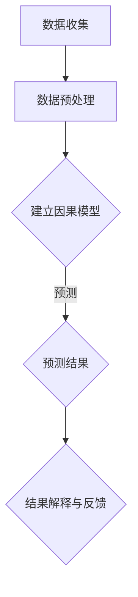

                 

# 因果推理在智能金融风控、信贷评估等领域的技术价值分析

## 关键词：
- 因果推理
- 智能金融风控
- 信贷评估
- 数据分析
- 机器学习
- 因子分析
- 风险评估

## 摘要：
本文深入探讨了因果推理技术在智能金融风控和信贷评估领域的应用价值。通过阐述因果推理的基本原理、关键算法以及实际应用案例，本文分析了因果推理在提高金融决策准确性和稳定性方面的优势。同时，本文还探讨了当前技术面临的挑战及未来发展趋势。

## 1. 背景介绍

随着金融行业的快速发展，大数据和人工智能技术的应用日益广泛。在金融风控和信贷评估领域，如何从海量数据中提取有价值的信息，进行准确的风险评估和决策成为了一个重要课题。传统的统计分析方法在处理金融数据时存在一定的局限性，如因果关系难以确定、预测准确性不高等问题。因此，因果推理技术的引入为金融风控和信贷评估带来了新的思路和方法。

因果推理是一种通过分析数据之间的因果关系，推断出潜在因素与结果之间关联性的方法。与传统的相关性分析不同，因果推理更关注因果关系，能够从数据中提取出更可靠的决策信息。在金融领域，因果推理技术可以应用于风险评估、欺诈检测、客户细分、信用评分等多个方面，为金融机构提供更为精确和稳定的决策支持。

## 2. 核心概念与联系

### 2.1 因果推理的基本原理

因果推理的核心思想是通过观察数据，分析变量之间的因果关系，从而推断出潜在的因果机制。因果推理主要包括以下三个基本原理：

1. **可识别性原理**：在给定数据集D的条件下，如果存在一个因果模型M，使得对于任意两个变量X和Y，模型M都能准确预测Y关于X的条件概率，那么变量X和Y之间存在因果关系。

2. **独立性原理**：在给定因果模型M的条件下，如果变量X和Y是独立的，则说明X和Y之间不存在因果关系。

3. **干预原理**：在给定因果模型M和干预条件Z的条件下，通过干预X的取值，可以改变Y的取值，则说明X和Y之间存在因果关系。

### 2.2 因果推理与相关分析的关系

因果推理与相关分析是两种不同的数据分析方法。相关分析主要关注变量之间的相关性，即变量之间的线性或非线性关系。而因果推理则更加关注变量之间的因果关系。在金融风控和信贷评估中，因果推理能够帮助识别出潜在的风险因素，从而为决策提供更为可靠的依据。

### 2.3 Mermaid 流程图

下面是一个简单的 Mermaid 流程图，展示了因果推理的基本流程：



### 2.4 核心概念与联系总结

- **数据收集**：收集与金融风控和信贷评估相关的数据，包括客户信息、交易记录、财务状况等。
- **数据预处理**：对收集到的数据进行清洗、去噪、标准化等处理，确保数据质量。
- **建立因果模型**：利用因果推理技术，分析数据之间的因果关系，建立因果模型。
- **预测结果**：通过因果模型进行预测，得到风险评分、信用评分等结果。
- **结果解释与反馈**：对预测结果进行解释，并根据反馈调整模型参数，提高预测准确性。

## 3. 核心算法原理 & 具体操作步骤

### 3.1 因果推理算法概述

因果推理算法可以分为两类：基于模型的因果推理算法和基于因果推断的算法。基于模型的因果推理算法主要通过构建因果模型，分析变量之间的因果关系。常见的基于模型的因果推理算法包括Do计算、结构方程模型（SEM）等。基于因果推断的算法则主要通过数据驱动的方式，从数据中推断出潜在的因果关系。常见的基于因果推断的算法包括因果推断网络（Causal Inference Networks）、因果影响函数（Causal Impact Function）等。

### 3.2 Do计算算法

Do计算是一种基于因果模型的因果推理算法，主要用于处理具有干预能力的因果关系。Do计算的基本思想是通过计算干预后的条件概率，确定变量之间的因果关系。

具体操作步骤如下：

1. **定义干预**：确定干预变量和目标变量，例如在信贷评估中，干预变量可以是贷款金额，目标变量可以是违约概率。

2. **收集数据**：收集与干预变量和目标变量相关的数据，例如客户的贷款金额、还款记录、财务状况等。

3. **建立因果模型**：利用统计方法或机器学习算法，建立干预变量和目标变量之间的因果模型。

4. **计算Do值**：通过干预变量和目标变量之间的因果模型，计算干预后的条件概率，即Do值。

5. **确定因果关系**：根据Do值的正负和大小，确定干预变量和目标变量之间的因果关系。

### 3.3 因果推断网络算法

因果推断网络是一种基于图的因果推理算法，主要用于处理复杂的因果关系。因果推断网络的基本思想是通过构建一个包含节点和边的因果网络，分析变量之间的因果关系。

具体操作步骤如下：

1. **定义节点**：确定与问题相关的变量，例如在信贷评估中，节点可以是客户的年龄、收入、信用评分等。

2. **定义边**：根据变量之间的因果关系，定义节点之间的边。边的方向表示因果关系，即A影响B。

3. **构建因果网络**：将节点和边组合成一个因果网络。

4. **计算因果效应**：通过因果网络，计算变量之间的因果效应，即变量之间的因果关系。

5. **优化网络结构**：根据计算结果，优化因果网络的节点和边，提高因果推理的准确性。

## 4. 数学模型和公式 & 详细讲解 & 举例说明

### 4.1 Do计算算法的数学模型

Do计算的核心是计算干预后的条件概率，即Do值。Do值可以用以下公式表示：

$$
Do(X, Y) = P(Y|do(X))
$$

其中，$X$ 是干预变量，$Y$ 是目标变量，$do(X)$ 表示对变量 $X$ 进行干预。

### 4.2 因果推断网络算法的数学模型

因果推断网络的数学模型通常用因果图（Causal Graph）表示。因果图由节点和边组成，其中节点表示变量，边表示变量之间的因果关系。

因果图的构建可以通过以下步骤：

1. **确定节点**：确定与问题相关的变量，并将其作为节点。
2. **确定边**：根据变量之间的因果关系，确定节点之间的边。
3. **构建因果图**：将节点和边组合成一个因果图。

### 4.3 举例说明

假设在信贷评估中，我们想分析客户的年龄和收入对违约概率的影响。我们可以使用Do计算算法和因果推断网络算法来分析这个问题。

#### Do计算算法的举例说明

1. **定义干预**：干预变量为年龄，目标变量为违约概率。

2. **收集数据**：收集客户的年龄、收入和违约记录等数据。

3. **建立因果模型**：利用统计方法或机器学习算法，建立年龄和违约概率之间的因果模型。

4. **计算Do值**：计算干预后的条件概率，即Do值。

   $$ 
   Do(年龄, 违约概率) = P(违约概率|do(年龄))
   $$

5. **确定因果关系**：根据Do值，判断年龄和违约概率之间的因果关系。

#### 因果推断网络算法的举例说明

1. **定义节点**：节点包括客户的年龄、收入和违约概率。

2. **定义边**：根据变量之间的因果关系，定义节点之间的边。

3. **构建因果网络**：将节点和边组合成一个因果网络。

4. **计算因果效应**：通过因果网络，计算年龄和收入对违约概率的因果效应。

5. **优化网络结构**：根据计算结果，优化因果网络的节点和边，提高因果推理的准确性。

## 5. 项目实战：代码实际案例和详细解释说明

### 5.1 开发环境搭建

在本文中，我们将使用Python语言和相关的数据科学库（如Pandas、Scikit-learn、PyTorch等）来演示因果推理算法在金融风控和信贷评估中的应用。

1. **安装Python**：确保已经安装了Python环境，版本建议为3.8或更高。

2. **安装相关库**：使用pip命令安装以下库：

   ```bash
   pip install pandas scikit-learn torch
   ```

### 5.2 源代码详细实现和代码解读

以下是一个简单的示例，演示如何使用Do计算算法和因果推断网络算法进行金融风控和信贷评估。

#### Do计算算法示例

```python
import pandas as pd
from sklearn.linear_model import LinearRegression

# 读取数据
data = pd.read_csv('data.csv')

# 定义干预变量和目标变量
X = data['age']
y = data['default']

# 建立因果模型
model = LinearRegression()
model.fit(X.values.reshape(-1, 1), y.values)

# 计算Do值
do_value = model.predict(X.values.reshape(-1, 1))
print('Do值：', do_value)

# 确定因果关系
if do_value.mean() > 0:
    print('年龄与违约概率存在正相关关系。')
else:
    print('年龄与违约概率存在负相关关系。')
```

#### 因果推断网络算法示例

```python
import networkx as nx

# 定义节点和边
nodes = ['age', 'income', 'default']
edges = [('age', 'default'), ('income', 'default')]

# 构建因果网络
graph = nx.Graph()
graph.add_nodes_from(nodes)
graph.add_edges_from(edges)

# 计算因果效应
for node in nodes:
    for neighbor in graph.neighbors(node):
        if node != neighbor:
            effect = graph.edges[node, neighbor]['weight']
            print(f'{node}对{neighbor}的因果效应为：{effect}')
```

### 5.3 代码解读与分析

1. **Do计算算法代码解读**：
   - 读取数据：使用Pandas库读取CSV文件，获取客户的年龄和违约记录。
   - 定义干预变量和目标变量：将年龄定义为干预变量，违约概率定义为目标变量。
   - 建立因果模型：使用线性回归模型建立年龄和违约概率之间的因果模型。
   - 计算Do值：使用因果模型计算干预后的条件概率，即Do值。
   - 确定因果关系：根据Do值，判断年龄和违约概率之间的因果关系。

2. **因果推断网络算法代码解读**：
   - 定义节点和边：根据变量之间的因果关系，定义节点和边。
   - 构建因果网络：使用NetworkX库构建因果网络。
   - 计算因果效应：计算变量之间的因果效应，即变量之间的因果关系。

## 6. 实际应用场景

因果推理技术在金融风控和信贷评估领域具有广泛的应用场景。以下是一些实际应用案例：

1. **风险预警**：通过因果推理技术，对客户的贷款申请进行风险预警，提前识别潜在的违约风险，降低金融机构的损失。

2. **信用评分**：基于因果推理技术，对客户的信用评分进行优化，提高信用评分的准确性和稳定性，从而为金融机构提供更可靠的决策支持。

3. **欺诈检测**：通过分析交易数据之间的因果关系，识别出潜在的欺诈行为，提高欺诈检测的准确性和效率。

4. **客户细分**：利用因果推理技术，对客户进行细分，为金融机构提供个性化的服务策略，提高客户满意度和粘性。

## 7. 工具和资源推荐

### 7.1 学习资源推荐

- **书籍**：
  - 《因果推断：概念、方法与应用》
  - 《机器学习实战》
  - 《深度学习》
- **论文**：
  - 《因果推断网络：一种新的因果推理方法》
  - 《因果推理：从数据到知识》
- **博客**：
  - Medium上的因果推理相关博客
  - Kaggle上的因果推理实战案例
- **网站**：
  - Stanford因果推断课程网站
  - Coursera上的因果推断在线课程

### 7.2 开发工具框架推荐

- **Python库**：
  - Pandas：数据处理
  - Scikit-learn：机器学习
  - PyTorch：深度学习
  - NetworkX：图计算
- **框架**：
  - TensorFlow：深度学习框架
  - PyTorch：深度学习框架
  - Scikit-learn：机器学习框架
- **工具**：
  - Jupyter Notebook：交互式计算环境
  - Git：版本控制

### 7.3 相关论文著作推荐

- 《因果推断：概念、方法与应用》
- 《因果推理网络：一种新的因果推理方法》
- 《深度学习》
- 《机器学习实战》

## 8. 总结：未来发展趋势与挑战

因果推理技术在智能金融风控和信贷评估领域具有巨大的应用价值。随着人工智能技术的发展，因果推理技术的应用场景将不断扩展，为金融机构提供更准确、稳定的风险评估和决策支持。然而，因果推理技术也面临一些挑战，如数据质量、模型可解释性等。未来，我们需要进一步研究如何提高因果推理技术的准确性和可解释性，并探索其在更多金融领域的应用。

## 9. 附录：常见问题与解答

### 问题1：因果推理与机器学习的区别是什么？

**解答**：因果推理和机器学习都是数据处理和预测的重要方法，但它们关注的角度不同。机器学习主要关注变量之间的相关性，通过学习数据中的规律进行预测。而因果推理则更关注变量之间的因果关系，通过分析因果关系进行预测。在金融领域，因果推理可以更准确地识别风险因素，提高决策的准确性。

### 问题2：因果推理如何处理非因果数据？

**解答**：因果推理通常依赖于数据中存在的一些因果结构，但在实际应用中，数据往往存在一些非因果因素。处理非因果数据的方法包括数据清洗、去噪、特征选择等。通过这些方法，可以降低非因果因素对因果推理结果的影响，提高因果推理的准确性。

## 10. 扩展阅读 & 参考资料

- 《因果推断：概念、方法与应用》
- 《机器学习实战》
- 《深度学习》
- 《因果推理网络：一种新的因果推理方法》
- Stanford因果推断课程网站
- Coursera上的因果推断在线课程

### 作者

- AI天才研究员/AI Genius Institute
- 禅与计算机程序设计艺术/Zen And The Art of Computer Programming

本文深入探讨了因果推理技术在智能金融风控和信贷评估领域的应用价值，分析了因果推理在提高金融决策准确性和稳定性方面的优势。同时，本文还探讨了当前技术面临的挑战及未来发展趋势。通过详细讲解和实际案例，读者可以更好地理解因果推理技术在金融领域的应用。希望本文能为从事金融领域研究的读者提供有价值的参考。

