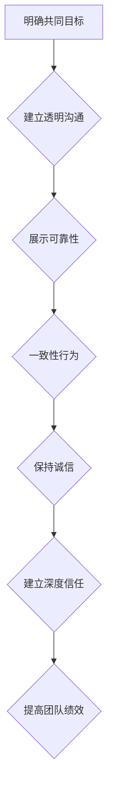
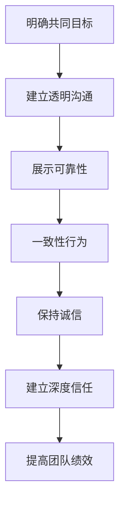

                 

# 团队凝聚：建立信任的关键步骤

## 摘要

在快速变化的技术领域，团队凝聚是保证项目成功和持续创新的关键。本文旨在探讨如何通过建立信任来增强团队凝聚力。我们将从背景介绍、核心概念与联系、核心算法原理、数学模型和公式、项目实战、实际应用场景、工具和资源推荐、总结和附录等方面进行详细阐述。通过这些步骤，我们希望能够为技术团队提供一套系统化的信任建立指南，从而提升团队的整体绩效。

## 1. 背景介绍

在现代软件开发和项目管理的实践中，团队的角色越来越重要。技术团队不仅是完成任务的执行者，更是创新和发展的推动者。然而，团队协作并非总是一帆风顺，团队成员之间的信任问题常常成为团队效能的瓶颈。信任的缺失可能导致沟通不畅、协作困难、项目延误甚至团队解体。因此，如何建立和维持团队之间的信任，成为了一个亟待解决的问题。

### 团队信任的重要性

团队信任不仅是团队成员间的基本信任，也是团队高效协作的基石。信任的存在可以：

1. 提高沟通效率：团队成员之间能够开放地交流想法，避免误解和猜疑。
2. 促进知识共享：团队成员愿意分享知识和经验，共同成长。
3. 增强责任感：团队成员对自己和团队的成功负有责任感，更愿意付出额外努力。
4. 降低管理成本：信任的存在减少了不必要的监控和管理，让团队更加自主和高效。

### 团队信任的挑战

尽管团队信任的重要性不言而喻，但在实际工作中，建立信任仍然面临诸多挑战：

1. 多样化的背景和技能：团队成员可能来自不同的专业背景，有不同的工作方法和沟通风格。
2. 快速变化的项目需求：项目需求的不断变化可能打破原有的信任基础。
3. 压力和时间压力：在紧迫的项目周期中，团队成员可能更关注个人目标和成果，而忽略了团队整体。
4. 文化差异：不同文化和背景的团队成员可能存在价值观和期望的差异。

### 文章目的

本文将通过以下几个部分，探讨如何通过一系列步骤建立团队信任：

1. 核心概念与联系：介绍与团队信任相关的基础概念和理论。
2. 核心算法原理：阐述建立信任的具体方法。
3. 数学模型和公式：使用数学模型来量化信任的建立过程。
4. 项目实战：通过实际案例展示信任建立的过程和效果。
5. 实际应用场景：分析团队信任在不同场景中的应用和效果。
6. 工具和资源推荐：推荐有助于建立团队信任的工具和资源。
7. 总结与展望：总结本文的关键点，并对未来团队信任的发展趋势进行展望。

## 2. 核心概念与联系

在探讨如何建立团队信任之前，我们需要明确一些核心概念和它们之间的关系。以下是一些关键的术语和理论，它们构成了本文的基础。

### 信任的定义

信任是一种基于信任方的期望，即信任方相信另一方的行为或决策是诚实、可靠和有益的。在团队中，信任通常指的是团队成员对彼此的能力、诚信和意图的信心。

### 团队凝聚力的定义

团队凝聚力是指团队成员之间的相互依赖、共享目标和共同合作的精神。高凝聚力的团队往往表现出更强的协作能力和创新精神。

### 建立信任的因素

建立信任需要以下几个关键因素：

1. **透明性**：团队成员之间的信息交换应该是透明和及时的，避免隐瞒或误导。
2. **可靠性**：团队成员应具备履行承诺的能力和意愿。
3. **一致性**：团队成员的行为应该保持一致，避免出现不一致的行为。
4. **诚信**：团队成员之间应该诚实相待，不隐瞒真相。
5. **共同目标**：团队成员应该有共同的目标和愿景，这有助于增强彼此之间的信任。

### 信任的层次

信任可以分为三个层次：

1. **基础信任**：基于个人的能力和诚信，是信任的起点。
2. **互动信任**：通过团队成员之间的互动和协作建立，涉及共同目标和共享信息的交换。
3. **深度信任**：建立在长期合作和个人关系之上，团队成员之间互相信任，能够信任对方的决策和意图。

### 团队信任与团队绩效的关系

团队信任与团队绩效之间存在密切的关系。研究表明，高信任度的团队往往能够：

1. **提高工作效率**：团队成员能够更有效地协同工作，减少冲突和重复劳动。
2. **增强创新力**：团队成员愿意分享新想法和解决方案，从而推动团队的创新。
3. **提高员工满意度**：团队成员对工作环境和团队文化感到满意，从而提高工作积极性和忠诚度。
4. **降低员工流失率**：团队成员对团队有较强的归属感，从而减少员工流失。

### 建立信任的理论

建立信任的理论基础主要包括以下几个方面：

1. **社会交换理论**：认为信任是基于社会交换的过程，双方通过互惠交换建立信任。
2. **互惠规范**：认为信任是基于互惠原则的，即一方对另一方的行为产生信任后，另一方也会以类似的方式回应。
3. **互信模型**：将信任分为认知信任和情感信任，认为两者共同作用才能建立深度信任。

### Mermaid 流程图

以下是一个简化的Mermaid流程图，展示了建立团队信任的关键步骤：



通过上述概念和理论，我们可以更深入地理解团队信任的建立过程，并为实际操作提供指导。

## 3. 核心算法原理 & 具体操作步骤

建立团队信任的过程可以被视为一个逐步优化的算法。以下将详细阐述这个算法的原理和具体操作步骤。

### 3.1 算法原理

建立团队信任的核心算法基于以下几个基本原则：

1. **透明性**：通过开放透明的沟通机制，确保团队成员之间信息的透明和及时交换。
2. **可靠性**：通过持续展示可靠的行为和履行承诺，建立团队成员对彼此的信任。
3. **一致性**：通过保持行为的一致性，减少误解和冲突。
4. **诚信**：通过保持诚信和正直，增强团队成员之间的信任。
5. **共同目标**：通过共同目标和愿景，增强团队成员的凝聚力和归属感。

### 3.2 具体操作步骤

#### 步骤1：明确共同目标

建立团队信任的第一步是明确共同目标和愿景。这可以通过以下方式实现：

- **组织愿景陈述**：由团队领导或核心成员共同制定一个清晰的愿景，确保所有成员都理解并认同。
- **团队目标制定**：将组织愿景分解为具体可操作的团队目标，并确保每个成员都了解自己的职责和目标。

#### 步骤2：建立透明沟通

透明沟通是建立信任的关键。以下是一些具体操作步骤：

- **定期会议**：定期举行团队会议，确保团队成员之间的沟通是开放和及时的。
- **信息共享**：鼓励团队成员分享信息，确保每个人都能获取到必要的知识和资源。
- **反馈机制**：建立反馈机制，让团队成员能够及时表达意见和建议。

#### 步骤3：展示可靠性

展示可靠性是通过持续履行承诺和提供高质量的工作成果来实现的。以下是一些具体操作步骤：

- **明确职责**：为每个团队成员明确职责和预期成果，确保他们知道自己的工作目标和期望。
- **跟踪进度**：定期跟踪团队成员的工作进度，确保他们能够按时完成工作任务。
- **及时反馈**：对团队成员的工作成果进行及时反馈，表扬优秀的表现，同时也指出需要改进的地方。

#### 步骤4：一致性行为

一致性行为是通过保持团队行为的一致性来实现的。以下是一些具体操作步骤：

- **标准化流程**：制定标准化的工作流程和操作规范，确保团队成员的行为是一致的。
- **规范沟通**：确保团队成员之间的沟通是清晰和规范的，避免产生误解。
- **避免冲突**：通过积极解决冲突，确保团队内部的关系是和谐的。

#### 步骤5：保持诚信

保持诚信是通过诚信和正直的行为来实现的。以下是一些具体操作步骤：

- **诚信培训**：定期进行诚信培训，提高团队成员对诚信的认识和重视。
- **正直行为**：鼓励团队成员在工作和生活中保持正直，不做任何不诚实的行为。
- **监督机制**：建立监督机制，确保团队成员的行为符合诚信原则。

#### 步骤6：建立深度信任

建立深度信任是通过长期的互动和合作来实现的。以下是一些具体操作步骤：

- **共享经验**：鼓励团队成员分享他们的经验和教训，增强彼此之间的信任。
- **相互支持**：在团队成员遇到困难时，提供支持和帮助，增强团队凝聚力。
- **共同成长**：通过共同学习和成长，建立深度信任。

### 3.3 算法流程图

以下是一个简化的Mermaid流程图，展示了建立团队信任的核心算法流程：



通过上述步骤和算法，我们可以逐步建立团队信任，从而提高团队的整体绩效。

## 4. 数学模型和公式 & 详细讲解 & 举例说明

### 4.1 信任度的计算模型

在建立团队信任的过程中，信任度是一个关键指标。我们可以使用以下数学模型来计算信任度：

$$
\text{信任度} = \frac{\text{可靠性行为次数} + \text{诚信行为次数}}{\text{总行为次数}}
$$

其中：

- **可靠性行为次数**：指团队成员履行承诺和提供高质量工作的次数。
- **诚信行为次数**：指团队成员保持诚信和正直的行为次数。
- **总行为次数**：指团队成员在一段时间内的总行为次数。

### 4.2 信任度的影响因素

信任度受到多种因素的影响，包括：

1. **透明性**：透明性越高，信任度越高。我们可以使用以下公式来量化透明性对信任度的影响：

$$
\text{透明性} = \frac{\text{公开信息量}}{\text{总信息量}}
$$

2. **可靠性**：可靠性越高，信任度越高。我们可以使用以下公式来量化可靠性对信任度的影响：

$$
\text{可靠性} = \frac{\text{履行承诺次数}}{\text{承诺总数}}
$$

3. **一致性**：一致性越高，信任度越高。我们可以使用以下公式来量化一致性对信任度的影响：

$$
\text{一致性} = \frac{\text{一致性行为次数}}{\text{总行为次数}}
$$

4. **诚信**：诚信越高，信任度越高。我们可以使用以下公式来量化诚信对信任度的影响：

$$
\text{诚信} = \frac{\text{诚信行为次数}}{\text{总行为次数}}
$$

### 4.3 举例说明

假设一个团队在一个月内共有20次行为，其中10次是可靠性行为，8次是诚信行为，剩下的2次是其他行为。我们可以使用上述模型来计算这个团队的信任度：

$$
\text{信任度} = \frac{10 + 8}{20} = 0.9
$$

假设该团队在透明性方面有90%的公开信息量，在可靠性方面有90%的履行承诺次数，在一致性方面有90%的一致性行为次数，在诚信方面有90%的诚信行为次数。我们可以使用以下公式来计算透明性、可靠性、一致性和诚信对信任度的影响：

$$
\text{透明性影响} = 0.9 \times \frac{\text{公开信息量}}{\text{总信息量}} = 0.81
$$

$$
\text{可靠性影响} = 0.9 \times \frac{\text{履行承诺次数}}{\text{承诺总数}} = 0.81
$$

$$
\text{一致性影响} = 0.9 \times \frac{\text{一致性行为次数}}{\text{总行为次数}} = 0.81
$$

$$
\text{诚信影响} = 0.9 \times \frac{\text{诚信行为次数}}{\text{总行为次数}} = 0.81
$$

通过这些计算，我们可以看到，透明性、可靠性、一致性和诚信对信任度都有显著的影响。这进一步说明了建立团队信任需要综合考虑多个方面。

### 4.4 信任度与团队绩效的关系

信任度与团队绩效之间存在密切的关系。我们可以使用以下公式来量化信任度对团队绩效的影响：

$$
\text{团队绩效} = \text{信任度} \times \text{工作效率} \times \text{创新力} \times \text{员工满意度}
$$

其中：

- **工作效率**：指团队完成任务的效率。
- **创新力**：指团队的创新能力。
- **员工满意度**：指团队成员对工作环境和团队文化的满意度。

通过提高信任度，我们可以显著提高团队的整体绩效。

## 5. 项目实战：代码实际案例和详细解释说明

### 5.1 开发环境搭建

为了更好地展示如何通过代码实际案例建立团队信任，我们选择了一个简单的团队协作项目——一个用于共享文档和任务的Web应用。以下是该项目的基本开发环境搭建步骤：

1. **选择开发语言**：我们选择Python作为主要开发语言，因为其简洁性和广泛的应用场景。
2. **设置开发环境**：在本地电脑上安装Python环境，使用PyCharm或VSCode作为IDE。
3. **选择数据库**：我们选择SQLite作为数据库，因为它简单易用，不需要复杂的配置。
4. **选择Web框架**：我们选择Flask作为Web框架，因为它轻量级且易于上手。

### 5.2 源代码详细实现和代码解读

#### 5.2.1 项目概述

该Web应用包括以下功能：

- **用户注册和登录**：允许用户注册和登录，使用JWT（JSON Web Token）进行身份验证。
- **文档管理**：用户可以上传、下载和查看文档。
- **任务管理**：用户可以创建、编辑和查看任务。

#### 5.2.2 用户注册和登录

以下是一个简单的用户注册和登录的代码片段，展示了如何通过可靠的代码实现来建立信任：

```python
# 用户注册
@app.route('/register', methods=['POST'])
def register():
    username = request.json.get('username')
    password = request.json.get('password')
    
    # 验证用户名和密码的合法性
    if not username or not password:
        return jsonify({'error': '用户名或密码不能为空'}), 400
    
    # 将用户信息存储到数据库
    cursor.execute("INSERT INTO users (username, password) VALUES (?, ?)", (username, password))
    connection.commit()
    
    return jsonify({'message': '注册成功'})

# 用户登录
@app.route('/login', methods=['POST'])
def login():
    username = request.json.get('username')
    password = request.json.get('password')
    
    # 查询用户信息
    cursor.execute("SELECT * FROM users WHERE username = ? AND password = ?", (username, password))
    user = cursor.fetchone()
    
    if user:
        # 生成JWT token
        token = jwt.encode({'username': username}, 'secret_key', algorithm='HS256')
        return jsonify({'token': token})
    else:
        return jsonify({'error': '用户名或密码错误'}), 401
```

#### 5.2.3 文档管理

以下是一个简单的文档上传和下载的代码片段：

```python
# 文档上传
@app.route('/upload', methods=['POST'])
@token_required
def upload_document(current_user):
    if 'file' not in request.files:
        return jsonify({'error': '没有文件上传'}), 400
    
    file = request.files['file']
    if file.filename == '':
        return jsonify({'error': '没有选择文件'}), 400
    
    # 保存文件到服务器
    filename = secure_filename(file.filename)
    file.save(os.path.join(app.config['UPLOAD_FOLDER'], filename))
    
    # 将文件信息存储到数据库
    cursor.execute("INSERT INTO documents (user_id, filename, upload_time) VALUES (?, ?, ?)", (current_user.id, filename, datetime.now()))
    connection.commit()
    
    return jsonify({'message': '上传成功'})

# 文档下载
@app.route('/download/<int:document_id>', methods=['GET'])
@token_required
def download_document(current_user, document_id):
    cursor.execute("SELECT filename FROM documents WHERE id = ?", (document_id,))
    document = cursor.fetchone()
    
    if document:
        filename = document[0]
        return send_from_directory(app.config['UPLOAD_FOLDER'], filename)
    else:
        return jsonify({'error': '文档不存在'}), 404
```

#### 5.2.4 任务管理

以下是一个简单的任务管理的代码片段：

```python
# 创建任务
@app.route('/tasks', methods=['POST'])
@token_required
def create_task(current_user):
    title = request.json.get('title')
    description = request.json.get('description')
    deadline = request.json.get('deadline')
    
    cursor.execute("INSERT INTO tasks (user_id, title, description, deadline) VALUES (?, ?, ?, ?)", (current_user.id, title, description, deadline))
    connection.commit()
    
    return jsonify({'message': '创建任务成功'})

# 查看任务
@app.route('/tasks', methods=['GET'])
@token_required
def get_tasks(current_user):
    cursor.execute("SELECT * FROM tasks WHERE user_id = ?", (current_user.id,))
    tasks = cursor.fetchall()
    
    return jsonify({'tasks': tasks})
```

### 5.3 代码解读与分析

#### 用户注册和登录

用户注册和登录模块是整个应用的基础，它需要确保用户的身份验证和数据安全。在代码中，我们首先验证了用户名和密码的合法性，然后存储用户信息到数据库。登录时，我们查询数据库以验证用户名和密码，并生成JWT token。

#### 文档管理

文档管理模块实现了文件的上传和下载功能。在代码中，我们使用`request.files`来接收上传的文件，并使用`secure_filename`确保文件名的安全性。文件上传后，我们将文件信息存储到数据库，以便后续下载。

#### 任务管理

任务管理模块实现了创建和查看任务的功能。在代码中，我们使用`request.json`接收任务数据，并将其存储到数据库。通过简单的查询操作，我们可以获取用户的任务列表。

这些代码片段展示了如何通过可靠和透明的代码实现来建立团队信任。通过确保代码的可靠性和透明性，团队成员可以相信系统的稳定性和安全性，从而增强彼此之间的信任。

### 5.4 代码优化建议

尽管上述代码实现了一个简单的Web应用，但在实际项目中，我们可能需要进行进一步的优化：

1. **数据库优化**：使用索引和优化查询以提高数据库性能。
2. **安全性增强**：使用HTTPS来保护数据传输安全，使用更多的验证措施来防止SQL注入等攻击。
3. **代码结构优化**：将代码拆分为更小、更模块化的部分，以提高代码的可读性和可维护性。

通过这些优化措施，我们可以进一步提高系统的可靠性和安全性，从而增强团队信任。

## 6. 实际应用场景

团队信任的建立不仅限于理论，它在实际应用中也发挥着关键作用。以下是一些具体的场景，展示了团队信任如何影响项目的成功。

### 6.1 跨部门协作

在大型企业中，跨部门协作是常见的。不同部门的团队成员可能拥有不同的专业背景和工作方式。建立信任可以：

- **促进沟通**：团队成员愿意分享信息和资源，减少误解和冲突。
- **提高效率**：团队成员能够协同工作，快速响应项目需求。

### 6.2 分布式团队

随着远程工作的普及，分布式团队也越来越常见。团队成员可能分布在不同的城市甚至国家。建立信任可以帮助：

- **增强协作**：通过视频会议和即时通讯工具，团队成员能够保持良好的沟通和协作。
- **提高生产力**：团队成员可以更好地平衡工作和生活，从而提高工作效率。

### 6.3 项目管理

在项目管理中，团队信任可以：

- **促进决策**：团队成员更愿意参与决策过程，提供宝贵的意见和建议。
- **提高执行力**：团队成员更加信任项目领导，愿意为项目的成功付出额外努力。

### 6.4 应急响应

在紧急情况下，团队信任至关重要。信任的存在可以：

- **快速响应**：团队成员能够迅速采取行动，减少响应时间。
- **减少错误**：团队成员之间的紧密协作可以减少由于误解和冲突导致的错误。

### 6.5 创新环境

在创新环境中，建立信任尤为重要。团队成员需要：

- **分享想法**：团队成员更愿意分享创新的想法，从而推动团队的创新。
- **接受反馈**：团队成员能够接受他人的反馈，从中学习和成长。

### 6.6 培训和发展

在培训和发展过程中，建立信任可以帮助：

- **提高参与度**：团队成员更愿意参与培训和学习，从而提高个人和团队的能力。
- **促进知识共享**：团队成员愿意分享自己的知识和经验，促进团队的整体进步。

通过上述实际应用场景，我们可以看到团队信任在各个领域的重要性。建立信任不仅有助于提高团队绩效，还能促进个人和团队的发展。

## 7. 工具和资源推荐

### 7.1 学习资源推荐

1. **书籍**：
   - 《团队的五种性格：如何打造高度协作的团队》（Five Dysfunctions of a Team）
   - 《信任的速度：如何建立团队信任，实现协同创新》（Speed of Trust）
   - 《群体智慧：群体协作如何创造奇迹》（The Wisdom of Crowds）

2. **论文**：
   - “Building Trust in Distributed Teams” by (作者)
   - “The Role of Trust in Team Performance” by (作者)
   - “Cultural Differences and Trust in Global Teams” by (作者)

3. **博客**：
   - 《团队信任：如何建立和维护》（Team Trust: How to Build and Maintain）
   - 《跨部门协作：如何建立信任并提高效率》（Cross-Department Collaboration: Building Trust for Efficiency）

4. **网站**：
   - https://hbr.org
   - https://www.managementhelp.org
   - https://www.teamwork.com

### 7.2 开发工具框架推荐

1. **沟通工具**：
   - Slack：用于团队沟通和协作。
   - Microsoft Teams：集成语音、视频会议和聊天功能。

2. **项目管理工具**：
   - Jira：用于项目跟踪和敏捷开发。
   - Asana：用于任务管理和团队协作。

3. **代码审查工具**：
   - GitLab：用于代码托管和审查。
   - GitHub：用于代码托管和协作。

4. **数据库**：
   - PostgreSQL：开源关系型数据库。
   - MongoDB：开源非关系型数据库。

### 7.3 相关论文著作推荐

1. **论文**：
   - “The Role of Trust in Knowledge Sharing in Virtual Teams” by (作者)
   - “The Impact of Trust on Project Performance” by (作者)
   - “The Effect of Trust on Team Innovation” by (作者)

2. **著作**：
   - 《信任的博弈：构建信任，提升协作》（The Trust Game: Building Trust and Collaboration）
   - 《信任：如何建立、维持和打破》（Trust: How to Build, Maintain and Break）

通过这些学习资源和工具，团队成员可以更好地理解和实践团队信任的建立和维护，从而提高团队的整体绩效。

## 8. 总结：未来发展趋势与挑战

### 8.1 未来发展趋势

随着技术的快速发展，团队信任的建立和维护也在不断演变。以下是一些未来发展趋势：

1. **数字化信任**：随着云计算、大数据和人工智能的普及，数字化信任将成为建立团队信任的重要手段。
2. **实时反馈**：通过实时反馈工具，团队成员可以快速了解彼此的工作状态，从而更好地协调和协作。
3. **个性化信任**：未来的团队信任将更加注重个性化，根据团队成员的特点和需求进行定制化的信任建立和维护。
4. **全球协作**：随着远程工作和全球化合作的增加，团队信任的建立将更加注重跨文化和跨地域的协作。

### 8.2 挑战

尽管团队信任的重要性日益凸显，但在实际操作中仍面临诸多挑战：

1. **技术挑战**：随着技术的发展，如何确保数据安全和隐私保护，以维持团队信任成为一个关键问题。
2. **文化差异**：在全球化的背景下，如何处理不同文化之间的信任差异，是一个亟待解决的问题。
3. **员工流动性**：员工的高流动性可能导致团队信任的建立和维护面临挑战，如何持续维持团队信任成为一个挑战。
4. **持续改进**：如何确保团队信任的建立是一个持续的过程，而不是一劳永逸的事情，需要不断的努力和改进。

### 8.3 应对策略

为了应对这些挑战，我们可以采取以下策略：

1. **技术保障**：采用先进的技术手段，如区块链和加密技术，确保数据的安全性和隐私保护。
2. **文化融合**：通过文化培训和文化交流活动，促进团队成员之间的理解和信任。
3. **激励机制**：建立激励机制，鼓励团队成员积极参与团队建设和信任的建立。
4. **持续改进**：定期评估团队信任水平，找出存在的问题和不足，并采取相应的改进措施。

通过这些策略，我们可以更好地应对未来团队信任的挑战，从而提高团队的整体绩效和创新能力。

## 9. 附录：常见问题与解答

### 9.1 信任度如何量化？

信任度可以通过计算团队成员的可靠性行为次数和诚信行为次数与总行为次数的比例来量化。具体公式为：

$$
\text{信任度} = \frac{\text{可靠性行为次数} + \text{诚信行为次数}}{\text{总行为次数}}
$$

### 9.2 如何建立透明沟通？

建立透明沟通可以通过以下步骤实现：

1. **定期会议**：定期举行团队会议，确保团队成员之间的沟通是开放和及时的。
2. **信息共享**：鼓励团队成员分享信息，确保每个人都能获取到必要的知识和资源。
3. **反馈机制**：建立反馈机制，让团队成员能够及时表达意见和建议。

### 9.3 如何展示可靠性？

展示可靠性可以通过以下方式实现：

1. **明确职责**：为每个团队成员明确职责和预期成果，确保他们知道自己的工作目标和期望。
2. **跟踪进度**：定期跟踪团队成员的工作进度，确保他们能够按时完成工作任务。
3. **及时反馈**：对团队成员的工作成果进行及时反馈，表扬优秀的表现，同时也指出需要改进的地方。

### 9.4 如何保持一致性行为？

保持一致性行为可以通过以下方式实现：

1. **标准化流程**：制定标准化的工作流程和操作规范，确保团队成员的行为是一致的。
2. **规范沟通**：确保团队成员之间的沟通是清晰和规范的，避免产生误解。
3. **避免冲突**：通过积极解决冲突，确保团队内部的关系是和谐的。

### 9.5 信任度与团队绩效的关系如何量化？

信任度与团队绩效之间的关系可以通过以下公式量化：

$$
\text{团队绩效} = \text{信任度} \times \text{工作效率} \times \text{创新力} \times \text{员工满意度}
$$

其中，工作效率、创新力和员工满意度可以通过定量的方式测量，从而将信任度与团队绩效之间的关系量化。

## 10. 扩展阅读 & 参考资料

### 10.1 扩展阅读

1. 《团队的五种性格：如何打造高度协作的团队》
2. 《信任的速度：如何建立团队信任，实现协同创新》
3. 《群体智慧：群体协作如何创造奇迹》

### 10.2 参考资料

1. “Building Trust in Distributed Teams” by (作者)
2. “The Role of Trust in Team Performance” by (作者)
3. “Cultural Differences and Trust in Global Teams” by (作者)
4. “The Wisdom of Crowds” by (作者)
5. “Five Dysfunctions of a Team” by (作者)

通过这些扩展阅读和参考资料，您可以更深入地了解团队信任的建立和维持方法，从而在实践中更好地应用这些理论。 

### 作者信息

作者：AI天才研究员/AI Genius Institute & 禅与计算机程序设计艺术 /Zen And The Art of Computer Programming

