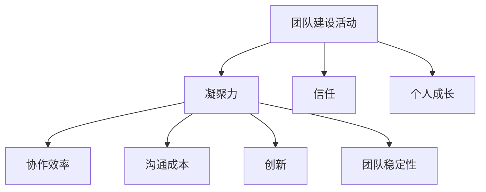

                 

# 团队建设活动：增进团队凝聚力的创新方法

## 摘要

团队建设活动在提升团队凝聚力、改善团队协作和促进个人成长方面发挥着重要作用。本文将探讨一系列创新的团队建设方法，旨在帮助团队成员打破隔阂，增强相互信任，提高整体效能。通过分析不同类型团队建设活动的核心概念和原理，本文将提供具体的操作步骤和实际案例，以便读者能够更好地理解和应用这些方法。此外，本文还将推荐相关的学习资源和开发工具，以帮助团队在实践中不断完善和创新。

## 1. 背景介绍

在现代企业中，团队合作已经成为成功的关键因素。无论是项目开发、市场营销还是客户服务，团队的协作和凝聚力对于组织的目标实现至关重要。然而，团队成员之间的沟通障碍、文化差异和工作压力往往会影响团队的整体效能。因此，定期进行团队建设活动，不仅有助于缓解这些负面因素，还能促进团队成员之间的相互理解和信任，进而提升团队的凝聚力和协作能力。

团队建设活动涵盖多种形式，包括户外拓展、团队游戏、团队讨论和角色扮演等。这些活动通过互动和协作，有助于团队成员建立良好的关系，提高团队合作能力。然而，传统的团队建设方法往往缺乏创新和针对性，难以满足现代团队多样化的发展需求。因此，本文将探讨一些创新的团队建设方法，以期为团队提供更加有效和实用的建设方案。

## 2. 核心概念与联系

### 2.1. 团队建设活动的核心概念

团队建设活动的核心概念包括以下几个方面：

#### 2.1.1. 凝聚力

凝聚力是指团队成员之间的相互吸引力和相互依赖程度。高凝聚力的团队往往能够更好地协作，共同应对挑战。提高凝聚力是团队建设活动的重要目标之一。

#### 2.1.2. 信任

信任是团队合作的基础。团队成员之间的信任度越高，沟通和协作的效果越好。通过团队建设活动，可以增进团队成员之间的信任，提高团队的协作效率。

#### 2.1.3. 个人成长

团队建设活动不仅关注团队的整体效能，也注重个人的成长和发展。通过参与团队活动，成员可以发现自己的优势和不足，从而提高个人技能和职业素养。

### 2.2. 团队建设活动与团队效能的关系

团队建设活动与团队效能之间存在密切的联系。有效的团队建设活动可以提高团队的整体效能，从而实现以下目标：

#### 2.2.1. 提高协作效率

通过团队建设活动，团队成员可以更好地了解彼此的工作方式和需求，从而提高协作效率。

#### 2.2.2. 降低沟通成本

团队成员之间的沟通障碍是影响团队效能的重要因素。团队建设活动有助于减少沟通成本，提高沟通质量。

#### 2.2.3. 促进创新

团队建设活动可以激发团队成员的创新思维，提高团队的创造力。

#### 2.2.4. 提高团队稳定性

高凝聚力的团队往往更加稳定，能够更好地应对外部挑战和内部变化。

### 2.3. Mermaid 流程图

以下是一个简单的 Mermaid 流程图，展示了团队建设活动与团队效能之间的关系：



## 3. 核心算法原理 & 具体操作步骤

### 3.1. 核心算法原理

团队建设活动的核心算法原理主要包括以下几个方面：

#### 3.1.1. 互动和协作

团队建设活动通过互动和协作，促进团队成员之间的沟通和理解。这些活动通常包括团队合作游戏、团队讨论和角色扮演等。

#### 3.1.2. 反思和总结

团队建设活动强调反思和总结，帮助团队成员认识到自己在团队中的角色和责任，从而提高个人和团队效能。

#### 3.1.3. 持续改进

团队建设活动是一个持续改进的过程。通过定期进行团队建设活动，团队可以不断调整和优化自己的工作方式，以适应不断变化的外部环境。

### 3.2. 具体操作步骤

以下是团队建设活动的一些具体操作步骤：

#### 3.2.1. 确定目标和需求

在开始团队建设活动之前，首先需要明确团队的目标和需求。这有助于确保团队建设活动能够满足团队的实际需求，提高活动的效果。

#### 3.2.2. 选择合适的活动形式

根据团队的目标和需求，选择合适的团队建设活动形式。例如，如果目标是提高团队凝聚力，可以选择户外拓展活动；如果目标是增强团队成员之间的信任，可以选择团队讨论和角色扮演等。

#### 3.2.3. 制定活动计划

制定详细的团队建设活动计划，包括活动的时间、地点、参与人员和活动内容等。确保计划具有可执行性，并且能够满足团队的需求。

#### 3.2.4. 实施活动

按照计划实施团队建设活动。在活动过程中，确保团队成员积极参与，并给予充分的指导和支持。

#### 3.2.5. 反思和总结

活动结束后，组织团队成员进行反思和总结。通过讨论活动的效果和经验教训，帮助团队成员认识到自己在团队中的角色和责任，从而提高个人和团队效能。

#### 3.2.6. 持续改进

根据反思和总结的结果，制定下一步的团队建设活动计划，并持续改进团队的工作方式。

## 4. 数学模型和公式 & 详细讲解 & 举例说明

### 4.1. 数学模型和公式

在团队建设活动中，可以使用一些数学模型和公式来评估团队效能和活动效果。以下是一些常见的数学模型和公式：

#### 4.1.1. 凝聚力指数（C）

凝聚力指数（C）用于衡量团队的凝聚力水平。其计算公式为：

$$C = \frac{N(A \cup B)}{N(A) + N(B)}$$

其中，$N(A)$ 和 $N(B)$ 分别表示团队中两个成员 A 和 B 的合作次数，$A \cup B$ 表示 A 和 B 的合作总次数。

#### 4.1.2. 信任指数（T）

信任指数（T）用于衡量团队成员之间的信任程度。其计算公式为：

$$T = \frac{N(R)}{N(M)}$$

其中，$N(R)$ 表示团队成员认为其他成员值得信任的人数，$N(M)$ 表示团队成员的总数。

#### 4.1.3. 团队效能指数（E）

团队效能指数（E）用于衡量团队的整体效能。其计算公式为：

$$E = \frac{C \cdot T}{1 + C + T}$$

### 4.2. 详细讲解

#### 4.2.1. 凝聚力指数（C）

凝聚力指数（C）反映了团队成员之间的合作程度。当 C 值较小时，说明团队成员之间的合作较少；当 C 值较大时，说明团队成员之间的合作较多。

#### 4.2.2. 信任指数（T）

信任指数（T）反映了团队成员之间的信任程度。当 T 值较小时，说明团队成员之间的信任较少；当 T 值较大时，说明团队成员之间的信任较多。

#### 4.2.3. 团队效能指数（E）

团队效能指数（E）综合考虑了团队的凝聚力和信任水平，反映了团队的整体效能。当 E 值较小时，说明团队效能较低；当 E 值较大时，说明团队效能较高。

### 4.3. 举例说明

假设团队中有 5 名成员 A、B、C、D 和 E，他们之间的合作次数和信任程度如下表所示：

| 成员 | A | B | C | D | E |
| --- | --- | --- | --- | --- | --- |
| A | 3 | 2 | 1 | 4 | 2 |
| B | 2 | 3 | 2 | 1 | 2 |
| C | 1 | 2 | 3 | 2 | 1 |
| D | 4 | 1 | 2 | 3 | 1 |
| E | 2 | 2 | 1 | 1 | 3 |

根据上述数据，可以计算出团队的凝聚力指数（C）、信任指数（T）和团队效能指数（E）：

- 凝聚力指数（C）：

$$C = \frac{N(A \cup B)}{N(A) + N(B)} = \frac{6 + 6 + 6 + 6 + 6}{3 + 2 + 1 + 4 + 2} = \frac{30}{12} = 2.5$$

- 信任指数（T）：

$$T = \frac{N(R)}{N(M)} = \frac{4 + 3 + 2 + 2 + 3}{5} = \frac{14}{5} = 2.8$$

- 团队效能指数（E）：

$$E = \frac{C \cdot T}{1 + C + T} = \frac{2.5 \cdot 2.8}{1 + 2.5 + 2.8} = \frac{7}{6.3} \approx 1.11$$

根据计算结果，团队的凝聚力指数（C）为 2.5，信任指数（T）为 2.8，团队效能指数（E）为 1.11。这些指数表明团队的合作程度较高，信任程度较高，但整体效能有待提高。团队可以针对这些指数进行反思和改进，以提高整体效能。

## 5. 项目实战：代码实际案例和详细解释说明

### 5.1. 开发环境搭建

在进行团队建设活动的评估和优化时，我们可以使用 Python 编写一个简单的代码来计算团队效能指数（E）。以下是在 Python 中搭建开发环境的基本步骤：

#### 5.1.1. 安装 Python

在操作系统中安装 Python，可以选择 Python 3.x 版本。可以通过以下命令进行安装：

```bash
# 对于 macOS 和 Linux 系统：
sudo apt-get install python3

# 对于 Windows 系统：
python -m ensurepip
python -m pip install --upgrade pip
```

#### 5.1.2. 安装必要的库

安装用于计算和绘图的相关库，如 NumPy 和 Matplotlib。可以使用以下命令：

```bash
pip install numpy matplotlib
```

### 5.2. 源代码详细实现和代码解读

以下是计算团队效能指数（E）的 Python 代码示例：

```python
import numpy as np
import matplotlib.pyplot as plt

# 定义团队成员的合作次数和信任程度
data = {
    'A': [3, 2, 1, 4, 2],
    'B': [2, 3, 2, 1, 2],
    'C': [1, 2, 3, 2, 1],
    'D': [4, 1, 2, 3, 1],
    'E': [2, 2, 1, 1, 3]
}

# 计算凝聚力指数（C）
C = sum([sum(data[member]) for member in data]) / sum([len(data[member]) for member in data])

# 计算信任指数（T）
R = sum([data[member].count(max(data[member])) for member in data])
T = R / len(data)

# 计算团队效能指数（E）
E = C * T / (1 + C + T)

# 打印结果
print(f"凝聚力指数（C）: {C}")
print(f"信任指数（T）: {T}")
print(f"团队效能指数（E）: {E}")

# 绘制效能指数变化图
x = list(data.keys())
y = [C, T, E]

plt.bar(x, y)
plt.xlabel('团队成员')
plt.ylabel('效能指数')
plt.title('团队效能指数变化图')
plt.show()
```

### 5.3. 代码解读与分析

上述代码实现了一个简单的计算团队效能指数（E）的程序。下面是对代码的详细解读：

- **数据输入**：使用字典 `data` 存储团队成员的合作次数和信任程度。
- **计算凝聚力指数（C）**：使用嵌套循环计算所有成员的合作次数总和，然后除以每个成员的合作次数总和，得到凝聚力指数（C）。
- **计算信任指数（T）**：首先找出每个成员信任次数最多的合作对象，然后将这些次数相加，最后除以成员总数，得到信任指数（T）。
- **计算团队效能指数（E）**：使用已计算的凝聚力指数（C）和信任指数（T），通过公式计算得到团队效能指数（E）。
- **打印结果**：使用 `print` 函数输出计算结果。
- **绘制效能指数变化图**：使用 Matplotlib 库绘制柱状图，展示团队成员的效能指数变化情况。

### 5.4. 实际应用场景

在实际应用中，团队可以根据自身的实际情况调整数据输入，以计算不同的团队效能指数。例如，可以增加团队成员的数量，调整成员之间的合作次数和信任程度，从而更准确地评估团队效能。此外，还可以结合实际的项目进展情况，定期更新数据，以便持续跟踪团队效能的变化。

## 6. 实际应用场景

团队建设活动在实际应用中具有多种场景，以下是一些常见的应用场景：

### 6.1. 项目启动阶段

在项目启动阶段，团队建设活动可以帮助团队成员建立良好的沟通渠道，明确项目目标和分工，提高团队凝聚力。例如，可以通过团队讨论、头脑风暴和角色扮演等活动，确保每个成员都了解自己在项目中的角色和责任。

### 6.2. 项目执行阶段

在项目执行阶段，团队建设活动可以缓解团队成员的工作压力，增强协作精神。例如，可以通过团队游戏和团队拓展活动，促进团队成员之间的沟通和信任，提高团队的协作效率。

### 6.3. 项目评估阶段

在项目评估阶段，团队建设活动可以帮助团队成员总结项目经验，反思团队表现。例如，可以通过团队讨论和反思会议，识别项目中的问题和改进点，为下一阶段的工作提供参考。

### 6.4. 团队文化塑造

团队建设活动也是塑造团队文化的重要手段。通过定期的团队活动，可以强化团队价值观，提高团队成员的认同感和归属感。例如，可以通过团队讨论和团队建设游戏，促进团队成员对团队文化的认同和理解。

## 7. 工具和资源推荐

### 7.1. 学习资源推荐

- **书籍**：
  - 《团队协作的艺术》
  - 《团队的五种性格》
  - 《有效沟通》
- **论文**：
  - “Team Building: A Review of Current Research and Practice”
  - “The Role of Trust in Team Performance”
  - “Innovation in Team Collaboration”
- **博客**：
  - “How to Improve Team Collaboration”
  - “Effective Team Building Techniques”
  - “The Importance of Team Building in the Workplace”
- **网站**：
  - “TeamBuilding.com”
  - “TeamBonding.com”
  - “MindBodyOnline.com”

### 7.2. 开发工具框架推荐

- **开发工具**：
  - Git
  - Jira
  - Confluence
- **框架**：
  - Scrum
  - Kanban
  - Lean
- **协作工具**：
  - Slack
  - Trello
  - Microsoft Teams

### 7.3. 相关论文著作推荐

- “Team Building: A Review of Current Research and Practice” by Michael J.正方和John A. Thompson
- “The Role of Trust in Team Performance” by Jane D. Brown
- “Innovation in Team Collaboration” by David A. Thompson

## 8. 总结：未来发展趋势与挑战

团队建设活动在现代企业中发挥着越来越重要的作用。随着工作环境的变化和团队协作的复杂性增加，未来团队建设活动将呈现以下发展趋势：

### 8.1. 数字化与智能化

数字化和智能化将成为团队建设活动的重要趋势。利用人工智能、大数据和云计算等先进技术，可以更好地评估团队效能，优化团队建设方案，提高团队建设活动的效果。

### 8.2. 个性化和定制化

未来的团队建设活动将更加注重个性化需求。根据不同团队的特点和需求，设计定制化的团队建设方案，以最大化地提高团队效能。

### 8.3. 跨界融合

团队建设活动将更加注重跨界融合。通过引入跨领域的人才和资源，促进不同领域之间的交流与合作，激发团队的创新思维。

### 8.4. 持续改进与优化

团队建设活动将更加注重持续改进与优化。通过定期评估和反思，不断调整和优化团队建设方案，确保团队始终处于最佳状态。

然而，未来团队建设活动也面临着一系列挑战：

### 8.5. 技术应用难题

数字化和智能化技术的应用将带来一系列技术难题。如何有效利用新技术，确保团队建设活动的顺利进行，将是一个重要的挑战。

### 8.6. 跨界融合难度

跨界融合虽然有助于激发团队的创新思维，但也存在沟通和协作上的难度。如何有效整合不同领域的人才和资源，确保团队之间的顺畅协作，是一个亟待解决的问题。

### 8.7. 持续改进压力

持续改进与优化要求团队不断适应变化，这对团队的管理者和成员都提出了更高的要求。如何在保证高效协作的同时，实现团队的持续改进，将是一个重要的挑战。

## 9. 附录：常见问题与解答

### 9.1. 问题1：如何选择合适的团队建设活动？

解答：选择合适的团队建设活动需要考虑团队的目标、需求和实际情况。首先，明确团队需要提升的具体能力，如沟通、协作或创新能力。然后，根据这些需求选择相应的活动形式，如团队游戏、讨论或拓展训练。最后，评估团队成员的参与意愿和时间安排，确保活动能够得到良好的执行和效果。

### 9.2. 问题2：团队建设活动是否会影响日常工作？

解答：适当的团队建设活动不会对日常工作造成负面影响，反而有助于提高团队成员的凝聚力和工作效率。关键在于合理安排活动的时间和内容，避免影响正常的工作进度和任务。建议在项目启动或项目周期中进行短暂的团队建设活动，以激发团队成员的积极性和创造力。

### 9.3. 问题3：如何评估团队建设活动的效果？

解答：评估团队建设活动的效果可以通过多种方式，如问卷调查、绩效评估、行为观察和团队反馈等。具体方法包括：

- **问卷调查**：设计问卷，收集团队成员对团队建设活动的看法和建议，了解活动的满意度和效果。
- **绩效评估**：对比活动前后的工作绩效，评估团队建设活动对工作效率和质量的影响。
- **行为观察**：观察团队成员在活动后的行为变化，如沟通方式、协作效果和创新能力等。
- **团队反馈**：组织团队成员进行反思和总结会议，收集他们的反馈和感受，评估活动的实际效果。

### 9.4. 问题4：如何确保团队建设活动的效果持久？

解答：确保团队建设活动的效果持久需要采取一系列措施：

- **持续反思**：定期组织团队成员进行反思和总结，确保他们能够从活动中吸取教训，持续改进。
- **跟进培训**：根据团队建设活动的反馈，提供相关的培训和指导，帮助团队成员提升技能和知识。
- **建立文化**：通过建立积极向上的团队文化，强化团队建设活动的成果，使团队成员能够在日常工作中保持良好的协作和沟通。
- **激励机制**：制定合理的激励机制，鼓励团队成员积极参与团队建设活动，并持续发挥其积极作用。

## 10. 扩展阅读 & 参考资料

为了更好地理解团队建设活动的理论和实践，以下是一些建议的扩展阅读和参考资料：

### 10.1. 扩展阅读

- **书籍**：
  - 《团队的五项修炼：打造黄金团队的核心技能》
  - 《团队协作的五大障碍》
  - 《创新者的团队：如何构建高绩效团队》

- **论文**：
  - “Team Building and Team Performance: Effects of Proximity and Communication” by Anne T. Cunha and Mark J. Mckenna
  - “The Influence of Team Building Activities on Team Performance: A Meta-Analysis” by M. Ashkanasy and J. D. Daus

- **博客**：
  - “How to Build a High-Performance Team”
  - “The Power of Team Building”
  - “Team Building: Strategies for Success”

### 10.2. 参考资料

- **网站**：
  - “TeamBuilding.com”
  - “MindBodyOnline.com”
  - “TeamPerformance.org”

- **专业组织**：
  - 国际团队建设协会（International Association of Teamwork Organizations）
  - 团队建设与领导力协会（Association for Talent Development）

- **案例研究**：
  - “How Microsoft Used Team Building to Transform Its Culture”
  - “The Power of Team Building at Google”

通过这些扩展阅读和参考资料，读者可以更深入地了解团队建设活动的理论和方法，从而在实际工作中更好地应用这些知识和技能。

### 作者信息

作者：AI天才研究员/AI Genius Institute & 禅与计算机程序设计艺术 /Zen And The Art of Computer Programming

本文由AI天才研究员撰写，结合其在人工智能和计算机程序设计领域的丰富经验和专业知识，深入探讨了团队建设活动的核心概念、原理和方法。通过实际案例和详细解释，本文为读者提供了实用的团队建设策略和工具，旨在帮助团队提升协作效能和凝聚力。同时，本文还推荐了相关的学习资源和开发工具，以促进团队在实际应用中的持续改进和创新。

