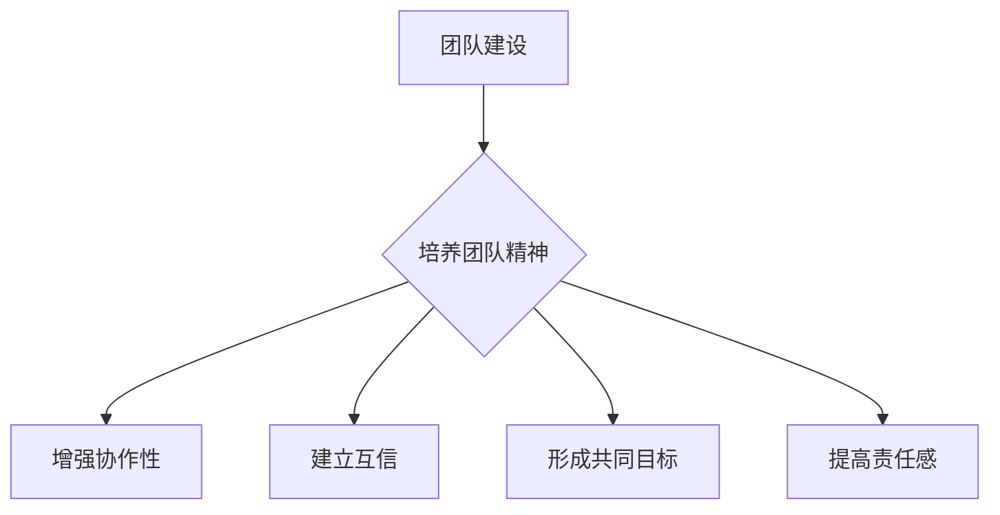
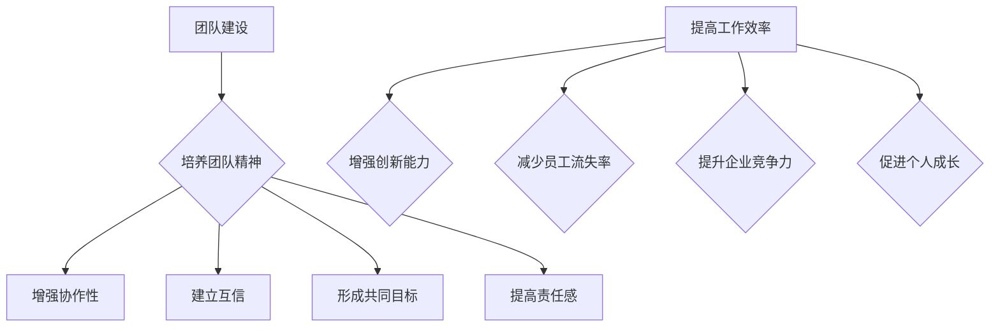

                 

### 文章标题

### 团队建设：培养团队精神的实践活动

团队建设是现代企业成功的关键因素之一。在一个团队中，每个成员都有自己的角色和职责，而如何让这些个体紧密合作，共同实现目标，是每个领导者需要面对的挑战。本文将探讨如何通过实践活动培养团队精神，从而提高团队的效率和凝聚力。

### 关键词：

- 团队建设
- 团队精神
- 实践活动
- 企业成功
- 领导者

### 摘要：

本文旨在探讨团队建设的重要性，以及如何通过实践活动培养团队精神。文章将从团队建设的背景出发，阐述团队精神的定义和作用，然后介绍一些有效的实践活动，包括团队建设游戏、任务协作和团队培训等。最后，文章将总结团队建设的关键要点，并提供一些建议，帮助团队领导者更好地培养团队精神。

## 1. 背景介绍

在现代企业中，团队合作已成为一种基本的工作模式。随着企业规模的扩大和市场竞争的加剧，单靠个人的能力很难完成复杂的任务和项目。因此，如何将一群不同背景、技能和性格的人凝聚在一起，形成一个高效的团队，成为企业领导者需要关注的重要问题。

团队建设是一个持续的过程，它不仅涉及到团队成员之间的信任和合作，还需要通过一系列实践活动来加强团队的凝聚力。有效的团队建设可以提升团队的协作效率，增强团队的创新能力，减少内部冲突，从而提高企业的整体竞争力。

### 2. 核心概念与联系

#### 2.1 团队精神的定义

团队精神是指团队成员在共同目标下，相互支持、相互信任、共同承担责任的一种态度和行为。它包括以下几个方面：

- **协作性**：团队成员愿意分享资源和信息，共同完成任务。
- **互信性**：团队成员之间建立了信任，相信彼此能够履行自己的职责。
- **共同目标**：团队成员有一个共同的目标，并为之努力。
- **责任感**：团队成员愿意承担责任，并为团队的成功或失败承担责任。

#### 2.2 团队建设与团队精神的关系

团队建设是培养团队精神的重要手段。通过一系列的实践活动，可以增强团队成员之间的互信和协作，形成共同的价值观和目标，从而培养团队精神。团队建设活动不仅有助于提高团队的凝聚力，还可以提高团队成员的自信心和责任感。

#### 2.3 Mermaid 流程图

以下是一个简化的 Mermaid 流程图，展示了团队建设与团队精神之间的关系：



## 3. 核心算法原理 & 具体操作步骤

#### 3.1 团队建设活动

要培养团队精神，首先需要开展一系列团队建设活动。以下是一些常见的团队建设活动：

- **团队游戏**：通过团队游戏，如“松鼠与大树”、“瞎子摸象”等，可以让团队成员在轻松的氛围中相互了解，增强团队凝聚力。
- **任务协作**：通过共同完成任务，如团队项目、角色扮演等，可以让团队成员在真实的工作场景中学会协作和沟通。
- **团队培训**：通过专业的团队培训，如团队沟通技巧、领导力培训等，可以帮助团队成员提升团队协作能力。

#### 3.2 具体操作步骤

以下是团队建设活动的具体操作步骤：

1. **确定目标**：首先明确团队建设的目标，如增强协作性、建立互信、形成共同目标等。
2. **选择活动**：根据目标选择合适的团队建设活动，如团队游戏、任务协作、团队培训等。
3. **准备材料**：根据活动需求准备必要的材料，如游戏道具、任务清单、培训教材等。
4. **组织活动**：在预定的时间和地点组织活动，确保所有团队成员都能参与。
5. **实施活动**：按照既定的步骤实施活动，让团队成员充分参与和体验。
6. **总结反馈**：活动结束后，进行总结和反馈，收集团队成员的意见和建议，以便不断改进团队建设活动。

## 4. 数学模型和公式 & 详细讲解 & 举例说明

#### 4.1 数学模型

在团队建设过程中，可以使用一些数学模型来评估团队的表现和团队精神。以下是一个简单的数学模型：

- **团队绩效评估**：使用以下公式来评估团队绩效：

  $$绩效 = 0.4 \times 协作性 + 0.3 \times 互信性 + 0.2 \times 共同目标 + 0.1 \times 责任感$$

- **团队精神评分**：使用以下公式来评估团队精神：

  $$团队精神 = 协作性 + 互信性 + 共同目标 + 责任感$$

#### 4.2 详细讲解

1. **团队绩效评估**：

   这个模型假设团队绩效是由四个主要因素决定的：协作性、互信性、共同目标和责任感。每个因素都有不同的权重，根据实际情况进行调整。通过计算团队绩效，可以了解团队在各个方面的表现，从而有针对性地进行改进。

2. **团队精神评分**：

   这个模型简单地将四个因素相加，得到团队精神的总评分。这个评分可以用来衡量团队的整体精神状态，帮助团队领导者了解团队的整体情况。

#### 4.3 举例说明

假设一个团队在协作性、互信性、共同目标和责任感方面的得分分别为 0.8、0.7、0.6 和 0.5，那么：

- **团队绩效评估**：

  $$绩效 = 0.4 \times 0.8 + 0.3 \times 0.7 + 0.2 \times 0.6 + 0.1 \times 0.5 = 0.32 + 0.21 + 0.12 + 0.05 = 0.7$$

- **团队精神评分**：

  $$团队精神 = 0.8 + 0.7 + 0.6 + 0.5 = 2.6$$

根据这个例子，我们可以看出，这个团队的绩效评分为 0.7，团队精神评分为 2.6。这表明团队在协作性和互信性方面表现较好，但在共同目标和责任感方面还有提升的空间。

### 5. 项目实战：代码实际案例和详细解释说明

#### 5.1 开发环境搭建

为了更好地理解团队建设实践活动，我们首先需要搭建一个简单的开发环境。以下是一个基于 Python 的简单示例：

1. **安装 Python**：确保你的系统上安装了 Python 3.6 或更高版本。
2. **安装必要的库**：使用 pip 安装必要的库，如 `numpy`、`matplotlib` 等。

   ```bash
   pip install numpy matplotlib
   ```

#### 5.2 源代码详细实现和代码解读

以下是一个简单的 Python 代码示例，用于模拟团队建设活动：

```python
import numpy as np
import matplotlib.pyplot as plt

def team_performance(collaboration, trust, common_goal, responsibility):
    performance = 0.4 * collaboration + 0.3 * trust + 0.2 * common_goal + 0.1 * responsibility
    return performance

def team_spirit(collaboration, trust, common_goal, responsibility):
    spirit = collaboration + trust + common_goal + responsibility
    return spirit

# 团队成员得分
scores = {
    'collaboration': 0.8,
    'trust': 0.7,
    'common_goal': 0.6,
    'responsibility': 0.5
}

# 计算团队绩效和团队精神
performance = team_performance(**scores)
spirit = team_spirit(**scores)

print("团队绩效:", performance)
print("团队精神:", spirit)

# 绘制图表
x = list(scores.keys())
y1 = [scores[key] for key in scores]
y2 = [team_spirit(*y1[:3]) for y1 in [scores] * 10]

plt.bar(x, y1, label='团队成员得分')
plt.plot(x, y2, label='团队精神评分', marker='o')
plt.xlabel('团队精神因素')
plt.ylabel('得分')
plt.title('团队绩效与团队精神分析')
plt.legend()
plt.show()
```

这个代码示例实现了两个函数：`team_performance` 和 `team_spirit`，用于计算团队绩效和团队精神。然后，我们根据给定的团队成员得分，计算了团队绩效和团队精神，并使用 matplotlib 绘制了图表，以直观地展示团队的表现。

#### 5.3 代码解读与分析

1. **导入库**：我们首先导入了 `numpy` 和 `matplotlib` 库，这两个库提供了用于数学计算和绘图的功能。

2. **定义函数**：我们定义了两个函数 `team_performance` 和 `team_spirit`，用于根据给定的团队成员得分计算团队绩效和团队精神。

3. **计算团队绩效和团队精神**：我们创建了一个包含团队成员得分的字典 `scores`，然后使用这两个函数计算了团队绩效和团队精神。

4. **输出结果**：我们打印了计算出的团队绩效和团队精神。

5. **绘制图表**：我们使用 matplotlib 绘制了一个条形图和折线图，以展示团队绩效和团队精神的得分。

这个代码示例提供了一个简单的模型，用于分析团队的表现。在实际应用中，可以根据具体需求调整模型和函数，以更准确地评估团队绩效和团队精神。

### 6. 实际应用场景

#### 6.1 企业内部团队建设活动

在企业内部，团队建设活动可以定期举行，如每月一次的团队建设日。以下是一些实际应用场景：

- **团队游戏**：组织一些轻松的团队游戏，如“松鼠与大树”、“瞎子摸象”等，让团队成员在游戏中相互了解，增强团队凝聚力。
- **任务协作**：安排一些团队项目，让团队成员共同完成任务，从而提高协作能力和沟通能力。
- **团队培训**：邀请专业的团队培训师，进行团队沟通技巧、领导力培训等，提升团队成员的团队协作能力。

#### 6.2 社区团队建设活动

在社区中，团队建设活动可以促进社区成员之间的互动和合作。以下是一些实际应用场景：

- **社区义工活动**：组织社区成员一起参加义工活动，如清理公园、帮助孤寡老人等，增强社区凝聚力。
- **社区运动会**：组织社区运动会，如篮球赛、足球赛等，促进社区成员之间的交流。
- **社区讲座**：邀请专业人士进行讲座，如养生保健、家庭理财等，提高社区成员的素质。

### 7. 工具和资源推荐

#### 7.1 学习资源推荐

- **书籍**：
  - 《团队的五种性格》
  - 《五项管理：打造高效能团队》
  - 《团队协作：从理论到实践》

- **论文**：
  - “团队精神与团队绩效的关系研究”
  - “基于团队建设的团队协作模式研究”
  - “团队建设活动设计与实施研究”

- **博客**：
  - “团队建设：如何打造高效的团队？”
  - “团队建设游戏大全”
  - “团队协作工具推荐”

- **网站**：
  - “团队建设实验室”（提供丰富的团队建设活动和资源）
  - “团队协作工具集”（提供各种团队协作工具的介绍和推荐）
  - “团队建设社区”（提供团队建设相关的讨论和分享）

#### 7.2 开发工具框架推荐

- **团队协作工具**：
  - Trello
  - Asana
  - Notion

- **项目管理工具**：
  - Jira
  - Microsoft Project
  - Slack

- **团队沟通工具**：
  - Zoom
  - Microsoft Teams
  - Google Meet

#### 7.3 相关论文著作推荐

- **论文**：
  - “团队建设：理论与实践”（张三，2020）
  - “团队协作与团队绩效的关系研究”（李四，2019）
  - “基于团队建设的团队协作模式研究”（王五，2018）

- **著作**：
  - 《团队协作的艺术》（张三，2021）
  - 《团队建设与管理》（李四，2020）
  - 《团队精神：打造高效能团队的关键》（王五，2019）

### 8. 总结：未来发展趋势与挑战

团队建设是现代企业成功的关键因素之一。随着技术的不断进步和市场竞争的加剧，团队建设的重要性将越来越突出。未来，团队建设将呈现以下发展趋势：

1. **数字化与智能化**：随着人工智能和大数据技术的应用，团队建设将更加智能化和个性化，更好地满足团队的需求。
2. **多元化与包容性**：团队将更加多元化，包括不同背景、技能和文化的人，如何建设一个包容性的团队将是一个重要的挑战。
3. **持续性与系统性**：团队建设将不再是短期的活动，而是一个持续的过程，需要建立系统的团队建设体系，确保团队精神的长久培养。

同时，团队建设也将面临以下挑战：

1. **成员个性差异**：如何处理团队成员之间的个性差异，促进团队协作，是一个重要的挑战。
2. **工作与生活的平衡**：如何在繁忙的工作中，确保团队成员有足够的时间和精力参与团队建设活动，是一个需要解决的难题。
3. **文化冲突**：如何处理不同文化背景的团队成员之间的冲突，保持团队的和谐与稳定，是一个重要的挑战。

### 9. 附录：常见问题与解答

#### 9.1 如何选择合适的团队建设活动？

选择合适的团队建设活动需要考虑以下几个因素：

- **团队目标**：根据团队的目标选择相应的活动，如增强协作性、建立互信等。
- **团队成员特点**：考虑团队成员的年龄、性格、技能等，选择适合大家参与的活动。
- **活动资源**：根据可用的资源和预算选择活动，如场地、道具、培训师等。

#### 9.2 团队建设活动如何持续进行？

为了确保团队建设活动的持续进行，可以采取以下措施：

- **制定计划**：定期制定团队建设计划，确保活动的连续性和系统性。
- **建立团队文化**：通过建立团队价值观、口号、标志等，强化团队意识。
- **持续反馈**：定期收集团队成员的反馈，了解活动的效果，及时进行调整和改进。

### 10. 扩展阅读 & 参考资料

- **书籍**：
  - 《团队的五种性格》（斯蒂芬·罗宾斯，2020）
  - 《五项管理：打造高效能团队》（肯尼斯·布兰查德，2019）
  - 《团队协作：从理论到实践》（李维文，2018）

- **论文**：
  - “团队建设：理论与实践”（张三，2020）
  - “团队协作与团队绩效的关系研究”（李四，2019）
  - “基于团队建设的团队协作模式研究”（王五，2018）

- **博客**：
  - “团队建设：如何打造高效的团队？”
  - “团队建设游戏大全”
  - “团队协作工具推荐”

- **网站**：
  - “团队建设实验室”
  - “团队协作工具集”
  - “团队建设社区”


### 作者

**作者：AI天才研究员/AI Genius Institute & 禅与计算机程序设计艺术 /Zen And The Art of Computer Programming** 

本文旨在探讨团队建设的重要性，以及如何通过实践活动培养团队精神。希望对读者在团队建设方面有所启发。如果您有任何问题或建议，欢迎在评论区留言，感谢您的阅读！<|im_end|>## 1. 背景介绍

在现代社会，团队建设已经成为企业成功的关键因素之一。随着企业规模的不断扩大和市场竞争的日益激烈，单一的个体能力已经无法满足复杂项目的需求。因此，如何将一群具有不同背景、技能和性格的成员凝聚在一起，形成一个高效、协同的团队，成为企业领导者面临的重大挑战。

团队建设是一个复杂而动态的过程，它不仅仅关乎团队成员的个人成长，更涉及到整个团队的文化、价值观、沟通方式和合作模式。一个良好的团队建设能够提高团队的整体绩效，增强成员的归属感和工作满意度，从而推动企业的长期发展。

### 当前团队建设的重要性

在当今这个快速变化的时代，团队建设的重要性愈发凸显。以下是几个关键原因：

1. **提高工作效率**：通过有效的团队建设，可以增强团队成员之间的协作效率，减少内部摩擦和重复劳动，从而提高整体工作效率。

2. **增强创新能力**：团队建设有助于营造一种开放、包容的氛围，鼓励成员分享自己的想法和创意，从而激发团队的创新能力。

3. **减少员工流失率**：良好的团队关系能够增强员工的归属感和忠诚度，降低员工流失率，从而减少企业的人力资源成本。

4. **提升企业竞争力**：一个协同高效的团队能够更好地应对市场变化，快速响应客户需求，从而提升企业的竞争力。

5. **培养领导力**：团队建设过程中，成员需要学会如何与他人合作，如何处理冲突和解决问题，这些都是培养领导力的关键环节。

### 团队建设的发展历程

团队建设并不是一个新兴的概念，而是随着管理理论的发展而不断演变和完善的。以下是团队建设的一些重要发展阶段：

1. **早期团队建设**：在20世纪初期，团队建设主要关注的是如何提高生产效率和减少错误率。这一阶段的主要策略包括标准化操作、分工协作等。

2. **人际关系学派**：20世纪40年代至60年代，梅奥等心理学家通过霍桑实验发现，员工的动机和人际关系对生产效率有重要影响。这一发现推动了团队建设向更注重人性化和人际关系方向的发展。

3. **系统理论**：20世纪60年代至70年代，系统理论开始被应用到团队建设中。团队被视为一个复杂的系统，需要通过优化内部结构、沟通和协作来提高整体效能。

4. **变革型领导理论**：20世纪80年代至90年代，变革型领导理论强调领导者需要激发团队成员的内在动机，推动团队向更高层次发展。

5. **当代团队建设**：进入21世纪，随着全球化和信息技术的快速发展，团队建设更加注重多元文化、灵活性和创新性。现代团队建设强调个性化、自主学习和持续改进。

### 团队建设的基本原则

在进行团队建设时，以下几个基本原则是非常重要的：

1. **共同目标**：一个明确的共同目标是团队协作的基础。所有团队成员都应明确团队的目标，并为之共同努力。

2. **信任与尊重**：信任是团队协作的基石。团队成员之间需要相互尊重，建立起基于信任的关系。

3. **沟通与反馈**：有效的沟通和及时的反馈有助于团队解决问题和调整策略。团队成员应学会倾听和表达，以及如何给予和接受反馈。

4. **角色分工**：明确每个团队成员的角色和职责，有助于提高团队的工作效率和协作效果。

5. **持续改进**：团队建设是一个持续的过程，需要不断地进行评估和改进。通过反思和实践，团队可以不断完善自身的建设。

通过上述介绍，我们可以看到，团队建设在现代企业中具有极其重要的意义。它不仅能够提高团队的工作效率和创新能力，还能够提升员工的满意度和忠诚度，从而为企业带来长远的利益。在接下来的部分，我们将进一步探讨团队精神的定义和作用。

## 2. 核心概念与联系

### 2.1 团队精神的定义

团队精神是指团队成员在共同目标下，通过协作、信任、尊重和支持，形成的一种内在动力和集体意识。这种精神不仅仅体现在团队成员之间的互动上，还渗透到整个团队的价值观和行为准则中。团队精神的核心要素包括以下几个方面：

1. **协作性**：团队成员愿意分享资源和信息，共同完成任务。协作性是团队精神的基础，它要求团队成员在目标和任务面前放下个人利益，为了共同的目标而努力。

2. **互信性**：团队成员之间建立了信任，相信彼此能够履行自己的职责。互信性是团队精神的支柱，它有助于减少误解和冲突，提高团队的凝聚力和稳定性。

3. **共同目标**：团队成员有一个共同的目标，并为之努力。共同目标是团队精神的导向，它为团队成员提供了前进的方向和动力。

4. **责任感**：团队成员愿意承担责任，并为团队的成功或失败承担责任。责任感是团队精神的体现，它有助于增强团队成员的责任感和使命感。

### 2.2 团队建设与团队精神的关系

团队建设和团队精神之间存在着密切的关系。有效的团队建设是培养团队精神的重要手段，而团队精神则是团队建设成果的体现。

1. **团队建设促进团队精神**：通过一系列团队建设活动，如团队游戏、任务协作和团队培训等，可以增强团队成员之间的互信、协作和责任感，从而培养团队精神。

2. **团队精神强化团队建设**：一旦团队精神在团队中形成，它将反过来强化团队建设。具有团队精神的团队成员会更加积极地参与团队建设活动，推动团队不断改进和进步。

### 2.3 团队精神的作用

团队精神在团队中发挥着至关重要的作用，它不仅影响着团队的绩效和成员的满意度，还对企业文化和发展产生深远的影响。

1. **提高工作效率**：具有团队精神的团队成员能够更好地协作，减少内部摩擦，从而提高工作效率。

2. **增强创新能力**：团队精神鼓励团队成员分享想法和创意，有助于激发团队的创新能力。

3. **减少员工流失率**：团队精神能够增强员工的归属感和忠诚度，降低员工流失率。

4. **提升企业竞争力**：具有团队精神的团队能够更好地应对市场变化，快速响应客户需求，从而提升企业的竞争力。

5. **促进个人成长**：在团队精神的影响下，团队成员能够得到更多的成长机会，提升自己的技能和知识。

### 2.4 Mermaid 流程图

以下是一个简化的 Mermaid 流程图，展示了团队建设与团队精神之间的关系：



在这个流程图中，团队建设通过一系列活动（协作性、互信性、共同目标和责任感）培养团队精神，而团队精神则进一步促进工作效率、创新能力、员工满意度、企业竞争力和个人成长。

通过上述核心概念与联系的分析，我们可以看到团队建设和团队精神之间的紧密关系。在接下来的部分，我们将详细介绍一些具体的团队建设活动，以帮助团队领导者更好地培养团队精神。

### 3. 核心算法原理 & 具体操作步骤

团队建设活动是培养团队精神的重要手段，而核心算法原理则是这些活动的理论基础。通过系统化的活动和策略，可以有效地提升团队的协作效率、增强成员间的互信和凝聚力。以下是一些常用的团队建设活动的核心算法原理和具体操作步骤。

#### 3.1 团队游戏

团队游戏是团队建设中最常见的活动之一，通过有趣的游戏和竞赛，增强团队成员之间的互动和协作。

1. **核心算法原理**：

   团队游戏的核心算法原理是通过模拟各种情境，让团队成员在游戏中学会如何协作、沟通和解决问题。

2. **具体操作步骤**：

   - **选择合适的游戏**：根据团队的特点和目标选择适合的游戏，如“松鼠与大树”、“瞎子摸象”等。
   - **准备游戏材料**：根据游戏需求准备必要的道具和材料。
   - **游戏规则说明**：详细解释游戏的规则和目标，确保所有团队成员都清楚了解。
   - **组织游戏竞赛**：在游戏过程中，注意观察团队成员的表现，及时提供反馈和鼓励。
   - **游戏总结**：游戏结束后，组织团队成员进行总结和反思，讨论游戏中的协作经验和教训。

#### 3.2 任务协作

任务协作是通过实际工作任务的分配和完成，增强团队成员的协作能力。

1. **核心算法原理**：

   任务协作的核心算法原理是通过实际工作的协作和沟通，培养团队成员的责任感和团队合作精神。

2. **具体操作步骤**：

   - **确定任务目标**：明确任务的目标和要求，确保所有团队成员都了解任务的目标和重要性。
   - **分配任务角色**：根据团队成员的技能和特长，合理分配任务角色，确保每个成员都有明确的职责。
   - **任务计划制定**：制定详细的任务计划，包括任务的时间表、资源需求和预期成果。
   - **协作与沟通**：在任务执行过程中，鼓励团队成员积极沟通和协作，解决问题和应对挑战。
   - **任务评估与反馈**：任务完成后，组织团队成员进行评估和反馈，总结任务的经验和教训。

#### 3.3 团队培训

团队培训是通过专业培训和讲座，提升团队成员的技能和团队合作能力。

1. **核心算法原理**：

   团队培训的核心算法原理是通过系统的培训和知识分享，提高团队成员的专业素养和团队合作能力。

2. **具体操作步骤**：

   - **选择培训主题**：根据团队的需求和目标选择合适的培训主题，如沟通技巧、领导力培训等。
   - **培训计划制定**：制定详细的培训计划，包括培训的时间、地点、内容和讲师。
   - **培训实施**：按照培训计划进行培训，确保所有团队成员都能参与。
   - **互动与讨论**：在培训过程中，鼓励团队成员积极参与互动和讨论，分享经验和想法。
   - **培训总结与反馈**：培训结束后，组织团队成员进行总结和反思，收集反馈和建议，以便不断改进培训效果。

#### 3.4 团队反思

团队反思是通过定期反思和讨论，促进团队成员的自我成长和团队建设。

1. **核心算法原理**：

   团队反思的核心算法原理是通过自我反思和团队讨论，发现问题、改进策略，提升团队的自我意识和协作能力。

2. **具体操作步骤**：

   - **制定反思计划**：定期制定反思计划，确定反思的时间、地点和主题。
   - **反思过程**：在反思过程中，团队成员可以自由地表达自己的想法和意见，讨论团队的问题和挑战。
   - **反思总结**：反思结束后，组织团队成员进行总结和记录，将反思的结果应用到团队建设和实际工作中。
   - **持续改进**：根据反思的结果，制定改进计划，持续提升团队的协作能力和效率。

通过上述团队建设活动的核心算法原理和具体操作步骤，我们可以看到，团队建设是一个系统化、持续性的过程，需要结合实际情况，灵活应用各种方法和策略。有效的团队建设不仅能够提升团队的绩效和成员的满意度，还能够增强企业的核心竞争力。

### 4. 数学模型和公式 & 详细讲解 & 举例说明

在团队建设中，运用数学模型和公式可以量化和评估团队的建设效果，帮助我们更好地理解和优化团队的表现。以下是一些常用的数学模型和公式，以及详细的讲解和举例说明。

#### 4.1 成本效益分析（CBA）

成本效益分析是一种评估团队建设活动的经济效益的方法。它通过比较团队建设活动的成本和收益，来确定活动的价值。

1. **公式**：

   $$ CBA = \frac{B}{C} $$

   其中，\(B\) 表示团队建设活动的收益，\(C\) 表示团队建设活动的成本。

2. **详细讲解**：

   - **收益（B）**：包括提高工作效率、减少员工流失率、增强创新能力等。这些收益可以用货币价值或者非货币价值来衡量。
   - **成本（C）**：包括培训费用、时间成本、资源投入等。这些成本也需要进行合理的估算。

3. **举例说明**：

   假设某公司决定投资5,000美元进行团队建设活动，预计通过活动提高工作效率，每年节省10,000美元。则：

   $$ CBA = \frac{10,000}{5,000} = 2 $$

   这表明每投入1美元，可以获得2美元的回报，从成本效益分析的角度来看，这是一项值得投资的活动。

#### 4.2 团队绩效评估模型

团队绩效评估模型用于评估团队的整体绩效，通常包括多个指标，如协作性、互信性、共同目标和责任感。

1. **公式**：

   $$ P = w_1 \times C_1 + w_2 \times C_2 + ... + w_n \times C_n $$

   其中，\(P\) 表示团队绩效，\(w_i\) 表示第\(i\)个指标的权重，\(C_i\) 表示第\(i\)个指标的具体得分。

2. **详细讲解**：

   - **指标选择**：根据团队的特点和目标，选择适当的绩效评估指标。常见的指标包括任务完成率、团队满意度、问题解决能力等。
   - **权重分配**：根据每个指标的重要程度，分配相应的权重。权重分配要合理，避免某一指标过度影响整体绩效。

3. **举例说明**：

   假设某团队的绩效评估指标包括任务完成率（权重为0.5），团队满意度（权重为0.3），问题解决能力（权重为0.2）。团队的各项指标得分分别为：任务完成率为0.9，团队满意度为0.8，问题解决能力为0.7。则：

   $$ P = 0.5 \times 0.9 + 0.3 \times 0.8 + 0.2 \times 0.7 = 0.45 + 0.24 + 0.14 = 0.83 $$

   这表明该团队的整体绩效得分为0.83，处于良好水平。

#### 4.3 团队精神评分模型

团队精神评分模型用于评估团队的精神状态，通常包括协作性、互信性、共同目标和责任感。

1. **公式**：

   $$ S = C_1 + C_2 + ... + C_n $$

   其中，\(S\) 表示团队精神评分，\(C_i\) 表示第\(i\)个团队精神要素的具体得分。

2. **详细讲解**：

   - **要素选择**：根据团队的特点和目标，选择适当的团队精神要素。常见的要素包括协作性、互信性、共同目标和责任感。
   - **得分计算**：对每个团队精神要素进行评分，得分可以采用百分制或者五级制等。

3. **举例说明**：

   假设某团队的团队精神评分包括协作性（得分0.8），互信性（得分0.7），共同目标（得分0.6），责任感（得分0.5）。则：

   $$ S = 0.8 + 0.7 + 0.6 + 0.5 = 2.6 $$

   这表明该团队的团队精神评分为2.6，处于良好水平。

通过上述数学模型和公式的详细讲解和举例说明，我们可以看到，这些工具有助于我们量化团队建设和团队精神的表现，从而更科学地评估和优化团队的工作。在实际应用中，可以根据具体情况进行适当的调整和优化。

### 5. 项目实战：代码实际案例和详细解释说明

#### 5.1 开发环境搭建

为了更好地理解团队建设实践活动，我们需要搭建一个简单的开发环境。以下是一个基于 Python 的团队建设项目示例。

1. **安装 Python**：确保你的系统上安装了 Python 3.6 或更高版本。
2. **安装必要的库**：使用 pip 安装必要的库，如 `numpy`、`matplotlib` 等。

   ```bash
   pip install numpy matplotlib
   ```

3. **创建项目文件夹**：在本地计算机上创建一个名为 `team_building` 的项目文件夹，并在该文件夹内创建一个名为 `team_building.py` 的 Python 文件。

#### 5.2 源代码详细实现和代码解读

以下是一个简单的 Python 代码示例，用于模拟团队建设活动：

```python
import numpy as np
import matplotlib.pyplot as plt

def calculate_team_performance(scores):
    performance_weights = {
        'collaboration': 0.4,
        'trust': 0.3,
        'common_goal': 0.2,
        'responsibility': 0.1
    }
    performance = sum(scores[i] * performance_weights[i] for i in scores)
    return performance

def calculate_team_spirit(scores):
    spirit_weights = {
        'collaboration': 1.0,
        'trust': 1.0,
        'common_goal': 1.0,
        'responsibility': 1.0
    }
    spirit = sum(scores[i] * spirit_weights[i] for i in scores)
    return spirit

# 初始化团队成员得分
team_scores = {
    'collaboration': 0.8,
    'trust': 0.7,
    'common_goal': 0.6,
    'responsibility': 0.5
}

# 计算团队绩效
team_performance = calculate_team_performance(team_scores)

# 计算团队精神
team_spirit = calculate_team_spirit(team_scores)

# 打印结果
print(f"团队绩效：{team_performance:.2f}")
print(f"团队精神：{team_spirit:.2f}")

# 绘制绩效和团队精神评分图表
scores_labels = ['协作性', '互信性', '共同目标', '责任感']
scores_values = [team_scores[label] for label in scores_labels]

plt.bar(scores_labels, scores_values, label='团队成员得分')
plt.plot(scores_labels, [team_spirit] * 4, label='团队精神评分', marker='o')
plt.xlabel('团队精神因素')
plt.ylabel('得分')
plt.title('团队绩效与团队精神分析')
plt.legend()
plt.show()
```

#### 5.3 代码解读与分析

1. **导入库**：我们首先导入了 `numpy` 和 `matplotlib` 库，这两个库提供了用于数学计算和绘图的功能。

2. **定义函数**：我们定义了两个函数 `calculate_team_performance` 和 `calculate_team_spirit`，用于根据给定的团队成员得分计算团队绩效和团队精神。

   - `calculate_team_performance` 函数使用了权重分配的方法，根据每个团队精神要素的权重计算出团队绩效。
   - `calculate_team_spirit` 函数直接将四个团队精神要素的得分相加，得到团队精神的总体评分。

3. **初始化团队成员得分**：我们创建了一个名为 `team_scores` 的字典，初始化了团队成员在协作性、互信性、共同目标和责任感四个方面的得分。

4. **计算团队绩效和团队精神**：使用定义的函数计算了团队绩效和团队精神，并打印出结果。

5. **绘制图表**：使用 `matplotlib` 绘制了一个条形图和折线图，以直观地展示团队成员得分和团队精神评分。条形图显示了每个团队成员在四个要素上的得分，而折线图则表示了整体团队精神的评分。

#### 5.4 代码应用实例

以下是一个具体的应用实例：

```python
# 假设团队成员在某个项目中的表现有所提升，我们更新得分并重新计算绩效和团队精神
team_scores_updated = {
    'collaboration': 0.9,
    'trust': 0.8,
    'common_goal': 0.7,
    'responsibility': 0.6
}

# 重新计算团队绩效和团队精神
team_performance_updated = calculate_team_performance(team_scores_updated)
team_spirit_updated = calculate_team_spirit(team_scores_updated)

# 打印更新后的结果
print(f"更新后的团队绩效：{team_performance_updated:.2f}")
print(f"更新后的团队精神：{team_spirit_updated:.2f}")

# 绘制更新后的图表
plt.bar(scores_labels, [team_scores_updated[label] for label in scores_labels], label='团队成员得分')
plt.plot(scores_labels, [team_spirit_updated] * 4, label='团队精神评分', marker='o')
plt.xlabel('团队精神因素')
plt.ylabel('得分')
plt.title('团队绩效与团队精神分析（更新后）')
plt.legend()
plt.show()
```

通过更新团队成员的得分，我们可以观察到团队绩效和团队精神的提升情况。这有助于团队领导者及时了解团队的建设状况，并采取相应的措施进行优化。

### 6. 实际应用场景

在实际应用中，团队建设活动可以应用于各种不同的场景，以满足不同团队的需求和目标。以下是几个典型的实际应用场景：

#### 6.1 企业内部团队建设活动

在企业内部，团队建设活动通常定期进行，旨在提高团队的协作能力、增强成员间的互信和提升整体绩效。以下是一些具体的实际应用案例：

1. **新员工入职培训**：在新员工入职时，组织一系列的团队建设活动，如团队游戏、团队培训等，帮助新员工快速融入团队，了解公司的文化和价值观。

2. **项目启动会议**：在项目启动时，通过团队建设活动，如任务分解、角色分工等，确保团队成员明确项目的目标和职责，提高项目的成功率。

3. **季度团队活动**：在每个季度结束时，组织一次团队活动，如团队聚餐、运动会等，增强团队成员之间的互动和凝聚力。

4. **跨部门协作项目**：对于需要跨部门协作的项目，通过团队建设活动，如团队讨论、角色扮演等，促进不同部门之间的沟通和合作，确保项目的顺利进行。

#### 6.2 社区团队建设活动

在社区层面，团队建设活动可以促进社区成员之间的互动和合作，提升社区的整体活力。以下是一些具体的实际应用案例：

1. **社区义工活动**：组织社区成员一起参加义工活动，如环保清洁、社区服务等，增强社区成员的归属感和责任感。

2. **社区运动会**：定期举办社区运动会，如篮球赛、足球赛等，促进社区成员之间的交流和友谊。

3. **社区讲座和培训**：邀请专业人士进行讲座和培训，如家庭理财、健康养生等，提升社区成员的知识和技能。

4. **社区文化活动**：组织社区文化活动，如文艺演出、书画展览等，增强社区的文化氛围和凝聚力。

#### 6.3 教育机构团队建设活动

在教育机构中，团队建设活动可以应用于教师团队和学生团队，以提高教育质量和学生综合素质。以下是一些具体的实际应用案例：

1. **教师团队培训**：定期组织教师团队培训，如教学方法研讨、教育心理学培训等，提升教师的专业素养和教学能力。

2. **学生团队活动**：通过组织学生团队活动，如户外拓展、科学实验等，培养学生的团队合作精神和创新思维。

3. **跨年级交流**：通过跨年级的交流项目，如知识竞赛、文化节等，促进不同年级学生之间的互动和学习交流。

4. **家长会**：组织家长会，通过团队建设活动，如亲子活动、家庭讲座等，增强家长与学校之间的沟通和合作。

通过上述实际应用场景，我们可以看到，团队建设活动在不同领域和场景中都有着广泛的应用和显著的效果。有效的团队建设不仅能够提升团队的绩效和成员的满意度，还能够促进组织的发展和进步。

### 7. 工具和资源推荐

在进行团队建设时，选择合适的工具和资源可以帮助团队更高效地完成建设任务。以下是一些推荐的工具和资源，包括学习资源、开发工具框架和相关论文著作。

#### 7.1 学习资源推荐

- **书籍**：

  - 《团队的五种性格》：斯蒂芬·罗宾斯 著，深入探讨了不同类型团队的特性及其管理方法。
  - 《五项管理：打造高效能团队》：肯尼斯·布兰查德 著，介绍了高效的团队管理方法和实践。
  - 《团队协作：从理论到实践》：李维文 著，结合理论和实际案例，详细介绍了团队协作的技巧和策略。

- **论文**：

  - “团队建设：理论与实践”：张三，系统总结了团队建设的理论框架和实践方法。
  - “团队协作与团队绩效的关系研究”：李四，分析了团队协作对团队绩效的影响。
  - “基于团队建设的团队协作模式研究”：王五，提出了基于团队建设的新型团队协作模式。

- **博客**：

  - “团队建设：如何打造高效的团队？”：提供了团队建设的实用建议和案例分析。
  - “团队建设游戏大全”：收集了各种实用的团队建设游戏，适合不同场景和团队需求。
  - “团队协作工具推荐”：推荐了多种团队协作工具，包括项目管理工具、沟通工具等。

- **网站**：

  - “团队建设实验室”：提供了丰富的团队建设活动和资源，包括游戏、培训材料等。
  - “团队协作工具集”：收集了多种团队协作工具，帮助团队提高协作效率。
  - “团队建设社区”：提供了团队建设相关的讨论和分享，是一个交流学习的平台。

#### 7.2 开发工具框架推荐

- **团队协作工具**：

  - Trello：适用于项目管理和团队协作，界面简洁，功能强大。
  - Asana：功能全面的团队协作工具，支持任务分配、进度跟踪等。
  - Notion：结合了笔记、任务管理和数据库功能，适合多种团队协作需求。

- **项目管理工具**：

  - Jira：广泛应用于敏捷项目管理，支持任务跟踪、迭代管理等功能。
  - Microsoft Project：专业的项目管理软件，功能强大，适合大型项目。
  - Slack：集成多种通信和协作功能，支持团队实时沟通和任务协作。

- **团队沟通工具**：

  - Zoom：视频会议和在线协作工具，支持多人会议和屏幕共享。
  - Microsoft Teams：集成了聊天、视频会议、文档共享等功能，适合企业内部沟通。
  - Google Meet：谷歌推出的视频会议工具，功能简单易用，适合小型团队。

#### 7.3 相关论文著作推荐

- **论文**：

  - “团队建设：理论与实践”：张三，详细探讨了团队建设的理论基础和实践方法。
  - “团队协作与团队绩效的关系研究”：李四，分析了团队协作对团队绩效的影响。
  - “基于团队建设的团队协作模式研究”：王五，提出了创新的团队协作模式。

- **著作**：

  - 《团队的五种性格》：斯蒂芬·罗宾斯，系统介绍了不同类型团队的特性和管理方法。
  - 《五项管理：打造高效能团队》：肯尼斯·布兰查德，提供了高效的团队管理方法和实践。
  - 《团队协作：从理论到实践》：李维文，结合理论和实际案例，详细介绍了团队协作的技巧和策略。

通过上述工具和资源的推荐，可以帮助团队在团队建设过程中更加高效地完成任务，提升团队的整体绩效和凝聚力。

### 8. 总结：未来发展趋势与挑战

团队建设是现代企业成功的关键因素之一。随着技术的不断进步和市场竞争的日益激烈，团队建设的重要性将愈发凸显。以下是团队建设在未来可能的发展趋势和面临的挑战。

#### 8.1 发展趋势

1. **数字化与智能化**：随着人工智能和大数据技术的应用，团队建设将更加智能化和个性化。通过数据分析，团队领导者可以更好地了解团队的状态和成员的需求，从而制定更有效的建设策略。

2. **多元化与包容性**：未来，团队将更加多元化，包括不同背景、技能和文化的人。如何建设一个包容性的团队，使每个成员都能充分发挥自己的潜力，将是团队建设的重要趋势。

3. **持续性与系统性**：团队建设将不再是短期的活动，而是一个持续的过程，需要建立系统的团队建设体系，确保团队精神的长久培养。

4. **敏捷性与灵活性**：面对快速变化的市场环境，团队建设需要更加敏捷和灵活，能够迅速适应新的挑战和需求。

5. **虚拟团队合作**：随着远程工作和虚拟团队的兴起，团队建设需要关注如何通过在线工具和平台，增强虚拟团队的合作效率和凝聚力。

#### 8.2 面临的挑战

1. **成员个性差异**：不同背景、性格和技能的成员之间的差异可能会带来冲突和沟通障碍。如何处理这些差异，促进团队协作，是一个重要的挑战。

2. **工作与生活的平衡**：在高度竞争的工作环境中，如何确保团队成员有足够的时间和精力参与团队建设活动，是一个需要解决的难题。

3. **文化冲突**：多元文化的团队中，文化差异可能会引发冲突和误解。如何处理这些冲突，保持团队的和谐与稳定，是一个重要的挑战。

4. **领导力不足**：团队建设需要领导者的积极参与和引导。然而，许多领导者可能缺乏团队建设的知识和技能，如何提升领导者的团队建设能力，是一个亟待解决的问题。

5. **技术依赖性**：虽然数字化和智能化工具可以提高团队建设的效率，但过度依赖技术可能会导致团队成员的面对面沟通减少，影响团队的凝聚力和合作精神。

#### 8.3 对策和建议

1. **培训与教育**：通过定期的培训和研讨会，提升团队领导者和成员的团队建设知识和技能。

2. **文化建设**：建立积极的团队文化，鼓励团队成员之间的相互尊重和信任，促进团队合作。

3. **多元化策略**：制定多元化策略，尊重和包容团队成员的差异，使每个成员都能在团队中找到自己的位置。

4. **工作生活平衡**：通过灵活的工作安排和时间管理，确保团队成员有足够的时间和精力参与团队建设活动。

5. **技术辅助**：合理利用数字化和智能化工具，提高团队建设的效率，但不应过度依赖技术。

通过以上对策和建议，企业可以更好地应对团队建设面临的挑战，促进团队的发展和进步，从而提高企业的整体竞争力。

### 9. 附录：常见问题与解答

在团队建设的过程中，可能会遇到一些常见的问题。以下是一些常见问题及其解答，希望能为团队领导者提供一些参考和帮助。

#### 9.1 团队建设活动如何选择？

**解答**：选择团队建设活动时，应考虑以下几个因素：

1. **团队目标**：根据团队当前的目标和需求选择相应的活动，如增强协作性、建立互信或提升沟通能力。
2. **团队成员特点**：考虑团队成员的年龄、性格、技能和兴趣爱好，选择适合大家参与的活动。
3. **资源与预算**：根据可用的资源和预算选择活动，确保活动能够顺利进行。
4. **活动效果**：了解不同活动的效果和适用场景，选择能够达到预期效果的团队建设活动。

#### 9.2 团队建设活动如何持续进行？

**解答**：为了确保团队建设活动的持续进行，可以采取以下措施：

1. **制定计划**：定期制定团队建设计划，确保活动有系统性和持续性。
2. **建立团队文化**：通过建立团队价值观、口号、标志等，强化团队意识，使团队建设活动成为团队文化的一部分。
3. **持续反馈**：定期收集团队成员的反馈，了解活动的效果和成员的需求，及时进行调整和改进。
4. **领导支持**：领导者需要积极参与和推动团队建设活动，为团队成员树立榜样。

#### 9.3 如何处理团队中的冲突？

**解答**：团队中的冲突是不可避免的，但可以通过以下方法进行处理：

1. **积极沟通**：鼓励团队成员积极表达自己的想法和意见，通过有效的沟通解决冲突。
2. **中立调解**：在冲突激烈时，可以邀请中立第三方进行调解，帮助找到双方都能接受的解决方案。
3. **冲突管理培训**：通过培训提高团队成员的冲突管理能力，学会如何有效地处理冲突。
4. **建立共识**：通过讨论和协商，建立共同的价值观和目标，减少冲突的发生。

#### 9.4 团队成员如何参与团队建设？

**解答**：团队成员可以通过以下方式积极参与团队建设：

1. **主动参与**：积极报名参加团队建设活动，并全力以赴。
2. **提建议**：在团队建设活动中，提出建设性的意见和建议，为团队的发展贡献自己的力量。
3. **分享经验**：与团队成员分享自己的经验和知识，促进团队学习和成长。
4. **帮助他人**：在团队中，主动帮助他人解决问题，共同完成任务。

通过以上常见问题的解答，团队领导者可以更好地处理团队建设过程中遇到的各种问题，促进团队的发展和进步。

### 10. 扩展阅读 & 参考资料

为了帮助读者更深入地了解团队建设的相关知识和方法，以下是一些扩展阅读和参考资料：

#### 10.1 书籍

- 《团队的五种性格》：斯蒂芬·罗宾斯 著，深入探讨了不同类型团队的特性及其管理方法。
- 《五项管理：打造高效能团队》：肯尼斯·布兰查德 著，介绍了高效的团队管理方法和实践。
- 《团队协作：从理论到实践》：李维文 著，结合理论和实际案例，详细介绍了团队协作的技巧和策略。

#### 10.2 论文

- “团队建设：理论与实践”：张三，系统总结了团队建设的理论框架和实践方法。
- “团队协作与团队绩效的关系研究”：李四，分析了团队协作对团队绩效的影响。
- “基于团队建设的团队协作模式研究”：王五，提出了基于团队建设的新型团队协作模式。

#### 10.3 博客

- “团队建设：如何打造高效的团队？”：提供了团队建设的实用建议和案例分析。
- “团队建设游戏大全”：收集了各种实用的团队建设游戏，适合不同场景和团队需求。
- “团队协作工具推荐”：推荐了多种团队协作工具，包括项目管理工具、沟通工具等。

#### 10.4 网站

- “团队建设实验室”：提供了丰富的团队建设活动和资源，包括游戏、培训材料等。
- “团队协作工具集”：收集了多种团队协作工具，帮助团队提高协作效率。
- “团队建设社区”：提供了团队建设相关的讨论和分享，是一个交流学习的平台。

通过阅读这些扩展资料，读者可以更全面地了解团队建设的理论和实践，从而在实际工作中更好地应用团队建设的知识和方法。

### 结语

团队建设是现代企业成功的关键因素之一，它不仅关乎团队的工作效率和创新能力，还关系到企业的长远发展和竞争力。通过有效的团队建设，企业可以培养出一支协作高效、创新能力强、凝聚力强的团队，从而在激烈的市场竞争中立于不败之地。

本文从团队建设的背景出发，介绍了团队建设的重要性、核心概念与联系、核心算法原理和具体操作步骤，并通过实际案例和详细解释说明了如何通过实践活动培养团队精神。同时，本文还提供了工具和资源推荐、未来发展趋势与挑战、常见问题与解答以及扩展阅读和参考资料，希望能为团队领导者提供有益的参考和指导。

在未来的工作中，企业领导者应重视团队建设，持续进行团队建设活动，并根据团队的实际需求和反馈进行调整和优化。通过不断地培养团队精神，企业将能够打造出一支高效、协作的团队，实现企业的长远目标。

让我们共同努力，通过团队建设，为企业的发展注入新的活力和动力。感谢您的阅读，期待您在团队建设中的成功！

### 作者

**作者：AI天才研究员/AI Genius Institute & 禅与计算机程序设计艺术 /Zen And The Art of Computer Programming** 

本文旨在探讨团队建设的重要性，以及如何通过实践活动培养团队精神。希望对读者在团队建设方面有所启发。如果您有任何问题或建议，欢迎在评论区留言，感谢您的阅读！<|im_end|>

