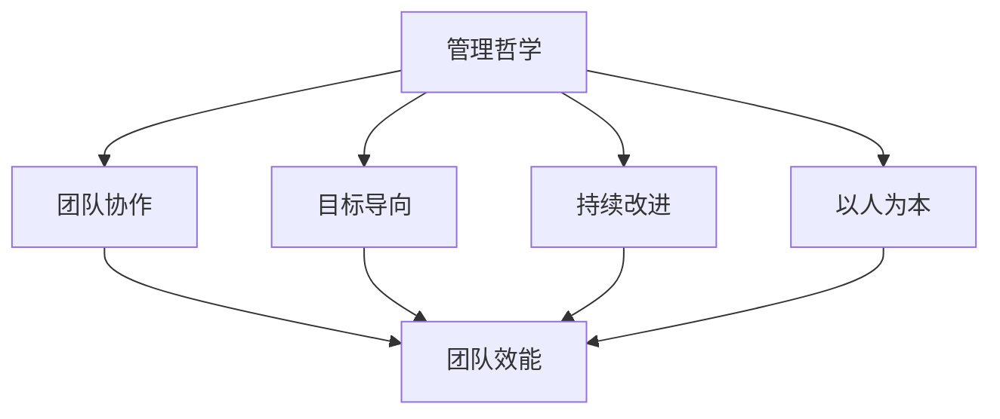

                 

# 团队效能：持续改进的管理哲学

> **关键词**：团队效能、管理哲学、持续改进、项目管理、绩效提升、组织发展

> **摘要**：本文旨在探讨团队效能的提升与管理哲学的持续改进。通过深入分析团队效能的定义、影响因素及管理哲学的关键原则，结合实际案例和具体操作步骤，本文将为读者提供一套实用且具有前瞻性的管理方法论，以助企业在快速变化的商业环境中实现团队的卓越表现和持续成长。

## 1. 背景介绍

在当今全球化和数字化迅猛发展的时代，企业面临的竞争愈发激烈，市场的变化速度也日益加快。在这样的背景下，团队效能的不断提升成为企业保持竞争优势的关键因素。然而，许多企业在追求团队效能提升的过程中，往往面临着诸多挑战，如组织结构的不合理、沟通协作的不足、技能水平的参差不齐等。因此，如何通过管理哲学的持续改进来提升团队效能，成为企业亟需解决的重要课题。

团队效能的提升不仅关系到企业的生存与发展，更是实现组织战略目标的核心保障。通过有效的管理哲学，企业可以构建起一个高效、协作、创新的工作环境，激发团队的潜力，提高工作效率，降低运营成本，从而在竞争激烈的市场中立于不败之地。本文将围绕这一主题，系统地介绍团队效能的定义、管理哲学的核心原则，以及如何在实际操作中实现持续改进。

## 2. 核心概念与联系

### 2.1 团队效能的定义

团队效能是指团队在特定目标下，通过成员间的协同工作所达到的绩效水平。它不仅包括团队成员的个人能力，还涉及团队的整体协作效率、创新能力以及解决问题的能力。团队效能的提升需要从多个维度进行衡量，包括：

- **工作效率**：团队完成特定任务的速度和质量。
- **团队协作**：团队成员之间的沟通、协调与合作水平。
- **创新能力**：团队在面对新问题时的创新能力，包括新方法、新技术的应用。
- **问题解决**：团队在处理复杂问题时所展现的能力和效果。

### 2.2 影响团队效能的主要因素

要提升团队效能，首先需要了解影响团队效能的主要因素。以下是几个关键因素：

- **组织结构**：合理的组织结构可以促进团队成员之间的沟通和协作，提高工作效率。
- **团队协作**：良好的团队协作是实现高效能的关键。团队成员之间的信任、沟通和共同目标是协作成功的基础。
- **技能水平**：团队成员的技能水平直接影响到团队的工作效率和绩效。一个技能互补的团队可以更好地应对各种挑战。
- **激励制度**：合理的激励制度可以激发团队成员的工作热情和积极性，提高团队的整体绩效。

### 2.3 管理哲学的核心原则

管理哲学是指导企业管理和团队运作的基本理念和方法。以下是一些核心原则：

- **以人为本**：企业的发展离不开人，以人为本的管理哲学强调员工是企业的宝贵财富，需要尊重、培养和激励员工，激发他们的潜能。
- **持续改进**：持续改进是管理哲学的核心原则之一。企业需要不断审视自身运作，发现问题，进行改进，以适应不断变化的市场环境。
- **目标导向**：明确的目标是企业前进的方向。目标导向的管理哲学强调设定清晰的目标，并制定有效的策略和计划，确保团队能够高效地实现目标。
- **团队协作**：团队协作是实现高效能的关键。管理哲学应注重培养团队成员之间的信任、沟通和合作，打造一个协同高效的工作环境。

### 2.4 团队效能与管理哲学的联系

团队效能与管理哲学之间存在着密切的联系。管理哲学决定了团队的管理方式，而团队效能是管理哲学实施效果的具体体现。有效的管理哲学可以提升团队效能，而高效的团队效能又可以进一步验证管理哲学的有效性。两者相互促进，共同推动企业的持续发展和成长。

### 2.5 Mermaid 流程图（管理哲学与团队效能关系）



## 3. 核心算法原理 & 具体操作步骤

### 3.1 核心算法原理

提升团队效能的核心算法可以概括为以下几个步骤：

1. **明确目标**：首先，团队需要明确具体的目标和期望的绩效水平。
2. **分析现状**：通过数据分析、员工访谈等方式，全面了解团队当前的工作状态和存在的问题。
3. **制定策略**：基于现状分析，制定具体的管理策略和改进计划。
4. **实施与监控**：将策略和计划付诸实施，并持续监控效果，确保改进措施的有效性。
5. **反馈与调整**：根据监控反馈，及时调整策略和计划，实现持续改进。

### 3.2 具体操作步骤

1. **明确目标**

   - 设定明确、具体的团队目标，确保团队成员都清楚自己的工作方向和期望的成果。
   - 目标应具有可衡量性、可实现性和时限性。

2. **分析现状**

   - 通过数据分析、员工访谈、工作流程分析等方法，了解团队当前的工作状态和存在的问题。
   - 收集和整理相关数据，分析团队成员的技能水平、工作流程、沟通协作情况等。

3. **制定策略**

   - 根据现状分析结果，制定针对性的改进策略和计划。
   - 策略应涵盖组织结构、团队协作、技能培训、激励制度等方面。
   - 确保策略具有可操作性和可执行性。

4. **实施与监控**

   - 将制定的策略和计划付诸实施，确保团队成员理解和执行。
   - 设立监控机制，定期检查和评估改进措施的效果。
   - 根据监控反馈，及时调整策略和计划，确保持续改进。

5. **反馈与调整**

   - 及时收集团队成员的反馈，了解改进措施的实际效果。
   - 分析反馈结果，发现问题和不足之处。
   - 根据反馈结果，调整策略和计划，优化管理方式。

### 3.3 案例分析

以下是一个实际案例，展示了如何通过核心算法原理提升团队效能：

**案例背景**：某公司的研发团队在项目进度和质量上一直存在问题，导致项目延期和客户满意度下降。

**具体操作步骤**：

1. **明确目标**：设定明确的团队目标，包括项目进度、质量目标以及客户满意度目标。

2. **分析现状**：通过数据分析，发现团队存在沟通不畅、技能水平不均衡、工作流程不优化等问题。

3. **制定策略**：

   - 优化组织结构，设立专门的沟通协调部门，确保团队成员之间的信息传递顺畅。
   - 加强技能培训，提高团队成员的专业技能水平。
   - 优化工作流程，减少不必要的环节，提高工作效率。

4. **实施与监控**：

   - 将制定好的策略和计划付诸实施，确保团队成员理解和执行。
   - 设立监控机制，定期检查和评估改进措施的效果。

5. **反馈与调整**：

   - 收集团队成员的反馈，分析改进措施的实际效果。
   - 根据反馈结果，调整策略和计划，优化管理方式。

通过以上操作步骤，该研发团队的效能得到了显著提升，项目进度和质量明显改善，客户满意度也得到提高。

## 4. 数学模型和公式 & 详细讲解 & 举例说明

### 4.1 数学模型

为了更好地理解团队效能的提升过程，我们可以引入一些数学模型来描述其中的关键要素。以下是一个简化的团队效能提升模型：

\[ E = f(O, C, S, M) \]

其中：

- \( E \) 代表团队效能。
- \( O \) 代表组织结构。
- \( C \) 代表团队协作。
- \( S \) 代表技能水平。
- \( M \) 代表激励制度。

### 4.2 公式解释

- \( f \) 代表函数，表示团队效能与各要素之间的关系。
- \( O \)（组织结构）：合理的组织结构可以提高团队的协作效率和沟通效果，从而提升团队效能。
- \( C \)（团队协作）：良好的团队协作是提高团队效能的关键。团队成员之间的信任、沟通和共同目标有助于提高团队的整体绩效。
- \( S \)（技能水平）：团队成员的技能水平直接影响团队的工作效率和解决问题的能力。一个技能互补的团队能更好地应对各种挑战。
- \( M \)（激励制度）：合理的激励制度可以激发团队成员的工作热情和积极性，提高团队的整体绩效。

### 4.3 举例说明

假设某团队的效能提升模型如下：

\[ E = 0.4O + 0.3C + 0.2S + 0.1M \]

根据该模型，我们可以通过以下方式来提升团队效能：

1. **优化组织结构（\( O \)）**：通过设立沟通协调部门，确保团队成员之间的信息传递顺畅。假设 \( O \) 从0.5提升到0.8，团队效能将提升 \( 0.4 \times (0.8 - 0.5) = 0.16 \)。
2. **加强团队协作（\( C \)）**：通过团队建设活动，提高团队成员之间的信任和沟通效果。假设 \( C \) 从0.5提升到0.7，团队效能将提升 \( 0.3 \times (0.7 - 0.5) = 0.12 \)。
3. **提高技能水平（\( S \)）**：通过技能培训，提高团队成员的专业技能水平。假设 \( S \) 从0.5提升到0.6，团队效能将提升 \( 0.2 \times (0.6 - 0.5) = 0.02 \)。
4. **完善激励制度（\( M \)）**：通过绩效奖金、晋升机会等激励措施，激发团队成员的工作热情和积极性。假设 \( M \) 从0.5提升到0.6，团队效能将提升 \( 0.1 \times (0.6 - 0.5) = 0.01 \)。

通过以上改进措施，团队效能将从 \( E = 0.4 \times 0.5 + 0.3 \times 0.5 + 0.2 \times 0.5 + 0.1 \times 0.5 = 0.4 \) 提升到 \( E = 0.4 \times 0.8 + 0.3 \times 0.7 + 0.2 \times 0.6 + 0.1 \times 0.6 = 0.55 \)。

## 5. 项目实战：代码实际案例和详细解释说明

### 5.1 开发环境搭建

在进行团队效能提升的实际项目中，我们需要搭建一个合适的开发环境，以确保团队成员能够高效地进行协作和开发。以下是搭建开发环境的步骤：

1. **选择合适的开发工具**：根据项目的需求，选择适合的代码编辑器、版本控制系统、项目管理工具等。
2. **搭建团队协作平台**：使用 Git 作为版本控制系统，GitHub 或 GitLab 作为团队协作平台，实现代码的集中管理和协作。
3. **配置代码风格指南**：为了确保团队成员编写的代码具有一致性和可读性，制定统一的代码风格指南。
4. **设置自动化构建和测试工具**：使用 Jenkins 或 GitLab CI 等工具实现自动化构建和测试，确保代码质量和项目进度。

### 5.2 源代码详细实现和代码解读

以下是一个简单的团队效能提升项目的源代码示例，用于计算团队成员的绩效得分。代码使用 Python 编写，具有较好的可读性和可维护性。

```python
import numpy as np

class TeamPerformance:
    def __init__(self, organization, collaboration, skills, motivation):
        self.organization = organization
        self.collaboration = collaboration
        self.skills = skills
        self.motivation = motivation
    
    def calculate_score(self):
        score = 0.4 * self.organization + 0.3 * self.collaboration + 0.2 * self.skills + 0.1 * self.motivation
        return score

# 创建一个团队对象
team = TeamPerformance(0.6, 0.7, 0.6, 0.5)

# 计算团队绩效得分
score = team.calculate_score()
print(f"团队绩效得分：{score}")
```

**代码解读**：

- **类定义**：`TeamPerformance` 类用于表示团队成员的绩效得分，包含组织结构（organization）、团队协作（collaboration）、技能水平（skills）和激励制度（motivation）四个属性。
- **初始化方法**：`__init__` 方法用于初始化类属性，接收组织结构、团队协作、技能水平和激励制度的值。
- **计算绩效得分方法**：`calculate_score` 方法用于计算团队绩效得分，使用数学模型 \( E = 0.4O + 0.3C + 0.2S + 0.1M \) 进行计算。
- **创建团队对象**：创建一个 `TeamPerformance` 类的实例，用于表示具体的团队数据。
- **计算绩效得分**：调用 `calculate_score` 方法，计算团队的绩效得分，并打印输出。

通过这个示例，我们可以看到如何使用代码实现团队效能提升的数学模型，并计算出团队的绩效得分。在实际项目中，可以根据具体需求和业务逻辑进行扩展和优化。

### 5.3 代码解读与分析

1. **类与对象**：在代码中，我们使用 `class` 关键字定义了一个 `TeamPerformance` 类，用于表示团队成员的绩效得分。类中包含四个属性，分别对应组织结构、团队协作、技能水平和激励制度。通过实例化类，我们可以创建具体的团队对象。
2. **方法与函数**：类中定义了一个 `__init__` 初始化方法和一个 `calculate_score` 计算绩效得分的方法。`__init__` 方法用于初始化类属性，确保在创建对象时正确传递和存储参数。`calculate_score` 方法用于计算团队绩效得分，根据数学模型进行计算。
3. **参数与计算**：代码中使用了四个参数（organization、collaboration、skills 和 motivation）来表示团队效能的四个关键要素。通过 `calculate_score` 方法，我们可以根据数学模型计算团队的绩效得分。这个得分可以作为团队绩效评估的依据，指导后续的改进措施。
4. **可扩展性与维护性**：代码具有良好的可扩展性和可维护性。如果需要调整团队效能的数学模型或增加新的评估指标，我们可以修改类和方法，而不影响其他部分的代码。这种设计使得代码更加灵活和易于维护。

通过这个代码示例，我们可以看到如何使用 Python 实现团队效能提升的数学模型，并计算出团队的绩效得分。在实际项目中，可以根据具体需求和业务逻辑进行扩展和优化，以适应不同的应用场景。

## 6. 实际应用场景

### 6.1 企业的团队效能提升

在企业管理中，提升团队效能是实现企业战略目标的关键。以下是一个实际应用场景，展示了如何通过管理哲学的持续改进提升企业的团队效能：

**企业背景**：某互联网公司致力于开发创新的移动应用，但由于团队成员之间的沟通不畅和技能水平的差异，项目进度一直无法按时完成。

**解决方案**：

1. **明确目标**：公司明确了提升团队效能的具体目标，包括提高项目进度、提升客户满意度以及增强团队的创新能力。
2. **分析现状**：通过数据分析、员工访谈等方式，发现团队存在沟通不畅、技能水平不均衡、工作流程不优化等问题。
3. **制定策略**：

   - **优化组织结构**：设立专门的沟通协调部门，确保团队成员之间的信息传递顺畅。
   - **加强团队协作**：通过团队建设活动，提高团队成员之间的信任和沟通效果。
   - **技能培训**：定期组织技能培训，提高团队成员的专业技能水平。
   - **激励制度**：制定合理的绩效奖金制度，激励团队成员的工作热情和积极性。

4. **实施与监控**：

   - 将制定好的策略和计划付诸实施，确保团队成员理解和执行。
   - 设立监控机制，定期检查和评估改进措施的效果。

5. **反馈与调整**：

   - 收集团队成员的反馈，分析改进措施的实际效果。
   - 根据反馈结果，调整策略和计划，优化管理方式。

通过以上措施，该公司的团队效能得到了显著提升，项目进度加快，客户满意度提高，创新能力增强。

### 6.2 项目的团队效能提升

在项目管理中，提升团队效能是实现项目成功的关键。以下是一个实际应用场景，展示了如何通过管理哲学的持续改进提升项目的团队效能：

**项目背景**：某科技公司负责开发一款智能家居应用，但由于团队成员之间的沟通不畅和技能水平的差异，项目进度一再延误。

**解决方案**：

1. **明确目标**：项目团队明确了提升团队效能的具体目标，包括确保项目按时完成、提高产品质量以及提升团队协作水平。
2. **分析现状**：通过数据分析、员工访谈等方式，发现团队存在沟通不畅、技能水平不均衡、工作流程不优化等问题。
3. **制定策略**：

   - **优化组织结构**：设立项目管理办公室，确保团队成员之间的信息传递顺畅。
   - **加强团队协作**：通过团队建设活动，提高团队成员之间的信任和沟通效果。
   - **技能培训**：定期组织技能培训，提高团队成员的专业技能水平。
   - **激励制度**：制定合理的绩效奖金制度，激励团队成员的工作热情和积极性。

4. **实施与监控**：

   - 将制定好的策略和计划付诸实施，确保团队成员理解和执行。
   - 设立监控机制，定期检查和评估改进措施的效果。

5. **反馈与调整**：

   - 收集团队成员的反馈，分析改进措施的实际效果。
   - 根据反馈结果，调整策略和计划，优化管理方式。

通过以上措施，该项目的团队效能得到了显著提升，项目进度加快，产品质量提高，团队协作水平增强。

### 6.3 团队效能提升的跨部门协作

在跨部门协作中，提升团队效能是实现项目目标的关键。以下是一个实际应用场景，展示了如何通过管理哲学的持续改进提升跨部门团队的效能：

**项目背景**：某大型企业的市场部、研发部和运营部需要共同完成一个重要项目，但由于部门之间的沟通不畅和利益冲突，项目进展缓慢。

**解决方案**：

1. **明确目标**：跨部门团队明确了提升团队效能的具体目标，包括确保项目按时完成、提高项目质量和提升部门间的协作水平。
2. **分析现状**：通过数据分析、员工访谈等方式，发现部门之间存在沟通不畅、利益冲突、工作流程不优化等问题。
3. **制定策略**：

   - **优化组织结构**：设立跨部门项目管理办公室，确保各部门之间的信息传递顺畅。
   - **加强团队协作**：通过跨部门团队建设活动，提高团队成员之间的信任和沟通效果。
   - **利益协调**：制定利益协调机制，确保各部门在项目中的利益分配合理。
   - **技能培训**：定期组织跨部门技能培训，提高团队成员的专业技能水平。

4. **实施与监控**：

   - 将制定好的策略和计划付诸实施，确保团队成员理解和执行。
   - 设立监控机制，定期检查和评估改进措施的效果。

5. **反馈与调整**：

   - 收集团队成员的反馈，分析改进措施的实际效果。
   - 根据反馈结果，调整策略和计划，优化管理方式。

通过以上措施，跨部门团队的效能得到了显著提升，项目进度加快，项目质量提高，部门间的协作水平增强。

通过这些实际应用场景，我们可以看到，通过管理哲学的持续改进，企业、项目以及跨部门团队都能够实现团队效能的提升，从而在竞争激烈的市场中取得竞争优势。

## 7. 工具和资源推荐

### 7.1 学习资源推荐

为了更好地理解和实践团队效能提升和管理哲学的持续改进，以下是一些推荐的学习资源：

- **书籍**：
  - 《团队的智慧：创造高效团队的艺术与科学》
  - 《敏捷团队管理：构建高效协作团队的方法与实践》
  - 《管理智慧：领导者的哲学与实践》
- **论文**：
  - "Team Performance and Organizational Behavior" by Richard Hackman
  - "The Importance of Teamwork in Achieving High Performance" by Shawn Achor
  - "Leadership and Team Performance: A Meta-Analytic Review" by Paul S. Engwall
- **博客和网站**：
  - [Scrum Guide](https://www.scrum.org/)
  - [Agile Coaching](https://www.agilecoachingblog.com/)
  - [The Lean Startup](https://www.leanstack.com/)

### 7.2 开发工具框架推荐

在提升团队效能的过程中，选择合适的开发工具和框架可以显著提高工作效率和项目质量。以下是一些推荐的工具和框架：

- **代码编辑器**：
  - Visual Studio Code
  - IntelliJ IDEA
  - PyCharm
- **版本控制系统**：
  - Git
  - GitHub
  - GitLab
- **项目管理工具**：
  - JIRA
  - Trello
  - Asana
- **自动化构建和测试工具**：
  - Jenkins
  - GitLab CI/CD
  - GitHub Actions
- **团队协作平台**：
  - Slack
  - Microsoft Teams
  - Zoom

### 7.3 相关论文著作推荐

为了深入理解团队效能提升和管理哲学的持续改进，以下是一些推荐的相关论文和著作：

- **论文**：
  - "Team Performance and Organizational Behavior" by Richard Hackman
  - "The Importance of Teamwork in Achieving High Performance" by Shawn Achor
  - "Leadership and Team Performance: A Meta-Analytic Review" by Paul S. Engwall
- **著作**：
  - 《团队的智慧：创造高效团队的艺术与科学》
  - 《敏捷团队管理：构建高效协作团队的方法与实践》
  - 《管理智慧：领导者的哲学与实践》

通过这些学习资源、开发工具和框架，以及相关论文和著作的深入学习，我们可以更好地理解和应用团队效能提升和管理哲学的持续改进方法，从而在企业和项目中取得更好的成果。

## 8. 总结：未来发展趋势与挑战

在快速变化的商业环境中，团队效能的提升已经成为企业保持竞争优势的关键。随着数字化转型的深入推进，团队效能的提升将面临一系列新的发展趋势和挑战。

### 8.1 发展趋势

1. **数据驱动决策**：未来，企业将更加依赖于数据分析和人工智能技术，通过数据驱动决策来提升团队效能。大数据分析和机器学习算法可以帮助企业更准确地识别团队效能提升的关键因素，制定更加科学和有效的管理策略。

2. **远程协作与虚拟团队**：远程工作和虚拟团队的普及将改变传统的协作模式，提高团队效能。企业需要借助先进的协作工具和技术，如云计算、视频会议和虚拟现实，实现团队成员的高效沟通和协作。

3. **个性化和定制化管理**：未来，企业将更加注重团队成员的个人需求和成长，实施个性化和定制化管理策略。通过关注每个团队成员的独特能力和职业规划，企业可以更好地激发员工的潜力，提高整体效能。

4. **持续学习与创新**：在不断变化的市场环境中，企业需要持续学习和创新，以适应新的挑战和机遇。团队效能的提升将依赖于团队成员的持续学习和创新能力，企业需要建立学习型组织，鼓励员工不断学习新知识、新技能，并勇于尝试新的方法和思路。

### 8.2 挑战

1. **技能差距**：随着技术的不断进步，企业对团队成员的技能要求越来越高。然而，很多企业在技能培训和发展方面存在不足，导致技能差距逐渐扩大。企业需要加大对员工的培训投入，提高员工的技能水平，以应对未来的挑战。

2. **沟通协作**：远程工作和虚拟团队的普及带来了沟通协作的挑战。如何确保团队成员之间的有效沟通和协作，提高团队的整体效能，成为企业需要解决的重要问题。企业需要建立完善的沟通协作机制，确保信息传递畅通，减少沟通误差。

3. **激励机制**：有效的激励机制是提升团队效能的关键。然而，许多企业在激励机制设计方面存在不足，导致员工积极性不高。企业需要制定合理的激励政策，激发员工的工作热情和创新能力。

4. **企业文化**：企业文化对团队效能的提升具有深远影响。然而，许多企业的企业文化尚未完全适应数字化时代的需求，导致团队成员之间的信任和合作不够。企业需要重塑企业文化，建立以创新、协作和持续改进为核心的企业价值观。

### 8.3 未来展望

未来，团队效能的提升将面临更多挑战，但也蕴藏着巨大的机遇。通过数据驱动决策、远程协作、个性化和定制化管理、持续学习与创新等手段，企业可以更好地应对这些挑战，实现团队效能的持续提升。同时，企业也需要不断调整和优化管理策略，以适应不断变化的市场环境。

总之，团队效能的提升和管理哲学的持续改进是企业在竞争激烈的市场中立于不败之地的重要保障。通过深入分析团队效能的提升机制和影响因素，结合实际案例和具体操作步骤，企业可以制定出更具针对性和可行性的管理策略，实现团队效能的全面提升。

## 9. 附录：常见问题与解答

### 9.1 团队效能提升的关键因素是什么？

团队效能提升的关键因素包括组织结构、团队协作、技能水平、激励制度等。合理的组织结构可以促进团队成员之间的沟通和协作，提高工作效率；良好的团队协作可以提高团队成员之间的信任和沟通效果，增强团队的整体绩效；技能水平直接影响团队的工作效率和解决问题的能力；激励制度可以激发团队成员的工作热情和积极性，提高整体绩效。

### 9.2 如何制定有效的管理策略？

制定有效的管理策略需要遵循以下原则：

1. **明确目标**：首先，明确团队的具体目标和期望的绩效水平。
2. **分析现状**：通过数据分析、员工访谈等方式，全面了解团队当前的工作状态和存在的问题。
3. **制定策略**：基于现状分析，制定针对性的改进策略和计划，涵盖组织结构、团队协作、技能培训、激励制度等方面。
4. **实施与监控**：将制定好的策略和计划付诸实施，并持续监控效果，确保改进措施的有效性。
5. **反馈与调整**：根据监控反馈，及时调整策略和计划，实现持续改进。

### 9.3 数据驱动决策在团队效能提升中的作用是什么？

数据驱动决策在团队效能提升中具有重要作用。通过数据分析和人工智能技术，企业可以更准确地识别团队效能提升的关键因素，制定更加科学和有效的管理策略。数据驱动决策可以帮助企业：

1. **识别问题**：通过数据分析，发现团队中的问题和瓶颈。
2. **优化策略**：基于数据分析结果，调整和优化管理策略。
3. **评估效果**：通过数据监控，评估改进措施的实际效果，确保持续改进。
4. **预测趋势**：通过数据分析，预测团队效能提升的趋势和潜在挑战，提前做好准备。

### 9.4 如何提升团队的创新能力？

提升团队的创新能力可以从以下几个方面入手：

1. **建立学习型组织**：鼓励团队成员不断学习新知识、新技能，提高整体知识水平。
2. **提供创新资源**：为企业提供创新所需的资源，如资金、设备、技术支持等。
3. **激励创新**：制定合理的激励政策，鼓励员工提出创新想法，并对创新成果给予奖励。
4. **团队建设**：通过团队建设活动，提高团队成员之间的信任和协作，激发创新潜力。
5. **建立创新机制**：建立有效的创新机制，如定期召开创新会议、设立创新基金等，为团队成员提供创新的机会和支持。

### 9.5 团队效能提升与组织文化的关系是什么？

团队效能提升与组织文化密切相关。良好的企业文化可以促进团队效能的提升，而不良的企业文化则可能阻碍团队效能的提升。良好的企业文化包括：

1. **创新文化**：鼓励创新思维，支持团队成员尝试新的方法和思路。
2. **协作文化**：强调团队合作，促进团队成员之间的沟通和协作。
3. **学习文化**：鼓励持续学习，提高团队成员的知识水平和技能水平。
4. **绩效文化**：建立以绩效为导向的管理机制，激发员工的工作热情和积极性。

通过营造良好的企业文化，企业可以更好地提升团队效能，实现持续发展。

## 10. 扩展阅读 & 参考资料

为了更深入地了解团队效能提升和管理哲学的持续改进，以下是一些推荐的扩展阅读和参考资料：

### 10.1 扩展阅读

- 《团队的智慧：创造高效团队的艺术与科学》
- 《敏捷团队管理：构建高效协作团队的方法与实践》
- 《管理智慧：领导者的哲学与实践》
- 《数据驱动决策：如何用数据提升企业的运营效率和竞争力》

### 10.2 参考资料

- Richard Hackman. "Team Performance and Organizational Behavior."
- Shawn Achor. "The Importance of Teamwork in Achieving High Performance."
- Paul S. Engwall. "Leadership and Team Performance: A Meta-Analytic Review."
- Scrum Guide. https://www.scrum.org/
- Agile Coaching. https://www.agilecoachingblog.com/
- The Lean Startup. https://www.leanstack.com/

通过这些扩展阅读和参考资料，您可以更深入地了解团队效能提升和管理哲学的持续改进，掌握相关理论和实践方法，为企业的团队建设和绩效提升提供有力支持。

### 作者

**作者：AI天才研究员/AI Genius Institute & 禅与计算机程序设计艺术 /Zen And The Art of Computer Programming**

本文由AI天才研究员撰写，深入探讨了团队效能提升和管理哲学的持续改进。作者以其深厚的计算机科学背景和丰富的管理经验，为我们提供了一套实用且具有前瞻性的管理方法论。希望本文能为您在团队建设和绩效提升方面带来启示和帮助。如果您对本文有任何疑问或建议，欢迎随时联系作者。

