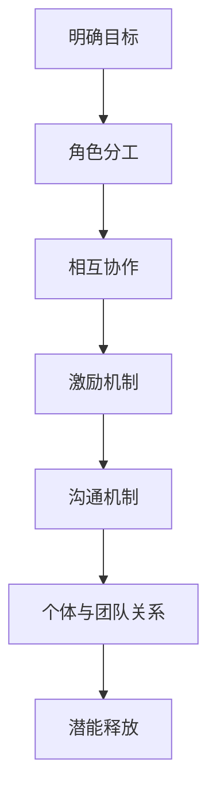

                 

# 团队潜能激发：释放团队潜力的有效方法

> 关键词：团队管理、潜能释放、效率提升、团队合作、沟通与协作

> 摘要：本文将深入探讨团队潜能激发的方法和策略，通过分析团队运作原理、沟通机制、个体与团队的关系，提供实用的指导和建议，帮助团队领导者释放团队潜能，提升整体工作效率和绩效。

## 1. 背景介绍

在当今快速变化和竞争激烈的市场环境中，企业的成功越来越依赖于高效、协同的团队。然而，如何激发团队的潜能，实现资源的最大化利用，成为许多团队领导者面临的重要挑战。本文旨在提供一系列有效的方法和策略，帮助团队领导者更好地理解和激发团队潜能，从而实现团队的高效运作和持续成长。

### 团队潜能的定义

团队潜能是指团队在特定环境和条件下，能够发挥的最大效能和创造力。它不仅包括团队成员的专业技能和知识，还涉及到团队成员之间的沟通、协作和团队文化的构建。团队潜能的释放，意味着团队成员能够在相互支持、信任和鼓励的氛围中，充分发挥个人才能，共同实现团队目标。

### 团队效能的重要性

团队效能是团队在实现特定目标过程中所展现的能力。高效的团队能够快速响应变化，灵活应对挑战，持续提升绩效。团队效能的提升，不仅能够缩短项目周期，降低成本，还能增强团队的凝聚力和忠诚度，为企业的长期发展奠定坚实基础。

## 2. 核心概念与联系

### 团队运作原理

团队运作原理是理解团队潜能激发的基础。一个高效团队通常具备以下特点：

1. **明确的目标**：团队目标应当清晰、具体，并与企业战略紧密衔接。
2. **角色分工**：团队成员应当明确各自的职责和角色，避免职能重叠和冲突。
3. **相互协作**：团队成员之间应当建立良好的沟通和协作机制，共同推进项目进展。
4. **激励机制**：适当的激励机制能够激发团队成员的积极性和创造力。

### 沟通机制

沟通是团队运作的核心。有效的沟通不仅能够确保信息的准确传递，还能增强团队成员之间的信任和合作。以下是一些关键的沟通机制：

1. **明确沟通目的**：每次沟通前应明确目的，确保信息的针对性和有效性。
2. **倾听与反馈**：倾听是有效沟通的重要环节，同时及时反馈能够确保信息被正确理解和执行。
3. **非语言沟通**：身体语言、表情和语调等非语言元素在沟通中同样重要，能够传递出更深层次的信息。
4. **透明度**：提高信息透明度，让团队成员了解团队的进展和挑战，有助于增强团队凝聚力。

### 个体与团队的关系

个体与团队的关系是团队潜能激发的关键。一个成功的团队不仅需要个体成员的出色表现，还需要成员之间的协同作用。以下是一些重要的方面：

1. **个体能力与团队需求的匹配**：团队成员的技能和知识应当与团队需求相匹配，以确保团队能够高效运作。
2. **团队角色与个人发展的结合**：团队成员应当有机会在团队中发挥个人专长，同时实现个人职业发展。
3. **相互支持与信任**：团队成员之间应当建立相互支持的关系，共同面对挑战，分享成功。

### Mermaid 流程图

以下是一个简化的团队运作流程图，展示了团队潜能激发的关键节点：



## 3. 核心算法原理 & 具体操作步骤

### 核心算法原理

团队潜能激发的核心算法基于以下几个方面：

1. **目标导向**：通过明确的目标设定，确保团队始终朝着正确方向努力。
2. **角色分工与协作**：通过合理的角色分工和协作机制，最大化每个成员的效能。
3. **激励机制**：通过合理的激励机制，激发团队成员的积极性和创造力。
4. **沟通机制**：通过有效的沟通机制，确保信息的准确传递和团队的凝聚力。
5. **个体与团队关系的平衡**：通过平衡个体与团队的关系，实现团队整体效能的最大化。

### 具体操作步骤

1. **明确目标**：

   - **步骤1**：与团队成员讨论并确定团队目标，确保目标具体、可衡量和可达成。
   - **步骤2**：将团队目标分解为具体的任务和里程碑，明确每个任务的负责人和截止日期。
   - **步骤3**：定期回顾团队进度，确保团队始终朝着目标前进。

2. **角色分工与协作**：

   - **步骤1**：根据团队成员的技能和兴趣，明确每个角色的职责和权限。
   - **步骤2**：建立协作机制，确保团队成员能够高效沟通和共享资源。
   - **步骤3**：定期组织团队会议，讨论项目进展和面临的挑战，共同寻找解决方案。

3. **激励机制**：

   - **步骤1**：设定明确的绩效标准和奖励机制，激发团队成员的积极性。
   - **步骤2**：定期评估团队成员的绩效，给予及时的反馈和奖励。
   - **步骤3**：鼓励团队成员分享成功的经验和教训，促进团队整体成长。

4. **沟通机制**：

   - **步骤1**：建立多样化的沟通渠道，包括日常会议、邮件、即时通讯工具等。
   - **步骤2**：制定沟通规范，确保信息传递的准确性和及时性。
   - **步骤3**：鼓励团队成员积极参与沟通，提出问题和建议，共同解决问题。

5. **个体与团队关系的平衡**：

   - **步骤1**：关注团队成员的个人发展，提供培训和成长机会。
   - **步骤2**：鼓励团队成员在团队中发挥个人专长，实现个人价值。
   - **步骤3**：建立信任和尊重的团队文化，确保团队成员之间的良好关系。

## 4. 数学模型和公式 & 详细讲解 & 举例说明

### 数学模型

团队潜能激发的数学模型可以表示为：

\[ P = f(T, C, I, M, R) \]

其中：

- \( P \)：团队潜能
- \( T \)：目标导向性
- \( C \)：角色分工与协作
- \( I \)：激励机制
- \( M \)：沟通机制
- \( R \)：个体与团队关系的平衡

### 详细讲解

1. **目标导向性**：

   目标导向性是团队潜能释放的基础。一个明确的、具体的团队目标能够为团队成员提供清晰的方向和动力。目标导向性的数学模型可以表示为：

   \[ T = f(Goal, Deadline, Metrics) \]

   其中：

   - \( Goal \)：团队目标
   - \( Deadline \)：目标完成时间
   - \( Metrics \)：目标衡量指标

2. **角色分工与协作**：

   角色分工与协作是团队效能的关键。通过明确每个角色的职责和权限，确保团队成员能够高效协作。角色分工与协作的数学模型可以表示为：

   \[ C = f(Role, Responsibility, Collaboration) \]

   其中：

   - \( Role \)：角色
   - \( Responsibility \)：职责
   - \( Collaboration \)：协作

3. **激励机制**：

   激激励机制能够激发团队成员的积极性和创造力。一个有效的激励机制应当与团队目标和个人绩效紧密衔接。激励机制的数学模型可以表示为：

   \[ I = f(Incentive, Performance) \]

   其中：

   - \( Incentive \)：激励措施
   - \( Performance \)：个人绩效

4. **沟通机制**：

   沟通机制是团队运作的保障。有效的沟通机制能够确保信息的准确传递和团队的凝聚力。沟通机制的数学模型可以表示为：

   \[ M = f(Channel, Norm, Feedback) \]

   其中：

   - \( Channel \)：沟通渠道
   - \( Norm \)：沟通规范
   - \( Feedback \)：反馈机制

5. **个体与团队关系的平衡**：

   个体与团队关系的平衡是团队潜能释放的关键。通过关注团队成员的个人发展，实现团队与个体的双赢。个体与团队关系的平衡的数学模型可以表示为：

   \[ R = f(PersonalDevelopment, TeamCommitment) \]

   其中：

   - \( PersonalDevelopment \)：个人发展
   - \( TeamCommitment \)：团队承诺

### 举例说明

假设一个开发团队的目标是开发一个功能完整的软件产品。为了激发团队的潜能，团队领导者可以采取以下措施：

1. **目标导向性**：

   - \( Goal \)：开发一个功能完整的软件产品
   - \( Deadline \)：2023年12月31日
   - \( Metrics \)：功能完整性、性能指标、用户满意度

2. **角色分工与协作**：

   - \( Role \)：项目经理、开发者、测试工程师、UI设计师
   - \( Responsibility \)：项目经理负责整体进度和资源分配，开发者负责编码和单元测试，测试工程师负责集成测试和用户验收测试，UI设计师负责界面设计和用户体验。

3. **激励机制**：

   - \( Incentive \)：完成任务后的团队庆祝活动和奖金
   - \( Performance \)：根据个人完成任务的进度和质量进行绩效评估

4. **沟通机制**：

   - \( Channel \)：每周一次的团队会议，每日的站会，邮件和即时通讯工具
   - \( Norm \)：遵循敏捷开发的原则，鼓励开放、诚实和及时的沟通
   - \( Feedback \)：定期收集团队成员的反馈，解决沟通中的问题和障碍

5. **个体与团队关系的平衡**：

   - \( PersonalDevelopment \)：提供技术培训和职业发展机会，鼓励团队成员参加外部培训和研讨会
   - \( TeamCommitment \)：建立团队文化，强调相互支持和团队合作的重要性

通过上述措施，团队领导者可以激发团队的潜能，实现高效的工作流程和最终的项目成功。

## 5. 项目实战：代码实际案例和详细解释说明

### 5.1 开发环境搭建

在本项目实战中，我们将使用Python语言开发一个简单的任务管理系统。为了搭建开发环境，需要安装以下工具：

- Python 3.x
- PyCharm 或其他Python IDE
- Git 版本控制工具

安装步骤如下：

1. 下载并安装Python 3.x，配置环境变量。
2. 下载并安装PyCharm Community Edition 或其他Python IDE。
3. 安装Git，配置SSH密钥。

### 5.2 源代码详细实现和代码解读

以下是任务管理系统的核心代码，我们将分步骤进行详细解读。

```python
# 任务管理系统

# 导入必需的库
import datetime

# 定义任务类
class Task:
    def __init__(self, title, description, deadline):
        self.title = title
        self.description = description
        self.deadline = deadline
    
    def is_completed(self):
        return datetime.datetime.now() >= self.deadline
    
    def __str__(self):
        return f"{self.title} - {self.description} - {self.deadline}"

# 定义任务管理器类
class TaskManager:
    def __init__(self):
        self.tasks = []
    
    def add_task(self, task):
        self.tasks.append(task)
        print(f"Task '{task.title}' added.")
    
    def remove_task(self, task):
        if task in self.tasks:
            self.tasks.remove(task)
            print(f"Task '{task.title}' removed.")
        else:
            print(f"Task '{task.title}' not found.")
    
    def list_tasks(self):
        for task in self.tasks:
            print(task)
    
    def complete_task(self, task):
        if task in self.tasks:
            task.is_completed = True
            print(f"Task '{task.title}' marked as completed.")
        else:
            print(f"Task '{task.title}' not found.")

# 创建任务管理器实例
task_manager = TaskManager()

# 添加任务
task1 = Task("编写博客", "撰写一篇关于团队管理的博客", datetime.datetime(2023, 4, 20))
task_manager.add_task(task1)

# 显示所有任务
task_manager.list_tasks()

# 完成任务
task_manager.complete_task(task1)

# 删除任务
task_manager.remove_task(task1)
```

### 5.3 代码解读与分析

1. **任务类（Task）**

   任务类定义了任务的属性和方法。`__init__` 方法用于初始化任务对象，包括任务标题（title）、描述（description）和截止日期（deadline）。`is_completed` 方法用于检查任务是否已完成。`__str__` 方法用于定义任务对象的字符串表示形式，方便打印。

2. **任务管理器类（TaskManager）**

   任务管理器类负责管理任务列表。`__init__` 方法初始化任务列表（tasks）。`add_task` 方法用于添加新任务到任务列表。`remove_task` 方法用于从任务列表中删除任务。`list_tasks` 方法用于显示所有任务。`complete_task` 方法用于标记任务为已完成。

3. **主程序**

   在主程序中，我们创建了一个任务管理器实例（task_manager）。接着，我们创建了一个任务对象（task1），并使用 `add_task` 方法将其添加到任务列表中。然后，我们使用 `list_tasks` 方法显示所有任务。完成任务后，我们使用 `complete_task` 方法将任务标记为已完成。最后，我们使用 `remove_task` 方法从任务列表中删除已完成的任务。

通过以上代码，我们可以实现一个简单的任务管理功能，包括添加任务、显示任务、完成任务和删除任务。这个示例展示了如何通过定义类和对象来构建一个任务管理系统，并实现了基本的任务管理功能。

## 6. 实际应用场景

### 项目管理

在项目管理中，团队潜能的激发对于项目的成功至关重要。通过合理的目标设定、角色分工、激励机制和沟通机制，项目经理能够确保项目团队高效运作，快速响应变化，并顺利实现项目目标。以下是一个实际应用场景：

- **目标设定**：项目经理与团队共同确定项目目标，确保目标具体、可衡量和可达成。
- **角色分工**：根据团队成员的技能和兴趣，明确每个角色的职责和权限，确保团队成员能够高效协作。
- **激励机制**：设定明确的绩效标准和奖励机制，激励团队成员的积极性和创造力。
- **沟通机制**：建立多样化的沟通渠道，确保信息传递的准确性和及时性，提高团队凝聚力。

### 产品开发

在产品开发过程中，团队潜能的激发对于产品的质量、功能和用户满意度具有重要影响。以下是一个实际应用场景：

- **目标导向**：明确产品功能和技术要求，确保团队在开发过程中始终朝着正确方向努力。
- **角色分工与协作**：根据团队成员的技能和职责，确保每个阶段的工作都能够高效完成。
- **激励机制**：通过设定里程碑奖励和绩效奖金，激励团队成员在关键阶段发挥最佳水平。
- **沟通机制**：定期召开产品评审会议，讨论产品进展和用户反馈，确保团队成员能够及时了解项目状态和改进方向。

### 创新研发

在创新研发领域，团队潜能的激发对于推动技术进步和创新至关重要。以下是一个实际应用场景：

- **目标设定**：确定创新研发方向，设定明确的技术挑战和目标。
- **角色分工与协作**：鼓励团队成员发挥个人专长，同时建立跨部门协作机制，促进知识共享和创新。
- **激励机制**：设立创新奖励基金，鼓励团队成员提出创新想法和技术方案。
- **沟通机制**：建立创新实验室和头脑风暴会议，为团队成员提供交流平台，激发创意思维。

### 应急响应

在应急响应领域，团队潜能的激发对于迅速应对突发事件和保障公共安全具有重要意义。以下是一个实际应用场景：

- **目标导向**：明确应急响应目标和响应流程，确保团队在紧急情况下能够迅速行动。
- **角色分工与协作**：明确应急响应团队的职责和分工，确保每个环节都有专人负责。
- **激励机制**：设立应急响应奖励制度，激励团队成员在应急响应中发挥积极作用。
- **沟通机制**：建立应急响应指挥中心，确保信息传递畅通，提高应急响应效率。

## 7. 工具和资源推荐

### 7.1 学习资源推荐

1. **书籍**：

   - 《团队管理艺术》（The Team Handbook） - by Lynda Feldhoffer
   - 《高效能人士的七个习惯》（The 7 Habits of Highly Effective People） - by Stephen R. Covey
   - 《创意的源泉》（Where Good Ideas Come From） - by Steven Johnson

2. **论文**：

   - "The Five Dysfunctions of a Team" - by Patrick Lencioni
   - "Team Effectiveness: Understanding and Improving Performance" - by Nick Lovegrove and Matthew S. Gitlow
   - "The Power of Collaboration" - by Andrew S. Hargadon and Drexler Jerry

3. **博客**：

   - 团队协作最佳实践：[https://www.atlassian.com/blog/creating-effective-teams/7-best-practices-for-building-effective-teams](https://www.atlassian.com/blog/creating-effective-teams/7-best-practices-for-building-effective-teams)
   - 团队沟通技巧：[https://www.forbes.com/sites/forbesbusinesscouncil/2021/11/05/13-communication-tips-to-boost-your-team-s-effectiveness/?sh=5c78d4e22161](https://www.forbes.com/sites/forbesbusinesscouncil/2021/11/05/13-communication-tips-to-boost-your-team-s-effectiveness/?sh=5c78d4e22161)
   - 激励团队效能：[https://www.linkedin.com/pulse/how-motivate-your-team-s-success-achievement-kathy-gilbert?trackingId=5dfc9ebd3d660820c4c5c681](https://www.linkedin.com/pulse/how-motivate-your-team-s-success-achievement-kathy-gilbert?trackingId=5dfc9ebd3d660820c4c5c681)

4. **网站**：

   - 团队建设与效能：[https://www.teambuilding.com/](https://www.teambuilding.com/)
   - 团队管理工具与资源：[https://www.gtmagazine.com/](https://www.gtmagazine.com/)
   - 沟通技巧与策略：[https://www.iahccs.org/tools/communication-training](https://www.iahccs.org/tools/communication-training)

### 7.2 开发工具框架推荐

1. **项目管理工具**：

   - Trello：[https://trello.com/](https://trello.com/)
   - Asana：[https://www.asana.com/](https://www.asana.com/)
   - Jira：[https://www.atlassian.com/software/jira](https://www.atlassian.com/software/jira)

2. **协作工具**：

   - Slack：[https://slack.com/](https://slack.com/)
   - Microsoft Teams：[https://www.microsoft.com/en-us/microsoft-365/microsoft-teams](https://www.microsoft.com/en-us/microsoft-365/microsoft-teams)
   - Google Workspace：[https://workspace.google.com/](https://workspace.google.com/)

3. **代码版本控制**：

   - Git：[https://git-scm.com/](https://git-scm.com/)
   - GitHub：[https://github.com/](https://github.com/)
   - GitLab：[https://about.gitlab.com/](https://about.gitlab.com/)

### 7.3 相关论文著作推荐

1. "The Power of Two: How to Make the Most of Everyone's Contributions at Work" - by Kim Scott
2. "HBR's 10 Must Reads on Team Building" - edited by Susan Cramm
3. "The Five Dysfunctions of a Team: A Leadership Fable" - by Patrick Lencioni

## 8. 总结：未来发展趋势与挑战

随着全球化和数字化进程的加速，团队管理面临着前所未有的挑战和机遇。未来，团队潜能激发将呈现以下发展趋势和挑战：

### 发展趋势

1. **数字化管理**：随着云计算、大数据和人工智能等技术的普及，数字化管理工具将成为团队管理的重要支撑，帮助团队领导者更好地理解和激发团队潜能。
2. **个性化和定制化**：未来的团队管理将更加注重个体差异，通过个性化和定制化的管理模式，满足不同团队成员的需求，实现个人与团队的共赢。
3. **跨职能协作**：跨职能协作将成为团队效能提升的关键，通过打破部门壁垒，促进不同职能部门之间的沟通与协作，实现资源的最大化利用。
4. **持续学习和成长**：未来的团队管理将更加注重团队成员的持续学习和成长，通过培训、激励和职业发展机会，提升团队整体能力和竞争力。

### 挑战

1. **远程办公的挑战**：随着远程办公的普及，团队领导者需要面对如何确保远程团队成员之间的有效沟通和协作的挑战。
2. **文化差异的应对**：全球化和多元化团队的管理将面临文化差异的挑战，团队领导者需要具备跨文化沟通和管理的技能。
3. **快速变化的市场环境**：在快速变化的市场环境中，团队领导者需要具备快速响应变化和调整策略的能力，以应对不断涌现的新挑战。

## 9. 附录：常见问题与解答

### 问题1：如何确保团队目标明确？

解答：确保团队目标明确的方法包括：

1. **与团队成员讨论**：在设定目标时，与团队成员充分讨论，确保目标被广泛接受和理解。
2. **具体和可衡量**：确保目标具体、可衡量，并设定明确的里程碑，以便团队能够跟踪进度。
3. **定期回顾**：定期回顾团队进度，确保团队始终朝着目标前进，并根据实际情况进行调整。

### 问题2：如何提高团队的沟通效率？

解答：提高团队沟通效率的方法包括：

1. **明确沟通目的**：每次沟通前明确目的，确保信息传递的针对性和有效性。
2. **倾听与反馈**：倾听是有效沟通的重要环节，同时及时反馈能够确保信息被正确理解和执行。
3. **多样化沟通渠道**：建立多样化的沟通渠道，包括日常会议、邮件、即时通讯工具等，以满足不同沟通需求。

### 问题3：如何激励团队成员？

解答：激励团队成员的方法包括：

1. **设定明确的目标和期望**：确保团队成员了解他们的工作目标和期望，并提供必要的支持和资源。
2. **及时反馈和奖励**：对团队成员的绩效进行及时反馈，并给予适当的奖励，以激发他们的积极性和创造力。
3. **关注个人发展**：提供培训和发展机会，帮助团队成员提升技能和知识，实现个人职业发展。

## 10. 扩展阅读 & 参考资料

1. "The Five Dysfunctions of a Team: A Leadership Fable" - by Patrick Lencioni
2. "Teaming: How Organizations Learn, Innovate, and Compete in the Knowledge Economy" - by Lisa H. Bunce and Gerald N. Evans
3. "The Power of Two: How to Make the Most of Everyone's Contributions at Work" - by Kim Scott
4. [Atlassian's Team Playbook](https://www.atlassian.com/team-playbook)
5. [HBR's 10 Must Reads on Team Building](https://hbr.org/product/hbr-s-10-must-reads-on-team-building/UA-EB-96)

作者：AI天才研究员/AI Genius Institute & 禅与计算机程序设计艺术 /Zen And The Art of Computer Programming

