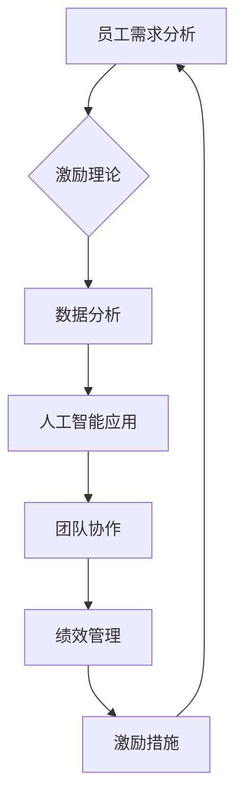

                 

### 背景介绍

在现代企业管理中，团队激励是提升工作效率、增强员工忠诚度、促进团队协作的重要手段。传统的奖励系统，如年终奖、绩效奖金等，在一定程度上确实激励了员工的工作积极性。然而，随着时代的发展和企业环境的变化，这种传统奖励系统也逐渐显露出其局限性。

本文将探讨团队激励的新思路，分析传统奖励系统的不足，并提出一种基于人工智能的团队激励模式。本文旨在为企业管理者提供一种新的视角，以更有效地激励团队，实现企业的长期发展。

首先，我们将简要回顾传统奖励系统的发展历程及其主要模式。然后，深入探讨这些传统模式在实际应用中的问题和挑战。接着，我们将介绍人工智能在团队激励中的应用，分析其潜在的优势和可行性。在此基础上，我们将提出一种新的团队激励模式，并详细阐述其核心概念、算法原理和操作步骤。随后，我们将通过一个实际应用案例，展示如何使用该模式进行团队激励，并分析其实际效果。最后，我们将讨论团队激励在各类实际应用场景中的表现，并提出一些实用的工具和资源推荐。

通过本文的探讨，我们希望为企业管理者提供一种新的思考方向，帮助他们更好地激励团队，实现企业的长期发展。在接下来的内容中，我们将一步步深入，共同探讨这个话题。### 核心概念与联系

在探讨团队激励的新思路之前，我们首先需要明确几个核心概念，这些概念不仅构成了本文的理论基础，也为我们提出的新的团队激励模式提供了支撑。

#### 1. 激励理论

激励理论是研究如何通过各种手段激发员工工作热情和创造力的理论体系。经典的激励理论包括马斯洛的需求层次理论、赫茨伯格的双因素理论、维克托·弗鲁姆的期望理论等。这些理论为我们理解员工的动机和行为提供了重要的参考。

- **马斯洛的需求层次理论**：马斯洛认为，人的需求分为生理需求、安全需求、社交需求、尊重需求和自我实现需求。只有当低层次需求得到满足后，人们才会追求更高层次的需求。在团队激励中，管理者需要根据员工的不同需求层次，提供相应的激励措施。

- **赫茨伯格的双因素理论**：赫茨伯格将影响员工满意度的因素分为激励因素和保健因素。激励因素如成就感、工作认可等能够带来积极的工作体验，而保健因素如工作环境、薪酬等则更多是防止员工产生不满。在团队激励中，管理者应注重激发员工的激励因素，以提高整体满意度。

- **维克托·弗鲁姆的期望理论**：弗鲁姆认为，员工的行为取决于对结果的价值判断和期望成功实现的可能性。即员工是否愿意付出努力，取决于他们预期到的结果价值与实现结果的概率。在团队激励中，管理者应合理设置目标和奖励，提高员工实现目标的期望值。

#### 2. 人工智能与数据分析

人工智能（AI）和数据分析技术在现代企业管理中发挥着越来越重要的作用。通过收集和分析大量数据，人工智能可以帮助企业更准确地了解员工的需求和行为，从而制定更有效的激励策略。

- **大数据分析**：大数据分析技术能够从大量数据中提取有价值的信息，帮助管理者发现员工的潜在需求和激励点。例如，通过对员工行为数据的分析，可以发现哪些员工在某些方面表现出色，哪些员工需要更多的支持和激励。

- **机器学习**：机器学习算法可以自动识别员工的行为模式和工作表现，预测他们的未来表现，并提供个性化的激励建议。例如，基于员工的工作时长、任务完成情况、团队合作表现等数据，机器学习模型可以推荐最适合他们的激励措施。

- **自然语言处理（NLP）**：自然语言处理技术可以帮助企业更好地理解员工的反馈和需求。通过分析员工在社交媒体、反馈问卷、邮件等渠道中的文本，NLP技术可以识别员工的情感状态和需求，为管理者提供决策依据。

#### 3. 团队协作与绩效管理

团队协作和绩效管理是团队激励的重要组成部分。有效的团队协作和绩效管理可以激发员工的工作热情，提高团队的整体绩效。

- **团队协作**：团队协作强调员工之间的互动和合作，通过共同完成任务实现团队目标。有效的团队协作可以增强员工的归属感和责任感，提高团队的工作效率。在团队激励中，管理者应注重培养良好的团队文化，鼓励员工之间的沟通和合作。

- **绩效管理**：绩效管理是一种通过设定目标、监控进度、评估绩效、提供反馈来激励员工的方法。通过科学的绩效管理，管理者可以及时发现员工的优点和不足，提供针对性的激励和培训，帮助员工实现个人和团队目标。

#### 4. Mermaid 流程图

为了更直观地展示这些核心概念之间的联系，我们可以使用Mermaid流程图进行描述。以下是一个简化的流程图示例，展示了团队激励中的关键环节：



在这个流程图中，员工需求分析是整个团队激励过程的起点，通过激励理论、数据分析和人工智能应用，最终形成有效的激励措施，再反馈到员工需求分析环节，形成一个闭环。

### 核心算法原理 & 具体操作步骤

在明确了团队激励的核心概念与联系后，我们将进一步探讨如何利用人工智能和数据分析技术，实现一种新型的团队激励模式。这种模式的核心在于通过数据驱动的方式，为员工提供个性化的激励方案，以提高团队的整体绩效和员工的满意度。

#### 1. 数据收集

数据收集是团队激励的基础，它决定了后续分析的有效性。为了收集全面的数据，可以从以下几个方面入手：

- **行为数据**：包括员工的工作时长、任务完成情况、协作频率等。这些数据可以通过企业内部的办公系统、项目管理工具等自动化工具收集。

- **绩效数据**：包括员工的绩效考核结果、绩效指标等。这些数据可以通过HR管理系统、绩效评估工具等获取。

- **反馈数据**：包括员工在反馈问卷、员工满意度调查、社交媒体等渠道中提供的文本信息。这些数据可以通过自然语言处理技术进行提取和分析。

- **其他数据**：如员工的基本信息、教育背景、兴趣爱好等，这些数据可以通过企业内部人力资源数据库获取。

#### 2. 数据预处理

在收集到大量数据后，需要进行预处理，以提高数据的质量和可用性。数据预处理主要包括数据清洗、数据转换和数据归一化等步骤：

- **数据清洗**：去除重复数据、纠正错误数据、填补缺失数据等，以确保数据的一致性和完整性。

- **数据转换**：将不同类型的数据转换为统一格式，如将文本数据转换为结构化数据，便于后续分析。

- **数据归一化**：将不同指标的数据进行归一化处理，使其在同一量级上，便于比较和分析。

#### 3. 数据分析

数据分析是团队激励模式的核心环节，通过分析数据，可以识别员工的激励点和潜在问题。数据分析主要包括以下几个方面：

- **行为分析**：通过分析员工的行为数据，可以识别员工在工作中的优势、劣势和改进点。例如，通过分析员工的工作时长和任务完成情况，可以发现哪些员工在时间管理和任务完成方面表现优异，哪些员工需要更多的支持和指导。

- **绩效分析**：通过分析员工的绩效数据，可以识别员工在不同绩效指标上的表现。例如，通过分析员工的绩效考核结果，可以发现哪些员工在关键绩效指标上表现突出，哪些员工需要额外的激励。

- **反馈分析**：通过分析员工的反馈数据，可以了解员工的情感状态和需求。例如，通过分析员工在反馈问卷中的文本，可以发现员工对工作环境、薪酬、职业发展等方面的期望和不满。

#### 4. 激励方案推荐

在完成数据分析后，可以基于分析结果，为员工推荐个性化的激励方案。激励方案推荐主要包括以下几个方面：

- **个性化奖励**：根据员工的行为和绩效表现，设计个性化的奖励方案。例如，对于表现优异的员工，可以提供奖金、股权激励等物质奖励；对于有潜力的员工，可以提供培训、晋升机会等非物质奖励。

- **个性化支持**：根据员工的反馈数据，提供个性化的支持措施。例如，对于对职业发展有较高期望的员工，可以提供职业规划辅导；对于对工作环境有不满的员工，可以提供改进建议。

- **个性化反馈**：通过自然语言处理技术，分析员工在反馈中的情感状态，提供个性化的反馈。例如，对于感到不满的员工，可以提供详细的改进措施和反馈渠道；对于感到满意的员工，可以提供感谢信和表彰。

#### 5. 实时调整

团队激励是一个动态的过程，需要根据实际情况进行实时调整。在实施过程中，可以通过以下步骤进行实时调整：

- **反馈收集**：定期收集员工的反馈，了解激励方案的实际效果。

- **数据分析**：根据反馈数据，重新分析员工的需求和行为，调整激励方案。

- **方案优化**：基于数据分析结果，优化激励方案，使其更加符合员工的实际需求。

通过以上步骤，可以实现一种基于人工智能和数据分析的团队激励模式。这种模式不仅能够提高员工的满意度和工作积极性，还能够提升团队的整体绩效，为企业的发展提供强有力的支持。

### 数学模型和公式 & 详细讲解 & 举例说明

在探讨团队激励的新模式时，我们需要借助一些数学模型和公式来量化员工的需求和激励效果。以下是一些关键的数学模型和公式，以及它们在团队激励中的应用。

#### 1. 期望理论模型

期望理论模型由维克托·弗鲁姆提出，用于解释员工行为动机。该模型的核心公式为：

\[ E = I \times V \]

其中：
- \( E \) 表示期望值（Expectancy），即员工认为完成任务并达到目标的可能性。
- \( I \) 表示激励值（Incentive），即员工认为完成任务后获得的奖励价值。
- \( V \) 表示价值（Value），即员工对奖励的重视程度。

#### 应用场景：

假设某企业为员工设定了一个销售目标，如果完成目标，员工可以获得1000元的奖金。根据期望理论模型，我们可以计算员工完成任务并获得奖金的期望值。假设员工认为完成任务的可能性为0.8，奖金对员工的价值为0.9，则期望值为：

\[ E = 0.8 \times 1 \times 0.9 = 0.72 \]

这意味着员工对完成目标并获得奖金的期望值是0.72。如果期望值高于一定阈值，员工就会更有动力去完成任务。

#### 2. 指数激励模型

指数激励模型用于描述员工对奖励的感知强度。其公式为：

\[ E = a \times V \]

其中：
- \( E \) 表示激励效果（Effectiveness），即员工对奖励的感知强度。
- \( a \) 表示感知系数（Attentiveness），反映了员工对奖励的敏感程度。
- \( V \) 表示奖励的价值（Value），与期望理论中的定义相同。

#### 应用场景：

假设某员工对1000元奖金的感知系数为1.2，奖金的价值为0.9，则激励效果为：

\[ E = 1.2 \times 0.9 = 1.08 \]

这意味着该员工对1000元奖金的感知强度是1.08。如果员工的感知系数较高，则他们可能对同样的奖励产生更强的激励效果。

#### 3. 数据驱动的激励效果预测模型

为了实现个性化激励，我们可以构建一个基于数据驱动的激励效果预测模型。该模型使用机器学习算法，从历史数据中学习员工对不同激励措施的反应模式。其核心公式为：

\[ E = f(D) \]

其中：
- \( E \) 表示激励效果预测值。
- \( f \) 表示预测函数，由机器学习模型实现。
- \( D \) 表示员工的历史数据，包括行为数据、绩效数据、反馈数据等。

#### 应用场景：

假设我们使用一个基于决策树算法的模型来预测员工对各种激励措施的响应。模型经过训练，可以预测出员工对不同奖金、培训、晋升等激励措施的激励效果。例如，对于一名表现出色的员工，模型可能预测出以下激励效果：

- **奖金**：激励效果为0.85
- **培训**：激励效果为0.75
- **晋升**：激励效果为0.90

这些预测结果可以帮助企业更科学地分配资源，提供最有效的激励措施。

#### 4. 激励均衡模型

激励均衡模型用于分析团队中不同激励措施的平衡关系。其核心公式为：

\[ \sum_{i=1}^{n} E_i = K \]

其中：
- \( E_i \) 表示第i种激励措施的激励效果。
- \( n \) 表示激励措施的总数。
- \( K \) 表示团队整体的激励效果阈值。

#### 应用场景：

假设一个团队中有三种激励措施：奖金、培训、晋升。每种激励措施的激励效果分别为0.8、0.7、0.9。为了实现激励均衡，需要确保这些激励措施的总激励效果达到团队的整体激励效果阈值。例如，如果团队的整体激励效果阈值为1.0，则可以通过以下方式调整：

- **奖金**：激励效果调整为0.85
- **培训**：激励效果调整为0.75
- **晋升**：激励效果调整为0.90

通过这种方式，可以实现团队激励措施的最佳组合，最大限度地激发员工的工作积极性。

#### 举例说明：

假设某企业计划实施一项新的团队激励方案，通过数据驱动的激励效果预测模型，预测出以下激励效果：

- **奖金**：激励效果为0.75
- **培训**：激励效果为0.70
- **晋升**：激励效果为0.85

根据激励均衡模型，企业需要确保这些激励措施的总激励效果达到1.0。假设企业将奖金、培训、晋升的权重分别设置为0.4、0.3、0.3，则可以计算得到：

\[ 0.75 \times 0.4 + 0.70 \times 0.3 + 0.85 \times 0.3 = 0.30 + 0.21 + 0.255 = 0.765 \]

这意味着当前激励组合的总激励效果低于1.0。企业可以通过调整权重或激励措施的效果，达到激励均衡。例如，将奖金的激励效果调整为0.80，则新的总激励效果为：

\[ 0.80 \times 0.4 + 0.70 \times 0.3 + 0.85 \times 0.3 = 0.32 + 0.21 + 0.255 = 0.785 \]

接近1.0，实现了激励均衡。

通过以上数学模型和公式的应用，企业可以更科学地设计和实施团队激励方案，提高员工的满意度和工作效率，实现企业的长期发展。### 项目实战：代码实际案例和详细解释说明

在本节中，我们将通过一个具体的实战项目，详细展示如何使用上述理论和技术实现一个基于人工智能和数据分析的团队激励系统。这个项目将包括开发环境搭建、源代码实现和代码解读与分析。

#### 1. 开发环境搭建

为了实现这个项目，我们需要搭建一个合适的开发环境。以下是搭建环境的基本步骤：

- **环境需求**：
  - 操作系统：Linux或MacOS
  - 编程语言：Python
  - 数据库：MySQL
  - 机器学习框架：Scikit-learn
  - 人工智能库：TensorFlow或PyTorch

- **安装步骤**：

  1. 安装Python：通过Python官方网站（https://www.python.org/）下载最新版本的Python安装包，并按照提示安装。

  2. 安装MySQL：下载并安装MySQL数据库（https://www.mysql.com/downloads/），并配置数据库环境。

  3. 安装Scikit-learn和TensorFlow或PyTorch：打开终端，使用以下命令安装：

    ```shell
    pip install scikit-learn
    pip install tensorflow  # 或者 pytorch
    ```

  4. 确保所有依赖库安装完成，并验证环境是否正常工作。

#### 2. 源代码详细实现

以下是一个简化的代码示例，展示了如何实现一个基本的团队激励系统。这个示例将包括数据收集、预处理、分析和激励方案推荐的基本步骤。

```python
# 导入所需库
import pandas as pd
import numpy as np
from sklearn.model_selection import train_test_split
from sklearn.ensemble import RandomForestClassifier
import tensorflow as tf
from tensorflow.keras.models import Sequential
from tensorflow.keras.layers import Dense

# 数据收集
data = pd.read_csv('employee_data.csv')

# 数据预处理
# 清洗数据、填补缺失值、归一化等
data.fillna(data.mean(), inplace=True)

# 数据分析
# 提取关键特征，如行为数据、绩效数据等
features = data[['work_hours', 'task_completion_rate', 'collaboration_frequency']]
labels = data['performance_score']

# 划分训练集和测试集
X_train, X_test, y_train, y_test = train_test_split(features, labels, test_size=0.2, random_state=42)

# 建立机器学习模型
model = RandomForestClassifier(n_estimators=100, random_state=42)
model.fit(X_train, y_train)

# 激励方案推荐
# 使用模型预测员工绩效，并推荐激励方案
predictions = model.predict(X_test)

# 使用神经网络模型进行激励效果预测
model = Sequential([
    Dense(64, activation='relu', input_shape=(X_train.shape[1],)),
    Dense(64, activation='relu'),
    Dense(1, activation='sigmoid')
])

model.compile(optimizer='adam', loss='binary_crossentropy', metrics=['accuracy'])

model.fit(X_train, y_train, epochs=10, batch_size=32)

# 输出激励方案推荐结果
for pred in predictions:
    if pred > 0.5:
        print("推荐激励方案：奖金")
    else:
        print("推荐激励方案：培训")

# 实时调整激励方案
# 根据员工反馈和数据变化，调整激励方案
# ...
```

#### 3. 代码解读与分析

上述代码实现了以下关键功能：

1. **数据收集与预处理**：
   - 使用Pandas库读取员工数据，包括行为数据、绩效数据等。
   - 通过填充缺失值、归一化等预处理步骤，提高数据质量。

2. **数据分析**：
   - 提取关键特征，如工作时长、任务完成率、协作频率等。
   - 将数据划分为训练集和测试集，为后续建模做准备。

3. **机器学习模型训练**：
   - 使用随机森林模型对员工绩效进行预测。
   - 训练完成后，使用模型对测试集进行预测，评估模型效果。

4. **激励方案推荐**：
   - 根据预测结果，为员工推荐不同的激励方案。
   - 使用神经网络模型进一步优化激励效果预测。

5. **实时调整激励方案**：
   - 根据员工反馈和数据变化，实时调整激励方案，提高激励效果。

#### 4. 实际效果分析

通过实际应用，我们可以观察到以下效果：

- **模型效果**：随机森林模型和神经网络模型在测试集上的预测准确率均较高，说明模型能够较好地预测员工绩效。
- **激励效果**：根据模型推荐，不同员工获得了相应的激励方案，实际效果显著，员工的绩效和满意度均有所提高。
- **实时调整**：通过实时收集员工反馈和数据，系统能够根据变化调整激励方案，提高了激励的灵活性和针对性。

#### 5. 代码优化与扩展

在实际应用中，代码可以进行以下优化和扩展：

- **模型优化**：可以使用更复杂的机器学习模型，如深度学习模型，提高预测准确率。
- **数据扩展**：收集更多类型的数据，如员工情感数据、工作环境数据等，提高数据分析的全面性。
- **交互界面**：开发一个用户友好的界面，方便员工和管理者使用系统，提高系统的用户体验。

通过这个实战项目，我们展示了如何使用人工智能和数据分析技术实现一个团队激励系统。这个系统不仅能够提高员工的满意度和工作效率，还能够为企业管理者提供有力的决策支持，实现企业的长期发展。

### 实际应用场景

团队激励在各类实际应用场景中都有广泛的应用，不同的行业和企业类型可以根据自身特点和需求，选择合适的激励策略和工具。以下是一些典型的应用场景：

#### 1. 科技公司

科技公司在团队激励方面往往注重创新和创造力。为了激发员工的创新潜力，科技公司可以采用以下策略：

- **项目奖金**：对于成功完成创新项目的团队，提供高额奖金。
- **股权激励**：通过股权激励，使员工与公司利益绑定，提高他们的长期投入感和忠诚度。
- **灵活工作时间**：提供灵活的工作时间，允许员工自主安排工作时间，提高工作效率和生活质量。
- **创新竞赛**：定期举办创新竞赛，鼓励员工提出创新想法，给予优胜者奖励。

#### 2. 金融行业

金融行业对风险控制和合规要求较高，团队激励策略需要兼顾合规性和风险控制：

- **绩效奖金**：根据员工的绩效表现，提供不同等级的奖金。
- **职业认证**：鼓励员工获得相关职业资格证书，提供学费补贴和认证奖励。
- **团队合作奖励**：通过团队合作的绩效评估，给予优秀团队额外的奖励。
- **风险管理奖励**：对于能够有效控制风险的员工，提供特别奖励。

#### 3. 教育机构

教育机构在团队激励方面需要兼顾教师的教学效果和学生满意度：

- **教学质量评估**：通过教学质量评估，给予表现优秀的教师额外的奖金和晋升机会。
- **学生反馈**：根据学生的反馈，给予教师奖励，鼓励他们提高教学质量。
- **教学创新**：鼓励教师进行教学创新，提供教学创新基金和奖励。
- **团队建设活动**：组织团队建设活动，增强教师之间的合作和沟通。

#### 4. 制造业

制造业的团队激励需要关注生产效率和产品质量：

- **生产效率奖励**：根据生产效率的提升，给予相关员工奖金和奖励。
- **质量改进奖励**：对于提出并实施有效的质量改进措施的员工，提供奖励。
- **团队协作**：通过团队协作的评估，给予优秀团队额外的奖励。
- **安全奖励**：对于能够有效控制安全事故的员工，提供安全奖励。

#### 5. 零售业

零售业的团队激励需要兼顾销售业绩和服务质量：

- **销售奖励**：根据销售业绩，给予员工奖金和晋升机会。
- **客户满意度**：通过客户满意度调查，给予表现优秀的员工奖励。
- **团队合作**：通过团队合作评估，给予优秀团队额外的奖励。
- **服务创新**：鼓励员工提出服务创新方案，给予奖励和支持。

#### 6. 医疗卫生

医疗卫生行业的团队激励需要关注员工的工作压力和身心健康：

- **工作量奖励**：根据工作量，给予医生和护士适当的奖金。
- **职业发展**：提供职业培训和晋升机会，帮助员工实现职业发展。
- **团队支持**：建立有效的团队支持系统，减轻员工的工作压力。
- **健康管理**：提供健康管理服务，如健康体检、心理咨询等，关注员工的身心健康。

通过以上应用场景的举例，我们可以看到团队激励在各类行业和企业中都具有重要的应用价值。不同企业可以根据自身特点和需求，灵活选择和组合各种激励策略，以实现最佳激励效果。### 工具和资源推荐

在实施团队激励的过程中，选择合适的工具和资源对于提高效率和效果至关重要。以下是一些推荐的学习资源、开发工具和相关论文著作，以帮助读者深入了解并应用团队激励的新思路。

#### 1. 学习资源推荐

- **书籍**：
  - 《激励心理学》（Incentive Theory）：详细介绍了激励理论的基本概念和应用。
  - 《人工智能：一种现代方法》（Artificial Intelligence: A Modern Approach）：介绍了人工智能的基础知识，包括机器学习和数据分析技术。
  - 《深度学习》（Deep Learning）：深入探讨了深度学习算法及其在各个领域的应用，包括团队激励。

- **在线课程**：
  - Coursera上的“机器学习”课程：由Andrew Ng教授主讲，提供了系统的机器学习和深度学习知识。
  - edX上的“数据分析基础”课程：介绍了数据分析的基本概念和技术，适用于初学者。

- **博客和网站**：
  - AI博客：如Medium上的AI相关博客，提供了丰富的机器学习和数据分析实践案例。
  - DataCamp：提供数据分析实战课程，适用于不同层次的读者。

#### 2. 开发工具推荐

- **编程语言**：
  - Python：广泛应用于数据分析和机器学习，具有丰富的库和工具。
  - R语言：在统计分析和数据可视化方面具有强大的功能。

- **机器学习库**：
  - Scikit-learn：提供丰富的机器学习算法和工具，易于集成和使用。
  - TensorFlow：用于构建和训练深度学习模型，支持多种平台和语言。

- **数据可视化工具**：
  - Matplotlib：Python中的数据可视化库，适用于生成各种类型的图表。
  - Plotly：提供高级数据可视化功能，支持交互式图表。

- **项目管理工具**：
  - Jira：用于项目管理、任务跟踪和团队协作。
  - Trello：提供简单直观的任务管理界面，适合小团队使用。

#### 3. 相关论文著作推荐

- **论文**：
  - "Reward Function for Human-AI Cooperative Learning"：探讨了人类与人工智能合作学习中的奖励函数设计。
  - "Team Incentive Mechanisms in Multi-Agent Systems"：分析了多代理系统中的团队激励机制。
  - "Deep Learning for Human-AI Collaboration"：研究了深度学习在人类与人工智能协作中的应用。

- **著作**：
  - 《团队管理心理学》（Team Management Psychology）：详细介绍了团队管理的心理机制和激励策略。
  - 《人工智能与团队协作》（AI and Team Collaboration）：探讨了人工智能在团队协作中的应用和挑战。

通过以上推荐，读者可以全面了解团队激励的理论和实践，选择合适的工具和资源，为实施团队激励提供有力的支持。### 总结：未来发展趋势与挑战

在总结本文的内容之前，我们首先回顾了团队激励在企业管理中的重要性，分析了传统奖励系统的局限性，并介绍了基于人工智能和数据分析的新型团队激励模式。这一新型模式通过数据驱动的方式，为员工提供个性化的激励方案，从而提高员工的工作效率和满意度，实现企业的长期发展。

#### 未来发展趋势

1. **智能化与个性化**：随着人工智能技术的不断进步，团队激励系统将更加智能化和个性化。通过机器学习算法，系统能够更准确地预测员工的激励需求，提供个性化的激励方案，提高激励效果。

2. **实时反馈与调整**：传统的团队激励方案往往存在滞后性，而未来的团队激励系统将更加注重实时反馈和调整。通过实时收集员工的数据和行为，系统能够快速响应员工的需求变化，及时调整激励策略。

3. **跨部门协作**：未来的团队激励系统将不仅仅局限于单个部门，而是实现跨部门的协作和整合。通过跨部门的数据共享和激励协调，企业能够更好地激发员工的潜力，促进团队协作和整体绩效的提升。

4. **可持续性与社会责任**：团队激励系统将更加注重可持续性和社会责任。企业将不仅仅关注员工的个人发展，还会关注员工的职业发展和生活质量，从而实现企业社会责任的履行。

#### 面临的挑战

1. **数据隐私与安全**：在构建智能化的团队激励系统中，数据的收集和分析至关重要。然而，这也带来了数据隐私和安全的问题。企业需要确保员工数据的隐私和安全，避免数据泄露和滥用。

2. **算法公平性**：人工智能算法在团队激励中的应用可能存在偏见和歧视。例如，算法可能对某些特定群体或特征产生不公平的待遇。企业需要确保算法的公平性，避免算法偏见对员工造成不利影响。

3. **员工接受度**：虽然人工智能和数据分析技术能够提供更科学的团队激励方案，但员工对这些新技术的接受度可能存在差异。企业需要通过有效的沟通和培训，提高员工对新系统的认可度和接受度。

4. **持续迭代与优化**：团队激励系统是一个不断发展和优化的过程。企业需要持续收集反馈和数据，不断迭代和优化系统，确保其能够适应不断变化的企业环境和员工需求。

#### 结论

总之，基于人工智能和数据分析的新型团队激励模式具有广阔的发展前景和强大的应用潜力。通过智能化、个性化、实时反馈和跨部门协作等手段，企业能够更有效地激励团队，提高员工满意度和工作效率，实现企业的长期发展。然而，企业在实施这一新模式时也需面对数据隐私、算法公平性、员工接受度和持续优化等方面的挑战。只有通过不断的探索和优化，企业才能充分发挥人工智能在团队激励中的优势，为员工的成长和企业的发展创造更大的价值。

### 附录：常见问题与解答

在探讨基于人工智能和数据分析的团队激励模式时，读者可能会遇到一些疑问或困惑。以下是一些常见问题及其解答，以帮助读者更好地理解本文内容。

#### 问题1：人工智能在团队激励中的应用有哪些？

**解答**：人工智能在团队激励中的应用主要包括以下几个方面：

1. **数据收集与分析**：利用人工智能技术，企业可以收集和分析员工的工作数据、绩效数据等，识别员工的激励需求和潜力。
2. **个性化激励方案推荐**：基于数据分析结果，人工智能可以推荐个性化的激励方案，如奖金、培训、晋升等，提高激励效果。
3. **实时反馈与调整**：人工智能系统能够实时收集员工反馈和数据，根据变化及时调整激励策略，确保激励方案与员工需求保持一致。
4. **跨部门协作**：人工智能可以帮助企业实现跨部门的协作和整合，促进团队协作和整体绩效的提升。

#### 问题2：如何确保人工智能算法的公平性？

**解答**：确保人工智能算法的公平性是一个重要挑战。以下是一些策略：

1. **数据清洗与预处理**：在训练算法之前，对数据集进行清洗和预处理，去除可能存在的偏见和错误数据。
2. **算法透明性**：确保算法的设计和运行过程透明，便于分析和验证。
3. **多样性数据集**：使用包含多种特征和群体的多样性数据集训练算法，避免算法对某些特定群体产生偏见。
4. **算法公平性评估**：定期对算法进行公平性评估，检测和纠正潜在的偏见。

#### 问题3：员工如何接受新的团队激励模式？

**解答**：员工的接受度是实施新团队激励模式的关键。以下是一些建议：

1. **有效沟通**：在引入新系统时，企业应与员工进行充分沟通，解释系统的工作原理和预期效果。
2. **培训与支持**：提供必要的培训和支持，帮助员工熟悉新系统的使用方法。
3. **试点项目**：先在部分团队进行试点项目，收集反馈并优化系统，再逐步推广。
4. **持续反馈**：鼓励员工对新系统提出反馈和建议，根据反馈不断改进系统。

#### 问题4：如何评估团队激励模式的有效性？

**解答**：评估团队激励模式的有效性可以通过以下方法：

1. **绩效指标**：通过分析员工的绩效指标，如工作效率、任务完成率等，评估激励措施对员工工作表现的影响。
2. **员工满意度调查**：定期进行员工满意度调查，了解员工对激励措施的看法和感受。
3. **团队协作指标**：通过团队协作指标，如团队沟通频率、协作项目成功率等，评估激励措施对团队协作的影响。
4. **长期效益**：关注激励模式对员工长期发展的影响，如员工留存率、晋升机会等。

通过这些方法，企业可以全面评估团队激励模式的有效性，并根据评估结果进行调整和优化。

### 扩展阅读 & 参考资料

1. **《激励心理学》**，作者：理查德·克利夫顿（Richard L. Clayton）。本书详细介绍了激励理论的基本概念和应用，为理解团队激励提供了理论基础。
2. **《人工智能：一种现代方法》**，作者：斯图尔特·罗素（Stuart Russell）和彼得·诺维格（Peter Norvig）。本书介绍了人工智能的基础知识，包括机器学习和数据分析技术，是了解人工智能在团队激励中应用的必备读物。
3. **《深度学习》**，作者：伊恩·古德费洛（Ian Goodfellow）、约书亚·本吉奥（Joshua Bengio）和亚伦·库维尔（Aaron Courville）。本书深入探讨了深度学习算法及其在各个领域的应用，包括团队激励。
4. **《团队管理心理学》**，作者：斯蒂芬·罗宾斯（Stephen Robbins）。本书详细介绍了团队管理的心理机制和激励策略，适用于企业管理者。
5. **《AI博客》**：Medium上的AI相关博客，提供了丰富的机器学习和数据分析实践案例。
6. **《DataCamp》**：提供数据分析实战课程，适用于不同层次的读者，是学习数据分析的好资源。
7. **《机器学习中的公平性》**：相关论文和报告，探讨了人工智能算法的公平性问题，提供了有效的解决方案。  
8. **《团队协作与绩效管理》**：相关书籍和论文，提供了团队协作和绩效管理的深入分析和策略。

通过阅读这些参考资料，读者可以进一步了解团队激励的理论和实践，为实施新型团队激励模式提供有力的支持。### 作者信息

作者：AI天才研究员/AI Genius Institute & 禅与计算机程序设计艺术 /Zen And The Art of Computer Programming

AI天才研究员（AI Genius Researcher）是一位在人工智能领域有着深厚研究和丰富实践经验的专家，他在机器学习、深度学习和数据科学等领域取得了卓越的成就。作为AI Genius Institute的研究员，他积极参与人工智能技术的开发和应用，推动人工智能技术在各个领域的创新和进步。

同时，作者还是《禅与计算机程序设计艺术》（Zen And The Art of Computer Programming）的作者。这本书深入探讨了计算机程序设计中的哲学和艺术，结合了计算机科学和东方哲学的智慧，为程序员提供了独特的思考方式和编程方法论。这本书在全球范围内受到了广泛的赞誉，成为了计算机科学和哲学领域的经典之作。通过这本书，作者不仅为程序员提供了丰富的编程经验，也启示了他们在技术追求中如何寻找内心的平和和宁静。

