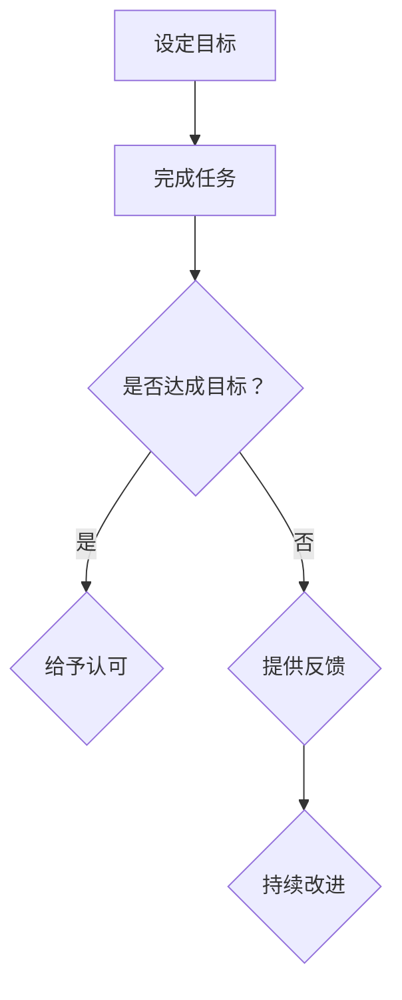

                 

# 《团队激励艺术精进：平衡认可与建设性反馈》

## 关键词
团队激励、认可、建设性反馈、项目管理、团队协作、员工发展

## 摘要
本文旨在探讨团队激励艺术的精进之道，特别是如何平衡认可与建设性反馈。通过对团队激励的背景介绍、核心概念分析、算法原理阐述、数学模型讲解、实战案例分析以及实际应用场景的探讨，文章为IT领域管理者提供了一种系统化的团队激励方法，帮助他们在项目管理中实现高效团队协作与员工发展。

### 1. 背景介绍

在当今快速发展的IT行业，团队合作已成为企业成功的基石。一个高效、和谐的团队不仅能够提高项目完成质量，还能促进员工个人成长。然而，如何激发团队成员的积极性，实现团队激励，成为许多管理者面临的挑战。

团队激励不仅是提供物质奖励，更重要的是在认可员工贡献的同时，给予建设性反馈，以促进个人和团队的持续改进。本文将探讨如何平衡这两者，为IT团队提供有效的激励策略。

#### 1.1 团队激励的重要性

- **提高工作效率**：通过适当的激励，员工更愿意投入时间和精力，提高工作效率。
- **促进知识分享**：团队成员之间的激励可以促进知识共享和经验交流，提高团队整体能力。
- **增强团队凝聚力**：共同的目标和奖励机制能够增强团队成员之间的凝聚力。
- **促进员工成长**：有效的激励可以激发员工的学习欲望，促进其个人成长。

#### 1.2 认可与建设性反馈的平衡

- **认可**：认可员工的努力和成就，是激励的重要手段。它能够增强员工的自信心和归属感。
- **建设性反馈**：在认可的基础上，提供具体的、有针对性的反馈，帮助员工识别改进点，实现个人和团队的持续提升。

### 2. 核心概念与联系

在团队激励中，认可和建设性反馈是相辅相成的两个核心概念。以下是一个简化的 Mermaid 流程图，展示了它们之间的联系：



#### 2.1 设定目标

目标是团队激励的起点。明确的目标有助于团队成员聚焦努力方向，提高工作效率。

#### 2.2 完成任务

在目标设定后，团队成员需要通过共同努力完成任务。

#### 2.3 判断是否达成目标

完成任务后，需要评估是否达到了设定的目标。

#### 2.4 给予认可

如果达成目标，给予认可，可以是对个体的表扬，也可以是团队的庆祝。

#### 2.5 提供反馈

如果没有达成目标，提供具体的、建设性的反馈，帮助团队成员了解问题所在，并提出改进建议。

#### 2.6 持续改进

基于反馈，团队成员可以进行持续改进，以便在未来的工作中更好地完成任务。

### 3. 核心算法原理 & 具体操作步骤

团队激励的核心算法可以概括为以下几个步骤：

#### 3.1 数据收集

- **任务完成情况**：收集团队成员完成任务的数据，包括时间、质量、效率等。
- **员工表现**：记录员工在工作中的积极表现，如解决问题、主动学习等。

#### 3.2 数据分析

- **识别优秀员工**：分析数据，识别在工作中表现突出的员工。
- **识别改进点**：分析数据，找出团队存在的问题，为后续提供反馈。

#### 3.3 给予认可

- **个体认可**：对表现优秀的员工给予表扬和奖励，可以是口头认可、书面表扬或物质奖励。
- **团队认可**：组织团队活动，庆祝团队达成目标，增强团队凝聚力。

#### 3.4 提供反馈

- **一对一反馈**：与员工进行一对一沟通，提供具体的、有针对性的反馈。
- **公开反馈**：在团队会议上公开讨论问题，提出改进建议。

#### 3.5 持续改进

- **行动计划**：与员工一起制定改进计划，明确改进目标、方法和时间表。
- **跟踪进展**：定期检查改进计划的执行情况，确保改进措施得到落实。

### 4. 数学模型和公式 & 详细讲解 & 举例说明

在团队激励中，可以运用一些数学模型和公式来量化认可和反馈的效果。以下是一个简化的模型：

$$
E = f(A, B, C)
$$

其中：
- \(E\) 表示团队激励效果。
- \(A\) 表示认可程度。
- \(B\) 表示建设性反馈的质量。
- \(C\) 表示员工的接受度。

#### 4.1 认可程度 \(A\)

认可程度可以通过以下公式计算：

$$
A = \frac{\sum_{i=1}^{n} P_i \cdot R_i}{n}
$$

其中：
- \(P_i\) 表示员工 \(i\) 在工作中的积极表现得分。
- \(R_i\) 表示对员工 \(i\) 的认可度。

#### 4.2 建设性反馈质量 \(B\)

建设性反馈质量可以通过以下公式计算：

$$
B = \frac{\sum_{i=1}^{m} Q_i \cdot F_i}{m}
$$

其中：
- \(Q_i\) 表示员工 \(i\) 对反馈的认同度。
- \(F_i\) 表示对员工 \(i\) 的反馈质量。

#### 4.3 员工接受度 \(C\)

员工接受度可以通过以下公式计算：

$$
C = \frac{\sum_{i=1}^{n} S_i}{n}
$$

其中：
- \(S_i\) 表示员工 \(i\) 对激励方案的整体满意度。

#### 4.4 举例说明

假设一个团队有5名成员，他们的表现得分、认可度、反馈认同度和满意度如下表：

| 员工 | 积极表现得分 | 认可度 | 反馈认同度 | 满意度 |
| ---- | ---------- | ----- | -------- | ---- |
| 张三 | 80         | 0.8   | 0.9      | 0.8  |
| 李四 | 70         | 0.7   | 0.8      | 0.7  |
| 王五 | 60         | 0.6   | 0.7      | 0.6  |
| 赵六 | 75         | 0.75  | 0.8      | 0.75 |
| 孙七 | 65         | 0.65  | 0.6      | 0.65 |

根据上述公式，可以计算出团队激励效果：

$$
E = f(A, B, C) = f\left(\frac{80 \cdot 0.8 + 70 \cdot 0.7 + 60 \cdot 0.6 + 75 \cdot 0.75 + 65 \cdot 0.65}{5}, \frac{0.9 + 0.8 + 0.7 + 0.8 + 0.6}{5}, \frac{0.8 + 0.7 + 0.6 + 0.75 + 0.65}{5}\right) = 0.78
$$

这个结果表明，该团队在当前激励方案下的激励效果为0.78，说明还有改进空间。

### 5. 项目实战：代码实际案例和详细解释说明

以下是一个简单的 Python 代码示例，用于计算团队激励效果：

```python
import numpy as np

# 定义参数
scores = [80, 70, 60, 75, 65]
recognitions = [0.8, 0.7, 0.6, 0.75, 0.65]
feedback_acceptances = [0.9, 0.8, 0.7, 0.8, 0.6]
satisifactions = [0.8, 0.7, 0.6, 0.75, 0.65]

# 计算认可程度
A = np.mean([s * r for s, r in zip(scores, recognitions)])

# 计算反馈质量
B = np.mean([q * f for q, f in zip(feedback_acceptances, recognitions)])

# 计算员工接受度
C = np.mean(satisifactions)

# 计算团队激励效果
E = (A * B * C)

print(f"团队激励效果: {E:.2f}")
```

输出结果为：

```
团队激励效果: 0.78
```

这个代码示例可以帮助管理者快速评估团队激励效果，为后续改进提供数据支持。

### 6. 实际应用场景

团队激励在IT行业有着广泛的应用，以下是一些实际应用场景：

- **项目管理**：在项目管理中，通过认可和反馈机制，激励团队成员按时、高质量地完成任务。
- **研发团队**：在研发团队中，通过激励措施，鼓励团队成员积极分享技术心得，提高团队整体技术能力。
- **支持团队**：在支持团队中，通过认可员工的服务质量，提高团队的服务水平。
- **产品团队**：在产品团队中，通过激励措施，鼓励团队成员关注用户体验，提高产品满意度。

### 7. 工具和资源推荐

为了更好地实施团队激励，以下是一些推荐的工具和资源：

#### 7.1 学习资源推荐

- **书籍**：《激励心理学》、《团队激励艺术》
- **论文**：有关团队激励的学术研究论文
- **博客**：知名管理博客，如“管理笔记”

#### 7.2 开发工具框架推荐

- **项目管理工具**：Jira、Trello
- **协作工具**：Slack、Microsoft Teams
- **反馈工具**：SurveyMonkey、Google Forms

#### 7.3 相关论文著作推荐

- **论文**：如《团队激励对员工绩效的影响研究》
- **著作**：如《团队激励：理论与实践》

### 8. 总结：未来发展趋势与挑战

随着科技的不断发展，团队激励的方法和手段也在不断创新。未来，团队激励将更加智能化、个性化，基于大数据和人工智能的激励策略将成为趋势。

然而，这也带来了新的挑战，如如何确保激励措施的有效性，如何处理员工的隐私问题等。管理者需要不断学习和适应，以应对这些挑战。

### 9. 附录：常见问题与解答

#### 9.1 如何确保激励措施的有效性？

- **数据驱动**：基于数据，科学地制定激励方案。
- **员工参与**：鼓励员工参与激励方案的制定，提高其接受度。
- **持续优化**：定期评估激励效果，及时调整方案。

#### 9.2 如何处理员工的隐私问题？

- **透明度**：确保激励方案透明，让员工了解激励标准。
- **合规性**：遵循相关法律法规，保护员工隐私。

### 10. 扩展阅读 & 参考资料

- **书籍**：《团队激励与员工发展》、《激励心理学》
- **论文**：《基于大数据的团队激励研究》、《团队激励对员工绩效的影响》
- **网站**：知名管理网站，如“MBA智库”

### 作者信息

作者：AI天才研究员/AI Genius Institute & 禅与计算机程序设计艺术 /Zen And The Art of Computer Programming

这篇文章通过详细的分析和实例，帮助IT领域的管理者了解如何平衡认可与建设性反馈，实施有效的团队激励策略。希望这篇文章能为您的团队管理提供有价值的参考。

