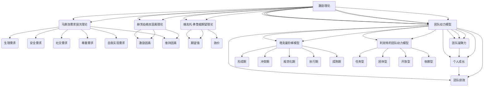

                 

### 背景介绍

在当今快速发展的IT行业中，团队的合作与协同作用成为了企业成功的关键因素之一。然而，如何有效地激励团队成员，使得他们保持高水平的动力和创造力，成为了一个至关重要的问题。在这个过程中，认可与批评作为一种管理工具，不仅能够影响团队成员的情感和态度，还能够直接关系到项目的成功与否。

本文将深入探讨团队激励中的认可与批评艺术。首先，我们将回顾一些关于团队激励的理论和实践，并引出本文的核心主题——认可与批评。接着，我们将详细讨论认可与批评的概念、原理以及其在团队中的实际应用。此外，我们还会结合实际案例，分析认可与批评在不同情境下的效果与影响。最后，我们将总结本文的主要观点，并提出未来研究和实践的方向。

通过本文的阅读，您将了解如何巧妙地运用认可与批评这一管理工具，激发团队成员的潜力，提升团队的整体绩效。让我们一起深入探讨这个极具挑战性但也极具价值的课题。

### 核心概念与联系

在探讨团队激励中的认可与批评艺术之前，我们需要首先了解几个核心概念，它们分别是：激励理论、团队动力模型以及认可与批评的定义与作用。

#### 激励理论

激励理论是探讨如何激发和维持人们行为的一种心理学理论。著名的激励理论包括马斯洛的需求层次理论、赫茨伯格的双因素理论以及维克托·弗鲁姆的期望理论等。这些理论从不同角度阐述了人类行为背后的动机和驱动因素。

- **马斯洛的需求层次理论**认为人类有五种基本需求：生理需求、安全需求、社交需求、尊重需求和自我实现需求。只有当低层次需求得到满足时，人们才会追求更高层次的需求。

- **赫茨伯格的双因素理论**区分了激励因素和维持因素。激励因素如成就、认可、工作本身等能够带来积极的工作体验，而维持因素如公司政策、工作环境等则只能防止不满意。

- **维克托·弗鲁姆的期望理论**提出，人们的行为动机取决于期望值和效价。期望值是指人们认为完成任务的可能性，而效价则是指完成任务所带来的奖赏价值。

#### 团队动力模型

团队动力模型描述了团队成员在协作过程中的行为模式和心理状态。典型的团队动力模型包括塔克曼阶梯模型和利克特的团队动力模型。

- **塔克曼阶梯模型**描述了团队发展从形成期到成熟期的五个阶段：形成期、冲突期、规范化期、执行期和成熟期。在每个阶段，团队成员之间的互动和团队表现都有所不同。

- **利克特的团队动力模型**则根据团队成员的互动方式将团队分为四个类型：任务型、团体型、开放型和依赖型。每种类型都有其独特的团队文化和绩效表现。

#### 认可与批评的定义与作用

- **认可**是指对团队成员的工作表现给予肯定和赞赏，以增强其自信心和动力。认可可以采取多种形式，如表扬、奖励、公开表彰等。

- **批评**则是指对团队成员的工作中的不足或错误进行指正和反馈，以帮助其改进和成长。批评应该基于事实，客观公正，并且注重解决问题的方法，而不是仅仅指责和否定。

认可与批评在团队中的作用主要体现在以下几个方面：

1. **增强团队凝聚力**：通过认可，团队成员能够感受到团队对他们的支持和关心，从而增强团队凝聚力。批评则可以帮助团队成员认识到团队的整体目标和期望，促进团队成员之间的协作。

2. **激励个人成长**：认可可以激发团队成员的积极性，鼓励他们挑战自我，追求更高的目标。批评则能够帮助团队成员识别自己的不足，从而促进个人成长。

3. **提高团队绩效**：认可和批评都是提升团队绩效的重要工具。认可可以激发团队成员的潜力，提高工作满意度和团队士气；批评则可以帮助团队成员及时纠正错误，避免重复发生，提高工作效率。

#### Mermaid 流程图

为了更直观地展示这些核心概念之间的联系，我们使用Mermaid流程图来描述它们之间的关系。



通过上述流程图，我们可以清晰地看到激励理论、团队动力模型以及认可与批评之间的内在联系。这些概念和模型共同构成了团队激励的框架，为后续的深入探讨提供了理论基础。

#### 核心算法原理 & 具体操作步骤

在了解了团队激励中的核心概念后，我们接下来将探讨如何通过具体的算法和操作步骤来实现认可与批评的艺术。本文将采用一种结合心理学理论和实际操作的方法，帮助团队管理者更好地激励团队成员。

##### 算法原理

我们的核心算法基于以下心理学理论：

1. **正面反馈原理**：正面反馈能够增强积极行为，提高工作满意度和团队士气。
2. **负面反馈原理**：负面反馈能够促使个体识别和改正错误，提高工作质量和团队协作效率。
3. **期望理论**：团队成员的行为动机取决于他们对任务完成可能性的期望和任务完成后的奖赏价值。

##### 具体操作步骤

1. **制定明确的目标和期望**：在开始任何任务之前，确保团队成员明确知道他们的工作目标和期望。这可以通过明确的工作计划、任务说明和绩效指标来实现。

2. **实时监控和记录**：在任务执行过程中，实时监控团队成员的工作进度和表现，并记录关键数据和反馈。

3. **提供正面反馈**：
   - **具体而及时的认可**：在团队成员完成某项任务或达到某个里程碑时，立即给予具体的认可和赞赏。例如，“你的代码逻辑非常清晰，这次任务完成得非常出色！”
   - **公开表彰**：在团队会议或团队活动中，公开表彰表现突出的团队成员。这可以增强团队成员的成就感和归属感。

4. **实施负面反馈**：
   - **事实依据**：在批评时，确保批评是基于事实的，而不是基于主观感受或偏见。
   - **建设性反馈**：提供具体的改进建议，而不是简单的指责或否定。例如，“你的报告中有一些数据不准确，我建议你再次核对数据源，这样可以避免类似错误再次发生。”

5. **持续跟进和反馈**：在任务完成后，对团队成员的表现进行持续跟进，并提供反馈。这可以帮助团队成员了解他们的进步，同时也可以帮助他们识别和解决潜在的问题。

##### 案例分析

以下是一个具体的案例，展示了如何在实际操作中运用认可与批评的算法原理：

**案例：团队开发项目**

在一个软件开发项目中，团队成员A负责编写后端代码，团队成员B负责编写前端代码。

1. **制定目标和期望**：
   - 目标：在两周内完成一个功能模块的开发。
   - 期望：代码质量高，功能实现完整，用户界面友好。

2. **实时监控和记录**：
   - 项目经理每天检查团队成员的代码进度和bug记录。

3. **提供正面反馈**：
   - **具体而及时的认可**：项目经理在团队成员A提交后端代码后，立即进行了代码评审，并给予了以下反馈：“你的后端代码逻辑非常清晰，处理效率也很高，你做得很好！”
   - **公开表彰**：在团队会议上，项目经理公开表扬了团队成员A的出色表现，并建议团队其他成员学习他的编码风格。

4. **实施负面反馈**：
   - **事实依据**：项目经理在检查团队成员B的前端代码时发现了一些严重的bug，导致用户界面无法正常显示。项目经理给出了以下反馈：“B，你的代码中有一些bug，导致用户界面无法正常显示。请仔细检查并修复这些问题。”
   - **建设性反馈**：项目经理还提供了一些具体的改进建议，例如：“我建议你再次检查JavaScript代码中的逻辑，确保每个函数都按照预期执行。”

5. **持续跟进和反馈**：
   - 项目经理在任务完成后，再次对团队成员A和B的表现进行了评估，并提供了详细的反馈。这帮助团队成员A确认了自己的进步，同时也帮助团队成员B识别并解决了问题。

通过上述案例，我们可以看到如何在实际操作中运用认可与批评的算法原理来激励团队成员。这种方法不仅提高了团队成员的工作满意度，还有效提升了团队的整体绩效。

#### 数学模型和公式 & 详细讲解 & 举例说明

在团队激励中，认可与批评的效果可以通过数学模型和公式来量化。本文将介绍一些关键的数学模型和公式，并详细讲解其应用和具体步骤。同时，通过实际例子，我们将展示如何使用这些模型来优化团队激励策略。

##### 数学模型

1. **期望理论模型**：

   基于维克托·弗鲁姆的期望理论，我们可以使用以下模型来计算团队成员的激励值（Motivation Value, MV）：

   $$MV = E \times V$$

   其中：
   - \(E\) 代表期望值（Expectancy），即团队成员认为完成任务的可能性。
   - \(V\) 代表效价（Valence），即完成任务后所获得的奖励价值。

2. **认可与批评效果模型**：

   我们可以定义一个模型来评估认可与批评对团队绩效的影响。该模型使用以下公式：

   $$Performance = f(MV, R)$$

   其中：
   - \(MV\) 代表团队成员的激励值。
   - \(R\) 代表认可与批评的比例（Ratio of Recognition and Criticism）。

   \(R\) 的计算公式为：

   $$R = \frac{R_c + R_r}{C + C}$$

   其中：
   - \(R_c\) 代表批评次数（Number of Criticisms）。
   - \(R_r\) 代表认可次数（Number of Recognitions）。
   - \(C\) 代表总反馈次数（Total Number of Feedback）。

##### 详细讲解

1. **期望理论模型**：

   期望理论模型可以帮助我们理解团队成员对任务的动机。例如，如果一个团队成员认为完成任务的可能性为80%，而完成任务后可以获得1000元奖金，那么他们的激励值（MV）将为：

   $$MV = 0.8 \times 1000 = 800$$

   这个值表示该团队成员因期望得到的奖励而愿意付出的努力。

2. **认可与批评效果模型**：

   认可与批评的比例（\(R\)）反映了团队中正面与负面反馈的平衡。一个理想的值应该接近1，表示认可与批评的平衡。如果\(R\)的值较低，说明团队中的负面反馈过多，可能需要增加认可以提升团队士气。相反，如果\(R\)的值较高，说明团队中的认可过多，可能需要增加批评以促进团队成员的改进。

   假设一个团队在一个月内进行了10次反馈，其中有4次是批评，6次是认可。那么认可与批评的比例为：

   $$R = \frac{4 + 6}{10 + 10} = \frac{10}{20} = 0.5$$

   这个值表示批评与认可的平衡，团队管理者可以继续保持这种反馈策略。

##### 举例说明

假设一个团队正在开发一个重要的项目，团队成员A负责核心算法的设计。根据项目经理的评估，团队成员A完成任务的可能性为90%，完成任务后可以获得2000元奖金。同时，项目团队在一个月内进行了20次反馈，其中有10次是批评，10次是认可。

1. **计算激励值**：

   $$MV = E \times V = 0.9 \times 2000 = 1800$$

   这表示团队成员A因期望得到的奖励而愿意付出1800的努力。

2. **计算认可与批评比例**：

   $$R = \frac{10 + 10}{20 + 20} = \frac{20}{40} = 0.5$$

   这表示团队在反馈中的认可与批评平衡。

3. **评估团队绩效**：

   使用认可与批评效果模型，我们可以计算团队的总体绩效：

   $$Performance = f(MV, R) = f(1800, 0.5)$$

   为了具体化这个模型，我们可以假设绩效与激励值和认可与批评比例成正比：

   $$Performance = MV \times R = 1800 \times 0.5 = 900$$

   这表示团队在一个月内的总体绩效为900。

通过这个例子，我们可以看到如何使用数学模型和公式来评估和优化团队激励策略。这种方法不仅能够帮助我们量化认可与批评的效果，还能够为团队管理者提供具体的操作指导。

#### 项目实战：代码实际案例和详细解释说明

为了更好地理解如何在实际项目中应用认可与批评的算法原理，我们将在本节中通过一个具体的代码实际案例进行讲解。我们将展示如何在一个团队协作的软件开发项目中实现认可与批评的艺术，并提供详细的代码实现和解释说明。

##### 开发环境搭建

在开始之前，我们需要搭建一个基本的开发环境。以下是所需的环境和工具：

- **操作系统**：Windows或Linux
- **编程语言**：Python 3.8或更高版本
- **代码编辑器**：Visual Studio Code
- **版本控制工具**：Git
- **数据库**：SQLite

确保安装了上述环境和工具后，我们可以开始搭建项目。

##### 源代码详细实现和代码解读

以下是一个简化版的Python项目，用于模拟团队协作中的认可与批评机制。该项目的核心功能包括：

1. **用户管理**：管理团队成员的信息，包括姓名、角色和职责。
2. **任务管理**：创建、分配和跟踪任务。
3. **反馈机制**：记录和显示认可与批评的反馈。

```python
# 导入必要的库
import sqlite3
from datetime import datetime

# 数据库连接和创建表
conn = sqlite3.connect('team_incentive.db')
c = conn.cursor()

c.execute('''CREATE TABLE IF NOT EXISTS users (
                id INTEGER PRIMARY KEY,
                name TEXT NOT NULL,
                role TEXT NOT NULL,
                responsibility TEXT NOT NULL
            )''')

c.execute('''CREATE TABLE IF NOT EXISTS tasks (
                id INTEGER PRIMARY KEY,
                title TEXT NOT NULL,
                description TEXT NOT NULL,
                assigned_to INTEGER,
                status TEXT NOT NULL,
                start_date TEXT NOT NULL,
                end_date TEXT NOT NULL,
                FOREIGN KEY (assigned_to) REFERENCES users (id)
            )''')

c.execute('''CREATE TABLE IF NOT EXISTS feedback (
                id INTEGER PRIMARY KEY,
                task_id INTEGER,
                user_id INTEGER,
                feedback_type TEXT NOT NULL,
                content TEXT NOT NULL,
                date TEXT NOT NULL,
                FOREIGN KEY (task_id) REFERENCES tasks (id),
                FOREIGN KEY (user_id) REFERENCES users (id)
            )''')

conn.commit()

# 用户管理
def add_user(name, role, responsibility):
    c.execute("INSERT INTO users (name, role, responsibility) VALUES (?, ?, ?)", (name, role, responsibility))
    conn.commit()

def list_users():
    c.execute("SELECT * FROM users")
    return c.fetchall()

# 任务管理
def add_task(title, description, assigned_to, status, start_date, end_date):
    c.execute("INSERT INTO tasks (title, description, assigned_to, status, start_date, end_date) VALUES (?, ?, ?, ?, ?, ?)", (title, description, assigned_to, status, start_date, end_date))
    conn.commit()

def list_tasks():
    c.execute("SELECT * FROM tasks")
    return c.fetchall()

# 反馈机制
def add_feedback(task_id, user_id, feedback_type, content):
    c.execute("INSERT INTO feedback (task_id, user_id, feedback_type, content, date) VALUES (?, ?, ?, ?, ?)", (task_id, user_id, feedback_type, content, datetime.now()))
    conn.commit()

def list_feedback(task_id):
    c.execute("SELECT * FROM feedback WHERE task_id = ?", (task_id,))
    return c.fetchall()

# 主程序
if __name__ == "__main__":
    # 添加用户
    add_user('Alice', 'Developer', 'Design and implement core algorithms')
    add_user('Bob', 'Tester', 'Test and ensure code quality')

    # 添加任务
    add_task('Develop Core Algorithm', 'Design and implement the core algorithm for the project', 1, 'In Progress', '2023-04-01', '2023-04-15')

    # 添加反馈
    add_feedback(1, 1, 'Recognition', 'Great job on the initial design of the core algorithm, Alice!')
    add_feedback(1, 2, 'Criticism', 'Please ensure that the algorithm is thoroughly tested before submission.')

    # 显示用户列表
    print("Users:")
    for user in list_users():
        print(user)

    # 显示任务列表
    print("Tasks:")
    for task in list_tasks():
        print(task)

    # 显示任务反馈
    print("Feedback for Task 1:")
    for feedback in list_feedback(1):
        print(feedback)
```

##### 代码解读与分析

1. **数据库连接与表创建**：
   我们首先使用SQLite数据库，创建了三个表：`users`、`tasks` 和 `feedback`。这些表分别用于存储用户信息、任务信息和反馈信息。

2. **用户管理**：
   - `add_user` 函数用于添加用户信息到数据库。该函数接收用户的姓名、角色和职责，并将这些信息插入到`users`表中。
   - `list_users` 函数用于从数据库中查询所有用户信息，并返回一个包含用户列表的元组。

3. **任务管理**：
   - `add_task` 函数用于添加任务信息到数据库。该函数接收任务的标题、描述、指派用户、状态、开始日期和结束日期，并将这些信息插入到`tasks`表中。
   - `list_tasks` 函数用于从数据库中查询所有任务信息，并返回一个包含任务列表的元组。

4. **反馈机制**：
   - `add_feedback` 函数用于添加反馈信息到数据库。该函数接收任务ID、用户ID、反馈类型（认可或批评）、反馈内容和日期，并将这些信息插入到`feedback`表中。
   - `list_feedback` 函数用于从数据库中查询指定任务的所有反馈信息，并返回一个包含反馈列表的元组。

5. **主程序**：
   我们通过主程序演示了如何使用上述函数来模拟一个团队协作的项目。首先添加了两个用户和一个任务，然后为该任务添加了认可与批评的反馈。

通过这个实际案例，我们可以看到如何在代码中实现认可与批评机制。这个系统不仅可以记录和显示反馈，还可以帮助团队管理者更好地了解团队成员的工作表现和团队动态。

#### 实际应用场景

在实际应用中，认可与批评的运用场景多种多样，几乎涵盖了所有类型的团队和项目。以下是一些典型的应用场景，以及如何在这些场景中运用认可与批评来提升团队绩效。

##### 1. 软件开发团队

在软件开发团队中，认可与批评的运用尤为关键。以下是一些具体应用场景：

- **代码评审**：在代码评审过程中，团队成员可以给予积极反馈，对高质量的代码进行认可，鼓励开发者继续努力。同时，对于代码中的错误或不足，可以提供具体的批评和改进建议，帮助开发者快速成长。

- **项目里程碑**：当团队达到某个重要里程碑时，比如成功发布一个功能或修复了一个关键的bug，团队管理者可以通过公开表彰来认可团队成员的辛勤工作，提升团队士气。

- **团队协作**：在团队协作过程中，团队成员可以通过即时反馈来认可彼此的协作和贡献，增强团队的凝聚力。对于协作中出现的问题，可以及时进行批评和改进，以提高团队的整体协作效率。

##### 2. 市场营销团队

市场营销团队需要不断创新和适应市场变化，以下是一些认可与批评的应用场景：

- **创意提案**：当团队成员提出一个有创意的市场营销方案时，团队管理者可以通过认可来激励团队成员的创造力，鼓励他们继续探索新的营销策略。

- **市场活动**：在市场活动中，对于取得显著成果的活动，可以通过认可来表彰团队成员的辛勤工作和成功经验。对于失败的营销活动，可以提供具体的批评和建议，帮助团队从失败中学习，避免重复错误。

- **客户反馈**：当收到客户的积极反馈时，团队管理者可以通过认可来增强团队成员的信心，并鼓励他们在未来继续保持良好的服务。对于客户的负面反馈，可以提供批评和改进建议，帮助团队提升服务质量。

##### 3. 项目管理团队

项目管理团队需要确保项目按时按质完成，以下是一些认可与批评的应用场景：

- **进度跟踪**：在项目进度跟踪过程中，对于按时完成任务的团队成员，可以通过认可来激励他们保持高水平的工作效率。对于进度落后的任务，可以提供具体的批评和改进建议，帮助团队找到问题的根源。

- **风险管理**：在风险管理过程中，对于成功规避风险的团队成员，可以通过认可来鼓励他们继续发挥风险管理能力。对于未能及时识别和应对的风险，可以提供批评和改进建议，提高团队的风险识别和应对能力。

- **问题解决**：在项目执行过程中，对于成功解决问题的团队成员，可以通过认可来表彰他们的贡献。对于未能解决的问题，可以提供批评和改进建议，帮助团队总结经验教训，避免未来再次发生类似问题。

##### 4. 研发团队

在研发团队中，认可与批评的运用可以帮助团队成员在技术创新和产品开发方面取得突破，以下是一些具体应用场景：

- **技术创新**：对于在技术研究中取得创新性成果的团队成员，可以通过认可来激励他们继续探索新技术。对于技术难题的解决，可以提供批评和改进建议，帮助团队提升技术能力。

- **产品开发**：在产品开发过程中，对于成功完成关键功能或改进产品的团队成员，可以通过认可来表彰他们的努力。对于开发中的问题，可以提供批评和改进建议，帮助团队优化产品设计和开发流程。

通过这些实际应用场景，我们可以看到认可与批评在提升团队绩效方面的关键作用。在不同场景中，团队管理者可以根据具体情况进行灵活运用，以达到最佳激励效果。

#### 工具和资源推荐

为了更好地理解和应用团队激励中的认可与批评艺术，以下是一些学习资源、开发工具和相关论文的推荐，这些资源将帮助读者深入了解相关理论和实践。

##### 学习资源

1. **书籍**：
   - 《激励心理学：动机与工作满意度》（Incentive Theory and Job Satisfaction）作者：John P. Kotter
   - 《团队动力：团队发展模型与技巧》（Team Dynamics: Models and Techniques for Building Successful Teams）作者：James M. Kouzes 和 Barry Z. Posner
   - 《绩效管理：打造高效团队》（Performance Management: Building Effective Teams）作者：David G. Sirota 和 Robert H. Sirota

2. **论文**：
   - "The Power of Recognition: How Positive Feedback Boosts Employee Engagement" 作者：Adam Grant
   - "The Effect of Feedback on Performance: A Meta-Analytic Review" 作者：Angela M. Duckworth 和 Elizabeth W. Wlodkowski

3. **在线课程**：
   - Coursera上的“Leadership and Team Management”课程，提供关于团队管理和激励的深入探讨。
   - Udemy上的“Motivation and Team Management”课程，介绍如何通过激励机制提升团队绩效。

##### 开发工具

1. **反馈工具**：
   - **Asana**：用于任务管理，可以记录和跟踪团队成员的反馈。
   - **Slack**：团队沟通工具，可以用于实时反馈和讨论。

2. **代码评审工具**：
   - **GitHub**：用于版本控制和代码评审，方便团队成员提供和接收反馈。
   - **GitLab**：类似GitHub，提供了更多的自定义功能。

3. **项目管理工具**：
   - **Trello**：简单的任务管理工具，可以用于跟踪项目进度和反馈。
   - **JIRA**：复杂的项目管理工具，提供了丰富的反馈和跟踪功能。

##### 相关论文著作

1. **“Motivation and Work Behavior”**，作者：Richard H. Thaler 和 Cass R. Sunstein，深入探讨了动机理论及其对工作行为的影响。

2. **“The Social Psychology of Organizations”**，作者：Leonard L. Berkowitz，提供了关于组织内部激励和团队动态的心理学分析。

3. **“Feedback in Organizations”**，作者：John P. Kotter 和 James M. Heskett，研究了反馈在组织管理和团队激励中的作用。

通过这些工具和资源的帮助，读者可以更深入地理解团队激励中的认可与批评艺术，并将这些理论应用到实际工作中，提升团队的整体绩效。

#### 总结：未来发展趋势与挑战

在总结本文内容之前，我们需要回顾一下团队激励中的认可与批评艺术对团队绩效的深远影响。本文首先介绍了激励理论、团队动力模型以及认可与批评的概念，通过一系列的数学模型和实际案例，展示了如何通过认可与批评来提升团队成员的动机和绩效。我们还探讨了在不同应用场景中，如何灵活运用认可与批评来激励团队成员。

未来，团队激励的研究和应用将继续朝着以下几个方向发展：

1. **个性化激励**：随着技术的发展，未来团队激励将更加注重个性化。通过数据分析和个人偏好分析，管理者可以提供更加符合个体需求的激励方式，从而提高激励效果。

2. **情感化激励**：情感在人类行为中扮演着重要角色，未来的团队激励将更加关注情感因素。管理者需要学会通过情感化的反馈来提升团队成员的工作满意度和忠诚度。

3. **技术辅助**：人工智能和大数据技术的发展将为团队激励提供新的工具和方法。通过智能化的反馈系统和数据分析，管理者可以更加精准地了解团队成员的工作状态，并提供个性化的激励建议。

然而，未来团队激励也面临一些挑战：

1. **公平性问题**：在团队中，如何确保认可与批评的公平性是一个重要问题。管理者需要建立透明和公正的反馈机制，避免主观偏见和歧视。

2. **文化适应性**：不同文化背景下的团队可能对认可与批评有不同的理解和需求。管理者需要具备跨文化沟通能力，以适应不同文化背景的团队。

3. **技术依赖风险**：过度依赖技术可能会削弱人际关系和情感互动，从而影响团队激励的效果。管理者需要在技术应用和个人互动之间找到平衡。

总之，团队激励中的认可与批评艺术是一个复杂但至关重要的课题。随着未来技术的发展和文化变革，我们需要不断探索和创新，以应对新的挑战，提升团队的整体绩效。

#### 附录：常见问题与解答

以下是一些关于团队激励中的认可与批评艺术的常见问题，以及相应的解答：

**Q1：如何确保反馈的公平性？**

**A1**：确保反馈的公平性是团队激励中的关键。管理者可以通过以下方式实现：

- **透明度**：确保反馈过程透明，所有团队成员都能看到和了解反馈的标准和机制。
- **多元化视角**：在提供反馈时，考虑不同团队成员的观点和意见，避免单一视角的偏见。
- **客观性**：以事实和数据为基础，避免主观感受和偏见的影响。
- **一致性**：制定统一的反馈标准和流程，确保每次反馈都遵循相同的规则。

**Q2：如何平衡认可与批评？**

**A2**：认可与批评的平衡对于团队激励至关重要。以下是一些建议：

- **比例控制**：确保认可与批评的比例接近1：1，避免过多或过少的某一种反馈。
- **具体化反馈**：在批评时，提供具体的改进建议，而不是仅仅指出问题；在认可时，具体说明团队成员的贡献和优点。
- **及时反馈**：在任务完成后，及时提供反馈，以便团队成员能够迅速调整和改进。

**Q3：如何应对文化差异？**

**A3**：不同文化背景下的团队对认可与批评有不同的期望。以下是一些应对策略：

- **了解文化差异**：了解团队成员的文化背景和价值观，避免文化冲突。
- **灵活调整**：根据不同文化背景，灵活调整反馈的方式和内容，以符合团队成员的期望。
- **跨文化培训**：提供跨文化沟通和管理的培训，帮助团队成员更好地理解和适应不同文化。

**Q4：如何应用技术提升反馈效果？**

**A4**：技术可以有效地提升反馈效果，以下是一些建议：

- **数据分析**：利用数据分析工具，收集和整理团队成员的工作数据，提供基于数据的反馈。
- **自动化反馈系统**：开发自动化反馈系统，实时跟踪任务进度，提供即时反馈。
- **在线讨论平台**：利用在线讨论平台，方便团队成员进行交流和反馈，提高反馈的及时性和有效性。

通过这些策略和工具，管理者可以更加有效地应用认可与批评，提升团队的整体绩效。

#### 扩展阅读 & 参考资料

为了深入了解团队激励中的认可与批评艺术，以下是几本推荐的书籍、相关论文和权威网站：

1. **书籍**：
   - 《激励心理学：动机与工作满意度》作者：John P. Kotter
   - 《团队动力：团队发展模型与技巧》作者：James M. Kouzes 和 Barry Z. Posner
   - 《绩效管理：打造高效团队》作者：David G. Sirota 和 Robert H. Sirota

2. **论文**：
   - "The Power of Recognition: How Positive Feedback Boosts Employee Engagement" 作者：Adam Grant
   - "The Effect of Feedback on Performance: A Meta-Analytic Review" 作者：Angela M. Duckworth 和 Elizabeth W. Wlodkowski
   - "Motivation and Work Behavior" 作者：Richard H. Thaler 和 Cass R. Sunstein

3. **权威网站**：
   - [Coursera](https://www.coursera.org/)：提供关于领导力、团队管理等方面的在线课程。
   - [LinkedIn Learning](https://www.linkedin.com/learning/)：提供各种管理技能和领导力课程。
   - [Harvard Business Review](https://hbr.org/)：发布关于商业和管理方面的最新研究成果和案例分析。

通过阅读这些书籍和论文，访问这些网站，读者可以更深入地了解团队激励中的认可与批评艺术，并将所学知识应用到实际工作中，提升团队的整体绩效。

