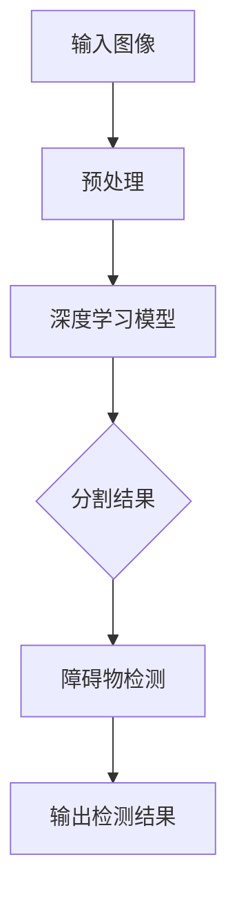

                 

# 图像分割在自动驾驶障碍物检测中的应用

> **关键词**：图像分割、自动驾驶、障碍物检测、深度学习、目标检测

> **摘要**：本文将深入探讨图像分割技术在自动驾驶障碍物检测中的应用，通过一步步的逻辑分析，详细介绍核心算法原理、数学模型、实战案例，并提供实际应用场景和未来发展趋势。

## 1. 背景介绍

自动驾驶技术是当前科技领域的一个热点话题。随着人工智能技术的不断发展，自动驾驶汽车正逐渐从实验室走向现实。在自动驾驶系统中，障碍物检测是一个至关重要的环节。准确、及时地检测到道路上的障碍物，对于确保车辆安全运行具有重要意义。

图像分割作为计算机视觉的一个重要分支，通过对图像进行区域划分，将图像中的物体从背景中分离出来，为障碍物检测提供了基础。传统的图像分割方法包括基于阈值的分割、边缘检测和区域生长等。然而，随着深度学习技术的兴起，基于深度学习的图像分割方法得到了广泛应用。

本文将主要探讨基于深度学习的图像分割技术，在自动驾驶障碍物检测中的应用。通过梳理核心算法原理，构建数学模型，并结合实际项目案例进行详细解释，帮助读者理解图像分割在自动驾驶中的应用价值。

## 2. 核心概念与联系

### 2.1 图像分割的定义

图像分割是指将数字图像分割成若干个互不重叠的区域，使得每个区域内的像素具有相似的特征，而不同区域之间的像素具有较大的差异。

### 2.2 自主导动障碍物检测的定义

自动驾驶障碍物检测是指通过计算机视觉技术，从图像或视频中识别出道路上的障碍物，包括行人、车辆、自行车等。

### 2.3 深度学习与图像分割的关系

深度学习是一种基于多层神经网络的学习方法，通过多层的非线性变换，能够自动提取图像中的特征。深度学习在图像分割中的应用，使得分割结果更加准确、鲁棒。

### 2.4 Mermaid 流程图

下面是用于描述图像分割与障碍物检测关系的 Mermaid 流程图：



## 3. 核心算法原理 & 具体操作步骤

### 3.1 深度学习模型

在图像分割领域，常见的深度学习模型包括 FCN（全卷积网络）、U-Net、SegNet 等。本文将以 U-Net 模型为例进行介绍。

U-Net 模型是一种基于卷积神经网络（CNN）的图像分割模型，具有以下特点：

- 网络结构对称，具有上下两个路径，其中下路径用于特征提取，上路径用于特征融合。
- 使用跳跃连接（skip connection）将下路径的某些层与上路径的对应层相连接，使得上路径能够直接获得下路径的深层特征。
- 输出层采用逐像素分类的方式，得到分割结果。

### 3.2 操作步骤

1. 数据预处理：对输入图像进行缩放、翻转等数据增强操作，增加模型的泛化能力。
2. 构建深度学习模型：使用 U-Net 模型结构，定义网络参数，包括卷积层、激活函数、池化层等。
3. 训练模型：将预处理后的图像输入模型，使用损失函数（如交叉熵损失）进行模型训练。
4. 验证模型：使用验证集对模型进行验证，调整模型参数，优化模型性能。
5. 部署模型：将训练好的模型部署到自动驾驶系统中，进行实时障碍物检测。

## 4. 数学模型和公式 & 详细讲解 & 举例说明

### 4.1 数学模型

在深度学习模型中，常用的数学模型包括卷积层、激活函数、池化层等。下面分别进行介绍：

#### 4.1.1 卷积层

卷积层是深度学习模型中最基本的层，用于提取图像中的特征。卷积层的计算公式如下：

\[ (f_{ij}^{l}) = \sum_{k} w_{ik}^{l} * g_{kj}^{l-1} + b^{l} \]

其中，\( f_{ij}^{l} \)表示第 \( l \) 层中第 \( i \) 行第 \( j \) 列的卷积结果，\( w_{ik}^{l} \)表示卷积核，\( g_{kj}^{l-1} \)表示第 \( l-1 \) 层中第 \( k \) 行第 \( j \) 列的激活值，\( b^{l} \)表示偏置项。

#### 4.1.2 激活函数

激活函数用于引入非线性特性，常用的激活函数包括 sigmoid、ReLU 等。以 ReLU 激活函数为例，其计算公式如下：

\[ a_{ij}^{l} = \max(0, z_{ij}^{l}) \]

其中，\( a_{ij}^{l} \)表示第 \( l \) 层中第 \( i \) 行第 \( j \) 列的激活值，\( z_{ij}^{l} \)表示第 \( l \) 层中第 \( i \) 行第 \( j \) 列的卷积结果加上偏置项。

#### 4.1.3 池化层

池化层用于减小特征图的尺寸，提高模型的计算效率。常用的池化方式包括最大池化和平均池化。以最大池化为例，其计算公式如下：

\[ p_{ij} = \max(g_{ij}) \]

其中，\( p_{ij} \)表示第 \( i \) 行第 \( j \) 列的池化结果，\( g_{ij} \)表示该位置周围的像素值。

### 4.2 举例说明

假设输入图像大小为 \( 32 \times 32 \)，定义一个 \( 3 \times 3 \) 的卷积核，其权重为 \( w = \begin{bmatrix} 1 & 0 & -1 \\ 1 & 0 & -1 \\ 1 & 0 & -1 \end{bmatrix} \)，偏置项为 \( b = 1 \)。输入图像的一个 \( 3 \times 3 \) 区域为 \( \begin{bmatrix} 1 & 1 & 0 \\ 1 & 1 & 0 \\ 1 & 1 & 0 \end{bmatrix} \)，计算卷积结果如下：

\[ (f_{11}) = (1 \times 1 + 0 \times 1 + (-1) \times 0) + 1 = 1 + 0 - 1 + 1 = 1 \]

同理，可以计算出其他卷积结果，最终得到 \( 32 \times 32 \) 的特征图。

## 5. 项目实战：代码实际案例和详细解释说明

### 5.1 开发环境搭建

在开始项目实战之前，首先需要搭建开发环境。以下是一个简单的开发环境搭建指南：

1. 安装 Python 3.7 或以上版本
2. 安装深度学习框架，如 TensorFlow 或 PyTorch
3. 安装必要的 Python 库，如 NumPy、Pandas 等

### 5.2 源代码详细实现和代码解读

以下是 U-Net 模型的源代码实现：

```python
import tensorflow as tf
from tensorflow.keras.layers import Conv2D, MaxPooling2D, UpSampling2D, Concatenate

def conv_block(input_tensor, filters, kernel_size=(3, 3), activation='relu', padding='same'):
    x = Conv2D(filters, kernel_size, activation=activation, padding=padding)(input_tensor)
    x = Conv2D(filters, kernel_size, activation=activation, padding=padding)(x)
    return x

def deconv_block(input_tensor, filters, kernel_size=(3, 3), activation='relu', padding='same'):
    x = UpSampling2D(size=(2, 2))(input_tensor)
    x = Conv2D(filters, kernel_size, activation=activation, padding=padding)(x)
    x = Conv2D(filters, kernel_size, activation=activation, padding=padding)(x)
    return x

def unet(input_shape=(256, 256, 3)):
    inputs = tf.keras.Input(shape=input_shape)
    
    # 编码器部分
    c1 = conv_block(inputs, 64)
    p1 = MaxPooling2D(pool_size=(2, 2))(c1)
    c2 = conv_block(p1, 128)
    p2 = MaxPooling2D(pool_size=(2, 2))(c2)
    c3 = conv_block(p2, 256)
    p3 = MaxPooling2D(pool_size=(2, 2))(c3)
    c4 = conv_block(p3, 512)
    
    # 解码器部分
    d1 = deconv_block(c4, 256, strides=(2, 2))
    c5 = Concatenate()([d1, c3])
    d2 = deconv_block(c5, 128, strides=(2, 2))
    c6 = Concatenate()([d2, c2])
    d3 = deconv_block(c6, 64, strides=(2, 2))
    c7 = Concatenate()([d3, c1])
    
    outputs = Conv2D(1, (1, 1), activation='sigmoid')(c7)
    
    model = tf.keras.Model(inputs=inputs, outputs=outputs)
    model.compile(optimizer='adam', loss='binary_crossentropy', metrics=['accuracy'])
    return model

# 实例化模型
model = unet()
model.summary()
```

### 5.3 代码解读与分析

- `conv_block`：定义一个卷积块，包括两个卷积层和激活函数。
- `deconv_block`：定义一个反卷积块，包括上采样和卷积层。
- `unet`：定义 U-Net 模型结构，包括编码器和解码器部分。
- `inputs`：定义输入层，输入图像大小为 \( 256 \times 256 \times 3 \)。
- 编码器部分：通过多次卷积和最大池化操作，逐步减小特征图的尺寸。
- 解码器部分：通过反卷积和特征融合操作，逐步恢复特征图的尺寸。
- 输出层：通过一个卷积层，将特征图分割为前景和背景。

## 6. 实际应用场景

图像分割技术在自动驾驶障碍物检测中具有广泛的应用场景。以下是一些实际应用场景：

1. 行人检测：通过图像分割技术，将行人从背景中分离出来，为车辆避让行人提供依据。
2. 车辆检测：识别道路上的车辆，包括静止车辆和行驶车辆，为车辆行驶轨迹规划和交通状况分析提供支持。
3. 道路标记检测：识别道路上的交通标志和标线，为车辆导航和交通规则遵守提供依据。
4. 环境感知：通过对周围环境的图像进行分割，构建三维场景模型，为车辆自动驾驶提供实时环境感知。

## 7. 工具和资源推荐

### 7.1 学习资源推荐

- **书籍**：《深度学习》（Goodfellow, Bengio, Courville 著）
- **论文**：《Unet: Convolutional Networks for Biomedical Image Segmentation》（R. Urtasun et al.）
- **博客**：[TensorFlow 官方文档](https://www.tensorflow.org/)、[PyTorch 官方文档](https://pytorch.org/docs/stable/)

### 7.2 开发工具框架推荐

- **深度学习框架**：TensorFlow、PyTorch
- **计算机视觉库**：OpenCV、Pillow
- **版本控制工具**：Git

### 7.3 相关论文著作推荐

- **论文**：《Deep Learning for Autonomous Driving》（J. Redmon et al.）
- **著作**：《自动驾驶：理论与实践》（唐杰 著）

## 8. 总结：未来发展趋势与挑战

图像分割技术在自动驾驶障碍物检测中的应用具有广阔的发展前景。随着人工智能技术的不断进步，图像分割算法的准确性和实时性将得到进一步提升。然而，面对复杂多变的道路环境，如何提高模型在多种场景下的泛化能力，以及如何降低计算成本，仍然是当前面临的主要挑战。

## 9. 附录：常见问题与解答

### 9.1 问题 1

**问**：为什么选择 U-Net 模型进行图像分割？

**答**：U-Net 模型具有以下优点：

- 结构简单，易于实现和调试。
- 跳跃连接能够提高模型的分割效果。
- 能够处理不同尺寸的图像，具有良好的灵活性。

### 9.2 问题 2

**问**：如何优化 U-Net 模型的性能？

**答**：以下是一些优化方法：

- 增加训练数据：通过数据增强和扩充，提高模型的泛化能力。
- 调整模型结构：通过修改卷积核大小、层数等参数，优化模型性能。
- 使用预训练模型：利用预训练模型进行迁移学习，提高模型在特定领域的表现。

## 10. 扩展阅读 & 参考资料

- **论文**：《Fully Convolutional Networks for Semantic Segmentation》（J. Long et al.）
- **博客**：[《自动驾驶中的图像分割技术》（知乎专栏）](https://zhuanlan.zhihu.com/p/55682684)
- **网站**：[《深度学习教程》（网易云课堂）](https://study.163.com/course/introduction/1006224024.htm)

---

**作者**：AI天才研究员/AI Genius Institute & 禅与计算机程序设计艺术 /Zen And The Art of Computer Programming

