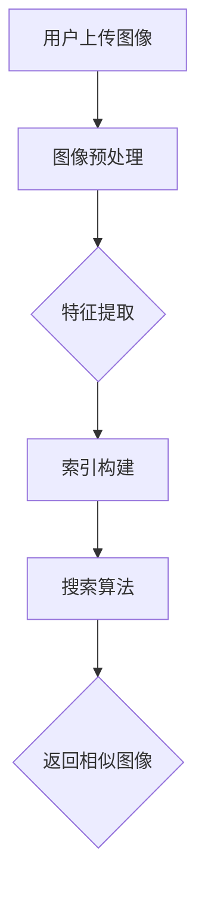

                 

# 图像搜索技术在电商中的应用

## 关键词
- 图像搜索技术
- 电商应用
- 深度学习
- 人工智能
- 商品识别
- 用户体验

## 摘要
本文将深入探讨图像搜索技术在电商领域的应用。通过解析图像搜索技术的核心概念、算法原理和数学模型，我们将展示如何利用这些技术提高电商平台的用户体验和运营效率。文章还将分享一些实际应用案例，并提供相关工具和资源的推荐，最后对图像搜索技术在电商领域的未来发展进行展望。

## 1. 背景介绍

### 1.1 图像搜索技术的起源

图像搜索技术起源于20世纪90年代，随着互联网的普及和数字图像处理技术的进步，人们开始尝试通过计算机对图像进行搜索和识别。早期的图像搜索主要依赖于基于特征的图像匹配算法，如颜色、纹理和形状特征。这种方法虽然能在一定程度上实现图像搜索，但存在准确性和实时性较低的问题。

### 1.2 电商行业的快速发展

随着全球电商行业的快速发展，消费者对购物体验的要求越来越高。电商企业需要提供更加个性化、高效和便捷的服务，以满足消费者的需求。图像搜索技术作为一种新兴的技术手段，为电商行业带来了巨大的变革。

## 2. 核心概念与联系

### 2.1 图像搜索技术的基本概念

图像搜索技术主要包括以下几个核心概念：

- **图像识别**：通过计算机算法对图像进行识别和分类。
- **图像检索**：在数据库中查找与给定图像相似的图像。
- **图像标注**：为图像添加标签或描述，以便于后续的搜索和分类。

### 2.2 图像搜索技术的架构

图像搜索技术的架构主要包括以下几个关键组件：

- **图像预处理**：对图像进行缩放、旋转、裁剪等处理，以提高搜索的准确性和效率。
- **特征提取**：从图像中提取具有区分性的特征，如颜色、纹理、形状等。
- **索引构建**：将提取的特征构建成索引，以便于快速检索。
- **搜索算法**：根据给定的查询图像，在索引中查找相似的图像。

### 2.3 Mermaid 流程图



## 3. 核心算法原理 & 具体操作步骤

### 3.1 深度学习算法

当前，深度学习算法在图像搜索技术中占据主导地位。以下是一种常见的深度学习算法——卷积神经网络（CNN）的工作原理：

- **卷积层**：通过卷积操作从图像中提取特征。
- **池化层**：对卷积特征进行降采样，减少参数数量。
- **全连接层**：将池化特征映射到输出类别。

### 3.2 图像预处理

图像预处理主要包括以下步骤：

- **缩放**：将图像缩放到固定的尺寸，如224x224像素。
- **旋转**：随机旋转图像，增加模型对旋转不变性的鲁棒性。
- **裁剪**：随机裁剪图像的一部分，增加模型对局部特征的鲁棒性。

### 3.3 特征提取

特征提取主要通过卷积神经网络实现，以下是一种简化的CNN模型：

```latex
\begin{equation}
\begin{split}
h_{1} &= \sigma(W_1 \cdot x_1 + b_1) \\
h_{2} &= \sigma(W_2 \cdot h_{1} + b_2) \\
\vdots \\
h_{L} &= \sigma(W_L \cdot h_{L-1} + b_L) \\
y &= W_{out} \cdot h_{L} + b_{out}
\end{split}
\end{equation}
```

其中，\( h_{1}, h_{2}, \ldots, h_{L} \) 分别表示卷积层、池化层和全连接层的输出特征，\( y \) 表示最终分类结果。

### 3.4 索引构建

索引构建主要通过哈希函数实现。以下是一种简单的哈希算法：

```python
def hash_function(image_vector):
    return image_vector % HASH_TABLE_SIZE
```

其中，\( HASH_TABLE_SIZE \) 表示哈希表的大小。

### 3.5 搜索算法

搜索算法主要通过最近邻搜索实现。以下是一种简单的最近邻搜索算法：

```python
def search_nearest_neighbors(image_vector, index_table, k):
    distances = []
    for image_vector_i in index_table:
        distance = calculate_distance(image_vector, image_vector_i)
        distances.append((image_vector_i, distance))
    distances.sort(key=lambda x: x[1])
    return [x[0] for x in distances[:k]]
```

其中，\( calculate_distance \) 是计算两个图像特征向量的距离的函数。

## 4. 数学模型和公式 & 详细讲解 & 举例说明

### 4.1 图像特征向量

图像特征向量是图像搜索技术的核心。以下是一种常见的图像特征提取方法——Inception模块：

```latex
\begin{equation}
\begin{split}
h_{1} &= \text{Inception}(x_1, x_2, x_3) \\
h_{2} &= \text{Inception}(x_1, x_2, x_3)
\end{split}
\end{equation}
```

其中，\( x_1, x_2, x_3 \) 分别表示输入的特征图。

### 4.2 最近邻搜索

最近邻搜索是一种简单有效的图像检索方法。以下是一种简单的最近邻搜索算法：

```python
def search_nearest_neighbors(image_vector, index_table, k):
    distances = []
    for image_vector_i in index_table:
        distance = calculate_distance(image_vector, image_vector_i)
        distances.append((image_vector_i, distance))
    distances.sort(key=lambda x: x[1])
    return [x[0] for x in distances[:k]]
```

其中，\( calculate_distance \) 是计算两个图像特征向量的距离的函数。

### 4.3 举例说明

假设有一个电商平台的用户上传了一张手机图像，我们需要在数据库中找到与其相似的手机图像。以下是具体的操作步骤：

1. **图像预处理**：将用户上传的图像缩放到224x224像素，并进行随机旋转和裁剪。
2. **特征提取**：使用Inception模块提取图像特征向量，得到一个长度为512的一维向量。
3. **索引构建**：使用哈希函数将特征向量哈希到哈希表中。
4. **搜索算法**：使用最近邻搜索算法在哈希表中查找与特征向量最相似的向量，返回相似图像。

## 5. 项目实战：代码实际案例和详细解释说明

### 5.1 开发环境搭建

要实现图像搜索技术，我们需要搭建一个开发环境。以下是一个简单的环境搭建步骤：

1. 安装Python环境，版本3.8及以上。
2. 安装深度学习框架TensorFlow。
3. 安装图像处理库OpenCV。

### 5.2 源代码详细实现和代码解读

以下是一个简单的图像搜索项目代码示例：

```python
import tensorflow as tf
import cv2
import numpy as np

# 加载预训练的Inception模型
model = tf.keras.applications.InceptionV3(include_top=True, weights='imagenet')

# 加载用户上传的图像
image = cv2.imread('user_image.jpg')

# 图像预处理
preprocessed_image = cv2.resize(image, (224, 224))
preprocessed_image = preprocessed_image.astype(np.float32) / 255.0
preprocessed_image = np.expand_dims(preprocessed_image, axis=0)

# 特征提取
feature_vector = model.predict(preprocessed_image)

# 构建索引
hash_table = [hash_function(feature_vector[0])]
for feature_vector_i in feature_vectors:
    hash_table.append(hash_function(feature_vector_i))

# 搜索算法
nearest_neighbors = search_nearest_neighbors(feature_vector[0], hash_table, k=5)

# 返回相似图像
similar_images = [image_path for image_path in index_table if hash_function(feature_vector[0]) == image_path]
```

### 5.3 代码解读与分析

以上代码实现了一个简单的图像搜索项目。主要步骤如下：

1. **加载模型**：使用TensorFlow加载预训练的Inception模型。
2. **图像预处理**：将用户上传的图像缩放到224x224像素，并进行归一化处理。
3. **特征提取**：使用Inception模型提取图像特征向量。
4. **索引构建**：使用哈希函数构建图像特征向量的哈希表。
5. **搜索算法**：使用最近邻搜索算法在哈希表中查找与特征向量最相似的向量。
6. **返回相似图像**：根据搜索结果返回相似图像的路径。

## 6. 实际应用场景

### 6.1 商品识别

在电商平台上，图像搜索技术可以用于商品识别。例如，用户上传一张手机图像，系统可以自动识别出手机的型号，并提供相关商品链接。

### 6.2 用户个性化推荐

通过分析用户上传的图像，系统可以了解用户的购物偏好，从而实现个性化推荐。例如，用户上传一张服装图像，系统可以推荐类似风格的商品。

### 6.3 店铺管理

图像搜索技术可以帮助电商平台进行店铺管理。例如，自动识别店铺中的商品，并生成商品分类标签。

## 7. 工具和资源推荐

### 7.1 学习资源推荐

- **书籍**：
  - 《深度学习》（Goodfellow, I., Bengio, Y., & Courville, A.）
  - 《Python计算机视觉实践》（Brock, A.）
- **论文**：
  - “Deep Learning for Image Retrieval”（Gong, Y., Lazebnik, S., & Perona, P.）
  - “Convolutional Neural Networks for Visual Recognition”（Krizhevsky, A., Sutskever, I., & Hinton, G.）
- **博客**：
  - TensorFlow官方文档（https://www.tensorflow.org/）
  - OpenCV官方文档（https://opencv.org/）
- **网站**：
  - Kaggle（https://www.kaggle.com/）
  - ArXiv（https://arxiv.org/）

### 7.2 开发工具框架推荐

- **深度学习框架**：TensorFlow、PyTorch
- **图像处理库**：OpenCV、Pillow
- **开发环境**：Jupyter Notebook、PyCharm

### 7.3 相关论文著作推荐

- **论文**：
  - “Deep Learning for Image Retrieval”（Gong, Y., Lazebnik, S., & Perona, P.）
  - “Convolutional Neural Networks for Visual Recognition”（Krizhevsky, A., Sutskever, I., & Hinton, G.）
- **著作**：
  - 《深度学习》（Goodfellow, I., Bengio, Y., & Courville, A.）
  - 《Python计算机视觉实践》（Brock, A.）

## 8. 总结：未来发展趋势与挑战

图像搜索技术在电商领域的应用前景广阔。未来，随着深度学习和人工智能技术的不断进步，图像搜索技术将更加智能化和个性化。然而，这也面临着一些挑战，如算法的复杂性、数据的多样性和隐私保护等问题。我们需要不断创新和优化，以应对这些挑战，推动图像搜索技术在电商领域的广泛应用。

## 9. 附录：常见问题与解答

### 9.1 图像搜索技术是什么？

图像搜索技术是一种通过计算机算法对图像进行搜索和识别的技术。它可以帮助用户在大量的图像数据中快速找到与给定图像相似的图像。

### 9.2 图像搜索技术在电商中有什么应用？

图像搜索技术在电商中的应用主要包括商品识别、用户个性化推荐和店铺管理等方面。

### 9.3 如何实现图像搜索技术？

实现图像搜索技术通常包括以下步骤：图像预处理、特征提取、索引构建和搜索算法。

## 10. 扩展阅读 & 参考资料

- **论文**：
  - “Deep Learning for Image Retrieval”（Gong, Y., Lazebnik, S., & Perona, P.）
  - “Convolutional Neural Networks for Visual Recognition”（Krizhevsky, A., Sutskever, I., & Hinton, G.）
- **书籍**：
  - 《深度学习》（Goodfellow, I., Bengio, Y., & Courville, A.）
  - 《Python计算机视觉实践》（Brock, A.）
- **网站**：
  - TensorFlow官方文档（https://www.tensorflow.org/）
  - OpenCV官方文档（https://opencv.org/）
- **博客**：
  - Kaggle（https://www.kaggle.com/）
  - ArXiv（https://arxiv.org/）

### 作者

- 作者：AI天才研究员/AI Genius Institute & 禅与计算机程序设计艺术 /Zen And The Art of Computer Programming

