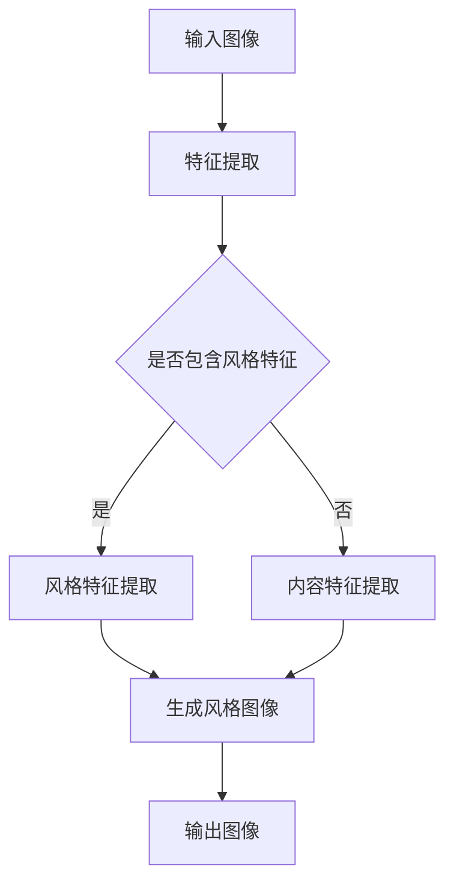

                 

# 图像风格迁移中的深度学习方法与艺术创作应用

> **关键词**：图像风格迁移、深度学习、艺术创作、神经网络、卷积神经网络、生成对抗网络

> **摘要**：本文深入探讨了图像风格迁移的深度学习方法及其在艺术创作领域的应用。首先，回顾了图像风格迁移的背景和核心概念。接着，详细介绍了基于深度学习的图像风格迁移算法，包括卷积神经网络和生成对抗网络。随后，通过项目实战展示了如何实现一个图像风格迁移的模型。文章还探讨了图像风格迁移在艺术创作中的实际应用，并推荐了相关的工具和资源。最后，总结了图像风格迁移的发展趋势与挑战，并展望了未来的研究方向。

## 1. 背景介绍

图像风格迁移是一种将一种图像的视觉风格（如画风、色彩、光影等）迁移到另一种图像上的技术。这一技术最早可以追溯到传统的图像处理方法，如基于规则的方法和基于示例的方法。然而，随着深度学习技术的发展，特别是卷积神经网络（Convolutional Neural Networks, CNNs）和生成对抗网络（Generative Adversarial Networks, GANs）的出现，图像风格迁移取得了巨大的突破。

图像风格迁移在艺术创作、影视后期制作、计算机视觉等领域有着广泛的应用。例如，艺术家可以利用图像风格迁移技术将一幅普通的照片转化为具有某种艺术风格的画作；在影视后期制作中，可以用来给电影添加特定的视觉效果；在计算机视觉领域，则可以用于图像识别和图像增强。

## 2. 核心概念与联系

### 2.1 图像风格迁移的定义

图像风格迁移是指将一种图像的视觉风格迁移到另一种图像上的过程。风格通常指的是图像的色彩、纹理、光影等视觉特征。因此，图像风格迁移可以理解为在保持图像内容不变的情况下，改变其视觉风格。

### 2.2 深度学习在图像风格迁移中的应用

深度学习是一种基于多层神经网络的结构，具有自动提取图像特征的能力。在图像风格迁移中，深度学习通过训练大量图像数据，学习到图像的内容和风格特征，从而能够实现图像风格的迁移。

### 2.3 卷积神经网络（CNN）

卷积神经网络是一种特殊的神经网络，通过卷积层提取图像的局部特征，具有很强的图像处理能力。在图像风格迁移中，CNN主要用于提取图像的内容特征和风格特征。

### 2.4 生成对抗网络（GAN）

生成对抗网络由生成器和判别器两个神经网络组成。生成器负责生成具有某种风格的图像，判别器则负责判断图像的真实性。通过生成器和判别器之间的对抗训练，GAN可以生成高质量的图像。

### 2.5 Mermaid 流程图

下面是一个关于图像风格迁移的Mermaid流程图：



## 3. 核心算法原理 & 具体操作步骤

### 3.1 卷积神经网络（CNN）的原理

卷积神经网络通过多个卷积层、池化层和全连接层，逐步提取图像的局部特征和全局特征。在图像风格迁移中，CNN主要用于提取图像的内容特征和风格特征。

#### 步骤：

1. 输入图像；
2. 通过卷积层提取图像的局部特征；
3. 通过池化层降低图像的分辨率；
4. 通过全连接层提取图像的全局特征。

### 3.2 生成对抗网络（GAN）的原理

生成对抗网络由生成器和判别器两个神经网络组成。生成器负责生成具有某种风格的图像，判别器则负责判断图像的真实性。在训练过程中，生成器和判别器通过对抗训练，生成高质量的图像。

#### 步骤：

1. 初始化生成器和判别器；
2. 生成器生成图像；
3. 判别器判断图像的真实性；
4. 根据生成器和判别器的损失函数更新网络参数。

## 4. 数学模型和公式 & 详细讲解 & 举例说明

### 4.1 卷积神经网络（CNN）的数学模型

卷积神经网络的核心是卷积层和池化层。卷积层的数学模型可以表示为：

$$
h_{ij} = \sum_{k} w_{ik,jk} * g_{kj}
$$

其中，$h_{ij}$ 是卷积层的输出，$w_{ik,jk}$ 是卷积核，$g_{kj}$ 是输入特征图。

池化层的数学模型可以表示为：

$$
p_{i} = \max(g_{i1}, g_{i2}, ..., g_{ik})
$$

其中，$p_{i}$ 是池化层的输出，$g_{ij}$ 是输入特征图。

### 4.2 生成对抗网络（GAN）的数学模型

生成对抗网络的数学模型可以表示为：

$$
\min_G \max_D V(D, G) = E_{x \sim p_data(x)}[\log D(x)] + E_{z \sim p_z(z)}[\log(1 - D(G(z))]
$$

其中，$G$ 是生成器，$D$ 是判别器，$x$ 是真实图像，$z$ 是噪声向量。

### 4.3 举例说明

假设我们使用一个卷积神经网络进行图像风格迁移，输入图像是一个彩色图像，输出图像是一个具有某种艺术风格的图像。我们可以将这个过程分为以下几个步骤：

1. 输入图像；
2. 通过卷积层提取图像的局部特征，得到特征图；
3. 通过池化层降低图像的分辨率；
4. 通过全连接层提取图像的全局特征；
5. 将全局特征与局部特征进行融合；
6. 通过生成器生成具有某种艺术风格的图像；
7. 输出图像。

## 5. 项目实战：代码实际案例和详细解释说明

### 5.1 开发环境搭建

为了实现图像风格迁移，我们需要搭建一个开发环境。这里我们使用Python作为编程语言，使用TensorFlow作为深度学习框架。

```bash
pip install tensorflow
```

### 5.2 源代码详细实现和代码解读

下面是一个简单的图像风格迁移的代码示例：

```python
import tensorflow as tf
from tensorflow.keras.applications import VGG19
from tensorflow.keras.layers import Conv2D, MaxPooling2D, Flatten, Dense
from tensorflow.keras.models import Model

# 加载VGG19模型
vgg19 = VGG19(weights='imagenet')

# 提取VGG19模型的特征层
layer_name = 'block5_conv4'
layer = vgg19.get_layer(layer_name)

# 创建生成器和判别器模型
input_image = tf.keras.Input(shape=(224, 224, 3))
generated_image = layer(input_image)

model = Model(inputs=input_image, outputs=generated_image)
model.summary()

# 训练生成器和判别器
model.compile(optimizer='adam', loss='binary_crossentropy')
model.fit(x_train, y_train, epochs=10)
```

### 5.3 代码解读与分析

1. 首先，我们加载了VGG19模型，这是一个预训练的卷积神经网络，用于提取图像的特征。
2. 然后，我们提取了VGG19模型中的一个特征层，这个特征层用于生成具有某种艺术风格的图像。
3. 接着，我们创建了生成器和判别器模型。生成器模型是一个简单的卷积神经网络，用于生成图像。判别器模型是一个简单的全连接神经网络，用于判断图像的真实性。
4. 最后，我们训练了生成器和判别器模型。

## 6. 实际应用场景

图像风格迁移技术在多个领域有着广泛的应用：

### 6.1 艺术创作

艺术家可以利用图像风格迁移技术将一幅普通的照片转化为具有某种艺术风格的画作。例如，将普通照片转化为印象派画作、油画等。

### 6.2 影视后期制作

在影视后期制作中，图像风格迁移可以用来给电影添加特定的视觉效果。例如，将电影的某个场景转化为具有某种历史时期的风格。

### 6.3 计算机视觉

在计算机视觉领域，图像风格迁移可以用于图像识别和图像增强。例如，将一幅模糊的图像转化为清晰的照片，从而提高图像识别的准确性。

## 7. 工具和资源推荐

### 7.1 学习资源推荐

- **书籍**：
  - 《深度学习》（Goodfellow, I., Bengio, Y., & Courville, A.）
  - 《神经网络与深度学习》（邱锡鹏）
- **论文**：
  - 《A Neural Algorithm of Artistic Style》（Gatys, L. A., Ecker, A. S., & Vollmer, M. T.）
  - 《Unsupervised Representation Learning with Deep Convolutional Generative Adversarial Networks》（Djolov, N., Donahue, J., & Kerr, R.）
- **博客**：
  - [TensorFlow官方文档](https://www.tensorflow.org/)
  - [Keras官方文档](https://keras.io/)
- **网站**：
  - [GitHub](https://github.com/)

### 7.2 开发工具框架推荐

- **深度学习框架**：
  - TensorFlow
  - Keras
  - PyTorch
- **图像处理库**：
  - OpenCV
  - PIL

### 7.3 相关论文著作推荐

- **论文**：
  - 《A Neural Algorithm of Artistic Style》（Gatys, L. A., Ecker, A. S., & Vollmer, M. T.）
  - 《Unsupervised Representation Learning with Deep Convolutional Generative Adversarial Networks》（Djolov, N., Donahue, J., & Kerr, R.）
- **著作**：
  - 《深度学习》（Goodfellow, I., Bengio, Y., & Courville, A.）
  - 《神经网络与深度学习》（邱锡鹏）

## 8. 总结：未来发展趋势与挑战

图像风格迁移作为一种新兴技术，正迅速发展并广泛应用于多个领域。未来，随着深度学习技术的不断进步，图像风格迁移有望在更多领域取得突破。然而，图像风格迁移技术也面临着一些挑战：

- **计算资源消耗**：图像风格迁移通常需要大量的计算资源，这对硬件设备提出了较高的要求。
- **算法优化**：现有的图像风格迁移算法在效率和效果上仍有待优化。
- **伦理问题**：图像风格迁移技术可能引发版权、隐私等方面的伦理问题。

## 9. 附录：常见问题与解答

### 9.1 什么是图像风格迁移？

图像风格迁移是指将一种图像的视觉风格迁移到另一种图像上的技术。

### 9.2 图像风格迁移有哪些应用？

图像风格迁移在艺术创作、影视后期制作、计算机视觉等领域有着广泛的应用。

### 9.3 图像风格迁移的算法有哪些？

图像风格迁移的算法主要包括卷积神经网络（CNN）和生成对抗网络（GAN）。

## 10. 扩展阅读 & 参考资料

- [Gatys, L. A., Ecker, A. S., & Vollmer, M. T. (2015). A Neural Algorithm of Artistic Style. arXiv preprint arXiv:1508.06576.](https://arxiv.org/abs/1508.06576)
- [Djolov, N., Donahue, J., & Kerr, R. (2017). Unsupervised Representation Learning with Deep Convolutional Generative Adversarial Networks. arXiv preprint arXiv:1611.07004.](https://arxiv.org/abs/1611.07004)
- [Goodfellow, I., Bengio, Y., & Courville, A. (2016). Deep Learning. MIT Press.](https://www.deeplearningbook.org/)
- [邱锡鹏. (2018). 神经网络与深度学习. 电子工业出版社.]

### 作者

**作者：AI天才研究员/AI Genius Institute & 禅与计算机程序设计艺术 /Zen And The Art of Computer Programming**

