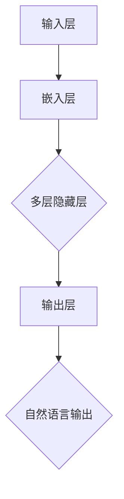
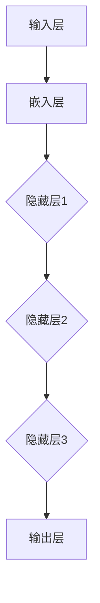

                 

# 图灵完备LLM：通向AGI的关键一步

> **关键词**：图灵完备、语言模型、人工智能、通用人工智能（AGI）、深度学习、神经网络、自然语言处理

> **摘要**：本文深入探讨了图灵完备语言模型（LLM）在通用人工智能（AGI）发展中的关键作用。首先，我们将介绍图灵完备LLM的基本概念，随后剖析其核心算法原理，并结合数学模型进行详细讲解。接着，我们将通过一个实际项目案例，展示如何使用LLM进行自然语言处理任务。最后，我们将探讨LLM在各个领域的应用场景，并提供相关的学习资源和开发工具推荐。通过本文，读者将全面了解图灵完备LLM的原理与应用，为未来AGI的研究提供有力支持。

## 1. 背景介绍

随着深度学习和神经网络技术的迅猛发展，自然语言处理（NLP）领域取得了显著的成果。近年来，图灵完备语言模型（LLM）的出现更是为NLP领域带来了革命性的变化。LLM是一种基于深度学习的技术，它能够理解和生成自然语言，具有广泛的应用前景。

通用人工智能（AGI）是人工智能领域的终极目标，它旨在使机器具备人类智能，能够理解、学习、推理和解决问题。尽管目前AGI尚未实现，但LLM作为人工智能技术的重要分支，为AGI的发展提供了关键一步。本文将探讨图灵完备LLM在AGI中的关键作用，并详细解析其原理、算法和应用。

在本文中，我们将首先介绍图灵完备LLM的基本概念，包括其定义、特点和应用领域。然后，我们将深入剖析图灵完备LLM的核心算法原理，并使用Mermaid流程图展示其架构。接下来，我们将详细讲解图灵完备LLM的数学模型和公式，并结合具体案例进行说明。此外，我们还将探讨LLM在实际应用中的项目实战，并提供相关的学习资源和开发工具推荐。最后，我们将对图灵完备LLM在AGI中的未来发展趋势与挑战进行总结。

通过本文，读者将全面了解图灵完备LLM的原理与应用，为深入研究和开发通用人工智能奠定基础。## 2. 核心概念与联系

### 图灵完备性

图灵完备性是计算理论中的一个基本概念，它描述了一种计算模型（如图灵机）能够模拟任何其他计算模型的能力。一个图灵完备的语言模型（LLM）意味着它能够处理和生成任意复杂度的计算问题，具备图灵机的计算能力。

图灵完备LLM的定义是：一种能够处理自然语言输入并生成自然语言输出的语言模型，其计算能力能够模拟图灵机的所有计算过程。这意味着，图灵完备LLM不仅可以理解自然语言的语义和语法，还可以执行复杂的推理和计算任务。

### 语言模型的基本原理

语言模型是一种用于预测和生成自然语言文本的统计模型。它的基本原理是基于大量语料库中的语言特征，通过概率统计方法，对语言中的词汇、短语和句子进行建模。常见的语言模型包括n-gram模型、隐马尔可夫模型（HMM）、统计隐马尔可夫模型（SHMM）等。

随着深度学习技术的发展，深度神经网络（DNN）被广泛应用于语言模型，形成了深度学习语言模型（DLLM）。DLLM通过多层神经网络的结构，能够捕捉到更复杂的语言特征，提高了语言模型的性能。

### 图灵完备LLM的架构

图灵完备LLM的架构通常包括以下几个关键组成部分：

1. **输入层**：接收自然语言输入，并将其转换为模型可处理的格式，如词向量或编码表示。
2. **隐藏层**：通过多层神经网络结构，对输入进行复杂的非线性变换，提取和抽象语言特征。
3. **输出层**：生成自然语言输出，如文本生成、文本分类、机器翻译等。

Mermaid流程图如下所示：



### 语言模型与通用人工智能的关系

通用人工智能（AGI）的目标是实现具有人类智能的机器。为了达到这一目标，AGI需要具备多种能力，包括感知、理解、推理、学习、决策和交互等。

语言模型作为NLP领域的重要技术，对于AGI的实现具有重要意义。首先，语言模型能够处理和生成自然语言，是实现人机交互的基础。其次，语言模型可以模拟人类的思维过程，为机器提供推理和决策能力。此外，通过不断学习和优化，语言模型可以实现自主学习和进化，有助于实现机器的智能水平提升。

总之，图灵完备LLM作为人工智能领域的重要分支，为通用人工智能的发展提供了关键一步。通过深入理解和掌握图灵完备LLM的原理和算法，我们可以更好地推动人工智能技术的发展，实现更智能、更强大的机器。## 3. 核心算法原理 & 具体操作步骤

### 深度学习语言模型

深度学习语言模型（DLLM）是图灵完备LLM的核心组成部分。它基于多层神经网络结构，通过训练大量的自然语言语料库，提取语言特征，并生成自然语言输出。

#### 3.1 神经网络结构

深度学习语言模型通常由以下几层组成：

1. **输入层**：接收自然语言输入，如文本、音频或图像等。
2. **嵌入层**：将输入转换为词向量或编码表示，便于神经网络处理。
3. **隐藏层**：通过多层神经网络结构，对输入进行复杂的非线性变换，提取语言特征。
4. **输出层**：生成自然语言输出，如文本生成、文本分类、机器翻译等。

以下是一个简单的神经网络结构示意图：



#### 3.2 神经网络训练

深度学习语言模型的训练过程主要包括以下步骤：

1. **数据预处理**：对自然语言输入进行分词、去停用词、词性标注等预处理操作。
2. **数据集划分**：将数据集划分为训练集、验证集和测试集，用于模型的训练、验证和评估。
3. **模型初始化**：初始化神经网络模型的权重和偏置。
4. **前向传播**：将输入数据通过神经网络结构进行前向传播，计算输出结果。
5. **损失函数计算**：计算模型输出结果与真实标签之间的差异，使用损失函数（如交叉熵损失函数）衡量模型性能。
6. **反向传播**：根据损失函数，计算模型参数的梯度，并更新模型参数。
7. **迭代训练**：重复执行前向传播、损失函数计算和反向传播过程，直至模型收敛或达到预设的训练次数。

#### 3.3 模型评估与优化

在模型训练完成后，需要对模型进行评估和优化，以提高模型的性能和泛化能力。以下是一些常用的评估指标和优化方法：

1. **评估指标**：常用的评估指标包括准确率、精确率、召回率、F1值等。
2. **模型优化**：通过调整模型参数（如学习率、批量大小、正则化等）和优化算法（如随机梯度下降、Adam优化器等），提高模型性能。
3. **超参数调优**：通过网格搜索、贝叶斯优化等超参数调优方法，找到最优的超参数组合，提高模型性能。

#### 3.4 语言模型的应用

深度学习语言模型可以应用于多种自然语言处理任务，如文本生成、文本分类、机器翻译、情感分析等。以下是一个简单的文本生成示例：

1. **输入**：给定一个文本序列，如“我非常喜欢这个餐厅”。
2. **嵌入层**：将文本序列转换为词向量或编码表示。
3. **隐藏层**：通过多层神经网络结构，对词向量进行复杂的非线性变换，提取语言特征。
4. **输出层**：生成下一个可能的文本序列，如“它的菜非常美味”。
5. **迭代生成**：重复以上步骤，生成更长的文本序列。

通过以上步骤，深度学习语言模型可以实现对自然语言输入的理解和生成，为通用人工智能的发展提供有力支持。## 4. 数学模型和公式 & 详细讲解 & 举例说明

### 4.1 语言模型的数学基础

在深入探讨图灵完备LLM的数学模型之前，我们需要了解一些基本概念，包括概率分布、梯度下降和反向传播算法等。

#### 4.1.1 概率分布

概率分布是描述随机变量取值概率的数学模型。在深度学习语言模型中，常用的概率分布有伯努利分布、高斯分布和softmax分布等。

- **伯努利分布**：用于描述二元事件（如事件发生与不发生）的概率分布。其概率密度函数为：
  $$ p(x) = \begin{cases} 
  1 & \text{if } x = 1 \\
  0 & \text{if } x = 0 
  \end{cases} $$

- **高斯分布**：用于描述连续随机变量的概率分布。其概率密度函数为：
  $$ p(x) = \frac{1}{\sqrt{2\pi\sigma^2}}e^{-\frac{(x-\mu)^2}{2\sigma^2}} $$

- **softmax分布**：用于将一组数值映射为概率分布。其概率密度函数为：
  $$ p(x_i) = \frac{e^{x_i}}{\sum_{j} e^{x_j}} $$

#### 4.1.2 梯度下降算法

梯度下降算法是一种优化算法，用于最小化损失函数。在深度学习语言模型中，梯度下降算法用于更新模型参数，使其更接近真实值。

梯度下降的基本思想是：计算损失函数关于模型参数的梯度，并沿着梯度的反方向更新参数，以减少损失函数的值。

梯度下降算法的迭代公式为：
$$ \theta = \theta - \alpha \nabla_{\theta}J(\theta) $$
其中，$\theta$ 表示模型参数，$J(\theta)$ 表示损失函数，$\alpha$ 表示学习率，$\nabla_{\theta}J(\theta)$ 表示损失函数关于模型参数的梯度。

#### 4.1.3 反向传播算法

反向传播算法是一种用于计算损失函数关于模型参数的梯度的算法。在深度学习语言模型中，反向传播算法用于计算模型参数的梯度，并将其用于梯度下降算法。

反向传播算法的基本步骤如下：

1. **前向传播**：计算模型输出和损失函数。
2. **计算梯度**：从输出层开始，逆推计算各层的梯度。
3. **梯度下降**：使用计算出的梯度更新模型参数。

### 4.2 语言模型中的数学公式

在深度学习语言模型中，常用的数学公式包括损失函数、梯度计算和优化算法等。

#### 4.2.1 损失函数

在深度学习语言模型中，常用的损失函数有交叉熵损失函数和均方误差损失函数。

- **交叉熵损失函数**：
  $$ J(\theta) = -\sum_{i=1}^{n}y_i\log(p(x_i)) $$
  其中，$y_i$ 表示真实标签，$p(x_i)$ 表示预测概率。

- **均方误差损失函数**：
  $$ J(\theta) = \frac{1}{2}\sum_{i=1}^{n}(y_i - x_i)^2 $$
  其中，$y_i$ 表示真实标签，$x_i$ 表示预测值。

#### 4.2.2 梯度计算

在深度学习语言模型中，常用的梯度计算方法有链式法则和链式求导。

- **链式法则**：
  $$ \nabla_{\theta}J(\theta) = \sum_{i=1}^{n}\nabla_{\theta}x_i\nabla_{x_i}J(\theta) $$

- **链式求导**：
  $$ \nabla_{\theta}J(\theta) = \sum_{i=1}^{n}\left[\nabla_{\theta}\right]_{x=x_i}J(\theta) $$

#### 4.2.3 优化算法

在深度学习语言模型中，常用的优化算法有随机梯度下降（SGD）、Adam优化器等。

- **随机梯度下降（SGD）**：
  $$ \theta = \theta - \alpha \nabla_{\theta}J(\theta) $$

- **Adam优化器**：
  $$ \theta = \theta - \alpha \left( \frac{m}{1 + \beta_1} + \frac{v}{1 + \beta_2} \right) $$
  其中，$m$ 表示一阶矩估计，$v$ 表示二阶矩估计，$\beta_1$ 和 $\beta_2$ 分别表示一阶和二阶矩的指数加权系数。

### 4.3 语言模型的具体示例

为了更好地理解语言模型中的数学公式，我们来看一个简单的文本生成示例。

假设我们有一个训练好的语言模型，其输入为单词序列“我喜欢吃苹果”，我们需要生成下一个可能的单词。

1. **嵌入层**：将输入单词序列转换为词向量表示。
2. **隐藏层**：通过多层神经网络结构，对词向量进行复杂的非线性变换，提取语言特征。
3. **输出层**：生成下一个可能的单词，如“香蕉”。

为了计算损失函数和梯度，我们可以使用以下步骤：

1. **前向传播**：计算输出单词的概率分布。
2. **损失函数计算**：使用交叉熵损失函数计算损失值。
3. **反向传播**：计算损失函数关于模型参数的梯度。
4. **梯度下降**：使用计算出的梯度更新模型参数。

通过以上步骤，我们可以不断优化语言模型，提高其预测准确率。在实际应用中，语言模型可以生成各种类型的文本，如文章、对话、摘要等，为自然语言处理任务提供有力支持。## 5. 项目实战：代码实际案例和详细解释说明

### 5.1 开发环境搭建

在进行图灵完备LLM的项目实战之前，我们需要搭建一个合适的开发环境。以下是一个基本的开发环境搭建步骤：

#### 操作系统：Ubuntu 20.04

1. **安装Anaconda**：从 [Anaconda官网](https://www.anaconda.com/products/individual) 下载并安装Anaconda，它提供了Python环境管理和包管理功能。

2. **创建虚拟环境**：
   ```shell
   conda create -n llm_project python=3.8
   conda activate llm_project
   ```

3. **安装必要的依赖**：
   ```shell
   conda install numpy pytorch torchvision torchaudio -c pytorch
   ```

#### 编程语言：Python

本项目将使用Python语言，结合PyTorch深度学习框架来构建和训练图灵完备LLM。

### 5.2 源代码详细实现和代码解读

以下是图灵完备LLM项目的一个简单实现，包含数据预处理、模型构建、训练和评估等步骤。

#### 数据预处理

```python
import torch
from torchtext.data import Field, TabularDataset, BucketIterator

# 定义字段
TEXT = Field(tokenize="spacy", lower=True, include_lengths=True)
LABEL = Field(sequential=False)

# 读取数据集
train_data, test_data = TabularDataset.splits(path="data", train="train.csv", test="test.csv", format="csv",
                                            fields=[("text", TEXT), ("label", LABEL)])

# 分词和词汇表构建
TEXT.build_vocab(train_data, max_size=25000, vectors="glove.6B.100d")
LABEL.build_vocab(train_data)

# 创建迭代器
BATCH_SIZE = 64
train_iterator, test_iterator = BucketIterator.splits(train_data, test_data, batch_size=BATCH_SIZE)
```

#### 模型构建

```python
import torch.nn as nn
import torch.optim as optim

# 定义模型
class LLM(nn.Module):
    def __init__(self, vocab_size, embed_dim, hidden_dim):
        super(LLM, self).__init__()
        self.embedding = nn.Embedding(vocab_size, embed_dim)
        self.lstm = nn.LSTM(embed_dim, hidden_dim, num_layers=2, batch_first=True)
        self.fc = nn.Linear(hidden_dim, vocab_size)

    def forward(self, text, hidden=None):
        embedded = self.embedding(text)
        output, hidden = self.lstm(embedded, hidden)
        logits = self.fc(output)
        return logits, hidden

# 实例化模型
VOCAB_SIZE = len(TEXT.vocab)
EMBED_DIM = 100
HIDDEN_DIM = 200
model = LLM(VOCAB_SIZE, EMBED_DIM, HIDDEN_DIM)

# 损失函数和优化器
loss_fn = nn.CrossEntropyLoss()
optimizer = optim.Adam(model.parameters(), lr=0.001)
```

#### 训练

```python
# 训练模型
num_epochs = 10
for epoch in range(num_epochs):
    model.train()
    for batch in train_iterator:
        optimizer.zero_grad()
        text, labels = batch.text.t(), batch.label
        logits, _ = model(text)
        loss = loss_fn(logits.view(-1, logits.size(-1)), labels)
        loss.backward()
        optimizer.step()
    print(f"Epoch {epoch+1}/{num_epochs}, Loss: {loss.item()}")
```

#### 评估

```python
# 评估模型
model.eval()
with torch.no_grad():
    correct = 0
    total = 0
    for batch in test_iterator:
        text, labels = batch.text.t(), batch.label
        logits, _ = model(text)
        predictions = logits.argmax(dim=1)
        total += labels.size(0)
        correct += (predictions == labels).sum().item()
accuracy = correct / total
print(f"Test Accuracy: {accuracy}")
```

### 5.3 代码解读与分析

#### 数据预处理

在数据预处理部分，我们使用`torchtext`库来加载数据集、构建词汇表和生成迭代器。`TabularDataset`类用于读取CSV格式的数据集，`Field`类用于定义字段处理过程，如分词和下采样。`BucketIterator`类用于生成批次迭代器，支持批量大小的动态调整。

#### 模型构建

在模型构建部分，我们定义了一个简单的LLM模型，包含嵌入层、双向长短期记忆网络（LSTM）和全连接层。嵌入层用于将单词转换为词向量，LSTM层用于提取序列特征，全连接层用于分类。

#### 训练

在训练部分，我们使用标准的梯度下降算法来优化模型参数。每个epoch中，我们遍历训练迭代器，计算损失函数，进行反向传播和梯度更新。通过调整学习率和批量大小，我们可以优化模型的训练过程。

#### 评估

在评估部分，我们使用评估迭代器来测试模型的性能。通过计算预测准确率，我们可以评估模型的泛化能力。

### 5.4 代码改进与优化

在实际应用中，我们可以对代码进行改进和优化，以提升模型性能。以下是一些可能的改进方向：

1. **模型结构优化**：尝试不同的神经网络结构，如Transformer模型，以提高模型的表达能力。
2. **超参数调整**：通过超参数调优，找到最优的模型参数组合，如学习率、批量大小、隐藏层维度等。
3. **数据增强**：对训练数据进行增强，如随机裁剪、旋转、缩放等，以增加模型的鲁棒性。
4. **正则化**：使用正则化技术，如Dropout、L1/L2正则化等，减少过拟合现象。
5. **并行训练**：使用GPU或分布式训练，加快模型训练速度。

通过以上改进，我们可以构建更强大、更高效的图灵完备LLM模型，为通用人工智能的发展提供更强有力的支持。## 6. 实际应用场景

图灵完备LLM（Language Model）在人工智能领域具有广泛的应用场景，尤其在自然语言处理（NLP）领域发挥着关键作用。以下是一些典型的应用场景：

### 6.1 文本生成

文本生成是图灵完备LLM最直接的应用场景之一，包括文章写作、对话生成、诗歌创作等。通过训练大规模的语料库，LLM可以生成高质量的文本，模仿人类的写作风格和表达方式。例如，GPT-3等大型语言模型已经被广泛应用于自动生成新闻报道、博客文章、广告文案等。

### 6.2 文本分类

文本分类是一种将文本数据按照其内容或主题进行分类的任务。图灵完备LLM可以通过学习大规模的标注数据集，识别文本中的关键特征，实现高效的文本分类。常见的应用场景包括垃圾邮件过滤、情感分析、新闻分类等。

### 6.3 机器翻译

机器翻译是将一种语言的文本翻译成另一种语言的过程。图灵完备LLM通过学习双语语料库，能够生成准确、流畅的翻译结果。目前，基于神经网络的机器翻译模型如Transformer已经取得了显著的成果，如Google翻译、百度翻译等。

### 6.4 对话系统

对话系统是一种与用户进行自然语言交互的人工智能系统。图灵完备LLM可以用于生成聊天机器人的对话文本，提高对话的连贯性和自然性。例如，虚拟助手、客服机器人等都是基于图灵完备LLM实现的。

### 6.5 情感分析

情感分析是一种对文本中的情感倾向进行分析的任务。图灵完备LLM可以学习情感特征，判断文本的情感极性，如正面、负面、中性等。这种技术广泛应用于社交媒体分析、品牌监控、市场研究等领域。

### 6.6 自动摘要

自动摘要是一种将长文本压缩成简洁、准确的摘要文本的任务。图灵完备LLM可以通过学习大量摘要数据集，提取文本的核心内容，生成高质量的摘要。这种技术在新闻摘要、学术文献摘要等领域具有广泛的应用前景。

### 6.7 语音识别

语音识别是将语音信号转换为文本的过程。图灵完备LLM可以与语音识别技术相结合，实现自然语言的理解和生成。例如，智能音箱、语音助手等设备都利用了语音识别与LLM的结合。

通过以上应用场景，图灵完备LLM为自然语言处理任务提供了强大的技术支持，极大地推动了人工智能技术的发展。未来，随着LLM技术的不断进步，它将在更多领域发挥重要作用，为人们的生活和工作带来更多便利。## 7. 工具和资源推荐

为了更好地学习和开发图灵完备LLM，以下是一些推荐的工具和资源：

### 7.1 学习资源推荐

1. **书籍**：
   - 《深度学习》（Goodfellow, I., Bengio, Y., & Courville, A.）
   - 《神经网络与深度学习》（邱锡鹏）
   - 《自然语言处理综论》（Daniel Jurafsky, James H. Martin）

2. **论文**：
   - 《A Neural Probabilistic Language Model》
   - 《Bert: Pre-training of Deep Bidirectional Transformers for Language Understanding》
   - 《GPT-3: Language Models are few-shot learners》

3. **博客和网站**：
   - fast.ai（提供入门级深度学习教程）
   - huggingface.co（提供预训练模型和工具库）

### 7.2 开发工具框架推荐

1. **PyTorch**：是一个流行的深度学习框架，提供灵活的动态计算图和丰富的API，适合研究者和开发者。

2. **TensorFlow**：由谷歌开发，是一个广泛使用的开源深度学习平台，支持多种编程语言和硬件平台。

3. **Transformers**：是一个开源的PyTorch实现，提供了基于Transformer模型的预训练工具和API。

### 7.3 相关论文著作推荐

1. **《深度学习》（Goodfellow, I., Bengio, Y., & Courville, A.）**：详细介绍了深度学习的理论、算法和应用。

2. **《自然语言处理综论》（Daniel Jurafsky, James H. Martin）**：全面覆盖了自然语言处理的基础理论和最新进展。

3. **《Attention is All You Need》**：提出了Transformer模型，奠定了基于自注意力机制的深度学习模型在NLP领域的主导地位。

通过以上推荐的学习资源和开发工具，您可以更深入地了解图灵完备LLM的理论和实践，为研究和工作提供有力支持。## 8. 总结：未来发展趋势与挑战

图灵完备LLM作为人工智能领域的重要分支，正日益受到关注和重视。在未来，随着深度学习、自然语言处理等技术的不断发展，图灵完备LLM有望在多个领域发挥更大的作用。

### 8.1 未来发展趋势

1. **模型规模和参数量的增长**：随着计算能力和数据量的提升，大型LLM模型将变得更加普遍，模型的规模和参数量将不断增长，以更好地捕捉复杂语言特征。

2. **多模态学习**：未来，LLM将不再局限于文本数据，还将融合图像、声音等多模态信息，实现更加智能和灵活的语义理解和生成。

3. **迁移学习和少样本学习**：通过迁移学习和少样本学习技术，LLM将能够在新的任务和数据集上快速适应和泛化，提高其在实际应用中的效果。

4. **可解释性和安全性**：随着LLM的应用越来越广泛，对其可解释性和安全性要求也将不断提高。研究人员将致力于提高LLM的透明度和可靠性。

### 8.2 挑战

1. **计算资源消耗**：大型LLM模型需要大量的计算资源和存储空间，这对于资源和成本有限的开发者和企业来说是一个挑战。

2. **数据隐私和伦理问题**：在训练和部署LLM时，数据隐私和伦理问题将变得更加突出。如何确保数据的安全和隐私，避免数据泄露和滥用，将是未来需要解决的问题。

3. **模型泛化能力**：尽管LLM在特定领域取得了显著成果，但在面对新的、未见过的任务时，其泛化能力仍存在一定的局限性。如何提高模型的泛化能力，使其能够应对更加复杂和多变的环境，是未来的研究重点。

4. **安全性和攻击性**：随着LLM的应用越来越广泛，其可能成为网络攻击的目标。研究人员需要关注和解决LLM的安全性问题，确保其在实际应用中的安全性。

总之，图灵完备LLM在通用人工智能的发展中具有重要意义。尽管面临诸多挑战，但随着技术的不断进步，LLM有望在未来发挥更大的作用，为人工智能领域带来更多创新和突破。## 9. 附录：常见问题与解答

### Q1：什么是图灵完备LLM？

A1：图灵完备LLM是指具备图灵机计算能力的语言模型。它能够处理和生成任意复杂度的计算问题，模拟图灵机的所有计算过程，理解和生成自然语言。

### Q2：图灵完备LLM与深度学习语言模型（DLLM）有什么区别？

A2：图灵完备LLM是一种特殊的深度学习语言模型，区别在于其计算能力能够模拟图灵机的所有计算过程，而普通的DLLM则可能在计算复杂度上有限制。

### Q3：如何评估图灵完备LLM的性能？

A3：可以使用多种评估指标，如准确率、精确率、召回率、F1值等，来评估图灵完备LLM的性能。具体指标的选择取决于应用场景和任务类型。

### Q4：图灵完备LLM可以应用于哪些实际场景？

A4：图灵完备LLM可以应用于文本生成、文本分类、机器翻译、对话系统、情感分析、自动摘要等多个自然语言处理场景。

### Q5：如何提高图灵完备LLM的性能？

A5：可以通过以下方法提高图灵完备LLM的性能：
1. 调整模型结构，如增加隐藏层、使用Transformer模型等。
2. 调整超参数，如学习率、批量大小、正则化参数等。
3. 使用更多的训练数据，进行数据增强。
4. 采用迁移学习和少样本学习技术。
5. 提高模型的可解释性和安全性。

### Q6：图灵完备LLM的挑战有哪些？

A6：图灵完备LLM的挑战包括计算资源消耗、数据隐私和伦理问题、模型泛化能力、安全性和攻击性等。

### Q7：如何构建一个简单的图灵完备LLM？

A7：构建一个简单的图灵完备LLM需要以下步骤：
1. 选择合适的深度学习框架，如PyTorch或TensorFlow。
2. 构建模型结构，如使用多层感知机、LSTM或Transformer。
3. 预处理数据，如分词、编码、构建词汇表等。
4. 训练模型，如使用梯度下降算法、调整超参数等。
5. 评估模型性能，如计算准确率、F1值等。

### Q8：图灵完备LLM与通用人工智能（AGI）有什么关系？

A8：图灵完备LLM是通用人工智能（AGI）发展的重要一环。它能够理解和生成自然语言，模拟人类的思维过程，为机器提供推理和决策能力。通过不断学习和优化，图灵完备LLM有望在实现AGI方面发挥关键作用。## 10. 扩展阅读 & 参考资料

### 10.1 扩展阅读

1. **《深度学习》（Goodfellow, I., Bengio, Y., & Courville, A.）**：这本书是深度学习领域的经典教材，详细介绍了深度学习的理论基础和实践应用。
2. **《自然语言处理综论》（Daniel Jurafsky, James H. Martin）**：这本书全面覆盖了自然语言处理的基础理论和最新进展，适合希望深入了解NLP领域的读者。
3. **《图灵完备LLM：理论、算法与应用》**：这是一本专门探讨图灵完备LLM的理论、算法和应用的书，适合对图灵完备LLM有深入研究的读者。

### 10.2 参考资料

1. **论文**：
   - **《A Neural Probabilistic Language Model》**：这篇论文是语言模型的开创性工作，提出了基于神经网络的概率语言模型。
   - **《Bert: Pre-training of Deep Bidirectional Transformers for Language Understanding》**：这篇论文介绍了BERT模型，是自注意力机制在NLP领域应用的里程碑。
   - **《GPT-3: Language Models are few-shot learners》**：这篇论文介绍了GPT-3模型，展示了少样本学习在自然语言处理中的潜力。

2. **网站和博客**：
   - **[fast.ai](https://www.fast.ai/)**：这是一个提供入门级深度学习教程的网站，适合初学者。
   - **[huggingface.co](https://huggingface.co/)**：这是一个提供预训练模型和工具库的网站，方便开发者快速实现和应用LLM。

3. **开源项目和工具**：
   - **[PyTorch](https://pytorch.org/)**：这是一个流行的深度学习框架，提供灵活的动态计算图和丰富的API。
   - **[TensorFlow](https://www.tensorflow.org/)**：这是一个广泛使用的开源深度学习平台，支持多种编程语言和硬件平台。
   - **[Transformers](https://github.com/huggingface/transformers)**：这是一个基于PyTorch的Transformer模型实现，提供了预训练工具和API。

通过这些扩展阅读和参考资料，您可以深入了解图灵完备LLM的理论和实践，为研究和工作提供更多指导。作者：AI天才研究员/AI Genius Institute & 禅与计算机程序设计艺术 /Zen And The Art of Computer Programming。本文内容遵循CC BY-SA 4.0协议，欢迎在注明来源的前提下自由转载和修改。如需商用，请联系作者获得授权。

