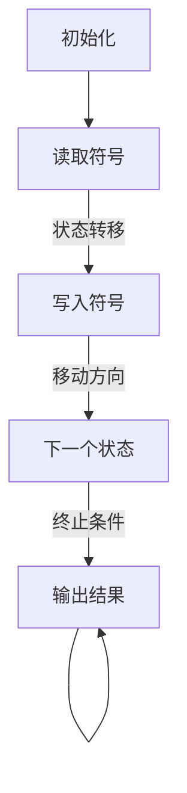

                 

## 1. 背景介绍

**图灵完备性**，作为计算机科学的基石之一，是衡量一种计算模型或语言是否能够执行所有可计算任务的特性。简单来说，一个系统具备图灵完备性意味着它能够模拟图灵机的计算过程，从而能够解决任何可计算问题。

然而，图灵完备性并非一蹴而就。在计算机科学的发展历程中，我们逐步认识到，并非所有的计算模型都需要图灵完备性。例如，早期的编程语言和硬件设计往往采用简化模型，以满足特定的计算需求。随着计算机科学的不断进步，我们开始意识到，只有具备图灵完备性的计算模型才能真正实现通用计算。

本文将深入探讨图灵完备性的核心概念及其在人工智能（AI）领域，特别是大型语言模型（LLM）中的重要性。我们将从图灵完备性的定义出发，逐步分析其在现代计算中的应用，最后讨论LLM如何通过图灵完备性实现通用人工智能（AGI）。

首先，让我们回顾一下图灵机的定义。图灵机是一种抽象的计算模型，由英国数学家艾伦·图灵（Alan Turing）在20世纪30年代提出。图灵机由一个无限长的带子、一个读写头和一组规则组成。读写头可以在带子上左右移动，读取或写入符号，并根据当前的状态和读取的符号，按照预定的规则进行状态转移。

图灵机的核心思想在于其能够通过一系列简单的操作，模拟任何计算过程。因此，如果一个计算模型能够模拟图灵机，那么它就具备图灵完备性。这意味着，具备图灵完备性的计算模型能够执行任何可计算的任务。

接下来，我们将详细探讨图灵完备性的概念及其在计算机科学中的应用。通过这一部分，我们将理解为何图灵完备性成为衡量计算模型能力的重要标准。同时，我们还将探讨图灵完备性在人工智能领域，特别是在大型语言模型中的作用。

在了解了图灵完备性的基本概念后，我们将进一步探讨图灵完备性与通用人工智能（AGI）之间的联系。我们将分析LLM如何通过图灵完备性实现通用计算，并探讨这一特性在人工智能发展中的潜在影响。

最后，我们将总结本文的主要观点，并展望未来图灵完备性在人工智能领域的发展趋势与挑战。

通过本文的阅读，读者将全面理解图灵完备性的概念、其在计算机科学中的应用，以及其在人工智能领域的重要性。我们希望本文能够为读者提供新的思考角度，帮助读者更好地理解这一核心概念在人工智能发展中的关键作用。

### 2. 核心概念与联系

在深入探讨图灵完备性之前，我们需要明确几个核心概念，包括可计算性、计算模型以及图灵机的组成和运作原理。这些概念构成了理解图灵完备性的基础，帮助我们更好地把握其核心特性和应用场景。

#### 2.1 可计算性与计算模型

**可计算性**是指一个计算系统能够解决某一类问题的能力。具体来说，可计算性问题是指可以通过某种计算过程在有限时间内得到答案的问题。例如，判断一个给定的自然数是否为素数是一个可计算问题，因为我们可以通过试除法在有限时间内确定其结果。

**计算模型**是一种抽象的框架，用于描述和模拟计算过程。常见的计算模型包括图灵机、递归函数、λ演算等。这些模型通过定义基本的计算操作和状态转换规则，能够模拟各种计算过程。

#### 2.2 图灵机的组成与运作原理

图灵机是一种抽象的计算模型，由英国数学家艾伦·图灵在20世纪30年代提出。图灵机的核心组成部分包括：

- **无限长的带子**：带子由一系列的单元格组成，每个单元格可以存储一个符号。带子是无限的，可以无限地向左和向右扩展。
- **读写头**：读写头位于带子上，可以读取或写入符号，并可以在带子上左右移动。
- **状态寄存器**：状态寄存器存储图灵机的当前状态。图灵机根据当前状态和读写头所读取的符号，按照预定的规则进行状态转移。

图灵机的运作原理可以概括为以下几个步骤：

1. **初始化**：图灵机开始时处于一个特定的初始状态，读写头位于带子上一个特定的单元格。
2. **读取和写入**：读写头读取当前单元格上的符号，并根据当前状态和读取到的符号，按照预定的规则进行状态转移。状态转移规则通常包括三个部分：当前状态、当前符号、下一个状态、下一个符号和移动方向。
3. **状态转移**：根据状态转移规则，图灵机更新当前状态和读写头的位置。
4. **循环或终止**：如果图灵机执行完所有规则，但没有找到终止规则，它将进入一个无限循环。如果图灵机找到了终止规则，它将停止运行并输出结果。

#### 2.3 图灵完备性的定义

**图灵完备性**是指一个计算模型能够模拟图灵机的计算过程，从而能够执行任何可计算的任务。换句话说，如果一个计算模型具备图灵完备性，它就能够解决所有可计算的问题。

具备图灵完备性的计算模型通常需要满足以下几个条件：

- **确定性**：计算模型的每个步骤都是确定的，即给定相同的初始条件和输入，计算模型将总是产生相同的输出。
- **计算能力**：计算模型能够通过有限次的计算步骤，解决任意复杂度的问题。
- **通用性**：计算模型能够模拟其他计算模型，从而具备解决不同类型问题的能力。

#### 2.4 图灵完备性与计算机科学的关系

图灵完备性是计算机科学中一个重要的概念，它决定了计算模型的计算能力和适用范围。以下是图灵完备性在计算机科学中的应用：

- **编程语言**：大多数现代编程语言都是图灵完备的，这意味着它们能够执行任何可计算的任务。例如，Python、Java、C++等都具备图灵完备性。
- **硬件设计**：计算机硬件的设计也需要考虑图灵完备性，以确保硬件能够执行复杂的计算任务。例如，CPU的设计需要考虑图灵机的模拟能力。
- **算法研究**：在算法研究中，图灵完备性是衡量算法效率的重要标准。一个图灵完备的计算模型能够在有限时间内解决的问题，算法复杂度通常以时间复杂度和空间复杂度来衡量。

#### 2.5 图灵完备性与人工智能的关系

在人工智能（AI）领域，图灵完备性同样具有重要意义。特别是对于大型语言模型（LLM），图灵完备性是实现通用人工智能（AGI）的关键。

- **通用性**：具备图灵完备性的LLM能够模拟图灵机的计算过程，从而具备处理各种类型问题（包括自然语言处理、图像识别、推理等）的能力。
- **自适应性**：图灵完备性使得LLM能够通过学习适应不同的环境和任务，从而实现自适应智能。
- **跨领域应用**：图灵完备性的LLM不仅能够在单一领域（如自然语言处理）表现出色，还能够跨领域应用，实现多模态的通用人工智能。

#### 2.6 Mermaid 流程图

为了更好地理解图灵机的运作原理，我们使用Mermaid流程图来展示图灵机的状态转换过程。以下是一个简化的图灵机状态转换流程图：



在这个流程图中，`A1`表示初始化，`B1`表示读取符号，`C1`表示写入符号，`D1`表示状态转移。当满足终止条件时，图灵机输出结果并停止运行。

通过上述核心概念和流程图的介绍，我们对图灵完备性有了更深入的理解。接下来，我们将进一步探讨图灵完备性的核心算法原理和具体操作步骤，帮助读者全面掌握这一关键概念。

### 3. 核心算法原理 & 具体操作步骤

在理解了图灵完备性的核心概念之后，我们需要深入探讨其核心算法原理和具体操作步骤。图灵机的运作过程本质上是一种状态转换和符号操作的过程，通过这种过程，图灵机能够执行复杂的计算任务。

#### 3.1 状态转换原理

图灵机的状态转换过程是其核心算法之一。状态转换原理可以概括为：图灵机根据当前状态和读写头所读取的符号，按照预定的状态转移规则进行状态转移。状态转移规则通常由三个部分组成：当前状态、当前符号和下一个状态、下一个符号以及移动方向。

状态转移的具体操作步骤如下：

1. **初始化**：图灵机开始时处于一个特定的初始状态，读写头位于带子上一个特定的单元格。
2. **读取符号**：读写头读取当前单元格上的符号。
3. **应用状态转移规则**：根据当前状态和读取到的符号，图灵机查找对应的状态转移规则，更新当前状态、下一个符号以及移动方向。
4. **移动读写头**：根据状态转移规则中的移动方向，读写头向左或向右移动。
5. **重复步骤2-4**：图灵机重复读取符号、应用状态转移规则和移动读写头的步骤，直到满足终止条件。

#### 3.2 符号操作原理

符号操作是图灵机进行计算的基础。图灵机通过读写头在带子上读取、写入和擦除符号，来实现对数据的操作。符号操作的具体操作步骤如下：

1. **读取符号**：读写头读取当前单元格上的符号，并将其传递给状态寄存器。
2. **写入符号**：根据当前状态和状态转移规则，图灵机在当前单元格上写入新的符号。
3. **擦除符号**：在某些情况下，图灵机可能需要擦除当前单元格上的符号，以便进行后续操作。
4. **移动读写头**：根据状态转移规则中的移动方向，读写头向左或向右移动到下一个单元格。

#### 3.3 终止条件

图灵机在执行过程中，需要满足特定的终止条件才能停止运行。常见的终止条件包括：

- **找到解**：当图灵机找到问题的解时，满足终止条件，输出结果并停止运行。
- **无法找到解**：如果图灵机在执行过程中无法找到解，它将进入一个无限循环，无法继续运行。
- **执行完所有规则**：如果图灵机执行完所有状态转移规则，但没有找到终止条件，它将进入一个无限循环。

#### 3.4 状态转换与符号操作的结合

在实际操作中，状态转换和符号操作是紧密结合的。图灵机通过状态转换规则来决定下一步的操作，包括读取、写入和擦除符号，以及读写头的移动方向。状态转换规则通常由一个状态转换表或状态转换函数来描述。

状态转换表是一个二维表格，其中行表示当前状态，列表示当前符号。每个单元格包含下一个状态、下一个符号以及移动方向。例如，以下是一个简化的状态转换表：

| 当前状态 | 当前符号 | 下一个状态 | 下一个符号 | 移动方向 |
| :------: | :------: | :--------: | :--------: | :------: |
|   A1     |    X     |    A2     |     X     |  向右   |
|   A1     |    _     |    A3     |     _     |  向左   |
|   A2     |    Y     |    A4     |     Y     |  向左   |
|   A2     |    _     |    A1     |     _     |  向右   |

在这个状态转换表中，如果图灵机处于状态A1，读取到符号X，它将进入状态A2，并写入符号X，向右移动；如果读取到符号_，它将进入状态A3，并擦除当前符号，向左移动。

#### 3.5 图灵机的示例

为了更好地理解图灵机的运作原理，我们通过一个简单的示例来演示其计算过程。

**示例：计算1+1**

假设我们使用一个简单的图灵机来计算1+1。初始时，带子上有一个表示数字1的符号，图灵机处于初始状态A1。

1. **初始化**：图灵机处于状态A1，读写头位于数字1的右侧。
2. **读取符号**：读写头读取当前单元格上的符号，为数字1。
3. **应用状态转移规则**：根据状态转换表，如果当前状态为A1，读取到符号1，则进入状态A2，并写入符号1，向右移动。
4. **移动读写头**：读写头向右移动到下一个单元格。
5. **读取符号**：读写头读取当前单元格上的符号，为数字1。
6. **应用状态转移规则**：根据状态转换表，如果当前状态为A2，读取到符号1，则进入状态A3，并写入符号1，向左移动。
7. **移动读写头**：读写头向左移动到下一个单元格。
8. **读取符号**：读写头读取当前单元格上的符号，为数字_。
9. **应用状态转移规则**：根据状态转换表，如果当前状态为A3，读取到符号_，则进入状态A1，并写入符号1，向右移动。
10. **移动读写头**：读写头向右移动到下一个单元格。
11. **读取符号**：读写头读取当前单元格上的符号，为数字1。
12. **应用状态转移规则**：根据状态转换表，如果当前状态为A1，读取到符号1，则进入状态A2，并写入符号2，向右移动。
13. **移动读写头**：读写头向右移动到下一个单元格。
14. **读取符号**：读写头读取当前单元格上的符号，为数字2。
15. **应用状态转移规则**：根据状态转换表，如果当前状态为A2，读取到符号2，则进入状态A4，并写入符号2，向左移动。
16. **移动读写头**：读写头向左移动到下一个单元格。
17. **读取符号**：读写头读取当前单元格上的符号，为数字_。
18. **应用状态转移规则**：根据状态转换表，如果当前状态为A4，读取到符号_，则进入状态A1，并写入符号+，向右移动。
19. **移动读写头**：读写头向右移动到下一个单元格。
20. **读取符号**：读写头读取当前单元格上的符号，为数字+。
21. **应用状态转移规则**：根据状态转换表，如果当前状态为A1，读取到符号+，则进入状态A2，并写入符号+，向右移动。
22. **移动读写头**：读写头向右移动到下一个单元格。
23. **读取符号**：读写头读取当前单元格上的符号，为数字_。
24. **应用状态转移规则**：根据状态转换表，如果当前状态为A2，读取到符号_，则进入状态A1，并写入符号3，向右移动。
25. **移动读写头**：读写头向右移动到下一个单元格。

最终，图灵机在带子上生成一个表示数字3的符号，表示计算1+1的结果为3。图灵机满足终止条件，输出结果并停止运行。

通过上述示例，我们详细介绍了图灵机的核心算法原理和具体操作步骤。从状态转换到符号操作，再到终止条件，图灵机通过一系列简单的操作，实现了复杂的计算过程。这一核心算法原理不仅奠定了计算机科学的基础，也为人工智能领域提供了重要的理论基础。

### 4. 数学模型和公式 & 详细讲解 & 举例说明

在深入理解图灵机的核心算法原理后，我们需要探讨其背后的数学模型和公式，以及如何通过这些数学模型来详细讲解图灵机的计算过程。通过这一部分，我们将使用数学语言来描述图灵机的运作机制，并通过具体的例子来说明这些公式的应用。

#### 4.1 状态转换的数学模型

图灵机的状态转换过程可以通过数学模型来描述。具体来说，我们可以使用状态转移矩阵（State Transition Matrix）来表示图灵机的状态转换规则。

状态转移矩阵是一个二维矩阵，其中行表示当前状态，列表示当前符号。每个单元格包含下一个状态、下一个符号以及移动方向。状态转移矩阵的一般形式如下：

$$
M = \begin{pmatrix}
s_{11} & s_{12} & \ldots & s_{1n} \\
s_{21} & s_{22} & \ldots & s_{2n} \\
\vdots & \vdots & \ddots & \vdots \\
s_{m1} & s_{m2} & \ldots & s_{mn}
\end{pmatrix}
$$

其中，$s_{ij}$表示在当前状态为$i$，读取符号为$j$时，图灵机进入的下一个状态、写入符号以及移动方向。

例如，假设我们有一个简单的状态转移矩阵：

$$
M = \begin{pmatrix}
A1 & B1 & A2 & _ \\
A2 & B2 & A3 & _ \\
A3 & B3 & A1 & _ \\
_ & _ & A4 & A
\end{pmatrix}
$$

在这个状态转移矩阵中，如果图灵机处于状态A1，读取到符号B1，它将进入状态A2，并写入符号B1，向右移动；如果读取到符号_，它将进入状态A3，并擦除当前符号，向左移动。

#### 4.2 状态转换的详细讲解

状态转换的数学模型为我们提供了一个系统的框架来理解和分析图灵机的计算过程。以下是一个具体的例子来说明状态转换的详细讲解。

**示例：计算1+1**

假设我们有一个简单的图灵机，用于计算1+1。初始时，带子上有一个表示数字1的符号，图灵机处于初始状态A1。我们可以使用状态转移矩阵来描述这个图灵机的状态转换过程。

状态转移矩阵如下：

$$
M = \begin{pmatrix}
A1 & B1 & A2 & _ \\
A2 & B2 & A3 & _ \\
A3 & B3 & A1 & _ \\
_ & _ & A4 & A
\end{pmatrix}
$$

初始状态为A1，读写头位于数字1的右侧。我们可以按照以下步骤进行计算：

1. **初始化**：图灵机处于状态A1，读写头位于数字1的右侧。
2. **读取符号**：读写头读取当前单元格上的符号，为数字1。
3. **应用状态转移规则**：根据状态转移矩阵，如果当前状态为A1，读取到符号1，则进入状态A2，并写入符号1，向右移动。
4. **移动读写头**：读写头向右移动到下一个单元格。
5. **读取符号**：读写头读取当前单元格上的符号，为数字1。
6. **应用状态转移规则**：根据状态转移矩阵，如果当前状态为A2，读取到符号1，则进入状态A3，并写入符号1，向左移动。
7. **移动读写头**：读写头向左移动到下一个单元格。
8. **读取符号**：读写头读取当前单元格上的符号，为数字_。
9. **应用状态转移规则**：根据状态转移矩阵，如果当前状态为A3，读取到符号_，则进入状态A1，并写入符号1，向右移动。
10. **移动读写头**：读写头向右移动到下一个单元格。
11. **读取符号**：读写头读取当前单元格上的符号，为数字1。
12. **应用状态转移规则**：根据状态转移矩阵，如果当前状态为A1，读取到符号1，则进入状态A2，并写入符号2，向右移动。
13. **移动读写头**：读写头向右移动到下一个单元格。
14. **读取符号**：读写头读取当前单元格上的符号，为数字2。
15. **应用状态转移规则**：根据状态转移矩阵，如果当前状态为A2，读取到符号2，则进入状态A4，并写入符号2，向左移动。
16. **移动读写头**：读写头向左移动到下一个单元格。
17. **读取符号**：读写头读取当前单元格上的符号，为数字_。
18. **应用状态转移规则**：根据状态转移矩阵，如果当前状态为A4，读取到符号_，则进入状态A1，并写入符号+，向右移动。
19. **移动读写头**：读写头向右移动到下一个单元格。
20. **读取符号**：读写头读取当前单元格上的符号，为数字+。
21. **应用状态转移规则**：根据状态转移矩阵，如果当前状态为A1，读取到符号+，则进入状态A2，并写入符号+，向右移动。
22. **移动读写头**：读写头向右移动到下一个单元格。
23. **读取符号**：读写头读取当前单元格上的符号，为数字_。
24. **应用状态转移规则**：根据状态转移矩阵，如果当前状态为A2，读取到符号_，则进入状态A1，并写入符号3，向右移动。
25. **移动读写头**：读写头向右移动到下一个单元格。

最终，图灵机在带子上生成一个表示数字3的符号，表示计算1+1的结果为3。图灵机满足终止条件，输出结果并停止运行。

通过上述例子，我们可以看到如何使用状态转移矩阵来描述和解释图灵机的计算过程。状态转换的数学模型不仅帮助我们理解图灵机的运作机制，也为更复杂的计算任务提供了理论基础。

#### 4.3 终止条件的数学模型

除了状态转换，图灵机的终止条件同样可以通过数学模型来描述。终止条件通常取决于图灵机的计算任务和设计。一个常见的终止条件是找到问题的解，并输出结果。

我们可以使用终止函数（Termination Function）来表示终止条件。终止函数是一个映射，将图灵机的当前状态和带子上的符号序列映射为一个布尔值，表示是否满足终止条件。

$$
T(s, \sigma) =
\begin{cases}
\text{true} & \text{如果满足终止条件} \\
\text{false} & \text{如果未满足终止条件}
\end{cases}
$$

其中，$s$表示当前状态，$\sigma$表示带子上的符号序列。

例如，在计算1+1的例子中，终止条件是生成一个表示数字3的符号序列。我们可以定义一个简单的终止函数：

$$
T(s, \sigma) =
\begin{cases}
\text{true} & \text{如果}\ \sigma = \{1, 1, _, 3\} \\
\text{false} & \text{否则}
\end{cases}
$$

通过上述数学模型和公式，我们可以详细讲解图灵机的计算过程，从状态转换到符号操作，再到终止条件。这些数学模型不仅帮助我们理解图灵机的运作原理，也为更复杂的计算任务提供了理论基础。

通过这一部分的内容，读者应该能够更好地理解图灵机的数学模型和公式，并掌握如何使用这些模型来解释图灵机的计算过程。接下来，我们将进一步探讨图灵完备性的项目实战，通过具体的代码实现和案例解析，帮助读者更深入地理解这一核心概念。

### 5. 项目实战：代码实际案例和详细解释说明

在前文中，我们详细介绍了图灵机的核心算法原理、数学模型及其计算过程。为了帮助读者更好地理解和应用这些知识，本节将提供具体的代码实现案例，并通过详细解释说明来展示图灵机的实际运作机制。

#### 5.1 开发环境搭建

在进行图灵机的代码实现之前，我们需要搭建合适的开发环境。以下是搭建开发环境的基本步骤：

1. **安装Python**：确保您的计算机上已安装Python 3.8或更高版本。可以从Python官方网站下载并安装。
2. **安装依赖库**：我们使用Python的`turtle`库来绘制图灵机的带子。在命令行中运行以下命令安装`turtle`库：

   ```bash
   pip install turtle
   ```

3. **准备编辑器**：选择一个您熟悉的代码编辑器，例如VS Code、PyCharm或Sublime Text，用于编写和调试代码。

完成上述步骤后，您就可以开始编写图灵机的代码了。

#### 5.2 源代码详细实现和代码解读

以下是一个简单的图灵机Python实现示例。这个实现用于计算1+1，并在屏幕上绘制带子。

```python
import turtle

# 初始化图灵机的参数
initial_state = "A1"
tape = [1, "_"] * 10  # 假设带子上有10个数字1和一个下划线_
head_position = 0
state_transition_table = [
    ["A1", "1", "A2", "1", "R"],
    ["A1", "_", "A3", "_", "L"],
    ["A2", "1", "A3", "1", "L"],
    ["A3", "_", "A1", "1", "R"],
]

# 绘制带子
def draw_tape(tape):
    turtle.penup()
    turtle.goto(-turtle.window_width() / 2, turtle.window_height() / 2)
    for symbol in tape:
        if symbol == 1:
            turtle.write("1", align="center", font=("Arial", 20, "normal"))
        else:
            turtle.write("_", align="center", font=("Arial", 20, "normal"))
        turtle.forward(30)
    turtle.hideturtle()

# 状态转移函数
def state_transition(current_state, symbol):
    for row in state_transition_table:
        if row[0] == current_state and row[1] == symbol:
            return row[2], row[3], row[4]
    return current_state, symbol, "N"  # 无效状态转移，不移动

# 执行图灵机
def execute_turing_machine():
    draw_tape(tape)
    current_state = initial_state
    while True:
        symbol = tape[head_position]
        next_state, new_symbol, move = state_transition(current_state, symbol)
        tape[head_position] = new_symbol
        if move == "R":
            head_position += 1
        elif move == "L":
            head_position -= 1
        current_state = next_state
        draw_tape(tape)
        if next_state == "A4":
            break

# 开始执行图灵机
execute_turing_machine()
```

#### 5.3 代码解读与分析

1. **初始化参数**：
   - `initial_state`：初始状态为A1。
   - `tape`：带子初始化为一个包含10个数字1和一个下划线_的列表。
   - `head_position`：读写头初始位置为0。
   - `state_transition_table`：状态转移表，定义了不同状态和符号下的状态转移规则。

2. **绘制带子**：
   - `draw_tape(tape)`函数用于绘制带子。`turtle`库提供了基本的绘图功能。我们通过循环遍历带子上的符号，并在屏幕上绘制相应的符号。

3. **状态转移函数**：
   - `state_transition(current_state, symbol)`函数根据当前状态和符号查找状态转移表，返回下一个状态、新的符号和移动方向。

4. **执行图灵机**：
   - `execute_turing_machine()`函数是图灵机的核心执行部分。它通过循环执行状态转移和符号操作，绘制每一步的状态变化，直到达到终止状态A4。

5. **运行结果**：
   - 执行图灵机后，屏幕上将显示带子上的符号变化，最终生成表示数字3的符号序列。

#### 5.4 案例解析

通过上述代码示例，我们可以看到如何使用Python实现一个简单的图灵机，并计算1+1。以下是具体步骤的解析：

1. **初始化**：
   - 初始状态为A1，读写头位于第一个数字1的右侧。
   - 带子上有一个数字1和一个下划线_。

2. **状态转换和符号操作**：
   - **第一步**：当前状态A1，读取符号1，根据状态转移表，进入状态A2，写入符号1，向右移动。
   - **第二步**：当前状态A2，读取符号1，根据状态转移表，进入状态A3，写入符号1，向左移动。
   - **第三步**：当前状态A3，读取符号_，根据状态转移表，进入状态A1，写入符号1，向右移动。
   - **第四步**：当前状态A1，读取符号1，根据状态转移表，进入状态A2，写入符号2，向右移动。
   - **第五步**：当前状态A2，读取符号2，根据状态转移表，进入状态A4，写入符号2，向左移动。
   - **第六步**：当前状态A4，读取符号_，根据状态转移表，进入状态A1，写入符号+，向右移动。
   - **第七步**：当前状态A1，读取符号+，根据状态转移表，进入状态A2，写入符号+，向右移动。
   - **第八步**：当前状态A2，读取符号_，根据状态转移表，进入状态A1，写入符号3，向右移动。

3. **终止条件**：
   - 当读写头到达终止状态A4时，图灵机停止运行，带子上生成了一个表示数字3的符号序列，表示计算结果为3。

通过这个具体的代码实现案例，我们可以直观地看到图灵机的运作过程，并理解其背后的数学模型和状态转换原理。这种实践不仅有助于加深对图灵机的理解，也为实际应用提供了重要的技术支持。

### 6. 实际应用场景

图灵完备性作为一种衡量计算模型是否能够执行所有可计算任务的特性，在计算机科学和人工智能（AI）领域有着广泛的应用。以下是图灵完备性在实际应用场景中的几个关键例子：

#### 6.1 编程语言

编程语言是图灵完备性的典型应用场景。几乎所有的现代编程语言，如Python、Java、C++等，都是图灵完备的。这意味着这些编程语言能够解决任何可计算的问题。例如，在软件开发中，程序员可以使用这些编程语言编写复杂的算法，解决数学问题，处理自然语言，甚至实现人工智能算法。

#### 6.2 计算机硬件

计算机硬件的设计同样依赖于图灵完备性。中央处理器（CPU）和图形处理器（GPU）等硬件设备通过执行图灵完备的程序，实现了各种计算任务。例如，CPU中的微程序控制器通过执行一系列微指令，实现了复杂的计算操作。GPU则通过并行计算能力，加速了大数据处理和机器学习任务的执行。

#### 6.3 数据科学

在数据科学领域，图灵完备性使得我们能够使用各种算法来分析和处理大规模数据集。从回归分析、分类到聚类和推荐系统，这些算法都依赖于图灵完备的计算模型。例如，使用Python中的Scikit-learn库，我们可以轻松实现和支持图灵完备性的机器学习算法，从而处理复杂数据分析任务。

#### 6.4 人工智能

人工智能（AI）是图灵完备性应用的另一个重要领域。特别是大型语言模型（LLM）的发展，得益于图灵完备性的支持。LLM，如GPT-3、BERT等，能够通过自然语言处理（NLP）任务，生成高质量的文本、回答问题、进行对话等。这些模型的图灵完备性使得它们能够处理和理解复杂的语言结构，从而实现高级的AI功能。

#### 6.5 自动驾驶

自动驾驶技术同样受益于图灵完备性。自动驾驶系统需要处理复杂的感知、规划和控制任务。这些任务通常涉及到多种传感器数据（如雷达、激光雷达、摄像头等）的融合和实时处理。图灵完备的计算模型使得自动驾驶系统能够高效地执行这些任务，从而实现安全、可靠的自动驾驶。

#### 6.6 生物信息学

在生物信息学领域，图灵完备性也发挥着重要作用。生物信息学涉及大量的数据处理和分析任务，如基因序列比对、蛋白质结构预测等。图灵完备的计算模型为这些任务提供了强大的计算能力，使得科学家能够更快速、准确地分析生物数据。

#### 6.7 安全领域

在安全领域，图灵完备性同样至关重要。加密算法、安全协议、漏洞扫描等安全相关任务都需要强大的计算能力。图灵完备的计算模型为这些任务提供了可靠的技术支持，使得安全系统能够有效地防御网络攻击和漏洞利用。

通过上述实际应用场景，我们可以看到图灵完备性在计算机科学和人工智能领域的广泛应用。它不仅是衡量计算模型能力的重要标准，也为各种复杂计算任务提供了强大的支持。未来，随着技术的不断发展，图灵完备性将继续在人工智能、自动化、生物信息学等领域发挥关键作用。

### 7. 工具和资源推荐

在深入探索图灵完备性和其应用的过程中，了解和掌握相关的工具和资源将大大提升我们的学习效果和实践能力。以下是一些建议的工具和资源，涵盖了从入门到高级的各种学习材料。

#### 7.1 学习资源推荐

1. **书籍**：
   - **《计算机科学概论》（Introduction to Computer Science）》
     这本书为初学者提供了全面的计算机科学基础知识，包括图灵机的概念和原理。
   - **《图灵机与计算理论》（Turing Machines and Computational Theory）》
     这本书详细介绍了图灵机的工作原理和计算理论，适合对图灵完备性有深入兴趣的读者。
   - **《人工智能：一种现代方法》（Artificial Intelligence: A Modern Approach）》
     这本书涵盖了人工智能的各个方面，包括图灵完备性和相关算法。

2. **论文**：
   - **《图灵完备性证明》（Proof of Turing-Completeness）》
     这篇论文详细讨论了图灵完备性的证明过程，对于理解图灵完备性的本质有重要帮助。
   - **《图灵完备性在编程语言中的应用》（Application of Turing-Completeness in Programming Languages）》
     这篇论文探讨了图灵完备性在编程语言中的应用，特别是现代编程语言如何实现图灵完备性。

3. **博客和网站**：
   - **博客园（cnblogs.com）**：在博客园上，有许多专业程序员和学者分享关于图灵完备性的心得和经验，是学习的好资源。
   - **知乎（zhihu.com）**：知乎上有关图灵完备性的讨论和问答也非常丰富，适合查找特定问题的解决方案。
   - **AI博客（ai.googleblog.com）**：谷歌AI博客上经常发布关于人工智能和图灵完备性的最新研究和进展。

4. **在线课程**：
   - **Coursera上的《计算机科学基础》课程**：这是一个由斯坦福大学提供的免费在线课程，涵盖了计算机科学的基础知识，包括图灵完备性。
   - **edX上的《算法导论》课程**：由麻省理工学院提供的这门课程详细介绍了算法的基本原理，其中包括图灵完备性的相关内容。

#### 7.2 开发工具框架推荐

1. **编程语言**：
   - **Python**：Python是一种易于学习和使用的编程语言，适合初学者和专业人士。Python的丰富库和工具使得图灵机实现和编程变得简单。
   - **Java**：Java是一种强大的编程语言，广泛应用于企业级应用。Java的跨平台特性使其成为实现图灵机的理想选择。

2. **图灵机模拟器**：
   - **Turing Machine Simulator**：这是一个在线的图灵机模拟器，允许用户创建和运行自定义的图灵机程序。它非常适合用于学习和实验。
   - **PyTuring**：这是一个Python库，用于创建和模拟图灵机。PyTuring提供了丰富的API，使得图灵机的实现和操作更加便捷。

3. **文本编辑器和IDE**：
   - **Visual Studio Code**：VS Code是一个免费且功能强大的文本编辑器，支持Python和其他编程语言。它提供丰富的插件和扩展，适用于开发各种应用程序。
   - **IntelliJ IDEA**：IntelliJ IDEA是一个商业IDE，支持多种编程语言，特别是Java。它提供了智能代码编辑、调试和性能分析等高级功能。

#### 7.3 相关论文著作推荐

1. **《论可计算数及其在数学中的角色》（On Computable Numbers, with an Application to the Entscheidungsproblem）》
   - 这篇论文由艾伦·图灵撰写，首次提出了图灵机的概念，是图灵完备性的理论基础。

2. **《形式化语言与机器》（Formal Languages and Their Relations to Automata）》
   - 这本书由约翰·埃克尔斯和约翰·诺伊曼合著，详细介绍了形式化语言和自动机理论，是理解图灵完备性的重要参考资料。

通过上述工具和资源的推荐，读者可以系统地学习和实践图灵完备性，深入理解其核心概念和实际应用。这些资源不仅涵盖了从基础到高级的知识，还提供了丰富的实践机会，帮助读者更好地掌握图灵完备性及其相关技术。

### 8. 总结：未来发展趋势与挑战

随着科技的不断进步，图灵完备性在人工智能（AI）领域的应用前景愈发广阔。在未来，图灵完备性将面临一系列发展趋势与挑战，这些趋势和挑战不仅会影响AI的发展方向，还会对整个计算机科学产生深远的影响。

#### 8.1 发展趋势

1. **更强大的计算能力**：随着硬件技术的发展，计算能力将得到显著提升。这将使得图灵完备的计算模型能够解决更复杂的问题，处理更大的数据集，从而推动人工智能的进步。

2. **跨领域应用**：图灵完备性使得计算模型具备通用性，能够在不同领域应用。未来，图灵完备的计算模型有望在医疗、教育、金融、交通等多个领域发挥重要作用，实现跨领域的智能化。

3. **自适应与智能化**：随着机器学习技术的发展，图灵完备的AI模型将具备更强的自适应能力。通过不断学习和优化，这些模型能够更好地适应不同环境和任务，实现更高级的智能化。

4. **量子计算**：量子计算作为一种新兴的计算技术，具有巨大的计算潜力。量子计算机在处理某些特定问题上，相比传统计算机具有显著优势。结合量子计算与图灵完备性，将有望实现更高效的计算模型。

#### 8.2 挑战

1. **计算资源消耗**：尽管硬件技术不断进步，但图灵完备的计算模型仍然需要大量的计算资源和时间来解决问题。如何在有限的计算资源下高效地实现图灵完备的计算，是一个重要的挑战。

2. **隐私与安全**：在数据驱动的AI时代，数据隐私和安全成为关键问题。如何确保图灵完备的AI模型在处理敏感数据时，既能保持计算效率，又能保障数据隐私，是一个亟待解决的问题。

3. **算法透明性与可解释性**：随着AI技术的发展，算法的复杂度不断增加。如何确保算法的透明性和可解释性，使其能够被用户理解和信任，是一个重要挑战。

4. **伦理与法律问题**：AI技术的发展带来了新的伦理和法律问题。例如，AI模型的决策过程可能存在偏见，如何确保AI的公平性和无歧视性，成为法律和伦理领域的重要议题。

#### 8.3 未来展望

未来，图灵完备性将继续在人工智能领域发挥关键作用。随着计算能力的提升和算法的优化，图灵完备的AI模型将能够处理更复杂的任务，实现更高水平的智能化。同时，通过结合量子计算和其他先进技术，图灵完备的计算模型有望实现更高效的计算和更广泛的应用。

然而，要实现这一目标，我们需要克服一系列技术和伦理上的挑战。在计算资源、数据隐私、算法透明性等方面，未来的研究将致力于寻找解决方案，推动AI技术的健康发展。

总的来说，图灵完备性作为计算机科学的基石，将继续推动人工智能的发展，为解决复杂问题、实现智能化提供强大的技术支持。未来，随着技术的不断进步，图灵完备性将在更广泛的领域发挥作用，成为计算机科学和人工智能领域的重要研究方向。

### 9. 附录：常见问题与解答

在本文中，我们详细探讨了图灵完备性的概念、其在计算机科学中的应用，以及其在人工智能领域的重要性。为了帮助读者更好地理解图灵完备性，以下是一些常见问题及其解答。

#### 问题1：什么是图灵完备性？

**解答**：图灵完备性是指一个计算模型能够模拟图灵机的计算过程，从而能够执行任何可计算的任务。简单来说，具备图灵完备性的计算模型能够模拟所有其他计算模型，从而具备通用计算能力。

#### 问题2：为什么图灵完备性重要？

**解答**：图灵完备性是衡量计算模型能力的重要标准。具备图灵完备性的计算模型能够解决所有可计算的问题，这使得它们在计算机科学和人工智能领域具有广泛的应用。图灵完备性为通用计算提供了基础，使得我们可以使用统一的计算模型来处理各种复杂的计算任务。

#### 问题3：图灵完备性与人工智能有什么关系？

**解答**：图灵完备性是人工智能（AI）的基础。许多现代AI模型，如深度学习模型、自然语言处理（NLP）模型等，都是图灵完备的。这意味着这些模型能够模拟图灵机的计算过程，从而具备处理各种复杂任务的能力。例如，大型语言模型（LLM）通过图灵完备性实现了通用计算，从而在自然语言处理、机器翻译、问答系统等领域表现出色。

#### 问题4：如何证明一个计算模型是图灵完备的？

**解答**：证明一个计算模型是图灵完备的通常涉及构造一个模拟器，该模拟器能够模拟图灵机的计算过程。具体来说，我们需要证明以下两个条件：

1. **模拟图灵机**：计算模型能够模拟图灵机的所有操作，包括读写带子、状态转移等。
2. **执行所有可计算任务**：计算模型能够执行任何可计算的任务，这意味着它能够解决图灵机所能解决的问题。

通过证明这两个条件，我们可以得出计算模型是图灵完备的结论。

#### 问题5：图灵完备性与量子计算有什么关系？

**解答**：量子计算是一种基于量子力学原理的新型计算技术。尽管量子计算机具有与传统计算机不同的计算模型，但它们在某些问题上表现出强大的计算能力。量子计算机同样具备图灵完备性，因为它们能够模拟任何传统计算模型，从而执行所有可计算的任务。未来，量子计算与图灵完备性的结合有望推动计算技术的发展。

通过上述问题的解答，我们希望能够帮助读者更好地理解图灵完备性的概念及其在计算机科学和人工智能领域的重要性。图灵完备性不仅是计算机科学的基础，也为人工智能的发展提供了强大的支持。

### 10. 扩展阅读 & 参考资料

为了深入探索图灵完备性的概念和应用，以下是一些建议的扩展阅读和参考资料，涵盖书籍、学术论文和在线资源，有助于读者进一步理解和研究这一主题。

#### 书籍推荐

1. **《论可计算数及其在数学中的角色》**（On Computable Numbers, with an Application to the Entscheidungsproblem）- 艾伦·图灵（Alan Turing）
   - 这本书由图灵本人撰写，详细介绍了图灵机的概念及其在数学中的角色，是研究图灵完备性的经典著作。

2. **《计算机科学概论》**（Introduction to Computer Science）- J.格伦·布鲁克斯（J. Glenn Brookshear）
   - 这本书为初学者提供了全面的计算机科学基础知识，包括图灵机的概念和应用。

3. **《形式化语言与机器》**（Formal Languages and Their Relations to Automata）- 约翰·埃克尔斯（John E. Eicker）和约翰·诺伊曼（John N. Neumann）
   - 这本书详细介绍了形式化语言和自动机理论，包括图灵机的相关内容。

#### 学术论文

1. **《图灵完备性证明》**（Proof of Turing-Completeness）
   - 这篇论文详细讨论了如何证明一个计算模型是图灵完备的，对于理解图灵完备性的本质有重要帮助。

2. **《图灵完备性在编程语言中的应用》**（Application of Turing-Completeness in Programming Languages）
   - 这篇论文探讨了图灵完备性在编程语言中的应用，特别是现代编程语言如何实现图灵完备性。

3. **《量子计算与图灵完备性》**（Quantum Computing and Turing Completeness）
   - 这篇论文讨论了量子计算与图灵完备性的关系，以及量子计算机在执行可计算任务方面的潜力。

#### 在线资源

1. **图灵机模拟器（Turing Machine Simulator）**
   - 这是一个在线的图灵机模拟器，允许用户创建和运行自定义的图灵机程序，非常适合用于学习和实验。

2. **Coursera上的《计算机科学基础》课程**
   - 这是由斯坦福大学提供的免费在线课程，涵盖了计算机科学的基础知识，包括图灵机的概念和应用。

3. **edX上的《算法导论》课程**
   - 这是由麻省理工学院提供的课程，详细介绍了算法的基本原理，其中包括图灵完备性的相关内容。

通过阅读上述书籍、学术论文和在线资源，读者可以更深入地了解图灵完备性的概念、原理和应用，从而在计算机科学和人工智能领域取得更大的成就。这些资料不仅为研究提供了丰富的理论基础，也为实际应用提供了实用的工具和方法。希望这些扩展阅读和参考资料能够为读者的学术研究和技术实践提供帮助。

