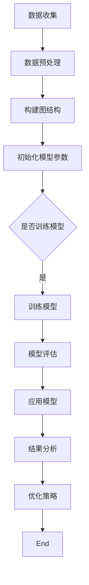

                 

# 图神经网络在社交注意力分析中的应用

## 关键词
- 图神经网络
- 社交注意力分析
- 社交网络
- 知识图谱
- 群体行为分析
- 人工智能

## 摘要

本文将探讨图神经网络在社交注意力分析中的应用，通过对社交网络的建模与分析，揭示群体行为模式与个体间的关注关系。首先，我们将介绍图神经网络的基本概念，然后深入探讨其在社交注意力分析中的核心算法原理，并通过实际案例展示其应用效果。此外，本文还将分析当前研究中的挑战与未来发展趋势，为图神经网络在社交注意力分析领域的深入应用提供思考方向。

## 1. 背景介绍

随着互联网的快速发展，社交网络已成为人们日常生活中不可或缺的一部分。从Facebook、Twitter到微信、微博，社交网络为人们提供了一个广阔的交流平台。然而，大量信息的涌现也带来了信息过载的问题，使得个体难以从中获取有价值的信息。因此，如何有效地分析社交网络中的注意力分配，揭示群体行为模式，成为当前研究的热点问题。

传统的机器学习方法在处理社交网络数据时，往往局限于线性模型或图灵机等简单模型，难以捕捉社交网络中的复杂关系和动态特性。近年来，图神经网络（Graph Neural Networks，GNNs）的兴起为这一问题提供了新的解决方案。GNNs通过引入图结构来建模社交网络，能够有效地捕捉网络中的局部与全局信息，从而实现更精准的社交注意力分析。

## 2. 核心概念与联系

### 2.1 图神经网络的基本概念

图神经网络是一种基于图结构进行学习和预测的人工神经网络。与传统的神经网络不同，图神经网络能够直接处理图结构数据，通过节点和边的特征进行信息传播和聚合。

#### 2.1.1 节点特征

在图神经网络中，节点特征表示了节点的属性信息，如用户的兴趣爱好、年龄、性别等。这些特征通常通过预定义的嵌入向量来表示。

#### 2.1.2 边特征

边特征表示了节点之间的关系，如朋友关系、共同关注等。与节点特征类似，边特征也通过预定义的嵌入向量来表示。

#### 2.1.3 图结构

图结构是指节点和边之间的拓扑关系。在社交网络中，图结构通常由用户及其之间的关系构成。

### 2.2 图神经网络的核心算法原理

图神经网络的核心算法原理主要包括以下几个方面：

#### 2.2.1 神经元传播机制

在图神经网络中，每个神经元都会接收其邻居节点的信息，并利用这些信息更新自己的状态。这一过程通过图卷积操作来实现。

#### 2.2.2 图卷积操作

图卷积操作是一种基于节点和边特征进行信息聚合的机制。具体来说，图卷积操作包括以下步骤：

1. **邻居选择**：确定每个节点的邻居节点。
2. **特征聚合**：将邻居节点的特征进行加权求和，得到当前节点的聚合特征。
3. **激活函数**：对聚合特征进行非线性变换，以提取更高级的特征。

#### 2.2.3 信息传播与更新

在图神经网络中，信息传播与更新过程是一个迭代的过程。每次迭代，节点都会根据其邻居节点的信息更新自己的状态，从而实现特征的逐层抽象和提取。

### 2.3 图神经网络与社交注意力分析的联系

社交注意力分析的目标是揭示社交网络中个体之间的关注关系和群体行为模式。图神经网络通过引入图结构，能够有效地捕捉社交网络中的复杂关系，从而实现以下目标：

#### 2.3.1 个体关注关系建模

通过图神经网络，我们可以将个体间的关注关系建模为一个图结构，并利用图卷积操作提取个体间的关注特征。

#### 2.3.2 群体行为模式识别

图神经网络能够从图结构中提取出更高级的特征，从而实现群体行为模式的识别。

#### 2.3.3 注意力分配优化

通过分析社交网络中的注意力分配情况，我们可以优化个体的关注策略，从而提高社交网络的传播效率和信息的价值。

### 2.4 Mermaid 流程图

下面是一个简单的 Mermaid 流程图，展示图神经网络在社交注意力分析中的应用流程：

## 3. 核心算法原理 & 具体操作步骤

### 3.1 数据收集与预处理

在社交注意力分析中，数据收集是关键步骤之一。通常，我们通过以下途径收集数据：

1. **用户数据**：包括用户的个人资料、兴趣爱好、行为记录等。
2. **关系数据**：包括用户之间的朋友关系、共同关注、点赞等。

收集到数据后，我们需要对数据进行预处理，包括数据清洗、缺失值填补和数据规范化等。预处理后的数据将用于构建图结构。

### 3.2 构建图结构

在图神经网络中，图结构由节点和边组成。节点表示社交网络中的个体，边表示个体之间的关系。

1. **节点表示**：将用户数据转化为节点特征向量。通常，我们可以使用预训练的词向量或用户特征向量作为节点表示。
2. **边表示**：将关系数据转化为边特征向量。例如，对于朋友关系，我们可以使用二值向量表示；对于共同关注，我们可以使用计数向量表示。

### 3.3 初始化模型参数

在构建图神经网络时，我们需要初始化模型参数。这些参数包括节点特征向量、边特征向量和模型权重等。

1. **节点特征向量**：初始化为随机向量。
2. **边特征向量**：初始化为随机向量。
3. **模型权重**：初始化为随机值。

### 3.4 训练模型

在训练图神经网络时，我们通常使用以下步骤：

1. **图卷积操作**：对节点特征向量进行图卷积操作，提取节点的高级特征。
2. **聚合特征**：将节点的高

