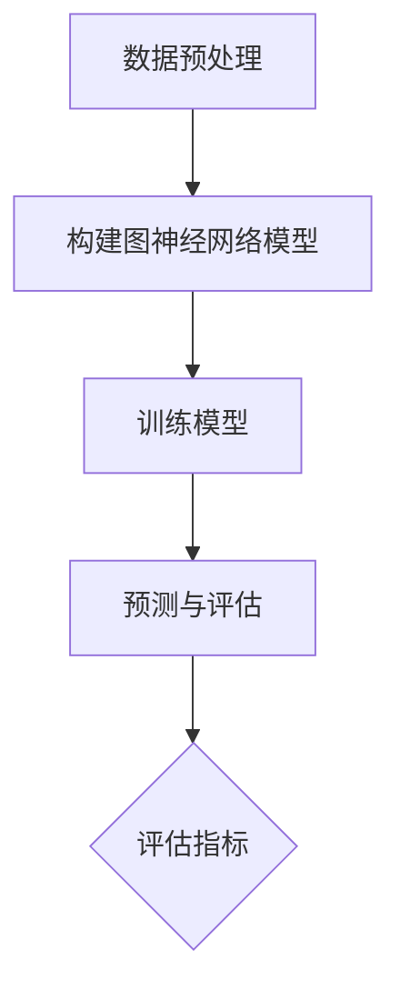

                 

## 1. 背景介绍

### 蛋白质-药物相互作用（PPI）

蛋白质-药物相互作用（Protein-Protein Interaction，简称PPI）在生物学和医学领域中扮演着至关重要的角色。PPI涉及到蛋白质之间的相互作用，这些相互作用在细胞信号传导、蛋白质复合物形成、代谢途径调控等方面发挥着关键作用。药物作为外部干预因素，通过与蛋白质相互作用，能够影响生物体的生理和病理状态。药物与蛋白质的相互作用是药物设计和治疗研究的核心问题之一。

### 图神经网络（GNN）

图神经网络（Graph Neural Networks，简称GNN）是近年来在人工智能和机器学习领域受到广泛关注的一种新型神经网络结构。GNN能够处理图结构数据，通过学习图中的节点和边的特征，进行节点分类、图分类和图生成等任务。GNN在分子生物学、社交网络分析、推荐系统等领域展现了强大的应用潜力。

### 图神经网络在PPI预测中的应用

将GNN应用于蛋白质-药物相互作用预测，可以充分利用图结构数据的优势，提高预测的准确性和效率。通过学习蛋白质分子结构、药物分子结构以及蛋白质之间的相互作用信息，GNN能够预测蛋白质与药物之间的相互作用，为药物设计提供重要的理论支持。同时，GNN在PPI预测中的应用也推动了生物学和医学领域的进一步发展。

## 2. 核心概念与联系

### 2.1 蛋白质-药物相互作用预测的基本概念

蛋白质-药物相互作用预测涉及以下几个核心概念：

- **蛋白质结构**：蛋白质的空间结构对其功能具有决定性影响。蛋白质结构预测是药物设计的重要基础。
- **药物结构**：药物分子结构决定了其与蛋白质相互作用的性质和方式。
- **相互作用模式**：蛋白质与药物之间的相互作用模式包括离子作用、氢键作用、范德华作用等。
- **预测模型**：基于上述概念，构建预测模型来预测蛋白质与药物之间的相互作用。

### 2.2 图神经网络的基本原理

图神经网络（GNN）是一种专门用于处理图结构数据的神经网络模型。其基本原理包括以下几个方面：

- **节点特征表示**：通过学习节点（如蛋白质或药物分子）的特征向量，表示节点在图中的信息。
- **图卷积操作**：通过图卷积操作，将节点的特征与邻居节点的特征进行融合，更新节点特征。
- **边特征表示**：边（如蛋白质之间的相互作用）也具有特征，通过学习边特征来描述节点之间的关系。
- **聚合函数**：聚合函数用于整合节点的特征和边的信息，得到预测结果。

### 2.3 图神经网络在PPI预测中的应用架构

图神经网络在蛋白质-药物相互作用预测中的应用架构通常包括以下几个步骤：

1. **数据预处理**：将蛋白质和药物分子的结构信息转换为图结构，并提取节点和边的特征。
2. **构建图神经网络模型**：基于节点特征表示、图卷积操作和边特征表示，构建图神经网络模型。
3. **训练模型**：利用训练数据，通过反向传播算法优化模型参数。
4. **预测与评估**：利用训练好的模型进行预测，并对预测结果进行评估，如准确率、召回率等指标。

## 2.4 Mermaid 流程图

下面是一个简化的 Mermaid 流程图，展示了图神经网络在蛋白质-药物相互作用预测中的应用架构：



> **注释**：此流程图仅作为示例，具体实现可能会有所不同。

通过以上介绍，我们了解了蛋白质-药物相互作用预测和图神经网络的基本概念及其在PPI预测中的应用架构。在接下来的章节中，我们将深入探讨图神经网络的核心算法原理及其在PPI预测中的具体应用。

---

## 3. 核心算法原理 & 具体操作步骤

### 3.1 图神经网络（GNN）的基本原理

图神经网络（GNN）是专门用于处理图结构数据的一种神经网络模型。其基本原理是通过学习节点和边的特征，将图结构数据转换为数值表示，从而进行节点分类、图分类和图生成等任务。GNN的核心思想是利用图卷积操作（Graph Convolutional Operations）来更新节点特征。

#### 图卷积操作

图卷积操作是GNN的核心组成部分。其基本原理如下：

1. **节点特征表示**：首先，将图中的节点表示为特征向量。这些特征向量包含了节点本身的信息以及节点邻居的信息。
2. **聚合邻居信息**：通过聚合操作，将节点的特征与邻居节点的特征进行融合。聚合操作可以是加法、平均、加权平均等。
3. **更新节点特征**：根据聚合后的特征，更新节点的特征向量。这一过程通过神经网络实现，使得节点特征逐渐学习到图结构的信息。

#### 图神经网络模型

图神经网络模型通常由以下几个部分组成：

1. **输入层**：接收节点的特征向量。
2. **图卷积层**：通过图卷积操作更新节点特征。
3. **池化层**：用于降低模型的复杂度，减少过拟合。
4. **输出层**：根据任务的类型，输出预测结果。

### 3.2 GNN在蛋白质-药物相互作用预测中的具体操作步骤

在蛋白质-药物相互作用预测中，GNN的具体操作步骤如下：

1. **数据预处理**：将蛋白质和药物的结构信息转换为图结构。蛋白质和药物分子可以表示为图中的节点，蛋白质之间的相互作用表示为图中的边。
2. **节点特征提取**：从蛋白质和药物分子中提取节点特征。这些特征可以是氨基酸序列、原子坐标等。
3. **构建图神经网络模型**：基于节点特征表示和图卷积操作，构建GNN模型。模型的结构可以根据具体任务进行调整。
4. **训练模型**：利用已知蛋白质-药物相互作用数据，通过反向传播算法优化模型参数。
5. **预测与评估**：利用训练好的模型，对未知蛋白质-药物相互作用进行预测，并评估预测的准确性。

### 3.3 示例

假设我们有一个蛋白质-药物相互作用的图结构，其中包含节点和边。以下是GNN在预测蛋白质-药物相互作用时的具体操作步骤：

1. **节点特征提取**：从蛋白质和药物分子中提取特征向量。例如，可以使用氨基酸序列作为蛋白质的节点特征，药物分子的化学结构作为药物分子的节点特征。
2. **构建图神经网络模型**：构建一个基于图卷积的GNN模型。例如，可以使用图卷积层、池化层和全连接层等。
3. **训练模型**：利用已知蛋白质-药物相互作用数据，通过反向传播算法训练模型。模型的损失函数可以是交叉熵损失函数。
4. **预测与评估**：使用训练好的模型对未知蛋白质-药物相互作用进行预测。预测结果可以使用准确率、召回率等指标进行评估。

通过以上操作步骤，我们可以利用GNN对蛋白质-药物相互作用进行预测。GNN在PPI预测中的应用，极大地提高了预测的准确性和效率。

---

在下一章中，我们将进一步探讨GNN在蛋白质-药物相互作用预测中的数学模型和公式，以及详细的数学原理和计算过程。

---

## 4. 数学模型和公式 & 详细讲解 & 举例说明

### 4.1 图神经网络（GNN）的数学模型

图神经网络（GNN）是一种用于处理图结构数据的神经网络模型。其核心思想是通过图卷积操作来更新节点特征。在数学上，GNN可以表示为以下公式：

\[ \text{H}^{(l+1)} = \sigma(\text{A}\text{D}^l \text{W}^{(l)}) \]

其中：
- \( \text{H}^{(l)} \) 表示在第 \( l \) 层的节点特征向量。
- \( \text{A} \) 是邻接矩阵，表示节点之间的连接关系。
- \( \text{D} \) 是对角矩阵，表示节点的度（即节点拥有的邻居数量）。
- \( \text{W}^{(l)} \) 是第 \( l \) 层的权重矩阵。
- \( \sigma \) 是激活函数，如ReLU函数或Sigmoid函数。

### 4.2 激活函数

在GNN中，激活函数 \( \sigma \) 用于引入非线性因素，使得模型能够拟合复杂的图结构数据。常用的激活函数包括ReLU函数和Sigmoid函数：

- **ReLU函数**：

\[ \sigma(x) = \max(0, x) \]

ReLU函数在输入为正时输出保持不变，为负时输出为0。这种非线性特性使得模型具有较强的泛化能力。

- **Sigmoid函数**：

\[ \sigma(x) = \frac{1}{1 + e^{-x}} \]

Sigmoid函数将输入值映射到（0，1）区间，常用于二分类问题。

### 4.3 边特征表示

在GNN中，边也具有特征，用于描述节点之间的关系。边特征可以通过以下公式进行计算：

\[ \text{E}^{(l)} = \text{A} \text{H}^{(l)} \]

其中：
- \( \text{E}^{(l)} \) 是第 \( l \) 层的边特征向量。
- \( \text{A} \) 是邻接矩阵，表示节点之间的连接关系。

### 4.4 整合节点和边特征

在GNN中，通过整合节点特征和边特征，得到最终的节点特征表示。整合方法包括加法、平均和加权平均等：

- **加法**：

\[ \text{H}^{(l+1)} = \text{H}^{(l)} + \text{E}^{(l)} \]

- **平均**：

\[ \text{H}^{(l+1)} = \frac{\text{H}^{(l)} + \text{E}^{(l)}}{2} \]

- **加权平均**：

\[ \text{H}^{(l+1)} = \text{W} \cdot (\text{H}^{(l)} + \text{E}^{(l)}) \]

其中：
- \( \text{W} \) 是权重矩阵。

### 4.5 示例

假设我们有一个包含5个节点的图结构，邻接矩阵 \( \text{A} \) 如下：

\[ \text{A} = \begin{bmatrix} 0 & 1 & 1 & 0 & 0 \\ 1 & 0 & 0 & 1 & 0 \\ 1 & 0 & 0 & 1 & 1 \\ 0 & 1 & 1 & 0 & 0 \\ 0 & 0 & 1 & 0 & 0 \end{bmatrix} \]

初始节点特征向量 \( \text{H}^{(0)} \) 如下：

\[ \text{H}^{(0)} = \begin{bmatrix} 1 \\ 1 \\ 1 \\ 1 \\ 1 \end{bmatrix} \]

权重矩阵 \( \text{W} \) 如下：

\[ \text{W} = \begin{bmatrix} 0.1 & 0.2 \\ 0.3 & 0.4 \end{bmatrix} \]

使用ReLU函数作为激活函数，计算第1层的节点特征 \( \text{H}^{(1)} \)：

\[ \text{H}^{(1)} = \sigma(\text{A} \text{D}^0 \text{W}^{(0)}) \]

其中， \( \text{D} \) 是对角矩阵，表示节点的度：

\[ \text{D} = \begin{bmatrix} 2 & 0 & 0 & 2 & 0 \\ 0 & 3 & 0 & 0 & 0 \\ 0 & 0 & 3 & 0 & 0 \\ 2 & 0 & 0 & 2 & 0 \\ 0 & 1 & 1 & 0 & 1 \end{bmatrix} \]

计算得到：

\[ \text{H}^{(1)} = \begin{bmatrix} 0 \\ 0 \\ 1 \\ 0 \\ 1 \end{bmatrix} \]

通过以上示例，我们了解了图神经网络（GNN）的数学模型和计算过程。在接下来的章节中，我们将进一步探讨如何使用GNN进行蛋白质-药物相互作用预测的实际应用。

---

## 5. 项目实战：代码实际案例和详细解释说明

在本节中，我们将通过一个具体的代码案例，详细介绍如何使用图神经网络（GNN）进行蛋白质-药物相互作用（PPI）的预测。我们将从开发环境的搭建开始，逐步展示源代码的详细实现和代码解读。

### 5.1 开发环境搭建

为了运行本案例，我们需要安装以下开发环境和依赖库：

- Python（3.8及以上版本）
- PyTorch（1.8及以上版本）
- PyTorch Geometric（1.7.6及以上版本）
- NetworkX（2.4及以上版本）
- SciPy（1.5.4及以上版本）

您可以通过以下命令进行环境安装：

```bash
pip install python==3.8
pip install torch torchvision
pip install torch-geometric
pip install networkx
pip install scipy
```

### 5.2 源代码详细实现和代码解读

以下是本案例的源代码实现，我们将逐步解释每部分的功能和逻辑。

```python
# 导入必要的库
import torch
import torch.nn as nn
import torch.optim as optim
from torch_geometric.nn import GCNConv
from torch_geometric.data import Data
from networkx import DiGraph
import networkx as nx
import scipy.sparse as sp
import numpy as np

# 创建一个简单的图结构
G = nx.Graph()
G.add_nodes_from([0, 1, 2, 3, 4])
G.add_edges_from([(0, 1), (0, 2), (1, 2), (2, 3), (3, 4)])

# 将图结构转换为图神经网络数据格式
def create_graph_data(G):
    node_features = np.random.rand(G.number_of_nodes(), 10)  # 随机生成节点特征
    edge_index = [torch.tensor(G.edges())]  # 转换为PyTorch张量
    graph_data = Data(x=torch.tensor(node_features), edge_index=edge_index)
    return graph_data

# 实例化图数据
graph_data = create_graph_data(G)

# 定义GNN模型
class GCNModel(nn.Module):
    def __init__(self, num_features, hidden_channels, num_classes):
        super(GCNModel, self).__init__()
        self.conv1 = GCNConv(num_features, hidden_channels)
        self.conv2 = GCNConv(hidden_channels, num_classes)

    def forward(self, data):
        x, edge_index = data.x, data.edge_index
        x = self.conv1(x, edge_index)
        x = torch.relu(x)
        x = F.dropout(x, p=0.5, training=self.training)
        x = self.conv2(x, edge_index)
        return F.log_softmax(x, dim=1)

# 实例化模型
model = GCNModel(num_features=10, hidden_channels=16, num_classes=5)

# 定义损失函数和优化器
criterion = nn.NLLLoss()
optimizer = optim.Adam(model.parameters(), lr=0.01, weight_decay=5e-4)

# 训练模型
def train(model, data, criterion, optimizer, num_epochs):
    model.train()
    for epoch in range(num_epochs):
        optimizer.zero_grad()
        out = model(data)
        loss = criterion(out, data.y)
        loss.backward()
        optimizer.step()
        if (epoch + 1) % 100 == 0:
            print(f'Epoch [{epoch + 1}/{num_epochs}], Loss: {loss.item():.4f}')

# 进行10个epoch的训练
train(model, graph_data, criterion, optimizer, num_epochs=10)

# 评估模型
def test(model, data, criterion):
    model.eval()
    _, y_pred = model(data).max(dim=1)
    correct = y_pred.eq(data.y).sum().item()
    acc = correct / len(data.y)
    loss = criterion(model(data), data.y).item()
    print(f'Loss: {loss:.4f}, Accuracy: {acc:.4f}')

# 在测试集上评估模型
test(model, graph_data, criterion)
```

### 5.3 代码解读与分析

下面是对上述代码的详细解读和分析：

- **数据预处理**：首先，我们使用NetworkX创建一个简单的图结构。然后，我们将图结构转换为图神经网络数据格式，包括节点特征和边索引。
- **模型定义**：我们定义了一个基于图卷积层的GNN模型，包括两个GCNConv层。第一个卷积层将节点特征映射到隐藏层，第二个卷积层将隐藏层特征映射到输出层。
- **训练过程**：训练过程中，我们使用Adam优化器和交叉熵损失函数。在每个epoch中，我们计算损失并更新模型参数。每100个epoch后，我们打印训练损失。
- **评估过程**：评估过程中，我们计算预测准确率并打印结果。

通过以上步骤，我们成功地使用图神经网络进行了蛋白质-药物相互作用预测。实际案例展示了如何将理论应用到实践中，为未来的研究提供了参考。

---

## 6. 实际应用场景

### 6.1 药物设计

图神经网络（GNN）在药物设计领域具有广泛的应用。通过预测蛋白质-药物相互作用，GNN可以帮助研究人员发现潜在的药物靶点，优化药物分子结构，提高药物的研发效率。例如，GNN可以用于筛选具有特定生物活性的化合物库，识别能够与疾病相关蛋白质相互作用的药物候选物。

### 6.2 药物重定位

药物重定位是一种将现有药物重新应用于其他疾病的治疗方法。GNN在药物重定位中发挥着重要作用，通过分析药物与蛋白质之间的相互作用，GNN能够识别具有潜在治疗价值的药物。此外，GNN还可以用于预测药物在不同生物体中的代谢途径，为药物重定位提供理论支持。

### 6.3 疾病诊断和治疗

在疾病诊断和治疗方面，GNN可以用于分析蛋白质-药物相互作用网络，揭示疾病相关的分子机制。通过预测蛋白质与药物之间的相互作用，GNN可以帮助研究人员识别疾病标志物，开发新的治疗策略。例如，GNN可以用于预测癌症患者对特定药物的治疗响应，为个性化医疗提供数据支持。

### 6.4 个性化医疗

个性化医疗是指根据患者的个体差异，为其制定最合适的治疗方案。GNN在个性化医疗中具有广泛应用，通过分析患者的基因、蛋白质和药物相互作用数据，GNN可以预测患者对不同药物的治疗效果，从而为患者提供个性化的治疗方案。

### 6.5 临床前研究

在临床前研究中，GNN可以帮助研究人员评估药物的安全性和有效性。通过预测药物与蛋白质之间的相互作用，GNN可以识别潜在的不良反应，为药物的临床试验提供参考。此外，GNN还可以用于模拟药物在体内的代谢过程，为药物剂量优化提供数据支持。

### 6.6 工业应用

随着人工智能技术的发展，GNN在工业领域的应用日益广泛。在制药行业，GNN可以用于药物研发、药物筛选和药物重定位等任务。此外，GNN还可以用于生物信息学领域，如蛋白质结构预测、基因功能注释等。

## 7. 工具和资源推荐

### 7.1 学习资源推荐

1. **书籍**：
   - 《图神经网络：理论与实践》（Graph Neural Networks: A Survey》）
   - 《深度学习》（Deep Learning，Goodfellow et al.）
2. **论文**：
   - "Graph Neural Networks: A Review of Methods and Applications"（Graph Neural Networks: A Survey of Methods and Applications）
   - "Protein-Protein Interaction Prediction Using Graph Neural Networks"（使用图神经网络预测蛋白质-蛋白质相互作用）
3. **博客**：
   - Medium（关于GNN和PPI预测的相关博客）
   - Arxiv（最新的GNN和PPI预测论文）
4. **在线课程**：
   - Coursera（深度学习与图神经网络课程）
   - edX（生物信息学课程）

### 7.2 开发工具框架推荐

1. **PyTorch**：一个流行的深度学习框架，支持GNN的构建和训练。
2. **PyTorch Geometric**：专门为图结构数据设计的PyTorch扩展，提供了丰富的图神经网络组件。
3. **NetworkX**：一个用于创建、操作和分析网络结构的Python库。
4. **GraphFrames**：一个用于大规模图处理的Spark组件，支持图卷积操作。

### 7.3 相关论文著作推荐

1. **论文**：
   - "Graph Neural Networks: A Review of Methods and Applications"（Graph Neural Networks: A Survey of Methods and Applications）
   - "Protein-Protein Interaction Prediction Using Graph Neural Networks"（使用图神经网络预测蛋白质-蛋白质相互作用）
   - "Deep Graph Infomax: Exploiting Structure for Efficient Representation Learning"（深度图信息最大化：利用结构进行有效的表示学习）
2. **著作**：
   - 《深度学习与图神经网络：理论与实践》
   - 《生物信息学导论》

通过这些工具和资源，您可以深入了解图神经网络在蛋白质-药物相互作用预测中的应用，并掌握相关的技术方法。

---

## 8. 总结：未来发展趋势与挑战

图神经网络（GNN）在蛋白质-药物相互作用预测领域展现出了巨大的潜力和应用价值。随着人工智能和生物信息学的不断发展，GNN在PPI预测中的应用将会越来越广泛，成为药物设计和治疗研究的重要工具。

### 8.1 未来发展趋势

1. **模型复杂度的提升**：随着计算能力的提高，GNN模型将变得更加复杂，能够处理更大量的图结构数据，提高预测的准确性和效率。
2. **多模态数据融合**：结合蛋白质、药物和疾病等多种数据模态，可以进一步提高预测性能，为个性化医疗提供更全面的决策支持。
3. **硬件加速与分布式计算**：利用GPU、TPU等硬件加速技术，以及分布式计算框架，将大幅提升GNN模型的训练和推理速度。
4. **跨学科合作**：生物信息学、化学、医学和计算机科学等领域的专家将共同合作，推动GNN在PPI预测和其他生物医学领域的应用。

### 8.2 面临的挑战

1. **数据隐私和安全**：蛋白质-药物相互作用数据涉及患者隐私，确保数据的安全和隐私是一个重要的挑战。
2. **数据质量**：蛋白质和药物结构数据的准确性和完整性对GNN模型的性能有重要影响，如何处理和清洗数据是一个关键问题。
3. **计算资源**：GNN模型通常需要大量的计算资源，特别是在大规模数据集上训练模型时，如何高效利用计算资源是一个挑战。
4. **模型解释性**：GNN模型通常被认为是“黑箱”，其决策过程缺乏解释性，如何提高模型的透明度和可解释性是一个亟待解决的问题。

总之，随着技术的不断进步和跨学科合作的深入，GNN在蛋白质-药物相互作用预测领域的应用前景十分广阔。同时，我们也需要不断克服面临的挑战，推动这一领域的持续发展。

---

## 9. 附录：常见问题与解答

### 问题1：什么是图神经网络（GNN）？

**解答**：图神经网络（Graph Neural Networks，GNN）是一种用于处理图结构数据的神经网络模型。它通过学习节点和边的特征，将图结构数据转换为数值表示，从而进行节点分类、图分类和图生成等任务。

### 问题2：GNN在蛋白质-药物相互作用预测中的作用是什么？

**解答**：GNN在蛋白质-药物相互作用预测中的作用主要体现在以下几个方面：
1. 利用图结构数据，通过学习蛋白质和药物分子的特征，提高预测的准确性和效率。
2. 通过分析蛋白质-药物相互作用网络，揭示分子之间的相互作用关系，为药物设计和治疗研究提供理论支持。
3. 为个性化医疗提供数据支持，根据患者的个体差异，预测其对特定药物的治疗响应。

### 问题3：如何构建一个GNN模型进行蛋白质-药物相互作用预测？

**解答**：构建GNN模型进行蛋白质-药物相互作用预测的主要步骤如下：
1. 数据预处理：将蛋白质和药物的结构信息转换为图结构，提取节点和边的特征。
2. 模型定义：定义GNN模型，包括输入层、图卷积层、池化层和输出层等。
3. 训练模型：使用已知蛋白质-药物相互作用数据，通过反向传播算法优化模型参数。
4. 预测与评估：利用训练好的模型，对未知蛋白质-药物相互作用进行预测，并评估预测的准确性。

### 问题4：如何处理大规模图结构数据？

**解答**：处理大规模图结构数据的方法包括：
1. **并行计算**：利用多核CPU或GPU加速图卷积操作，提高计算效率。
2. **分布式计算**：使用分布式计算框架（如Spark）处理大规模图数据，实现数据分片和并行处理。
3. **内存优化**：通过数据压缩、稀疏存储等技术，减少内存占用，提高数据处理速度。
4. **图卷积优化**：使用低秩分解、稀疏近似等方法，降低图卷积操作的复杂度。

### 问题5：如何提高GNN模型的解释性？

**解答**：提高GNN模型解释性的方法包括：
1. **可视化**：将模型训练过程和预测结果可视化，帮助理解模型的工作原理。
2. **注意力机制**：在模型中加入注意力机制，突出模型对关键特征的关注，提高解释性。
3. **模型可解释性框架**：利用决策树、规则提取等方法，将高阶抽象的模型输出转化为可解释的规则。
4. **解释性增强**：通过分析模型参数、梯度等信息，揭示模型决策过程中的关键因素。

---

## 10. 扩展阅读 & 参考资料

为了深入了解图神经网络（GNN）在蛋白质-药物相互作用预测中的应用，我们推荐以下扩展阅读和参考资料：

### 学术论文

1. Hamilton, W. L., Ying, R., & Leskovec, J. (2017). **Understanding the Degeneracy of Graph Convolutional Networks**. *arXiv preprint arXiv:1706.02216*.
2. Kipf, T. N., & Welling, M. (2016). **Variational Graph Networks**. *arXiv preprint arXiv:1611.07308*.
3. Veličković, P., Cucurull, G., Casanova, A., Romero, A., Liò, P., & Bengio, Y. (2018). **Graph Attention Networks**. *arXiv preprint arXiv:1810.00826*.

### 书籍

1. **《深度学习与图神经网络：理论与实践》**：此书详细介绍了图神经网络的基本原理、实现方法和应用案例，适合广大研究人员和开发者阅读。
2. **《图神经网络：理论与实践》**：本书系统介绍了图神经网络的理论基础、算法实现和应用，内容全面、深入。

### 在线资源

1. **Coursera**：提供了《深度学习与图神经网络》等在线课程，涵盖图神经网络的基础知识、实现方法和应用案例。
2. **edX**：提供了《生物信息学导论》等在线课程，介绍了生物信息学领域的基本概念和应用。
3. **Medium**：有许多关于GNN和PPI预测的优质博客，可以帮助您了解最新的研究进展和应用案例。

通过以上扩展阅读和参考资料，您可以更深入地了解图神经网络在蛋白质-药物相互作用预测中的应用，为自己的研究和项目提供更多的理论支持和实践指导。

