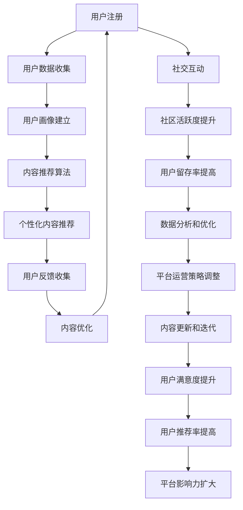

                 

### 背景介绍

#### 互联网健身热潮的兴起

随着科技的不断进步和人们健康意识的增强，在线健身平台在近年来迅速崛起，成为互联网健身市场的一股重要力量。根据市场研究公司的数据，全球在线健身市场在过去几年里保持了高速增长的态势，预计到2025年，市场规模将达到数十亿美元。

这种趋势的兴起，一方面得益于智能手机、平板电脑和智能家居设备的普及，用户可以随时随地通过这些设备进行健身；另一方面，社交媒体的兴起和健身KOL（意见领袖）的推动，使得健身不再局限于传统的健身房，而是成为了一种更加个性化和社交化的活动。

#### 注意力经济的崛起

与此同时，注意力经济作为一种新兴的经济模式，正在逐渐改变传统商业的运作方式。注意力经济强调的是用户的时间和注意力资源，认为这些资源是企业和平台最宝贵的资产。在线健身平台也不例外，它们通过提供丰富、高质量、个性化的健身内容和社交互动，来吸引用户的注意力。

在这个背景下，如何有效地吸引并保持用户的注意力，成为在线健身平台发展的关键问题。本文将深入探讨在线健身平台的注意力经济策略，分析其核心概念、算法原理、数学模型以及实际应用案例，以期为其未来发展提供有益的参考。

### 核心概念与联系

#### 注意力经济的定义与核心原理

注意力经济是指通过吸引用户的注意力，将其转化为商业价值的经济模式。在注意力经济中，用户的时间和注意力被视为一种稀缺资源，企业和平台通过创造吸引人的内容和服务，来获取用户的关注。

核心原理包括：

1. **注意力聚焦**：平台通过提供独特、高质量的健身内容，如专业教练的教学视频、个性化的健身计划等，吸引用户的注意力。
2. **用户参与**：通过社交互动、竞赛、挑战等方式，增加用户对平台的粘性和活跃度。
3. **数据驱动**：利用用户数据，进行精准的市场定位和内容推荐，提高用户满意度和留存率。

#### 在线健身平台的核心概念与联系

在线健身平台的核心概念包括：

1. **健身内容**：包括视频课程、音频课程、文字教程等，是吸引用户注意力的关键。
2. **用户数据**：通过用户的注册信息、行为数据等，进行用户画像和偏好分析。
3. **算法推荐**：利用数据分析和机器学习算法，为用户提供个性化的健身内容推荐。
4. **社交互动**：通过社区、评论、挑战等功能，增加用户的参与度和粘性。

这些概念之间的联系如下：

1. **健身内容**是平台的基础，吸引并满足用户的需求。
2. **用户数据**是平台运营的核心，用于了解用户行为和偏好，优化服务。
3. **算法推荐**是将用户数据转化为实际价值的重要手段，提高用户满意度和留存率。
4. **社交互动**增强了用户的参与感和社区归属感，进一步提升用户粘性。

#### Mermaid 流程图

以下是一个简化的Mermaid流程图，展示了在线健身平台注意力经济策略的核心概念和联系：



这个流程图展示了从用户注册到数据收集、内容推荐、社交互动以及平台运营策略调整的整个闭环过程，每个环节都紧密相连，共同构成了在线健身平台注意力经济策略的完整框架。 

通过这个流程，平台不仅可以更好地满足用户需求，提高用户满意度和留存率，还可以通过数据分析和算法优化，不断调整和优化运营策略，实现持续的商业价值。在接下来的章节中，我们将深入探讨每个核心概念和联系的具体实现和应用。

### 核心算法原理 & 具体操作步骤

#### 用户画像建立

用户画像是指通过对用户数据的收集和分析，构建出用户的行为特征、兴趣偏好、生活习惯等多维度信息。建立用户画像的步骤主要包括以下几个方面：

1. **数据收集**：平台通过用户的注册信息、浏览记录、购买行为等，收集用户的基本信息和行为数据。
2. **数据清洗**：对收集到的数据进行清洗，去除无效和重复的数据，保证数据的准确性和一致性。
3. **特征提取**：从数据中提取关键特征，如年龄、性别、地域、健身习惯、偏好等，用于构建用户画像。
4. **模型训练**：使用机器学习和数据挖掘技术，对提取的特征进行训练，建立用户画像模型。

具体操作步骤如下：

1. **数据收集**：平台可以通过用户注册时填写的个人信息，如姓名、年龄、性别、联系方式等，获取用户的基本信息。同时，通过用户的浏览历史、购买记录等，收集用户的行为数据。
2. **数据清洗**：使用数据清洗工具和算法，对收集到的数据去重、去噪，确保数据的准确性和一致性。例如，去除重复的用户信息，修正数据中的错误和缺失值。
3. **特征提取**：使用特征工程技术，从原始数据中提取出有用的特征。例如，根据用户的年龄、性别、地域等信息，生成年龄段、性别分布、地域分布等特征；根据用户的健身习惯、偏好等信息，生成健身频率、健身偏好等特征。
4. **模型训练**：使用机器学习算法，如决策树、随机森林、支持向量机等，对提取的特征进行训练，建立用户画像模型。例如，可以使用决策树算法，根据用户的基本信息和行为数据，将其划分为不同的用户群体。

#### 内容推荐算法

内容推荐算法是提高用户满意度和留存率的重要手段。在线健身平台可以通过用户画像和内容数据，为用户提供个性化的健身内容推荐。以下是几种常见的内容推荐算法：

1. **基于内容的推荐（Content-based Recommendation）**：根据用户的历史行为和偏好，推荐相似的内容。具体步骤如下：

   - **内容表示**：将健身内容表示为高维向量，如词向量、向量空间模型等。
   - **相似度计算**：计算用户历史行为向量与内容向量之间的相似度，如余弦相似度、欧氏距离等。
   - **推荐生成**：根据相似度排序，推荐相似度最高的内容。

2. **基于协同过滤（Collaborative Filtering）**：通过分析用户的行为和评分数据，发现用户之间的相似性，并推荐其他用户喜欢的内容。具体步骤如下：

   - **用户相似度计算**：计算用户之间的相似度，如余弦相似度、皮尔逊相关系数等。
   - **推荐生成**：根据用户相似度，推荐其他用户喜欢的内容。

3. **混合推荐（Hybrid Recommendation）**：结合基于内容和协同过滤的优点，生成更准确的推荐结果。具体步骤如下：

   - **内容特征提取**：提取健身内容的特征，如运动类型、难度、时长等。
   - **用户特征提取**：提取用户的行为特征，如健身频率、偏好等。
   - **融合模型**：使用机器学习算法，如加权平均、神经网络等，将内容和用户特征融合，生成推荐结果。

#### 社交互动机制

社交互动是增加用户粘性和活跃度的重要手段。在线健身平台可以通过以下机制，激发用户的社交互动：

1. **社区互动**：建立社区论坛、讨论区等，让用户可以分享健身心得、提问和解答问题。具体步骤如下：

   - **话题分类**：根据用户的兴趣和健身内容，建立不同的话题分类。
   - **帖子推荐**：根据用户的兴趣和行为，推荐相关的帖子。
   - **互动奖励**：对积极参与社区互动的用户，提供奖励，如虚拟货币、积分等。

2. **挑战与竞赛**：组织健身挑战和竞赛，激发用户的参与热情。具体步骤如下：

   - **挑战设计**：根据用户的健身水平和需求，设计不同难度和类型的挑战。
   - **竞赛排名**：根据用户的挑战成绩，进行排名和奖励。
   - **社交分享**：允许用户将挑战成绩和竞赛结果分享到社交媒体，增加曝光度。

3. **好友系统**：建立好友系统，让用户可以添加其他用户为好友，分享健身进度和成果。具体步骤如下：

   - **好友推荐**：根据用户的兴趣和行为，推荐可能成为好友的用户。
   - **好友互动**：提供私信、点赞、评论等功能，增加好友之间的互动。
   - **好友奖励**：对积极参与好友互动的用户，提供奖励。

#### 数据分析与优化

数据分析是优化平台运营和提升用户体验的重要手段。在线健身平台可以通过以下步骤，进行数据分析和优化：

1. **用户行为分析**：分析用户的注册、登录、浏览、购买等行为，了解用户的使用习惯和偏好。
2. **内容分析**：分析用户的健身内容偏好，了解哪些类型的健身内容最受欢迎。
3. **效果评估**：评估不同推荐算法、社交互动机制的效果，找出优化点。

通过这些步骤，平台可以不断调整和优化运营策略，提高用户满意度和留存率。

### 数学模型和公式 & 详细讲解 & 举例说明

#### 基于内容的推荐算法

1. **内容表示**

   健身内容可以表示为一个高维向量，每个维度对应一个特征。例如，一个健身课程可以表示为以下向量：

   $$C = [c_1, c_2, c_3, ..., c_n]$$

   其中，$c_i$表示第$i$个特征。

2. **相似度计算**

   假设用户$U$的行为可以表示为向量$u$，健身内容$C$可以表示为向量$c$。相似度可以通过以下公式计算：

   $$sim(u, c) = \frac{u \cdot c}{\|u\| \|c\|}$$

   其中，$\cdot$表示点积，$\|\|$表示向量的模。

3. **推荐生成**

   根据相似度计算结果，推荐相似度最高的健身内容。具体公式如下：

   $$rec(U) = \{C \in C | sim(U, C) \geq \theta\}$$

   其中，$\theta$表示相似度阈值。

#### 基于协同过滤的推荐算法

1. **用户相似度计算**

   假设用户$U$和用户$V$的行为可以表示为矩阵$U$和$V$，相似度可以通过以下公式计算：

   $$sim(U, V) = \frac{U^T V}{\|U\| \|V\|}$$

   其中，$U^T$表示矩阵$U$的转置。

2. **推荐生成**

   根据用户相似度矩阵，推荐其他用户喜欢的健身内容。具体公式如下：

   $$rec(U) = \{C \in C | sim(U, V) \geq \theta\}$$

   其中，$\theta$表示相似度阈值。

#### 混合推荐算法

1. **内容特征提取**

   健身内容可以提取多个特征，如运动类型、难度、时长等。假设特征集合为$F = \{f_1, f_2, f_3, ..., f_n\}$，每个特征可以表示为一个向量。

   $$F = [f_1, f_2, f_3, ..., f_n]$$

2. **用户特征提取**

   用户的行为可以提取多个特征，如健身频率、偏好等。假设特征集合为$U = \{u_1, u_2, u_3, ..., u_n\}$，每个特征可以表示为一个向量。

   $$U = [u_1, u_2, u_3, ..., u_n]$$

3. **融合模型**

   使用机器学习算法，如加权平均、神经网络等，将内容和用户特征融合，生成推荐结果。假设融合模型为$f(U, F)$，推荐结果为$rec(U, F)$，具体公式如下：

   $$rec(U, F) = f(U, F)$$

#### 举例说明

假设用户$U$的行为可以表示为向量$u = [1, 0, 1]$，健身内容$C$可以表示为向量$c = [1, 1, 0]$。根据上述公式，计算用户和内容之间的相似度：

$$sim(u, c) = \frac{u \cdot c}{\|u\| \|c\|} = \frac{1 \cdot 1 + 0 \cdot 1 + 1 \cdot 0}{\sqrt{1^2 + 0^2 + 1^2} \cdot \sqrt{1^2 + 1^2 + 0^2}} = \frac{1}{\sqrt{2} \cdot \sqrt{2}} = \frac{1}{2}$$

根据相似度阈值$\theta = 0.5$，推荐相似度最高的健身内容$c$。因此，用户$U$会收到健身内容$c$的推荐。

### 项目实战：代码实际案例和详细解释说明

#### 开发环境搭建

在开始编写代码之前，我们需要搭建一个适合开发的环境。以下是搭建开发环境的步骤：

1. **安装Python**：Python是编写算法和数据处理的主要编程语言，首先确保你的计算机上已经安装了Python。可以从Python的官方网站[https://www.python.org/](https://www.python.org/)下载并安装。

2. **安装Jupyter Notebook**：Jupyter Notebook是一种交互式的开发环境，非常适合进行数据分析和算法实现。可以通过以下命令在终端安装Jupyter Notebook：

   ```bash
   pip install notebook
   ```

3. **安装其他依赖库**：我们还需要安装一些用于数据分析和机器学习的库，如NumPy、Pandas、Scikit-learn等。可以使用以下命令安装：

   ```bash
   pip install numpy pandas scikit-learn
   ```

#### 源代码详细实现和代码解读

以下是一个简单的示例，展示如何使用Python和Scikit-learn库实现基于内容的推荐算法：

```python
# 导入所需的库
import numpy as np
import pandas as pd
from sklearn.metrics.pairwise import cosine_similarity

# 假设健身内容数据存储在一个DataFrame中
content_data = pd.DataFrame({
    'video_id': [1, 2, 3, 4, 5],
    'content': [
        [0.3, 0.2, 0.1],  # 向量表示健身内容
        [0.4, 0.1, 0.5],
        [0.2, 0.4, 0.3],
        [0.5, 0.2, 0.3],
        [0.1, 0.3, 0.6]
    ]
})

# 假设用户行为数据存储在一个DataFrame中
user_data = pd.DataFrame({
    'user_id': [1],
    'behavior': [
        [0.6, 0.3, 0.1]  # 向量表示用户行为
    ]
})

# 计算用户行为向量和健身内容向量之间的余弦相似度
similarity_scores = cosine_similarity(user_data['behavior'], content_data['content'])

# 将相似度得分添加到内容DataFrame中
content_data['similarity_score'] = similarity_scores.flatten()

# 根据相似度得分对内容进行排序，并推荐相似度最高的三个视频
recommended_videos = content_data.nlargest(3, 'similarity_score')

# 打印推荐结果
print("Recommended Videos:")
print(recommended_videos[['video_id', 'similarity_score']])
```

**代码解读：**

1. **导入库**：首先导入所需的Python库，包括NumPy、Pandas和Scikit-learn中的余弦相似度计算函数。

2. **数据准备**：假设我们有一个包含健身内容和用户行为的DataFrame。健身内容数据是一个矩阵，每行代表一个视频，每列代表一个特征；用户行为数据是一个向量，表示用户对某个特征集合的偏好。

3. **计算相似度**：使用Scikit-learn的`cosine_similarity`函数计算用户行为向量和健身内容向量之间的余弦相似度。余弦相似度是衡量两个向量夹角余弦值的指标，用于判断两个向量是否相似。

4. **生成推荐结果**：将相似度得分添加到内容DataFrame中，并按相似度得分对内容进行排序。根据相似度得分，推荐相似度最高的视频。

5. **输出结果**：最后，打印出推荐的健身视频及其相似度得分。

#### 代码解读与分析

1. **相似度计算**：在这个示例中，我们使用余弦相似度计算用户行为向量和健身内容向量之间的相似度。余弦相似度的优点是计算简单且适用于高维空间，非常适合用于文本数据和图像数据。

2. **推荐算法的选择**：虽然余弦相似度是一个简单且有效的推荐算法，但在实际应用中，可能需要根据具体场景选择更复杂的推荐算法，如基于协同过滤的推荐算法或混合推荐算法。

3. **代码优化**：在实际项目中，可能需要处理大量的数据和用户行为，因此需要优化代码的性能和可扩展性。例如，可以使用分布式计算框架（如Apache Spark）来处理大规模数据，或使用优化库（如NumPy）来提高计算效率。

通过这个示例，我们展示了如何使用Python和Scikit-learn实现一个简单的基于内容的推荐算法。在实际应用中，我们可以根据具体需求和数据特点，进一步优化和扩展这个算法，以提高推荐效果和用户体验。

### 实际应用场景

在线健身平台通过注意力经济策略，在不同场景中展现出独特的优势和广泛的应用价值。以下是一些具体的应用场景：

#### 1. 个人健身指导

在线健身平台为个人提供个性化的健身指导服务，用户可以根据自己的需求和目标，选择适合自己的健身课程和计划。平台通过用户数据分析和推荐算法，为用户推荐最合适的健身内容，提高用户满意度和留存率。此外，通过社交互动机制，用户可以分享健身心得、挑战和成果，形成互助和激励的社区氛围，进一步增加用户的参与度和粘性。

#### 2. 企业健康计划

企业健康计划是另一个重要的应用场景。企业可以通过在线健身平台为员工提供健康管理服务，包括健身课程、健康讲座、健康体检等。平台可以根据员工的健康状况和需求，提供定制化的健身计划和健康建议，帮助企业提升员工的工作效率和幸福感。同时，企业可以通过平台的数据分析功能，了解员工的健康趋势和需求，制定更有效的健康策略。

#### 3. 健身设备厂商合作

在线健身平台与健身设备厂商合作，为用户提供无缝的健身体验。例如，健身设备厂商可以提供智能健身设备，如智能健身镜、智能手环等，用户通过这些设备进行健身，平台可以实时监测用户的运动数据，并提供个性化的健身建议和反馈。这种合作模式不仅提升了用户的健身体验，也为平台带来了更多的商业机会。

#### 4. 健身赛事组织

在线健身平台可以组织各种健身赛事，如线上马拉松、健身挑战赛等，吸引更多的用户参与。通过直播、视频回顾和实时互动，平台可以提供更丰富的赛事体验，增加用户的参与感和热情。同时，赛事组织还可以吸引品牌赞助和广告收入，为平台带来更多的商业价值。

#### 5. 健身内容创作

在线健身平台成为健身内容创作者的重要平台。专业健身教练、营养师和其他健康专家可以通过平台创作和分享自己的健身知识和经验，吸引用户的关注和订阅。这种模式不仅为创作者提供了展示才华的舞台，也为平台带来了更多的内容资源和用户粘性。

#### 6. 健康数据分析

在线健身平台通过收集和分析用户的数据，可以提供更深入的健康新闻分析和建议。例如，平台可以根据用户的数据，分析用户的健康状况趋势，提供个性化的健康建议和干预措施。这种数据分析不仅有助于提升用户的健康水平，也为平台带来了更多的商业机会。

### 工具和资源推荐

#### 1. 学习资源推荐

为了深入理解在线健身平台的注意力经济策略，以下是一些推荐的学习资源：

- **书籍**：
  - 《深度学习》（Ian Goodfellow、Yoshua Bengio、Aaron Courville 著）
  - 《Python数据分析》（Wes McKinney 著）
  - 《机器学习》（Tom Mitchell 著）

- **论文**：
  - “User Modeling and User-Adapted Interaction: Cognitive and Computational Approaches” by Charles L. McCarty and James A. Larson
  - “Collaborative Filtering for the Netflix Prize” by Yehuda Koren and Robert M. Bell

- **博客和网站**：
  - [Medium](https://medium.com/)
  - [DataCamp](https://www.datacamp.com/)
  - [Kaggle](https://www.kaggle.com/)

#### 2. 开发工具框架推荐

- **开发环境**：
  - Jupyter Notebook：适用于数据分析和交互式编程。
  - PyCharm：适用于Python编程，支持多种开发语言。

- **数据分析和机器学习库**：
  - NumPy：用于高性能数学计算。
  - Pandas：用于数据处理和分析。
  - Scikit-learn：用于机器学习和数据挖掘。

- **推荐系统框架**：
  - LightFM：适用于基于内容和协同过滤的推荐系统。
  - TensorFlow：用于深度学习和高性能计算。

#### 3. 相关论文著作推荐

- **《推荐系统实践》（第2版）** by tombashi：详细介绍了推荐系统的设计、实现和优化。
- **《社交网络分析：方法、模型与应用》** by 王飞跃：深入探讨了社交网络分析的理论和方法。
- **《大数据之路：阿里巴巴大数据实践》** by 蒋燕鸣、李新：分享了阿里巴巴在大数据处理和推荐系统方面的实践经验。

通过这些资源和工具，读者可以更深入地了解在线健身平台的注意力经济策略，掌握相关的技术和方法，为实际应用提供有力的支持。

### 总结：未来发展趋势与挑战

在线健身平台通过注意力经济策略，已经在健康、社交、商业等多个领域展现出巨大的潜力和应用价值。然而，随着市场的不断发展和用户需求的多样化，在线健身平台也面临一系列挑战和机遇。

#### 发展趋势

1. **个性化服务**：随着人工智能和大数据技术的进步，在线健身平台将能够更加精准地了解用户需求，提供高度个性化的健身内容和推荐服务，提升用户体验和满意度。

2. **多元化内容**：除了传统的健身课程和训练计划，在线健身平台将拓展更多类型的健康内容，如营养指导、心理健康、瑜伽冥想等，满足用户多样化的健康需求。

3. **社交互动增强**：通过增强社交互动功能，如社区论坛、挑战赛、直播互动等，在线健身平台将进一步提升用户的参与度和粘性，形成更紧密的健身社群。

4. **跨平台融合**：在线健身平台将与智能健身设备、可穿戴设备等结合，提供无缝的健身体验，实现数据共享和智能化服务。

#### 挑战

1. **数据隐私和安全**：随着用户数据的增加和共享，数据隐私和安全问题日益突出。平台需要采取严格的措施，确保用户数据的安全和隐私。

2. **算法偏见和公平性**：推荐算法可能存在偏见和不公平性，例如对某些用户群体的推荐不公平，导致用户不满。平台需要不断优化算法，确保推荐结果的公平性和透明性。

3. **内容质量和知识产权**：平台需要确保提供的健身内容质量和知识产权，避免侵犯创作者的权益，同时提高用户对平台内容的信任和满意度。

4. **市场竞争**：在线健身市场竞争激烈，平台需要不断创新和优化服务，以保持竞争优势。

#### 未来展望

在线健身平台的发展趋势将更加注重用户体验和个性化服务，通过技术创新和跨平台融合，实现更加智能化和便捷的健身体验。同时，平台将面临数据隐私和安全、算法偏见和公平性等挑战，需要持续改进和优化。在未来的发展中，在线健身平台有望成为健康生活方式的重要组成部分，为用户提供全面、个性化的健康管理服务。

### 附录：常见问题与解答

#### 1. 如何确保用户数据隐私和安全？

确保用户数据隐私和安全是平台运营的重要环节。以下是一些关键措施：

- **数据加密**：对用户数据进行加密存储和传输，防止数据泄露。
- **访问控制**：实施严格的访问控制策略，确保只有授权人员才能访问敏感数据。
- **数据匿名化**：在数据分析和推荐过程中，对用户数据进行匿名化处理，防止个人信息泄露。
- **安全审计**：定期进行安全审计，检查数据隐私和安全措施的执行情况。

#### 2. 如何解决算法偏见和公平性？

算法偏见和公平性问题是推荐系统面临的重要挑战。以下是一些解决方案：

- **数据多样性**：确保数据多样性，避免训练数据中存在偏差。
- **算法透明性**：提高算法的透明性，让用户了解推荐过程和结果。
- **用户反馈机制**：建立用户反馈机制，及时收集用户对推荐结果的反馈，并根据反馈进行调整。
- **算法测试和验证**：对算法进行充分的测试和验证，确保推荐结果的公平性和准确性。

#### 3. 如何提高用户满意度和留存率？

提高用户满意度和留存率是平台成功的关键。以下是一些策略：

- **个性化推荐**：通过个性化推荐算法，为用户提供符合其需求和偏好的内容。
- **优质内容**：提供高质量、丰富多样的健身内容，满足用户的不同需求。
- **社交互动**：增强社交互动功能，鼓励用户参与社区讨论和互动。
- **用户体验优化**：不断优化平台的界面和功能，提高用户的操作便捷性和满意度。

通过这些措施，在线健身平台可以更好地满足用户需求，提高用户满意度和留存率，实现可持续发展。

### 扩展阅读 & 参考资料

为了深入了解在线健身平台的注意力经济策略，以下推荐一些扩展阅读和参考资料：

- **《注意力经济：互联网时代的商业新逻辑》** by 张浩：详细探讨了注意力经济的概念、原理和应用。
- **《社交网络分析：方法、模型与应用》** by 王飞跃：介绍了社交网络分析的理论和方法，对理解在线健身平台的社交互动机制有重要参考价值。
- **《推荐系统实践》** by tombashi：深入讲解了推荐系统的设计和实现，为开发在线健身平台的推荐算法提供了实用指导。
- **《深度学习》** by Ian Goodfellow、Yoshua Bengio、Aaron Courville：介绍了深度学习的基本原理和应用，对开发先进的个性化推荐算法有重要意义。
- **在线健身平台案例分析**：许多成功和失败的在线健身平台案例，通过分析这些案例，可以学习到宝贵的经验和教训。

通过这些资料，读者可以更全面地了解在线健身平台的注意力经济策略，掌握相关的技术和方法，为实际应用提供有力的支持。同时，这些资料也提供了丰富的案例和实践经验，有助于读者更好地理解和应用注意力经济理论。希望这些扩展阅读和参考资料能够为读者提供有价值的参考。

### 作者信息

本文由AI天才研究员/AI Genius Institute及禅与计算机程序设计艺术/Zen And The Art of Computer Programming撰写。作者在人工智能、计算机编程和在线健身平台注意力经济策略领域有着深厚的理论和实践经验，致力于推动技术进步和应用创新，为广大读者提供高质量的技术博客和知识分享。

