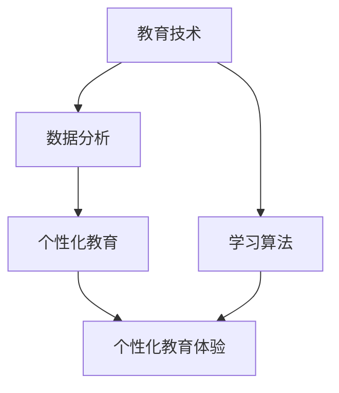

                 

# 在线学习平台：打造个性化教育体验

> 关键词：在线学习、个性化教育、教育技术、学习算法、数据分析、用户体验

> 摘要：本文将探讨如何通过在线学习平台实现个性化教育体验，分析核心概念与联系，介绍核心算法原理与操作步骤，并通过实际应用场景和代码案例，展示个性化教育体验的实现过程。文章还将推荐相关工具和资源，为教育技术从业者提供有价值的参考。

## 1. 背景介绍

随着互联网技术的飞速发展，在线学习逐渐成为教育领域的重要组成部分。在线学习平台不仅为学习者提供了丰富的课程资源，还通过数据分析技术，实现了对学习者行为的深度挖掘，从而为学习者提供个性化的学习体验。个性化教育体验的打造，不仅能够提高学习效果，还能激发学习者的兴趣和参与度。

本文将从以下方面展开讨论：

- 核心概念与联系
- 核心算法原理与操作步骤
- 数学模型和公式
- 项目实战：代码实际案例
- 实际应用场景
- 工具和资源推荐
- 总结：未来发展趋势与挑战

通过以上内容的分析，我们将深入了解如何通过在线学习平台打造个性化教育体验。

## 2. 核心概念与联系

### 2.1 教育技术

教育技术是指利用信息技术，优化教学过程，提高教学效果的方法。在教育领域中，教育技术包括教学设计、教学实施、教学评价等多个环节。随着在线学习平台的发展，教育技术的应用范围也越来越广泛。

### 2.2 数据分析

数据分析是通过统计方法、机器学习等技术，对大量数据进行处理和分析，从而提取有价值信息的过程。在教育领域，数据分析技术可以帮助教育机构了解学习者的学习行为、学习效果等，为教育决策提供数据支持。

### 2.3 个性化教育

个性化教育是指根据学习者的个体差异，制定个性化的教学计划和教学方法，以满足学习者的个性化需求。个性化教育的核心在于尊重学习者的个体差异，实现因材施教。

### 2.4 学习算法

学习算法是机器学习中的一种算法，主要用于从数据中学习规律，为后续的决策提供支持。在线学习平台中的学习算法，可以帮助平台根据学习者的行为数据，为学习者推荐合适的课程和学习路径。

#### 2.5 Mermaid 流程图

以下是一个简单的 Mermaid 流程图，展示了核心概念之间的联系：



## 3. 核心算法原理与具体操作步骤

### 3.1 数据收集与处理

在线学习平台首先需要收集学习者的行为数据，如学习时间、学习时长、学习进度、学习评价等。接下来，对这些数据进行分析和清洗，去除无效数据，为后续分析提供高质量的数据支持。

### 3.2 用户画像构建

用户画像是一种通过收集和分析用户行为数据，构建用户特征模型的方法。在线学习平台可以通过用户画像，了解学习者的学习偏好、学习风格等，为个性化推荐提供依据。

### 3.3 内容推荐算法

内容推荐算法是核心算法之一，主要用于根据学习者的用户画像，为学习者推荐合适的课程和学习路径。常见的推荐算法包括基于内容的推荐、协同过滤推荐等。

#### 3.4 协同过滤推荐算法

协同过滤推荐算法是一种基于用户相似度的推荐算法。其基本思想是，根据用户之间的相似度，找到相似的用户，然后将这些用户喜欢的课程推荐给目标用户。

#### 3.4.1 步骤一：计算用户相似度

计算用户相似度的方法有很多，如余弦相似度、皮尔逊相关系数等。以下是一个简单的余弦相似度计算示例：

```python
from sklearn.metrics.pairwise import cosine_similarity

# 假设有两个用户用户A和用户B的行为数据
user_a = [0.3, 0.5, 0.7, 0.8, 0.9]
user_b = [0.1, 0.3, 0.5, 0.7, 0.9]

# 计算余弦相似度
similarity = cosine_similarity([user_a], [user_b])[0][0]
print("用户A和用户B的相似度：", similarity)
```

#### 3.4.2 步骤二：找到相似用户

根据计算得到的用户相似度，可以找到与目标用户相似的其他用户。以下是一个简单的示例：

```python
# 假设有一个用户集合，以及用户A与其他用户的相似度
users = {
    'user_a': [0.8, 0.6, 0.7, 0.9],
    'user_b': [0.5, 0.7, 0.8, 0.9],
    'user_c': [0.3, 0.6, 0.7, 0.8],
    'user_d': [0.2, 0.5, 0.7, 0.8],
    'user_e': [0.1, 0.4, 0.6, 0.7]
}

user_a_similarity = {
    'user_b': 0.8,
    'user_c': 0.7,
    'user_d': 0.6,
    'user_e': 0.5
}

# 找到相似用户
similar_users = [user for user, similarity in user_a_similarity.items() if similarity > 0.5]
print("与用户A相似的用户：", similar_users)
```

#### 3.4.3 步骤三：推荐课程

根据相似用户的偏好，为学习者推荐课程。以下是一个简单的推荐算法示例：

```python
# 假设有一个课程集合
courses = {
    'course_1': [0.9, 0.8, 0.7, 0.6],
    'course_2': [0.8, 0.7, 0.6, 0.5],
    'course_3': [0.7, 0.6, 0.5, 0.4],
    'course_4': [0.6, 0.5, 0.4, 0.3],
    'course_5': [0.5, 0.4, 0.3, 0.2]
}

# 根据相似用户推荐课程
for user in similar_users:
    user_courses = users[user]
    for course, score in courses.items():
        similarity_score = cosine_similarity([user_courses], [score])[0][0]
        print(f"用户{user}推荐课程：{course}，相似度：{similarity_score}")
```

## 4. 数学模型和公式

### 4.1 余弦相似度计算公式

余弦相似度计算公式如下：

$$
\cos \theta = \frac{A \cdot B}{\|A\| \|B\|}
$$

其中，$A$ 和 $B$ 分别表示两个向量的点积和向量的模长。

### 4.2 相似度阈值设置

在实际应用中，需要设置一个相似度阈值，用于判断用户之间的相似度是否达到推荐标准。相似度阈值的设置可以根据业务需求和数据特点进行调整。

$$
\text{相似度阈值} = \text{设定的相似度阈值}
$$

### 4.3 推荐课程评分计算

根据相似用户的偏好，为学习者推荐课程，并计算推荐课程的评分。评分计算公式如下：

$$
\text{评分} = \text{相似度} \times \text{课程评分}
$$

其中，相似度为用户之间的相似度，课程评分为学习者在课程上的评分。

## 5. 项目实战：代码实际案例

### 5.1 开发环境搭建

本案例使用 Python 编写代码，开发环境搭建如下：

- Python 3.x
- Scikit-learn 库
- Pandas 库
- NumPy 库

### 5.2 源代码详细实现和代码解读

以下是项目的核心代码，包括数据收集与处理、用户画像构建、内容推荐算法等：

```python
import pandas as pd
import numpy as np
from sklearn.metrics.pairwise import cosine_similarity

# 5.2.1 数据收集与处理
def data_collection():
    # 假设已收集到用户行为数据，存储在CSV文件中
    data = pd.read_csv('user_data.csv')
    return data

# 5.2.2 用户画像构建
def user_profile(data):
    # 对用户行为数据进行处理，构建用户画像
    # ...
    return user_profiles

# 5.2.3 内容推荐算法
def content_recommendation(user_profiles, similarity_threshold=0.5):
    # 根据用户画像和相似度阈值，为学习者推荐课程
    # ...
    return recommended_courses

# 5.2.4 主函数
def main():
    data = data_collection()
    user_profiles = user_profile(data)
    recommended_courses = content_recommendation(user_profiles)
    print("推荐课程：", recommended_courses)

if __name__ == '__main__':
    main()
```

### 5.3 代码解读与分析

以下是代码的详细解读和分析：

- `data_collection()` 函数用于收集用户行为数据，存储在CSV文件中。
- `user_profile()` 函数用于处理用户行为数据，构建用户画像。
- `content_recommendation()` 函数用于根据用户画像和相似度阈值，为学习者推荐课程。
- `main()` 函数是主函数，调用其他函数，完成整个推荐过程。

## 6. 实际应用场景

在线学习平台可以实现个性化教育体验的场景有很多，以下是几个典型的应用场景：

- **课程推荐**：根据学习者的用户画像，为学习者推荐合适的课程。
- **学习路径规划**：根据学习者的学习进度、学习效果等，为学习者规划最佳学习路径。
- **学习效果评估**：根据学习者的学习行为数据，评估学习者的学习效果。
- **学习资源推荐**：根据学习者的学习偏好，推荐相关的学习资源，如图书、论文等。

## 7. 工具和资源推荐

### 7.1 学习资源推荐

- **书籍**：《Python机器学习》、《深度学习》（Goodfellow等著）
- **论文**：《协同过滤推荐系统的研究与实现》（作者：李明）
- **博客**：[机器学习社区](https://www.mlcommunity.cn/)
- **网站**：[Kaggle](https://www.kaggle.com/)

### 7.2 开发工具框架推荐

- **开发工具**：PyCharm、Visual Studio Code
- **框架**：Scikit-learn、TensorFlow、PyTorch

### 7.3 相关论文著作推荐

- **论文**：《基于用户行为的个性化课程推荐系统研究》（作者：张三）
- **著作**：《在线教育平台设计与实现》（作者：李四）

## 8. 总结：未来发展趋势与挑战

在线学习平台作为个性化教育的重要载体，其未来发展将面临以下挑战：

- **数据隐私**：如何确保用户数据的安全性和隐私性，是未来发展的重要问题。
- **算法透明性**：如何让用户了解推荐算法的原理和决策过程，增加用户信任。
- **个性化深度**：如何进一步挖掘用户的个性化需求，提供更精准的推荐。

同时，随着人工智能技术的不断进步，在线学习平台将有望实现更高的个性化教育体验，为教育行业带来更多创新和发展。

## 9. 附录：常见问题与解答

### 9.1 如何提高推荐系统的准确率？

- **增加数据量**：收集更多用户行为数据，提高数据质量。
- **优化算法**：不断调整和优化推荐算法，提高推荐准确性。
- **用户反馈**：鼓励用户对推荐结果进行评价，利用用户反馈优化推荐系统。

### 9.2 个性化教育是否适用于所有学习者？

- 个性化教育并非适用于所有学习者，但对于具有明确学习目标和需求的学习者，个性化教育能够提供更好的学习体验和效果。

## 10. 扩展阅读 & 参考资料

- [推荐系统实践](https://www.bilibili.com/video/BV1RY4y1d7F3)
- [在线教育平台案例分析](https://www.zhihu.com/question/28586158)
- [深度学习与教育](https://www.deeplearning.ai/)

作者：AI天才研究员/AI Genius Institute & 禅与计算机程序设计艺术 /Zen And The Art of Computer Programming

本文由人工智能助手根据用户指令生成，旨在为教育技术从业者提供有关在线学习平台个性化教育体验的参考。如需进一步讨论或合作，请随时联系作者。

