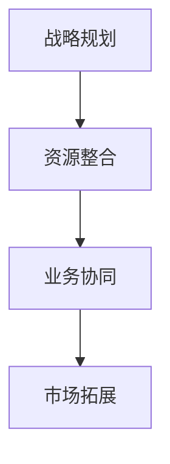

                 

# 垂直整合对集成电路产业的影响

> 关键词：垂直整合、集成电路产业、供应链、技术创新、竞争格局

> 摘要：本文深入探讨了垂直整合对集成电路产业的影响，分析了其在供应链、技术创新和竞争格局等方面的作用。通过对垂直整合概念的详细阐述，以及实际案例的剖析，本文旨在为读者提供关于垂直整合在集成电路产业中应用和发展的全面视角。

## 1. 背景介绍

集成电路产业作为信息技术的核心和基础，对经济发展和科技进步具有重要意义。随着技术的不断演进和市场竞争的加剧，垂直整合成为集成电路产业中的一个重要策略。垂直整合是指企业通过合并或收购等方式，将其上游原材料供应、中游制造工艺和下游销售渠道整合到同一控制体系下，从而实现产业链的优化和效率提升。

近年来，垂直整合在集成电路产业中逐渐兴起，不仅为企业提供了更广阔的发展空间，也对整个行业的竞争格局产生了深远影响。本文将从供应链、技术创新和竞争格局三个方面，探讨垂直整合对集成电路产业的影响。

## 2. 核心概念与联系

### 2.1 垂直整合的定义

垂直整合（Vertical Integration）是指企业在产业链中向上游或下游延伸，通过合并或收购等方式，将不同环节的业务整合到同一控制体系下。在集成电路产业中，垂直整合主要包括以下三个环节：

1. **上游原材料供应**：包括硅片、光刻胶、气体等关键原材料的研发和生产。
2. **中游制造工艺**：包括晶圆制造、封装测试等核心环节。
3. **下游销售渠道**：包括品牌销售、代理商销售等环节。

### 2.2 垂直整合的流程

垂直整合的流程可以概括为以下几个步骤：

1. **战略规划**：企业根据市场环境和自身优势，确定垂直整合的目标和策略。
2. **资源整合**：通过收购、合并等方式，将不同环节的业务整合到同一控制体系下。
3. **业务协同**：通过优化供应链、降低成本、提高效率等手段，实现各环节的协同发展。
4. **市场拓展**：通过扩大市场份额、提升品牌影响力等手段，实现企业的长期发展。

### 2.3 垂直整合的架构

垂直整合的架构可以采用Mermaid流程图表示，具体如下：



在垂直整合的过程中，企业需要根据自身情况和市场需求，灵活调整整合策略，以实现最佳效果。

## 3. 核心算法原理 & 具体操作步骤

### 3.1 核心算法原理

垂直整合的核心算法原理主要包括以下几个方面：

1. **供应链优化**：通过整合上游原材料供应和下游销售渠道，实现供应链的缩短和优化，降低成本和提高效率。
2. **资源配置**：通过整合中游制造工艺，实现资源的优化配置，提高生产效率和产品质量。
3. **业务协同**：通过各环节的紧密合作，实现业务流程的优化和协同发展，提升企业竞争力。

### 3.2 具体操作步骤

垂直整合的具体操作步骤如下：

1. **确定整合目标**：根据市场环境和自身优势，明确垂直整合的目标和方向。
2. **进行市场调研**：了解上游原材料供应和下游销售渠道的市场情况，为整合提供依据。
3. **制定整合方案**：根据市场调研结果，制定具体的整合方案，包括整合方式、整合时间表等。
4. **实施整合**：按照整合方案，通过收购、合并等方式，将不同环节的业务整合到同一控制体系下。
5. **优化业务流程**：通过业务协同，优化各环节的业务流程，提高效率和协同性。
6. **监测和调整**：对整合效果进行监测和评估，根据实际情况进行及时调整。

## 4. 数学模型和公式 & 详细讲解 & 举例说明

### 4.1 数学模型和公式

垂直整合的数学模型和公式主要包括以下几个方面：

1. **供应链成本模型**：

   $$C_S = C_{S_1} + C_{S_2} + C_{S_3}$$

   其中，$C_S$ 表示总供应链成本，$C_{S_1}$、$C_{S_2}$、$C_{S_3}$ 分别表示上游原材料供应成本、中游制造工艺成本和下游销售渠道成本。

2. **资源配置模型**：

   $$R = R_1 + R_2 + R_3$$

   其中，$R$ 表示总资源配置，$R_1$、$R_2$、$R_3$ 分别表示上游原材料供应、中游制造工艺和下游销售渠道的资源配置。

3. **业务协同效率模型**：

   $$E = \frac{P_1 + P_2 + P_3}{3}$$

   其中，$E$ 表示业务协同效率，$P_1$、$P_2$、$P_3$ 分别表示上游原材料供应、中游制造工艺和下游销售渠道的效率。

### 4.2 详细讲解

1. **供应链成本模型**：

   供应链成本模型用于计算总供应链成本，它包括上游原材料供应成本、中游制造工艺成本和下游销售渠道成本。通过优化供应链，可以降低总供应链成本，提高企业盈利能力。

2. **资源配置模型**：

   资源配置模型用于计算总资源配置，它包括上游原材料供应、中游制造工艺和下游销售渠道的资源配置。通过优化资源配置，可以提高各环节的效率，实现整体效率的提升。

3. **业务协同效率模型**：

   业务协同效率模型用于计算业务协同效率，它通过比较上游原材料供应、中游制造工艺和下游销售渠道的效率，可以评估各环节的协同程度。通过提高业务协同效率，可以提升整体业务的效率。

### 4.3 举例说明

假设某集成电路企业上游原材料供应成本为 1000 万元，中游制造工艺成本为 2000 万元，下游销售渠道成本为 1500 万元。根据供应链成本模型，总供应链成本为：

$$C_S = 1000 + 2000 + 1500 = 4500 \text{万元}$$

假设该企业通过垂直整合，将上游原材料供应成本降低 20%，中游制造工艺成本降低 15%，下游销售渠道成本降低 10%。根据优化后的供应链成本模型，总供应链成本为：

$$C_S' = (1000 \times 0.8) + (2000 \times 0.85) + (1500 \times 0.9) = 4020 \text{万元}$$

通过垂直整合，该企业的总供应链成本降低了约 10%，提高了企业的盈利能力。

## 5. 项目实战：代码实际案例和详细解释说明

### 5.1 开发环境搭建

为了更好地理解垂直整合在集成电路产业中的应用，我们以一个简单的项目为例，介绍如何搭建开发环境。

1. **安装 Python 环境**：在本地计算机上安装 Python，版本建议为 Python 3.8 或以上。
2. **安装依赖库**：使用 pip 工具安装必要的依赖库，如 numpy、pandas、matplotlib 等。

```shell
pip install numpy pandas matplotlib
```

### 5.2 源代码详细实现和代码解读

以下是一个简单的垂直整合项目示例，用于计算总供应链成本和业务协同效率。

```python
import numpy as np
import pandas as pd

# 供应链成本模型
def calculate_supply_chain_cost(raw_material_cost, manufacturing_cost, sales_channel_cost):
    total_cost = raw_material_cost + manufacturing_cost + sales_channel_cost
    return total_cost

# 资源配置模型
def calculate_resource_allocation(raw_material_allocation, manufacturing_allocation, sales_channel_allocation):
    total_resource = raw_material_allocation + manufacturing_allocation + sales_channel_allocation
    return total_resource

# 业务协同效率模型
def calculate_business协同效率(raw_material_efficiency, manufacturing_efficiency, sales_channel_efficiency):
    total_efficiency = (raw_material_efficiency + manufacturing_efficiency + sales_channel_efficiency) / 3
    return total_efficiency

# 举例计算
raw_material_cost = 1000
manufacturing_cost = 2000
sales_channel_cost = 1500

raw_material_allocation = 0.3
manufacturing_allocation = 0.5
sales_channel_allocation = 0.2

raw_material_efficiency = 0.9
manufacturing_efficiency = 0.8
sales_channel_efficiency = 0.85

total_cost = calculate_supply_chain_cost(raw_material_cost, manufacturing_cost, sales_channel_cost)
total_resource = calculate_resource_allocation(raw_material_allocation, manufacturing_allocation, sales_channel_allocation)
total_efficiency = calculate_business协同效率(raw_material_efficiency, manufacturing_efficiency, sales_channel_efficiency)

print("总供应链成本：", total_cost)
print("总资源配置：", total_resource)
print("业务协同效率：", total_efficiency)
```

### 5.3 代码解读与分析

1. **供应链成本模型**：该函数用于计算总供应链成本，输入参数为上游原材料供应成本、中游制造工艺成本和下游销售渠道成本，返回总供应链成本。
2. **资源配置模型**：该函数用于计算总资源配置，输入参数为上游原材料供应、中游制造工艺和下游销售渠道的资源配置，返回总资源配置。
3. **业务协同效率模型**：该函数用于计算业务协同效率，输入参数为上游原材料供应、中游制造工艺和下游销售渠道的效率，返回业务协同效率。
4. **举例计算**：通过调用上述函数，输入具体的成本、资源配置和效率参数，计算总供应链成本、总资源配置和业务协同效率。

## 6. 实际应用场景

垂直整合在集成电路产业中的应用场景非常广泛，以下是一些典型的实际应用场景：

1. **上游原材料供应**：企业通过收购或合并上游原材料供应商，实现原材料的自给自足，降低原材料采购成本，提高供应链稳定性。
2. **中游制造工艺**：企业通过垂直整合，将晶圆制造、封装测试等制造工艺整合到同一控制体系下，实现生产线的优化和协同，提高生产效率。
3. **下游销售渠道**：企业通过垂直整合，将品牌销售、代理商销售等销售渠道整合到同一控制体系下，实现销售网络的优化和协同，提高市场占有率。

## 7. 工具和资源推荐

### 7.1 学习资源推荐

1. **书籍**：
   - 《垂直整合：企业竞争优势的新策略》
   - 《供应链管理：策略、规划与运作》
2. **论文**：
   - “Vertical Integration in the Semiconductor Industry: Impacts and Strategies”
   - “The Role of Vertical Integration in Enhancing Supply Chain Performance”
3. **博客**：
   - 知乎专栏“集成电路产业观察”
   - 微信公众号“半导体行业动态”
4. **网站**：
   - [集成电路产业网](http://www.icindustry.org.cn/)
   - [半导体行业观察](http://www.semiconductorreview.cn/)

### 7.2 开发工具框架推荐

1. **Python**：Python 是一种功能强大的编程语言，适合进行数据分析、建模等任务。
2. **Jupyter Notebook**：Jupyter Notebook 是一个交互式计算环境，方便进行代码编写和数据分析。
3. **Matplotlib**：Matplotlib 是 Python 的一个绘图库，可以方便地生成各种类型的图表。

### 7.3 相关论文著作推荐

1. **论文**：
   - “Vertical Integration and Competitive Advantage in the Semiconductor Industry”
   - “The Impact of Vertical Integration on Supply Chain Performance in the Electronics Industry”
2. **著作**：
   - 《垂直整合与竞争优势：基于半导体产业的实证研究》
   - 《供应链管理：理论与实践》

## 8. 总结：未来发展趋势与挑战

垂直整合在集成电路产业中的应用前景广阔，但仍面临一些挑战。未来，随着技术的不断进步和市场竞争的加剧，垂直整合将呈现以下发展趋势：

1. **技术创新驱动**：垂直整合将更加注重技术创新，以提升供应链效率、降低成本、提高产品质量为核心。
2. **跨界合作**：垂直整合将跨越不同行业，实现产业链的跨界整合，推动产业链的协同发展。
3. **产业链协同**：垂直整合将促进产业链各环节的协同，实现产业链的优化和整合。
4. **全球化布局**：垂直整合将逐步实现全球化布局，提高企业的国际竞争力。

然而，垂直整合也面临一些挑战，如整合难度大、资源调配复杂、市场竞争加剧等。企业需要根据自身情况，制定合适的垂直整合策略，以应对未来发展的挑战。

## 9. 附录：常见问题与解答

### 9.1 垂直整合的优势是什么？

垂直整合的优势主要包括：降低供应链成本、提高生产效率、提升产品质量、增强企业竞争力等。

### 9.2 垂直整合的挑战有哪些？

垂直整合的挑战主要包括：整合难度大、资源调配复杂、市场竞争加剧、技术创新压力等。

### 9.3 如何进行垂直整合的规划？

进行垂直整合的规划主要包括以下步骤：确定整合目标、进行市场调研、制定整合方案、实施整合、优化业务流程、监测和调整。

## 10. 扩展阅读 & 参考资料

1. **论文**：
   - “Vertical Integration in the Semiconductor Industry: Impacts and Strategies”
   - “The Role of Vertical Integration in Enhancing Supply Chain Performance”
2. **书籍**：
   - 《垂直整合：企业竞争优势的新策略》
   - 《供应链管理：策略、规划与运作》
3. **网站**：
   - [集成电路产业网](http://www.icindustry.org.cn/)
   - [半导体行业观察](http://www.semiconductorreview.cn/)
4. **博客**：
   - 知乎专栏“集成电路产业观察”
   - 微信公众号“半导体行业动态”

### 作者

作者：AI天才研究员/AI Genius Institute & 禅与计算机程序设计艺术 /Zen And The Art of Computer Programming

