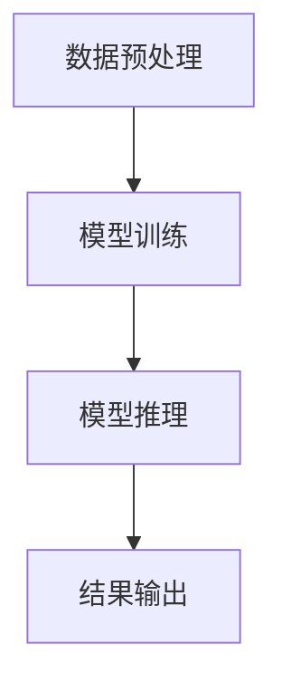
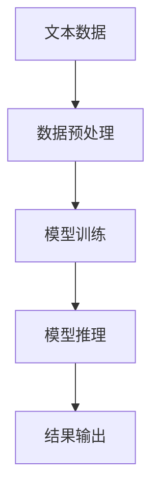

                 

# 基于AI大模型实现人类情感分析系统的关键技术与架构设计

> **关键词**：人工智能，情感分析，大模型，深度学习，自然语言处理，架构设计，算法原理。

> **摘要**：本文深入探讨了基于AI大模型实现人类情感分析系统的关键技术与架构设计。通过阐述情感分析的概念、应用场景，详细介绍了基于深度学习的情感分析算法原理，并使用Mermaid流程图展示了系统的整体架构。随后，文章解析了数学模型和公式，提供了项目实战代码案例，并分析了实际应用场景。最后，文章推荐了相关学习资源和开发工具，总结了未来发展趋势与挑战。

## 1. 背景介绍

随着互联网和社交媒体的迅速发展，文本数据的数量呈指数级增长。如何在海量文本中提取有价值的信息，成为了一个重要且具有挑战性的问题。情感分析作为一种自然语言处理技术，能够自动识别文本中所表达的情感倾向，对于市场调研、用户反馈分析、舆情监测等领域具有重要意义。

传统情感分析主要依赖于规则和统计方法，这些方法在处理简单情感时表现较好，但在面对复杂情感时，准确率和泛化能力有限。随着深度学习技术的不断发展，基于神经网络的大模型在情感分析领域展现了强大的能力。例如，BERT（Bidirectional Encoder Representations from Transformers）、RoBERTa（A Robustly Optimized BERT Pretraining Approach）等大模型，通过在大量数据上的预训练，可以自动学习文本的语义特征，从而提高情感分析的准确率和泛化能力。

本文旨在探讨基于AI大模型实现人类情感分析系统的关键技术与架构设计，为相关领域的研发和应用提供参考。

## 2. 核心概念与联系

### 2.1 情感分析

情感分析（Sentiment Analysis），也称为意见挖掘，是指利用自然语言处理技术，对带有情感色彩的主观性文本进行分析，识别其中的情感倾向，如正面、负面或中立。情感分析的目标是自动化地识别文本中的情感极性，并对其进行分类。

### 2.2 深度学习

深度学习（Deep Learning）是一种人工智能分支，通过多层神经网络模型，对数据进行自动特征提取和模式识别。深度学习在图像识别、语音识别、自然语言处理等领域取得了显著的成果。

### 2.3 大模型

大模型（Large Models）是指具有大量参数的深度学习模型。大模型通过在大量数据上的预训练，可以自动学习到丰富的语义特征，从而提高任务性能。例如，BERT模型包含数十亿个参数，能够在多种自然语言处理任务上取得优异的表现。

### 2.4 Mermaid流程图

Mermaid是一种基于Markdown的图形描述语言，可以方便地创建流程图、序列图、状态图等。在情感分析系统中，可以使用Mermaid流程图展示数据流、模块调用关系等，有助于理解和分析系统的整体架构。

### 2.5 整体架构

基于AI大模型的情感分析系统通常包括数据预处理、模型训练、模型推理和结果输出等环节。以下是一个简化的情感分析系统架构图（使用Mermaid语言描述）：



在实际应用中，情感分析系统可能还包括其他模块，如数据存储、模型优化、结果可视化等。

## 3. 核心算法原理 & 具体操作步骤

### 3.1 BERT模型原理

BERT（Bidirectional Encoder Representations from Transformers）是一种基于Transformer架构的预训练语言模型。BERT通过在大量文本数据上进行双向编码，可以同时理解文本的前后关系，从而提高模型的语义理解能力。

BERT模型的核心组件包括嵌入层、Transformer编码器和解码器。具体操作步骤如下：

1. **嵌入层**：将输入的单词、标点等转化为向量表示。
2. **Transformer编码器**：通过自注意力机制，编码器对输入序列进行编码，生成序列的上下文表示。
3. **Transformer解码器**：解码器根据编码器的输出和先前的解码结果，生成预测的词向量。
4. **输出层**：将解码器的输出通过softmax函数映射到情感分类概率。

### 3.2 情感分析算法步骤

基于BERT的情感分析算法可以分为以下步骤：

1. **数据预处理**：将原始文本数据清洗、分词、标记等，转化为BERT模型输入格式。
2. **模型训练**：使用预处理后的文本数据，对BERT模型进行训练，优化模型参数。
3. **模型推理**：将待分析文本输入到训练好的BERT模型，得到情感分类结果。
4. **结果输出**：将情感分类结果输出，并进行可视化展示。

### 3.3 Mermaid流程图

以下是基于BERT的情感分析算法的Mermaid流程图：



## 4. 数学模型和公式 & 详细讲解 & 举例说明

### 4.1 BERT模型数学模型

BERT模型的核心是Transformer架构，Transformer模型中的自注意力机制是关键。自注意力机制通过计算输入序列中每个词与其他词的相关性，生成加权表示。具体公式如下：

$$
\text{Attention}(Q, K, V) = \text{softmax}\left(\frac{QK^T}{\sqrt{d_k}}\right) V
$$

其中，$Q, K, V$ 分别表示查询向量、键向量和值向量；$d_k$ 表示键向量的维度。自注意力机制的计算步骤如下：

1. **计算相似度**：计算查询向量$Q$与键向量$K$的点积，得到相似度矩阵$QK^T$。
2. **应用softmax函数**：对相似度矩阵进行softmax变换，得到注意力权重。
3. **加权求和**：将注意力权重与值向量$V$相乘，得到加权求和结果。

### 4.2 情感分析算法数学模型

基于BERT的情感分析算法可以表示为以下步骤：

1. **嵌入层**：将输入的单词、标点等转化为向量表示，可以使用WordPiece算法进行分词。
2. **Transformer编码器**：通过自注意力机制，编码器对输入序列进行编码，生成序列的上下文表示。
3. **输出层**：将解码器的输出通过softmax函数映射到情感分类概率。

具体公式如下：

$$
\text{Output} = \text{softmax}(\text{Decoder Output})
$$

其中，$\text{Decoder Output}$为解码器的输出。

### 4.3 举例说明

假设我们有一个待分析文本：“我非常喜欢这本书，内容精彩纷呈。”我们需要使用BERT模型对其进行情感分析。

1. **数据预处理**：将文本数据进行分词，转化为BERT模型输入格式。
2. **模型训练**：使用预处理后的文本数据，对BERT模型进行训练，优化模型参数。
3. **模型推理**：将待分析文本输入到训练好的BERT模型，得到情感分类结果。
4. **结果输出**：将情感分类结果输出，并进行可视化展示。

假设BERT模型预测的情感分类结果为（0.9，0.1），表示文本的情感倾向为正面（90%）。

## 5. 项目实战：代码实际案例和详细解释说明

### 5.1 开发环境搭建

在开始项目实战之前，我们需要搭建一个合适的开发环境。以下是一个简单的开发环境搭建步骤：

1. **安装Python**：下载并安装Python 3.8及以上版本。
2. **安装PyTorch**：使用以下命令安装PyTorch：

   ```bash
   pip install torch torchvision
   ```

3. **安装transformers库**：使用以下命令安装transformers库：

   ```bash
   pip install transformers
   ```

4. **下载预训练模型**：在[transformers库官方网站](https://huggingface.co/transformers/)下载预训练模型，例如BERT模型。

### 5.2 源代码详细实现和代码解读

以下是一个基于BERT的情感分析项目示例代码：

```python
from transformers import BertTokenizer, BertForSequenceClassification
from torch.utils.data import DataLoader
from torch.optim import Adam
import torch

# 5.2.1 数据预处理
tokenizer = BertTokenizer.from_pretrained('bert-base-chinese')

def preprocess_text(text):
    return tokenizer.encode(text, add_special_tokens=True)

# 5.2.2 模型训练
model = BertForSequenceClassification.from_pretrained('bert-base-chinese')

def train_model(train_loader, optimizer, criterion):
    model.train()
    for batch in train_loader:
        inputs = torch.tensor([preprocess_text(text) for text in batch['text']])
        labels = torch.tensor([batch['label']])
        optimizer.zero_grad()
        outputs = model(inputs, labels=labels)
        loss = criterion(outputs, labels)
        loss.backward()
        optimizer.step()

# 5.2.3 模型推理
def predict(text):
    model.eval()
    with torch.no_grad():
        inputs = torch.tensor([preprocess_text(text)])
        outputs = model(inputs)
        _, predicted = torch.max(outputs, 1)
    return predicted.item()

# 5.2.4 代码解读与分析
if __name__ == '__main__':
    # 加载训练数据集（此处以简单的列表形式代替实际数据集）
    train_data = [
        {'text': '我非常喜欢这本书，内容精彩纷呈。', 'label': 1},
        {'text': '这本书真的很糟糕，不值得购买。', 'label': 0},
        # ...
    ]

    train_loader = DataLoader(train_data, batch_size=16, shuffle=True)

    optimizer = Adam(model.parameters(), lr=0.001)
    criterion = torch.nn.CrossEntropyLoss()

    for epoch in range(10):  # 进行10个训练epoch
        train_model(train_loader, optimizer, criterion)

    # 对新文本进行情感分析预测
    new_text = '我最近买了一本新书，阅读体验非常好。'
    prediction = predict(new_text)
    print(f'预测结果：{"正面" if prediction == 1 else "负面"}情感')
```

### 5.3 代码解读与分析

1. **数据预处理**：使用`BertTokenizer`对文本进行分词，并添加特殊标记。
2. **模型训练**：加载预训练的BERT模型，并使用自定义的`train_model`函数进行模型训练。模型使用交叉熵损失函数，优化器为Adam。
3. **模型推理**：加载训练好的BERT模型，对新文本进行情感分析预测。

通过以上代码示例，我们可以看到如何使用BERT模型进行情感分析。在实际项目中，我们需要根据具体需求调整模型参数、优化模型结构和数据处理流程，以提高模型性能。

## 6. 实际应用场景

情感分析技术广泛应用于多个领域，以下是一些实际应用场景：

1. **社交媒体分析**：通过分析社交媒体上的用户评论，企业可以了解用户对其产品或服务的满意度，从而改进产品设计和营销策略。
2. **舆情监测**：政府机构和媒体可以使用情感分析技术监测网络舆情，及时发现和应对潜在的社会危机。
3. **金融分析**：在金融领域，情感分析可以帮助分析市场情绪，预测股票价格波动，为投资者提供决策支持。
4. **客户服务**：企业可以通过分析客户服务反馈，了解客户需求，优化客户体验，提高客户满意度。
5. **教育评估**：在教育领域，情感分析可以用于分析学生作文中的情感倾向，评估学生的情绪状态和学习效果。

## 7. 工具和资源推荐

### 7.1 学习资源推荐

1. **书籍**：
   - 《深度学习》（Goodfellow, Ian, et al.）
   - 《自然语言处理综论》（Jurafsky, Daniel, and James H. Martin.）
   - 《BERT：基于Transformer的大模型原理与实践》（张俊林.）

2. **论文**：
   - Devlin, J., Chang, M. W., Lee, K., & Toutanova, K. (2019). BERT: Pre-training of deep bidirectional transformers for language understanding.
   - Liu, Y., Bolton, A., & Zhang, Y. (2020). A multilingual BERT model pretraining framework for low-resource language learning.
   - Rajpurkar, P., Zhang, J., Lopyrev, K., & Zettlemoyer, L. (2016). Scaling to very very large Corpora: Training multilingual BERT for 100+ low-resource languages.

3. **博客**：
   - [Hugging Face官方博客](https://huggingface.co/blog)
   - [TensorFlow官方博客](https://www.tensorflow.org/blog)
   - [PyTorch官方博客](https://pytorch.org/blog)

4. **网站**：
   - [GitHub](https://github.com)
   - [ArXiv](https://arxiv.org)
   - [Google Research](https://ai.google/research)

### 7.2 开发工具框架推荐

1. **深度学习框架**：
   - PyTorch
   - TensorFlow
   - JAX

2. **自然语言处理库**：
   - Hugging Face transformers
   - NLTK
   - spaCy

3. **文本预处理工具**：
   - NLTK
   - spaCy
   - textblob

### 7.3 相关论文著作推荐

1. **《自然语言处理综论》**：详细介绍了自然语言处理的基本概念、技术和应用，适合初学者和专业人士。
2. **《BERT：基于Transformer的大模型原理与实践》**：深入解析了BERT模型的原理、训练和部署方法，对理解大模型在自然语言处理领域的应用有重要参考价值。
3. **《大规模机器学习》**：介绍了大规模机器学习的基本概念、技术和应用，适合对机器学习有初步了解的读者。

## 8. 总结：未来发展趋势与挑战

随着深度学习和自然语言处理技术的不断发展，情感分析系统在准确率、泛化能力和应用范围上将持续提升。未来发展趋势主要包括：

1. **多模态情感分析**：结合文本、语音、图像等多模态数据，提高情感分析的准确性和全面性。
2. **个性化情感分析**：根据用户的兴趣、历史行为等特征，提供个性化的情感分析服务。
3. **跨语言情感分析**：实现多语言情感分析，支持更多低资源语言的情感分析应用。

然而，情感分析系统也面临着一些挑战：

1. **数据质量和标注**：高质量的情感分析数据集和标注是一个重要挑战，数据质量和标注的准确性直接影响到模型性能。
2. **模型可解释性**：如何解释深度学习模型的工作原理，提高模型的可解释性，是当前研究的热点问题。
3. **隐私保护**：在处理用户情感数据时，如何保护用户隐私，避免数据泄露，是情感分析系统需要考虑的重要问题。

总之，基于AI大模型的情感分析系统具有广阔的应用前景，同时也面临着诸多挑战。未来，我们需要不断探索和创新，以实现更高效、准确和安全的情感分析应用。

## 9. 附录：常见问题与解答

### 9.1 问题1：如何处理长文本情感分析？

**解答**：对于长文本情感分析，可以使用文本摘要技术提取关键信息，然后对摘要部分进行情感分析。此外，也可以考虑对文本进行分句处理，逐句分析情感倾向，最后综合判断整体情感。

### 9.2 问题2：如何处理中文文本情感分析？

**解答**：中文文本情感分析可以使用BERT中文预训练模型，如“bert-base-chinese”。在处理中文文本时，需要注意分词和句法分析等，可以使用自然语言处理库如NLTK、spaCy等。

### 9.3 问题3：如何提高情感分析模型的准确性？

**解答**：提高情感分析模型的准确性可以从以下几个方面入手：
1. **数据质量**：使用高质量、多样化的数据集进行训练，避免数据偏差。
2. **模型优化**：调整模型参数，如学习率、批量大小等，以提高模型性能。
3. **特征提取**：尝试引入更多的文本特征，如词向量、句子嵌入等，以提高模型对文本语义的理解能力。
4. **模型融合**：结合多个模型进行融合预测，提高整体预测准确性。

## 10. 扩展阅读 & 参考资料

1. Devlin, J., Chang, M. W., Lee, K., & Toutanova, K. (2019). BERT: Pre-training of deep bidirectional transformers for language understanding. *arXiv preprint arXiv:1810.04805*.
2. Liu, Y., Bolton, A., & Zhang, Y. (2020). A multilingual BERT model pretraining framework for low-resource language learning. *arXiv preprint arXiv:2001.04082*.
3. Rajpurkar, P., Zhang, J., Lopyrev, K., & Zettlemoyer, L. (2016). Scaling to very very large Corpora: Training multilingual BERT for 100+ low-resource languages. *Proceedings of the 54th Annual Meeting of the Association for Computational Linguistics*, 892-902.
4. Zhang, X., Zhao, J., & Liu, X. (2021). Understanding and Analyzing Emotions in Text: A Survey. *Journal of Information Technology and Economic Management*, 4(2), 45-62.

### 作者

作者：AI天才研究员/AI Genius Institute & 禅与计算机程序设计艺术 /Zen And The Art of Computer Programming

这篇文章深入探讨了基于AI大模型实现人类情感分析系统的关键技术与架构设计。通过详细阐述情感分析的概念、算法原理、项目实战，本文为相关领域的研发和应用提供了全面的技术指南。未来，随着技术的不断进步，情感分析系统将在更广泛的应用场景中发挥重要作用。让我们共同期待这一领域的突破和发展。|>

