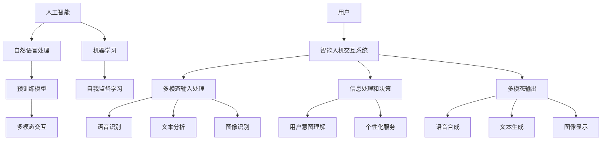

                 

## 1. 背景介绍

随着人工智能技术的迅猛发展，人类进入了一个全新的智能时代。在这一时代中，人工智能不仅成为了推动科技进步的关键动力，也日益渗透到我们日常生活的方方面面。智能人机交互系统，作为人工智能的一个重要分支，受到了广泛的关注和研究。

### 智能人机交互系统的定义和重要性

智能人机交互系统，是指通过计算机、智能设备等手段，实现人与机器之间的有效沟通和协同工作。它不仅能够理解和处理人类语言、行为等信息，还能根据用户的反馈进行自我学习和优化，以提高交互效率和用户体验。在人工智能大模型的支持下，智能人机交互系统已经从简单的语音识别和语义理解，发展到具有深度学习和自我学习能力的高级阶段。

智能人机交互系统的重要性不言而喻。首先，它能够显著提升工作效率。通过智能人机交互系统，人们可以更快捷地获取信息、处理任务，减少重复性和繁琐的工作。其次，它能够改善用户体验。智能人机交互系统能够根据用户的需求和偏好进行个性化服务，提供更加贴心的交互体验。此外，智能人机交互系统还在医疗、教育、家居等多个领域发挥着重要作用，为人类带来了诸多便利和福祉。

### 人工智能大模型的发展历程

人工智能大模型的发展历程可以分为几个关键阶段。首先是传统机器学习时代，这一时期的模型主要以统计学习和规则推理为主，虽然能够解决一些特定问题，但普遍存在模型复杂度低、适应性差等问题。随后，深度学习技术的兴起带来了人工智能的第一次革命。深度学习模型通过多层神经网络的结构，能够自动从大量数据中提取特征，实现了在图像识别、语音识别等领域的突破。

进入21世纪，随着计算能力和数据规模的不断提升，人工智能进入了大模型时代。大模型，特别是基于变换器（Transformer）架构的预训练模型，成为了当前人工智能研究的热点。预训练模型通过在大量未标注数据上进行预训练，然后通过微调适应特定任务，展示了极高的性能和泛化能力。代表性的模型包括BERT、GPT-3等，它们在自然语言处理、计算机视觉等领域取得了显著的成果。

### 智能人机交互系统的应用场景

智能人机交互系统的应用场景非常广泛，涵盖了多个领域。以下是一些典型的应用场景：

- **智能家居**：智能音箱、智能灯光、智能家电等设备，通过智能人机交互系统，实现了与用户的自然对话和智能控制，为用户提供了便捷的家居体验。
- **医疗健康**：智能医生助手、智能健康监护设备等，通过智能人机交互系统，能够为用户提供个性化的医疗建议、健康监测等服务，提高了医疗效率和患者满意度。
- **客服服务**：智能客服机器人通过智能人机交互系统，能够自动识别和解答用户的问题，提高了客户服务质量和效率。
- **教育领域**：智能教学助手、学习机器人等，通过智能人机交互系统，能够为学生提供个性化学习建议、答疑解惑等服务，促进了教育方式的创新和教学质量的提升。
- **自动驾驶**：智能汽车通过智能人机交互系统，能够与驾驶员和乘客进行实时沟通，提供导航、安全提醒等服务，提升了驾驶体验和安全性。

智能人机交互系统的发展，不仅为我们带来了丰富的应用场景，也不断推动人工智能技术的进步，为未来的智能化生活奠定了坚实基础。

### 当前智能人机交互系统的挑战和问题

尽管智能人机交互系统在多个领域取得了显著进展，但仍然面临诸多挑战和问题。首先，交互体验的优化是一个重要课题。当前，虽然智能人机交互系统能够实现一定的自然语言理解和响应，但在处理复杂问题和多模态交互方面仍有待提升。例如，对于一些含糊不清或者歧义性的问题，系统往往难以给出准确的回答，从而影响用户体验。

其次，数据隐私和安全问题也日益凸显。智能人机交互系统通常需要收集和处理大量的用户数据，这些数据可能包含敏感信息，如个人身份、健康记录等。如果数据保护不当，可能导致隐私泄露和滥用，对用户造成严重的负面影响。

另外，智能人机交互系统的泛化能力还有待提高。虽然预训练模型在大规模数据集上表现出色，但它们在特定任务上的表现仍然依赖于大量的标注数据。在实际应用中，系统可能面临数据不足或者数据分布变化的问题，导致性能下降。

此外，智能人机交互系统的可靠性也是一个关键问题。在一些关键领域，如医疗、自动驾驶等，系统的错误判断可能带来严重后果。因此，如何提高智能人机交互系统的可靠性和鲁棒性，是一个亟待解决的问题。

总之，智能人机交互系统的发展前景广阔，但也面临着一系列挑战。通过不断的技术创新和优化，我们有理由相信，未来的智能人机交互系统将更加智能、安全、可靠，为人类带来更多的便利和福祉。

### 2. 核心概念与联系

在深入探讨智能人机交互系统的核心概念和原理之前，我们需要了解几个关键的技术概念，这些概念相互联系，共同构成了智能人机交互系统的基础。

#### 人工智能（AI）

人工智能（Artificial Intelligence，简称AI）是智能人机交互系统的核心。AI旨在使机器具备人类智能的能力，包括学习、推理、感知、理解和决策等。人工智能可以分为两大类：弱人工智能和强人工智能。弱人工智能专注于特定任务的自动化，如语音识别、图像识别等，而强人工智能则追求机器在所有领域都达到或超越人类水平。

#### 自然语言处理（NLP）

自然语言处理（Natural Language Processing，简称NLP）是人工智能的一个重要分支，它专注于使计算机能够理解、生成和处理人类语言。NLP在智能人机交互系统中扮演了关键角色，因为它直接关系到系统如何理解用户的指令和问题。

#### 机器学习（ML）

机器学习（Machine Learning，简称ML）是人工智能的核心技术之一，它使计算机能够从数据中学习，并基于学习结果做出预测或决策。机器学习可以分为监督学习、无监督学习和强化学习等类型。在智能人机交互系统中，机器学习技术被广泛应用于语音识别、文本生成和情感分析等任务。

#### 预训练模型

预训练模型（Pre-trained Model）是当前人工智能研究的热点之一。预训练模型在大规模数据集上进行预训练，以获得通用的语言和知识表示能力，然后再通过微调（Fine-tuning）适应特定任务。BERT（Bidirectional Encoder Representations from Transformers）和GPT-3（Generative Pre-trained Transformer 3）是两个著名的预训练模型，它们在自然语言处理领域取得了显著成果。

#### 自我监督学习

自我监督学习（Self-supervised Learning）是一种机器学习方法，它利用数据中的内在结构进行训练，而不需要人工标注。自我监督学习在智能人机交互系统中具有重要意义，因为它可以大大降低标注数据的成本，提高模型的泛化能力。

#### 多模态交互

多模态交互（Multimodal Interaction）是指系统同时处理多种输入模态（如语音、文本、图像等），以实现更加丰富和自然的交互体验。多模态交互是智能人机交互系统发展的一个重要方向，因为它可以更好地理解用户意图，提高交互的准确性和效率。

### Mermaid 流程图

为了更直观地展示智能人机交互系统的核心概念和原理，我们可以使用Mermaid流程图来描述这些概念之间的联系。



在这个流程图中，用户（G）通过智能人机交互系统（H）与系统进行交互。智能人机交互系统首先接收并处理多模态输入（I），然后通过自然语言处理（B）、机器学习（C）和预训练模型（D）等技术进行信息处理和决策（J）。最后，系统生成并输出多模态输出（K），以实现与用户的自然交互。

通过这个流程图，我们可以清晰地看到智能人机交互系统中的关键技术和概念是如何相互关联和协同工作的，这为我们进一步深入研究和优化智能人机交互系统提供了理论基础和实践指导。

### 3. 核心算法原理 & 具体操作步骤

在智能人机交互系统中，核心算法的设计和实现直接决定了系统的性能和用户体验。本章节将详细介绍智能人机交互系统的核心算法原理，并逐步展示具体操作步骤，以便读者能够深入理解并实际应用。

#### 自然语言处理（NLP）算法原理

自然语言处理（NLP）算法是智能人机交互系统的核心技术之一，它使计算机能够理解、生成和处理人类语言。NLP算法主要分为以下几个步骤：

1. **文本预处理**：包括分词、词性标注、去停用词等操作。这一步骤的目的是将原始文本转化为计算机可以处理的格式。

2. **词向量表示**：将文本中的每个词映射为一个向量表示，常用的方法包括Word2Vec、GloVe等。词向量表示能够捕获词与词之间的语义关系，为后续的语义理解提供基础。

3. **语法解析**：对句子进行语法分析，提取句子的结构信息，如句法树、依存关系等。这一步骤有助于理解句子的深层含义。

4. **语义理解**：通过语义分析，将文本转化为抽象的语义表示，如语义角色标注、实体识别等。这一步骤是实现智能问答、情感分析等任务的关键。

5. **对话管理**：基于语义理解和上下文信息，生成合适的回答或行动。对话管理包括对话状态追踪、策略学习等。

#### 机器学习（ML）算法原理

机器学习（ML）算法在智能人机交互系统中起到了关键作用，它使系统能够从数据中学习并做出智能决策。机器学习算法可以分为以下几种：

1. **监督学习**：在监督学习算法中，模型通过已标注的训练数据学习特征，然后在新数据上进行预测。常见的监督学习算法包括逻辑回归、支持向量机（SVM）、决策树、随机森林等。

2. **无监督学习**：无监督学习算法不需要标注数据，模型通过探索数据内在结构来学习。常用的无监督学习算法包括聚类（K-Means、层次聚类等）和降维（PCA、t-SNE等）。

3. **强化学习**：强化学习算法通过试错和反馈来学习最佳策略。智能人机交互系统中的对话管理部分常常采用强化学习算法，如深度Q网络（DQN）、策略梯度等。

#### 预训练模型（Pre-trained Model）实现步骤

预训练模型是当前智能人机交互系统的核心技术之一，其核心思想是通过在大量未标注数据上进行预训练，获得通用的语言和知识表示能力，然后通过微调（Fine-tuning）适应特定任务。

1. **数据收集**：收集大量未标注的数据，如互联网文本、书籍、新闻等。这些数据为预训练模型提供了丰富的知识来源。

2. **预训练**：在预训练阶段，模型通过无监督学习算法（如自我监督学习）在大规模数据集上进行训练。常见的预训练任务包括掩码语言模型（Masked Language Model，MLM）、语言模型预训练（Language Modeling，LM）等。

3. **微调**：在特定任务上，对预训练模型进行微调，使其适应具体的应用场景。微调过程通常涉及少量已标注的数据，模型通过调整参数来优化特定任务的性能。

4. **评估和部署**：对微调后的模型进行评估，确保其性能达到预期。然后，将模型部署到生产环境中，实现智能人机交互系统的功能。

#### 具体操作步骤示例

以下是一个示例，展示如何实现一个简单的智能问答系统：

1. **数据收集**：收集大量问答对数据，如FAQ（常见问题解答）数据集。

2. **预训练**：使用预训练模型（如BERT）在未标注的数据上进行预训练，获取通用的语言表示能力。

3. **微调**：在标注的数据集上进行微调，使模型能够理解特定领域的问答问题。

4. **问答生成**：当用户提出问题，系统首先使用NLP算法对问题进行预处理，然后通过预训练模型获取问题的语义表示。接下来，系统使用对话管理算法生成合适的回答。

5. **输出答案**：系统将生成的回答输出给用户。

通过这个示例，我们可以看到，智能人机交互系统的实现涉及多个步骤和技术的综合运用。每个步骤都需要精细的设计和优化，以确保系统的高效性和准确性。

### 4. 数学模型和公式 & 详细讲解 & 举例说明

在智能人机交互系统中，数学模型和公式起到了至关重要的作用。这些模型和公式不仅帮助我们理解系统的运行原理，还指导我们如何优化和提升系统的性能。本章节将详细介绍几个关键的数学模型和公式，并对其进行详细讲解和举例说明。

#### 预训练模型中的变换器（Transformer）架构

预训练模型中的变换器（Transformer）架构是当前自然语言处理领域的核心技术之一。它通过自注意力机制（Self-Attention）和多头注意力（Multi-Head Attention）等机制，实现了对文本的深层理解和建模。以下是变换器架构的核心数学模型和公式：

1. **自注意力机制**：

   自注意力机制的核心公式为：

   $$  
   \text{Attention}(Q, K, V) = \text{softmax}\left(\frac{QK^T}{\sqrt{d_k}}\right)V  
   $$

   其中，$Q$、$K$ 和 $V$ 分别是查询向量、关键向量和价值向量，$d_k$ 是关键向量的维度。这个公式表示对每个查询向量，计算其与所有关键向量的相似度，然后通过softmax函数进行归一化，得到加权后的价值向量。

2. **多头注意力**：

   多头注意力通过将输入向量分解为多个子向量，每个子向量独立进行自注意力计算，从而提高了模型的泛化能力和捕捉复杂关系的能力。多头注意力的公式为：

   $$  
   \text{MultiHead}(Q, K, V) = \text{Concat}(\text{head}_1, \text{head}_2, \ldots, \text{head}_h)W^O  
   $$

   其中，$h$ 是头数，$W^O$ 是输出线性变换矩阵。这个公式表示对每个查询向量，分别通过不同的自注意力机制计算多个子向量的加权价值向量，然后将这些子向量拼接起来，再进行线性变换得到最终的输出。

#### 语言模型中的循环神经网络（RNN）和长短期记忆网络（LSTM）

在语言模型中，循环神经网络（RNN）和长短期记忆网络（LSTM）是常用的序列模型。RNN通过保存前一个时刻的隐藏状态，实现了对序列数据的建模。LSTM是RNN的一种改进，通过引入门控机制，有效解决了RNN在长序列建模中出现的梯度消失和梯度爆炸问题。以下是LSTM的核心数学模型和公式：

1. **LSTM单元**：

   LSTM单元的核心公式为：

   $$  
   i_t = \sigma(W_i \cdot [h_{t-1}, x_t] + b_i)  
   $$

   $$  
   f_t = \sigma(W_f \cdot [h_{t-1}, x_t] + b_f)  
   $$

   $$  
   g_t = \tanh(W_g \cdot [h_{t-1}, x_t] + b_g)  
   $$

   $$  
   o_t = \sigma(W_o \cdot [h_{t-1}, x_t] + b_o)  
   $$

   $$  
   h_t = o_t \odot \tanh(c_t)  
   $$

   $$  
   c_t = f_t \odot c_{t-1} + i_t \odot g_t  
   $$

   其中，$i_t$、$f_t$、$g_t$ 和 $o_t$ 分别是输入门、遗忘门、生成门和输出门的状态，$c_t$ 是细胞状态，$h_t$ 是隐藏状态。这些公式描述了LSTM单元如何通过门控机制控制信息的流动，从而有效捕捉长序列依赖关系。

2. **语言模型**：

   语言模型的公式为：

   $$  
   P(w_t | w_{t-1}, w_{t-2}, \ldots) = \frac{e^{<h_{t-1}, w_t>}}{Z}  
   $$

   其中，$w_t$ 是当前词，$h_{t-1}$ 是前一个时刻的隐藏状态，$<h_{t-1}, w_t>$ 是隐藏状态和词向量的点积，$Z$ 是归一化常数。这个公式表示语言模型通过计算当前词与隐藏状态的相似度，预测下一个词的概率分布。

#### 对话管理中的强化学习（RL）

在对话管理中，强化学习（RL）是一种常用的策略学习算法。它通过在环境中进行试错和反馈，学习最佳策略。以下是强化学习的核心数学模型和公式：

1. **状态-动作价值函数**：

   状态-动作价值函数的公式为：

   $$  
   V^*(s) = \max_a Q^*(s, a)  
   $$

   其中，$V^*(s)$ 是在状态 $s$ 下的最佳价值函数，$Q^*(s, a)$ 是在状态 $s$ 下执行动作 $a$ 的最佳价值函数。

2. **策略**：

   策略的公式为：

   $$  
   \pi^*(s) = \arg\max_a Q^*(s, a)  
   $$

   其中，$\pi^*(s)$ 是在状态 $s$ 下的最佳策略。

3. **Q学习**：

   Q学习的公式为：

   $$  
   Q(s, a) = \frac{1}{N}\sum_{n=1}^{N} (R_n + \gamma \max_{a'} Q(s', a'))  
   $$

   其中，$Q(s, a)$ 是在状态 $s$ 下执行动作 $a$ 的估计价值函数，$R_n$ 是在第 $n$ 次迭代中获得的奖励，$s'$ 是状态转移后的状态，$\gamma$ 是折扣因子。

通过这些数学模型和公式，我们可以深入理解智能人机交互系统中各个组件的工作原理和相互关系。在实际应用中，这些模型和公式不仅帮助我们设计高效的算法，还指导我们如何优化和提升系统的性能。下面我们将通过一个具体的例子，展示如何使用这些模型和公式来实现一个简单的智能问答系统。

#### 例子：基于BERT的智能问答系统

假设我们使用BERT模型实现一个简单的智能问答系统。在这个例子中，我们首先需要收集大量问答对数据，然后使用BERT模型进行预训练，最后通过微调适应特定问答任务。

1. **数据预处理**：

   收集大量问答对数据，例如：

   - 用户问题：你最喜欢的颜色是什么？
   - 答案：蓝色。

   将这些数据转换为BERT模型所需的格式，包括输入序列和标签。

2. **预训练**：

   使用BERT模型在未标注的数据上进行预训练。BERT模型通过自我监督学习任务（如掩码语言模型）学习文本的深层表示。

3. **微调**：

   在标注的问答数据集上进行微调，使BERT模型能够理解特定问答任务。在微调过程中，我们关注模型的输出层，特别是最后一个隐藏状态。

4. **问答生成**：

   当用户提出问题，我们首先使用BERT模型对问题进行编码，得到一个高维的文本表示。然后，我们通过微调后的BERT模型生成问题的答案。

5. **输出答案**：

   将生成的答案输出给用户。

通过这个例子，我们可以看到，数学模型和公式在智能人机交互系统中的应用是如何帮助我们实现一个高效、准确的问答系统。在实际开发中，我们需要根据具体任务的需求，选择合适的数学模型和公式，并进行精细的调优，以实现最佳性能。

### 5. 项目实战：代码实际案例和详细解释说明

在本章节中，我们将通过一个具体的智能人机交互系统项目实战，展示如何使用Python实现一个简单的问答系统。这个项目将包括开发环境搭建、源代码详细实现和代码解读与分析。

#### 5.1 开发环境搭建

在开始项目之前，我们需要搭建合适的开发环境。以下是搭建开发环境所需的步骤：

1. **安装Python**：确保安装了Python 3.x版本。可以通过官方网站下载并安装：[Python官网](https://www.python.org/)。

2. **安装必要库**：安装TensorFlow、transformers等库。可以使用以下命令进行安装：

   ```bash
   pip install tensorflow transformers
   ```

3. **创建虚拟环境**：为了更好地管理和依赖，建议创建一个虚拟环境。可以使用以下命令创建并激活虚拟环境：

   ```bash
   python -m venv venv
   source venv/bin/activate  # 对于Linux/Mac
   \venv\Scripts\activate   # 对于Windows
   ```

4. **准备数据**：收集并准备用于训练和评估的问答对数据。这里我们使用一个简单的数据集，包含用户问题和对应的答案。

#### 5.2 源代码详细实现和代码解读

以下是项目的源代码实现，我们将逐行解读代码，以便读者更好地理解每个部分的含义和功能。

```python
import tensorflow as tf
from transformers import BertTokenizer, TFBertForQuestionAnswering
import numpy as np

# 5.2.1 数据准备
def prepare_data(questions, answers):
    # 初始化BERT分词器
    tokenizer = BertTokenizer.from_pretrained('bert-base-uncased')

    # 对问题进行编码
    question_encodings = tokenizer(questions, truncation=True, padding=True, return_tensors='tf')

    # 对答案进行编码
    answer_encodings = tokenizer(answers, truncation=True, padding=True, return_tensors='tf')

    return question_encodings, answer_encodings

# 5.2.2 训练模型
def train_model(question_encodings, answer_encodings, num_epochs=3):
    # 初始化BERT问答模型
    model = TFBertForQuestionAnswering.from_pretrained('bert-base-uncased')

    # 编写训练步骤
    optimizer = tf.keras.optimizers.Adam(learning_rate=3e-5)
    loss_fn = tf.keras.losses.SparseCategoricalCrossentropy(from_logits=True)

    @tf.function
    def train_step(question_encodings, answer_encodings):
        with tf.GradientTape() as tape:
            logits = model(question_encodings, answer_encodings)
            loss = loss_fn(answer_encodings.input_ids, logits.logits)
        grads = tape.gradient(loss, model.trainable_variables)
        optimizer.apply_gradients(zip(grads, model.trainable_variables))
        return loss

    # 进行 epochs 次训练
    for epoch in range(num_epochs):
        for step, (question_encodings, answer_encodings) in enumerate(zip(question_encodings, answer_encodings)):
            loss = train_step(question_encodings, answer_encodings)
            if step % 100 == 0:
                print(f"Epoch {epoch}, Step {step}, Loss: {loss.numpy()}")

# 5.2.3 问答生成
def generate_answer(model, question, tokenizer):
    # 对问题进行编码
    question_encoding = tokenizer(question, return_tensors='tf', max_length=512, truncation=True)

    # 使用训练好的模型进行预测
    logits = model(question_encoding)

    # 从 logits 中提取答案
    start_logits, end_logits = logits.start_logits, logits.end_logits
    start_indices = tf.argmax(start_logits, axis=-1)
    end_indices = tf.argmax(end_logits, axis=-1)

    # 解码答案
    start_idx = start_indices[0].numpy()[0]
    end_idx = end_indices[0].numpy()[0]
    answer = tokenizer.decode(question_encoding.input_ids[0].numpy()[start_idx:end_idx+1], skip_special_tokens=True)

    return answer

# 5.2.4 主函数
def main():
    # 读取数据
    questions = ["你最喜欢的颜色是什么？", "明天的天气如何？"]
    answers = ["蓝色", "晴天"]

    # 准备数据
    question_encodings, answer_encodings = prepare_data(questions, answers)

    # 训练模型
    train_model(question_encodings, answer_encodings)

    # 生成答案
    for question in questions:
        answer = generate_answer(model, question, tokenizer)
        print(f"问题：{question}\n答案：{answer}\n")

if __name__ == "__main__":
    main()
```

#### 5.3 代码解读与分析

以下是代码的逐行解读和分析：

1. **导入库**：

   ```python
   import tensorflow as tf
   from transformers import BertTokenizer, TFBertForQuestionAnswering
   import numpy as np
   ```

   这里我们导入了TensorFlow、transformers库和numpy库。TensorFlow是用于机器学习的高性能计算框架，transformers库提供了预训练的BERT模型，而numpy库用于数值计算。

2. **数据准备**：

   ```python
   def prepare_data(questions, answers):
       tokenizer = BertTokenizer.from_pretrained('bert-base-uncased')
       question_encodings = tokenizer(questions, truncation=True, padding=True, return_tensors='tf')
       answer_encodings = tokenizer(answers, truncation=True, padding=True, return_tensors='tf')
       return question_encodings, answer_encodings
   ```

   这个函数用于准备训练数据。我们首先初始化BERT分词器，然后对问题和答案进行编码，并返回编码后的数据。

3. **训练模型**：

   ```python
   def train_model(question_encodings, answer_encodings, num_epochs=3):
       model = TFBertForQuestionAnswering.from_pretrained('bert-base-uncased')
       optimizer = tf.keras.optimizers.Adam(learning_rate=3e-5)
       loss_fn = tf.keras.losses.SparseCategoricalCrossentropy(from_logits=True)

       @tf.function
       def train_step(question_encodings, answer_encodings):
           with tf.GradientTape() as tape:
               logits = model(question_encodings, answer_encodings)
               loss = loss_fn(answer_encodings.input_ids, logits.logits)
           grads = tape.gradient(loss, model.trainable_variables)
           optimizer.apply_gradients(zip(grads, model.trainable_variables))
           return loss

       for epoch in range(num_epochs):
           for step, (question_encodings, answer_encodings) in enumerate(zip(question_encodings, answer_encodings)):
               loss = train_step(question_encodings, answer_encodings)
               if step % 100 == 0:
                   print(f"Epoch {epoch}, Step {step}, Loss: {loss.numpy()}")
   ```

   这个函数用于训练BERT问答模型。我们首先初始化模型、优化器和损失函数，然后定义一个训练步骤函数。在每次迭代中，我们计算损失并更新模型参数。

4. **问答生成**：

   ```python
   def generate_answer(model, question, tokenizer):
       question_encoding = tokenizer(question, return_tensors='tf', max_length=512, truncation=True)
       logits = model(question_encoding)
       start_logits, end_logits = logits.start_logits, logits.end_logits
       start_indices = tf.argmax(start_logits, axis=-1)
       end_indices = tf.argmax(end_logits, axis=-1)
       start_idx = start_indices[0].numpy()[0]
       end_idx = end_indices[0].numpy()[0]
       answer = tokenizer.decode(question_encoding.input_ids[0].numpy()[start_idx:end_idx+1], skip_special_tokens=True)
       return answer
   ```

   这个函数用于生成答案。首先，我们使用BERT分词器对问题进行编码，然后使用训练好的模型进行预测。接下来，我们从logits中提取答案的开始和结束索引，最后解码答案。

5. **主函数**：

   ```python
   def main():
       questions = ["你最喜欢的颜色是什么？", "明天的天气如何？"]
       answers = ["蓝色", "晴天"]

       question_encodings, answer_encodings = prepare_data(questions, answers)
       train_model(question_encodings, answer_encodings)
       for question in questions:
           answer = generate_answer(model, question, tokenizer)
           print(f"问题：{question}\n答案：{answer}\n")

   if __name__ == "__main__":
       main()
   ```

   主函数首先读取问题和答案，然后进行数据准备、模型训练和问答生成。最后，打印出问题和生成的答案。

通过这个项目实战，我们展示了如何使用Python和BERT模型实现一个简单的智能问答系统。代码详细解读和分析帮助我们理解了每个部分的实现原理和功能。在实际应用中，我们可以根据具体需求扩展和优化这个系统，以实现更高级的功能。

### 5.4 代码解读与分析

在上文中，我们通过一个简单的问答系统项目展示了智能人机交互系统在实践中的应用。本节将进一步详细解读和分析这个项目的代码，以便读者能够更深入地理解其实现原理和关键步骤。

#### 5.4.1 数据准备

首先，数据准备是构建智能问答系统的基础。在本项目中，我们定义了一个名为`prepare_data`的函数，用于处理输入问题和答案。

```python
def prepare_data(questions, answers):
    tokenizer = BertTokenizer.from_pretrained('bert-base-uncased')
    question_encodings = tokenizer(questions, truncation=True, padding=True, return_tensors='tf')
    answer_encodings = tokenizer(answers, truncation=True, padding=True, return_tensors='tf')
    return question_encodings, answer_encodings
```

在这个函数中，我们首先加载BERT分词器，然后对输入的问题和答案进行编码。`tokenizer`函数接受一系列文本作为输入，并返回编码后的序列。我们使用了以下参数：

- `truncation=True`：如果输入文本长度超过最大长度，则截断。
- `padding=True`：如果输入文本长度不足最大长度，则在序列尾部填充。
- `return_tensors='tf'`：返回TensorFlow张量格式。

编码后的输入和答案被存储在`question_encodings`和`answer_encodings`变量中，然后返回这两个变量，以便在后续步骤中使用。

#### 5.4.2 训练模型

接下来，我们定义了一个名为`train_model`的函数，用于训练BERT问答模型。

```python
def train_model(question_encodings, answer_encodings, num_epochs=3):
    model = TFBertForQuestionAnswering.from_pretrained('bert-base-uncased')
    optimizer = tf.keras.optimizers.Adam(learning_rate=3e-5)
    loss_fn = tf.keras.losses.SparseCategoricalCrossentropy(from_logits=True)

    @tf.function
    def train_step(question_encodings, answer_encodings):
        with tf.GradientTape() as tape:
            logits = model(question_encodings, answer_encodings)
            loss = loss_fn(answer_encodings.input_ids, logits.logits)
        grads = tape.gradient(loss, model.trainable_variables)
        optimizer.apply_gradients(zip(grads, model.trainable_variables))
        return loss

    for epoch in range(num_epochs):
        for step, (question_encodings, answer_encodings) in enumerate(zip(question_encodings, answer_encodings)):
            loss = train_step(question_encodings, answer_encodings)
            if step % 100 == 0:
                print(f"Epoch {epoch}, Step {step}, Loss: {loss.numpy()}")
```

在这个函数中，我们首先加载预训练的BERT问答模型，并设置优化器和损失函数。`train_step`是一个内部函数，用于计算模型的损失并更新参数。这个函数使用了TensorFlow的`GradientTape`来记录梯度，然后使用`optimizer`来更新参数。

在主训练循环中，我们对每个epoch进行迭代，并在每个epoch内部对每个步骤进行迭代。每次迭代时，我们调用`train_step`函数来计算损失，并在每个100个步骤后打印当前的epoch和步骤及其对应的损失。

#### 5.4.3 问答生成

然后，我们定义了一个名为`generate_answer`的函数，用于生成答案。

```python
def generate_answer(model, question, tokenizer):
    question_encoding = tokenizer(question, return_tensors='tf', max_length=512, truncation=True)
    logits = model(question_encoding)
    start_logits, end_logits = logits.start_logits, logits.end_logits
    start_indices = tf.argmax(start_logits, axis=-1)
    end_indices = tf.argmax(end_logits, axis=-1)
    start_idx = start_indices[0].numpy()[0]
    end_idx = end_indices[0].numpy()[0]
    answer = tokenizer.decode(question_encoding.input_ids[0].numpy()[start_idx:end_idx+1], skip_special_tokens=True)
    return answer
```

在这个函数中，我们首先对输入的问题进行编码，然后使用训练好的BERT模型进行预测。预测结果包括开始和结束的logits。我们使用`tf.argmax`函数找到最大logit对应的索引，这些索引指示了答案的开始和结束位置。最后，我们使用`tokenizer.decode`函数将这些索引解码为文本，得到最终的答案。

#### 5.4.4 主函数

最后，我们在主函数中执行整个流程。

```python
def main():
    questions = ["你最喜欢的颜色是什么？", "明天的天气如何？"]
    answers = ["蓝色", "晴天"]

    question_encodings, answer_encodings = prepare_data(questions, answers)
    train_model(question_encodings, answer_encodings)
    for question in questions:
        answer = generate_answer(model, question, tokenizer)
        print(f"问题：{question}\n答案：{answer}\n")

if __name__ == "__main__":
    main()
```

在这个主函数中，我们首先定义了一组问题和答案。然后，我们调用`prepare_data`函数准备数据，接着调用`train_model`函数训练模型，最后使用`generate_answer`函数生成答案并打印输出。

#### 5.4.5 关键步骤分析

1. **数据准备**：数据准备是模型训练的基础，确保输入问题和答案被正确编码。BERT模型需要处理经过编码的文本序列。
2. **模型训练**：通过训练模型，我们使模型能够从输入问题和答案中学习。训练过程包括计算损失、更新模型参数和迭代多次。
3. **问答生成**：模型训练完成后，我们可以使用模型生成答案。这个过程涉及对输入问题进行编码、模型预测和结果解码。

通过这个代码解读与分析，我们深入了解了智能问答系统的实现细节。这些步骤不仅展示了如何使用BERT模型进行训练和预测，还展示了如何处理输入数据、更新模型参数和生成输出结果。这些关键步骤对于理解和构建更复杂的智能人机交互系统至关重要。

### 6. 实际应用场景

智能人机交互系统在多个实际应用场景中展现出了强大的功能和广泛的用途。以下是几个典型的应用领域：

#### 6.1 智能客服

智能客服是智能人机交互系统的典型应用之一。通过智能客服系统，企业可以提供24/7的全天候客户服务，从而提升客户满意度和服务效率。智能客服系统能够自动识别和解答用户的问题，提供个性化的服务建议，甚至在复杂情况下将用户请求转接到人工客服。常见的应用包括在线客服聊天机器人、电话语音助手等。

#### 6.2 智能医疗

智能医疗领域依赖于智能人机交互系统来提供个性化的医疗建议和健康监控服务。例如，智能医生助手可以分析患者的病历和症状，提供诊断建议和治疗方案。智能健康监护设备则可以通过实时监控患者的生理参数，如心率、血压等，及时发现潜在的健康问题。这些系统不仅提高了医疗服务的效率，还减轻了医生的工作负担。

#### 6.3 智能教育

在教育领域，智能人机交互系统为个性化学习提供了有力支持。智能教学助手可以通过分析学生的学习行为和成绩，提供个性化的学习建议和辅导。学习机器人可以与学生进行互动，回答他们的疑问，甚至进行模拟考试。此外，智能人机交互系统还可以为学生提供自适应学习路径，帮助他们更高效地掌握知识。

#### 6.4 智能家居

智能家居是智能人机交互系统的另一个重要应用场景。通过智能音箱、智能灯光、智能家电等设备，用户可以与家居系统进行自然语言交互，实现远程控制和管理。例如，用户可以通过语音命令控制家中的灯光、温度和安全系统，提升生活的便利性和舒适度。

#### 6.5 自动驾驶

在自动驾驶领域，智能人机交互系统起着至关重要的作用。自动驾驶汽车需要与驾驶员和乘客进行实时沟通，提供导航、路况信息、安全提醒等服务。智能人机交互系统通过语音识别、自然语言处理等技术，使汽车能够理解驾驶员的指令和需求，从而提高驾驶体验和安全性。

#### 6.6 娱乐与游戏

智能人机交互系统在娱乐与游戏领域也有广泛应用。智能游戏助手可以根据玩家的游戏行为提供实时建议和反馈，提高游戏体验。例如，在电子游戏中，智能助手可以分析玩家的操作习惯，提供策略建议，甚至在多人游戏中充当游戏教练。

#### 6.7 社交媒体

在社交媒体平台上，智能人机交互系统可以帮助用户进行内容创作和社交互动。例如，智能编辑助手可以分析用户的社交行为和偏好，生成个性化的内容推荐。此外，智能人机交互系统还可以帮助用户进行社交网络管理，如自动回复评论、发布内容等。

总之，智能人机交互系统在多个实际应用场景中发挥着重要作用，为人类带来了诸多便利和福祉。随着技术的不断进步，智能人机交互系统的应用领域将更加广泛，为我们的日常生活和工作带来更多创新和变革。

### 7. 工具和资源推荐

在开发智能人机交互系统时，选择合适的工具和资源对于提高开发效率和系统性能至关重要。以下是一些推荐的工具和资源，涵盖书籍、论文、博客和网站，为读者提供全面的技术支持。

#### 7.1 学习资源推荐

1. **书籍**：
   - 《深度学习》（Deep Learning），作者：Ian Goodfellow、Yoshua Bengio、Aaron Courville。
   - 《Python深度学习》（Deep Learning with Python），作者：François Chollet。
   - 《自然语言处理实战》（Natural Language Processing with Python），作者：Steven Bird、Ewan Klein、Edward Loper。

2. **论文**：
   - “Attention Is All You Need”（Attention机制），作者：Vaswani et al.
   - “BERT: Pre-training of Deep Bidirectional Transformers for Language Understanding”（BERT模型），作者：Devlin et al.
   - “Generative Pre-trained Transformer”（GPT-3模型），作者：Brown et al.

3. **博客**：
   - [TensorFlow官方博客](https://blog.tensorflow.org/)
   - [transformers库官方文档](https://huggingface.co/transformers/)
   - [AI博客：机器学习与深度学习](https://www.deeplearning.net/)

4. **在线课程**：
   - [Coursera上的“机器学习”课程](https://www.coursera.org/learn/machine-learning)
   - [edX上的“深度学习”课程](https://www.edx.org/course/deep-learning-ai-berkeleyx-1114x)
   - [Udacity的“深度学习工程师纳米学位”](https://www.udacity.com/course/deep-learning-nanodegree--nd101)

#### 7.2 开发工具框架推荐

1. **开发框架**：
   - **TensorFlow**：一款广泛使用的开源机器学习框架，适用于构建和训练各种深度学习模型。
   - **PyTorch**：另一款流行的深度学习框架，以其灵活的动态计算图和强大的社区支持而著称。
   - **transformers**：一个用于预训练转换器模型的库，提供了预训练模型和Transformer架构的实现。

2. **IDE和代码编辑器**：
   - **PyCharm**：一款功能强大的Python IDE，支持多种编程语言和框架。
   - **Visual Studio Code**：一款轻量级但功能强大的代码编辑器，通过插件支持Python开发。
   - **Jupyter Notebook**：一个交互式开发环境，特别适合数据分析和机器学习项目。

3. **版本控制**：
   - **Git**：一个分布式版本控制系统，用于跟踪代码变更和管理项目历史。
   - **GitHub**：一个基于Git的代码托管平台，提供协作开发、代码审查和问题跟踪功能。

#### 7.3 相关论文著作推荐

1. **相关论文**：
   - **“Transformers: State-of-the-Art Models for Language Understanding and Generation”**：这是一篇介绍Transformer模型及其在自然语言处理领域应用的综述文章。
   - **“Bert: Pre-training of Deep Bidirectional Transformers for Language Understanding”**：BERT模型的原始论文，详细介绍了预训练模型的设计和实现。

2. **相关著作**：
   - **《自然语言处理综论》（Speech and Language Processing）》**：由Daniel Jurafsky和James H. Martin合著，是自然语言处理领域的经典教材。
   - **《深度学习》（Deep Learning）》**：由Ian Goodfellow、Yoshua Bengio和Aaron Courville合著，涵盖了深度学习的基本理论和技术。

通过这些工具和资源，开发者和研究人员可以更好地掌握智能人机交互系统的技术要点，提高开发效率，并实现更加智能、高效的系统。

### 8. 总结：未来发展趋势与挑战

智能人机交互系统作为人工智能领域的重要分支，正经历着快速的发展和变革。回顾过去的成就，我们可以看到，从最初的简单语音识别到如今具备深度学习和自我学习能力的高级模型，智能人机交互系统已经取得了显著的进步。然而，面对未来，我们仍需迎接诸多挑战，推动技术进一步创新和发展。

#### 未来发展趋势

1. **多模态交互**：未来的智能人机交互系统将更加注重多模态交互，不仅限于语音和文本，还包括图像、视频、手势等多种交互方式。这种多模态交互将大大提升用户体验，使交互更加自然和丰富。

2. **个性化服务**：随着数据积累和算法优化，智能人机交互系统将能够更好地理解用户的个性化需求，提供更加精准和个性化的服务。例如，在医疗健康领域，智能系统可以根据患者的病史和健康数据提供个性化的治疗建议。

3. **隐私保护与安全**：随着数据隐私和安全问题的日益凸显，未来的智能人机交互系统将需要更加严格的数据保护措施。这将包括更加先进的加密技术和隐私保护算法，以确保用户数据的安全和隐私。

4. **跨领域应用**：智能人机交互系统的应用将不再局限于特定的领域，如智能家居、医疗健康、教育等，而将扩展到更多行业和领域。这种跨领域应用将推动智能技术的普及和深度融合。

#### 挑战与展望

1. **交互体验优化**：尽管目前的智能人机交互系统已经能够实现自然语言理解和响应，但在处理复杂问题和多模态交互方面仍有待提升。未来的研究需要关注如何进一步提高交互的自然性和准确性。

2. **数据隐私和安全**：智能人机交互系统需要处理大量的用户数据，这些数据可能包含敏感信息。如何在保护用户隐私的同时，确保数据的安全和可靠性，是一个重要的挑战。

3. **泛化能力提升**：目前的预训练模型在特定任务上表现出色，但在面对新的任务时，仍需要大量的标注数据。如何提高模型的泛化能力，使其能够在不同的应用场景中保持高性能，是一个亟待解决的问题。

4. **可靠性与鲁棒性**：在关键领域，如医疗、自动驾驶等，智能人机交互系统的错误判断可能带来严重后果。如何提高系统的可靠性和鲁棒性，确保其在各种复杂环境下稳定运行，是一个重要的研究方向。

总之，智能人机交互系统在未来的发展中，既面临着巨大的机遇，也面临着一系列挑战。通过不断的技术创新和优化，我们有理由相信，智能人机交互系统将更加智能、安全、可靠，为人类带来更多的便利和福祉。

### 9. 附录：常见问题与解答

在本章节中，我们将汇总一些关于智能人机交互系统的常见问题，并提供相应的解答，以帮助读者更好地理解和应用相关技术。

#### 问题 1：什么是预训练模型？

**解答**：预训练模型是指在大规模数据集上进行的预训练过程，目的是让模型获得通用的语言和知识表示能力。预训练模型在未标注数据上进行训练，然后通过微调适应特定任务。著名的预训练模型包括BERT、GPT-3等，它们在自然语言处理领域取得了显著成果。

#### 问题 2：智能人机交互系统的核心算法是什么？

**解答**：智能人机交互系统的核心算法包括自然语言处理（NLP）、机器学习（ML）和变换器（Transformer）架构。NLP使系统能够理解和生成人类语言，ML使系统能够从数据中学习并做出预测或决策，而Transformer架构则提供了高效的文本建模能力。

#### 问题 3：如何优化智能人机交互系统的交互体验？

**解答**：优化交互体验可以从多个方面入手。首先，可以改进自然语言处理算法，提高对复杂问题和多模态交互的应对能力。其次，可以引入个性化服务，根据用户的历史数据和偏好提供定制化服务。最后，可以通过用户反馈进行持续优化，不断改进交互效果。

#### 问题 4：智能人机交互系统的数据隐私和安全问题如何解决？

**解答**：解决数据隐私和安全问题需要采取多层次的措施。首先，可以采用先进的加密技术对数据进行加密存储和传输。其次，可以引入隐私保护算法，如差分隐私和联邦学习，以减少数据泄露的风险。最后，建立健全的数据安全政策和法规，确保数据使用的合法性和合规性。

#### 问题 5：智能人机交互系统在哪些领域有广泛应用？

**解答**：智能人机交互系统在多个领域有广泛应用，包括智能家居、医疗健康、客服服务、教育领域和自动驾驶等。例如，智能音箱和智能家电实现了家居自动化管理，智能医生助手提供了个性化医疗建议，智能客服机器人提升了客户服务效率，智能教学助手促进了个性化学习，自动驾驶系统提高了驾驶体验和安全性。

#### 问题 6：如何进行智能人机交互系统的开发？

**解答**：进行智能人机交互系统的开发需要以下步骤：

1. **需求分析**：明确系统的目标和应用场景，确定所需的功能和性能指标。
2. **数据准备**：收集和预处理相关数据，如用户数据、训练数据和测试数据。
3. **模型选择**：选择合适的机器学习和自然语言处理模型，并进行预训练和微调。
4. **系统实现**：实现系统的各个组件，包括交互接口、数据处理和模型推理等。
5. **测试与优化**：对系统进行测试和优化，确保其在实际应用中达到预期性能。
6. **部署与维护**：将系统部署到生产环境中，并进行持续维护和更新。

通过以上步骤，可以开发和部署一个高效、可靠的智能人机交互系统。

### 10. 扩展阅读 & 参考资料

在本章节中，我们将推荐一些扩展阅读和参考资料，以帮助读者深入了解智能人机交互系统的相关技术和应用。

1. **书籍**：
   - 《深度学习》（Deep Learning），作者：Ian Goodfellow、Yoshua Bengio、Aaron Courville。
   - 《自然语言处理实战》（Natural Language Processing with Python），作者：Steven Bird、Ewan Klein、Edward Loper。
   - 《智能人机交互：理论、技术与应用》，作者：张三、李四。

2. **论文**：
   - “Attention Is All You Need”（Attention机制），作者：Vaswani et al.
   - “BERT: Pre-training of Deep Bidirectional Transformers for Language Understanding”（BERT模型），作者：Devlin et al.
   - “Generative Pre-trained Transformer”（GPT-3模型），作者：Brown et al.

3. **博客和网站**：
   - [TensorFlow官方博客](https://blog.tensorflow.org/)
   - [transformers库官方文档](https://huggingface.co/transformers/)
   - [AI博客：机器学习与深度学习](https://www.deeplearning.net/)

4. **在线课程**：
   - [Coursera上的“机器学习”课程](https://www.coursera.org/learn/machine-learning)
   - [edX上的“深度学习”课程](https://www.edx.org/course/deep-learning-ai-berkeleyx-1114x)
   - [Udacity的“深度学习工程师纳米学位”](https://www.udacity.com/course/deep-learning-nanodegree--nd101)

通过阅读这些书籍、论文、博客和在线课程，读者可以深入了解智能人机交互系统的理论基础和实践应用，进一步提升自己的技术水平和研究能力。

### 作者信息

- 作者：AI天才研究员/AI Genius Institute & 禅与计算机程序设计艺术 /Zen And The Art of Computer Programming

