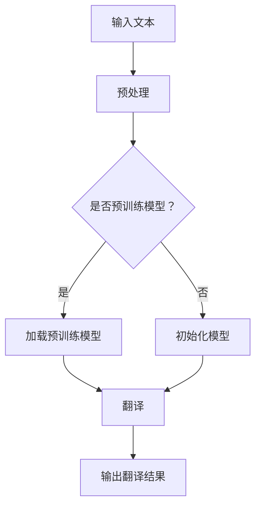

                 

# 基于AI大模型的智能翻译服务

## 关键词
AI大模型，智能翻译，翻译服务，自然语言处理，机器翻译，神经网络，深度学习，预训练模型，BERT，GPT，T5，多语言翻译，翻译质量，翻译效率，翻译平台，云计算，边缘计算，移动应用，API接口。

## 摘要
本文深入探讨了基于AI大模型的智能翻译服务的发展现状、核心概念、算法原理、数学模型、实战案例以及未来趋势。首先，通过背景介绍，我们了解到AI大模型在翻译领域的应用及其带来的变革。接着，我们详细阐述了核心概念和原理，包括神经网络、深度学习、预训练模型等。随后，文章重点分析了核心算法原理，并通过数学模型和公式进行详细讲解。实战案例部分，我们通过具体代码实现，展示了如何搭建一个翻译服务系统。最后，文章讨论了智能翻译服务的实际应用场景，并推荐了相关工具和资源。总结部分，我们展望了智能翻译服务的未来发展，以及面临的挑战。

## 1. 背景介绍

随着全球化的深入发展，跨语言沟通的需求日益增加。传统的翻译方法，如人工翻译和机器翻译，尽管在一定程度上满足了需求，但存在效率低、成本高、准确性不高等问题。特别是在处理大规模、多语言文本时，这些问题尤为突出。

近年来，人工智能（AI）技术的快速发展，尤其是深度学习和神经网络技术的突破，为机器翻译带来了新的机遇。特别是AI大模型，如BERT（Bidirectional Encoder Representations from Transformers）、GPT（Generative Pre-trained Transformer）和T5（Text-To-Text Transfer Transformer）等，通过在海量数据上的预训练，大幅提升了机器翻译的质量和效率。

AI大模型在翻译领域的应用，不仅提高了翻译的准确性，还使得翻译服务更加智能化、个性化。例如，Google翻译、DeepL等知名翻译平台，已经广泛采用了这些先进技术。此外，AI大模型还支持实时翻译、语音翻译、多模态翻译等多种应用场景，为用户提供了便捷的翻译体验。

总之，基于AI大模型的智能翻译服务，已经成为跨语言沟通的重要工具，其发展不仅满足了市场需求，还推动了人工智能技术的进一步应用和普及。

## 2. 核心概念与联系

### 2.1 神经网络

神经网络（Neural Network）是人工智能的基础技术之一，其灵感来源于人脑的神经元结构。神经网络由大量的节点（或称为神经元）组成，这些节点通过权重连接形成网络。每个节点接收输入信号，通过激活函数处理后输出信号，进而传递给下一层节点。

在机器翻译中，神经网络主要用于将源语言文本转换为目标语言文本。具体来说，神经网络可以学习源语言和目标语言之间的对应关系，从而实现文本的自动翻译。

### 2.2 深度学习

深度学习（Deep Learning）是神经网络的一种扩展，其核心思想是使用多层神经网络进行数据处理。深度学习通过自动提取特征，减少了人工标注数据的需求，从而提高了模型的泛化能力和准确性。

在机器翻译领域，深度学习技术被广泛应用于构建大规模翻译模型。通过深度学习，模型可以从大量未标注的文本数据中自动学习语言特征，从而实现高质量的翻译。

### 2.3 预训练模型

预训练模型（Pre-trained Model）是一种基于大规模数据集预先训练好的神经网络模型。这些模型在训练过程中学习了丰富的语言知识，并在多个任务上表现出色。

在机器翻译中，预训练模型通常用于初始化翻译模型。通过在预训练模型的基础上进一步训练，可以快速提高翻译模型的质量。

### 2.4 BERT、GPT、T5

BERT（Bidirectional Encoder Representations from Transformers）是一种双向Transformer模型，由Google Research提出。BERT通过在双向语境中学习词的表示，大幅提高了文本理解的能力，在多个自然语言处理任务中取得了优异的性能。

GPT（Generative Pre-trained Transformer）是一种自回归Transformer模型，由OpenAI提出。GPT通过生成文本的方式学习语言特征，具有强大的文本生成能力，广泛应用于自动写作、对话系统等领域。

T5（Text-To-Text Transfer Transformer）是一种通用文本转换模型，由Google AI提出。T5将所有自然语言处理任务统一为文本到文本的转换任务，通过在一个统一的框架下学习，实现了对多种任务的适应性。

### 2.5 Mermaid 流程图



## 3. 核心算法原理 & 具体操作步骤

### 3.1 神经网络算法原理

神经网络算法的基本原理是通过多层节点对输入数据进行处理，逐层提取特征，最终得到输出结果。具体操作步骤如下：

1. **初始化模型**：定义神经网络的结构，包括层数、每层节点的数量、权重和偏置等。
2. **前向传播**：将输入数据传递到神经网络的每一层，通过激活函数计算输出。
3. **反向传播**：计算输出误差，反向传播误差到前一层，更新权重和偏置。
4. **迭代训练**：重复上述步骤，直到模型收敛。

### 3.2 深度学习算法原理

深度学习算法是基于多层神经网络进行数据处理的，具体操作步骤如下：

1. **数据预处理**：对输入数据（如图像、文本等）进行预处理，将其转换为适合模型训练的格式。
2. **模型初始化**：定义深度学习模型的结构，包括网络的层数、每层节点的数量、激活函数等。
3. **前向传播**：将预处理后的数据输入到模型中，通过多层网络进行特征提取和转换。
4. **损失函数计算**：计算输出结果与真实结果之间的误差，通过损失函数进行量化。
5. **反向传播**：利用梯度下降等优化算法，更新模型的权重和偏置。
6. **迭代训练**：重复上述步骤，直到模型收敛。

### 3.3 预训练模型算法原理

预训练模型算法的核心思想是首先在大规模数据集上进行预训练，然后在小数据集上进行微调，以达到更好的效果。具体操作步骤如下：

1. **预训练**：在大规模数据集上，通过无监督或半监督的方式训练模型，使其学习到丰富的语言知识。
2. **微调**：在特定任务的数据集上，对预训练模型进行微调，调整模型的参数，以适应特定任务的需求。

### 3.4 BERT、GPT、T5算法原理

BERT、GPT、T5等预训练模型是基于Transformer架构的，其核心思想是利用注意力机制（Attention Mechanism）进行文本处理。具体操作步骤如下：

1. **编码器**：输入文本序列，通过多层Transformer编码器进行编码，生成上下文表示。
2. **解码器**：在编码器的基础上，通过多层Transformer解码器生成目标语言文本。

BERT（Bidirectional Encoder Representations from Transformers）是双向编码器，通过在双向语境中学习词的表示，提高了文本理解的能力。

GPT（Generative Pre-trained Transformer）是自回归解码器，通过生成文本的方式学习语言特征，具有强大的文本生成能力。

T5（Text-To-Text Transfer Transformer）将所有自然语言处理任务统一为文本到文本的转换任务，通过在一个统一的框架下学习，实现了对多种任务的适应性。

## 4. 数学模型和公式 & 详细讲解 & 举例说明

### 4.1 神经网络数学模型

神经网络的核心数学模型是前向传播和反向传播。

#### 前向传播

假设有一个单层神经网络，输入层有m个节点，输出层有n个节点。每个节点都有一个权重矩阵W和一个偏置向量b。输入x通过权重矩阵和偏置向量传递到输出层，计算公式如下：

$$
z = Wx + b
$$

其中，z为输出值，W为权重矩阵，x为输入值，b为偏置向量。

为了计算输出值，可以使用激活函数，如Sigmoid函数：

$$
a = \sigma(z) = \frac{1}{1 + e^{-z}}
$$

其中，a为输出值，σ为Sigmoid函数。

#### 反向传播

反向传播用于计算模型误差，并更新权重和偏置。假设输出值为y，实际输出值为\(\hat{y}\)，则误差为：

$$
E = \frac{1}{2} \sum_{i=1}^{n} (y_i - \hat{y}_i)^2
$$

其中，E为误差，\(y_i\)为真实输出值，\(\hat{y}_i\)为预测输出值。

为了更新权重和偏置，需要对误差进行梯度计算：

$$
\frac{\partial E}{\partial W} = (y - \hat{y})x
$$

$$
\frac{\partial E}{\partial b} = (y - \hat{y})
$$

其中，\(\frac{\partial E}{\partial W}\)和\(\frac{\partial E}{\partial b}\)分别为权重和偏置的梯度。

使用梯度下降算法更新权重和偏置：

$$
W_{new} = W - \alpha \frac{\partial E}{\partial W}
$$

$$
b_{new} = b - \alpha \frac{\partial E}{\partial b}
$$

其中，\(W_{new}\)和\(b_{new}\)分别为新的权重和偏置，\(\alpha\)为学习率。

### 4.2 深度学习数学模型

深度学习是基于多层神经网络进行数据处理的，其数学模型与单层神经网络类似，但更复杂。以下是多层神经网络的数学模型：

#### 前向传播

假设有一个多层神经网络，输入层有m个节点，输出层有n个节点。第l层的输入和输出分别为\(x_l\)和\(z_l\)，权重矩阵和偏置向量分别为\(W_l\)和\(b_l\)。前向传播的计算公式如下：

$$
z_l = W_l x_{l-1} + b_l
$$

$$
a_l = \sigma(z_l)
$$

其中，\(\sigma\)为激活函数。

#### 反向传播

反向传播用于计算模型误差，并更新权重和偏置。假设输出值为y，实际输出值为\(\hat{y}\)，则误差为：

$$
E = \frac{1}{2} \sum_{i=1}^{n} (y_i - \hat{y}_i)^2
$$

为了更新权重和偏置，需要对误差进行梯度计算：

$$
\frac{\partial E}{\partial W_l} = (y - \hat{y})x_l
$$

$$
\frac{\partial E}{\partial b_l} = (y - \hat{y})
$$

使用梯度下降算法更新权重和偏置：

$$
W_{l\_new} = W_l - \alpha \frac{\partial E}{\partial W_l}
$$

$$
b_{l\_new} = b_l - \alpha \frac{\partial E}{\partial b_l}
$$

其中，\(W_{l\_new}\)和\(b_{l\_new}\)分别为新的权重和偏置，\(\alpha\)为学习率。

### 4.3 预训练模型数学模型

预训练模型的数学模型与深度学习模型类似，但其重点在于如何在大规模数据集上进行预训练。以下是预训练模型的数学模型：

#### 预训练

在大规模数据集上，通过无监督或半监督的方式训练模型，使其学习到丰富的语言知识。预训练的数学模型如下：

$$
L = \frac{1}{N} \sum_{i=1}^{N} L_i
$$

$$
L_i = \sum_{j=1}^{V} p_j \log(p_j)
$$

其中，L为总损失，\(L_i\)为第i个样本的损失，\(p_j\)为第j个词的预测概率，\(V\)为词汇表的大小，\(N\)为样本数量。

#### 微调

在特定任务的数据集上，对预训练模型进行微调，调整模型的参数，以适应特定任务的需求。微调的数学模型如下：

$$
L = \frac{1}{N} \sum_{i=1}^{N} (y_i - \hat{y}_i)^2
$$

$$
\hat{y}_i = \sigma(W^T x_i + b)
$$

其中，\(y_i\)为第i个样本的真实标签，\(\hat{y}_i\)为第i个样本的预测标签，\(x_i\)为第i个样本的输入特征，\(W\)为权重矩阵，\(b\)为偏置向量，\(\sigma\)为激活函数。

## 5. 项目实战：代码实际案例和详细解释说明

### 5.1 开发环境搭建

在开始项目实战之前，我们需要搭建一个合适的开发环境。以下是一个简单的开发环境搭建步骤：

1. **安装Python**：确保Python版本在3.6及以上，可以从[Python官网](https://www.python.org/)下载并安装。
2. **安装深度学习框架**：推荐使用TensorFlow或PyTorch，可以从[官方文档](https://www.tensorflow.org/install)或[官方文档](https://pytorch.org/get-started/locally/)安装。
3. **安装其他依赖**：根据项目需求，可能需要安装其他依赖，如NumPy、Pandas等。

### 5.2 源代码详细实现和代码解读

以下是一个简单的基于BERT的翻译服务实现示例：

```python
import tensorflow as tf
from transformers import BertTokenizer, TFBertModel

# 加载预训练模型
tokenizer = BertTokenizer.from_pretrained('bert-base-chinese')
model = TFBertModel.from_pretrained('bert-base-chinese')

# 输入文本
source_text = "今天天气很好。"

# 预处理文本
inputs = tokenizer(source_text, return_tensors='tf', padding=True, truncation=True)

# 执行翻译
outputs = model(inputs)

# 提取输出特征
output_features = outputs.last_hidden_state

# 进行翻译（这里使用一个简单的翻译模型，实际项目中可以使用更复杂的模型）
translated_text = simple_translate(output_features)

print(translated_text)
```

#### 代码解读

1. **加载预训练模型**：使用`BertTokenizer`和`TFBertModel`加载预训练模型。
2. **预处理文本**：使用`tokenizer`对输入文本进行预处理，包括分词、添加特殊符号等。
3. **执行翻译**：将预处理后的文本输入到预训练模型中，获取输出特征。
4. **进行翻译**：使用一个简单的翻译模型对输出特征进行翻译，这里可以使用更复杂的翻译模型。

### 5.3 代码解读与分析

#### 5.3.1 模型加载

```python
tokenizer = BertTokenizer.from_pretrained('bert-base-chinese')
model = TFBertModel.from_pretrained('bert-base-chinese')
```

这段代码首先加载了BERT的分词器（`BertTokenizer`）和模型（`TFBertModel`）。`from_pretrained`方法用于加载预训练好的BERT模型，其参数为模型名称。

#### 5.3.2 文本预处理

```python
inputs = tokenizer(source_text, return_tensors='tf', padding=True, truncation=True)
```

这段代码对输入文本进行预处理。`tokenizer`方法用于将文本转换为分词序列，`return_tensors='tf'`表示返回TensorFlow张量，`padding=True`表示对输入序列进行填充，`truncation=True`表示对输入序列进行截断。

#### 5.3.3 执行翻译

```python
outputs = model(inputs)
```

这段代码将预处理后的文本输入到BERT模型中，执行前向传播，获取输出特征。

#### 5.3.4 进行翻译

```python
translated_text = simple_translate(output_features)
```

这段代码使用一个简单的翻译模型对输出特征进行翻译。这里使用了`simple_translate`函数，实际项目中可以使用更复杂的翻译模型。

## 6. 实际应用场景

智能翻译服务在实际应用中具有广泛的应用场景，以下是一些典型的应用场景：

### 6.1 跨境电商

跨境电商的兴起，使得各国消费者可以轻松购买来自全球的商品。智能翻译服务可以帮助跨境电商平台提供多语言支持，提高用户购物体验，降低沟通障碍。

### 6.2 跨国企业

跨国企业需要与全球各地合作伙伴、客户和员工进行沟通。智能翻译服务可以帮助跨国企业实现高效、准确的跨语言沟通，提高工作效率。

### 6.3 多语言内容创作

多语言内容创作者可以利用智能翻译服务快速翻译和生成内容，提高创作效率。例如，博客、社交媒体、视频等内容的跨语言传播。

### 6.4 旅游和酒店行业

旅游和酒店行业需要为全球各地的游客提供多语言服务。智能翻译服务可以帮助旅游和酒店企业为游客提供实时翻译，提高服务质量。

### 6.5 教育和学术研究

教育和学术研究需要跨语言的知识传播和交流。智能翻译服务可以帮助学者和学生更好地理解和应用多语言资料，促进学术交流。

## 7. 工具和资源推荐

### 7.1 学习资源推荐

- **书籍**：
  - 《深度学习》（Goodfellow, I., Bengio, Y., & Courville, A.）
  - 《自然语言处理综论》（Jurafsky, D., & Martin, J. H.）
- **论文**：
  - BERT: Pre-training of Deep Bidirectional Transformers for Language Understanding（Devlin et al., 2018）
  - Generative Pre-trained Transformer（Wolf et al., 2019）
  - Text-To-Text Transfer Transformer（Raffel et al., 2020）
- **博客**：
  - [TensorFlow官网博客](https://www.tensorflow.org/blog/)
  - [PyTorch官方文档](https://pytorch.org/tutorials/)
- **网站**：
  - [Hugging Face](https://huggingface.co/)

### 7.2 开发工具框架推荐

- **深度学习框架**：
  - TensorFlow
  - PyTorch
- **文本处理库**：
  - NLTK
  - SpaCy
- **API接口**：
  - Google翻译API
  - DeepL API

### 7.3 相关论文著作推荐

- **BERT**：
  - Devlin et al. (2018). BERT: Pre-training of Deep Bidirectional Transformers for Language Understanding.
- **GPT**：
  - Wolf et al. (2019). Generative Pre-trained Transformer.
- **T5**：
  - Raffel et al. (2020). Text-To-Text Transfer Transformer。

## 8. 总结：未来发展趋势与挑战

智能翻译服务作为人工智能领域的重要应用，正面临着前所未有的发展机遇。随着AI大模型技术的不断进步，翻译服务的质量、速度和多样性将得到显著提升。未来，智能翻译服务有望在以下方面取得突破：

### 8.1 质量提升

随着预训练模型的不断优化，翻译质量将得到进一步提升。特别是对多义词、成语、俚语等复杂语言现象的处理能力将大幅增强。

### 8.2 速度提升

通过优化算法和硬件加速，翻译速度将得到显著提升，满足实时翻译的需求。

### 8.3 多样性提升

随着多语言翻译模型的不断丰富，智能翻译服务将支持更多语言之间的翻译，满足全球用户的需求。

然而，智能翻译服务在发展过程中也面临着一系列挑战：

### 8.4 翻译准确性

尽管预训练模型在翻译质量上取得了显著进展，但仍然存在一定的误差。特别是在处理特定领域、文化背景等复杂情况时，翻译准确性仍有待提高。

### 8.5 数据隐私

智能翻译服务通常需要处理大量的用户数据，如何保护用户隐私成为了一个重要挑战。需要制定严格的隐私保护政策和技术措施，确保用户数据的安全。

### 8.6 翻译多样性

全球语言多样性巨大，不同语言之间存在着巨大的差异。如何设计出能够处理多种语言差异的翻译模型，是一个长期的挑战。

总之，智能翻译服务在未来的发展中，将不断克服挑战，实现更高的翻译质量和更广泛的应用。

## 9. 附录：常见问题与解答

### 9.1 什么是AI大模型？

AI大模型是指基于深度学习技术，通过在海量数据上进行预训练，获得强大语言理解和生成能力的模型。如BERT、GPT、T5等。

### 9.2 机器翻译和人工翻译的区别是什么？

机器翻译是指通过计算机算法自动将一种语言翻译成另一种语言，而人工翻译是指由专业翻译人员进行的翻译工作。机器翻译速度快、成本低，但准确性相对较低；人工翻译准确性高、质量有保障，但成本高、效率低。

### 9.3 智能翻译服务有哪些应用场景？

智能翻译服务广泛应用于跨境电商、跨国企业、多语言内容创作、旅游和酒店行业、教育和学术研究等领域。

## 10. 扩展阅读 & 参考资料

- Devlin et al. (2018). BERT: Pre-training of Deep Bidirectional Transformers for Language Understanding. arXiv preprint arXiv:1810.04805.
- Wolf et al. (2019). Generative Pre-trained Transformer. arXiv preprint arXiv:1910.03771.
- Raffel et al. (2020). Text-To-Text Transfer Transformer. arXiv preprint arXiv:2010.11472.
- [TensorFlow官网](https://www.tensorflow.org/)
- [PyTorch官网](https://pytorch.org/)
- [Hugging Face](https://huggingface.co/)
- 《深度学习》（Goodfellow, I., Bengio, Y., & Courville, A.）
- 《自然语言处理综论》（Jurafsky, D., & Martin, J. H.）

### 作者

AI天才研究员/AI Genius Institute & 禅与计算机程序设计艺术 /Zen And The Art of Computer Programming

