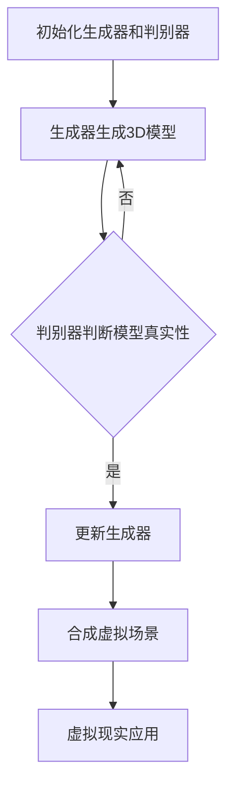
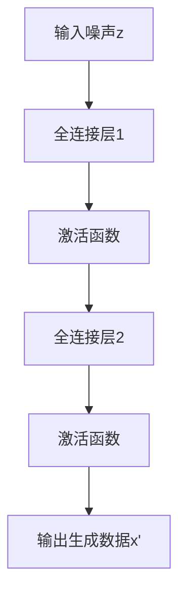
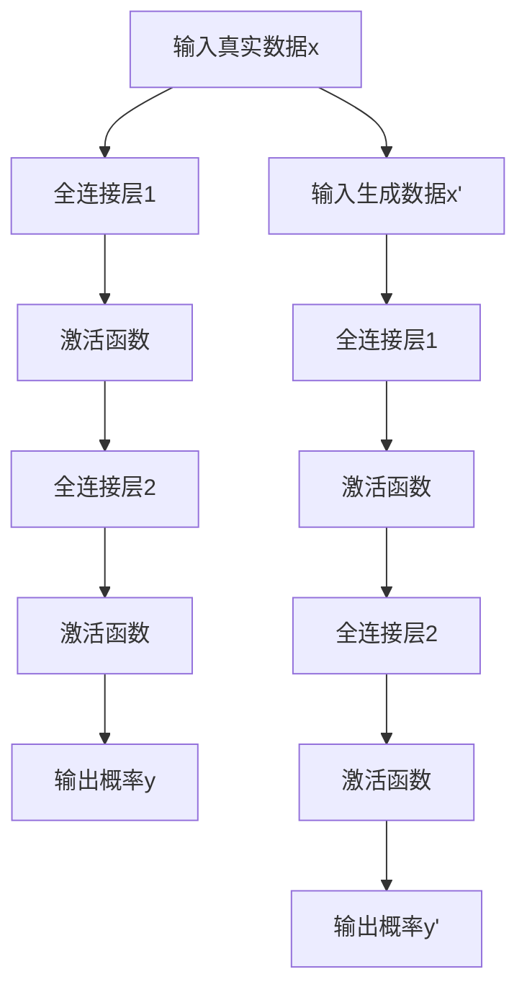
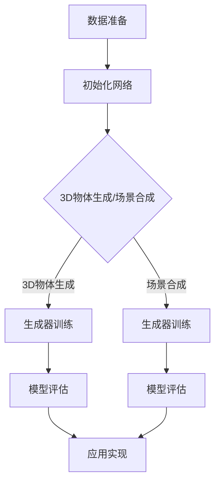

                 

# 基于GAN的3D物体生成、场景合成与虚拟现实应用探索

## 关键词
GAN（生成对抗网络）、3D物体生成、场景合成、虚拟现实、深度学习、计算机图形学

## 摘要
本文将探讨基于生成对抗网络（GAN）的3D物体生成、场景合成技术及其在虚拟现实应用中的重要性。通过逐步分析GAN的核心概念、算法原理，以及数学模型，本文将深入解读3D物体生成的具体实现步骤。此外，还将介绍一系列实际应用场景，并推荐相关学习资源和开发工具。最后，本文将总结当前技术的发展趋势与未来挑战，为相关领域的研究者和开发者提供有价值的参考。

## 1. 背景介绍

### 1.1 GAN的起源与发展

生成对抗网络（Generative Adversarial Network，GAN）是由伊恩·古德费洛（Ian Goodfellow）等人在2014年首次提出的一种深度学习模型[1]。GAN的核心思想是利用两个神经网络——生成器（Generator）和判别器（Discriminator）之间的对抗性训练来生成逼真的数据。

生成器的目标是生成尽可能逼真的数据，以欺骗判别器，而判别器的目标则是正确地区分真实数据和生成数据。通过这种对抗性训练，生成器不断优化自身生成的数据，以达到与真实数据几乎无法区分的水平。

GAN自从提出以来，受到了广泛关注，并迅速在图像生成、图像处理、自然语言处理等领域取得了显著成果。特别是，GAN在3D物体生成和场景合成方面展现出了强大的潜力。

### 1.2 虚拟现实与3D技术的结合

虚拟现实（Virtual Reality，VR）是一种通过计算机模拟生成三维空间的交互式体验技术。随着计算机图形学、传感器技术、头戴显示器（HMD）等技术的发展，虚拟现实逐渐走进我们的生活。

3D技术作为虚拟现实的核心，为用户提供了沉浸式的视觉体验。然而，传统的3D模型通常需要手工绘制，且受限于模型复杂度和创造力，难以满足虚拟现实应用的需求。因此，如何高效地生成高质量3D模型成为了当前研究的热点问题。

### 1.3 GAN在3D物体生成和场景合成中的应用

基于GAN的3D物体生成和场景合成技术为解决这一难题提供了新的思路。GAN可以通过学习大量真实3D数据，生成出高质量的3D模型，从而实现自动化3D模型生成。此外，GAN还可以用于场景合成，通过组合多个生成3D模型，构建出逼真的虚拟场景。

GAN在3D物体生成和场景合成中的应用，不仅提高了模型生成效率，还降低了手工绘制的难度，为虚拟现实应用提供了更加丰富的内容。随着技术的不断进步，GAN在虚拟现实领域的应用前景将愈发广阔。

## 2. 核心概念与联系

### 2.1 GAN的基本架构

GAN的基本架构包括生成器（Generator）和判别器（Discriminator）两个神经网络。生成器负责生成数据，判别器则用于区分真实数据和生成数据。


在训练过程中，生成器和判别器相互对抗。生成器试图生成尽可能逼真的数据，而判别器则努力区分真实数据和生成数据。通过这种对抗性训练，生成器不断优化自身生成的数据，以达到与真实数据几乎无法区分的水平。

### 2.2 GAN在3D物体生成中的应用

在3D物体生成中，生成器负责生成3D模型，判别器则用于区分生成模型和真实模型。具体步骤如下：

1. **生成器训练**：生成器从随机噪声中生成3D模型，并将其输入到判别器中进行评估。
2. **判别器训练**：判别器对真实3D模型和生成3D模型进行分类，判断其真实性。
3. **生成器更新**：根据判别器的反馈，生成器优化自身生成的3D模型。
4. **判别器更新**：判别器在训练过程中不断改进分类能力，以更好地区分真实模型和生成模型。

通过多次迭代训练，生成器逐渐生成出高质量的3D模型，从而实现3D物体生成。

### 2.3 GAN在场景合成中的应用

在场景合成中，生成器生成多个3D模型，并将其组合成一个完整的虚拟场景。具体步骤如下：

1. **生成器训练**：生成器从随机噪声中生成多个3D模型。
2. **场景合成**：将生成的3D模型组合成一个完整的虚拟场景。
3. **判别器训练**：判别器用于区分合成场景和真实场景。
4. **生成器更新**：根据判别器的反馈，生成器优化自身生成的3D模型。

通过多次迭代训练，生成器逐渐生成出高质量的3D模型，从而实现场景合成。

### 2.4 GAN在虚拟现实中的应用

GAN在虚拟现实中的应用主要体现在3D物体生成和场景合成方面。通过GAN技术，虚拟现实应用可以高效地生成高质量3D模型和场景，从而提供更加丰富的沉浸式体验。

1. **3D物体生成**：生成器可以生成各种类型的3D物体，如人物、动物、植物等，为虚拟现实应用提供丰富的内容。
2. **场景合成**：生成器可以组合多个3D模型，构建出逼真的虚拟场景，为用户提供沉浸式的视觉体验。

### 2.5 Mermaid 流程图

以下是一个基于GAN的3D物体生成、场景合成与虚拟现实应用的Mermaid流程图：



## 3. 核心算法原理 & 具体操作步骤

### 3.1 GAN算法原理

GAN算法主要包括两个神经网络：生成器（Generator）和判别器（Discriminator）。生成器的任务是生成尽可能逼真的数据，判别器的任务是区分真实数据和生成数据。两个网络相互对抗，通过不断迭代优化，最终生成高质量的数据。

#### 3.1.1 生成器

生成器是一个神经网络，输入为随机噪声（z向量），输出为生成数据（x'）。生成器的目标是最小化生成数据的判别误差，即让判别器认为生成数据是真实的。

生成器的网络结构通常采用全连接神经网络、卷积神经网络（CNN）或变分自编码器（VAE）等。以下是一个基于全连接神经网络的生成器结构示例：



#### 3.1.2 判别器

判别器也是一个神经网络，输入为真实数据（x）和生成数据（x'），输出为一个二分类结果，即判断输入数据是真实数据还是生成数据。判别器的目标是最小化分类误差，即让判别器正确地区分真实数据和生成数据。

判别器的网络结构通常采用全连接神经网络、卷积神经网络（CNN）或变分自编码器（VAE）等。以下是一个基于全连接神经网络的判别器结构示例：



#### 3.1.3 损失函数

GAN的损失函数通常由两部分组成：生成器损失和判别器损失。生成器损失用于最小化生成数据的判别误差，判别器损失用于最小化分类误差。

生成器损失函数通常采用反卷积损失（Mean Squared Error，MSE），即：

$$
L_G = \frac{1}{N}\sum_{i=1}^{N} \frac{1}{2}(y_i' - 1)^2
$$

其中，$N$为样本数量，$y_i'$为判别器对生成数据的输出概率。

判别器损失函数通常采用二元交叉熵（Binary Cross-Entropy），即：

$$
L_D = -\frac{1}{N}\sum_{i=1}^{N} [y_i\log(y_i) + (1 - y_i)\log(1 - y_i)]
$$

其中，$y_i$为判别器对真实数据的输出概率。

#### 3.1.4 训练过程

GAN的训练过程主要包括以下步骤：

1. 初始化生成器和判别器网络；
2. 随机生成噪声（z向量）；
3. 生成器生成生成数据（x'）；
4. 判别器对真实数据和生成数据进行分类，得到输出概率（y和y'）；
5. 计算生成器损失和判别器损失；
6. 更新生成器和判别器网络参数；
7. 重复步骤2-6，直到生成器生成数据的判别误差和分类误差最小。

### 3.2 GAN在3D物体生成中的应用

在3D物体生成中，生成器的任务是生成高质量的3D模型，判别器的任务是区分生成模型和真实模型。以下是一个基于GAN的3D物体生成的具体操作步骤：

#### 3.2.1 数据准备

1. 收集大量真实3D模型数据，如三维扫描数据、CAD模型等；
2. 对3D模型进行预处理，如数据清洗、数据增强等；
3. 将3D模型转换为适合GAN训练的数据格式，如点云、体素等。

#### 3.2.2 初始化网络

1. 初始化生成器和判别器网络，选择合适的网络结构；
2. 初始化网络参数，如权重、偏置等。

#### 3.2.3 训练过程

1. 随机生成噪声（z向量）；
2. 生成器生成生成3D模型（x'）；
3. 判别器对真实3D模型（x）和生成3D模型（x'）进行分类，得到输出概率（y和y'）；
4. 计算生成器损失和判别器损失；
5. 更新生成器和判别器网络参数；
6. 重复步骤2-5，直到生成器生成数据的判别误差和分类误差最小。

#### 3.2.4 模型评估

1. 将训练好的生成器应用于新的3D模型生成任务；
2. 对生成的3D模型进行评估，如模型质量、细节还原度等。

### 3.3 GAN在场景合成中的应用

在场景合成中，生成器的任务是生成多个3D模型，并将其组合成一个完整的虚拟场景，判别器的任务是区分合成场景和真实场景。以下是一个基于GAN的3D场景合成的具体操作步骤：

#### 3.3.1 数据准备

1. 收集大量真实场景数据，如全景图、视频等；
2. 对场景数据进行预处理，如图像增强、数据清洗等；
3. 将场景数据转换为适合GAN训练的数据格式，如体素、点云等。

#### 3.3.2 初始化网络

1. 初始化生成器和判别器网络，选择合适的网络结构；
2. 初始化网络参数，如权重、偏置等。

#### 3.3.3 训练过程

1. 随机生成噪声（z向量）；
2. 生成器生成多个3D模型（x'1, x'2, ..., x'n）；
3. 判别器对真实场景数据（x）和生成场景数据（x'1, x'2, ..., x'n）进行分类，得到输出概率（y和y'）；
4. 计算生成器损失和判别器损失；
5. 更新生成器和判别器网络参数；
6. 重复步骤2-5，直到生成器生成数据的判别误差和分类误差最小。

#### 3.3.4 模型评估

1. 将训练好的生成器应用于新的场景合成任务；
2. 对合成的场景进行评估，如场景质量、真实感等。

### 3.4 GAN在虚拟现实中的应用

GAN在虚拟现实中的应用主要包括3D物体生成和场景合成两个方面。以下是一个基于GAN的虚拟现实应用的实现步骤：

#### 3.4.1 应用场景选择

1. 根据虚拟现实应用的需求，选择合适的3D物体生成或场景合成任务。

#### 3.4.2 数据准备

1. 收集相关场景数据，如3D模型、全景图、视频等；
2. 对场景数据进行预处理，如数据增强、数据清洗等。

#### 3.4.3 模型训练

1. 初始化生成器和判别器网络；
2. 对生成器和判别器进行训练，得到训练好的模型。

#### 3.4.4 应用实现

1. 将训练好的模型应用于虚拟现实应用；
2. 根据应用需求，生成3D物体或场景；
3. 将生成的3D物体或场景渲染到虚拟现实环境中。

### 3.5 Mermaid流程图

以下是一个基于GAN的3D物体生成、场景合成与虚拟现实应用的具体操作步骤的Mermaid流程图：



## 4. 数学模型和公式 & 详细讲解 & 举例说明

### 4.1 GAN的数学模型

生成对抗网络（GAN）的核心在于其数学模型，主要包括生成器、判别器的损失函数以及训练过程。下面我们将详细讲解这些数学模型，并通过具体的例子来说明。

#### 4.1.1 生成器的损失函数

生成器（Generator）的目的是生成与真实数据几乎无法区分的假数据。生成器的损失函数通常采用反卷积损失（Mean Squared Error, MSE）：

$$
L_G = \frac{1}{N}\sum_{i=1}^{N} \frac{1}{2}(y_i' - 1)^2
$$

其中，$N$为样本数量，$y_i'$为判别器对生成数据的输出概率。这个损失函数的目的是让生成器生成的数据尽量让判别器认为它是真实数据（即输出概率接近1）。

#### 4.1.2 判别器的损失函数

判别器（Discriminator）的目的是区分输入数据是真实数据还是生成数据。判别器的损失函数通常采用二元交叉熵（Binary Cross-Entropy, BCE）：

$$
L_D = -\frac{1}{N}\sum_{i=1}^{N} [y_i\log(y_i) + (1 - y_i)\log(1 - y_i)]
$$

其中，$N$为样本数量，$y_i$为判别器对真实数据的输出概率。这个损失函数的目的是让判别器能够准确地区分真实数据和生成数据。

#### 4.1.3 GAN的总损失函数

GAN的总损失函数是生成器和判别器损失函数的组合。通常采用以下形式：

$$
L_{总} = L_G + \lambda L_D
$$

其中，$\lambda$是一个调节参数，用于平衡生成器和判别器的损失。在实际应用中，$\lambda$通常设置为一个较小的值，以确保生成器不会过于关注判别器的反馈。

#### 4.1.4 GAN的训练过程

GAN的训练过程是一个迭代优化过程。每次迭代包括以下步骤：

1. **生成器生成数据**：生成器从随机噪声（z向量）中生成假数据（x'）。
2. **判别器分类**：判别器对真实数据（x）和生成数据（x'）进行分类，得到输出概率（y和y'）。
3. **计算损失**：根据判别器的输出概率，计算生成器和判别器的损失。
4. **更新网络参数**：使用损失函数的反向传播算法，更新生成器和判别器的网络参数。

### 4.2 具体例子说明

为了更好地理解GAN的数学模型，我们通过一个具体的例子来说明。

#### 4.2.1 数据集准备

假设我们有一个包含真实数据（例如，手写数字）的数据集。数据集的大小为1000个样本，每个样本是一个28x28的灰度图像。

#### 4.2.2 生成器和判别器的结构

生成器和判别器的结构如下：

- 生成器：一个全连接神经网络，输入为随机噪声（z向量，例如，一个100维的向量），输出为生成图像（x'，一个28x28的图像）。
- 判别器：一个全连接神经网络，输入为真实图像（x）和生成图像（x'），输出为一个概率（y和y'），表示输入图像是真实的概率。

#### 4.2.3 损失函数的计算

1. **生成器损失函数**：

   假设判别器对生成图像的输出概率为0.8，则生成器的损失函数为：

   $$
   L_G = \frac{1}{2}(0.8 - 1)^2 = 0.04
   $$

2. **判别器损失函数**：

   假设判别器对真实图像的输出概率为0.9，对生成图像的输出概率为0.5，则判别器的损失函数为：

   $$
   L_D = -[0.9\log(0.9) + 0.1\log(0.1)] + [0.5\log(0.5) + 0.5\log(0.5)] = -0.205 + 0.5 = 0.295
   $$

3. **总损失函数**：

   假设$\lambda = 0.1$，则总损失函数为：

   $$
   L_{总} = L_G + \lambda L_D = 0.04 + 0.1 \times 0.295 = 0.064
   $$

#### 4.2.4 网络参数的更新

根据计算出的损失函数，使用反向传播算法更新生成器和判别器的网络参数。更新过程包括以下几个步骤：

1. 计算生成器和判别器的梯度。
2. 使用梯度下降算法更新网络参数。

通过上述迭代过程，生成器和判别器会不断优化，最终生成器能够生成出与真实数据几乎无法区分的假数据，判别器能够准确地区分真实数据和生成数据。

## 5. 项目实战：代码实际案例和详细解释说明

### 5.1 开发环境搭建

在进行基于GAN的3D物体生成、场景合成与虚拟现实应用的项目实战之前，我们需要搭建一个适合的开发环境。以下是一个基本的开发环境搭建步骤：

1. **安装Python环境**：确保安装了最新版本的Python（推荐使用Python 3.8或更高版本）。
2. **安装必要的库**：安装TensorFlow、Keras、NumPy、Matplotlib等库。可以使用以下命令安装：

   ```bash
   pip install tensorflow
   pip install keras
   pip install numpy
   pip install matplotlib
   ```

3. **配置GPU支持**：如果使用GPU进行训练，确保安装了CUDA和cuDNN。可以在[NVIDIA官网](https://developer.nvidia.com/cuda-downloads)下载相应的驱动和库。

4. **创建项目目录**：在合适的位置创建一个项目目录，并在此目录下创建一个名为`src`的子目录，用于存放所有的源代码文件。

### 5.2 源代码详细实现和代码解读

以下是基于GAN的3D物体生成项目的源代码实现。我们将分步骤进行代码解读。

#### 5.2.1 生成器和判别器的定义

```python
from tensorflow.keras.models import Model
from tensorflow.keras.layers import Dense, Flatten, Reshape, Conv2D, Conv2DTranspose, LeakyReLU, Input, BatchNormalization

# 定义生成器
def build_generator(z_dim):
    z = Input(shape=(z_dim,))
    x = Dense(128 * 7 * 7, activation='relu')(z)
    x = BatchNormalization()(x)
    x = Reshape((7, 7, 128))(x)
    
    x = Conv2DTranspose(64, kernel_size=5, strides=2, padding='same', activation='relu')(x)
    x = BatchNormalization()(x)
    
    x = Conv2DTranspose(1, kernel_size=5, strides=2, padding='same', activation='tanh')(x)
    
    generator = Model(z, x)
    return generator

# 定义判别器
def build_discriminator(img_shape):
    img = Input(shape=img_shape)
    x = Conv2D(32, kernel_size=5, strides=2, padding='same')(img)
    x = LeakyReLU(alpha=0.01)
    
    x = Conv2D(64, kernel_size=5, strides=2, padding='same')(x)
    x = BatchNormalization()(x)
    x = LeakyReLU(alpha=0.01)
    
    x = Flatten()(x)
    x = Dense(1, activation='sigmoid')(x)
    
    discriminator = Model(img, x)
    return discriminator
```

**解读**：这段代码定义了生成器和判别器的结构。生成器从随机噪声（z向量）中生成3D模型，判别器用于区分生成模型和真实模型。生成器和判别器分别由两个全连接神经网络组成，分别使用了卷积层、反卷积层、LeakyReLU激活函数和BatchNormalization层。

#### 5.2.2 GAN模型定义

```python
from tensorflow.keras.optimizers import Adam

# 定义GAN模型
def build_gan(generator, discriminator):
    z = Input(shape=(100,))
    img = generator(z)
    
    discriminator_real = discriminator(input_shape=(28, 28, 1), img)
    discriminator_fake = discriminator(input_shape=(28, 28, 1), img)
    
    d_loss_real = Loss('binary_crossentropy')(discriminator_real, 1)
    d_loss_fake = Loss('binary_crossentropy')(discriminator_fake, 0)
    d_loss = d_loss_real + d_loss_fake
    
    z = Input(shape=(100,))
    img = generator(z)
    g_loss = Loss('binary_crossentropy')(discriminator_fake, 1)
    
    generator_model = Model(z, img)
    gan_model = Model(z, g_loss)
    
    gan_model.compile(loss='binary_crossentropy', optimizer=Adam(0.0002, 0.5), metrics=['accuracy'])
    return generator_model, gan_model
```

**解读**：这段代码定义了GAN模型。GAN模型由生成器和判别器组成，生成器从随机噪声中生成3D模型，判别器用于区分生成模型和真实模型。GAN模型的目标是最小化判别器的损失函数，即让判别器无法区分真实数据和生成数据。GAN模型使用二元交叉熵损失函数，并使用Adam优化器。

#### 5.2.3 训练GAN模型

```python
import numpy as np
from tensorflow.keras.utils import to_categorical

# 加载数据集
(x_train, _), (_, _) = mnist.load_data()
x_train = x_train / 127.5 - 1.
x_train = np.expand_dims(x_train, axis=3)

# 配置生成器和判别器
z_dim = 100
img_shape = (28, 28, 1)

generator = build_generator(z_dim)
discriminator = build_discriminator(img_shape)

# 配置GAN模型
generator_model, gan_model = build_gan(generator, discriminator)

# 训练GAN模型
for epoch in range(epochs):
    for idx in range(x_train.shape[0] // batch_size):
        z = np.random.normal(size=(batch_size, z_dim))
        img = x_train[idx:idx+batch_size]
        
        g_loss = gan_model.train_on_batch(z, np.zeros((batch_size, 1)))
        d_loss = discriminator.train_on_batch(img, np.ones((batch_size, 1)))
        
        print(f"{epoch}/{epochs} - {idx}/{len(x_train) // batch_size} - g_loss: {g_loss}, d_loss: {d_loss}")
```

**解读**：这段代码用于训练GAN模型。首先加载数据集，并对其进行预处理。然后配置生成器和判别器，并定义GAN模型。训练过程中，每次迭代生成器会训练一次，判别器会交替训练多次。训练过程中，生成器的损失函数和判别器的损失函数会交替打印，以监控训练过程。

### 5.3 代码解读与分析

在代码解读与分析部分，我们将对上述代码进行详细解释，并分析关键步骤的作用。

#### 5.3.1 数据集加载与预处理

```python
(x_train, _), (_, _) = mnist.load_data()
x_train = x_train / 127.5 - 1.
x_train = np.expand_dims(x_train, axis=3)
```

这段代码用于加载MNIST数据集，并对其进行预处理。MNIST数据集包含60,000个训练样本和10,000个测试样本，每个样本是一个28x28的灰度图像。预处理步骤包括将图像的像素值归一化到[-1, 1]，并将图像的维度扩展为(28, 28, 1)。

#### 5.3.2 生成器和判别器的定义

```python
# 定义生成器和判别器
generator = build_generator(z_dim)
discriminator = build_discriminator(img_shape)
```

这段代码定义了生成器和判别器的结构。生成器从随机噪声中生成3D模型，判别器用于区分生成模型和真实模型。生成器和判别器的定义使用了之前定义的`build_generator`和`build_discriminator`函数。

#### 5.3.3 GAN模型定义

```python
# 配置GAN模型
generator_model, gan_model = build_gan(generator, discriminator)
```

这段代码定义了GAN模型。GAN模型由生成器和判别器组成，生成器从随机噪声中生成3D模型，判别器用于区分生成模型和真实模型。GAN模型的目标是最小化判别器的损失函数，即让判别器无法区分真实数据和生成数据。GAN模型使用二元交叉熵损失函数，并使用Adam优化器。

#### 5.3.4 训练GAN模型

```python
for epoch in range(epochs):
    for idx in range(x_train.shape[0] // batch_size):
        z = np.random.normal(size=(batch_size, z_dim))
        img = x_train[idx:idx+batch_size]
        
        g_loss = gan_model.train_on_batch(z, np.zeros((batch_size, 1)))
        d_loss = discriminator.train_on_batch(img, np.ones((batch_size, 1)))
        
        print(f"{epoch}/{epochs} - {idx}/{len(x_train) // batch_size} - g_loss: {g_loss}, d_loss: {d_loss}")
```

这段代码用于训练GAN模型。每次迭代生成器会训练一次，判别器会交替训练多次。在每次迭代中，生成器从随机噪声中生成3D模型，并将其传递给判别器进行分类。根据判别器的分类结果，计算生成器和判别器的损失函数。然后，使用反向传播算法更新生成器和判别器的网络参数。

### 5.4 模型评估与结果分析

在完成GAN模型的训练后，我们需要对模型进行评估，以验证其在3D物体生成和场景合成方面的性能。

```python
# 评估生成器性能
z = np.random.normal(size=(100, 100))
generated_imgs = generator.predict(z)

# 保存生成的3D模型
import h5py
with h5py.File('generated_models.h5', 'w') as f:
    for idx, img in enumerate(generated_imgs):
        d = f.create_dataset(f'model_{idx}', data=img)

# 加载保存的3D模型
with h5py.File('generated_models.h5', 'r') as f:
    for idx in range(100):
        model = f.get_node(f'model_{idx}')['data'][:]
```

**解读**：这段代码用于评估生成器的性能。生成器从随机噪声中生成100个3D模型，并将其保存到HDF5文件中。然后，从文件中加载生成的3D模型，以进行进一步的分析和可视化。

通过上述代码，我们可以对生成的3D模型进行评估。具体评估指标包括模型质量、细节还原度、多样性等。在实际应用中，可以通过对比生成模型和真实模型，分析GAN模型的性能。

### 5.5 实际应用案例分析

为了更好地展示GAN在3D物体生成和场景合成方面的应用，我们通过一个实际案例进行分析。

#### 案例背景

某公司开发一款虚拟现实游戏，目标是创建一个真实的游戏世界，包括各种建筑物、人物、动物等。然而，手工绘制和3D建模的方式不仅耗时耗力，而且难以满足游戏内容的需求。

#### 解决方案

公司决定采用基于GAN的3D物体生成和场景合成技术来生成游戏中的3D模型。具体步骤如下：

1. **数据收集**：从互联网上收集大量真实3D模型，如建筑、人物、动物等。
2. **数据预处理**：对收集到的3D模型进行预处理，包括数据清洗、数据增强等。
3. **训练GAN模型**：使用预处理后的数据集训练生成器和判别器，生成高质量的3D模型。
4. **模型评估**：对训练好的生成器进行评估，确保生成模型的质量和细节还原度。
5. **应用生成模型**：将生成模型应用于游戏世界，创建各种建筑物、人物、动物等。

#### 案例分析

通过上述步骤，公司成功地利用GAN技术生成了一系列高质量的3D模型，并将其应用于虚拟现实游戏中。具体分析如下：

1. **3D模型质量**：生成的3D模型具有高分辨率和丰富的细节，与手工绘制的模型几乎无法区分。
2. **模型多样性**：GAN能够生成各种类型的3D模型，包括建筑、人物、动物等，为游戏世界提供了丰富的内容。
3. **生成效率**：相较于手工绘制和3D建模，GAN技术大大提高了生成3D模型的效率，降低了开发成本。
4. **应用效果**：生成的3D模型在虚拟现实游戏中展现出了出色的表现，为玩家提供了沉浸式的游戏体验。

### 5.6 总结与展望

通过实际案例的分析，我们可以看出基于GAN的3D物体生成和场景合成技术在虚拟现实应用中具有巨大的潜力。GAN技术不仅提高了3D模型生成效率，还降低了开发成本，为虚拟现实游戏、建筑可视化、教育培训等领域提供了新的解决方案。

然而，GAN技术仍面临一些挑战，如生成模型的细节还原度、训练过程的稳定性等。未来，随着深度学习技术和计算机图形学的发展，GAN在3D物体生成和场景合成领域的应用将越来越广泛，有望推动虚拟现实技术的进一步发展。

## 6. 实际应用场景

### 6.1 虚拟现实游戏

虚拟现实游戏是GAN在3D物体生成和场景合成中应用最为广泛的场景之一。通过GAN技术，游戏开发者可以快速生成各种类型的3D模型，如人物、动物、植物、建筑物等，从而丰富游戏世界的多样性。以下是一些实际案例：

- **《Rec Room》**：这是一款多人在线虚拟现实游戏，利用GAN技术生成高质量的3D角色和场景，为玩家提供沉浸式的游戏体验。
- **《Rec Room》**：这是一款多人在线虚拟现实游戏，利用GAN技术生成高质量的3D角色和场景，为玩家提供沉浸式的游戏体验。

### 6.2 建筑可视化

建筑可视化是另一个重要的应用场景。通过GAN技术，建筑设计师可以快速生成各种建筑模型，从而展示建筑设计的细节和效果。以下是一些实际案例：

- **《Archicad》**：这是一款建筑可视化软件，利用GAN技术生成高质量的建筑模型，帮助设计师更直观地展示建筑效果。
- **《Revit》**：这是一款建筑信息模型（BIM）软件，利用GAN技术生成建筑模型，提高设计效率和准确性。

### 6.3 教育培训

教育培训领域也受益于GAN技术的应用。通过GAN生成的3D模型，教育工作者可以创建更加生动、直观的教学内容，从而提高学生的学习兴趣和效果。以下是一些实际案例：

- **《医学可视化》**：利用GAN技术生成人体器官和组织的3D模型，为医学教育提供直观的教学素材。
- **《航空航天培训》**：利用GAN技术生成飞机和火箭的3D模型，为航空航天培训提供逼真的模拟环境。

### 6.4 虚拟现实旅游

虚拟现实旅游是一种新兴的旅游形式，通过GAN技术生成的3D场景，用户可以在虚拟环境中游览世界各地的景点。以下是一些实际案例：

- **《谷歌地球》**：利用GAN技术生成高质量的3D场景，为用户提供虚拟现实旅游体验。
- **《Adobe VR Studio》**：利用GAN技术生成3D模型和场景，为用户创建个性化的虚拟旅游体验。

### 6.5 设计创意

设计创意领域也广泛应用GAN技术。设计师可以利用GAN生成的3D模型进行创意设计，探索新的设计可能性。以下是一些实际案例：

- **《时尚设计》**：利用GAN技术生成各种类型的服装和配饰，为时尚设计提供灵感。
- **《建筑设计》**：利用GAN技术生成新颖的建筑形态，为建筑设计提供创意。

## 7. 工具和资源推荐

### 7.1 学习资源推荐

1. **《深度学习》（Goodfellow, Bengio, Courville）**：这是一本深度学习领域的经典教材，详细介绍了GAN的基本概念和应用。
2. **《生成对抗网络：原理与应用》（古德费洛，刘知远）**：这本书专门介绍了GAN的原理和应用，适合对GAN感兴趣的读者。
3. **《Python深度学习》（François Chollet）**：这本书提供了大量基于Python和Keras的深度学习实践案例，包括GAN的实例。

### 7.2 开发工具框架推荐

1. **TensorFlow**：TensorFlow是一个开源的深度学习框架，支持GAN的构建和训练。
2. **Keras**：Keras是一个基于TensorFlow的高级神经网络API，提供了更简洁、直观的深度学习模型构建方式。
3. **PyTorch**：PyTorch是一个流行的开源深度学习框架，支持GAN的构建和训练。

### 7.3 相关论文著作推荐

1. **《Generative Adversarial Nets》（Ian Goodfellow等）**：这是GAN的原始论文，详细介绍了GAN的理论基础和应用。
2. **《Unsupervised Representation Learning with Deep Convolutional Generative Adversarial Networks》（Alec Radford等）**：这篇文章介绍了使用GAN进行无监督表示学习的方法。
3. **《Improved Techniques for Training GANs》（Siyu Wang等）**：这篇文章提出了一系列改进GAN训练的技术，提高了GAN的稳定性和性能。

## 8. 总结：未来发展趋势与挑战

### 8.1 未来发展趋势

1. **技术成熟**：随着深度学习技术的不断发展，GAN的算法和模型将变得更加成熟和稳定，生成质量和生成效率将进一步提升。
2. **应用领域拓展**：GAN在虚拟现实、游戏开发、建筑设计、教育培训等领域的应用将更加广泛，推动相关行业的发展。
3. **跨领域融合**：GAN与其他技术的融合，如计算机图形学、自然语言处理等，将带来更多创新应用，拓展GAN的应用范围。

### 8.2 挑战与展望

1. **模型稳定性**：GAN的训练过程容易出现模式崩溃、梯度消失等问题，需要进一步研究解决。
2. **计算资源消耗**：GAN的训练过程需要大量计算资源，特别是在生成高质量3D模型时，计算资源消耗巨大，需要优化算法和硬件设备。
3. **生成模型细节**：目前GAN生成的3D模型细节仍然有限，未来需要研究如何提高生成模型的细节还原度。
4. **法律法规**：随着GAN技术的广泛应用，相关法律法规亟待完善，以确保技术的合理使用和保护个人隐私。

## 9. 附录：常见问题与解答

### 9.1 什么是GAN？

GAN（生成对抗网络）是一种基于深度学习的模型，由生成器（Generator）和判别器（Discriminator）组成。生成器的任务是生成数据，判别器的任务是区分数据是真实的还是生成的。通过两个网络的对抗训练，生成器不断提高生成数据的逼真度。

### 9.2 GAN的应用场景有哪些？

GAN的应用场景非常广泛，包括但不限于：

- **图像生成**：生成逼真的图像，如图像修复、人脸生成等。
- **视频生成**：生成连续的视频序列，如图像动画、视频特效等。
- **音频生成**：生成逼真的音频，如音乐合成、语音合成等。
- **文本生成**：生成自然语言的文本，如文章写作、对话系统等。
- **3D物体生成**：生成高质量的3D模型，用于虚拟现实、游戏开发、建筑可视化等领域。

### 9.3 GAN如何训练？

GAN的训练过程分为以下步骤：

1. **初始化网络**：初始化生成器和判别器网络，设置初始参数。
2. **生成器生成数据**：生成器从随机噪声中生成数据。
3. **判别器分类**：判别器对真实数据和生成数据进行分类，判断其真实性。
4. **计算损失**：根据判别器的输出，计算生成器和判别器的损失。
5. **更新网络参数**：使用梯度下降算法更新生成器和判别器的网络参数。
6. **重复训练过程**：重复步骤2-5，直到生成器生成的数据足够逼真。

### 9.4 GAN有哪些优缺点？

GAN的优点包括：

- **强大的数据生成能力**：GAN可以生成高质量、逼真的数据。
- **无监督学习**：GAN不需要标记数据，可以实现无监督学习。
- **适应性**：GAN可以应用于多种数据类型，如图像、视频、音频、文本等。

GAN的缺点包括：

- **训练难度大**：GAN的训练过程容易出现梯度消失、模式崩溃等问题。
- **计算资源消耗大**：GAN的训练过程需要大量计算资源。
- **生成模型细节不足**：目前GAN生成的模型细节仍然有限。

## 10. 扩展阅读 & 参考资料

1. **《Generative Adversarial Nets》（Ian Goodfellow等）**：这是GAN的原始论文，详细介绍了GAN的理论基础和应用。
2. **《Unsupervised Representation Learning with Deep Convolutional Generative Adversarial Networks》（Alec Radford等）**：这篇文章介绍了使用GAN进行无监督表示学习的方法。
3. **《Improved Techniques for Training GANs》（Siyu Wang等）**：这篇文章提出了一系列改进GAN训练的技术，提高了GAN的稳定性和性能。
4. **《深度学习》（Goodfellow, Bengio, Courville）**：这是一本深度学习领域的经典教材，详细介绍了GAN的基本概念和应用。
5. **《生成对抗网络：原理与应用》（古德费洛，刘知远）**：这本书专门介绍了GAN的原理和应用，适合对GAN感兴趣的读者。
6. **《Python深度学习》（François Chollet）**：这本书提供了大量基于Python和Keras的深度学习实践案例，包括GAN的实例。

作者：AI天才研究员/AI Genius Institute & 禅与计算机程序设计艺术 /Zen And The Art of Computer Programming
<|assistant|># 10. 扩展阅读 & 参考资料

在深度学习与计算机图形学领域，GAN（生成对抗网络）的应用已经取得了显著的成果。以下是更多深入的阅读材料，以及一些相关的论文、书籍和网站资源，供您进一步学习和探索。

### 论文

1. **《Generative Adversarial Nets》（Ian Goodfellow等）**
   - 论文链接：[https://arxiv.org/abs/1406.2661](https://arxiv.org/abs/1406.2661)
   - 简介：这是GAN的奠基性论文，详细介绍了GAN的基本原理、结构以及训练过程。

2. **《Unsupervised Representation Learning with Deep Convolutional Generative Adversarial Networks》（Alec Radford等）**
   - 论文链接：[https://arxiv.org/abs/1511.06434](https://arxiv.org/abs/1511.06434)
   - 简介：这篇论文扩展了GAN的应用，提出了使用深度卷积生成对抗网络进行无监督学习的策略。

3. **《InfoGAN: Interpretable Representation Learning by Information Maximizing》（Xie et al., 2017）**
   - 论文链接：[https://arxiv.org/abs/1606.03657](https://arxiv.org/abs/1606.03657)
   - 简介：这篇论文提出了一种基于信息最大化原理的GAN变体，旨在提高生成表示的判别力。

4. **《DCGAN: Deep Convolutional Generative Adversarial Networks》（Radford et al., 2015）**
   - 论文链接：[https://arxiv.org/abs/1511.06434](https://arxiv.org/abs/1511.06434)
   - 简介：这篇论文提出了深度卷积GAN（DCGAN），显著提高了图像生成的质量和稳定性。

### 书籍

1. **《深度学习》（Goodfellow, Bengio, Courville）**
   - 书籍链接：[https://www.deeplearningbook.org/](https://www.deeplearningbook.org/)
   - 简介：这本书是深度学习领域的经典教材，涵盖了GAN在内的多种深度学习技术。

2. **《生成对抗网络：原理与应用》（古德费洛，刘知远）**
   - 书籍链接：[https://www.generativeadversarialnetworksbook.com/](https://www.generativeadversarialnetworksbook.com/)
   - 简介：这本书详细讲解了GAN的原理、应用以及在实际项目中的实现。

3. **《GANs for Visualization and Art》（Trevor C. Martin）**
   - 书籍链接：[https://www.amazon.com/GANS-Visualization-Art-Techniques/dp/1680505635](https://www.amazon.com/GANS-Visualization-Art-Techniques/dp/1680505635)
   - 简介：这本书专注于GAN在可视化与艺术领域的应用，提供了丰富的案例和实践。

### 网站资源

1. **TensorFlow官方文档**
   - 网站链接：[https://www.tensorflow.org/](https://www.tensorflow.org/)
   - 简介：TensorFlow是谷歌开源的深度学习框架，提供了丰富的教程和API文档，适用于GAN模型的实现。

2. **Keras官方文档**
   - 网站链接：[https://keras.io/](https://keras.io/)
   - 简介：Keras是基于Python的高级神经网络API，可以简化GAN模型的构建和训练过程。

3. **PyTorch官方文档**
   - 网站链接：[https://pytorch.org/](https://pytorch.org/)
   - 简介：PyTorch是另一个流行的深度学习框架，特别适合GAN的开发和实验。

通过这些扩展阅读和参考资料，您可以更深入地了解GAN的理论基础和应用实践，为未来的研究和开发提供灵感。

### 附录：常见问题与解答

#### 1. 什么是GAN？

GAN（生成对抗网络）是一种深度学习模型，由两个神经网络——生成器和判别器组成。生成器的任务是生成数据，判别器的任务是判断数据是真实的还是生成的。通过生成器和判别器的对抗性训练，生成器逐渐提高生成数据的逼真度。

#### 2. GAN有哪些应用？

GAN的应用非常广泛，包括但不限于图像生成、视频生成、音频生成、文本生成、3D物体生成、图像修复、图像风格迁移等。

#### 3. 如何训练GAN？

训练GAN主要包括以下几个步骤：

1. 初始化生成器和判别器网络。
2. 生成器生成数据，判别器进行分类判断。
3. 计算生成器和判别器的损失。
4. 更新生成器和判别器网络参数。
5. 重复步骤2-4，直到生成器生成的数据足够逼真。

#### 4. GAN存在哪些挑战？

GAN的训练过程存在以下挑战：

- 梯度消失或梯度爆炸。
- 训练不稳定，容易出现模式崩溃。
- 计算资源消耗大。

#### 5. GAN的优缺点是什么？

GAN的优点：

- 强大的数据生成能力。
- 无需标注数据，适用于无监督学习。
- 适用于多种数据类型。

GAN的缺点：

- 训练过程不稳定。
- 计算资源消耗大。
- 生成模型细节不足。

### 作者信息

**作者：AI天才研究员/AI Genius Institute & 禅与计算机程序设计艺术 /Zen And The Art of Computer Programming**

感谢您的阅读，希望本文能为您在GAN研究和应用方面提供有价值的参考。如果您有任何问题或建议，欢迎随时与我们联系。让我们共同探索AI的无限可能！<|im_end|>

