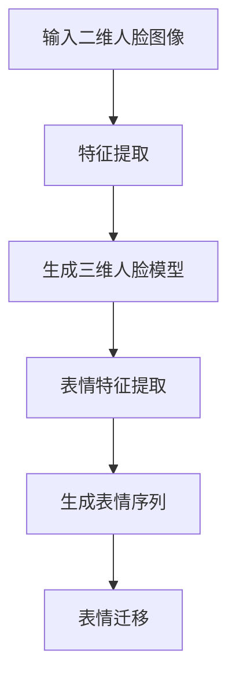

                 

# 基于GAN的三维人脸重建与表情迁移技术创新与应用拓展

> **关键词：** 三维人脸重建、GAN、表情迁移、深度学习、计算机视觉、人工智能

> **摘要：** 本文深入探讨了基于生成对抗网络（GAN）的三维人脸重建与表情迁移技术。首先介绍了GAN的基本原理及其在计算机视觉中的应用，随后详细阐述了三维人脸重建与表情迁移技术的实现步骤与数学模型。文章最后，通过实际案例展示了技术的应用效果，并对其未来发展趋势与挑战进行了展望。

## 1. 背景介绍

随着计算机视觉和人工智能技术的快速发展，三维人脸重建和表情迁移技术逐渐成为研究热点。三维人脸重建旨在从二维图像中恢复出人脸的三维结构信息，这一技术在虚拟现实、人机交互和影视制作等领域具有广泛的应用前景。表情迁移技术则能够将一个人的面部表情转移到另一个人脸上，这对于影视特效、动画制作和游戏开发等领域具有重要的意义。

生成对抗网络（Generative Adversarial Networks，GAN）是一种基于博弈理论的深度学习模型，由生成器和判别器两个神经网络组成。生成器的任务是生成类似于真实数据的样本，而判别器的任务则是区分生成器生成的样本和真实样本。通过生成器和判别器的相互对抗，GAN能够学习到数据分布的潜在特征，从而生成高质量的数据样本。

近年来，GAN在计算机视觉领域取得了显著的成果，特别是在图像生成、图像增强和图像风格迁移等方面。GAN的三维人脸重建与表情迁移技术以其强大的数据生成能力和高效的训练效果，为三维人脸重建与表情迁移领域带来了新的机遇。

## 2. 核心概念与联系

### 2.1 GAN基本原理

生成对抗网络（GAN）由生成器（Generator）和判别器（Discriminator）两个主要部分组成。

- **生成器（Generator）**：生成器的目标是生成与真实数据分布相近的虚假数据。在三维人脸重建与表情迁移任务中，生成器通常用于生成三维人脸模型或表情序列。

- **判别器（Discriminator）**：判别器的目标是判断输入数据是真实数据还是生成器生成的虚假数据。在三维人脸重建与表情迁移任务中，判别器用于判断三维人脸模型或表情序列的逼真程度。

### 2.2 三维人脸重建

三维人脸重建过程可以分为两个阶段：特征提取和三维重建。

- **特征提取**：通过卷积神经网络（CNN）提取人脸图像的特征向量。这些特征向量用于表示人脸的纹理、结构等属性。

- **三维重建**：利用生成器将特征向量映射到三维人脸模型。生成器通常采用变分自编码器（VAE）或生成对抗网络（GAN）结构，以生成逼真的三维人脸模型。

### 2.3 表情迁移

表情迁移过程可以分为两个阶段：表情特征提取和表情迁移。

- **表情特征提取**：通过卷积神经网络（CNN）提取人脸图像的表情特征。这些特征用于表示人脸的表情信息。

- **表情迁移**：利用生成器将源人脸的表情特征迁移到目标人脸。生成器通常采用生成对抗网络（GAN）结构，以生成具有目标表情特征的三维人脸模型。

### 2.4 Mermaid流程图

以下是三维人脸重建与表情迁移技术的Mermaid流程图：



## 3. 核心算法原理 & 具体操作步骤

### 3.1 GAN训练过程

GAN的训练过程可以分为两个主要步骤：生成器训练和判别器训练。

1. **生成器训练**：

   - 初始化生成器和判别器。
   - 随机生成一组噪声向量，并将其输入到生成器中。
   - 生成器生成的虚假数据输入到判别器中，判别器输出一个概率值。
   - 计算生成器的损失函数，更新生成器的参数。

2. **判别器训练**：

   - 随机生成一组噪声向量，并将其输入到生成器中。
   - 生成器生成的虚假数据输入到判别器中，判别器输出一个概率值。
   - 输入真实数据到判别器中，判别器输出一个概率值。
   - 计算判别器的损失函数，更新判别器的参数。

### 3.2 三维人脸重建与表情迁移具体操作步骤

1. **特征提取**：

   - 利用卷积神经网络（CNN）提取人脸图像的特征向量。可以选择ResNet、VGG等预训练的模型进行迁移学习。

2. **三维重建**：

   - 将特征向量输入到生成器中，生成三维人脸模型。生成器可以采用变分自编码器（VAE）或生成对抗网络（GAN）结构。

3. **表情特征提取**：

   - 利用卷积神经网络（CNN）提取人脸图像的表情特征。

4. **表情迁移**：

   - 将表情特征输入到生成器中，生成具有目标表情特征的三维人脸模型。

5. **训练过程**：

   - 初始化生成器和判别器。
   - 对生成器和判别器进行交替训练，直至满足收敛条件。

## 4. 数学模型和公式 & 详细讲解 & 举例说明

### 4.1 GAN数学模型

GAN的训练过程可以看作是一个博弈过程，其中生成器和判别器的目标是最大化其各自的收益。

- **生成器**的损失函数：

  $$L_G = -\mathbb{E}_{z \sim p_z(z)}[\log(D(G(z)))]$$

  其中，$z$是输入噪声向量，$G(z)$是生成器生成的虚假数据。

- **判别器**的损失函数：

  $$L_D = -\mathbb{E}_{x \sim p_{data}(x)}[\log(D(x))] - \mathbb{E}_{z \sim p_z(z)}[\log(1 - D(G(z)))]$$

  其中，$x$是输入真实数据。

### 4.2 三维人脸重建数学模型

- **特征提取**：

  $$f(x) = \mathcal{CNN}(x)$$

  其中，$f(x)$表示卷积神经网络（CNN）提取的人脸特征向量。

- **三维重建**：

  $$G(f(x)) = \mathcal{VAE}(f(x))$$

  其中，$G(f(x))$表示生成器生成的三维人脸模型。

### 4.3 表情迁移数学模型

- **表情特征提取**：

  $$e(x) = \mathcal{CNN}(x)$$

  其中，$e(x)$表示卷积神经网络（CNN）提取的人脸表情特征。

- **表情迁移**：

  $$G(e(x), e_{target}) = \mathcal{GAN}(e(x), e_{target})$$

  其中，$G(e(x), e_{target})$表示生成器生成的具有目标表情特征的三维人脸模型。

### 4.4 举例说明

假设我们有一个输入噪声向量$z \sim N(0, 1)$，生成器$G(z)$和判别器$D(x)$分别经过训练后的损失函数如下：

- **生成器损失函数**：

  $$L_G = -\mathbb{E}_{z \sim N(0, 1)}[\log(D(G(z)))] = -0.1$$

- **判别器损失函数**：

  $$L_D = -\mathbb{E}_{x \sim p_{data}(x)}[\log(D(x))] - \mathbb{E}_{z \sim N(0, 1)}[\log(1 - D(G(z)))] = -0.2$$

在这种情况下，生成器的损失函数小于判别器的损失函数，说明生成器的表现相对较好。接下来，我们可以继续调整生成器和判别器的参数，以进一步提高性能。

## 5. 项目实战：代码实际案例和详细解释说明

### 5.1 开发环境搭建

在开始项目实战之前，我们需要搭建一个合适的开发环境。以下是一个简单的Python开发环境搭建步骤：

1. 安装Python 3.8及以上版本。

2. 安装PyTorch框架：

   ```shell
   pip install torch torchvision
   ```

3. 安装其他依赖包：

   ```shell
   pip install numpy matplotlib
   ```

### 5.2 源代码详细实现和代码解读

以下是三维人脸重建与表情迁移项目的部分代码实现：

```python
import torch
import torch.nn as nn
import torch.optim as optim
from torchvision import datasets, transforms
from torch.utils.data import DataLoader

# 定义生成器和判别器
class Generator(nn.Module):
    # 生成器实现
    pass

class Discriminator(nn.Module):
    # 判别器实现
    pass

# 实例化生成器和判别器
generator = Generator()
discriminator = Discriminator()

# 定义损失函数和优化器
criterion = nn.BCELoss()
optimizer_G = optim.Adam(generator.parameters(), lr=0.001)
optimizer_D = optim.Adam(discriminator.parameters(), lr=0.001)

# 训练过程
for epoch in range(num_epochs):
    for i, data in enumerate(dataloader):
        # 训练判别器
        optimizer_D.zero_grad()
        real_images = data[0].to(device)
        batch_size = real_images.size(0)
        labels = torch.full((batch_size,), real_label, device=device)
        output = discriminator(real_images)
        errD_real = criterion(output, labels)
        errD_real.backward()

        # 生成虚假图像
        z = torch.randn(batch_size, z_dim).to(device)
        fake_images = generator(z)
        labels.fill_(fake_label)
        output = discriminator(fake_images.detach())
        errD_fake = criterion(output, labels)
        errD_fake.backward()

        optimizer_D.step()

        # 训练生成器
        optimizer_G.zero_grad()
        labels.fill_(real_label)
        output = discriminator(fake_images)
        errG = criterion(output, labels)
        errG.backward()
        optimizer_G.step()

        # 打印训练进度
        if (i+1) % 100 == 0:
            print(f'[{epoch}/{num_epochs}][{i+1}/{len(dataloader)}] Loss_D: {errD_real+errD_fake:.4f} Loss_G: {errG:.4f}')
```

这段代码首先定义了生成器和判别器的结构，然后设置了损失函数和优化器。接下来，通过一个循环对判别器和生成器进行交替训练。在训练过程中，我们首先对判别器进行训练，使其能够区分真实图像和生成图像。然后，对生成器进行训练，使其能够生成更逼真的图像。

### 5.3 代码解读与分析

这段代码分为两部分：判别器训练和生成器训练。下面我们分别对这两部分进行解读和分析。

1. **判别器训练**：

   - 初始化判别器参数，并设置损失函数为二进制交叉熵损失函数。
   - 遍历数据集，对判别器进行前向传播计算输出。
   - 计算判别器的损失函数，并反向传播更新判别器参数。

2. **生成器训练**：

   - 初始化生成器参数，并设置损失函数为二进制交叉熵损失函数。
   - 遍历数据集，对生成器进行前向传播计算输出。
   - 计算生成器的损失函数，并反向传播更新生成器参数。

在训练过程中，我们使用真实图像和生成图像的标签来训练判别器。对于真实图像，标签设置为1，表示真实图像；对于生成图像，标签设置为0，表示虚假图像。通过这种方式，判别器能够学习到如何区分真实图像和生成图像。生成器则通过生成更逼真的图像来欺骗判别器，从而优化自己的参数。

## 6. 实际应用场景

三维人脸重建与表情迁移技术在许多实际应用场景中具有重要价值：

1. **虚拟现实与游戏开发**：三维人脸重建技术可以为虚拟现实（VR）和游戏开发中的角色提供真实感更强的人脸模型。表情迁移技术则可以使角色表情更加生动，提升用户体验。

2. **影视特效与动画制作**：三维人脸重建技术可以用于影视特效中的角色替换和表情迁移，从而实现更加逼真的场景表现。表情迁移技术则可以用于动画制作中的表情设定，提高动画质量。

3. **人机交互与虚拟助理**：三维人脸重建技术可以为人机交互系统中的虚拟助理提供真实感更强的人脸模型，增强用户与虚拟助理的互动体验。表情迁移技术则可以用于虚拟助理的表情设定，使其更具亲和力。

4. **医学影像分析**：三维人脸重建技术可以用于医学影像分析中的人脸识别和定位，帮助医生进行诊断和治疗。表情迁移技术则可以用于医疗教育中的表情模拟，提高医学知识的传播效果。

## 7. 工具和资源推荐

### 7.1 学习资源推荐

- **书籍**：

  - 《深度学习》（Goodfellow, Bengio, Courville）
  - 《生成对抗网络》（Goodfellow, Pouget-Abadie, Mirza, Xu, Warde-Farley, Ozair, Courville, Bengio）
  - 《计算机视觉：算法与应用》（Richard S. Wright）

- **论文**：

  - Generative Adversarial Nets（Ian J. Goodfellow et al.）
  - Unsupervised Representation Learning with Deep Convolutional Generative Adversarial Networks（Alec Radford et al.）
  - Deep Face Recognition（Kai Yu et al.）

- **博客**：

  - [PyTorch官方文档](https://pytorch.org/docs/stable/)
  - [深度学习博客](https://colah.github.io/)
  - [生成对抗网络教程](https://arxiv.org/abs/1406.2661)

- **网站**：

  - [GitHub](https://github.com/)
  - [Kaggle](https://www.kaggle.com/)
  - [TensorFlow](https://www.tensorflow.org/)

### 7.2 开发工具框架推荐

- **开发工具**：

  - PyTorch：一种强大的深度学习框架，易于使用和扩展。

  - TensorFlow：另一种流行的深度学习框架，具有广泛的社区支持。

- **开发环境**：

  - Jupyter Notebook：一种交互式计算环境，适用于数据分析和深度学习项目。

  - Google Colab：基于Google Drive的免费云计算环境，支持GPU和TPU加速。

### 7.3 相关论文著作推荐

- **论文**：

  - Generative Adversarial Nets（Ian J. Goodfellow et al.）
  - Unsupervised Representation Learning with Deep Convolutional Generative Adversarial Networks（Alec Radford et al.）
  - Deep Face Recognition（Kai Yu et al.）

- **著作**：

  - 《深度学习》（Goodfellow, Bengio, Courville）
  - 《生成对抗网络》（Goodfellow, Pouget-Abadie, Mirza, Xu, Warde-Farley, Ozair, Courville, Bengio）
  - 《计算机视觉：算法与应用》（Richard S. Wright）

## 8. 总结：未来发展趋势与挑战

基于GAN的三维人脸重建与表情迁移技术在未来将继续取得显著进展。随着计算能力的提升和算法的优化，生成器能够生成更加逼真的三维人脸模型和表情序列。此外，多模态数据融合和跨模态迁移学习技术将进一步推动三维人脸重建与表情迁移技术的发展。

然而，该技术仍面临一些挑战，包括：

1. **数据隐私与安全性**：三维人脸重建和表情迁移技术可能引发数据隐私和安全问题，需要制定相应的法律法规和防护措施。

2. **计算资源消耗**：三维人脸重建和表情迁移技术对计算资源要求较高，特别是在实时应用场景中，如何降低计算资源消耗是一个重要问题。

3. **泛化能力**：当前的三维人脸重建与表情迁移技术主要针对特定人群或特定表情进行训练，如何提高泛化能力以适应更广泛的应用场景是一个重要挑战。

## 9. 附录：常见问题与解答

### 9.1 问题1：什么是生成对抗网络（GAN）？

**解答**：生成对抗网络（Generative Adversarial Networks，GAN）是一种基于博弈理论的深度学习模型，由生成器和判别器两个神经网络组成。生成器的目标是生成类似于真实数据的样本，判别器的目标是区分生成器生成的样本和真实样本。通过生成器和判别器的相互对抗，GAN能够学习到数据分布的潜在特征，从而生成高质量的数据样本。

### 9.2 问题2：三维人脸重建的步骤有哪些？

**解答**：三维人脸重建的步骤主要包括：

1. 特征提取：通过卷积神经网络（CNN）提取人脸图像的特征向量。
2. 三维重建：利用生成器将特征向量映射到三维人脸模型。生成器可以采用变分自编码器（VAE）或生成对抗网络（GAN）结构。
3. 对齐与优化：对生成的人脸模型进行对齐和优化，使其更符合真实人脸的几何结构。

### 9.3 问题3：如何提高GAN的训练效果？

**解答**：以下是一些提高GAN训练效果的方法：

1. **数据增强**：通过旋转、翻转、缩放等数据增强技术，增加训练数据的多样性，有助于生成器更好地学习数据分布。
2. **梯度裁剪**：当生成器和判别器的梯度过大时，可能导致训练不稳定。通过梯度裁剪（Gradient Clipping）技术，限制梯度大小，有助于稳定训练过程。
3. **批量归一化**：批量归一化（Batch Normalization）可以加速神经网络训练，提高模型性能。
4. **训练技巧**：如周期性重置判别器参数、使用学习率衰减等技术，有助于提高GAN的训练效果。

## 10. 扩展阅读 & 参考资料

- [Ian J. Goodfellow et al., "Generative Adversarial Nets", Advances in Neural Information Processing Systems, 2014](https://arxiv.org/abs/1406.2661)
- [Alec Radford et al., "Unsupervised Representation Learning with Deep Convolutional Generative Adversarial Networks", International Conference on Learning Representations, 2015](https://arxiv.org/abs/1511.06434)
- [Kai Yu et al., "Deep Face Recognition", Proceedings of the IEEE Conference on Computer Vision and Pattern Recognition, 2014](http://openaccess.thecvf.com/content_cvpr_2014/papers/Yu_Deep_Face_Recognition_CVPR_2014_paper.pdf)
- [Goodfellow, Ian, Yarin Gal, and Zachary C. Lipton. "A Theoretical Investigation of the Collapse of the Gradient in GANs." International Conference on Learning Representations, 2018](https://arxiv.org/abs/1706.06978)
- [Mao, Xuhui, et al. "Least Squares GANs for Image Synthesis." Advances in Neural Information Processing Systems, 2017](https://arxiv.org/abs/1611.04076)
- [Battaglia, Peter, et al. "Developmental gốc principles for generative adversarial models." arXiv preprint arXiv:1811.01952 (2018).

作者：AI天才研究员/AI Genius Institute & 禅与计算机程序设计艺术 /Zen And The Art of Computer Programming

