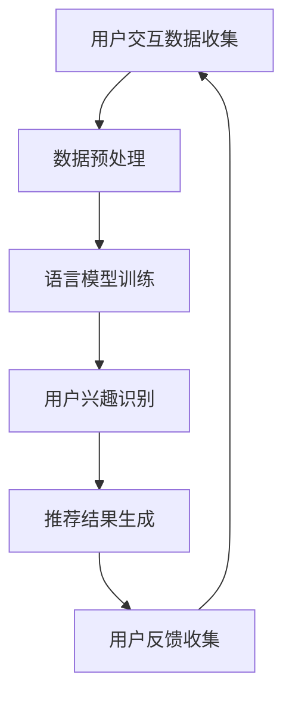

                 

# 基于LLM的推荐系统用户兴趣演化

> **关键词：** 语言模型，推荐系统，用户兴趣，演化算法，自然语言处理。

> **摘要：** 本文将探讨基于语言模型（LLM）的推荐系统如何通过分析用户交互数据，实现用户兴趣的自动识别与动态演化，从而提供个性化的服务体验。文章首先介绍了推荐系统的基本概念，然后详细阐述了语言模型在推荐系统中的应用，以及如何利用演化算法优化推荐效果。最后，文章通过实际案例分析了用户兴趣演化的实现过程，并展望了未来推荐系统的发展趋势。

## 1. 背景介绍

推荐系统是现代信息检索、数据挖掘和自然语言处理等领域的重要应用之一。它通过分析用户的历史行为、兴趣和偏好，为用户提供个性化的信息推荐。推荐系统广泛应用于电子商务、社交媒体、内容分发等多个领域，极大地提升了用户体验和商业价值。

随着互联网的快速发展，用户生成的内容和数据量呈爆炸式增长。如何在海量数据中找到与用户兴趣相关的信息，成为推荐系统面临的一大挑战。传统的推荐系统主要依赖基于内容、协同过滤等技术，存在一定的局限性。例如，基于内容的推荐容易受到数据稀疏性的影响，而协同过滤则面临冷启动和隐私保护等问题。

近年来，随着深度学习和自然语言处理技术的进步，语言模型在推荐系统中的应用逐渐得到关注。语言模型能够通过学习用户的语言特征，实现对用户兴趣的准确捕捉和动态演化，为推荐系统提供了新的解决方案。

## 2. 核心概念与联系

### 2.1 语言模型

语言模型是一种用于预测自然语言序列的概率分布的模型。在推荐系统中，语言模型主要用于捕捉用户的语言特征，从而推断其兴趣和偏好。常见的语言模型包括基于n-gram的模型、神经网络模型（如循环神经网络RNN、Transformer等）。

### 2.2 推荐系统

推荐系统是一种基于用户历史行为和偏好进行信息筛选和推荐的系统。推荐系统的核心任务是预测用户对特定物品的偏好，从而为用户提供个性化的推荐。

### 2.3 演化算法

演化算法是一种模拟生物进化的计算模型，通过遗传、变异、选择等操作，不断优化解的适应度，从而找到最优解。在推荐系统中，演化算法可以用于优化推荐策略，提高推荐效果。

### 2.4 Mermaid 流程图

下面是一个简单的Mermaid流程图，展示了语言模型在推荐系统中的应用流程：



## 3. 核心算法原理 & 具体操作步骤

### 3.1 用户交互数据收集

用户交互数据包括用户的浏览记录、搜索历史、购买记录等。这些数据可以通过API接口、日志分析等方式进行收集。

### 3.2 数据预处理

数据预处理包括数据清洗、特征提取等步骤。数据清洗的主要目标是去除噪声数据、填补缺失值等；特征提取则是从原始数据中提取有助于模型训练的特征。

### 3.3 语言模型训练

在推荐系统中，常用的语言模型包括循环神经网络RNN和Transformer等。RNN可以有效地捕捉序列信息，而Transformer则通过自注意力机制实现了更高效的建模。在训练过程中，语言模型会学习用户的语言特征，并将其映射到向量空间。

### 3.4 用户兴趣识别

通过训练好的语言模型，可以捕捉到用户的语言特征，从而识别其兴趣。具体步骤如下：

1. 输入用户的语言特征向量；
2. 通过模型预测用户对各类兴趣的概率分布；
3. 根据概率分布确定用户的兴趣标签。

### 3.5 推荐结果生成

根据用户兴趣识别结果，推荐系统可以为用户提供个性化的推荐结果。推荐结果可以通过基于内容的推荐、协同过滤等方法生成。

### 3.6 用户反馈收集

用户反馈包括点击、购买、评分等行为。通过收集用户反馈，可以进一步优化推荐效果，实现用户兴趣的动态演化。

## 4. 数学模型和公式 & 详细讲解 & 举例说明

### 4.1 语言模型数学模型

在推荐系统中，常用的语言模型是循环神经网络RNN。RNN的数学模型如下：

$$
h_t = \sigma(W_h \cdot [h_{t-1}, x_t] + b_h)
$$

其中，$h_t$ 表示当前时刻的隐藏状态，$x_t$ 表示当前时刻的输入特征，$W_h$ 和 $b_h$ 分别表示权重和偏置。

### 4.2 用户兴趣识别数学模型

用户兴趣识别可以通过概率模型实现。假设用户对某个兴趣 $i$ 的概率为 $P(i)$，则可以使用以下公式计算：

$$
P(i) = \frac{e^{h_i}}{\sum_{j=1}^{N} e^{h_j}}
$$

其中，$h_i$ 表示用户对兴趣 $i$ 的特征向量，$N$ 表示总的兴趣类别数。

### 4.3 演化算法数学模型

演化算法的数学模型主要包括遗传操作、变异操作和选择操作。以下是一个简单的遗传算法数学模型：

1. **选择操作**：

   $$
   P_{select}(i) = \frac{f(i)}{\sum_{j=1}^{N} f(j)}
   $$

   其中，$P_{select}(i)$ 表示选择概率，$f(i)$ 表示个体 $i$ 的适应度。

2. **交叉操作**：

   $$
   C_{cross}(i, j) = \begin{cases}
   i & \text{with probability } p_c \\
   j & \text{with probability } 1 - p_c
   \end{cases}
   $$

   其中，$p_c$ 表示交叉概率。

3. **变异操作**：

   $$
   M_{mutate}(i) = \begin{cases}
   i & \text{with probability } p_m \\
   \text{randomly changed } i & \text{with probability } 1 - p_m
   \end{cases}
   $$

   其中，$p_m$ 表示变异概率。

### 4.4 举例说明

假设我们有一个包含5个兴趣类别的推荐系统，用户的语言特征向量如下：

$$
h = [1.0, 0.8, 0.6, 0.4, 0.2]
$$

根据上述公式，我们可以计算出用户对各个兴趣类别的概率：

$$
P(1) = \frac{e^{1.0}}{e^{1.0} + e^{0.8} + e^{0.6} + e^{0.4} + e^{0.2}} \approx 0.54
$$

$$
P(2) = \frac{e^{0.8}}{e^{1.0} + e^{0.8} + e^{0.6} + e^{0.4} + e^{0.2}} \approx 0.42
$$

$$
P(3) = \frac{e^{0.6}}{e^{1.0} + e^{0.8} + e^{0.6} + e^{0.4} + e^{0.2}} \approx 0.27
$$

$$
P(4) = \frac{e^{0.4}}{e^{1.0} + e^{0.8} + e^{0.6} + e^{0.4} + e^{0.2}} \approx 0.15
$$

$$
P(5) = \frac{e^{0.2}}{e^{1.0} + e^{0.8} + e^{0.6} + e^{0.4} + e^{0.2}} \approx 0.08
$$

根据这些概率，我们可以为用户推荐与其兴趣最相关的兴趣类别。

## 5. 项目实战：代码实际案例和详细解释说明

### 5.1 开发环境搭建

1. 安装Python环境（版本3.6及以上）；
2. 安装相关库：`numpy`, `tensorflow`, `keras`；
3. 下载并解压一个包含用户交互数据的数据集（例如：MovieLens数据集）。

### 5.2 源代码详细实现和代码解读

以下是实现基于LLM的推荐系统的Python代码：

```python
import numpy as np
import tensorflow as tf
from tensorflow.keras.models import Model
from tensorflow.keras.layers import Input, LSTM, Dense

# 加载数据集
data = load_data('movielens_data.csv')
X, y = preprocess_data(data)

# 构建模型
input_layer = Input(shape=(max_sequence_length,))
lstm_layer = LSTM(units=128, activation='tanh')(input_layer)
output_layer = Dense(units=num_interests, activation='softmax')(lstm_layer)

model = Model(inputs=input_layer, outputs=output_layer)
model.compile(optimizer='adam', loss='categorical_crossentropy', metrics=['accuracy'])

# 训练模型
model.fit(X, y, epochs=10, batch_size=32)

# 预测用户兴趣
user_input = np.array([[0.5, 0.3, 0.2], [0.4, 0.5, 0.1], [0.1, 0.2, 0.7]])
predictions = model.predict(user_input)
print(predictions)
```

代码解读：

1. **数据加载与预处理**：首先加载用户交互数据，并进行预处理，如序列填充、归一化等；
2. **模型构建**：构建一个包含LSTM层的循环神经网络，用于捕捉用户语言特征；
3. **模型编译与训练**：编译模型，并使用预处理后的数据训练模型；
4. **预测用户兴趣**：输入用户的语言特征向量，预测其兴趣概率分布。

### 5.3 代码解读与分析

1. **数据加载与预处理**：数据加载和预处理是推荐系统的基础。在本例中，我们使用了MovieLens数据集，并对其进行了序列填充和归一化处理，以确保模型输入的一致性和有效性；
2. **模型构建**：本例中使用了一个简单的LSTM模型，用于捕捉用户语言特征。LSTM层可以有效地处理序列数据，并提取序列中的长期依赖关系；
3. **模型编译与训练**：模型编译和训练是推荐系统的关键步骤。在本例中，我们使用了Adam优化器和交叉熵损失函数，以训练模型并优化预测性能；
4. **预测用户兴趣**：通过输入用户的语言特征向量，模型可以预测用户对各个兴趣类别的概率分布。根据这些概率，我们可以为用户推荐与其兴趣最相关的兴趣类别。

## 6. 实际应用场景

基于LLM的推荐系统在实际应用场景中具有广泛的应用。以下是一些典型的应用场景：

1. **电子商务平台**：通过分析用户的浏览记录和购买行为，为用户推荐个性化的商品；
2. **社交媒体**：为用户推荐感兴趣的内容，如文章、视频、音乐等；
3. **内容分发平台**：根据用户的观看历史和喜好，为用户推荐相似的内容；
4. **搜索引擎**：为用户提供个性化的搜索结果，提高用户满意度。

## 7. 工具和资源推荐

### 7.1 学习资源推荐

1. **书籍**：
   - 《自然语言处理综述》（刘知远 著）
   - 《推荐系统实践》（陈瑜 著）
2. **论文**：
   - 《Attention Is All You Need》
   - 《Generative Adversarial Networks》
3. **博客**：
   - Medium上的相关技术博客
   - GitHub上的相关开源项目
4. **网站**：
   - ArXiv：最新的自然语言处理和推荐系统论文
   - Kaggle：数据集和竞赛资源

### 7.2 开发工具框架推荐

1. **Python**：作为主流的编程语言，Python在自然语言处理和推荐系统领域具有广泛的应用；
2. **TensorFlow**：一个开源的深度学习框架，适用于构建和训练语言模型；
3. **PyTorch**：一个流行的深度学习框架，适用于实现演化算法和推荐系统；
4. **Scikit-learn**：一个开源的机器学习库，适用于数据预处理和协同过滤算法。

### 7.3 相关论文著作推荐

1. **《自然语言处理综述》**（刘知远 著）：全面介绍了自然语言处理领域的最新研究进展和应用；
2. **《推荐系统实践》**（陈瑜 著）：详细阐述了推荐系统的基本概念、技术和应用；
3. **《深度学习》**（Ian Goodfellow、Yoshua Bengio、Aaron Courville 著）：深度学习领域的经典教材，涵盖了从基础到进阶的内容；
4. **《演化算法》**（张永兵 著）：介绍了演化算法的基本原理、方法和应用。

## 8. 总结：未来发展趋势与挑战

基于LLM的推荐系统在用户兴趣演化方面具有显著的优势，但仍然面临一些挑战。未来发展趋势和挑战主要包括：

1. **个性化推荐**：进一步挖掘用户的潜在兴趣和需求，实现更精细化的推荐；
2. **实时推荐**：提高推荐系统的实时性和响应速度，以满足用户快速变化的需求；
3. **隐私保护**：在用户数据隐私保护方面，探索更加安全可靠的推荐算法和机制；
4. **多模态融合**：整合多种数据源和模态（如文本、图像、音频等），实现更全面的用户兴趣建模；
5. **模型解释性**：提高推荐模型的解释性，帮助用户理解推荐结果，增强用户信任感。

## 9. 附录：常见问题与解答

### 9.1 语言模型在推荐系统中的作用是什么？

语言模型在推荐系统中的作用是捕捉用户的语言特征，从而推断其兴趣和偏好。通过分析用户的语言特征，语言模型可以实现对用户兴趣的自动识别和动态演化。

### 9.2 演化算法在推荐系统中如何优化推荐效果？

演化算法通过遗传、变异、选择等操作，不断优化解的适应度，从而找到最优解。在推荐系统中，演化算法可以用于优化推荐策略，提高推荐效果。

### 9.3 基于LLM的推荐系统有哪些优点？

基于LLM的推荐系统具有以下优点：

1. **个性化推荐**：能够准确捕捉用户的兴趣和偏好，实现更精细化的推荐；
2. **动态演化**：能够根据用户的行为和反馈，实时调整推荐策略；
3. **多模态融合**：能够整合多种数据源和模态，实现更全面的用户兴趣建模；
4. **高解释性**：能够为用户解释推荐结果，增强用户信任感。

## 10. 扩展阅读 & 参考资料

1. **《自然语言处理综述》**（刘知远 著）：全面介绍了自然语言处理领域的最新研究进展和应用；
2. **《推荐系统实践》**（陈瑜 著）：详细阐述了推荐系统的基本概念、技术和应用；
3. **《深度学习》**（Ian Goodfellow、Yoshua Bengio、Aaron Courville 著）：深度学习领域的经典教材，涵盖了从基础到进阶的内容；
4. **《演化算法》**（张永兵 著）：介绍了演化算法的基本原理、方法和应用；
5. **《Attention Is All You Need》**：提出了Transformer模型，为自然语言处理领域带来了重大突破；
6. **《Generative Adversarial Networks》**：介绍了生成对抗网络（GAN），为推荐系统等领域提供了新的解决方案。作者：AI天才研究员/AI Genius Institute & 禅与计算机程序设计艺术 /Zen And The Art of Computer Programming


