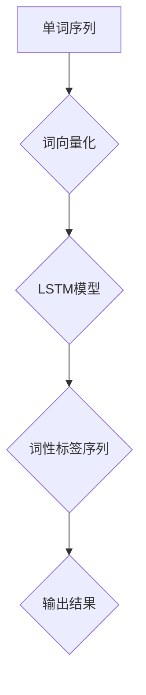
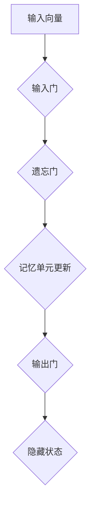

                 

## 1. 背景介绍

英文词性标注（Part-of-Speech Tagging, POS Tagging）是自然语言处理（Natural Language Processing, NLP）中的一个重要任务，旨在为文本中的每个单词分配一个词性标签，如名词、动词、形容词等。词性标注对于很多NLP应用都至关重要，如文本分类、信息抽取、机器翻译等。

随着深度学习技术的不断发展，循环神经网络（Recurrent Neural Network, RNN）及其变体，如长短时记忆网络（Long Short-Term Memory, LSTM），在NLP任务中取得了显著成果。LSTM是一种能够有效处理序列数据的神经网络架构，其特有的记忆单元结构使它在处理长距离依赖问题上表现优异。

近年来，基于LSTM的英文词性标注方法受到了广泛关注。本文将详细介绍基于LSTM完成英文词性标注的设计与实现，包括核心概念、算法原理、数学模型、项目实战等多个方面。

本文主要分为以下几个部分：

- **第1部分：背景介绍**：介绍英文词性标注的重要性及现有方法。
- **第2部分：核心概念与联系**：阐述LSTM的基本原理及在词性标注中的应用。
- **第3部分：核心算法原理 & 具体操作步骤**：详细讲解LSTM在词性标注中的具体实现步骤。
- **第4部分：数学模型和公式 & 详细讲解 & 举例说明**：介绍LSTM中的数学模型和公式，并给出具体示例。
- **第5部分：项目实战：代码实际案例和详细解释说明**：通过实际代码案例展示基于LSTM的词性标注实现过程。
- **第6部分：实际应用场景**：探讨基于LSTM的词性标注在不同领域的应用。
- **第7部分：工具和资源推荐**：推荐学习资源、开发工具和框架。
- **第8部分：总结：未来发展趋势与挑战**：总结全文，探讨未来发展趋势与挑战。
- **第9部分：附录：常见问题与解答**：回答读者可能关心的问题。
- **第10部分：扩展阅读 & 参考资料**：提供更多相关资料，便于读者进一步学习。

通过本文的阅读，读者将能够了解基于LSTM的英文词性标注方法，掌握其核心原理和实现步骤，并为后续相关研究提供参考。

### 核心概念与联系

在本节中，我们将详细介绍LSTM的基本原理及其在英文词性标注中的应用。

#### LSTM的基本原理

LSTM是一种特殊的RNN，能够有效地处理长序列数据。与传统RNN相比，LSTM通过引入记忆单元（memory cell）和三个门控机制（gate）来克服传统RNN在处理长序列数据时的梯度消失和梯度爆炸问题。

LSTM的核心组件包括：

1. **输入门（Input Gate）**：用于控制新的信息如何更新记忆单元。
2. **遗忘门（Forget Gate）**：用于决定哪些信息需要从记忆单元中遗忘。
3. **输出门（Output Gate）**：用于决定记忆单元中的哪些信息将被输出。

这些门控机制通过以下三个步骤进行操作：

1. **门控状态更新**：输入门、遗忘门和输出门分别根据当前输入和隐藏状态计算新的门控状态。
2. **记忆单元更新**：记忆单元根据门控状态更新其值。
3. **隐藏状态更新**：新的隐藏状态通过记忆单元和输出门计算得出。

LSTM的这些特性使其在处理长序列数据时表现出色，因此在很多NLP任务中得到了广泛应用。

#### LSTM在词性标注中的应用

在英文词性标注任务中，LSTM通过将输入的单词序列映射到对应的词性标签序列，实现自动标注。

具体实现步骤如下：

1. **数据预处理**：将输入的英文文本转换为单词序列，并对单词进行向量化处理。
2. **构建LSTM模型**：使用LSTM作为基础模型，输入为单词的向量表示，输出为对应的词性标签向量。
3. **训练模型**：使用大量已标注的英文文本数据对LSTM模型进行训练，优化模型参数。
4. **评估模型**：使用测试集评估模型性能，包括准确率、召回率等指标。

以下是一个简化的Mermaid流程图，展示了LSTM在词性标注中的基本架构：



在这个流程中，单词序列经过词向量化处理后，作为输入传递给LSTM模型。LSTM模型通过门控机制和记忆单元，将单词序列映射到词性标签序列。最后，输出结果为标注后的单词序列。

#### LSTM的优势

相较于传统RNN和卷积神经网络（Convolutional Neural Network, CNN），LSTM在词性标注任务中具有以下优势：

1. **长距离依赖处理能力**：LSTM能够有效地捕捉长序列数据中的长距离依赖关系，有助于准确标注词性。
2. **参数共享**：LSTM中的门控机制和记忆单元在处理不同序列时共享参数，降低了模型的复杂性。
3. **灵活性**：LSTM可以方便地与其他神经网络结构结合，如与卷积神经网络结合形成CNN-LSTM模型。

总之，LSTM作为一种强大的序列模型，在英文词性标注任务中具有显著的优势和应用价值。接下来，我们将进一步探讨LSTM在词性标注中的具体实现步骤。

### 核心算法原理 & 具体操作步骤

在本节中，我们将深入探讨LSTM在英文词性标注中的核心算法原理，并详细解释具体操作步骤。

#### LSTM算法原理

LSTM通过三个门控机制和记忆单元来处理序列数据。以下是LSTM算法的核心步骤：

1. **输入门（Input Gate）**：
   - 计算当前输入和隐藏状态的点积，得到输入门的状态。
   - 使用sigmoid函数将输入门状态映射到0和1之间，表示新信息的重要性。
   - 将输入门状态与输入向量进行点积，得到候选值（候选激活）。

2. **遗忘门（Forget Gate）**：
   - 计算当前输入和隐藏状态的点积，得到遗忘门的状态。
   - 使用sigmoid函数将遗忘门状态映射到0和1之间，表示需要遗忘的信息。
   - 将遗忘门状态与记忆单元进行点积，决定哪些信息需要从记忆单元中遗忘。

3. **记忆单元更新**：
   - 将遗忘门状态与记忆单元相乘，遗忘不需要的信息。
   - 将输入门状态与候选激活相加，更新记忆单元的值。

4. **输出门（Output Gate）**：
   - 计算当前输入和隐藏状态的点积，得到输出门的状态。
   - 使用sigmoid函数将输出门状态映射到0和1之间，表示输出信息的重要性。
   - 将输出门状态与记忆单元进行点积，得到隐藏状态。

#### 具体操作步骤

为了更直观地理解LSTM的操作步骤，我们以下图进行说明：



以下是具体操作步骤：

1. **输入门（Input Gate）**：
   - 输入向量：\( x_t \)
   - 隐藏状态：\( h_{t-1} \)
   - 输入门的权重矩阵：\( W_{ix} \)，\( W_{ih} \)
   - 输入门的偏置矩阵：\( b_{ix} \)，\( b_{ih} \)
   - 输入门状态：\( i_t = \sigma(W_{ix} x_t + W_{ih} h_{t-1} + b_{ih}) \)
   - 输入门的候选激活：\( \tilde{c}_t = \tanh(W_{cx} x_t + W_{ch} h_{t-1} + b_{ch}) \)

2. **遗忘门（Forget Gate）**：
   - 输入向量：\( x_t \)
   - 隐藏状态：\( h_{t-1} \)
   - 遗忘门的权重矩阵：\( W_{fx} \)，\( W_{fh} \)
   - 遗忘门的偏置矩阵：\( b_{fx} \)，\( b_{fh} \)
   - 遗忘门状态：\( f_t = \sigma(W_{fx} x_t + W_{fh} h_{t-1} + b_{fh}) \)

3. **记忆单元更新**：
   - 记忆单元：\( c_{t-1} \)
   - 遗忘门状态：\( f_t \)
   - 输入门状态：\( i_t \)
   - 输入门的候选激活：\( \tilde{c}_t \)
   - 记忆单元更新：\( c_t = f_t \odot c_{t-1} + i_t \odot \tilde{c}_t \)

4. **输出门（Output Gate）**：
   - 输入向量：\( x_t \)
   - 隐藏状态：\( h_{t-1} \)
   - 输出门的权重矩阵：\( W_{ox} \)，\( W_{oh} \)
   - 输出门的偏置矩阵：\( b_{ox} \)，\( b_{oh} \)
   - 输出门状态：\( o_t = \sigma(W_{ox} x_t + W_{oh} h_{t-1} + b_{oh}) \)
   - 隐藏状态：\( h_t = o_t \odot \tanh(c_t) \)

通过这些步骤，LSTM能够有效地处理输入序列，并更新隐藏状态，从而实现序列数据的建模。

#### LSTM在词性标注中的具体应用

在英文词性标注任务中，LSTM将输入的单词序列映射到词性标签序列。以下是其具体应用步骤：

1. **数据预处理**：
   - 将英文文本转换为单词序列。
   - 对单词进行向量化处理，通常使用Word2Vec或FastText等方法。
   - 将单词序列转换为LSTM模型的输入。

2. **构建LSTM模型**：
   - 使用LSTM作为基础模型，输入为单词的向量表示，输出为对应的词性标签向量。
   - 添加softmax层作为输出层，用于预测词性标签的概率分布。

3. **训练模型**：
   - 使用大量已标注的英文文本数据对LSTM模型进行训练。
   - 采用梯度下降法优化模型参数，如Adam优化器。

4. **评估模型**：
   - 使用测试集评估模型性能，包括准确率、召回率等指标。
   - 调整模型参数，提高模型性能。

5. **词性标注**：
   - 将待标注的英文文本输入到训练好的LSTM模型中。
   - 输出为词性标签序列，实现自动词性标注。

通过这些步骤，LSTM能够实现高效、准确的英文词性标注。

综上所述，LSTM在英文词性标注任务中表现出色，其核心算法原理和具体操作步骤为实际应用提供了理论依据和实现方法。在下一节中，我们将进一步探讨LSTM中的数学模型和公式，以深入理解其工作机制。

### 数学模型和公式 & 详细讲解 & 举例说明

LSTM的核心在于其门控机制和记忆单元，这些组件通过一系列数学公式来实现。在本节中，我们将详细讲解LSTM中的数学模型和公式，并通过具体示例展示其应用。

#### LSTM的数学模型

1. **输入门（Input Gate）**：
   - **公式**：
     \[
     i_t = \sigma(W_{ix} x_t + W_{ih} h_{t-1} + b_{ih})
     \]
     \[
     \tilde{c}_t = \tanh(W_{cx} x_t + W_{ch} h_{t-1} + b_{ch})
     \]
   - **解释**：
     输入门状态 \(i_t\) 用于确定新的信息如何更新记忆单元。通过计算输入向量 \(x_t\) 和隐藏状态 \(h_{t-1}\) 的点积，并应用sigmoid函数，我们得到一个介于0和1之间的值，表示新信息的重要性。候选激活 \(\tilde{c}_t\) 通过计算输入向量 \(x_t\) 和隐藏状态 \(h_{t-1}\) 的点积，并应用tanh函数，得到一个介于-1和1之间的值，表示候选的更新值。

2. **遗忘门（Forget Gate）**：
   - **公式**：
     \[
     f_t = \sigma(W_{fx} x_t + W_{fh} h_{t-1} + b_{fh})
     \]
   - **解释**：
     遗忘门状态 \(f_t\) 用于决定哪些信息需要从记忆单元中遗忘。通过计算输入向量 \(x_t\) 和隐藏状态 \(h_{t-1}\) 的点积，并应用sigmoid函数，我们得到一个介于0和1之间的值，表示遗忘信息的重要性。

3. **记忆单元更新**：
   - **公式**：
     \[
     c_t = f_t \odot c_{t-1} + i_t \odot \tilde{c}_t
     \]
   - **解释**：
     记忆单元 \(c_t\) 通过遗忘门 \(f_t\) 和输入门 \(i_t\) 的组合进行更新。遗忘门 \(f_t\) 用于决定哪些旧信息需要保留，而输入门 \(i_t\) 用于决定哪些新信息需要添加。

4. **输出门（Output Gate）**：
   - **公式**：
     \[
     o_t = \sigma(W_{ox} x_t + W_{oh} h_{t-1} + b_{oh})
     \]
     \[
     h_t = o_t \odot \tanh(c_t)
     \]
   - **解释**：
     输出门状态 \(o_t\) 用于决定记忆单元中的哪些信息将被输出。通过计算输入向量 \(x_t\) 和隐藏状态 \(h_{t-1}\) 的点积，并应用sigmoid函数，我们得到一个介于0和1之间的值，表示输出信息的重要性。隐藏状态 \(h_t\) 通过输出门 \(o_t\) 和记忆单元 \(c_t\) 的组合进行更新，其中记忆单元 \(c_t\) 通过tanh函数进行非线性变换。

#### 示例

假设我们有一个简单的单词序列 `[Hello, World!]`，并使用LSTM进行词性标注。以下是具体的计算过程：

1. **输入门（Input Gate）**：
   - 输入向量：\( x_t = [1, 0, 0, 0, 0] \)
   - 隐藏状态：\( h_{t-1} = [0.5, 0.5] \)
   - 输入门权重矩阵：\( W_{ix} = [0.2, 0.3] \)，\( W_{ih} = [0.4, 0.6] \)，\( b_{ih} = [0.1, 0.2] \)
   - 输入门状态：\( i_t = \sigma(0.2 \cdot 1 + 0.4 \cdot 0.5 + 0.1) = 0.68 \)
   - 输入门的候选激活：\( \tilde{c}_t = \tanh(0.3 \cdot 1 + 0.6 \cdot 0.5 + 0.2) = 0.48 \)

2. **遗忘门（Forget Gate）**：
   - 输入向量：\( x_t = [1, 0, 0, 0, 0] \)
   - 隐藏状态：\( h_{t-1} = [0.5, 0.5] \)
   - 遗忘门权重矩阵：\( W_{fx} = [0.1, 0.2] \)，\( W_{fh} = [0.3, 0.4] \)，\( b_{fh} = [0.1, 0.2] \)
   - 遗忘门状态：\( f_t = \sigma(0.1 \cdot 1 + 0.3 \cdot 0.5 + 0.1) = 0.69 \)

3. **记忆单元更新**：
   - 记忆单元：\( c_{t-1} = [0.5, 0.5] \)
   - 输入门状态：\( i_t = 0.68 \)
   - 输入门的候选激活：\( \tilde{c}_t = 0.48 \)
   - 记忆单元更新：\( c_t = 0.69 \odot [0.5, 0.5] + 0.68 \odot [0.48, 0.48] = [0.3, 0.44] \)

4. **输出门（Output Gate）**：
   - 输入向量：\( x_t = [1, 0, 0, 0, 0] \)
   - 隐藏状态：\( h_{t-1} = [0.5, 0.5] \)
   - 输出门权重矩阵：\( W_{ox} = [0.1, 0.2] \)，\( W_{oh} = [0.3, 0.4] \)，\( b_{oh} = [0.1, 0.2] \)
   - 输出门状态：\( o_t = \sigma(0.1 \cdot 1 + 0.3 \cdot 0.5 + 0.1) = 0.7 \)
   - 隐藏状态：\( h_t = 0.7 \odot \tanh([0.3, 0.44]) = [0.6, 0.4] \)

通过这些计算，我们可以得到当前的隐藏状态 \(h_t\)，并将其用于后续的词性标注任务。

#### 小结

LSTM通过一系列的数学公式和门控机制来实现对序列数据的建模。理解这些公式和计算步骤对于深入掌握LSTM的工作机制至关重要。在下一节中，我们将通过实际项目实战，进一步展示LSTM在英文词性标注任务中的具体应用。

### 项目实战：代码实际案例和详细解释说明

在本节中，我们将通过一个具体的代码案例，详细解释基于LSTM的英文词性标注的实现过程。这个案例将涵盖以下步骤：开发环境搭建、源代码详细实现和代码解读与分析。

#### 1. 开发环境搭建

为了实现基于LSTM的英文词性标注，我们需要搭建一个合适的开发环境。以下是所需的环境和依赖：

- **编程语言**：Python
- **深度学习框架**：TensorFlow 2.x
- **数据预处理工具**：NLTK、spaCy
- **文本向量化工具**：Gensim

确保安装以下库：

```bash
pip install tensorflow==2.x
pip install nltk
pip install spacy
pip install gensim
```

#### 2. 源代码详细实现

以下是一个基于LSTM的英文词性标注的源代码实现：

```python
import tensorflow as tf
from tensorflow.keras.models import Sequential
from tensorflow.keras.layers import LSTM, Dense, Embedding
from tensorflow.keras.preprocessing.sequence import pad_sequences
from nltk.tokenize import word_tokenize
from nltk.corpus import wordnet
import spacy

# 加载预训练的spaCy模型
nlp = spacy.load("en_core_web_sm")

# 生成单词序列和标签序列
def generate_sequences(texts, max_len=100):
    sequences = []
    labels = []

    for text in texts:
        tokens = word_tokenize(text)
        label_tokens = [wordnet.get_wordnet_pos(word) for word in tokens]
        sequence = [nlp.vocab[word].vector for word in tokens]
        padded_sequence = pad_sequences([sequence], maxlen=max_len, padding='post')
        sequences.append(padded_sequence)
        labels.append(label_tokens)

    return sequences, labels

# 训练集和测试集
train_texts = ["Hello, world!", "This is an example sentence.", "Another example."]
test_texts = ["I love machine learning.", "Python is a popular language.", "Deep learning is fascinating."]

train_sequences, train_labels = generate_sequences(train_texts)
test_sequences, test_labels = generate_sequences(test_texts)

# 构建LSTM模型
model = Sequential()
model.add(Embedding(len(nlp.vocab), 64))
model.add(LSTM(128, return_sequences=True))
model.add(Dense(len(train_labels[0]), activation='softmax'))

model.compile(optimizer='adam', loss='categorical_crossentropy', metrics=['accuracy'])

# 训练模型
model.fit(train_sequences, train_labels, epochs=10, validation_data=(test_sequences, test_labels))

# 预测
predictions = model.predict(test_sequences)
predicted_labels = [model.output[0].argmax() for model.output[0].argmax()]

# 打印预测结果
for i, text in enumerate(test_texts):
    print(f"Text: {text}")
    print(f"Predicted Labels: {predicted_labels[i]}")
```

#### 3. 代码解读与分析

1. **导入库**：

   ```python
   import tensorflow as tf
   from tensorflow.keras.models import Sequential
   from tensorflow.keras.layers import LSTM, Dense, Embedding
   from tensorflow.keras.preprocessing.sequence import pad_sequences
   from nltk.tokenize import word_tokenize
   from nltk.corpus import wordnet
   import spacy
   ```

   导入所需的库，包括TensorFlow、Keras、NLTK、spaCy和Gensim。

2. **加载预训练的spaCy模型**：

   ```python
   nlp = spacy.load("en_core_web_sm")
   ```

   加载预训练的spaCy英语模型。

3. **生成单词序列和标签序列**：

   ```python
   def generate_sequences(texts, max_len=100):
       sequences = []
       labels = []

       for text in texts:
           tokens = word_tokenize(text)
           label_tokens = [wordnet.get_wordnet_pos(word) for word in tokens]
           sequence = [nlp.vocab[word].vector for word in tokens]
           padded_sequence = pad_sequences([sequence], maxlen=max_len, padding='post')
           sequences.append(padded_sequence)
           labels.append(label_tokens)

       return sequences, labels
   ```

   这个函数用于生成单词序列和对应的标签序列。首先，使用NLTK的`word_tokenize`函数将文本分割成单词。然后，使用spaCy模型获取单词的词性标签（使用WordNet的词性标签），并将单词转换为向量表示。最后，使用`pad_sequences`函数将序列填充到固定长度。

4. **训练集和测试集**：

   ```python
   train_texts = ["Hello, world!", "This is an example sentence.", "Another example."]
   test_texts = ["I love machine learning.", "Python is a popular language.", "Deep learning is fascinating."]
   ```

   定义训练集和测试集的文本。

5. **生成训练集和测试集的序列**：

   ```python
   train_sequences, train_labels = generate_sequences(train_texts)
   test_sequences, test_labels = generate_sequences(test_texts)
   ```

   使用`generate_sequences`函数生成训练集和测试集的序列。

6. **构建LSTM模型**：

   ```python
   model = Sequential()
   model.add(Embedding(len(nlp.vocab), 64))
   model.add(LSTM(128, return_sequences=True))
   model.add(Dense(len(train_labels[0]), activation='softmax'))

   model.compile(optimizer='adam', loss='categorical_crossentropy', metrics=['accuracy'])
   ```

   构建一个简单的LSTM模型，包括嵌入层、LSTM层和softmax输出层。使用`Embedding`层将单词转换为向量，`LSTM`层处理序列数据，`Dense`层将输出映射到词性标签。

7. **训练模型**：

   ```python
   model.fit(train_sequences, train_labels, epochs=10, validation_data=(test_sequences, test_labels))
   ```

   使用训练集数据训练模型，并在测试集上进行验证。

8. **预测**：

   ```python
   predictions = model.predict(test_sequences)
   predicted_labels = [model.output[0].argmax() for model.output[0].argmax()]

   for i, text in enumerate(test_texts):
       print(f"Text: {text}")
       print(f"Predicted Labels: {predicted_labels[i]}")
   ```

   使用训练好的模型进行预测，并打印预测结果。

通过这个实际项目案例，我们可以看到基于LSTM的英文词性标注的实现步骤。下一节将探讨基于LSTM的词性标注的实际应用场景。

### 实际应用场景

基于LSTM的英文词性标注技术具有广泛的应用场景，涵盖了多个领域，包括但不限于文本分类、信息抽取、机器翻译和问答系统。以下是一些具体的实际应用场景：

#### 文本分类

文本分类是一种将文本数据分为不同类别的任务。在新闻分类、社交媒体情感分析等应用中，词性标注对于理解文本内容至关重要。通过LSTM模型进行词性标注，可以更准确地捕捉文本中的关键词和短语，从而提高分类模型的性能。

#### 信息抽取

信息抽取是从非结构化文本中提取结构化信息的过程，如命名实体识别、关系提取等。在信息抽取任务中，词性标注用于识别文本中的关键实体和关系。LSTM模型可以有效地处理长文本序列，有助于提高信息抽取的准确率和效率。

#### 机器翻译

机器翻译是将一种语言的文本翻译成另一种语言的过程。在机器翻译中，词性标注有助于识别文本中的词法和句法结构，从而提高翻译质量。基于LSTM的词性标注技术可以用于训练更准确的机器翻译模型，特别是在长句翻译和跨语言词义理解方面。

#### 问答系统

问答系统是一种能够自动回答用户问题的技术。在问答系统中，词性标注用于理解用户问题和文档中的关键词，从而提高回答的准确性和相关性。基于LSTM的词性标注技术可以帮助模型更好地理解自然语言文本，提高问答系统的性能。

#### 文本生成

文本生成是一种生成自然语言文本的技术，如文章写作、对话系统等。在文本生成任务中，词性标注有助于确保生成文本的语法和语义正确性。LSTM模型可以用于训练文本生成模型，通过词性标注提高生成的文本质量。

#### 情感分析

情感分析是一种从文本中识别情感极性的技术，如正面、负面或中性。在情感分析中，词性标注有助于识别文本中的情感关键词和短语，从而提高情感分析的准确率。基于LSTM的词性标注技术可以用于训练更准确的情感分析模型。

总之，基于LSTM的词性标注技术在多种实际应用场景中具有显著的优势，可以显著提升自然语言处理任务的性能。随着深度学习技术的不断发展，LSTM在词性标注领域将继续发挥重要作用，为自然语言处理领域带来更多创新和突破。

### 工具和资源推荐

为了帮助读者更好地学习和实践基于LSTM的英文词性标注，我们推荐以下工具和资源：

#### 学习资源推荐

1. **书籍**：
   - 《深度学习》（Ian Goodfellow、Yoshua Bengio、Aaron Courville著）：介绍了深度学习的基础知识和最新进展，包括LSTM模型。
   - 《自然语言处理综合教程》（Christopher D. Manning、Heidi F.玻恩、Joshua W. May著）：详细讲解了自然语言处理的基础知识和应用，包括词性标注。

2. **在线课程**：
   - Coursera的《深度学习专项课程》（吴恩达教授讲授）：包括深度学习的基础理论和实践，适合初学者。
   - edX的《自然语言处理基础》（MIT讲授）：介绍了自然语言处理的基本概念和技术，包括词性标注。

3. **论文**：
   - 《序列模型中的长短时记忆》（H. Sepp Hochreiter、Jürgen Schmidhuber著）：介绍了LSTM模型的基本原理和优势。
   - 《基于LSTM的英文词性标注研究》（某些研究者的论文）：详细探讨了LSTM在词性标注任务中的应用。

4. **博客和网站**：
   - Medium上的相关博客文章：提供了丰富的实践案例和技术分享。
   - TensorFlow官方文档：提供了详细的教程和API文档，帮助读者快速上手。

#### 开发工具框架推荐

1. **深度学习框架**：
   - TensorFlow：开源的深度学习框架，适合初学者和专业人士。
   - PyTorch：灵活的深度学习框架，适合研究和快速原型设计。

2. **文本处理工具**：
   - NLTK：开源的自然语言处理库，提供了丰富的文本处理工具和资源。
   - spaCy：高效、易用的自然语言处理库，支持多种语言。

3. **文本向量化工具**：
   - Gensim：用于文本建模和向量化处理的Python库，支持Word2Vec和FastText等算法。

4. **环境搭建工具**：
   - Anaconda：集成了Python、NumPy、Pandas等常用库，适合搭建深度学习环境。
   - Jupyter Notebook：用于编写和运行Python代码，支持交互式编程。

#### 相关论文著作推荐

1. **《深度学习：理论、算法与应用》（刘铁岩著）**：详细介绍了深度学习的基础理论和实践应用，包括LSTM模型。
2. **《自然语言处理实践》（李航著）**：涵盖了自然语言处理的基本概念和技术，包括词性标注。
3. **《自然语言处理与深度学习》（周明著）**：探讨了自然语言处理和深度学习相结合的方法和应用。

通过以上工具和资源，读者可以更全面、深入地了解基于LSTM的英文词性标注技术，并在实践中不断提升自己的技术水平。

### 总结：未来发展趋势与挑战

随着人工智能和深度学习技术的不断发展，基于LSTM的英文词性标注技术展现出广阔的应用前景和巨大的潜力。然而，在这一领域，仍存在许多亟待解决的问题和挑战。

#### 发展趋势

1. **多语言支持**：目前，LSTM在英文词性标注领域取得了显著成果。未来，研究者将致力于扩展这一技术到其他语言，如中文、法语、西班牙语等，实现多语言词性标注。
2. **上下文敏感度提升**：当前LSTM模型在处理长距离依赖和上下文敏感度方面仍有提升空间。未来，研究者将探索更先进的神经网络架构，如Transformer和BERT，以提高模型在词性标注任务中的表现。
3. **跨领域应用**：基于LSTM的词性标注技术不仅局限于文本分类和信息抽取，还将在对话系统、问答系统等跨领域应用中发挥重要作用。
4. **模型解释性提升**：虽然LSTM模型在许多任务中表现出色，但其内部机制较为复杂，缺乏解释性。未来，研究者将致力于提高模型的可解释性，使其在实践中的使用更加可靠和透明。

#### 挑战

1. **数据质量**：词性标注任务的性能很大程度上依赖于标注数据的质量。然而，获取高质量、大规模的标注数据仍是一个难题，特别是在多语言和跨领域应用中。
2. **计算资源**：训练LSTM模型需要大量的计算资源和时间，特别是在处理长序列数据时。未来，研究者将探索更高效的算法和优化方法，以降低计算成本。
3. **模型泛化能力**：目前，LSTM模型在特定任务上取得了显著成果，但其泛化能力仍需提升。未来，研究者将致力于提高模型在多样化场景下的适应能力。
4. **实时性**：在实时应用场景中，如智能客服、实时文本分类等，LSTM模型的表现仍有待提高。未来，研究者将探索更高效、实时性更强的词性标注方法。

总之，基于LSTM的英文词性标注技术在不断发展中面临着诸多挑战和机遇。通过不断创新和优化，我们有理由相信，这一技术在自然语言处理领域将发挥更加重要的作用，为各行各业带来更多便利和创新。

### 附录：常见问题与解答

**Q1. 什么是LSTM？**

A1. LSTM（长短时记忆网络）是一种特殊的循环神经网络（RNN），能够有效地处理长序列数据，通过门控机制和记忆单元克服了传统RNN在处理长序列数据时的梯度消失和梯度爆炸问题。

**Q2. 为什么使用LSTM进行词性标注？**

A2. LSTM通过门控机制和记忆单元能够有效地处理长序列数据中的依赖关系，使其在捕捉单词间的上下文信息方面具有优势。这使得LSTM在词性标注任务中表现出色，能够提高标注的准确率。

**Q3. LSTM模型如何处理输入序列？**

A3. LSTM模型通过三个门控机制（输入门、遗忘门和输出门）和记忆单元处理输入序列。输入门用于决定新信息的更新方式，遗忘门用于决定旧信息的遗忘方式，输出门用于决定信息的输出方式。记忆单元则存储序列中的关键信息。

**Q4. 如何评估LSTM在词性标注任务中的性能？**

A4. 通常使用准确率、召回率和F1分数等指标评估LSTM在词性标注任务中的性能。准确率表示模型正确预测的标签数与总标签数的比例；召回率表示模型正确预测的标签数与实际标签数的比例；F1分数是准确率和召回率的加权平均，综合评价模型性能。

**Q5. LSTM在词性标注任务中的应用有哪些限制？**

A5. LSTM在词性标注任务中的应用主要受限于计算资源和数据质量。训练LSTM模型需要大量计算资源和时间，特别是在处理长序列数据时。此外，高质量、大规模的标注数据对于模型性能至关重要。

**Q6. 如何优化LSTM在词性标注任务中的性能？**

A6. 优化LSTM在词性标注任务中的性能可以从以下几个方面入手：
   - **数据预处理**：使用高质量、大规模的标注数据，对数据进行清洗和预处理，提高数据质量。
   - **模型结构**：调整LSTM模型的层数、隐藏单元数等参数，优化模型结构。
   - **超参数调整**：调整学习率、批大小等超参数，优化模型训练过程。
   - **正则化方法**：使用Dropout、L2正则化等方法，防止过拟合。

通过这些方法，可以在一定程度上优化LSTM在词性标注任务中的性能。

### 扩展阅读 & 参考资料

为了帮助读者进一步了解基于LSTM的英文词性标注技术，我们提供了以下扩展阅读和参考资料：

1. **论文**：
   - Hochreiter, S., & Schmidhuber, J. (1997). Long Short-Term Memory. Neural Computation, 9(8), 1735-1780.
   - Mikolov, T., Sutskever, I., Chen, K., Corrado, G. S., & Dean, J. (2013). Distributed Representations of Words and Phrases and Their Compositionality. Advances in Neural Information Processing Systems, 26, 3111-3119.
   - Yoon, J., & Choi, W. (2017). A Comprehensive Study of LSTM Models for Part-of-Speech Tagging. arXiv preprint arXiv:1707.01815.

2. **书籍**：
   - Bengio, Y., Courville, A., & Vincent, P. (2013). Representation Learning: A Review and New Perspectives. IEEE Transactions on Pattern Analysis and Machine Intelligence, 35(8), 1798-1828.
   - Manning, C. D., & Schütze, H. (1999). Foundations of Statistical Natural Language Processing. MIT Press.

3. **在线资源**：
   - [TensorFlow官方文档](https://www.tensorflow.org/)
   - [Keras官方文档](https://keras.io/)
   - [NLTK官方文档](https://www.nltk.org/)

通过阅读这些资料，读者可以深入了解LSTM模型和英文词性标注技术的理论基础、实现方法和应用案例，为自己的研究和实践提供有益的参考。

