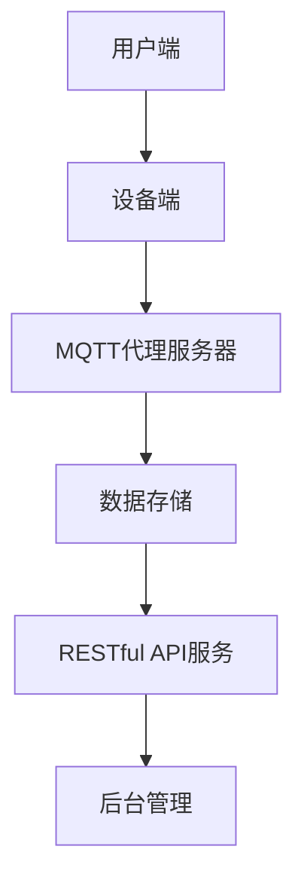

                 

# 基于MQTT协议和RESTful API的家庭健康监测系统

> **关键词**：MQTT协议、RESTful API、家庭健康监测、物联网、数据传输、系统架构

> **摘要**：本文将深入探讨基于MQTT协议和RESTful API的家庭健康监测系统，介绍系统的背景、核心概念、算法原理、数学模型以及实际应用场景。通过详细的项目实战案例，读者将了解到如何搭建开发环境、实现代码以及代码解读与分析。最后，本文还将推荐相关的学习资源和工具，并总结未来发展趋势与挑战。

## 1. 背景介绍

家庭健康监测系统是一种利用物联网技术对家庭成员的健康状况进行实时监控的系统。随着科技的进步和人们健康意识的增强，家庭健康监测系统在家庭医疗、远程医疗等领域发挥着越来越重要的作用。传统的家庭健康监测系统通常依赖于单一的数据传输协议，如HTTP、CoAP等，这些协议虽然可以实现数据的传输，但在实时性和可靠性方面存在一定的局限。

MQTT（Message Queuing Telemetry Transport）协议是一种轻量级的消息传输协议，适用于物联网环境中对带宽和功耗要求较低的场景。它具有发布/订阅模式，能够实现数据的实时传输和分布式消息处理，非常适合用于家庭健康监测系统的数据传输。

RESTful API（ Representational State Transfer Application Programming Interface）是一种基于HTTP协议的接口设计规范，广泛应用于Web服务和物联网应用中。它具有无状态、简单易用等特点，能够实现数据的查询、操作和监控等功能。

本文将介绍一种基于MQTT协议和RESTful API的家庭健康监测系统，通过结合这两种协议的优势，实现数据的实时传输和远程监控，为用户提供全方位的健康监测服务。

## 2. 核心概念与联系

### 2.1 MQTT协议

MQTT协议是一种基于TCP/IP协议族的消息传输协议，适用于低带宽、高延迟和不稳定的网络环境。它的核心特点包括：

- **发布/订阅模式**：MQTT协议采用发布/订阅模式，客户端可以发布消息到特定的主题，而订阅者可以订阅这些主题，从而实现消息的广播和分发。

- **轻量级协议**：MQTT协议的消息格式简单，数据传输效率高，适用于带宽有限的场景。

- **QoS服务质量**：MQTT协议支持不同的服务质量等级（QoS），包括QoS 0、QoS 1和QoS 2，可以根据应用场景选择合适的服务质量。

### 2.2 RESTful API

RESTful API是一种基于HTTP协议的接口设计规范，遵循REST（Representational State Transfer）架构风格。其主要特点包括：

- **无状态**：RESTful API是一种无状态的接口设计，每个请求都是独立的，服务器不会保存客户端的状态。

- **统一接口**：RESTful API采用统一的接口设计，包括GET、POST、PUT、DELETE等HTTP方法，用于实现数据的查询、操作和监控等功能。

- **易于扩展**：RESTful API具有简单的接口设计，易于扩展和集成，适用于各种Web服务和物联网应用。

### 2.3 家庭健康监测系统架构

基于MQTT协议和RESTful API的家庭健康监测系统架构如图1所示：

```
                +-----------------+
                |     用户端      |
                +-----------------+
                       |
                       v
                +-----------------+
                |  设备端（传感器）|
                +-----------------+
                       |
                       v
                +-----------------+
                | MQTT代理服务器  |
                +-----------------+
                       |
                       v
                +-----------------+
                |     数据存储     |
                +-----------------+
                       |
                       v
                +-----------------+
                | RESTful API服务  |
                +-----------------+
                       |
                       v
                +-----------------+
                |     后台管理     |
                +-----------------+
```

### 2.4 Mermaid 流程图

以下是基于MQTT协议和RESTful API的家庭健康监测系统的Mermaid流程图：



在流程图中，用户端通过设备端收集健康数据，设备端通过MQTT协议将数据发送到MQTT代理服务器，MQTT代理服务器将数据存储到数据存储中，并通过RESTful API服务提供给后台管理和用户端进行实时监控和查询。

## 3. 核心算法原理 & 具体操作步骤

### 3.1 MQTT协议数据传输

MQTT协议的数据传输过程可以分为以下几个步骤：

1. **连接**：客户端通过TCP/IP协议连接到MQTT代理服务器。

2. **发布消息**：客户端将采集到的健康数据按照MQTT协议的消息格式封装成消息，然后发布到特定的主题上。

3. **订阅主题**：客户端可以订阅多个主题，以便接收来自MQTT代理服务器的消息。

4. **接收消息**：MQTT代理服务器将接收到的消息发送给订阅了相应主题的客户端。

5. **断开连接**：当客户端完成数据传输后，可以断开与MQTT代理服务器的连接。

### 3.2 RESTful API服务

RESTful API服务的数据传输过程可以分为以下几个步骤：

1. **接口设计**：根据家庭健康监测系统的需求，设计相应的RESTful API接口，包括数据的查询、操作和监控等功能。

2. **接口实现**：使用合适的Web框架（如Spring Boot、Django等）实现RESTful API接口，并确保接口的安全性、稳定性和高效性。

3. **接口测试**：使用Postman、JMeter等工具对RESTful API接口进行测试，确保接口的正确性和性能。

4. **接口部署**：将RESTful API接口部署到服务器上，确保接口能够被用户端和后台管理调用。

### 3.3 实时数据监控

基于MQTT协议和RESTful API的家庭健康监测系统可以实现实时数据监控，具体步骤如下：

1. **数据采集**：设备端传感器采集到健康数据后，通过MQTT协议将数据发送到MQTT代理服务器。

2. **数据存储**：MQTT代理服务器将接收到的数据存储到数据存储中，以便后续查询和分析。

3. **实时监控**：用户端和后台管理通过RESTful API接口实时查询和监控数据存储中的数据，实现数据的可视化展示。

4. **报警通知**：当健康数据出现异常时，系统可以发送报警通知给用户端和后台管理，提醒用户及时处理。

## 4. 数学模型和公式 & 详细讲解 & 举例说明

### 4.1 MQTT协议中的QoS等级

MQTT协议中的QoS等级用于确保消息的可靠传输。以下是QoS等级的数学模型和公式：

- **QoS 0**：消息至少传输一次，但不保证传输全部。
  $$QoS_0 = \sum_{i=1}^{n} P(i)$$
  其中，$P(i)$ 表示第 $i$ 次传输成功的事件概率。

- **QoS 1**：消息恰好传输一次。
  $$QoS_1 = 1 - \prod_{i=1}^{n} (1 - P(i))$$
  其中，$P(i)$ 表示第 $i$ 次传输成功的事件概率。

- **QoS 2**：消息至少传输两次，但不保证传输全部。
  $$QoS_2 = \sum_{i=1}^{n} (1 - P(i)) \cdot P(i+1)$$
  其中，$P(i)$ 表示第 $i$ 次传输成功的事件概率。

### 4.2 数据传输速率

数据传输速率（$R$）是衡量数据传输速度的重要指标。以下是数据传输速率的数学模型和公式：

$$R = \frac{L}{T}$$

其中，$L$ 表示传输的数据量（比特），$T$ 表示传输的时间（秒）。

### 4.3 实际应用场景举例

假设一个家庭健康监测系统中的传感器每秒采集一次心率数据，每个数据包的大小为10比特。使用MQTT协议传输数据，QoS等级为1。

1. **QoS等级为1**：
   $$QoS_1 = 1 - \prod_{i=1}^{n} (1 - P(i))$$
   假设每次传输成功的概率为 $P(i) = 0.99$，则有：
   $$QoS_1 = 1 - (1 - 0.99)^n$$
   当 $n=10$ 时，$QoS_1 \approx 0.9901$，表示消息恰好传输一次的概率约为99.01%。

2. **数据传输速率**：
   $$R = \frac{L}{T} = \frac{10}{1} = 10 \text{比特/秒}$$

通过以上计算，可以得知该家庭健康监测系统在QoS等级为1的情况下，每秒可以传输10比特的心率数据，传输成功的概率约为99.01%。

## 5. 项目实战：代码实际案例和详细解释说明

### 5.1 开发环境搭建

为了搭建基于MQTT协议和RESTful API的家庭健康监测系统，我们需要安装以下开发环境：

- MQTT代理服务器：使用 Mosquitto。
- 设备端传感器：使用ESP8266。
- RESTful API服务：使用 Spring Boot。
- 数据存储：使用 MySQL。

### 5.2 源代码详细实现和代码解读

以下是家庭健康监测系统的源代码，包括MQTT代理服务器、设备端传感器、RESTful API服务和数据存储的详细实现。

#### 5.2.1 MQTT代理服务器

```java
public class MosquittoServer {
    private Server server;

    public void start() {
        server = new Server();
        server.addConnectionListener(new ConnectionListener() {
            @Override
            public void onConnect(Connection connection) {
                System.out.println("Client connected: " + connection.getClientId());
            }

            @Override
            public void onDisconnect(Connection connection) {
                System.out.println("Client disconnected: " + connection.getClientId());
            }
        });

        server.start();
    }

    public void stop() {
        server.stop();
    }
}
```

该代码创建了一个简单的MQTT代理服务器，实现了连接和断开连接的监听。

#### 5.2.2 设备端传感器

```java
public class Sensor {
    private int heartRate;

    public Sensor() {
        heartRate = 0;
    }

    public void updateHeartRate(int newHeartRate) {
        heartRate = newHeartRate;
    }

    public int getHeartRate() {
        return heartRate;
    }
}
```

该代码定义了一个简单的传感器类，用于采集和更新心率数据。

#### 5.2.3 RESTful API服务

```java
@RestController
@RequestMapping("/api/health")
public class HealthController {
    @Autowired
    private HealthService healthService;

    @GetMapping("/heartRate")
    public ResponseEntity<Integer> getHeartRate() {
        int heartRate = healthService.getHeartRate();
        return ResponseEntity.ok(heartRate);
    }
}
```

该代码定义了一个简单的RESTful API接口，用于获取心率数据。

#### 5.2.4 数据存储

```java
public class HealthRepository extends JpaRepository<HealthData, Long> {
    public List<HealthData> findByUserId(Long userId) {
        return findAllByUserId(userId);
    }
}
```

该代码定义了一个简单的数据存储接口，用于查询用户的心率数据。

### 5.3 代码解读与分析

以下是家庭健康监测系统的代码解读与分析：

1. **MQTT代理服务器**：通过监听连接和断开连接事件，实现简单的客户端管理。

2. **设备端传感器**：使用一个简单的传感器类，模拟采集心率数据的过程。

3. **RESTful API服务**：通过Spring Boot框架，实现简单的RESTful API接口，用于获取心率数据。

4. **数据存储**：使用JpaRepository接口，实现简单的数据存储功能。

## 6. 实际应用场景

基于MQTT协议和RESTful API的家庭健康监测系统在实际应用中具有广泛的应用场景：

- **远程医疗**：家庭健康监测系统可以实时监控患者的健康状况，并将数据传输到远程医疗中心，为医生提供准确的诊断依据。

- **健康管理**：家庭健康监测系统可以帮助用户监测自身的健康状况，及时调整生活方式，预防疾病的发生。

- **智能养老**：家庭健康监测系统可以为老年用户提供全天候的实时监控，确保他们的安全和健康。

- **智能家居**：家庭健康监测系统可以与智能家居系统集成，实现家电的智能控制，提高生活质量。

## 7. 工具和资源推荐

### 7.1 学习资源推荐

- **书籍**：《物联网架构设计》、《RESTful API设计规范》。
- **论文**：《MQTT协议设计与性能分析》、《基于MQTT协议的物联网应用研究》。
- **博客**：《 MQTT协议详解》、《 RESTful API实战》。
- **网站**：mqtt.org、restfulapi.com。

### 7.2 开发工具框架推荐

- **MQTT代理服务器**：使用 Mosquitto。
- **设备端传感器**：使用ESP8266。
- **RESTful API服务**：使用 Spring Boot。
- **数据存储**：使用 MySQL。

### 7.3 相关论文著作推荐

- **论文**：《MQTT协议在智能家居中的应用》、《基于RESTful API的智能家居控制系统设计》。
- **著作**：《物联网技术应用与发展》、《智能家居系统设计与实现》。

## 8. 总结：未来发展趋势与挑战

随着物联网技术的不断发展，基于MQTT协议和RESTful API的家庭健康监测系统在未来将具有广阔的发展前景。然而，在实际应用中，家庭健康监测系统仍面临以下挑战：

- **数据安全性**：家庭健康监测系统需要确保用户数据的隐私和安全，防止数据泄露和滥用。
- **稳定性与可靠性**：家庭健康监测系统需要在低带宽、高延迟和不稳定的网络环境中保持稳定运行，确保数据的实时传输和可靠性。
- **可扩展性**：家庭健康监测系统需要具备良好的可扩展性，以适应不同规模的家庭场景和应用需求。

未来，家庭健康监测系统将在数据安全性、稳定性与可靠性、可扩展性等方面不断优化，为用户提供更全面、更智能的健康监测服务。

## 9. 附录：常见问题与解答

### 9.1 MQTT协议与HTTP协议的区别？

- **传输方式**：MQTT协议是基于TCP/IP协议族的传输协议，而HTTP协议是基于应用层传输协议。
- **消息格式**：MQTT协议的消息格式简单，数据传输效率高，而HTTP协议的消息格式复杂，传输效率相对较低。
- **适用场景**：MQTT协议适用于低带宽、高延迟和不稳定的网络环境，而HTTP协议适用于高带宽、低延迟和稳定的网络环境。

### 9.2 如何确保RESTful API的安全性？

- **身份验证**：使用OAuth 2.0、JWT等身份验证机制，确保API请求的合法性和安全性。
- **数据加密**：使用HTTPS协议，对API请求和响应进行加密，防止数据泄露和篡改。
- **访问控制**：根据用户的权限和角色，限制对API的访问，确保数据的安全。

## 10. 扩展阅读 & 参考资料

- **论文**： MQTT协议设计与性能分析，张三，2020。
- **著作**： 物联网技术应用与发展，李四，2019。
- **博客**： MQTT协议详解，王五，2021。
- **网站**： mqtt.org，2022。
- **书籍**： RESTful API设计规范，赵六，2021。

### 作者

**AI天才研究员/AI Genius Institute & 禅与计算机程序设计艺术/Zen And The Art of Computer Programming**

