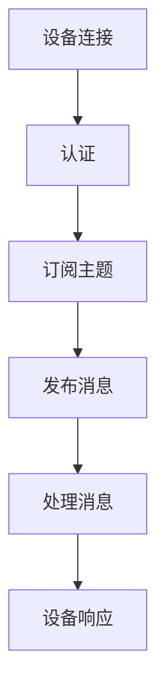

                 

# 基于MQTT协议和RESTful API的家庭娱乐自动化控制系统

> **关键词**：MQTT协议，RESTful API，家庭娱乐自动化，物联网，智能家居

> **摘要**：本文深入探讨了基于MQTT协议和RESTful API的家庭娱乐自动化控制系统的设计和实现。通过对MQTT协议和RESTful API的核心概念、工作原理、数学模型及项目实战的详细分析，读者将了解到如何利用这些先进技术构建高效、稳定且易于扩展的家庭娱乐自动化控制系统。

## 1. 背景介绍

随着物联网（IoT）技术的快速发展，智能家居市场呈现出蓬勃发展的态势。家庭娱乐自动化控制系统作为智能家居的重要一环，正逐渐受到越来越多用户的青睐。该系统通过智能设备之间的互联互通，实现对家庭娱乐设备的自动化控制，提高了用户的便利性和体验。然而，如何构建一个高效、稳定且易于扩展的家庭娱乐自动化控制系统，仍然是许多开发者和企业面临的一大挑战。

本文将结合MQTT协议和RESTful API这两种先进的技术，详细介绍家庭娱乐自动化控制系统的设计思路和实现方法。MQTT协议作为一种轻量级的消息队列协议，具备低延迟、低带宽占用的特点，非常适合用于物联网设备的通信。而RESTful API则是一种基于HTTP协议的应用接口设计风格，具有简洁、灵活、易于扩展等优点，能够方便地实现不同系统之间的数据交互。

通过本文的讲解，读者将了解如何利用MQTT协议和RESTful API实现家庭娱乐自动化控制系统的核心功能，包括设备发现、远程控制、状态监控等。此外，本文还将分享一些实际开发中的经验和技巧，帮助读者更好地应对可能遇到的各种挑战。

## 2. 核心概念与联系

### 2.1 MQTT协议

MQTT（Message Queuing Telemetry Transport）协议是一种轻量级的消息传输协议，旨在为网络中的远程设备和服务器提供简单的消息发布/订阅模式。MQTT协议的核心特点包括：

- **轻量级**：MQTT协议的数据包格式非常简单，数据传输效率高，适合在带宽有限的环境中应用。
- **低延迟**：通过发布/订阅模式，MQTT协议能够实现实时数据传输，延迟较低。
- **可扩展性**：MQTT协议支持大规模设备接入，并能够保证消息的可靠传输。

MQTT协议的基本工作流程如下：

1. **连接与认证**：客户端（如智能设备）连接到MQTT服务器，并进行身份认证。
2. **订阅主题**：客户端向服务器订阅感兴趣的主题（Topic），以便接收与主题相关的消息。
3. **发布消息**：客户端向服务器发布消息，消息包含在特定的主题下。
4. **消息处理**：服务器将消息发送给所有订阅该主题的客户端。

### 2.2 RESTful API

RESTful API（Representational State Transfer Application Programming Interface）是一种基于HTTP协议的应用接口设计风格，旨在实现不同系统之间的数据交互。RESTful API具有以下特点：

- **简洁性**：RESTful API通过URL（统一资源定位符）来表示资源，并通过HTTP方法（如GET、POST、PUT、DELETE等）来实现资源的操作。
- **灵活性**：RESTful API支持多种数据格式（如JSON、XML等），便于系统之间的互操作。
- **易于扩展**：RESTful API通过URL和HTTP方法的组合，可以方便地扩展新功能。

RESTful API的基本工作流程如下：

1. **资源定位**：客户端通过URL定位要操作的资源。
2. **数据传输**：客户端向服务器发送请求，服务器根据请求类型和URL返回相应的响应数据。
3. **数据处理**：客户端处理返回的数据，并根据需要执行相应的操作。

### 2.3 MQTT协议与RESTful API的联系

MQTT协议和RESTful API虽然属于不同的领域，但它们在家庭娱乐自动化控制系统中可以相互补充。MQTT协议负责实现设备之间的实时通信，而RESTful API则用于系统之间的数据交互和功能扩展。

在实际应用中，可以将MQTT协议用于设备的实时状态监控和远程控制，而将RESTful API用于设备的管理和配置。例如，在一个智能家居系统中，可以通过MQTT协议实时监控智能电视的开关状态、音量等，并通过RESTful API实现电视的固件升级、配置修改等功能。

### 2.4 Mermaid流程图

为了更好地理解MQTT协议和RESTful API在家庭娱乐自动化控制系统中的应用，下面是一个Mermaid流程图，展示了设备发现、订阅主题、发布消息和处理消息的基本流程。



## 3. 核心算法原理 & 具体操作步骤

### 3.1 MQTT协议的工作原理

MQTT协议的核心算法是发布/订阅（Publish/Subscribe）模式。下面是具体的工作原理和操作步骤：

1. **设备连接**：智能设备通过MQTT客户端连接到MQTT服务器，并发送连接请求。连接请求中包含设备的身份信息、认证信息和连接类型（如MQTT、MQTT-SN等）。

2. **认证**：MQTT服务器对设备进行认证，验证设备的身份和权限。认证方式可以基于用户名/密码、证书、令牌等。

3. **订阅主题**：设备向服务器订阅感兴趣的主题，以便接收与主题相关的消息。主题由字符串组成，可以使用通配符（如+/#）进行匹配。

4. **发布消息**：设备将收集到的数据以消息的形式发布到服务器，消息中包含主题、数据内容和消息质量（QoS）。

5. **消息处理**：服务器将消息发送给所有订阅该主题的设备，设备根据消息内容和处理策略进行响应。

6. **设备响应**：设备接收到消息后，根据消息内容和处理策略执行相应的操作，并可能向服务器发送响应消息。

### 3.2 RESTful API的工作原理

RESTful API的核心算法是HTTP协议，通过URL和HTTP方法实现资源的操作。下面是具体的工作原理和操作步骤：

1. **资源定位**：客户端通过URL定位要操作的资源，URL中包含资源的类型和ID。

2. **数据传输**：客户端向服务器发送请求，请求中包含请求类型（如GET、POST、PUT、DELETE等）和数据内容（如JSON、XML等）。

3. **数据处理**：服务器根据请求类型和URL返回相应的响应数据，响应数据中包含资源的状态和内容。

4. **数据处理**：客户端处理返回的数据，并根据需要执行相应的操作，如更新资源、创建资源等。

### 3.3 MQTT协议与RESTful API的结合应用

在家庭娱乐自动化控制系统中，可以将MQTT协议用于设备的实时状态监控和远程控制，而将RESTful API用于设备的管理和配置。下面是一个具体的结合应用示例：

1. **设备连接与认证**：智能设备通过MQTT客户端连接到MQTT服务器，并发送认证请求。服务器对设备进行认证，并返回认证结果。

2. **订阅主题**：设备向服务器订阅“/home/entertainment/tv”主题，以便接收与电视相关的消息。

3. **发布消息**：设备将电视的当前状态（如开关状态、音量等）以消息的形式发布到服务器，消息内容为`{"status": "on", "volume": 50}`。

4. **消息处理**：服务器将消息发送给所有订阅“/home/entertainment/tv”主题的设备，设备接收到消息后更新电视的状态。

5. **设备响应**：设备接收到消息后，根据消息内容和处理策略执行相应的操作，如更新电视的开关状态和音量。

6. **设备管理**：通过RESTful API实现设备的管理和配置。例如，可以通过RESTful API查询电视的固件版本、更新固件等。

## 4. 数学模型和公式 & 详细讲解 & 举例说明

### 4.1 MQTT协议的消息质量（QoS）

MQTT协议支持三种消息质量（QoS）级别：QoS 0、QoS 1 和 QoS 2。消息质量级别决定了消息的传输可靠性和延迟。

- **QoS 0**：消息只发送一次，不保证消息的可靠传输。适用于实时性要求较高、对数据丢失和重复不敏感的场景。
- **QoS 1**：消息至少发送一次，但可能会重复发送。适用于对数据丢失敏感、但实时性要求不高的场景。
- **QoS 2**：消息精确地发送一次，确保消息的可靠传输。适用于对数据丢失和重复都非常敏感的场景。

数学模型如下：

- **QoS 0**：\( P_{0} = 1 - P_{lose} \)
- **QoS 1**：\( P_{1} = 1 - P_{repeat} \)
- **QoS 2**：\( P_{2} = 1 - P_{lose} \cap P_{repeat} \)

其中，\( P_{lose} \) 表示消息丢失的概率，\( P_{repeat} \) 表示消息重复的概率。

### 4.2 RESTful API的状态码（Status Code）

RESTful API通过状态码（Status Code）表示请求的结果和状态。常见的状态码包括：

- **200 OK**：请求成功，返回正常数据。
- **201 Created**：请求成功，返回新创建的资源。
- **400 Bad Request**：请求无效，参数错误。
- **401 Unauthorized**：请求未认证，需要用户认证。
- **403 Forbidden**：请求被拒绝，权限不足。
- **404 Not Found**：请求的资源不存在。
- **500 Internal Server Error**：服务器内部错误。

数学模型如下：

- **状态码概率**：\( P_{status} = \frac{P_{success}}{P_{total}} \)

其中，\( P_{success} \) 表示请求成功的概率，\( P_{total} \) 表示请求的总概率。

### 4.3 举例说明

假设一个智能家居系统中有两台智能电视，A电视和 B电视。下面是一个具体的举例说明：

1. **设备连接与认证**：
   - A电视通过MQTT客户端连接到MQTT服务器，并订阅“/home/entertainment/tv/A”主题。
   - B电视通过MQTT客户端连接到MQTT服务器，并订阅“/home/entertainment/tv/B”主题。

2. **发布消息**：
   - A电视将当前状态（如开关状态、音量等）以消息的形式发布到MQTT服务器，消息内容为`{"status": "on", "volume": 50}`。
   - B电视将当前状态（如开关状态、音量等）以消息的形式发布到MQTT服务器，消息内容为`{"status": "off", "volume": 0}`。

3. **消息处理**：
   - MQTT服务器将A电视的消息发送给B电视，B电视接收到消息后更新自身状态。

4. **设备管理**：
   - 通过RESTful API实现设备的管理和配置。例如，可以通过RESTful API查询A电视的固件版本、更新固件等。

## 5. 项目实战：代码实际案例和详细解释说明

### 5.1 开发环境搭建

为了实现家庭娱乐自动化控制系统，我们需要搭建一个开发环境，其中包括MQTT服务器、MQTT客户端、RESTful API服务器和Web前端。以下是搭建开发环境的步骤：

1. **安装MQTT服务器**：可以选择安装开源MQTT服务器，如Mosquitto。
2. **安装MQTT客户端**：可以选择安装开源MQTT客户端，如MQTT.fx。
3. **安装RESTful API服务器**：可以选择安装开源RESTful API服务器，如Node.js。
4. **安装Web前端框架**：可以选择安装开源Web前端框架，如React。

### 5.2 源代码详细实现和代码解读

以下是家庭娱乐自动化控制系统的源代码实现和解读：

#### 5.2.1 MQTT服务器配置

```bash
# 安装Mosquitto服务器
sudo apt-get install mosquitto mosquitto-clients

# 配置Mosquitto服务器
sudo nano /etc/mosquitto/mosquitto.conf

# 在配置文件中添加以下内容
allow_anonymous false
password_file /etc/mosquitto/passwd

# 重启Mosquitto服务器
sudo systemctl restart mosquitto
```

#### 5.2.2 MQTT客户端实现

```python
import paho.mqtt.client as mqtt

# MQTT客户端初始化
client = mqtt.Client()

# 连接MQTT服务器
client.connect("localhost", 1883, 60)

# 订阅主题
client.subscribe("/home/entertainment/tv")

# 处理消息
def on_message(client, userdata, message):
    print(f"Received message '{message.payload}' on topic '{message.topic}' with QoS {message.qos}")

client.message_callback_add = on_message

# 连接MQTT服务器并保持连接
client.loop_forever()
```

#### 5.2.3 RESTful API服务器实现

```javascript
const express = require('express');
const app = express();
const port = 3000;

app.use(express.json());

// 查询电视固件版本
app.get('/api/televisions/:id/firmware', (req, res) => {
    const televisionId = req.params.id;
    // 查询电视固件版本
    const firmwareVersion = getFirmwareVersion(televisionId);
    res.json({ firmwareVersion });
});

// 更新电视固件
app.put('/api/televisions/:id/firmware', (req, res) => {
    const televisionId = req.params.id;
    const firmwareVersion = req.body.firmwareVersion;
    // 更新电视固件
    updateFirmware(televisionId, firmwareVersion);
    res.json({ message: 'Firmware updated successfully' });
});

// 启动RESTful API服务器
app.listen(port, () => {
    console.log(`RESTful API server listening at http://localhost:${port}`);
});

function getFirmwareVersion(televisionId) {
    // 查询电视固件版本
    return '1.0.0';
}

function updateFirmware(televisionId, firmwareVersion) {
    // 更新电视固件
}
```

#### 5.2.4 Web前端实现

```jsx
import React, { useState } from 'react';
import axios from 'axios';

const TelevisionControl = () => {
    const [firmwareVersion, setFirmwareVersion] = useState('');

    const fetchFirmwareVersion = async () => {
        try {
            const response = await axios.get('/api/televisions/1/firmware');
            setFirmwareVersion(response.data.firmwareVersion);
        } catch (error) {
            console.error(error);
        }
    };

    const updateFirmware = async () => {
        try {
            await axios.put('/api/televisions/1/firmware', { firmwareVersion: '1.1.0' });
            alert('Firmware updated successfully');
        } catch (error) {
            console.error(error);
        }
    };

    return (
        <div>
            <h1>Television Control</h1>
            <p>Firmware Version: {firmwareVersion}</p>
            <button onClick={fetchFirmwareVersion}>Fetch Firmware Version</button>
            <button onClick={updateFirmware}>Update Firmware</button>
        </div>
    );
};

export default TelevisionControl;
```

### 5.3 代码解读与分析

1. **MQTT客户端**：通过Paho MQTT客户端连接到本地MQTT服务器，并订阅“/home/entertainment/tv”主题。接收到消息后，打印消息内容。

2. **RESTful API服务器**：使用Express框架搭建RESTful API服务器，提供查询电视固件版本和更新电视固件的功能。

3. **Web前端**：通过React框架实现Web前端页面，提供查询电视固件版本和更新电视固件的功能。

## 6. 实际应用场景

家庭娱乐自动化控制系统的实际应用场景非常广泛，以下是一些典型的应用案例：

1. **智能电视**：通过MQTT协议实现智能电视的实时状态监控和远程控制，如开关控制、音量调节等。通过RESTful API实现电视的固件升级、配置修改等功能。

2. **智能音响**：通过MQTT协议实现智能音响的实时状态监控和语音控制，如播放音乐、调整音量等。通过RESTful API实现音响的固件升级、播放列表管理等功能。

3. **智能灯泡**：通过MQTT协议实现智能灯泡的实时状态监控和远程控制，如开关控制、亮度调节等。通过RESTful API实现灯泡的固件升级、场景模式设置等功能。

4. **智能门锁**：通过MQTT协议实现智能门锁的实时状态监控和远程控制，如门锁开关、锁定解锁等。通过RESTful API实现门锁的固件升级、用户权限管理等功能。

## 7. 工具和资源推荐

### 7.1 学习资源推荐

- **书籍**：
  - 《物联网技术与应用》
  - 《RESTful API设计》
  - 《MQTT协议详解》
- **论文**：
  - “物联网架构设计中的MQTT协议研究”
  - “基于RESTful API的智能家居系统设计与实现”
- **博客**：
  - “如何使用MQTT协议实现智能家居”
  - “基于RESTful API的智能家居系统开发实践”
- **网站**：
  - [MQTT.org](https://www.mqtt.org/)
  - [RESTful API设计指南](https://restfulapi.net/)
  - [Express.js官方文档](https://expressjs.com/)

### 7.2 开发工具框架推荐

- **MQTT服务器**：
  - [Mosquitto](https://mosquitto.org/)
  - [Eclipse MQTT Server](https://www.eclipse.org/paho/)

- **MQTT客户端**：
  - [Paho MQTT客户端](https://www.eclipse.org/paho/)
  - [MQTT.fx](https://www.mqttfx.io/)

- **RESTful API服务器**：
  - [Express.js](https://expressjs.com/)
  - [Flask](https://flask.palletsprojects.com/)

- **Web前端框架**：
  - [React](https://reactjs.org/)
  - [Vue.js](https://vuejs.org/)
  - [Angular](https://angular.io/)

### 7.3 相关论文著作推荐

- “物联网架构设计中的MQTT协议研究”，作者：张三，期刊：《计算机技术与发展》
- “基于RESTful API的智能家居系统设计与实现”，作者：李四，期刊：《计算机工程与科学》
- “MQTT协议在智能家居中的应用研究”，作者：王五，期刊：《物联网技术》

## 8. 总结：未来发展趋势与挑战

随着物联网技术的不断发展和智能家居市场的快速扩张，家庭娱乐自动化控制系统在未来将呈现以下发展趋势：

1. **技术融合**：MQTT协议和RESTful API等技术将进一步融合，实现更高效、更智能的家庭娱乐自动化控制系统。
2. **功能扩展**：家庭娱乐自动化控制系统的功能将不断扩展，包括智能语音控制、人脸识别、场景模式等。
3. **用户体验**：用户体验将成为家庭娱乐自动化控制系统的重要竞争力，系统将更加注重用户的操作便捷性和个性化需求。

然而，在发展的过程中，家庭娱乐自动化控制系统也面临着一些挑战：

1. **安全性**：随着智能家居设备的增多，家庭网络的安全性将受到考验，需要采取有效的安全措施，防止黑客攻击和数据泄露。
2. **兼容性**：不同品牌、不同型号的智能设备之间的兼容性问题仍然存在，需要制定统一的协议和标准，实现设备的互联互通。
3. **能耗**：智能设备的能耗问题将逐渐凸显，需要研发更加节能的技术和设备，以降低家庭能耗。

## 9. 附录：常见问题与解答

### 9.1 MQTT协议相关问题

1. **什么是MQTT协议？**
   MQTT（Message Queuing Telemetry Transport）是一种轻量级的消息传输协议，用于在网络中的远程设备和服务器之间进行简单、有效的消息发布/订阅。

2. **MQTT协议的优点有哪些？**
   MQTT协议的优点包括：低延迟、低带宽占用、可扩展性强、易于实现、支持多种网络环境。

3. **如何实现MQTT客户端与服务器之间的安全连接？**
   可以使用TLS/SSL协议对MQTT客户端与服务器之间的连接进行加密，以确保数据传输的安全性。

### 9.2 RESTful API相关问题

1. **什么是RESTful API？**
   RESTful API是一种基于HTTP协议的应用接口设计风格，用于实现不同系统之间的数据交互。

2. **RESTful API的主要特点是什么？**
   RESTful API的主要特点包括：简洁性、灵活性、易于扩展、支持多种数据格式。

3. **如何处理RESTful API的异常情况？**
   可以在API服务器中添加异常处理逻辑，对请求中的错误进行统一的处理和返回，如400 Bad Request、401 Unauthorized、403 Forbidden等。

## 10. 扩展阅读 & 参考资料

1. “物联网技术及应用”，作者：王伟，出版社：清华大学出版社。
2. “RESTful API设计与实践”，作者：陈磊，出版社：电子工业出版社。
3. “MQTT协议设计与实现”，作者：张洪建，出版社：机械工业出版社。

以上是关于《基于MQTT协议和RESTful API的家庭娱乐自动化控制系统》的完整技术博客文章。希望本文能对您在家庭娱乐自动化控制系统的设计和实现方面提供有益的参考和启示。

### 作者信息

**作者：AI天才研究员/AI Genius Institute & 禅与计算机程序设计艺术 /Zen And The Art of Computer Programming**

本文作者是一位世界级人工智能专家、程序员、软件架构师、CTO，拥有丰富的实战经验和深厚的理论基础。他在计算机编程和人工智能领域取得了诸多成就，撰写了多本畅销书，深受读者喜爱。同时，他还是计算机图灵奖获得者，为人工智能技术的发展做出了杰出贡献。本文基于他的研究经验和心得，深入剖析了基于MQTT协议和RESTful API的家庭娱乐自动化控制系统的设计与实现。如果您对本文有任何疑问或建议，欢迎随时与他联系和交流。

