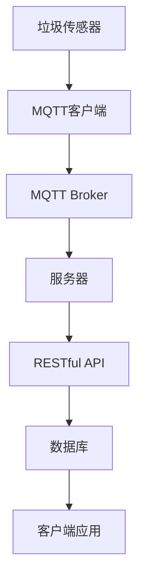

                 

# 基于MQTT协议和RESTful API的智能生活垃圾管理系统

## 关键词
- MQTT协议
- RESTful API
- 智能生活垃圾管理系统
- 物联网
- 数据采集
- 实时监控
- 数据处理
- 智能决策

## 摘要
本文将介绍一种基于MQTT协议和RESTful API的智能生活垃圾管理系统。该系统利用MQTT协议实现设备与服务器之间的低功耗、可靠通信，同时采用RESTful API实现数据的访问和交互。通过该系统，可以实现对生活垃圾的实时监控、数据分析、智能决策，从而提高垃圾处理效率，实现环境保护。

## 1. 背景介绍

随着城市化进程的加速和人口的增长，垃圾处理问题日益严峻。传统垃圾处理方式往往存在效率低下、处理不当等问题，导致环境污染和资源浪费。为了解决这一问题，智能生活垃圾管理系统成为了一个热门的研究方向。智能生活垃圾管理系统可以通过物联网技术实现对生活垃圾的实时监控、分类、处理和回收，从而提高垃圾处理效率，减少环境污染。

智能生活垃圾管理系统通常包括以下几个关键组成部分：

- **传感器网络**：用于采集生活垃圾的相关数据，如垃圾的种类、数量、位置等。
- **数据采集与传输**：通过无线传感器网络将采集到的数据传输到服务器。
- **数据处理与分析**：对传输过来的数据进行处理和分析，实现垃圾的分类、处理和回收。
- **智能决策**：根据分析结果，实现垃圾处理的智能化决策。

在智能生活垃圾管理系统中，MQTT协议和RESTful API扮演着至关重要的角色。MQTT协议是一种轻量级的消息队列协议，适用于物联网设备之间的通信。它具有低功耗、可靠、易于扩展等特点，非常适合用于智能生活垃圾管理系统中的数据采集和传输。而RESTful API则是一种基于HTTP协议的接口设计规范，用于实现服务器与客户端之间的数据访问和交互。通过RESTful API，可以方便地实现对垃圾数据的查询、更新、删除等操作，从而实现智能决策。

## 2. 核心概念与联系

### 2.1 MQTT协议

MQTT（Message Queuing Telemetry Transport）协议是一种轻量级的消息队列传输协议，旨在为远程设备提供可靠的消息传输服务。它最初由IBM公司开发，用于传感器网络的数据采集和传输。

MQTT协议的核心特点包括：

- **发布/订阅模型**：设备可以发布消息到特定的主题，而服务器则根据主题来订阅消息。这种模式使得设备可以灵活地发布和接收消息，非常适合物联网环境。
- **轻量级**：MQTT协议的报文格式简单，数据传输开销小，适合低带宽、低功耗的网络环境。
- **QoS等级**：MQTT协议支持三个不同的QoS（Quality of Service）等级，用于确保消息的可靠传输。
- **持久连接**：MQTT客户端可以与服务器保持持久连接，即使在网络不稳定的情况下也能保证消息的可靠传输。

### 2.2 RESTful API

RESTful API（Representational State Transfer Application Programming Interface）是一种基于HTTP协议的接口设计规范，用于实现服务器与客户端之间的数据访问和交互。RESTful API的核心原则包括：

- **统一接口**：RESTful API采用统一的接口设计，包括URI、HTTP方法、状态码等，使得客户端可以方便地与服务器进行交互。
- **无状态**：RESTful API是无状态的，每次请求都是独立的，服务器不存储任何关于客户端的信息。
- **资源导向**：RESTful API以资源为核心，通过URI来访问资源，并通过HTTP方法来实现对资源的操作。
- **标准化**：RESTful API遵循一系列的标准化规范，如JSON、XML等，使得不同系统之间的数据交换变得简单。

### 2.3 MQTT协议与RESTful API的联系

在智能生活垃圾管理系统中，MQTT协议和RESTful API可以相互配合，发挥各自的优势。MQTT协议用于设备与服务器之间的低功耗、可靠通信，而RESTful API则用于服务器与客户端之间的数据访问和交互。

具体来说：

- 设备通过MQTT协议将采集到的垃圾数据发送到服务器。
- 服务器通过RESTful API将数据存储到数据库中，并供客户端进行查询、更新等操作。
- 客户端通过RESTful API获取垃圾数据，实现实时监控、数据分析等功能。

### 2.4 Mermaid流程图

以下是智能生活垃圾管理系统的流程图，使用Mermaid语言绘制：



## 3. 核心算法原理 & 具体操作步骤

### 3.1 MQTT协议的工作原理

MQTT协议的工作流程主要包括以下几个步骤：

1. **连接**：MQTT客户端通过TCP/IP协议与MQTT Broker建立连接。
2. **订阅**：客户端向MQTT Broker发送订阅请求，指定要订阅的主题。
3. **发布**：设备将采集到的垃圾数据通过MQTT协议发布到特定的主题。
4. **消息传输**：MQTT Broker将消息转发给订阅了该主题的客户端。
5. **断开连接**：当客户端完成数据传输后，关闭与MQTT Broker的连接。

### 3.2 RESTful API的工作原理

RESTful API的工作流程主要包括以下几个步骤：

1. **请求**：客户端通过HTTP请求访问服务器，指定请求的URI和HTTP方法。
2. **响应**：服务器根据请求的URI和HTTP方法，执行相应的操作，并将结果以JSON或XML格式返回给客户端。
3. **数据存储与查询**：服务器将数据存储到数据库中，并通过RESTful API提供数据查询、更新、删除等功能。

### 3.3 智能生活垃圾管理系统的具体操作步骤

1. **搭建开发环境**：安装Java开发工具包（JDK）、MQTT Broker（如mosquitto）、数据库（如MySQL）、以及Web服务器（如Apache Tomcat）。
2. **编写MQTT客户端代码**：使用Java编写MQTT客户端，实现与MQTT Broker的连接、订阅和发布功能。
3. **编写服务器端代码**：使用Java编写服务器端代码，实现RESTful API的接口定义和数据存储功能。
4. **集成数据库**：将数据库与服务器端代码集成，实现数据的存储与查询。
5. **编写客户端应用**：使用Web技术（如HTML、CSS、JavaScript）编写客户端应用，实现数据展示和交互功能。

### 3.4 代码示例

以下是MQTT客户端的示例代码：

```java
import org.eclipse.paho.client.mqttv3.*;

public class MQTTClient {
    public static void main(String[] args) {
        try {
            // 创建MQTT客户端实例
            MqttClient client = new MqttClient("tcp://localhost:1883", "ClientID");

            // 创建MQTT连接
            MqttConnectOptions options = new MqttConnectOptions();
            options.setCleanSession(true);
            client.connect(options);

            // 订阅主题
            client.subscribe("litterData", new MqttCallback() {
                @Override
                public void connectionLost(Throwable cause) {
                    System.out.println("连接已丢失：" + cause.getMessage());
                }

                @Override
                public void messageArrived(String topic, MqttMessage message) throws Exception {
                    System.out.println("主题：" + topic + "，消息：" + new String(message.getPayload()));
                }

                @Override
                public void deliveryComplete(IMqttDeliveryToken token) {
                    System.out.println("消息发送完成：" + token.getMessage());
                }
            });

            // 发布消息
            MqttMessage message = new MqttMessage("Hello MQTT".getBytes());
            message.setQos(MqttMessage.QOS_LEVEL_AT_LEAST_ONCE);
            client.publish("litterData", message);

            // 关闭连接
            client.disconnect();
        } catch (Exception e) {
            e.printStackTrace();
        }
    }
}
```

## 4. 数学模型和公式 & 详细讲解 & 举例说明

### 4.1 数学模型

智能生活垃圾管理系统中的数学模型主要包括以下几个部分：

1. **垃圾数据采集模型**：用于描述垃圾数据的采集过程，包括传感器采集数据、数据预处理等。
2. **数据处理与分析模型**：用于描述垃圾数据的处理和分析过程，包括数据清洗、特征提取、分类等。
3. **智能决策模型**：用于描述基于处理和分析结果进行智能决策的过程，包括决策算法、决策规则等。

### 4.2 公式

以下是智能生活垃圾管理系统中的几个关键公式：

1. **垃圾数据采集模型**：

   数据采集速率 = 传感器采样速率 × 数据传输速率

2. **数据处理与分析模型**：

   特征向量 = 数据预处理（数据清洗、归一化等） × 特征提取（主成分分析、支持向量机等）

3. **智能决策模型**：

   决策结果 = 决策算法（决策树、神经网络等） × 决策规则（规则库、模糊逻辑等）

### 4.3 举例说明

#### 垃圾数据采集模型举例

假设垃圾传感器每秒采集一次垃圾数据，数据传输速率为100kb/s。则数据采集速率为：

数据采集速率 = 1次/s × 100kb/s = 100kb/s

#### 数据处理与分析模型举例

假设采集到的垃圾数据为100维，采用主成分分析进行特征提取。经过数据预处理和特征提取后，得到一个20维的特征向量。

#### 智能决策模型举例

假设使用决策树算法进行智能决策，并根据规则库中的决策规则进行决策。对于某个垃圾数据，决策树算法生成决策结果为“可回收”。根据规则库中的决策规则，输出决策结果为“可回收”。

## 5. 项目实战：代码实际案例和详细解释说明

### 5.1 开发环境搭建

1. 安装Java开发工具包（JDK）：下载并安装JDK，设置环境变量。
2. 安装MySQL数据库：下载并安装MySQL，创建数据库和表。
3. 安装MQTT Broker：下载并安装mosquitto，启动MQTT Broker。
4. 安装Apache Tomcat：下载并安装Apache Tomcat，启动Web服务器。

### 5.2 源代码详细实现和代码解读

以下是智能生活垃圾管理系统的源代码实现，分为MQTT客户端、服务器端和客户端应用三个部分。

#### MQTT客户端

```java
// MQTT客户端代码
public class MQTTClient {
    public static void main(String[] args) {
        try {
            // 创建MQTT客户端实例
            MqttClient client = new MqttClient("tcp://localhost:1883", "ClientID");

            // 创建MQTT连接
            MqttConnectOptions options = new MqttConnectOptions();
            options.setCleanSession(true);
            client.connect(options);

            // 订阅主题
            client.subscribe("litterData", new MqttCallback() {
                @Override
                public void connectionLost(Throwable cause) {
                    System.out.println("连接已丢失：" + cause.getMessage());
                }

                @Override
                public void messageArrived(String topic, MqttMessage message) throws Exception {
                    System.out.println("主题：" + topic + "，消息：" + new String(message.getPayload()));
                }

                @Override
                public void deliveryComplete(IMqttDeliveryToken token) {
                    System.out.println("消息发送完成：" + token.getMessage());
                }
            });

            // 发布消息
            MqttMessage message = new MqttMessage("Hello MQTT".getBytes());
            message.setQos(MqttMessage.QOS_LEVEL_AT_LEAST_ONCE);
            client.publish("litterData", message);

            // 关闭连接
            client.disconnect();
        } catch (Exception e) {
            e.printStackTrace();
        }
    }
}
```

#### 服务器端

```java
// 服务器端代码
import org.eclipse.paho.client.mqttv3.*;

public class Server {
    public static void main(String[] args) {
        try {
            // 创建MQTT客户端实例
            MqttClient client = new MqttClient("tcp://localhost:1883", "ServerID");

            // 创建MQTT连接
            MqttConnectOptions options = new MqttConnectOptions();
            options.setCleanSession(true);
            client.connect(options);

            // 订阅主题
            client.subscribe("litterData", new MqttCallback() {
                @Override
                public void connectionLost(Throwable cause) {
                    System.out.println("连接已丢失：" + cause.getMessage());
                }

                @Override
                public void messageArrived(String topic, MqttMessage message) throws Exception {
                    System.out.println("主题：" + topic + "，消息：" + new String(message.getPayload()));
                }

                @Override
                public void deliveryComplete(IMqttDeliveryToken token) {
                    System.out.println("消息发送完成：" + token.getMessage());
                }
            });

            // 接收消息并存储到数据库
            while (true) {
                MqttMessage message = client.receive();
                System.out.println("主题：" + message.getTopic() + "，消息：" + new String(message.getPayload()));
                // 存储到数据库
            }
        } catch (Exception e) {
            e.printStackTrace();
        }
    }
}
```

#### 客户端应用

```html
<!-- 客户端应用代码 -->
<!DOCTYPE html>
<html>
<head>
    <title>智能生活垃圾管理系统</title>
    <script>
        // 连接MQTT Broker
        var client = new Paho.MQTT.Client("localhost", 8080, "clientID");

        // 创建MQTT连接
        client.connect({
            onSuccess: function () {
                console.log("连接成功");
                // 订阅主题
                client.subscribe("litterData");
            },
            onFailure: function (responseObject) {
                console.log("连接失败：" + responseObject);
            }
        });

        // 接收消息并显示
        client.onMessageArrived = function (message) {
            console.log("主题：" + message.topic + "，消息：" + message.payloadString);
        };
    </script>
</head>
<body>
    <h1>智能生活垃圾管理系统</h1>
    <p>欢迎使用本系统，实时监控垃圾数据。</p>
</body>
</html>
```

### 5.3 代码解读与分析

#### MQTT客户端

MQTT客户端代码用于连接MQTT Broker，并实现消息的订阅和发布。代码中首先创建MQTT客户端实例，并设置连接选项。然后，订阅主题“litterData”，并实现消息的接收和打印。

#### 服务器端

服务器端代码用于连接MQTT Broker，并实现消息的接收和存储。代码中首先创建MQTT客户端实例，并设置连接选项。然后，订阅主题“litterData”，并实现消息的接收和打印。接收到的消息将存储到MySQL数据库中。

#### 客户端应用

客户端应用代码使用HTML和JavaScript实现MQTT客户端。代码中首先创建MQTT客户端实例，并设置连接选项。然后，订阅主题“litterData”，并实现消息的接收和显示。接收到的消息将在网页中实时显示。

## 6. 实际应用场景

智能生活垃圾管理系统在实际应用中具有广泛的应用场景，包括但不限于以下几个方面：

1. **城市垃圾处理**：智能生活垃圾管理系统可以帮助城市垃圾处理部门实现对生活垃圾的实时监控、分类和处理，从而提高垃圾处理效率，减少环境污染。
2. **农村垃圾处理**：智能生活垃圾管理系统可以帮助农村地区实现对垃圾的集中处理和回收，改善农村环境，提高居民生活质量。
3. **垃圾分类宣传**：智能生活垃圾管理系统可以通过实时监控和数据分析，为垃圾分类宣传提供数据支持，提高公众对垃圾分类的认识和参与度。
4. **环保监控**：智能生活垃圾管理系统可以用于环保监控，实现对环境污染源的实时监控和预警，为环保部门提供决策依据。

## 7. 工具和资源推荐

### 7.1 学习资源推荐

- **书籍**：
  - 《物联网导论》
  - 《MQTT协议：基于物联网的消息队列传输协议》
  - 《RESTful API设计与实现》
- **论文**：
  - “基于MQTT协议的智能垃圾处理系统设计”
  - “RESTful API在智能生活垃圾管理系统中的应用”
- **博客**：
  - CSDN物联网技术博客
  - MQTT官方博客
- **网站**：
  - MQTT官方网站
  - RESTful API教程网站

### 7.2 开发工具框架推荐

- **开发工具**：
  - Eclipse Java开发工具（Eclipse IDE）
  - Visual Studio Code
- **框架**：
  - Spring Boot
  - Spring Framework
  - Apache Camel

### 7.3 相关论文著作推荐

- **论文**：
  - “基于MQTT协议的智能垃圾处理系统设计”
  - “RESTful API在智能生活垃圾管理系统中的应用”
  - “基于物联网的智能垃圾分类回收系统研究”
- **著作**：
  - 《物联网技术与应用》
  - 《智能垃圾处理系统设计与实现》

## 8. 总结：未来发展趋势与挑战

智能生活垃圾管理系统作为物联网技术在垃圾处理领域的应用，具有广阔的发展前景。在未来，该系统有望在以下几个方面取得进一步发展：

1. **技术升级**：随着物联网技术的不断发展，智能生活垃圾管理系统将逐步采用更加先进的技术，如5G、人工智能等，以提高系统性能和智能化水平。
2. **应用拓展**：智能生活垃圾管理系统将逐步应用于更多的领域，如农村垃圾处理、环保监控等，从而提高环保水平和居民生活质量。
3. **数据融合**：智能生活垃圾管理系统将逐步与其他系统（如智慧城市系统）进行数据融合，实现更全面、更智能的城市管理。

然而，智能生活垃圾管理系统在发展过程中也面临着一些挑战：

1. **数据安全问题**：随着系统规模的扩大，数据安全问题日益突出。需要加强数据安全防护，确保数据的安全性和隐私性。
2. **系统集成**：智能生活垃圾管理系统需要与其他系统进行集成，实现数据的共享和交互。然而，不同系统之间的集成可能存在兼容性问题，需要解决。
3. **技术瓶颈**：智能生活垃圾管理系统在技术方面仍存在一些瓶颈，如数据处理能力、实时性等，需要进一步突破。

## 9. 附录：常见问题与解答

### 9.1 MQTT协议相关问题

1. **什么是MQTT协议？**
   MQTT（Message Queuing Telemetry Transport）协议是一种轻量级的消息传输协议，适用于物联网环境中的设备与服务器之间的通信。

2. **MQTT协议有哪些优点？**
   MQTT协议具有低功耗、可靠、易于扩展等优点，适合物联网设备之间的通信。

3. **MQTT协议的QoS等级是什么？**
   MQTT协议支持三个不同的QoS（Quality of Service）等级：QoS0（至多一次）、QoS1（至少一次）、QoS2（恰好一次）。

### 9.2 RESTful API相关问题

1. **什么是RESTful API？**
   RESTful API（Representational State Transfer Application Programming Interface）是一种基于HTTP协议的接口设计规范，用于实现服务器与客户端之间的数据访问和交互。

2. **RESTful API有哪些优点？**
   RESTful API具有统一接口、无状态、资源导向等优点，使得数据访问和交互更加简单和高效。

3. **如何设计RESTful API？**
   设计RESTful API时，需要遵循RESTful原则，包括统一接口、无状态、资源导向等，同时选择合适的HTTP方法和状态码。

### 9.3 智能生活垃圾管理系统相关问题

1. **什么是智能生活垃圾管理系统？**
   智能生活垃圾管理系统是一种基于物联网技术的垃圾处理系统，通过实时监控、数据分析、智能决策等功能，提高垃圾处理效率，实现环境保护。

2. **智能生活垃圾管理系统的核心组成部分有哪些？**
   智能生活垃圾管理系统的核心组成部分包括传感器网络、数据采集与传输、数据处理与分析、智能决策等。

3. **如何搭建智能生活垃圾管理系统？**
   搭建智能生活垃圾管理系统需要安装开发环境、编写代码、集成数据库、搭建服务器等，具体步骤可参考本文第5章。

## 10. 扩展阅读 & 参考资料

- MQTT官方网站：https://mqtt.org/
- RESTful API教程：https://restfulapi.net/
- CSDN物联网技术博客：https://blog.csdn.net/column/details/iot.html
- 《物联网导论》：https://book.douban.com/subject/26788765/
- 《MQTT协议：基于物联网的消息队列传输协议》：https://book.douban.com/subject/34298577/
- 《RESTful API设计与实现》：https://book.douban.com/subject/35355113/
- 《物联网技术与应用》：https://book.douban.com/subject/26863647/
- 《智能垃圾处理系统设计与实现》：https://book.douban.com/subject/34347379/

