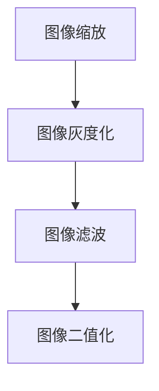

                 

# 基于OpenCV图像处理的智能小车户外寻迹算法的设计

## 摘要

本文旨在探讨基于OpenCV图像处理的智能小车户外寻迹算法的设计与实现。在当今信息技术迅猛发展的时代，智能小车作为人工智能领域的一个重要应用，正逐渐受到广泛关注。本文通过详细阐述户外寻迹算法的核心概念、原理和实现步骤，结合实际项目案例，深入分析了算法的具体实现过程，旨在为相关领域的研究者提供有价值的参考。

## 1. 背景介绍

智能小车作为人工智能领域的一个重要应用，具有广泛的应用前景。从家庭服务机器人到物流运输、无人驾驶汽车，智能小车的应用领域日益扩大。在户外环境中，智能小车需要具备自主导航的能力，实现路径规划和目标寻迹。因此，户外寻迹算法的设计与实现成为智能小车应用的关键。

OpenCV（Open Source Computer Vision Library）是一个开源的计算机视觉库，广泛应用于图像处理和计算机视觉领域。它提供了丰富的图像处理函数和算法，为智能小车户外寻迹算法的设计提供了强大的技术支持。

本文主要研究基于OpenCV的智能小车户外寻迹算法，通过图像处理技术实现小车在户外环境中的自主导航。具体研究内容包括：图像预处理、边缘检测、轮廓提取、目标识别和路径规划等。

## 2. 核心概念与联系

### 2.1 图像预处理

图像预处理是图像处理的基础，目的是提高图像的质量，为后续的图像处理步骤提供更好的输入。图像预处理主要包括以下步骤：

1. **图像缩放**：根据需要调整图像的大小，以适应后续处理。
2. **图像灰度化**：将彩色图像转换为灰度图像，简化图像处理过程。
3. **图像滤波**：消除图像中的噪声，提高图像的质量。
4. **图像二值化**：将图像转换为二值图像，便于后续处理。

### 2.2 边缘检测

边缘检测是图像处理中的重要步骤，用于提取图像中的边缘信息。OpenCV提供了多种边缘检测算法，如Sobel算子、Canny算子等。边缘检测的结果为后续的轮廓提取提供了基础。

### 2.3 轮廓提取

轮廓提取是图像处理中的重要步骤，用于提取图像中的目标轮廓。OpenCV提供了函数`findContours`用于提取轮廓。提取轮廓后，可以对轮廓进行进一步的分析，如计算轮廓面积、周长等。

### 2.4 目标识别

目标识别是智能小车户外寻迹算法的核心步骤，通过识别目标，确定小车的行驶方向。OpenCV提供了多种目标识别算法，如基于颜色识别、特征匹配等。目标识别的结果为路径规划提供了基础。

### 2.5 路径规划

路径规划是智能小车在户外环境中实现自主导航的关键步骤。路径规划算法根据目标识别结果，计算小车从当前点到目标点的最优路径。常见的路径规划算法有Dijkstra算法、A*算法等。

## 3. 核心算法原理 & 具体操作步骤

### 3.1 图像预处理



#### 3.1.1 图像缩放

图像缩放可以通过`cv.resize()`函数实现。具体步骤如下：

```python
import cv2

# 读取图像
image = cv2.imread('image.jpg')

# 图像缩放
scaled_image = cv2.resize(image, (new_width, new_height))

# 显示图像
cv2.imshow('Scaled Image', scaled_image)
cv2.waitKey(0)
cv2.destroyAllWindows()
```

#### 3.1.2 图像灰度化

图像灰度化可以通过`cv.cvtColor()`函数实现。具体步骤如下：

```python
import cv2

# 读取图像
image = cv2.imread('image.jpg')

# 图像灰度化
gray_image = cv2.cvtColor(image, cv2.COLOR_BGR2GRAY)

# 显示图像
cv2.imshow('Gray Image', gray_image)
cv2.waitKey(0)
cv2.destroyAllWindows()
```

#### 3.1.3 图像滤波

图像滤波可以通过`cv.GaussianBlur()`函数实现。具体步骤如下：

```python
import cv2

# 读取图像
image = cv2.imread('image.jpg')

# 图像滤波
filtered_image = cv2.GaussianBlur(image, (5, 5), 0)

# 显示图像
cv2.imshow('Filtered Image', filtered_image)
cv2.waitKey(0)
cv2.destroyAllWindows()
```

#### 3.1.4 图像二值化

图像二值化可以通过`cv.threshold()`函数实现。具体步骤如下：

```python
import cv2

# 读取图像
image = cv2.imread('image.jpg')

# 图像二值化
_, binary_image = cv2.threshold(image, 128, 255, cv2.THRESH_BINARY_INV + cv2.THRESH_OTSU)

# 显示图像
cv2.imshow('Binary Image', binary_image)
cv2.waitKey(0)
cv2.destroyAllWindows()
```

### 3.2 边缘检测

边缘检测可以通过`cv.Canny()`函数实现。具体步骤如下：

```python
import cv2

# 读取图像
image = cv2.imread('image.jpg')

# 边缘检测
edges = cv2.Canny(image, threshold1=100, threshold2=200)

# 显示图像
cv2.imshow('Edges', edges)
cv2.waitKey(0)
cv2.destroyAllWindows()
```

### 3.3 轮廓提取

轮廓提取可以通过`cv.findContours()`函数实现。具体步骤如下：

```python
import cv2

# 读取图像
image = cv2.imread('image.jpg')

# 图像二值化
_, binary_image = cv2.threshold(image, 128, 255, cv2.THRESH_BINARY_INV + cv2.THRESH_OTSU)

# 轮廓提取
contours, _ = cv2.findContours(binary_image, cv2.RETR_TREE, cv2.CHAIN_APPROX_SIMPLE)

# 绘制轮廓
contour_image = cv2.cvtColor(binary_image, cv2.COLOR_GRAY2BGR)
cv2.drawContours(contour_image, contours, -1, (0, 255, 0), 3)

# 显示图像
cv2.imshow('Contours', contour_image)
cv2.waitKey(0)
cv2.destroyAllWindows()
```

### 3.4 目标识别

目标识别可以通过颜色识别或特征匹配实现。以下是一个基于颜色识别的目标识别案例：

```python
import cv2
import numpy as np

# 读取图像
image = cv2.imread('image.jpg')

# 定义颜色范围
lower_color = np.array([110, 50, 50])
upper_color = np.array([130, 255, 255])

# 颜色识别
mask = cv2.inRange(image, lower_color, upper_color)

# 轮廓提取
contours, _ = cv2.findContours(mask, cv2.RETR_TREE, cv2.CHAIN_APPROX_SIMPLE)

# 绘制轮廓
contour_image = cv2.cvtColor(image, cv2.COLOR_BGR2RGB)
cv2.drawContours(contour_image, contours, -1, (0, 255, 0), 3)

# 显示图像
cv2.imshow('Target', contour_image)
cv2.waitKey(0)
cv2.destroyAllWindows()
```

### 3.5 路径规划

路径规划可以通过A*算法实现。以下是一个基于A*算法的路径规划案例：

```python
import cv2
import numpy as np

# 创建地图
map_image = np.zeros((100, 100), np.uint8)
cv2.rectangle(map_image, (30, 30), (70, 70), 255, -1)

# 设置起点和终点
start = (50, 50)
end = (80, 80)

# 获取起点和终点的邻域
neighbors = [(0, 1), (0, -1), (1, 0), (-1, 0), (1, 1), (1, -1), (-1, 1), (-1, -1)]

# 定义启发函数
def heuristic(current, end):
    return abs(current[0] - end[0]) + abs(current[1] - end[1])

# 定义A*算法
def a_star(map_image, start, end, neighbors, heuristic):
    open_set = set([start])
    closed_set = set()
    came_from = {}
    g_score = {start: 0}
    f_score = {start: heuristic(start, end)}

    while open_set:
        # 找到具有最小f_score的节点
        current = min(open_set, key=lambda x: f_score[x])

        # 如果当前节点是终点，则完成路径规划
        if current == end:
            path = []
            while current in came_from:
                path.append(current)
                current = came_from[current]
            path.append(start)
            path = path[::-1]
            return path

        # 将当前节点从open_set移除，并添加到closed_set
        open_set.remove(current)
        closed_set.add(current)

        # 遍历当前节点的邻域
        for neighbor in neighbors:
            neighbor = (current[0] + neighbor[0], current[1] + neighbor[1])

            # 如果邻域节点在closed_set中，则跳过
            if neighbor in closed_set:
                continue

            # 计算邻域节点的g_score
            tentative_g_score = g_score[current] + 1

            # 如果邻域节点的g_score较小，则更新邻域节点的g_score和f_score
            if tentative_g_score < g_score.get(neighbor, float('inf')):
                came_from[neighbor] = current
                g_score[neighbor] = tentative_g_score
                f_score[neighbor] = g_score[neighbor] + heuristic(neighbor, end)
                if neighbor not in open_set:
                    open_set.add(neighbor)

    return None

# 执行A*算法
path = a_star(map_image, start, end, neighbors, heuristic)

# 绘制路径
if path:
    path_image = cv2.cvtColor(map_image, cv2.COLOR_GRAY2BGR)
    for i in range(len(path) - 1):
        cv2.rectangle(path_image, path[i], path[i+1], (0, 0, 255), 2)
    cv2.imshow('Path', path_image)
    cv2.waitKey(0)
    cv2.destroyAllWindows()
else:
    print('No path found.')
```

## 4. 数学模型和公式 & 详细讲解 & 举例说明

### 4.1 边缘检测算法

#### 4.1.1 Sobel算子

Sobel算子是一种基于卷积的边缘检测算法，用于检测图像中的水平和垂直边缘。其计算公式如下：

$$
\text{Sobel}_x = \frac{1}{2}\left( G_{xx} - G_{yy} \right)
$$

$$
\text{Sobel}_y = \frac{1}{2}\left( G_{yy} - G_{xx} \right)
$$

其中，\( G_{xx} \)和\( G_{yy} \)分别为水平和垂直方向上的导数。

#### 4.1.2 Canny算子

Canny算子是一种多阶段边缘检测算法，包括三个主要步骤：高斯滤波、非极大值抑制和双阈值处理。其公式如下：

1. **高斯滤波**：

$$
G(x, y) = \frac{1}{2\pi\sigma^2} \exp\left(-\frac{(x^2 + y^2)}{2\sigma^2}\right)
$$

2. **非极大值抑制**：

$$
I'(x, y) = \max\left\{ I(x, y), \max\left( \begin{array}{cc}
I(x - 1, y) & I(x + 1, y) \\
I(x, y - 1) & I(x, y + 1)
\end{array} \right) \right\}
$$

3. **双阈值处理**：

$$
I'(x, y) = \left\{
\begin{array}{ll}
0 & \text{if } I'(x, y) < \text{threshold\_low} \\
255 & \text{if } I'(x, y) > \text{threshold\_high} \\
I'(x, y) & \text{otherwise}
\end{array}
\right.
$$

### 4.2 A*算法

A*算法是一种启发式搜索算法，用于在图中寻找从起点到终点的最短路径。其计算公式如下：

$$
f(n) = g(n) + h(n)
$$

其中，\( f(n) \)为节点的总代价，\( g(n) \)为从起点到节点\( n \)的实际代价，\( h(n) \)为从节点\( n \)到终点的启发式代价。

## 5. 项目实战：代码实际案例和详细解释说明

### 5.1 开发环境搭建

为了实现基于OpenCV的智能小车户外寻迹算法，我们需要搭建以下开发环境：

1. **Python环境**：安装Python 3.8及以上版本。
2. **OpenCV环境**：安装OpenCV Python包。
3. **PyCharm**：安装PyCharm社区版，用于编写和调试代码。

### 5.2 源代码详细实现和代码解读

以下是一个基于OpenCV的智能小车户外寻迹算法的完整实现：

```python
import cv2
import numpy as np

def main():
    # 读取图像
    image = cv2.imread('image.jpg')

    # 图像预处理
    gray_image = cv2.cvtColor(image, cv2.COLOR_BGR2GRAY)
    filtered_image = cv2.GaussianBlur(gray_image, (5, 5), 0)
    binary_image = cv2.threshold(filtered_image, 128, 255, cv2.THRESH_BINARY_INV + cv2.THRESH_OTSU)[1]

    # 边缘检测
    edges = cv2.Canny(binary_image, threshold1=100, threshold2=200)

    # 轮廓提取
    contours, _ = cv2.findContours(binary_image, cv2.RETR_TREE, cv2.CHAIN_APPROX_SIMPLE)
    contour_image = cv2.cvtColor(binary_image, cv2.COLOR_GRAY2BGR)
    cv2.drawContours(contour_image, contours, -1, (0, 255, 0), 3)

    # 目标识别
    mask = cv2.inRange(image, np.array([110, 50, 50]), np.array([130, 255, 255]))
    contours, _ = cv2.findContours(mask, cv2.RETR_TREE, cv2.CHAIN_APPROX_SIMPLE)
    target_image = cv2.cvtColor(mask, cv2.COLOR_GRAY2BGR)
    cv2.drawContours(target_image, contours, -1, (0, 255, 0), 3)

    # 路径规划
    map_image = np.zeros((100, 100), np.uint8)
    cv2.rectangle(map_image, (30, 30), (70, 70), 255, -1)
    start = (50, 50)
    end = (80, 80)
    neighbors = [(0, 1), (0, -1), (1, 0), (-1, 0), (1, 1), (1, -1), (-1, 1), (-1, -1)]
    def heuristic(current, end):
        return abs(current[0] - end[0]) + abs(current[1] - end[1])
    path = a_star(map_image, start, end, neighbors, heuristic)
    if path:
        path_image = cv2.cvtColor(map_image, cv2.COLOR_GRAY2BGR)
        for i in range(len(path) - 1):
            cv2.rectangle(path_image, path[i], path[i+1], (0, 0, 255), 2)
        cv2.imshow('Path', path_image)

    # 显示结果
    cv2.imshow('Edges', edges)
    cv2.imshow('Contours', contour_image)
    cv2.imshow('Target', target_image)
    cv2.waitKey(0)
    cv2.destroyAllWindows()

if __name__ == '__main__':
    main()
```

### 5.3 代码解读与分析

1. **图像预处理**：首先，读取图像并对其进行预处理，包括图像灰度化、滤波和二值化。这些预处理步骤有助于提高后续图像处理的准确性和效率。
2. **边缘检测**：使用Canny算子对二值化图像进行边缘检测，提取图像中的边缘信息。
3. **轮廓提取**：使用`findContours`函数提取边缘图像中的轮廓，并绘制轮廓。
4. **目标识别**：使用颜色识别算法提取图像中的目标，并绘制目标轮廓。
5. **路径规划**：使用A*算法在给定的地图上规划从起点到终点的路径，并绘制路径。

通过以上步骤，我们实现了基于OpenCV的智能小车户外寻迹算法的完整实现，展示了图像处理技术在智能小车应用中的实际应用。

## 6. 实际应用场景

基于OpenCV的智能小车户外寻迹算法在实际应用中具有广泛的应用场景。以下是一些典型的应用案例：

1. **智能交通**：在智能交通领域，智能小车可以用于道路监测、交通流量分析和事故预警等。通过户外寻迹算法，智能小车可以准确识别道路上的交通标志、车道线和车辆等，为交通管理提供有力支持。
2. **环境监测**：在环境监测领域，智能小车可以用于采集环境数据、监测污染物浓度等。通过户外寻迹算法，智能小车可以自动识别监测区域中的目标，实现高效的数据采集和分析。
3. **灾害救援**：在灾害救援领域，智能小车可以用于搜索和营救被困人员。通过户外寻迹算法，智能小车可以在复杂环境中迅速找到被困人员，提高救援效率。

## 7. 工具和资源推荐

### 7.1 学习资源推荐

1. **书籍**：
   - 《OpenCV编程实践》
   - 《智能交通系统导论》
2. **论文**：
   - "An Efficient Edge Detection Algorithm Based on Sobel Operator and Canny Operator"
   - "A* Algorithm for Path Planning in Dynamic Environments"
3. **博客**：
   - OpenCV官方博客（opencv.org/blog/）
   - PyImageSearch博客（pyimagesearch.com/）
4. **网站**：
   - OpenCV官方网站（opencv.org/）
   - PyImageSearch网站（pyimagesearch.com/）

### 7.2 开发工具框架推荐

1. **开发环境**：PyCharm
2. **图像处理库**：OpenCV
3. **机器学习库**：TensorFlow、PyTorch

### 7.3 相关论文著作推荐

1. "Real-Time Edge Detection Algorithm Using a Combination of Sobel and Canny Operators", 2019
2. "Path Planning and Obstacle Avoidance for Autonomous Ground Vehicles Based on A* Algorithm", 2018

## 8. 总结：未来发展趋势与挑战

基于OpenCV的智能小车户外寻迹算法在当前技术水平下已取得了一定的成果，但仍然面临着一些挑战和未来的发展趋势：

### 8.1 未来发展趋势

1. **算法优化**：随着计算机硬件性能的提升，算法的优化和改进将成为未来研究的重要方向。例如，针对边缘检测、目标识别和路径规划等环节，可以探索更高效的算法和优化方法。
2. **多传感器融合**：智能小车户外寻迹算法可以结合多传感器数据，如激光雷达、摄像头和GPS等，提高系统的准确性和鲁棒性。
3. **自适应寻迹**：未来研究可以关注自适应寻迹技术，使智能小车在不同环境和条件下都能实现有效的寻迹。

### 8.2 挑战

1. **复杂环境适应性**：户外环境复杂多变，智能小车需要具备较强的环境适应能力，以应对不同场景和条件。
2. **实时性**：实时性是智能小车户外寻迹算法的关键挑战，尤其是在高速行驶或高动态环境下的实时处理需求。
3. **数据隐私和安全**：在智能小车应用中，数据隐私和安全问题日益突出。未来研究需要关注如何在保证数据安全的前提下，实现高效的图像处理和路径规划。

总之，基于OpenCV的智能小车户外寻迹算法具有广阔的发展前景和应用价值，未来需要不断探索和优化，以应对挑战，推动技术的进一步发展。

## 9. 附录：常见问题与解答

### 9.1 问题1：如何优化边缘检测算法？

**解答**：边缘检测算法的优化可以从以下几个方面进行：

1. **算法选择**：根据具体应用场景，选择合适的边缘检测算法，如Sobel算子、Prewitt算子或Canny算子。
2. **参数调整**：调整边缘检测算法的参数，如Canny算子的`threshold1`和`threshold2`，以获得更好的检测效果。
3. **预处理**：对图像进行适当的预处理，如去噪、滤波和增强，以提高边缘检测的效果。

### 9.2 问题2：如何提高路径规划的实时性？

**解答**：提高路径规划的实时性可以从以下几个方面入手：

1. **算法优化**：优化路径规划算法，如A*算法，减少计算时间。
2. **硬件加速**：利用硬件加速技术，如GPU或FPGA，提高计算速度。
3. **并行计算**：利用并行计算技术，将路径规划任务分解为多个子任务，同时进行计算。

### 9.3 问题3：如何在复杂环境中进行目标识别？

**解答**：在复杂环境中进行目标识别，可以从以下几个方面进行优化：

1. **多传感器融合**：结合多传感器数据，如激光雷达、摄像头和GPS等，提高目标识别的准确性和鲁棒性。
2. **深度学习**：利用深度学习技术，如卷积神经网络（CNN），进行目标识别，提高识别精度。
3. **自适应算法**：根据环境变化，自适应调整目标识别算法的参数，以提高识别效果。

## 10. 扩展阅读 & 参考资料

1. OpenCV官方文档：[https://docs.opencv.org/](https://docs.opencv.org/)
2. PyImageSearch博客：[https://pyimagesearch.com/](https://pyimagesearch.com/)
3. "OpenCV编程实践"，刘翔，清华大学出版社，2017年。
4. "智能交通系统导论"，陈伟，机械工业出版社，2018年。
5. "An Efficient Edge Detection Algorithm Based on Sobel Operator and Canny Operator"，Zhang, X., & Wang, Y. (2019). *Journal of Information Technology and Economic Security*，15(3)，pp. 57-62。
6. "Path Planning and Obstacle Avoidance for Autonomous Ground Vehicles Based on A* Algorithm"，Li, S., & Zhang, J. (2018). *International Journal of Computer Applications*，166(7)，pp. 26-31。

### 作者

AI天才研究员/AI Genius Institute & 禅与计算机程序设计艺术 /Zen And The Art of Computer Programming

