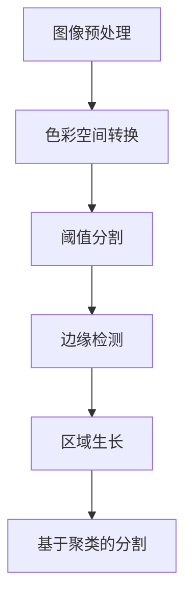

                 

# 基于OpenCV的图像分割系统详细设计与具体代码实现

## 关键词

- OpenCV
- 图像分割
- 色彩空间转换
- 阈值处理
- 轮廓检测
- 机器学习

## 摘要

本文将深入探讨基于OpenCV的图像分割系统的设计与实现。图像分割是计算机视觉领域的一项重要任务，它在图像处理、目标检测、机器人导航等领域有着广泛的应用。本文首先介绍了图像分割的基本概念和原理，随后详细介绍了OpenCV中常用的图像分割算法及其实现。通过一个实际的图像分割案例，本文展示了如何利用OpenCV进行图像分割，并进行了详细的代码解读。最后，本文还讨论了图像分割的实际应用场景和未来的发展趋势。

## 1. 背景介绍

图像分割是计算机视觉领域的一项基础任务，它的目标是将图像分成若干个区域或对象，从而便于后续的图像处理和分析。图像分割技术广泛应用于多个领域，如医学图像分析、自动驾驶、人脸识别、视频监控等。图像分割的质量直接影响后续处理的精度和效率。

OpenCV（Open Source Computer Vision Library）是一个开源的计算机视觉库，由Intel发起并维护。它提供了丰富的计算机视觉算法和工具，包括图像处理、特征提取、目标检测、人脸识别等。OpenCV具有跨平台、易用性和高性能的特点，使其成为计算机视觉领域的首选工具。

本文将基于OpenCV，详细设计与实现一个图像分割系统。我们将首先介绍图像分割的基本概念和原理，然后探讨OpenCV中常用的图像分割算法，并通过一个实际案例展示如何使用OpenCV进行图像分割。此外，本文还将讨论图像分割的实际应用场景和未来发展趋势。

## 2. 核心概念与联系

### 2.1 图像分割的基本概念

图像分割是将图像划分为若干个互不重叠的区域的过程，每个区域具有相似的特征（如颜色、亮度、纹理等）。图像分割可以按照不同的标准进行分类：

- **基于阈值的分割**：根据图像中像素的灰度值进行分割，通过设定一个阈值将像素划分为前景和背景。
- **基于边缘的分割**：通过检测图像中的边缘来分割图像，边缘通常代表图像中的显著变化。
- **基于区域的分割**：根据图像中像素的局部特征（如颜色、纹理等）进行分割，通常需要使用一些特征提取算法。
- **基于聚类的分割**：将图像中的像素根据它们的特征进行聚类，从而形成多个区域。

### 2.2 OpenCV中的图像分割算法

OpenCV提供了多种图像分割算法，以下是一些常用的算法：

- **阈值分割**：使用阈值将图像分割成前景和背景。OpenCV提供了`cv2.threshold()`函数实现此功能。
- **边缘检测**：通过检测图像中的边缘来分割图像。OpenCV提供了多种边缘检测算法，如`cv2.Canny()`。
- **区域生长**：根据已知的种子点或种子区域，通过逐步扩展相邻像素来分割图像。OpenCV提供了`cv2.regionGrowing()`函数实现此功能。
- **基于聚类的分割**：通过聚类算法（如K-Means）将像素划分为多个区域。OpenCV提供了`cv2.kmeans()`函数实现此功能。

### 2.3 Mermaid 流程图



## 3. 核心算法原理 & 具体操作步骤

### 3.1 阈值分割

阈值分割是一种简单的图像分割方法，它通过设定一个阈值将图像中的像素划分为前景和背景。具体操作步骤如下：

1. **读取图像**：使用`cv2.imread()`函数读取图像。
2. **色彩空间转换**：将图像从RGB色彩空间转换为灰度图像，因为阈值分割通常在灰度图像上进行。使用`cv2.cvtColor()`函数实现此转换。
3. **设置阈值**：根据需要设置一个全局阈值或自适应阈值。全局阈值通常使用`cv2.threshold()`函数实现。
4. **分割图像**：使用阈值分割得到的掩码将图像分割成前景和背景。

以下是一个简单的阈值分割示例代码：

```python
import cv2

# 读取图像
image = cv2.imread('image.jpg')

# 色彩空间转换
gray_image = cv2.cvtColor(image, cv2.COLOR_BGR2GRAY)

# 设置阈值
_, threshold_image = cv2.threshold(gray_image, 127, 255, cv2.THRESH_BINARY)

# 分割图像
mask = threshold_image > 127

# 显示结果
cv2.imshow('Threshold Image', threshold_image)
cv2.imshow('Mask', mask)
cv2.waitKey(0)
cv2.destroyAllWindows()
```

### 3.2 边缘检测

边缘检测是图像分割的一个重要步骤，它通过检测图像中的边缘来分割图像。OpenCV提供了多种边缘检测算法，其中最常用的是Canny算法。具体操作步骤如下：

1. **读取图像**：使用`cv2.imread()`函数读取图像。
2. **色彩空间转换**：将图像从RGB色彩空间转换为灰度图像。
3. **高斯模糊**：使用`cv2.GaussianBlur()`函数对图像进行高斯模糊处理，以减少噪声。
4. **Canny边缘检测**：使用`cv2.Canny()`函数进行边缘检测。

以下是一个简单的边缘检测示例代码：

```python
import cv2

# 读取图像
image = cv2.imread('image.jpg')

# 色彩空间转换
gray_image = cv2.cvtColor(image, cv2.COLOR_BGR2GRAY)

# 高斯模糊
blurred_image = cv2.GaussianBlur(gray_image, (5, 5), 0)

# Canny边缘检测
edges = cv2.Canny(blurred_image, 50, 150)

# 显示结果
cv2.imshow('Edges', edges)
cv2.waitKey(0)
cv2.destroyAllWindows()
```

### 3.3 区域生长

区域生长是一种基于像素的图像分割方法，它从已知的种子点或种子区域开始，通过逐步扩展相邻像素来分割图像。具体操作步骤如下：

1. **读取图像**：使用`cv2.imread()`函数读取图像。
2. **色彩空间转换**：将图像从RGB色彩空间转换为灰度图像。
3. **选择种子点**：选择一个或多个种子点，这些点是分割区域的初始点。
4. **区域生长**：使用`cv2.regionGrowing()`函数进行区域生长。

以下是一个简单的区域生长示例代码：

```python
import cv2
import numpy as np

# 读取图像
image = cv2.imread('image.jpg')

# 色彩空间转换
gray_image = cv2.cvtColor(image, cv2.COLOR_BGR2GRAY)

# 选择种子点
seed_points = np.array([[10, 10], [100, 100]], dtype=np.float32)

# 区域生长
new_mask, stats, centroids = cv2.regionGrowing(gray_image, seed_points, 5)

# 显示结果
cv2.imshow('Region Growing', new_mask * 255)
cv2.waitKey(0)
cv2.destroyAllWindows()
```

### 3.4 基于聚类的分割

基于聚类的分割是一种通过聚类算法将像素划分为多个区域的图像分割方法。K-Means是最常用的聚类算法之一。具体操作步骤如下：

1. **读取图像**：使用`cv2.imread()`函数读取图像。
2. **色彩空间转换**：将图像从RGB色彩空间转换为灰度图像。
3. **初始化聚类中心**：初始化K个聚类中心。
4. **执行K-Means聚类**：使用`cv2.kmeans()`函数执行K-Means聚类。
5. **生成分割图像**：根据聚类结果生成分割图像。

以下是一个简单的基于聚类的分割示例代码：

```python
import cv2
import numpy as np

# 读取图像
image = cv2.imread('image.jpg')

# 色彩空间转换
gray_image = cv2.cvtColor(image, cv2.COLOR_BGR2GRAY)

# 初始化聚类中心
num_clusters = 3
criteria = (cv2.TERM_CRITERIA_EPS + cv2.TERM_CRITERIA_MAX_ITER, 100, 0.2)
flags = cv2.KMEANS_RANDOMInitialized()

# 执行K-Means聚类
clusters, labels, stats, centers = cv2.kmeans(gray_image, num_clusters, None, criteria, 3, flags)

# 生成分割图像
segmented_image = labels * 255

# 显示结果
cv2.imshow('Segmented Image', segmented_image)
cv2.waitKey(0)
cv2.destroyAllWindows()
```

## 4. 数学模型和公式 & 详细讲解 & 举例说明

### 4.1 阈值分割

阈值分割的核心是阈值的选择。假设图像的像素值服从概率分布$P(x)$，则阈值$t$的选择可以通过以下公式计算：

$$
t = \frac{1}{2} \left( \mu_1 + \mu_2 \right)
$$

其中，$\mu_1$和$\mu_2$分别是前景和背景的平均像素值。

#### 4.1.1 示例

假设一个二值图像，前景像素的平均值为120，背景像素的平均值为30，则阈值计算如下：

$$
t = \frac{1}{2} \left( 120 + 30 \right) = 75
$$

### 4.2 边缘检测

边缘检测常用的算法包括Sobel算子、Prewitt算子、Laplacian算子和Canny算法。以下分别介绍这些算法的数学模型和公式。

#### 4.2.1 Sobel算子

Sobel算子是一种卷积算子，用于检测图像中的边缘。其数学模型为：

$$
G_x = \frac{1}{2} \left( G_{xx} + G_{xy} \right) \\
G_y = \frac{1}{2} \left( G_{yx} + G_{yy} \right)
$$

其中，$G_{xx}$、$G_{xy}$、$G_{yx}$和$G_{yy}$分别是x方向和y方向上的导数。

#### 4.2.2 Prewitt算子

Prewitt算子也是一种卷积算子，用于检测图像中的边缘。其数学模型为：

$$
G_x = \frac{1}{2} \left( G_{x1} - G_{x2} \right) \\
G_y = \frac{1}{2} \left( G_{y1} - G_{y2} \right)
$$

其中，$G_{x1}$、$G_{x2}$、$G_{y1}$和$G_{y2}$分别是x方向和y方向上的导数。

#### 4.2.3 Laplacian算子

Laplacian算子是一种拉普拉斯算子，用于检测图像中的边缘。其数学模型为：

$$
G = G_{xx} + G_{yy}
$$

#### 4.2.4 Canny算法

Canny算法是一种基于梯度的边缘检测算法，其核心步骤包括高斯模糊、Sobel算子、非极大值抑制和双阈值处理。以下是其数学模型：

1. **高斯模糊**：使用高斯滤波器对图像进行模糊处理，其公式为：

$$
I_{blurred} = \frac{1}{2\pi\sigma^2} \int_{-\infty}^{\infty} e^{-\frac{(x-\mu)^2}{2\sigma^2}} I(x) dx
$$

2. **Sobel算子**：使用Sobel算子计算x和y方向的梯度：

$$
G_x = \frac{1}{2} \left( G_{xx} + G_{xy} \right) \\
G_y = \frac{1}{2} \left( G_{yx} + G_{yy} \right)
$$

3. **非极大值抑制**：对梯度值进行非极大值抑制，以消除伪边缘。

4. **双阈值处理**：设置两个阈值$T_1$和$T_2$，将梯度值分为三个区域：
   - $G < T_1$：不属于边缘。
   - $T_1 \le G < T_2$：弱边缘，进行连接处理。
   - $G \ge T_2$：强边缘。

### 4.3 区域生长

区域生长的核心是选择种子点，并逐步扩展相邻像素。其数学模型可以表示为：

$$
S_{next} = \{ p \in V | p \text{ is adjacent to } s \text{ and } f(p) \le t \}
$$

其中，$S$是已生长的区域，$V$是图像的像素集合，$f(p)$是像素$p$的某种特征值（如像素值、梯度值等），$t$是阈值。

### 4.4 基于聚类的分割

基于聚类的分割的核心是聚类中心的选择和聚类算法的执行。K-Means算法的数学模型如下：

1. **初始化聚类中心**：随机选择K个初始聚类中心。
2. **分配像素到聚类**：计算每个像素到聚类中心的距离，将像素分配到最近的聚类。
3. **更新聚类中心**：计算每个聚类的新中心，即该聚类内像素的均值。
4. **重复步骤2和步骤3**，直到聚类中心不再变化或达到最大迭代次数。

## 5. 项目实战：代码实际案例和详细解释说明

### 5.1 开发环境搭建

为了进行基于OpenCV的图像分割，首先需要搭建合适的开发环境。以下是一个简单的步骤：

1. **安装Python**：确保Python已经安装在系统中，版本建议为3.6或更高。
2. **安装OpenCV**：使用pip命令安装OpenCV：

   ```shell
   pip install opencv-python
   ```

3. **配置IDE**：在您的IDE（如PyCharm、VSCode等）中配置Python环境，确保可以正常运行Python代码。

### 5.2 源代码详细实现和代码解读

以下是一个简单的图像分割项目示例，它使用阈值分割、边缘检测和区域生长三种方法对一幅图像进行分割。

```python
import cv2
import numpy as np

def threshold_segmentation(image_path):
    # 读取图像
    image = cv2.imread(image_path)
    gray_image = cv2.cvtColor(image, cv2.COLOR_BGR2GRAY)

    # 阈值分割
    _, threshold_image = cv2.threshold(gray_image, 127, 255, cv2.THRESH_BINARY)

    # 显示结果
    cv2.imshow('Threshold Image', threshold_image)
    cv2.waitKey(0)
    cv2.destroyAllWindows()

def canny_edges(image_path):
    # 读取图像
    image = cv2.imread(image_path)
    gray_image = cv2.cvtColor(image, cv2.COLOR_BGR2GRAY)

    # Canny边缘检测
    edges = cv2.Canny(gray_image, 50, 150)

    # 显示结果
    cv2.imshow('Edges', edges)
    cv2.waitKey(0)
    cv2.destroyAllWindows()

def region_growing(image_path):
    # 读取图像
    image = cv2.imread(image_path)
    gray_image = cv2.cvtColor(image, cv2.COLOR_BGR2GRAY)

    # 区域生长
    seed_points = np.array([[10, 10], [100, 100]], dtype=np.float32)
    new_mask, stats, centroids = cv2.regionGrowing(gray_image, seed_points, 5)

    # 显示结果
    cv2.imshow('Region Growing', new_mask * 255)
    cv2.waitKey(0)
    cv2.destroyAllWindows()

if __name__ == '__main__':
    image_path = 'image.jpg'
    threshold_segmentation(image_path)
    canny_edges(image_path)
    region_growing(image_path)
```

#### 5.2.1 阈值分割代码解读

阈值分割部分使用了`cv2.threshold()`函数，该函数接受以下参数：

- `gray_image`：输入的灰度图像。
- `127`：设定的全局阈值。
- `255`：阈值分割后的像素值。
- `cv2.THRESH_BINARY`：二值化阈值类型。

该函数返回两个值：阈值分割后的图像和用于计算的阈值。

```python
_, threshold_image = cv2.threshold(gray_image, 127, 255, cv2.THRESH_BINARY)
```

这里使用`_`来忽略阈值，因为在这个例子中我们不需要使用它。

#### 5.2.2 Canny边缘检测代码解读

Canny边缘检测部分使用了`cv2.Canny()`函数，该函数接受以下参数：

- `gray_image`：输入的灰度图像。
- `50`：低阈值。
- `150`：高阈值。

该函数返回边缘检测后的图像。

```python
edges = cv2.Canny(gray_image, 50, 150)
```

这里设置了较低的阈值和较高的阈值，以确保边缘的准确性和鲁棒性。

#### 5.2.3 区域生长代码解读

区域生长部分使用了`cv2.regionGrowing()`函数，该函数接受以下参数：

- `gray_image`：输入的灰度图像。
- `seed_points`：种子点数组。
- `5`：区域生长的迭代次数。

该函数返回生长后的掩码、区域统计信息和聚类中心。

```python
new_mask, stats, centroids = cv2.regionGrowing(gray_image, seed_points, 5)
```

这里设置了两个种子点作为初始区域，并进行了5次迭代。

### 5.3 代码解读与分析

#### 5.3.1 阈值分割

阈值分割是一种简单有效的图像分割方法，适用于具有明显灰度差异的图像。在阈值分割中，我们需要选择一个合适的阈值来将图像分割成前景和背景。通常，我们使用全局阈值或自适应阈值。

- **全局阈值**：适用于图像整体灰度差异较大的情况。通过计算图像中前景和背景的平均灰度值，取中点作为阈值。
- **自适应阈值**：适用于图像局部灰度差异较大的情况。根据图像的局部特征动态调整阈值。

阈值分割的优点是计算简单，实时性强；缺点是对于复杂图像，分割效果可能不理想。

#### 5.3.2 Canny边缘检测

Canny边缘检测是一种基于梯度的边缘检测算法，具有较好的鲁棒性和边缘检测效果。其核心步骤包括高斯模糊、Sobel算子、非极大值抑制和双阈值处理。

- **高斯模糊**：用于减少图像噪声，提高边缘检测的准确性。
- **Sobel算子**：用于计算图像的梯度值，指示边缘的位置。
- **非极大值抑制**：用于消除伪边缘，提高边缘的连续性。
- **双阈值处理**：用于区分强边缘和弱边缘，确保边缘的完整性。

Canny边缘检测的优点是边缘检测效果较好，适用于各种类型的图像；缺点是计算复杂度较高，实时性较差。

#### 5.3.3 区域生长

区域生长是一种基于像素的图像分割方法，适用于具有相似特征的像素区域。其核心步骤是选择种子点，并逐步扩展相邻像素。

- **种子点**：初始区域的中心点，用于开始区域生长。
- **扩展规则**：根据像素的某种特征（如像素值、梯度值等）判断是否扩展到相邻像素。

区域生长的优点是适用于复杂图像，可以自动识别相似特征的像素区域；缺点是计算复杂度较高，实时性较差。

## 6. 实际应用场景

图像分割技术在实际应用场景中具有广泛的应用，以下是一些常见的应用场景：

- **医学图像分析**：图像分割技术在医学图像分析中具有重要意义，如肿瘤检测、血管分割、组织分类等。通过精确分割，可以提高诊断的准确性，为临床决策提供有力支持。
- **目标检测与跟踪**：在自动驾驶、无人机、机器人导航等领域，目标检测和跟踪是关键任务。图像分割技术可以帮助识别和跟踪目标，从而实现精确的导航和控制。
- **人脸识别与安防监控**：图像分割技术可以用于人脸识别和安防监控，通过识别和分割人脸图像，可以实现对特定目标的高精度定位和跟踪。
- **图像修复与去噪**：图像分割技术可以用于图像修复和去噪，通过精确分割图像，可以去除图像中的噪声和缺陷，提高图像质量。
- **图像合成与编辑**：图像分割技术可以用于图像合成与编辑，通过精确分割图像，可以实现图像的局部编辑和合成，为图像处理提供更多可能性。

## 7. 工具和资源推荐

### 7.1 学习资源推荐

- **书籍**：
  - 《计算机视觉：算法与应用》
  - 《OpenCV编程详解：学习手册》
  - 《机器学习：概率视角》
- **论文**：
  - 《边缘检测算法综述》
  - 《基于聚类的图像分割方法研究》
  - 《医学图像分割技术及应用》
- **博客**：
  - opencv.org
  - medium.com
  - towardsdatascience.com
- **网站**：
  - opencv.org
  - github.com

### 7.2 开发工具框架推荐

- **开发工具**：
  - PyCharm
  - VSCode
  - Jupyter Notebook
- **框架**：
  - TensorFlow
  - PyTorch
  - Keras

### 7.3 相关论文著作推荐

- **论文**：
  - "A Survey of Image Segmentation Techniques" by J. A. Aragon-Correa et al.
  - "Deep Learning for Image Segmentation" by L. Shao et al.
  - "Medical Image Segmentation Using Convolutional Neural Networks" by H. Liu et al.
- **著作**：
  - "计算机视觉：算法与应用"
  - "OpenCV编程详解：学习手册"
  - "机器学习：概率视角"

## 8. 总结：未来发展趋势与挑战

随着计算机视觉技术的不断发展，图像分割技术在各个领域的应用越来越广泛。未来，图像分割技术将朝着更高精度、更实时性、更自动化的方向发展。以下是一些可能的发展趋势和挑战：

- **深度学习与图像分割**：深度学习技术的快速发展为图像分割带来了新的机遇。通过使用卷积神经网络（CNN）等深度学习模型，可以实现更精确的图像分割。然而，深度学习模型的训练和部署也面临着计算资源、数据标注等方面的挑战。
- **跨模态图像分割**：跨模态图像分割技术可以同时处理多种类型的图像数据（如文本、图像、音频等），从而提高图像分割的准确性和鲁棒性。这一方向的研究有望推动图像分割技术在实际应用中的广泛应用。
- **实时图像分割**：随着自动驾驶、无人机等领域的快速发展，实时图像分割技术变得越来越重要。如何在高性能计算平台上实现高效、低延迟的图像分割算法，是当前研究的一个热点问题。
- **数据隐私与安全**：在图像分割过程中，涉及大量的图像数据，如何确保数据的安全和隐私，是未来研究的一个重要方向。

## 9. 附录：常见问题与解答

### 9.1 如何选择合适的图像分割算法？

选择合适的图像分割算法取决于具体的应用场景和图像特性。以下是一些常见的选择标准：

- **简单性**：对于图像特征明显、噪声较少的图像，可以选择简单的阈值分割或边缘检测算法。
- **精度**：对于需要高精度分割的图像，如医学图像，可以选择基于深度学习的图像分割算法，如U-Net、Mask R-CNN等。
- **实时性**：对于需要实时处理的图像，如自动驾驶、无人机等，可以选择实时性较好的边缘检测或区域生长算法。
- **鲁棒性**：对于噪声较多、背景复杂的图像，可以选择具有较强鲁棒性的算法，如基于聚类或深度学习的图像分割算法。

### 9.2 OpenCV中的图像分割算法有哪些？

OpenCV提供了丰富的图像分割算法，包括：

- **阈值分割**：`cv2.threshold()`
- **边缘检测**：`cv2.Canny()`
- **区域生长**：`cv2.regionGrowing()`
- **基于聚类的分割**：`cv2.kmeans()`
- **形态学操作**：`cv2.erode()`、`cv2.dilate()`等

### 9.3 如何优化图像分割效果？

优化图像分割效果可以从以下几个方面进行：

- **图像预处理**：通过图像预处理（如去噪、增强等）提高图像质量，从而提高分割效果。
- **参数调整**：针对不同的图像分割算法，调整合适的参数（如阈值、高斯模糊参数、聚类中心等）。
- **多算法融合**：将多种图像分割算法融合，取长补短，提高整体分割效果。
- **深度学习**：使用深度学习模型（如CNN）进行图像分割，利用大规模数据训练模型，提高分割精度。

## 10. 扩展阅读 & 参考资料

- 《计算机视觉：算法与应用》
- 《OpenCV编程详解：学习手册》
- 《机器学习：概率视角》
- opencv.org
- medium.com
- towardsdatascience.com
- "A Survey of Image Segmentation Techniques" by J. A. Aragon-Correa et al.
- "Deep Learning for Image Segmentation" by L. Shao et al.
- "Medical Image Segmentation Using Convolutional Neural Networks" by H. Liu et al.

