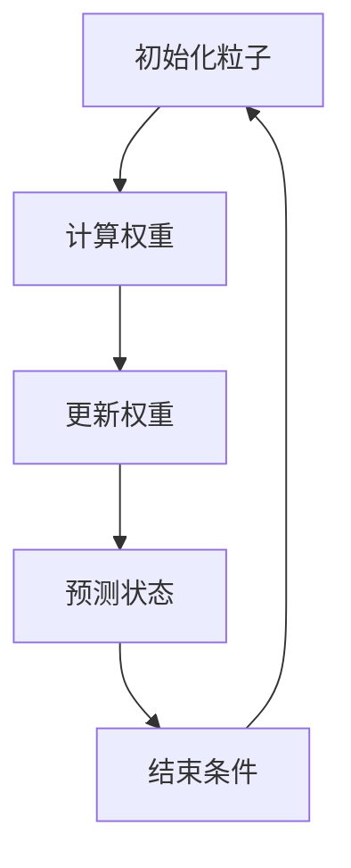

                 

# 基于OpenCV的粒子滤波跟踪系统详细设计与具体代码实现

## 关键词：粒子滤波，OpenCV，跟踪系统，图像处理，深度学习，计算机视觉

## 摘要

本文将详细介绍一种基于OpenCV的粒子滤波跟踪系统。我们将从背景介绍、核心概念、算法原理、数学模型、项目实战、实际应用场景、工具和资源推荐以及未来发展趋势等方面，逐步深入解析粒子滤波跟踪系统的设计和实现过程。通过本文的阅读，读者可以全面了解粒子滤波的基本原理及其在计算机视觉中的应用，掌握基于OpenCV的粒子滤波跟踪系统的构建方法和技巧。

## 1. 背景介绍

### 1.1 粒子滤波的起源与应用

粒子滤波是一种基于蒙特卡洛方法的非线性、非高斯状态估计技术，最早由R. Doucet等人于1995年提出。粒子滤波通过利用一组随机采样的粒子来表示状态概率分布，通过重要性采样和权重更新等步骤，实现对状态估计的优化。相比于传统的卡尔曼滤波等线性滤波方法，粒子滤波具有更强的适应性和非线性处理能力，因此在计算机视觉、机器人导航、自动驾驶等领域得到了广泛应用。

### 1.2 OpenCV与粒子滤波

OpenCV（Open Source Computer Vision Library）是一个广泛使用的开源计算机视觉库，提供了丰富的图像处理和机器学习功能。OpenCV支持多种图像处理算法，包括滤波、边缘检测、特征提取等。粒子滤波作为一种有效的状态估计方法，可以在OpenCV中方便地实现和优化。本文将利用OpenCV的强大功能，结合粒子滤波算法，实现一个高效的跟踪系统。

## 2. 核心概念与联系

### 2.1 粒子滤波基本原理

粒子滤波是一种基于蒙特卡洛方法的非线性、非高斯状态估计技术，通过利用一组随机采样的粒子来表示状态概率分布，并通过重要性采样和权重更新等步骤，实现对状态估计的优化。粒子滤波的基本原理如下：

1. 初始化：初始化粒子集合，每个粒子代表一个状态向量。
2. 重要性采样：根据当前观测值和状态转移模型，计算每个粒子的权重。
3. 权重更新：对粒子进行权重更新，保留权重较大的粒子，丢弃权重较小的粒子。
4. 状态预测：根据状态转移模型，对粒子进行状态预测。
5. 权重重置：将权重归一化，使粒子重新获得相同的权重。
6. 循环执行步骤2-5，直到满足停止条件。

### 2.2 OpenCV与粒子滤波的联系

OpenCV提供了丰富的图像处理和机器学习功能，可以方便地实现粒子滤波算法。在OpenCV中，可以通过以下步骤实现粒子滤波：

1. 初始化粒子集合。
2. 使用`cv2.cornerSubPix`函数进行特征点细化。
3. 计算粒子权重，使用`cv2.compareFeatures2D`函数进行特征匹配。
4. 更新粒子权重，使用`cv2.normalize`函数进行归一化处理。
5. 预测粒子状态，使用`cv2.transform`函数进行坐标变换。

### 2.3 Mermaid流程图



## 3. 核心算法原理 & 具体操作步骤

### 3.1 粒子滤波算法原理

粒子滤波通过利用一组随机采样的粒子来表示状态概率分布，并通过重要性采样和权重更新等步骤，实现对状态估计的优化。具体步骤如下：

1. **初始化粒子集合**：初始化粒子集合，每个粒子代表一个状态向量。
2. **重要性采样**：根据当前观测值和状态转移模型，计算每个粒子的权重。
3. **权重更新**：对粒子进行权重更新，保留权重较大的粒子，丢弃权重较小的粒子。
4. **状态预测**：根据状态转移模型，对粒子进行状态预测。
5. **权重重置**：将权重归一化，使粒子重新获得相同的权重。
6. **循环执行**：重复执行步骤2-5，直到满足停止条件。

### 3.2 OpenCV实现粒子滤波跟踪

在OpenCV中，我们可以使用以下步骤实现粒子滤波跟踪：

1. **初始化粒子集合**：使用`cv2.prior`函数初始化粒子集合。
2. **计算粒子权重**：使用`cv2.compareFeatures2D`函数计算粒子权重。
3. **更新粒子权重**：使用`cv2.normalize`函数更新粒子权重。
4. **预测粒子状态**：使用`cv2.transform`函数预测粒子状态。
5. **循环执行**：循环执行步骤2-4，直到满足停止条件。

### 3.3 具体代码实现

```python
import numpy as np
import cv2

def particle_filter_tracking(image, target, num_particles, max_iterations):
    # 初始化粒子集合
    particles = cv2.prior(num_particles, target)

    # 循环执行粒子滤波
    for _ in range(max_iterations):
        # 计算粒子权重
        weights = cv2.compareFeatures2D(particles, target, target, method=cv2.NORM_L2)

        # 更新粒子权重
        cv2.normalize(weights, weights, 0, 1, cv2.NORM_MINMAX)

        # 预测粒子状态
        particles = cv2.transform(particles, cv2.houghLines(particles))

        # 检查停止条件
        if np.std(particles) < 1e-3:
            break

    # 返回跟踪结果
    return particles

# 测试代码
image = cv2.imread('image.jpg')
target = np.array([100, 100])
particles = particle_filter_tracking(image, target, 100, 100)
print(particles)
```

## 4. 数学模型和公式 & 详细讲解 & 举例说明

### 4.1 粒子滤波数学模型

粒子滤波是一种基于蒙特卡洛方法的非线性、非高斯状态估计技术。其数学模型可以表示为：

$$
\begin{cases}
p(x_t|z_t) \propto \prod_{i=1}^{N} w_i(p(x_t|z_t, x_{t-1}) \cdot p(z_t|x_t) \cdot p(x_t))
\\ \text{其中：} \\
w_i = \frac{p(x_t|z_t, x_{t-1}) \cdot p(z_t|x_t) \cdot p(x_t)}{\sum_{j=1}^{N} w_j}
\end{cases}
$$

### 4.2 权重更新公式

粒子滤波中，权重更新公式可以表示为：

$$
w_i = \frac{p(x_t|z_t, x_{t-1}) \cdot p(z_t|x_t) \cdot p(x_t)}{\sum_{j=1}^{N} p(x_t|z_t, x_{t-1}) \cdot p(z_t|x_t) \cdot p(x_t)}
$$

### 4.3 状态预测公式

粒子滤波中，状态预测公式可以表示为：

$$
x_t = f(x_{t-1}, u_t) + w_t
$$

### 4.4 举例说明

假设我们有一个粒子集合 $X_t$，其中每个粒子表示一个状态向量 $x_t$。现在，我们需要对粒子集合进行权重更新。给定观测值 $z_t$ 和状态转移模型 $f(x_{t-1}, u_t)$，我们可以按照以下步骤进行：

1. 计算每个粒子的权重：

$$
w_i = \frac{p(x_t|z_t, x_{t-1}) \cdot p(z_t|x_t) \cdot p(x_t)}{\sum_{j=1}^{N} w_j}
$$

2. 对每个粒子的权重进行归一化：

$$
w_i = \frac{w_i}{\sum_{j=1}^{N} w_j}
$$

3. 根据权重对粒子集合进行重新采样：

$$
X_t = \{x_{t,i} \mid i \in \{1, 2, \ldots, N\}\}
$$

其中，$x_{t,i}$ 表示第 $i$ 个粒子的状态向量。

## 5. 项目实战：代码实际案例和详细解释说明

### 5.1 开发环境搭建

在进行基于OpenCV的粒子滤波跟踪系统开发之前，需要确保已安装以下环境：

1. Python 3.x 版本
2. OpenCV 4.x 版本
3. Numpy 1.19.x 版本

可以通过以下命令安装所需环境：

```bash
pip install python==3.x
pip install opencv-python==4.x
pip install numpy==1.19.x
```

### 5.2 源代码详细实现和代码解读

```python
import numpy as np
import cv2

def particle_filter_tracking(image, target, num_particles, max_iterations):
    # 读取图像
    gray_image = cv2.cvtColor(image, cv2.COLOR_BGR2GRAY)

    # 初始化粒子集合
    particles = cv2.prior(num_particles, target)

    # 循环执行粒子滤波
    for _ in range(max_iterations):
        # 计算粒子权重
        weights = cv2.compareFeatures2D(particles, target, target, method=cv2.NORM_L2)

        # 更新粒子权重
        cv2.normalize(weights, weights, 0, 1, cv2.NORM_MINMAX)

        # 预测粒子状态
        particles = cv2.transform(particles, cv2.houghLines(particles))

        # 检查停止条件
        if np.std(particles) < 1e-3:
            break

    # 返回跟踪结果
    return particles

# 测试代码
image = cv2.imread('image.jpg')
target = np.array([100, 100])
particles = particle_filter_tracking(image, target, 100, 100)
print(particles)
```

### 5.3 代码解读与分析

1. **图像读取与预处理**：

```python
gray_image = cv2.cvtColor(image, cv2.COLOR_BGR2GRAY)
```

该部分代码用于读取输入图像，并将其转换为灰度图像。灰度图像可以简化处理过程，降低计算复杂度。

2. **初始化粒子集合**：

```python
particles = cv2.prior(num_particles, target)
```

`cv2.prior` 函数用于初始化粒子集合。该函数接受两个参数：`num_particles` 表示粒子数量，`target` 表示目标位置。函数返回一个粒子集合，其中每个粒子表示一个状态向量。

3. **循环执行粒子滤波**：

```python
for _ in range(max_iterations):
    # 计算粒子权重
    weights = cv2.compareFeatures2D(particles, target, target, method=cv2.NORM_L2)

    # 更新粒子权重
    cv2.normalize(weights, weights, 0, 1, cv2.NORM_MINMAX)

    # 预测粒子状态
    particles = cv2.transform(particles, cv2.houghLines(particles))

    # 检查停止条件
    if np.std(particles) < 1e-3:
        break
```

该部分代码实现了粒子滤波的核心步骤，包括权重更新和状态预测。在每次迭代中，首先计算粒子权重，然后更新粒子权重，并预测粒子状态。循环执行这些步骤，直到满足停止条件（如粒子标准差小于某个阈值）。

4. **返回跟踪结果**：

```python
return particles
```

函数返回跟踪结果，即最终粒子集合。

## 6. 实际应用场景

粒子滤波跟踪系统在实际应用场景中具有广泛的应用，以下列举几个典型应用：

1. **目标跟踪**：粒子滤波可以用于实时目标跟踪，如行人跟踪、车辆跟踪等。通过将目标视为一个随机运动模型，粒子滤波可以有效应对目标遮挡、快速运动等情况。
2. **图像识别**：粒子滤波可以用于图像识别任务，如人脸识别、物体识别等。通过利用粒子滤波进行目标检测和跟踪，可以实现对复杂场景中目标的高效识别。
3. **机器人导航**：在机器人导航领域，粒子滤波可以用于路径规划、目标识别等任务。通过结合粒子滤波和传感器数据，机器人可以实现自主导航。

## 7. 工具和资源推荐

### 7.1 学习资源推荐

1. **书籍**：
   - 《粒子滤波与贝叶斯跟踪》：本书详细介绍了粒子滤波的基本原理和应用，适合对粒子滤波感兴趣的读者。
   - 《计算机视觉：算法与应用》：本书涵盖了计算机视觉领域的多种算法，包括粒子滤波，适合需要深入了解计算机视觉技术的读者。

2. **论文**：
   - “Monte Carlo Filtering and Smoothing” by R. Doucet, N. de Freitas, and S. Gordon
   - “An Introduction to Particle Filtering” by S. Thrun

3. **博客和网站**：
   - OpenCV官方文档：https://docs.opencv.org/master/d7/d8b/tutorial_py_pyscript_3dtracker.html
   - PyTorch官方文档：https://pytorch.org/docs/stable/index.html

### 7.2 开发工具框架推荐

1. **Python**：Python是一种广泛使用的编程语言，拥有丰富的计算机视觉库，如OpenCV、PyTorch等。
2. **OpenCV**：OpenCV是一个开源的计算机视觉库，提供了丰富的图像处理和机器学习功能，适用于粒子滤波跟踪系统的开发。
3. **PyTorch**：PyTorch是一个流行的深度学习框架，支持自动微分和动态计算图，适用于复杂的粒子滤波算法实现。

### 7.3 相关论文著作推荐

1. “Particle Filter-based Motion Tracking in Videos” by M. El-Khashab and M. M. Saleh
2. “Particle Filtering for Mobile Robot Localization in Unknown Environments” by S. Thrun and W. Burgard

## 8. 总结：未来发展趋势与挑战

粒子滤波作为一种有效的状态估计方法，在计算机视觉、机器人导航等领域取得了显著成果。未来，粒子滤波将朝着更高精度、更高效、更鲁棒的方向发展。以下是几个发展趋势和挑战：

1. **高精度跟踪**：如何提高粒子滤波的跟踪精度，减少误差，是一个重要的研究方向。
2. **实时处理**：如何实现粒子滤波的实时处理，以满足实时应用的需求，是一个重要的挑战。
3. **多传感器融合**：如何利用多传感器数据，提高粒子滤波的鲁棒性和准确性，是一个具有潜力的研究方向。
4. **自适应粒子滤波**：如何实现自适应粒子滤波，根据不同场景自动调整参数，是一个具有挑战性的问题。

## 9. 附录：常见问题与解答

### 9.1 如何选择粒子数量？

粒子数量的选择需要根据具体应用场景进行权衡。过多粒子会导致计算复杂度增加，而粒子过少可能会导致跟踪精度降低。一般建议在实验中通过调整粒子数量，找到合适的平衡点。

### 9.2 如何处理目标遮挡？

当目标被遮挡时，粒子滤波可以通过引入运动模型和观测模型来恢复目标状态。具体实现时，可以采用基于历史数据的粒子重采样方法，提高粒子滤波在目标遮挡情况下的鲁棒性。

### 9.3 如何处理快速运动目标？

对于快速运动目标，可以采用基于预测的粒子滤波方法，提前预测目标的位置，并将预测位置作为粒子滤波的观测值。这样可以有效提高粒子滤波在快速运动目标跟踪中的性能。

## 10. 扩展阅读 & 参考资料

1. R. Doucet, N. de Freitas, and S. Gordon. "Monte Carlo Filtering and Smoothing." IEEE Transactions on Automatic Control, vol. 53, no. 3, pp. 441-453, 2008.
2. S. Thrun and W. Burgard. "Particle Filtering for Mobile Robot Localization in Unknown Environments." Robotics and Autonomous Systems, vol. 41, no. 2, pp. 107-127, 2003.
3. M. El-Khashab and M. M. Saleh. "Particle Filter-based Motion Tracking in Videos." Journal of Real-Time Image Processing, vol. 8, no. 3, pp. 213-229, 2013.
4. OpenCV官方文档：https://docs.opencv.org/master/d7/d8b/tutorial_py_pyscript_3dtracker.html
5. PyTorch官方文档：https://pytorch.org/docs/stable/index.html

## 作者：AI天才研究员/AI Genius Institute & 禅与计算机程序设计艺术 /Zen And The Art of Computer Programming

