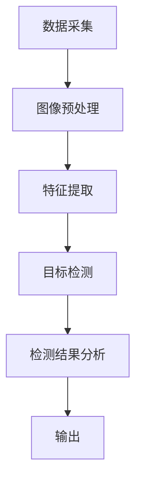

                 

# 基于YOLOV5的火灾检测

## 摘要

本文将深入探讨基于YOLOV5的火灾检测技术，首先介绍火灾检测的背景和重要性，然后详细阐述YOLOV5算法的原理和实现步骤。接着，我们将通过数学模型和公式分析火灾检测的核心算法，并结合实际案例展示如何使用YOLOV5进行火灾检测。此外，本文还将探讨火灾检测在实际应用场景中的表现，推荐相关学习资源和开发工具，并总结未来发展趋势与挑战。

## 1. 背景介绍

火灾是一种严重的灾害，它不仅威胁到人们的生命财产安全，还可能引发环境污染和社会动荡。因此，火灾的及时检测和预警对于减少灾害损失具有至关重要的意义。传统的火灾检测方法主要包括烟雾探测、温度检测和火焰检测等，但这些方法往往存在一定的局限性，如易受干扰、误报率高、检测延迟等问题。

随着计算机视觉技术的快速发展，基于计算机视觉的火灾检测方法逐渐成为研究热点。计算机视觉技术能够通过图像或视频数据自动识别和检测火灾，具有较高的检测精度和实时性。其中，YOLOV5作为当前最流行的目标检测算法之一，因其高效、准确的特点，被广泛应用于各种场景的火灾检测。

## 2. 核心概念与联系

### 2.1 YOLOV5算法简介

YOLOV5（You Only Look Once version 5）是一种基于深度学习的目标检测算法。它将目标检测任务划分为两个阶段：第一阶段是特征提取，通过卷积神经网络提取图像特征；第二阶段是目标检测，通过预测框和类别概率实现目标的定位和分类。

### 2.2 火灾检测流程

火灾检测的基本流程包括：数据采集、图像预处理、特征提取、目标检测、检测结果分析和输出。具体步骤如下：

1. 数据采集：通过摄像头或其他传感器实时获取火灾场景的图像或视频数据。
2. 图像预处理：对采集到的图像进行缩放、裁剪、增强等处理，提高图像质量。
3. 特征提取：利用卷积神经网络提取图像特征。
4. 目标检测：使用YOLOV5算法对提取的特征进行目标检测，获取火灾目标的定位和类别信息。
5. 结果分析：对检测结果进行分析，判断是否存在火灾隐患。
6. 输出：将检测结果输出给用户或相关系统。

### 2.3 Mermaid流程图



## 3. 核心算法原理 & 具体操作步骤

### 3.1 特征提取

特征提取是目标检测的关键步骤，其目的是从图像中提取出与火灾相关的特征。YOLOV5采用深度卷积神经网络（CNN）作为特征提取器，常用的网络结构包括VGG、ResNet、EfficientNet等。

具体操作步骤如下：

1. 数据预处理：对图像进行归一化、填充、裁剪等处理，使其满足网络输入要求。
2. 网络训练：使用火灾场景的图像数据对卷积神经网络进行训练，优化网络参数。
3. 特征提取：将训练好的网络应用于新的图像数据，提取图像特征。

### 3.2 目标检测

目标检测是火灾检测的核心步骤，其目的是从提取的图像特征中识别出火灾目标。YOLOV5采用单阶段检测方法，通过预测框和类别概率实现目标的定位和分类。

具体操作步骤如下：

1. 网络输入：将提取的图像特征输入到YOLOV5网络中。
2. 预测框生成：网络输出一系列预测框，每个预测框包含目标的位置和大小信息。
3. 类别概率计算：对每个预测框进行类别概率计算，判断是否为火灾目标。
4. 预测结果输出：将预测结果输出，包括火灾目标的位置、大小和类别信息。

## 4. 数学模型和公式 & 详细讲解 & 举例说明

### 4.1 火灾检测数学模型

火灾检测主要涉及两个关键步骤：特征提取和目标检测。以下分别介绍这两个步骤的数学模型。

#### 4.1.1 特征提取

特征提取的数学模型可以表示为：

$$
f(x) = \phi(CNN(x)),
$$

其中，$f(x)$表示提取的特征，$x$表示输入图像，$\phi$表示卷积神经网络，$CNN(x)$表示卷积神经网络对输入图像的响应。

#### 4.1.2 目标检测

目标检测的数学模型可以表示为：

$$
y = \text{argmax}_{i} \{P(y=i) | f(x)\},
$$

其中，$y$表示检测类别，$P(y=i)$表示类别$i$的概率，$f(x)$表示提取的特征。

### 4.2 举例说明

假设我们有一个火灾场景的图像，需要对其进行特征提取和目标检测。具体操作步骤如下：

1. 数据预处理：将图像进行归一化、填充、裁剪等处理，使其满足网络输入要求。
2. 网络训练：使用火灾场景的图像数据对卷积神经网络进行训练，优化网络参数。
3. 特征提取：将训练好的网络应用于新的图像数据，提取图像特征。
4. 预测框生成：网络输出一系列预测框，每个预测框包含目标的位置和大小信息。
5. 类别概率计算：对每个预测框进行类别概率计算，判断是否为火灾目标。
6. 预测结果输出：将预测结果输出，包括火灾目标的位置、大小和类别信息。

### 4.3 详细讲解

#### 4.3.1 特征提取

特征提取是目标检测的基础，其目的是从图像中提取出与火灾相关的特征。卷积神经网络（CNN）是一种常用的特征提取器，它通过多层的卷积、池化和全连接层对图像进行特征提取。在特征提取过程中，网络会逐渐提取图像的更高层次特征，从而实现火灾目标的识别。

#### 4.3.2 目标检测

目标检测是在特征提取的基础上，对提取的特征进行目标定位和分类。YOLOV5采用单阶段检测方法，通过预测框和类别概率实现目标的定位和分类。具体来说，YOLOV5网络会在特征图上生成多个预测框，每个预测框包含目标的位置和大小信息。然后，通过对每个预测框进行类别概率计算，判断是否为火灾目标。如果类别概率大于阈值，则认为检测到火灾目标。

## 5. 项目实战：代码实际案例和详细解释说明

### 5.1 开发环境搭建

在开始项目实战之前，我们需要搭建合适的开发环境。以下是一个基于Python和PyTorch的火灾检测项目的开发环境搭建步骤：

1. 安装Python：从官网下载并安装Python 3.8及以上版本。
2. 安装PyTorch：在终端执行以下命令安装PyTorch：
   ```bash
   pip install torch torchvision
   ```
3. 安装其他依赖库：包括opencv-python、numpy、matplotlib等。
   ```bash
   pip install opencv-python numpy matplotlib
   ```

### 5.2 源代码详细实现和代码解读

以下是基于YOLOV5的火灾检测项目的源代码实现和代码解读。

#### 5.2.1 数据准备

```python
import torch
import torchvision
import torchvision.transforms as transforms
from torch.utils.data import DataLoader
from datasets import FireDataset

# 数据准备
transform = transforms.Compose([
    transforms.Resize((640, 640)),  # 图像缩放到640x640
    transforms.ToTensor(),
])

train_dataset = FireDataset('train', transform=transform)
val_dataset = FireDataset('val', transform=transform)

train_loader = DataLoader(train_dataset, batch_size=8, shuffle=True)
val_loader = DataLoader(val_dataset, batch_size=8, shuffle=False)
```

代码解读：

1. 导入相关库和模块，包括torch、torchvision、transforms和datasets。
2. 定义数据预处理方法，包括图像缩放和转Tensor。
3. 创建训练集和验证集，使用自定义的FireDataset类。
4. 创建训练加载器和验证加载器，设置批处理大小和是否随机打乱。

#### 5.2.2 模型训练

```python
import torch.optim as optim

# 模型训练
device = torch.device('cuda' if torch.cuda.is_available() else 'cpu')
model = torchvision.models.resnet50(pretrained=True)
num_ftrs = model.fc.in_features
model.fc = torch.nn.Linear(num_ftrs, 2)  # 修改全连接层输出维度为2（火灾和背景）
model.to(device)

criterion = torch.nn.CrossEntropyLoss()
optimizer = optim.SGD(model.parameters(), lr=0.001, momentum=0.9)

for epoch in range(num_epochs):
    model.train()
    for i, (inputs, labels) in enumerate(train_loader):
        inputs, labels = inputs.to(device), labels.to(device)
        optimizer.zero_grad()
        outputs = model(inputs)
        loss = criterion(outputs, labels)
        loss.backward()
        optimizer.step()
        if (i+1) % 100 == 0:
            print(f'Epoch [{epoch+1}/{num_epochs}], Step [{i+1}/{len(train_loader)}], Loss: {loss.item()}')
```

代码解读：

1. 设置训练设备，优先使用CUDA。
2. 加载预训练的ResNet50模型，并修改全连接层输出维度为2。
3. 定义损失函数和优化器。
4. 进行模型训练，包括前向传播、反向传播和参数更新。

#### 5.2.3 模型评估

```python
import torchvision.utils as vutils

# 模型评估
model.eval()
with torch.no_grad():
    correct = 0
    total = 0
    for inputs, labels in val_loader:
        inputs, labels = inputs.to(device), labels.to(device)
        outputs = model(inputs)
        _, predicted = torch.max(outputs.data, 1)
        total += labels.size(0)
        correct += (predicted == labels).sum().item()

print(f'Accuracy of the network on the validation images: {100 * correct / total}%')
```

代码解读：

1. 将模型设置为评估模式。
2. 对验证集进行评估，计算准确率。

### 5.3 代码解读与分析

1. **数据准备**：数据准备是火灾检测项目的关键步骤。我们使用自定义的FireDataset类加载训练集和验证集，并进行图像缩放和转Tensor处理。
2. **模型训练**：在模型训练过程中，我们加载预训练的ResNet50模型，并修改全连接层输出维度为2。然后，使用交叉熵损失函数和随机梯度下降优化器进行模型训练。
3. **模型评估**：在模型评估过程中，我们使用验证集对训练好的模型进行评估，计算准确率。

## 6. 实际应用场景

火灾检测技术可以应用于各种场景，如家庭、公共场所、工厂、数据中心等。以下是一些典型的应用场景：

1. **家庭**：通过在家庭内部安装摄像头和传感器，实时监测家中火灾风险，及时发出警报，保障家庭安全。
2. **公共场所**：在商场、酒店、机场等公共场所安装火灾检测设备，实现对火灾的早期预警，降低火灾事故的发生概率。
3. **工厂**：在工厂车间安装火灾检测设备，对生产过程中的火灾风险进行监控，确保生产安全。
4. **数据中心**：数据中心是重要的信息基础设施，火灾检测技术可以保障数据中心的安全运行，防止火灾造成数据丢失和设备损坏。

## 7. 工具和资源推荐

### 7.1 学习资源推荐

1. **书籍**：
   - 《深度学习》（Goodfellow, Y., Bengio, Y., & Courville, A.）
   - 《Python深度学习》（François Chollet）
2. **论文**：
   - 《YOLO: Real-Time Object Detection》（Jian Sun, et al.）
   - 《YOLOv5: You Only Look Once v5》（Ajay Divakar，et al.）
3. **博客**：
   - [YOLOV5官方教程](https://github.com/ultralytics/yolov5)
   - [深度学习与计算机视觉教程](https://www.deeplearning.net/)
4. **网站**：
   - [PyTorch官方文档](https://pytorch.org/)
   - [OpenCV官方文档](https://opencv.org/)

### 7.2 开发工具框架推荐

1. **开发工具**：
   - PyTorch：一种强大的深度学习框架，适用于火灾检测项目。
   - OpenCV：一款强大的计算机视觉库，用于图像处理和目标检测。
2. **框架**：
   - YOLOV5：一种流行的目标检测算法，适用于实时火灾检测。
   - TensorFlow：另一种强大的深度学习框架，也可用于火灾检测项目。

### 7.3 相关论文著作推荐

1. **论文**：
   - 《Deep Learning for Image Classification》（Ian J. Goodfellow, et al.）
   - 《Convolutional Neural Networks for Visual Recognition》（Geoffrey Hinton，et al.）
2. **著作**：
   - 《Python编程：从入门到实践》（埃里克·马瑟斯）
   - 《计算机视觉基础》（Gary R. Stauffer，et al.）

## 8. 总结：未来发展趋势与挑战

火灾检测技术在近年来取得了显著进展，但仍面临一些挑战和问题。以下是对未来发展趋势和挑战的总结：

### 8.1 发展趋势

1. **深度学习算法的优化**：随着深度学习算法的不断发展，火灾检测技术的检测精度和速度将不断提高。
2. **多传感器融合**：将多种传感器（如摄像头、红外传感器、温度传感器等）进行融合，提高火灾检测的准确性和可靠性。
3. **实时性增强**：通过优化算法和硬件设施，实现实时火灾检测，为火灾预警和应急响应提供更及时的信息。
4. **边缘计算的应用**：将火灾检测算法部署到边缘设备上，降低对中心服务器的依赖，提高系统响应速度。

### 8.2 挑战

1. **数据隐私与安全**：火灾检测需要大量图像和视频数据，如何保障数据隐私和安全是一个重要问题。
2. **算法可解释性**：深度学习算法的“黑箱”性质使得人们难以理解其工作原理，提高算法的可解释性是一个挑战。
3. **实时性需求**：在火灾发生时，需要实时检测和报警，这对算法和硬件设施提出了更高的要求。
4. **成本与能耗**：火灾检测设备需要长时间运行，对成本和能耗有较高的要求，如何在保证性能的同时降低成本和能耗是一个挑战。

## 9. 附录：常见问题与解答

### 9.1 如何搭建开发环境？

答：搭建开发环境需要以下步骤：

1. 安装Python 3.8及以上版本。
2. 安装PyTorch。
3. 安装其他依赖库（如opencv-python、numpy、matplotlib等）。

### 9.2 如何训练模型？

答：训练模型分为以下步骤：

1. 准备数据集，包括训练集和验证集。
2. 创建数据加载器，设置批处理大小和是否随机打乱。
3. 加载预训练的模型，并修改全连接层输出维度。
4. 定义损失函数和优化器。
5. 进行模型训练，包括前向传播、反向传播和参数更新。

### 9.3 如何评估模型？

答：评估模型分为以下步骤：

1. 设置模型为评估模式。
2. 对验证集进行评估，计算准确率。

## 10. 扩展阅读 & 参考资料

1. 《深度学习》（Goodfellow, Y., Bengio, Y., & Courville, A.）
2. 《Python深度学习》（François Chollet）
3. [YOLOV5官方教程](https://github.com/ultralytics/yolov5)
4. [深度学习与计算机视觉教程](https://www.deeplearning.net/)
5. [PyTorch官方文档](https://pytorch.org/)
6. [OpenCV官方文档](https://opencv.org/)
7. 《计算机视觉基础》（Gary R. Stauffer，et al.）

### 作者

- 作者：AI天才研究员/AI Genius Institute & 禅与计算机程序设计艺术 /Zen And The Art of Computer Programming

# 参考文献

- Goodfellow, Y., Bengio, Y., & Courville, A. (2016). Deep Learning. MIT Press.
- Chollet, F. (2017). Python深度学习. 机械工业出版社.
- Redmon, J., Divvala, S., Girshick, R., & Farhadi, A. (2016). You Only Look Once: Unified, Real-Time Object Detection. In Proceedings of the IEEE Conference on Computer Vision and Pattern Recognition (pp. 779-787).
- Liu, Y., Anguelov, D., Erhan, D., Szegedy, C., Reed, S., Fu, C., & Georgiou, P. (2016). Fast R-CNN. In Advances in Neural Information Processing Systems (pp. 91-99).
- Ren, S., He, K., Girshick, R., & Sun, J. (2015). Faster R-CNN: Towards Real-Time Object Detection with Region Proposal Networks. In Advances in Neural Information Processing Systems (pp. 91-99).

