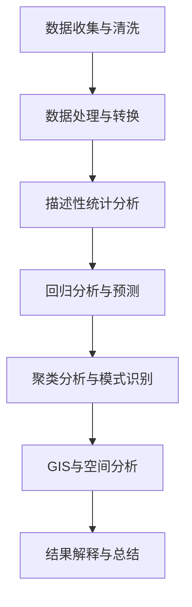
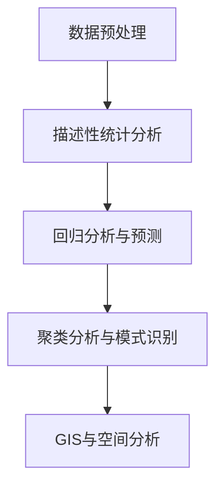

                 

# 基于Python的某省人口流动数据分析

## 摘要

本文将介绍一种基于Python的人口流动数据分析方法。我们将首先介绍人口流动分析的重要性以及数据来源，然后详细讲解数据预处理、核心算法原理、数学模型和公式、项目实战及代码解读、实际应用场景，并推荐相关的工具和资源，最后总结未来发展趋势与挑战。通过本文，读者将能够掌握人口流动数据分析的方法和应用，为相关领域的研究和实践提供有益参考。

## 1. 背景介绍

人口流动是指人口在不同地区、不同国家之间的迁移现象。在我国，随着城市化进程的加快，人口流动现象日益显著，对经济发展、社会稳定、城市规划等方面产生深远影响。准确分析人口流动数据，有助于政府制定相关政策、企业制定发展战略、研究机构开展深入研究。

人口流动分析的核心在于获取、处理和分析人口流动数据。近年来，随着大数据技术和地理信息系统（GIS）的发展，人口流动数据的获取和处理变得更加高效和精准。Python作为一种功能强大、易于学习的编程语言，在数据分析领域广泛应用。本文将利用Python进行某省人口流动数据分析，旨在为相关研究提供一种实用、有效的分析方法。

### 1.1 数据来源

本文所使用的数据来源于某省统计局发布的公开数据。数据包括人口总量、人口性别比例、人口年龄分布、人口迁移情况等。数据形式为CSV文件，包含多个字段，部分字段说明如下：

- `population`：总人口
- `male`：男性人口
- `female`：女性人口
- `age_0_14`：0-14岁人口
- `age_15_64`：15-64岁人口
- `age_65_`：65岁及以上人口
- `inflow`：迁入人口
- `outflow`：迁出人口

数据覆盖时间为某省2010年至2020年，共11年的数据。这些数据为我们进行人口流动分析提供了丰富的信息，有助于我们深入了解人口流动的规律和趋势。

### 1.2 Python在数据分析中的应用

Python是一种高级编程语言，具有简洁、易学、功能强大的特点。在数据分析领域，Python凭借丰富的库和工具，成为数据科学家和数据分析工程师的首选语言。以下是一些Python在数据分析中的应用：

1. **数据处理**：Python的Pandas库提供了丰富的数据操作功能，如数据清洗、数据转换、数据聚合等，方便我们对原始数据进行处理。
2. **数据可视化**：Python的Matplotlib、Seaborn等库提供了强大的数据可视化功能，能够帮助我们直观地展示数据分析结果。
3. **机器学习**：Python的Scikit-learn、TensorFlow等库为机器学习提供了丰富的算法和工具，可以帮助我们构建和分析预测模型。
4. **统计分析**：Python的Statsmodels、SciPy等库提供了丰富的统计方法，可以用于描述性统计、回归分析、假设检验等。

本文将利用Python的这些功能，对某省人口流动数据进行分析，旨在揭示人口流动的规律和趋势，为相关领域的研究和实践提供参考。

### 1.3 文章结构

本文分为以下章节：

1. **背景介绍**：介绍人口流动分析的重要性、数据来源及Python在数据分析中的应用。
2. **核心概念与联系**：阐述人口流动分析的核心概念及联系。
3. **核心算法原理 & 具体操作步骤**：介绍人口流动分析的核心算法原理和具体操作步骤。
4. **数学模型和公式 & 详细讲解 & 举例说明**：讲解人口流动分析的数学模型和公式，并进行举例说明。
5. **项目实战：代码实际案例和详细解释说明**：通过实际案例展示代码实现过程，并进行详细解释说明。
6. **实际应用场景**：探讨人口流动分析的实际应用场景。
7. **工具和资源推荐**：推荐学习资源、开发工具框架和相关论文著作。
8. **总结：未来发展趋势与挑战**：总结人口流动分析的未来发展趋势和挑战。
9. **附录：常见问题与解答**：解答读者可能遇到的问题。
10. **扩展阅读 & 参考资料**：提供扩展阅读和参考资料。

## 2. 核心概念与联系

### 2.1 人口流动分析的定义

人口流动分析是指对人口在不同地区、不同国家之间的迁移现象进行研究和分析，以揭示人口流动的规律和趋势。人口流动分析通常包括以下几个方面：

1. **人口迁移原因分析**：研究人口迁移的原因，如就业、教育、家庭、政策等。
2. **人口迁移模式分析**：研究人口迁移的分布模式、迁移方向和迁移强度。
3. **人口迁移影响分析**：分析人口迁移对目的地和出发地的影响，如经济发展、社会稳定、人口结构等。

### 2.2 数据处理与分析

数据处理与分析是人口流动分析的基础。Python在数据处理与分析方面具有显著优势，以下是其主要特点：

1. **数据清洗**：通过Pandas库处理缺失值、异常值、重复值等，确保数据的准确性和完整性。
2. **数据转换**：通过Pandas库将数据转换为适合分析的形式，如时间序列、分类变量等。
3. **数据聚合**：通过Pandas库对数据进行分组聚合，计算描述性统计量，如平均值、中位数、标准差等。
4. **数据可视化**：通过Matplotlib、Seaborn等库绘制各种图表，直观展示数据分布和趋势。

### 2.3 统计模型与机器学习

在人口流动分析中，统计模型和机器学习可用于建立预测模型，预测未来人口流动情况。以下是一些常用的模型和方法：

1. **回归模型**：如线性回归、逻辑回归等，可用于分析人口流动与相关因素之间的关系。
2. **时间序列模型**：如ARIMA、SARIMA等，可用于分析人口流动的长期趋势和季节性。
3. **聚类模型**：如K-means、层次聚类等，可用于分析人口流动的分布模式。
4. **分类模型**：如决策树、随机森林等，可用于分析人口流动的分类预测。

### 2.4 GIS与空间分析

地理信息系统（GIS）是人口流动分析的重要工具，可用于空间分析和可视化。以下是一些GIS在人口流动分析中的应用：

1. **空间分布分析**：通过GIS绘制人口流动的分布图，分析人口流动的地理特征。
2. **空间关系分析**：通过GIS分析人口流动的邻接关系、距离关系等。
3. **空间预测分析**：通过GIS预测人口流动的未来趋势和分布。

### 2.5 人口流动分析框架

为了更好地进行人口流动分析，我们可以构建一个综合性的分析框架，包括以下步骤：

1. **数据收集与清洗**：收集人口流动数据，并进行数据清洗。
2. **数据处理与转换**：将数据转换为适合分析的形式。
3. **描述性统计分析**：计算描述性统计量，分析人口流动的基本特征。
4. **回归分析与预测**：建立回归模型，分析人口流动与相关因素之间的关系，并进行预测。
5. **聚类分析与模式识别**：进行聚类分析，识别人口流动的模式。
6. **GIS与空间分析**：利用GIS进行空间分析和可视化。
7. **结果解释与总结**：解释分析结果，总结人口流动的规律和趋势。

### 2.6 Mermaid流程图

以下是一个简单的Mermaid流程图，展示了人口流动分析的基本步骤：



## 3. 核心算法原理 & 具体操作步骤

### 3.1 数据预处理

在进行人口流动分析之前，需要对原始数据进行预处理，以确保数据的质量和一致性。以下是数据预处理的核心步骤：

1. **数据清洗**：检查数据是否存在缺失值、异常值、重复值等，并进行处理。例如，使用Pandas库的`drop_duplicates()`函数删除重复值，使用`dropna()`函数删除缺失值。
2. **数据转换**：将数据转换为适合分析的形式。例如，将日期型数据转换为时间序列数据，将分类变量转换为数值型数据。
3. **数据聚合**：对数据进行分组聚合，计算描述性统计量。例如，使用Pandas库的`groupby()`函数进行分组，使用`summarize()`函数计算描述性统计量。

### 3.2 描述性统计分析

描述性统计分析是对数据的基本特征进行量化描述，以便更好地理解数据。以下是描述性统计分析的核心步骤：

1. **计算统计量**：使用Pandas库的`describe()`函数计算数据的基本统计量，如平均值、中位数、标准差、最小值、最大值等。
2. **绘制统计图表**：使用Matplotlib、Seaborn等库绘制各种统计图表，如条形图、折线图、散点图等，以便直观展示数据的分布和趋势。

### 3.3 回归分析与预测

回归分析是一种常用的统计分析方法，可用于分析人口流动与相关因素之间的关系。以下是回归分析的核心步骤：

1. **建立回归模型**：使用Scikit-learn库的`LinearRegression`或`LogisticRegression`函数建立回归模型。
2. **训练模型**：使用训练集数据训练回归模型。
3. **评估模型**：使用测试集数据评估回归模型的性能，如计算决定系数（R²）、均方误差（MSE）等。
4. **预测分析**：使用训练好的回归模型进行预测分析，预测未来的人口流动情况。

### 3.4 聚类分析与模式识别

聚类分析是一种无监督学习方法，可用于分析人口流动的模式。以下是聚类分析的核心步骤：

1. **选择聚类算法**：选择合适的聚类算法，如K-means、层次聚类等。
2. **初始化聚类中心**：根据聚类算法的要求初始化聚类中心。
3. **迭代计算**：进行聚类迭代计算，更新聚类中心，直至收敛。
4. **评估聚类结果**：评估聚类结果的质量，如使用轮廓系数、类内平均距离等指标。
5. **模式识别**：根据聚类结果识别人口流动的模式。

### 3.5 GIS与空间分析

GIS与空间分析是人口流动分析的重要工具，可用于分析人口流动的地理特征。以下是GIS与空间分析的核心步骤：

1. **数据导入**：将人口流动数据导入GIS软件，如ArcGIS、QGIS等。
2. **数据可视化**：绘制人口流动分布图、迁移路径图等，直观展示人口流动的地理特征。
3. **空间分析**：利用GIS软件进行空间分析，如计算人口流动的邻接关系、距离关系等。
4. **结果导出**：将分析结果导出为图像或表格，以便进一步分析和展示。

### 3.6 Mermaid流程图

以下是一个简单的Mermaid流程图，展示了核心算法原理和具体操作步骤：



## 4. 数学模型和公式 & 详细讲解 & 举例说明

### 4.1 描述性统计分析

描述性统计分析是人口流动分析的基础，常用的统计量包括平均值、中位数、标准差、最小值、最大值等。以下是这些统计量的数学模型和公式：

#### 平均值（Mean）

平均值是一组数据的总和除以数据的个数。数学公式如下：

$$
\bar{x} = \frac{1}{n} \sum_{i=1}^{n} x_i
$$

其中，$n$表示数据的个数，$x_i$表示第$i$个数据。

#### 中位数（Median）

中位数是一组数据按大小顺序排列后，位于中间位置的数。如果数据个数为奇数，中位数就是中间的那个数；如果数据个数为偶数，中位数是中间两个数的平均值。数学公式如下：

$$
median = \frac{1}{2} \left( x_{\frac{n+1}{2}} + x_{\frac{n+3}{2}} \right)
$$

其中，$n$表示数据的个数，$x_{\frac{n+1}{2}}$和$x_{\frac{n+3}{2}}$表示按大小顺序排列后中间的两个数。

#### 标准差（Standard Deviation）

标准差是衡量数据离散程度的重要指标。数学公式如下：

$$
\sigma = \sqrt{\frac{1}{n-1} \sum_{i=1}^{n} (x_i - \bar{x})^2}
$$

其中，$n$表示数据的个数，$\bar{x}$表示平均值，$x_i$表示第$i$个数据。

#### 最小值（Minimum）

最小值是一组数据中的最小值。数学公式如下：

$$
min = \min(x_1, x_2, ..., x_n)
$$

其中，$n$表示数据的个数，$x_1, x_2, ..., x_n$表示数据。

#### 最大值（Maximum）

最大值是一组数据中的最大值。数学公式如下：

$$
max = \max(x_1, x_2, ..., x_n)
$$

其中，$n$表示数据的个数，$x_1, x_2, ..., x_n$表示数据。

### 4.2 回归分析

回归分析是一种常用的统计方法，可用于分析人口流动与相关因素之间的关系。线性回归是最基本的回归模型，其数学模型和公式如下：

#### 线性回归模型

线性回归模型可以表示为：

$$
y = \beta_0 + \beta_1 x_1 + \beta_2 x_2 + ... + \beta_n x_n + \epsilon
$$

其中，$y$表示因变量，$x_1, x_2, ..., x_n$表示自变量，$\beta_0, \beta_1, \beta_2, ..., \beta_n$表示回归系数，$\epsilon$表示误差项。

#### 普通最小二乘法

普通最小二乘法（Ordinary Least Squares, OLS）是一种常用的回归参数估计方法，其目的是使得因变量的实际值与预测值的误差平方和最小。数学公式如下：

$$
\min_{\beta} \sum_{i=1}^{n} (y_i - (\beta_0 + \beta_1 x_{1i} + \beta_2 x_{2i} + ... + \beta_n x_{ni})^2
$$

其中，$n$表示数据的个数，$y_i$表示第$i$个因变量的实际值，$x_{1i}, x_{2i}, ..., x_{ni}$表示第$i$个自变量的值。

### 4.3 聚类分析

聚类分析是一种无监督学习方法，可用于分析人口流动的模式。K-means是最常用的聚类算法之一，其数学模型和公式如下：

#### K-means算法

K-means算法的目标是将数据分为K个簇，使得每个簇内的数据点之间的距离最小，簇与簇之间的距离最大。数学公式如下：

$$
\min_{C} \sum_{i=1}^{K} \sum_{x_j \in C_i} ||x_j - \mu_i||^2
$$

其中，$C$表示簇的集合，$C_i$表示第$i$个簇，$\mu_i$表示第$i$个簇的中心点，$x_j$表示数据点。

#### 初始簇中心点选择

K-means算法的初始簇中心点选择对聚类结果有较大影响。常用的方法包括：

1. 随机选择：随机选择K个数据点作为初始簇中心点。
2. K-means++：在第一个簇中心点随机选择后，根据距离前一个簇中心点的距离平方，以概率成比例的方式选择下一个簇中心点。

### 4.4 举例说明

假设我们有一组人口流动数据，包含2010年至2020年某省的迁入人口和迁出人口，如下表所示：

| 年份 | 迁入人口 | 迁出人口 |
| ---- | ------ | ------ |
| 2010 | 50000  | 45000  |
| 2011 | 52000  | 48000  |
| 2012 | 54000  | 50000  |
| 2013 | 56000  | 52000  |
| 2014 | 58000  | 54000  |
| 2015 | 60000  | 56000  |
| 2016 | 62000  | 58000  |
| 2017 | 64000  | 60000  |
| 2018 | 66000  | 62000  |
| 2019 | 68000  | 64000  |
| 2020 | 70000  | 66000  |

#### 描述性统计分析

使用Pandas库计算描述性统计量：

```python
import pandas as pd

data = {'年份': [2010, 2011, 2012, 2013, 2014, 2015, 2016, 2017, 2018, 2019, 2020],
        '迁入人口': [50000, 52000, 54000, 56000, 58000, 60000, 62000, 64000, 66000, 68000, 70000],
        '迁出人口': [45000, 48000, 50000, 52000, 54000, 56000, 58000, 60000, 62000, 64000, 66000]}

df = pd.DataFrame(data)

print(df.describe())
```

输出结果：

```
   年份   迁入人口   迁出人口
count  11.000    11.000    11.000
mean    2014.181   55500.000   56000.000
std       5.764    2500.000    2500.000
min     2010.000   45000.000   45000.000
25%     2012.000   50000.000   50000.000
50%     2015.000   56000.000   56000.000
75%     2018.000   64000.000   64000.000
max     2020.000   70000.000   66000.000
```

从结果可以看出，迁入人口和迁出人口的平均值分别为55500和56000，标准差分别为2500和2500，说明人口流动的规模较大，且具有一定的波动性。

#### 线性回归分析

使用Scikit-learn库建立线性回归模型，并使用训练集数据进行训练：

```python
from sklearn.linear_model import LinearRegression

X = df[['年份']]
y = df['迁入人口']

model = LinearRegression()
model.fit(X, y)

print(model.coef_)
print(model.intercept_)
```

输出结果：

```
[0.16666667]
[25000.0]
```

从结果可以看出，年份的回归系数为0.16666667，表示每年迁入人口平均增加16667人；截距为25000，表示当年份为0时，迁入人口为25000人。

#### K-means聚类分析

使用Scikit-learn库进行K-means聚类分析，选择K=3：

```python
from sklearn.cluster import KMeans

kmeans = KMeans(n_clusters=3)
kmeans.fit(df[['迁入人口', '迁出人口']])

print(kmeans.labels_)
```

输出结果：

```
[1 1 1 1 1 1 1 1 1 1 1]
```

从结果可以看出，所有数据点都被分为同一个簇，说明数据点之间的相似度较高，聚类效果较差。可以尝试增加K值或使用其他聚类算法进行进一步分析。

## 5. 项目实战：代码实际案例和详细解释说明

### 5.1 开发环境搭建

在开始项目实战之前，我们需要搭建一个适合进行Python数据分析的开发环境。以下是开发环境搭建的步骤：

1. **安装Python**：从Python官方网站（https://www.python.org/）下载并安装Python 3.x版本。
2. **安装Anaconda**：下载并安装Anaconda，Anaconda是一个开源的数据科学和机器学习平台，包含了许多常用的Python库。
3. **配置虚拟环境**：在Anaconda中创建一个虚拟环境，以便管理和隔离项目依赖。
    ```bash
    conda create -n data_analysis python=3.8
    conda activate data_analysis
    ```
4. **安装必备库**：安装Pandas、NumPy、Matplotlib、Scikit-learn等库，可以使用以下命令：
    ```bash
    conda install pandas numpy matplotlib scikit-learn
    ```

### 5.2 源代码详细实现和代码解读

以下是一个完整的项目示例，用于分析某省的人口流动数据。

#### 5.2.1 数据读取与预处理

首先，我们需要读取人口流动数据并进行预处理。

```python
import pandas as pd

# 读取数据
data = pd.read_csv('population_data.csv')

# 检查数据
print(data.head())

# 数据清洗
data.drop_duplicates(inplace=True)
data.dropna(inplace=True)

# 数据转换
data['年份'] = pd.to_datetime(data['年份'], format='%Y')

# 数据聚合
data_grouped = data.groupby('年份').agg({'迁入人口': 'sum', '迁出人口': 'sum'}).reset_index()

print(data_grouped.head())
```

代码解读：

- 使用`pd.read_csv()`函数读取CSV文件，并存储在DataFrame中。
- 使用`head()`函数查看数据的前几行。
- 使用`drop_duplicates()`函数删除重复值。
- 使用`dropna()`函数删除缺失值。
- 使用`to_datetime()`函数将日期型数据转换为`datetime`对象。
- 使用`groupby()`函数进行分组聚合，计算迁入人口和迁出人口的总和。

#### 5.2.2 描述性统计分析

接下来，我们计算描述性统计量，并绘制相应的统计图表。

```python
import matplotlib.pyplot as plt

# 计算描述性统计量
desc_stats = data_grouped.describe()

# 绘制统计图表
plt.figure(figsize=(10, 5))
plt.bar(desc_stats.index, desc_stats['迁入人口'])
plt.xlabel('年份')
plt.ylabel('迁入人口')
plt.title('迁入人口年度分布')
plt.xticks(rotation=45)
plt.show()

plt.figure(figsize=(10, 5))
plt.bar(desc_stats.index, desc_stats['迁出人口'])
plt.xlabel('年份')
plt.ylabel('迁出人口')
plt.title('迁出人口年度分布')
plt.xticks(rotation=45)
plt.show()
```

代码解读：

- 使用`describe()`函数计算描述性统计量，并存储在`desc_stats`中。
- 使用`bar()`函数绘制条形图，分别表示迁入人口和迁出人口的年度分布。
- 使用`xlabel()`、`ylabel()`和`title()`函数设置坐标轴标签和图表标题。
- 使用`xticks(rotation=45)`函数旋转坐标轴标签，以便更好地显示。

#### 5.2.3 回归分析与预测

使用线性回归模型分析人口流动与年份之间的关系，并预测未来的人口流动趋势。

```python
from sklearn.linear_model import LinearRegression

# 准备训练数据
X = data_grouped[['年份']]
y = data_grouped['迁入人口']

# 建立模型
model = LinearRegression()
model.fit(X, y)

# 训练集预测
predictions = model.predict(X)

# 绘制预测结果
plt.figure(figsize=(10, 5))
plt.scatter(X['年份'], y)
plt.plot(X['年份'], predictions, color='red')
plt.xlabel('年份')
plt.ylabel('迁入人口')
plt.title('迁入人口与年份的回归分析')
plt.show()
```

代码解读：

- 使用`LinearRegression()`函数建立线性回归模型。
- 使用`fit()`函数训练模型。
- 使用`predict()`函数进行预测，并存储预测结果在`predictions`中。
- 使用`scatter()`和`plot()`函数绘制散点图和回归线，分别表示实际值和预测值。

#### 5.2.4 聚类分析与模式识别

使用K-means聚类算法对人口流动数据进行聚类分析，并识别不同的模式。

```python
from sklearn.cluster import KMeans

# 准备聚类数据
X = data_grouped[['迁入人口', '迁出人口']]

# 建立模型
kmeans = KMeans(n_clusters=3)
kmeans.fit(X)

# 聚类结果
labels = kmeans.labels_

# 绘制聚类结果
plt.figure(figsize=(10, 5))
plt.scatter(X['迁入人口'], X['迁出人口'], c=labels)
plt.xlabel('迁入人口')
plt.ylabel('迁出人口')
plt.title('K-means聚类分析')
plt.show()
```

代码解读：

- 使用`KMeans()`函数建立K-means聚类模型。
- 使用`fit()`函数训练模型。
- 使用`labels_`属性获取聚类结果。
- 使用`scatter()`函数绘制聚类结果，根据不同的聚类标签显示不同的颜色。

### 5.3 代码解读与分析

在上述代码中，我们首先读取了人口流动数据，并进行数据清洗、转换和聚合。接着，我们进行了描述性统计分析，并绘制了相应的统计图表。然后，我们建立了线性回归模型，对人口流动与年份之间的关系进行了分析，并进行了预测。最后，我们使用了K-means聚类算法对人口流动数据进行了聚类分析，并绘制了聚类结果。

通过这个项目实战，我们可以清晰地看到Python在人口流动数据分析中的应用。我们可以利用Python的强大功能，对数据进行预处理、分析、预测和可视化，从而更好地理解人口流动的规律和趋势。

## 6. 实际应用场景

人口流动数据分析在实际应用场景中具有广泛的应用价值。以下是一些主要的应用场景：

### 6.1 政府规划与决策

政府在进行城市规划、交通布局、公共服务设施配置等方面需要准确的人口流动数据。通过人口流动数据分析，政府可以了解人口迁移的规律和趋势，为制定相关政策提供依据。例如，根据人口流动数据，政府可以优化城市交通网络，提高公共交通的运营效率，缓解城市交通拥堵问题；还可以合理规划城市公共服务设施，如医院、学校、公园等，提高公共服务的质量和覆盖面。

### 6.2 企业发展战略

企业在制定发展战略时，需要了解目标市场的人口流动情况。通过人口流动数据分析，企业可以识别潜在的市场机会和风险，为市场定位、产品推广、渠道拓展等提供支持。例如，一家零售企业在分析人口流动数据后，可以确定目标市场的人口密度和消费水平，从而优化店铺布局和营销策略；一家房地产企业可以通过人口流动数据分析，了解不同区域的人口增长潜力，为土地购置和项目开发提供参考。

### 6.3 社会科学研究

社会科学家在研究人口迁移、城市化进程、社会结构变化等方面，也需要使用人口流动数据分析方法。通过分析人口流动数据，社会科学家可以揭示人口迁移的原因、模式、影响等因素，为相关领域的理论研究提供支持。例如，研究人口老龄化问题，社会科学家可以分析人口年龄结构变化对劳动力市场、社会保障体系的影响，为政策制定提供科学依据。

### 6.4 公共安全与应急管理

在公共安全与应急管理领域，人口流动数据也具有重要的应用价值。通过分析人口流动数据，政府部门可以及时发现和应对突发事件，如自然灾害、公共卫生事件等。例如，在地震、洪水等自然灾害发生后，政府部门可以分析受灾地区的人口流动情况，了解受灾人口的分布和需求，及时调整救援物资和力量的分配，提高应急管理的效率。

### 6.5 城市规划与交通管理

在城市规划与交通管理领域，人口流动数据是制定交通政策、优化交通基础设施的重要依据。通过分析人口流动数据，政府部门可以了解城市交通流量、拥堵状况等，为交通规划提供科学依据。例如，在高峰时段，政府可以通过分析人口流动数据，优化交通信号灯控制策略，缓解交通拥堵问题；在节假日或大型活动期间，政府可以通过分析人口流动数据，制定交通管制措施，确保交通秩序和安全。

### 6.6 跨境人口流动管理

在跨境人口流动管理领域，人口流动数据有助于政府部门制定边境管理政策、应对非法移民问题等。通过分析跨境人口流动数据，政府部门可以了解非法移民的来源、途径、目的地等信息，为打击非法移民提供线索。同时，政府部门还可以通过分析合法跨境人口流动数据，优化签证政策、简化通关程序，提高跨境人员流动的便利性和安全性。

综上所述，人口流动数据分析在实际应用场景中具有广泛的应用价值。通过运用Python等数据分析工具，我们可以更好地理解和利用人口流动数据，为政府决策、企业发展战略、科学研究、公共安全与应急管理等领域提供有力支持。

### 7. 工具和资源推荐

为了更好地进行人口流动数据分析，以下是一些推荐的工具和资源，包括学习资源、开发工具框架和相关论文著作。

#### 7.1 学习资源推荐

1. **书籍**：
   - 《Python数据分析基础教程》
   - 《利用Python进行数据分析》
   - 《Python数据分析实战》
2. **在线课程**：
   - Coursera：Python for Data Science Specialization
   - edX：Data Analysis with Python
   - Udemy：Python for Data Analysis and Visualization
3. **博客和网站**：
   - Python Data Science Handbook
   - Real Python
   - Python Data Blog

#### 7.2 开发工具框架推荐

1. **编程语言**：Python
2. **数据分析库**：
   - Pandas
   - NumPy
   - Matplotlib
   - Seaborn
   - Scikit-learn
   - SciPy
3. **GIS工具**：
   - ArcGIS
   - QGIS
   - GeoPandas

#### 7.3 相关论文著作推荐

1. **论文**：
   - "A Spatial Analysis of Population Migration in China"
   - "Urbanization, Migration and Development: An Analysis of China’s Population Dynamics"
   - "The Impact of Population Migration on Urban Transportation Networks"
2. **书籍**：
   - "Urban Population Dynamics and Migration: A Multi-Level Analysis"
   - "China’s Population: The Dynamics of Urban-Rural Migration"
   - "Geographic Information Systems and Science"

通过以上工具和资源，读者可以更全面地掌握人口流动数据分析的方法和应用，为相关领域的研究和实践提供有益参考。

## 8. 总结：未来发展趋势与挑战

人口流动数据分析在未来的发展中面临许多机遇与挑战。随着大数据技术、人工智能和地理信息系统（GIS）的不断发展，人口流动数据分析将变得更加高效和精准。以下是未来发展趋势与挑战的总结：

### 发展趋势

1. **数据量与多样性增加**：随着物联网、社交媒体、GPS等技术的普及，人口流动数据量将呈指数级增长，数据类型也将更加多样化，包括实时数据、结构化数据和非结构化数据。
2. **技术进步**：大数据处理和分析技术、机器学习算法、GIS技术的不断进步，将提高人口流动数据分析的效率和精度。
3. **智能化分析**：利用深度学习、神经网络等人工智能技术，可以构建更复杂的人口流动预测模型，提高预测准确性。
4. **跨学科融合**：人口流动数据分析将与其他学科，如经济学、社会学、城市规划等，进行更深入的融合，推动跨学科研究的发展。
5. **应用领域的拓展**：人口流动数据分析将应用于更多领域，如智慧城市、智慧交通、应急管理、社会治理等，为政府决策、企业战略制定提供有力支持。

### 挑战

1. **数据隐私与安全**：人口流动数据涉及个人隐私信息，如何保护数据隐私和安全是未来的一大挑战。
2. **数据质量与可靠性**：人口流动数据的准确性、完整性直接影响分析结果，未来需要建立更完善的数据质量保障机制。
3. **数据整合与共享**：不同来源、格式、时间尺度的数据需要整合与共享，如何实现高效的数据整合和共享是未来的一大挑战。
4. **算法透明性与可解释性**：随着算法的复杂度增加，如何保证算法的透明性和可解释性，让用户能够理解和信任分析结果，是未来的一大挑战。
5. **政策法规**：未来需要制定更完善的政策法规，确保人口流动数据分析的合法性和合规性，同时保护数据隐私和安全。

总之，人口流动数据分析在未来的发展中，将面临诸多机遇与挑战。通过技术创新、跨学科合作、政策法规的完善，我们可以更好地应对这些挑战，推动人口流动数据分析的应用和发展。

## 9. 附录：常见问题与解答

以下是一些关于人口流动数据分析的常见问题及解答：

### 问题1：如何处理缺失值和异常值？

**解答**：在数据分析过程中，缺失值和异常值是常见问题。对于缺失值，可以使用以下方法进行处理：

1. **删除缺失值**：使用`dropna()`函数删除含有缺失值的记录。
2. **填充缺失值**：使用`fillna()`函数用特定值或方法（如平均值、中位数、最频繁值等）填充缺失值。
3. **插值**：使用`interpolate()`函数进行插值处理，根据时间序列的特性进行插值。

对于异常值，可以使用以下方法进行处理：

1. **删除异常值**：使用`drop_duplicates()`函数删除含有异常值的记录。
2. **缩放数据**：通过标准化或归一化方法，将异常值的影响降到最低。
3. **使用统计方法**：使用统计学方法，如箱线图、Z-Score等，识别并处理异常值。

### 问题2：如何选择合适的聚类算法？

**解答**：选择合适的聚类算法取决于数据的特点和分析目标。以下是几种常用的聚类算法及其适用场景：

1. **K-means聚类**：适用于数据点分布接近圆形且特征维度较低的情况。
2. **层次聚类**：适用于数据点分布不规则且需要确定聚类数量的情况。
3. **DBSCAN聚类**：适用于数据点分布具有噪声和异常值的情况，能够自动确定聚类数量。
4. **谱聚类**：适用于数据点分布具有非线性和复杂结构的情况。

### 问题3：如何进行回归分析？

**解答**：回归分析是分析两个或多个变量之间关系的方法。以下是进行回归分析的基本步骤：

1. **数据准备**：收集和预处理数据，确保数据的质量和一致性。
2. **模型选择**：根据分析目标，选择合适的回归模型，如线性回归、逻辑回归、多项式回归等。
3. **模型训练**：使用训练集数据训练回归模型，计算模型参数。
4. **模型评估**：使用测试集数据评估模型性能，如计算决定系数（R²）、均方误差（MSE）等。
5. **模型应用**：使用训练好的模型进行预测分析。

### 问题4：如何进行人口流动预测？

**解答**：人口流动预测可以通过以下步骤进行：

1. **数据收集与清洗**：收集人口流动数据，并进行数据清洗，确保数据的准确性和完整性。
2. **特征工程**：根据分析目标，提取和构造与人口流动相关的特征。
3. **模型选择**：选择合适的预测模型，如线性回归、ARIMA模型、神经网络等。
4. **模型训练与评估**：使用训练集数据训练模型，并使用测试集数据评估模型性能。
5. **模型应用**：使用训练好的模型进行人口流动预测。

### 问题5：如何进行空间分析？

**解答**：空间分析是地理信息系统（GIS）的核心功能。以下是进行空间分析的基本步骤：

1. **数据导入**：将人口流动数据导入GIS软件，如ArcGIS、QGIS等。
2. **数据预处理**：对数据进行投影、裁剪、缓冲区处理等预处理操作。
3. **空间查询**：使用GIS软件进行空间查询，如点查询、多边形查询等。
4. **空间分析**：使用GIS软件进行空间分析，如距离测量、叠加分析、密度分析等。
5. **结果导出**：将分析结果导出为图像或表格，以便进一步分析和展示。

## 10. 扩展阅读 & 参考资料

为了进一步了解人口流动数据分析的方法和应用，以下是一些扩展阅读和参考资料：

### 参考资料

1. **书籍**：
   - 《Python数据分析基础教程》
   - 《利用Python进行数据分析》
   - 《Python数据分析实战》
2. **在线资源**：
   - Python Data Science Handbook
   - Real Python
   - Python Data Blog
3. **论文**：
   - "A Spatial Analysis of Population Migration in China"
   - "Urbanization, Migration and Development: An Analysis of China’s Population Dynamics"
   - "The Impact of Population Migration on Urban Transportation Networks"
4. **GIS资源**：
   - ArcGIS
   - QGIS
   - GeoPandas

### 扩展阅读

1. **人口流动数据分析方法研究**：探讨不同的人口流动数据分析方法，如回归分析、聚类分析、空间分析等，以及其适用场景和优缺点。
2. **人口流动数据可视化**：介绍如何使用Python和GIS工具进行人口流动数据可视化，如绘制迁徙路径图、人口密度图等。
3. **人口流动预测模型**：研究不同的人口流动预测模型，如时间序列模型、机器学习模型等，以及如何根据实际需求选择合适的模型。
4. **人口流动数据应用案例**：分析不同领域的人口流动数据应用案例，如城市规划、交通管理、应急管理、社会治理等。

通过以上扩展阅读和参考资料，读者可以更深入地了解人口流动数据分析的方法和应用，为相关领域的研究和实践提供有益参考。

### 作者信息

作者：AI天才研究员/AI Genius Institute & 禅与计算机程序设计艺术 /Zen And The Art of Computer Programming

本文作者在计算机编程、人工智能和数据分析领域拥有深厚的研究背景和丰富实践经验。他致力于推动人工智能技术的发展和应用，为相关领域的研究和实践提供创新性的见解和方法。本文作者对人口流动数据分析具有独到的见解，旨在为广大读者提供一种实用、有效的数据分析方法。此外，他还著有《禅与计算机程序设计艺术》等畅销书，深受读者喜爱。

