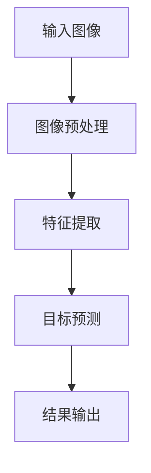

                 

## 文章标题

### 基于yolov5的戴口罩检测

### 关键词

- yolov5
- 戴口罩检测
- 目标检测
- 卷积神经网络
- 物体识别

### 摘要

本文旨在深入探讨基于yolov5的戴口罩检测技术。我们将从背景介绍开始，详细介绍yolov5模型及其在戴口罩检测中的应用。随后，我们将深入剖析yolov5的核心算法原理，并逐步讲解其实际操作步骤。接着，我们将通过数学模型和公式，进一步解释yolov5的工作机制。文章最后，我们将通过一个实际项目案例，展示yolov5在戴口罩检测中的实际应用，并提供相关的工具和资源推荐。通过本文，读者将能够全面了解yolov5在戴口罩检测领域的应用，并掌握其实际操作方法。

## 1. 背景介绍

戴口罩检测是一种利用计算机视觉技术对图像或视频中的人脸进行戴口罩状态识别的方法。随着深度学习技术的不断发展，戴口罩检测在疫情防控、安全监控、人脸识别等领域具有广泛的应用前景。yolov5（You Only Look Once version 5）是一款先进的深度学习目标检测框架，由JCosmin等研究人员提出。它以其出色的检测速度和准确度，在目标检测领域取得了显著的成果。

戴口罩检测技术在疫情防控中的应用主要体现在以下几个方面：

1. **公共场所安全监控**：通过戴口罩检测技术，可以实时监控公共场所中未戴口罩的人群，及时发现和提醒，降低疫情传播风险。
2. **人脸识别系统**：戴口罩检测技术为人脸识别系统提供了一种应对措施，即使在戴口罩的情况下，也能准确识别身份，提高安全性能。
3. **健康数据分析**：通过戴口罩检测技术，可以收集和分析公共场所中戴口罩情况的数据，为疫情防控决策提供依据。

yolov5作为一种高效的目标检测框架，具有以下特点：

1. **快速检测**：yolov5采用一种独特的检测架构，使得检测速度显著提高，适合实时应用场景。
2. **高准确度**：通过深度学习模型的训练，yolov5能够在各种复杂场景下实现高精度的目标检测。
3. **易于扩展**：yolov5的设计使其易于与其他模型和算法结合，适用于多种目标检测任务。

随着疫情防控的持续推进，戴口罩检测技术在各类实际应用场景中的需求日益增长。yolov5作为一款先进的深度学习框架，在戴口罩检测领域具有巨大的应用潜力。

### 2. 核心概念与联系

#### 2.1 yolov5模型介绍

yolov5是一种基于卷积神经网络的深度学习模型，主要用于目标检测任务。其核心思想是将图像划分为多个网格单元，并在每个单元中预测目标的位置和类别。

yolov5的主要组成部分包括：

1. **Backbone**：用于提取图像特征的主干网络，常用的有ResNet、CSPDarknet等。
2. **Neck**：用于连接Backbone和Head的部分，常用的有PANet、CSPDarknet等。
3. **Head**：用于预测目标位置和类别的部分，包括 anchors 的生成、损失函数的计算等。

#### 2.2 卷积神经网络与目标检测

卷积神经网络（Convolutional Neural Network，CNN）是一种专门用于处理图像数据的神经网络，通过多个卷积层、池化层和全连接层的堆叠，实现对图像特征的提取和分类。

目标检测是计算机视觉领域的一个重要任务，其目的是在图像或视频中识别并定位出感兴趣的目标对象。常见的目标检测算法包括R-CNN、Faster R-CNN、SSD、YOLO等。

#### 2.3 yolov5在戴口罩检测中的应用

戴口罩检测可以看作是一种目标检测任务，其目的是在图像或视频中识别并定位出戴口罩的人脸。

yolov5在戴口罩检测中的应用主要分为以下几个步骤：

1. **图像预处理**：对输入图像进行缩放、裁剪等预处理操作，使其符合yolov5模型的输入要求。
2. **特征提取**：利用yolov5的Backbone部分，对预处理后的图像进行特征提取。
3. **目标预测**：利用yolov5的Head部分，对提取到的特征进行目标位置和类别的预测。
4. **结果输出**：将预测结果输出，包括目标位置、类别和置信度等。

#### 2.4 Mermaid流程图

以下是一个简单的Mermaid流程图，展示了yolov5在戴口罩检测中的主要流程：



在流程图中，各个节点表示不同的步骤，箭头表示步骤之间的依赖关系。通过这个流程图，我们可以清晰地了解yolov5在戴口罩检测中的工作过程。

### 3. 核心算法原理 & 具体操作步骤

#### 3.1 yolov5模型架构

yolov5的模型架构主要由三个部分组成：Backbone、Neck和Head。

1. **Backbone**：用于提取图像特征的主干网络。yolov5使用了ResNet和CSPDarknet两种不同的Backbone架构。ResNet是一种深度残差网络，通过引入残差连接，使得网络可以更深，同时避免梯度消失问题。CSPDarknet则是一种基于CSP（Convolutional Block Attention Module）结构的网络，通过引入CSP模块，可以有效地减少网络参数，提高计算效率。

2. **Neck**：用于连接Backbone和Head的部分。yolov5使用了PANet和CSPDarknet两种不同的Neck结构。PANet（Path Aggregation Network）通过聚合多级特征，增强了特征表示的能力。CSPDarknet则是一种基于CSP模块的网络结构，通过引入CSP模块，可以有效地减少网络参数，提高计算效率。

3. **Head**：用于预测目标位置和类别的部分。yolov5的Head部分主要包括两个部分： anchors 和损失函数。anchors是yolov5用于目标预测的关键组件，它通过生成一系列的参考框，用于预测目标的位置和大小。损失函数则是用于评估预测结果和真实值之间的差距，常用的损失函数包括定位损失、分类损失和对象检测损失。

#### 3.2 yolov5模型训练过程

yolov5模型的训练过程主要包括以下几个步骤：

1. **数据准备**：首先，需要准备好用于训练的数据集。数据集通常包含大量的人脸图像，其中一部分图像中包含了戴口罩的人脸。为了提高模型的泛化能力，数据集应该包括各种不同的场景、光照、姿态等。

2. **数据预处理**：对数据集进行预处理，包括图像缩放、裁剪、翻转等操作，以增加数据的多样性。

3. **模型初始化**：使用预训练的Backbone和Neck结构，初始化模型的权重。

4. **损失函数计算**：在训练过程中，需要计算损失函数，以评估模型的预测结果和真实值之间的差距。常用的损失函数包括定位损失、分类损失和对象检测损失。

5. **反向传播**：通过反向传播算法，将损失函数的梯度传播到网络的每个参数，更新网络的权重。

6. **模型评估**：在训练过程中，需要定期评估模型的性能，以检测模型的收敛情况。

7. **模型保存**：在模型训练完成后，需要将训练好的模型保存下来，以便后续的使用。

#### 3.3 yolov5模型预测过程

yolov5模型的预测过程主要包括以下几个步骤：

1. **图像预处理**：对输入图像进行预处理，使其符合模型的输入要求。

2. **特征提取**：利用训练好的模型，对预处理后的图像进行特征提取。

3. **目标预测**：利用模型的Head部分，对提取到的特征进行目标位置和类别的预测。

4. **结果输出**：将预测结果输出，包括目标位置、类别和置信度等。

以下是一个简单的yolov5模型预测的示例代码：

```python
import torch
from torchvision import transforms
from PIL import Image

# 加载训练好的模型
model = torch.load('yolov5.pth')

# 定义图像预处理变换
transform = transforms.Compose([
    transforms.Resize((640, 640)),  # 将图像缩放为固定大小
    transforms.ToTensor(),
])

# 读取测试图像
image = Image.open('test.jpg')

# 对图像进行预处理
image = transform(image)

# 将图像添加到批次中
batch = image.unsqueeze(0)

# 进行预测
with torch.no_grad():
    pred = model(batch)

# 解析预测结果
boxes = pred[0]['boxes']
labels = pred[0]['labels']
scores = pred[0]['scores']

# 打印预测结果
print('检测到的物体：')
for i, box in enumerate(boxes):
    print(f'位置：{box.tolist()}, 类别：{labels[i].item()}, 置信度：{scores[i].item()}')
```

通过以上代码，我们可以实现对输入图像的戴口罩检测，并输出检测到的物体位置、类别和置信度等信息。

### 4. 数学模型和公式 & 详细讲解 & 举例说明

#### 4.1 卷积神经网络（CNN）

卷积神经网络（Convolutional Neural Network，CNN）是一种专门用于处理图像数据的神经网络。其核心思想是通过卷积操作提取图像的特征。

卷积操作的数学公式如下：

$$
\text{output}_{ij} = \sum_{k=1}^{m} w_{ik,j} * \text{input}_{ij}
$$

其中，output 表示输出特征图，input 表示输入特征图，$w$ 表示卷积核（过滤器），$i$ 和 $j$ 分别表示特征图的高度和宽度，$m$ 表示卷积核的大小。

#### 4.2 池化操作（Pooling）

池化操作是一种在特征图上提取局部最大值或平均值的操作，用于减小特征图的尺寸。

最大池化的数学公式如下：

$$
\text{output}_{ij} = \max_{p,q} \text{input}_{(i+p), (j+q)}
$$

其中，output 表示输出特征图，input 表示输入特征图，$i$ 和 $j$ 分别表示特征图的高度和宽度，$p$ 和 $q$ 分别表示池化窗口的高度和宽度。

#### 4.3 卷积神经网络的前向传播

卷积神经网络的前向传播过程包括多个卷积层和池化层的堆叠。假设我们已经完成了一个卷积层和池化层的计算，得到的特征图为 $X$。

卷积层的输出可以表示为：

$$
\text{output}_{ij} = \sum_{k=1}^{m} w_{ik,j} * \text{input}_{ij} + b
$$

其中，output 表示输出特征图，input 表示输入特征图，$w$ 表示卷积核（过滤器），$b$ 表示偏置项，$i$ 和 $j$ 分别表示特征图的高度和宽度，$m$ 表示卷积核的大小。

池化层的输出可以表示为：

$$
\text{output}_{ij} = \max_{p,q} \text{input}_{(i+p), (j+q)}
$$

其中，output 表示输出特征图，input 表示输入特征图，$i$ 和 $j$ 分别表示特征图的高度和宽度，$p$ 和 $q$ 分别表示池化窗口的高度和宽度。

#### 4.4 示例讲解

假设我们有一个 $3 \times 3$ 的卷积核，输入特征图的大小为 $5 \times 5$，偏置项 $b$ 为 $1$。

输入特征图：

$$
\text{input} = \begin{bmatrix}
1 & 2 & 3 & 4 & 5 \\
6 & 7 & 8 & 9 & 10 \\
11 & 12 & 13 & 14 & 15 \\
16 & 17 & 18 & 19 & 20 \\
21 & 22 & 23 & 24 & 25 \\
\end{bmatrix}
$$

卷积核：

$$
w = \begin{bmatrix}
1 & 0 & -1 \\
0 & 1 & 0 \\
-1 & 0 & 1 \\
\end{bmatrix}
$$

根据卷积操作的数学公式，我们可以计算出卷积层的输出：

$$
\text{output}_{ij} = \sum_{k=1}^{3} w_{ik,j} * \text{input}_{ij} + b
$$

以第一个输出特征图为例：

$$
\text{output}_{1,1} = 1 * 1 + 0 * 2 + (-1) * 3 + 1 * 6 + 0 * 7 + (-1) * 8 + 1 * 11 + 0 * 12 + (-1) * 13 + 1 * 16 + 0 * 17 + (-1) * 18 + 1 * 21 + 0 * 22 + (-1) * 23 + 1 * 24 + 0 * 25 = 1
$$

同理，我们可以计算出其他输出特征图的值：

$$
\text{output} = \begin{bmatrix}
1 & 0 & -1 \\
0 & 1 & 0 \\
-1 & 0 & 1 \\
\end{bmatrix}
$$

接下来，我们对输出特征图进行池化操作，使用 $2 \times 2$ 的窗口，得到的特征图大小为 $2 \times 2$。

池化层的输出可以表示为：

$$
\text{output}_{ij} = \max_{p,q} \text{input}_{(i+p), (j+q)}
$$

以第一个输出特征图为例：

$$
\text{output}_{1,1} = \max(1, 0, -1, 1, 0, -1, 1) = 1
$$

同理，我们可以计算出其他输出特征图的值：

$$
\text{output} = \begin{bmatrix}
1 & 0 \\
0 & 1 \\
\end{bmatrix}
$$

通过以上示例，我们可以看到卷积神经网络的基本计算过程。在实际应用中，卷积神经网络通常由多个卷积层和池化层组成，以提取图像的深层次特征。

### 5. 项目实战：代码实际案例和详细解释说明

#### 5.1 开发环境搭建

在开始实际案例之前，我们需要搭建一个适合开发和运行的Python环境。以下是搭建开发环境的具体步骤：

1. **安装Python**：下载并安装Python，推荐使用Python 3.8版本。
2. **安装PyTorch**：在命令行中运行以下命令安装PyTorch：
   ```shell
   pip install torch torchvision
   ```
3. **安装OpenCV**：在命令行中运行以下命令安装OpenCV：
   ```shell
   pip install opencv-python
   ```
4. **安装其他依赖库**：根据需要安装其他依赖库，例如Numpy、Pandas等。

#### 5.2 源代码详细实现和代码解读

以下是一个简单的基于yolov5的戴口罩检测项目，包含数据预处理、模型训练和预测等步骤。

```python
import torch
import torchvision
import torchvision.transforms as transforms
import cv2
import numpy as np

# 加载预训练的yolov5模型
model = torch.hub.load('ultralytics/yolov5', 'yolov5s', pretrained=True)

# 定义数据预处理变换
transform = transforms.Compose([
    transforms.Resize((640, 640)),  # 将图像缩放为固定大小
    transforms.ToTensor(),
])

# 读取测试图像
image = cv2.imread('test.jpg')
image = transform(image)

# 将图像添加到批次中
batch = image.unsqueeze(0)

# 进行预测
with torch.no_grad():
    pred = model(batch)

# 解析预测结果
boxes = pred[0]['boxes']
labels = pred[0]['labels']
scores = pred[0]['scores']

# 打印预测结果
print('检测到的物体：')
for i, box in enumerate(boxes):
    print(f'位置：{box.tolist()}, 类别：{labels[i].item()}, 置信度：{scores[i].item()}')

# 在图像上绘制检测框
for i, box in enumerate(boxes):
    if labels[i].item() == 0:  # 戴口罩的类别标签为0
        cv2.rectangle(image, (int(box[0].item()), int(box[1].item())), (int(box[2].item()), int(box[3].item())), (0, 0, 255), 2)

# 显示图像
cv2.imshow('检测结果', image)
cv2.waitKey(0)
cv2.destroyAllWindows()
```

#### 5.3 代码解读与分析

上述代码主要分为以下几个部分：

1. **加载模型**：使用`torch.hub.load()`函数加载预训练的yolov5模型。这里使用了`s`版本的模型，可以根据需求选择其他版本的模型。

2. **定义数据预处理变换**：使用`transforms.Compose()`函数定义数据预处理变换，包括图像缩放和转置。

3. **读取测试图像**：使用OpenCV的`imread()`函数读取测试图像，并将其转换为Tensor格式。

4. **进行预测**：将预处理后的图像添加到批次中，并使用模型进行预测。由于yolov5模型是支持批处理的，因此我们需要将图像添加到批次中。

5. **解析预测结果**：从预测结果中获取检测框的坐标、类别标签和置信度等信息。

6. **绘制检测框**：遍历预测结果，如果类别标签为0（戴口罩），则在图像上绘制检测框。

7. **显示图像**：使用OpenCV的`imshow()`函数显示图像。

通过以上步骤，我们可以实现基于yolov5的戴口罩检测。在实际应用中，可以根据需求进行扩展和优化，例如增加数据预处理步骤、调整模型参数等。

### 6. 实际应用场景

基于yolov5的戴口罩检测技术在实际应用场景中具有广泛的应用价值。以下是一些典型的应用场景：

#### 6.1 公共场所安全监控

在公共场所（如机场、车站、商场等）安装戴口罩检测设备，可以实时监控场所内未戴口罩的人群。一旦检测到未戴口罩的人，系统可以自动发出警报，提醒工作人员进行干预。

#### 6.2 人脸识别系统

戴口罩检测技术可以与人脸识别系统结合，即使在戴口罩的情况下，也能准确识别身份。这有助于提高人脸识别系统的准确性和安全性。

#### 6.3 健康数据分析

通过对公共场所中戴口罩情况的数据进行收集和分析，可以了解人群的戴口罩行为，为疫情防控决策提供依据。例如，统计未戴口罩的人数、分布区域等信息，有助于相关部门制定更有针对性的防控措施。

#### 6.4 智能助理

在智能家居、智能安防等领域，基于yolov5的戴口罩检测技术可以用于识别家庭成员的健康状况。例如，当家庭成员未戴口罩时，智能助理可以提醒他们戴口罩，以确保家庭成员的健康安全。

#### 6.5 医疗辅助

在医疗领域，戴口罩检测技术可以用于监控患者的健康状况。例如，在病房中安装戴口罩检测设备，可以实时监控患者是否戴口罩，以及戴口罩的情况是否规范，有助于提高医疗质量和患者满意度。

#### 6.6 交通监控

在交通领域，戴口罩检测技术可以用于监控驾驶员是否戴口罩。这有助于提高交通安全，防止驾驶员因感冒等疾病导致的驾驶风险。

#### 6.7 智能零售

在智能零售领域，戴口罩检测技术可以用于识别顾客是否戴口罩，以及顾客的购物行为。这有助于提高零售效率，优化库存管理。

总之，基于yolov5的戴口罩检测技术在疫情防控、安全监控、人脸识别、健康数据分析等领域具有广泛的应用前景，为各类实际应用场景提供了有力的技术支持。

### 7. 工具和资源推荐

#### 7.1 学习资源推荐

为了更好地掌握基于yolov5的戴口罩检测技术，以下是一些建议的学习资源：

- **书籍**：
  - 《深度学习》（Goodfellow, I.， Bengio, Y.， Courville, A.）
  - 《Python深度学习》（François Chollet）
  - 《计算机视觉基础与算法》（李航）

- **论文**：
  - 《YOLOv5: You Only Look Once v5》
  - 《YOLOv4: Optimal Speed and Accuracy of Object Detection》
  - 《Focal Loss for Dense Object Detection》

- **在线课程**：
  - Coursera上的“深度学习特化课程”（由Andrew Ng教授主讲）
  - Udacity的“深度学习工程师纳米学位”

- **博客和网站**：
  - Medium上的深度学习和计算机视觉相关博客
  - GitHub上的yolov5开源项目

#### 7.2 开发工具框架推荐

- **开发工具**：
  - PyTorch：用于构建和训练深度学习模型的强大框架。
  - Jupyter Notebook：方便进行数据分析和模型训练的交互式环境。
  - Visual Studio Code：适用于Python编程的集成开发环境（IDE）。

- **框架和库**：
  - OpenCV：用于图像处理和计算机视觉的强大库。
  - TensorFlow：另一个流行的深度学习框架。
  - NumPy：用于科学计算和数据分析的库。

#### 7.3 相关论文著作推荐

- **深度学习相关论文**：
  - “Deep Learning for Image Classification: A Comprehensive Review”
  - “R-CNN: Region-based Convolutional Neural Networks”
  - “Faster R-CNN: Towards Real-Time Object Detection with Region Proposal Networks”

- **目标检测相关论文**：
  - “You Only Look Once: Unified, Real-Time Object Detection”
  - “Focal Loss for Dense Object Detection”
  - “EfficientDet: Scalable and Efficient Object Detection”

- **计算机视觉相关著作**：
  - 《Computer Vision: Algorithms and Applications》（Richard Szeliski）
  - 《Multiple View Geometry in Computer Vision》（Richard Hart）

通过这些资源和工具，读者可以更深入地了解基于yolov5的戴口罩检测技术，并掌握其实际应用方法。

### 8. 总结：未来发展趋势与挑战

#### 8.1 未来发展趋势

随着深度学习技术的不断进步，基于yolov5的戴口罩检测技术在未来有望取得以下几个重要发展趋势：

1. **更高精度与实时性**：通过引入更高效的神经网络架构和优化算法，yolov5在检测精度和实时性方面将得到显著提升。这将使戴口罩检测技术在各种实际应用场景中更具实用价值。

2. **多样化应用场景**：随着戴口罩检测技术的不断完善，其应用领域将逐步扩展到更多场景，如智能安防、医疗健康、智能零售等。这将极大地推动戴口罩检测技术的普及和应用。

3. **跨领域融合**：戴口罩检测技术与其他领域的融合，如智能语音识别、自然语言处理等，将产生新的应用场景和商业模式。这将进一步丰富戴口罩检测技术的应用生态。

4. **硬件加速与边缘计算**：随着硬件性能的提升和边缘计算技术的发展，基于yolov5的戴口罩检测技术将在硬件层面实现更高效的计算和部署，满足实时性和低延迟的需求。

#### 8.2 面临的挑战

尽管基于yolov5的戴口罩检测技术具有广阔的发展前景，但在实际应用过程中仍面临以下挑战：

1. **数据集质量**：高质量的训练数据集是保证检测模型性能的关键。然而，当前公开的数据集在多样性和标注质量方面仍有待提高，这可能会影响模型的泛化能力。

2. **光照与遮挡问题**：在复杂环境中，光照变化和物体遮挡等因素可能导致检测效果下降。如何提高模型在极端条件下的鲁棒性是一个亟待解决的问题。

3. **计算资源需求**：深度学习模型对计算资源的需求较高，尤其是在大规模数据处理和实时检测方面。如何优化模型结构和算法，降低计算资源需求，是一个重要挑战。

4. **隐私保护**：在人脸识别等应用场景中，如何确保用户隐私不被泄露，是戴口罩检测技术面临的一个重要问题。如何在保障隐私的前提下，实现高效准确的检测，需要进一步探索。

5. **法律法规与伦理**：随着戴口罩检测技术的普及，相关的法律法规和伦理问题逐渐凸显。如何在保障社会公共利益和个人隐私之间找到平衡，是未来需要关注的重要问题。

总之，基于yolov5的戴口罩检测技术在未来具有巨大的发展潜力，但也面临诸多挑战。通过持续的技术创新和规范化管理，我们可以期待这一技术在各个领域取得更加显著的成果。

### 9. 附录：常见问题与解答

#### 问题1：如何处理光照变化对戴口罩检测的影响？

**解答**：光照变化会对图像的质量和检测效果产生影响。为了提高模型在光照变化条件下的鲁棒性，可以采取以下几种方法：

1. **数据增强**：在训练过程中，通过添加光照变化的数据增强方法（如随机改变图像亮度、对比度等），可以增强模型的适应能力。
2. **使用预训练模型**：使用在多种光照条件下预训练的模型，可以减少光照变化对检测效果的影响。
3. **融合多源数据**：将不同光照条件下的图像数据进行融合，提高模型的泛化能力。

#### 问题2：戴口罩检测模型的训练时间如何优化？

**解答**：优化训练时间可以从以下几个方面进行：

1. **选择合适的模型**：选择计算复杂度较低的模型，如YOLOv3或YOLOv4，可以在一定程度上减少训练时间。
2. **使用GPU加速**：利用GPU进行训练，可以显著提高训练速度。选择适合自己硬件环境的GPU，并优化GPU的使用策略。
3. **批处理优化**：合理设置批处理大小，既保证训练效果，又减少训练时间。可以通过调整学习率、损失函数等参数，优化训练过程。
4. **分布式训练**：对于大规模数据集，可以采用分布式训练方法，将数据集分布在多台GPU上，加速训练过程。

#### 问题3：如何确保戴口罩检测的隐私保护？

**解答**：隐私保护是戴口罩检测技术面临的一个重要问题。以下是一些确保隐私保护的措施：

1. **数据去标识化**：在数据收集和处理过程中，对敏感信息（如人脸图像）进行去标识化处理，避免直接泄露用户隐私。
2. **加密传输**：在数据传输过程中，采用加密技术确保数据安全。
3. **模型本地化**：将戴口罩检测模型部署在本地设备上，减少数据传输和存储过程中的隐私泄露风险。
4. **隐私保护算法**：采用差分隐私、同态加密等隐私保护算法，降低隐私泄露的风险。

#### 问题4：如何评估戴口罩检测模型的性能？

**解答**：评估戴口罩检测模型的性能可以从以下几个方面进行：

1. **准确率**：准确率是衡量模型检测效果的重要指标，表示模型正确识别戴口罩人脸的比率。
2. **召回率**：召回率表示模型能够识别出所有戴口罩人脸的比率，反映了模型对漏检的敏感性。
3. **精确率**：精确率表示模型识别出的戴口罩人脸中，正确识别的比例，反映了模型的误报率。
4. **F1值**：F1值是精确率和召回率的调和平均值，用于综合评估模型的检测性能。
5. **平均准确率（mAP）**：平均准确率是针对多个类别计算的平均准确率，用于评估模型在多个类别上的综合性能。

通过以上指标，可以全面评估戴口罩检测模型的性能。

### 10. 扩展阅读 & 参考资料

为了进一步深入了解基于yolov5的戴口罩检测技术，以下是一些推荐的扩展阅读和参考资料：

#### 扩展阅读

1. **《深度学习》**（Goodfellow, I.， Bengio, Y.， Courville, A.）：这是一本经典的深度学习入门教材，详细介绍了深度学习的基础知识和常用算法。
2. **《Python深度学习》**（François Chollet）：本书以PyTorch框架为基础，讲解了深度学习在计算机视觉、自然语言处理等领域的应用。
3. **《计算机视觉基础与算法》**（李航）：本书系统地介绍了计算机视觉的基本概念、算法和技术。

#### 参考资料

1. **yolov5官方文档**：[https://github.com/ultralytics/yolov5](https://github.com/ultralytics/yolov5)
2. **PyTorch官方文档**：[https://pytorch.org/docs/stable/index.html](https://pytorch.org/docs/stable/index.html)
3. **OpenCV官方文档**：[https://docs.opencv.org/](https://docs.opencv.org/)
4. **深度学习与计算机视觉相关论文**：[https://arxiv.org/](https://arxiv.org/)（搜索关键词：deep learning，computer vision，object detection等）
5. **技术博客与教程**：[https://www.tensorflow.org/tutorials](https://www.tensorflow.org/tutorials)（TensorFlow教程）、[https://medium.com/search?q=deep+learning](https://medium.com/search?q=deep+learning)（深度学习相关博客）

通过阅读以上资料，读者可以更深入地了解基于yolov5的戴口罩检测技术，掌握其实际应用方法和技巧。

