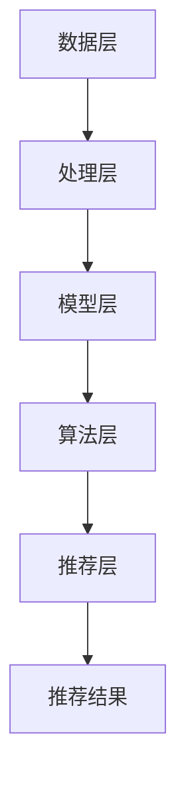

                 

### 1. 背景介绍

在现代互联网经济中，电商平台已经成为消费者购买商品的重要渠道。随着电商平台的迅速发展，用户数量和交易量也急剧增加。面对海量的用户数据和商品信息，如何有效地为用户提供个性化推荐，从而提高用户满意度和增加销售量，成为电商平台面临的重要挑战。

用户个性化推荐是电商平台的核心理功能之一，通过分析用户的历史行为、偏好和兴趣，为用户提供符合其个性化需求的商品推荐。这不仅能够提升用户的购物体验，还能够显著增加平台的销售额和用户粘性。

本文将从大数据的角度，深入分析电商平台用户个性化推荐系统的构建方法、核心算法原理、数学模型及其在实际应用中的实现过程。通过本文的阐述，希望能够为电商平台的开发者和研究者提供有价值的参考和指导。

本文的结构如下：

- 第2章将介绍用户个性化推荐系统的核心概念与架构。
- 第3章将探讨用户个性化推荐的核心算法原理和具体操作步骤。
- 第4章将介绍用户个性化推荐所涉及的数学模型和公式，并进行详细讲解和举例说明。
- 第5章将结合具体项目实战，详细讲解代码实现过程和解读。
- 第6章将分析用户个性化推荐在实际应用场景中的表现和效果。
- 第7章将推荐相关的学习资源和开发工具。
- 第8章将总结用户个性化推荐系统的未来发展趋势与挑战。
- 第9章将提供常见问题与解答。
- 第10章将列出扩展阅读与参考资料。

通过对以上各章节的深入分析，本文旨在全面探讨电商平台用户个性化推荐的实现方法和技术细节，为电商平台的开发者和研究者提供有价值的参考。

### 2. 核心概念与联系

#### 2.1 用户个性化推荐系统概述

用户个性化推荐系统是一种基于用户行为和偏好分析，为用户提供个性化内容或商品推荐的系统。其核心目标是通过了解用户的历史行为，预测用户的未来需求，从而提高用户的满意度和平台的销售额。

用户个性化推荐系统主要包括以下几个关键组成部分：

1. **用户画像**：通过收集用户的基本信息、行为数据和社交数据，构建用户的行为特征和兴趣模型。
2. **推荐算法**：利用机器学习、深度学习等技术，对用户行为数据进行分析，生成推荐结果。
3. **推荐策略**：根据用户需求和系统目标，制定合适的推荐策略，如协同过滤、基于内容的推荐等。
4. **推荐结果呈现**：将推荐结果以合适的形式呈现给用户，如推荐列表、个性化首页等。

#### 2.2 大数据与用户个性化推荐

大数据技术为用户个性化推荐提供了强大的支持。大数据技术能够高效地处理和分析海量的用户数据，挖掘用户的行为规律和兴趣点，从而为推荐算法提供丰富的数据基础。

大数据在用户个性化推荐中的应用主要体现在以下几个方面：

1. **数据采集**：通过用户行为日志、社交数据、购买记录等渠道，收集用户的相关数据。
2. **数据存储**：利用分布式存储技术，如Hadoop、Spark等，存储和管理海量的用户数据。
3. **数据处理**：通过数据清洗、数据转换等步骤，处理用户数据中的噪音和冗余信息，提高数据质量。
4. **数据挖掘**：运用机器学习、深度学习等技术，从用户数据中提取有价值的信息，构建用户画像和兴趣模型。

#### 2.3 用户个性化推荐系统架构

用户个性化推荐系统的架构可以分为以下几个层次：

1. **数据层**：包括用户数据、商品数据、日志数据等，是整个推荐系统的数据基础。
2. **处理层**：负责对数据层中的数据进行处理和分析，包括数据采集、存储、清洗、转换等。
3. **模型层**：构建用户画像、兴趣模型、推荐模型等，为推荐算法提供理论支持。
4. **算法层**：实现具体的推荐算法，如协同过滤、基于内容的推荐等。
5. **推荐层**：根据算法层的推荐结果，生成个性化推荐列表，并呈现给用户。

以下是用户个性化推荐系统的 Mermaid 流程图：



#### 2.4 核心算法原理

用户个性化推荐系统主要涉及以下两种核心算法：

1. **协同过滤算法**：基于用户行为数据，通过分析用户之间的相似性，为用户推荐相似用户喜欢的商品。协同过滤算法分为基于用户的协同过滤和基于物品的协同过滤。
2. **基于内容的推荐算法**：基于用户的历史行为和商品的特征信息，通过相似性度量，为用户推荐具有相似特征的商品。

#### 2.5 实际应用中的挑战与优化

在实际应用中，用户个性化推荐系统面临着以下挑战：

1. **数据质量**：用户数据中的噪音和冗余信息会影响推荐效果，需要通过数据清洗和处理来提高数据质量。
2. **冷启动问题**：对于新用户或新商品，由于缺乏足够的历史数据，难以生成准确的推荐结果。
3. **实时性**：用户行为数据实时变化，需要实时更新推荐结果，保证推荐系统的实时性。

针对以上挑战，可以采取以下优化措施：

1. **数据预处理**：通过数据清洗、去噪、特征工程等手段，提高数据质量。
2. **冷启动解决方案**：采用基于内容的推荐或基于流行度的推荐，缓解新用户或新商品的冷启动问题。
3. **实时推荐算法**：采用流处理技术，如Apache Kafka、Apache Flink等，实现实时推荐。

通过以上措施，可以有效地提高用户个性化推荐系统的性能和用户体验。

### 3. 核心算法原理 & 具体操作步骤

#### 3.1 协同过滤算法原理

协同过滤（Collaborative Filtering）是用户个性化推荐系统中的一种核心算法。它主要通过分析用户之间的行为相似性，为用户推荐他们可能感兴趣的商品。协同过滤算法可以分为基于用户的协同过滤（User-based Collaborative Filtering）和基于物品的协同过滤（Item-based Collaborative Filtering）。

##### 3.1.1 基于用户的协同过滤

基于用户的协同过滤算法的基本思想是：如果用户A和用户B在多个商品上表现出相似的行为，那么用户A对某个未评分的商品也可能会感兴趣，用户B对该商品的评分可以作为推荐依据。具体操作步骤如下：

1. **计算用户相似度**：首先，计算用户之间的相似度，常用的相似度计算方法包括余弦相似度、皮尔逊相关系数等。
   $$ 相似度（UserA, UserB）= \frac{SUM((RA - \overline{RA})(RB - \overline{RB}))}{\sqrt{SUM(RA^2)} \times \sqrt{SUM(RB^2)}} $$
   其中，$RA$和$RB$分别为用户A和用户B对商品的评分，$\overline{RA}$和$\overline{RB}$分别为用户A和用户B的平均评分。

2. **找到相似用户**：根据计算得到的用户相似度，找到与目标用户最相似的K个用户。

3. **生成推荐列表**：对于目标用户未评分的商品，计算这K个相似用户对该商品的加权平均评分，将评分最高的商品推荐给目标用户。

##### 3.1.2 基于物品的协同过滤

基于物品的协同过滤算法的基本思想是：如果商品A和商品B在多个用户上表现出相似的行为，那么喜欢商品A的用户也可能会喜欢商品B。具体操作步骤如下：

1. **计算商品相似度**：首先，计算商品之间的相似度，常用的相似度计算方法包括余弦相似度、Jaccard相似度等。
   $$ 相似度（ItemA, ItemB）= \frac{SUM((RA - \overline{RA})(RB - \overline{RB}))}{\sqrt{SUM(RA^2)} \times \sqrt{SUM(RB^2)}} $$
   其中，$RA$和$RB$分别为用户对商品A和商品B的评分，$\overline{RA}$和$\overline{RB}$分别为用户对商品A和商品B的平均评分。

2. **找到相似商品**：根据计算得到的商品相似度，找到与目标商品最相似的K个商品。

3. **生成推荐列表**：对于目标用户未评分的商品，计算这K个相似商品中目标用户评分最高的用户的评分，将评分最高的商品推荐给目标用户。

#### 3.2 基于内容的推荐算法原理

基于内容的推荐算法（Content-based Recommender System）是基于用户的历史行为和商品的特征信息，通过相似性度量，为用户推荐具有相似特征的商品。其基本原理如下：

1. **特征提取**：首先，对商品进行特征提取，常见的特征包括文本、图像、音频等。例如，对于商品描述文本，可以使用词袋模型（Bag of Words）或TF-IDF（Term Frequency-Inverse Document Frequency）等方法进行特征提取。

2. **计算相似度**：计算用户历史行为中喜欢的商品与待推荐商品之间的相似度。相似度计算方法可以采用余弦相似度、欧氏距离等。

3. **生成推荐列表**：对于用户未评分的商品，计算这些商品与用户历史行为中喜欢的商品的相似度，将相似度最高的商品推荐给用户。

#### 3.3 结合实际操作的步骤

以下是一个简化的基于用户的协同过滤算法在实际操作中的步骤：

1. **数据准备**：收集用户对商品的评分数据，构建用户-商品评分矩阵。

2. **计算用户相似度**：根据评分矩阵，计算用户之间的相似度。

3. **找到相似用户**：根据相似度计算结果，找到与目标用户最相似的K个用户。

4. **生成推荐列表**：对于目标用户未评分的商品，计算这K个相似用户对该商品的加权平均评分，将评分最高的商品推荐给目标用户。

以下是基于物品的协同过滤算法在实际操作中的步骤：

1. **数据准备**：收集用户对商品的评分数据，构建用户-商品评分矩阵。

2. **计算商品相似度**：根据评分矩阵，计算商品之间的相似度。

3. **找到相似商品**：根据相似度计算结果，找到与目标商品最相似的K个商品。

4. **生成推荐列表**：对于目标用户未评分的商品，计算这K个相似商品中目标用户评分最高的用户的评分，将评分最高的商品推荐给目标用户。

通过以上步骤，可以构建一个简单的用户个性化推荐系统，实现对用户的个性化推荐。

### 4. 数学模型和公式 & 详细讲解 & 举例说明

#### 4.1 基于用户的协同过滤算法

基于用户的协同过滤算法的核心在于计算用户之间的相似度，以下是几个常用的相似度计算公式及其详细解释：

##### 4.1.1 余弦相似度

余弦相似度是一种衡量两个向量夹角余弦值的相似度度量方法。其公式如下：

$$
\cos(\theta) = \frac{\vec{a} \cdot \vec{b}}{|\vec{a}| \cdot |\vec{b}|}
$$

其中，$\vec{a}$和$\vec{b}$分别表示两个用户的评分向量，$\theta$为这两个向量的夹角。$|\vec{a}|$和$|\vec{b}|$分别表示向量的模长。

详细解释：

- **点积（Dot Product）**：$\vec{a} \cdot \vec{b} = a_1b_1 + a_2b_2 + ... + a_nb_n$，表示两个向量的对应元素相乘后的总和。
- **模长（Magnitude）**：$|\vec{a}| = \sqrt{a_1^2 + a_2^2 + ... + a_n^2}$，表示向量的长度。

##### 4.1.2 皮尔逊相关系数

皮尔逊相关系数是一种衡量两个变量线性相关性的方法。其公式如下：

$$
r = \frac{cov(X, Y)}{\sigma_X \sigma_Y}
$$

其中，$r$表示皮尔逊相关系数，$X$和$Y$分别表示两个用户的评分，$cov(X, Y)$表示协方差，$\sigma_X$和$\sigma_Y$分别表示$X$和$Y$的标准差。

详细解释：

- **协方差（Covariance）**：$cov(X, Y) = E[(X - \overline{X})(Y - \overline{Y})]$，表示两个变量的线性关系强度。
- **标准差（Standard Deviation）**：$\sigma_X = \sqrt{Variance(X)}$，表示变量的离散程度。

##### 4.1.3 举例说明

假设有两个用户User1和User2，他们的评分数据如下：

User1: [3, 4, 5, 2, 1]
User2: [4, 2, 5, 3, 1]

1. **计算余弦相似度**：

   - 点积：$3 \times 4 + 4 \times 2 + 5 \times 5 + 2 \times 3 + 1 \times 1 = 43$
   - User1模长：$\sqrt{3^2 + 4^2 + 5^2 + 2^2 + 1^2} = \sqrt{35}$
   - User2模长：$\sqrt{4^2 + 2^2 + 5^2 + 3^2 + 1^2} = \sqrt{35}$
   - 余弦相似度：$\cos(\theta) = \frac{43}{\sqrt{35} \times \sqrt{35}} \approx 0.94$

2. **计算皮尔逊相关系数**：

   - 协方差：$cov(User1, User2) = \frac{1}{n-1} \sum_{i=1}^{n} (User1_i - \overline{User1})(User2_i - \overline{User2})$
     $$ = \frac{1}{4} [(3-3.2)(4-3.2) + (4-3.2)(2-3.2) + (5-3.2)(5-3.2) + (2-3.2)(3-3.2) + (1-3.2)(1-3.2)] $$
     $$ = \frac{1}{4} [-0.2 \times 0.8 + 0.2 \times 1.2 + 1.8 \times 1.8 - 1.2 \times 0.8 - 2.2 \times 2.2] $$
     $$ = \frac{1}{4} [-0.16 + 0.24 + 3.24 - 0.96 - 4.84] $$
     $$ = \frac{1}{4} [-2.72] $$
     $$ = -0.68$$
   - 标准差：$\sigma_{User1} = \sqrt{Variance(User1)} = \sqrt{0.2^2 + 0.2^2 + 0.8^2 + 0.2^2 + 0.8^2} = \sqrt{1.2}$
   - $\sigma_{User2} = \sqrt{Variance(User2)} = \sqrt{0.8^2 + 0.8^2 + 1.2^2 + 0.8^2 + 1.2^2} = \sqrt{3.2}$
   - 皮尔逊相关系数：$r = \frac{-0.68}{\sqrt{1.2} \times \sqrt{3.2}} \approx -0.85$

#### 4.2 基于物品的协同过滤算法

基于物品的协同过滤算法主要通过计算商品之间的相似度来实现推荐。以下是几个常用的相似度计算公式及其详细解释：

##### 4.2.1 余弦相似度

余弦相似度在基于物品的协同过滤中同样适用，其公式如下：

$$
\cos(\theta) = \frac{\vec{a} \cdot \vec{b}}{|\vec{a}| \cdot |\vec{b}|}
$$

其中，$\vec{a}$和$\vec{b}$分别表示两个商品的评分向量。

详细解释：

- **点积（Dot Product）**：$\vec{a} \cdot \vec{b} = a_1b_1 + a_2b_2 + ... + a_nb_n$，表示两个向量的对应元素相乘后的总和。
- **模长（Magnitude）**：$|\vec{a}|$和$|\vec{b}|$分别表示向量的长度。

##### 4.2.2 Jaccard相似度

Jaccard相似度是一种基于集合的相似度计算方法，其公式如下：

$$
J(A, B) = \frac{|A \cap B|}{|A \cup B|}
$$

其中，$A$和$B$分别表示两个商品的评分集合。

详细解释：

- **交集（Intersection）**：$A \cap B$表示两个集合的交集。
- **并集（Union）**：$A \cup B$表示两个集合的并集。
- **交集大小**：$|A \cap B|$表示交集中元素的数量。
- **并集大小**：$|A \cup B|$表示并集中元素的数量。

##### 4.2.3 举例说明

假设有两个商品Item1和Item2，用户对其的评分数据如下：

Item1: [3, 4, 5, 2, 1]
Item2: [4, 2, 5, 3, 1]

1. **计算余弦相似度**：

   - 点积：$3 \times 4 + 4 \times 2 + 5 \times 5 + 2 \times 3 + 1 \times 1 = 43$
   - Item1模长：$\sqrt{3^2 + 4^2 + 5^2 + 2^2 + 1^2} = \sqrt{35}$
   - Item2模长：$\sqrt{4^2 + 2^2 + 5^2 + 3^2 + 1^2} = \sqrt{35}$
   - 余弦相似度：$\cos(\theta) = \frac{43}{\sqrt{35} \times \sqrt{35}} \approx 0.94$

2. **计算Jaccard相似度**：

   - 交集：$A \cap B = \{4, 5\}$
   - 并集：$A \cup B = \{1, 2, 3, 4, 5\}$
   - 交集大小：$|A \cap B| = 2$
   - 并集大小：$|A \cup B| = 5$
   - Jaccard相似度：$J(Item1, Item2) = \frac{2}{5} = 0.4$

通过以上计算，可以看到余弦相似度对商品相似度的衡量更加接近实际，而Jaccard相似度则较为保守。

#### 4.3 基于内容的推荐算法

基于内容的推荐算法主要通过计算商品特征之间的相似度来实现推荐。以下是几个常用的相似度计算公式及其详细解释：

##### 4.3.1 余弦相似度

余弦相似度在基于内容的推荐中同样适用，其公式如下：

$$
\cos(\theta) = \frac{\vec{a} \cdot \vec{b}}{|\vec{a}| \cdot |\vec{b}|}
$$

其中，$\vec{a}$和$\vec{b}$分别表示两个商品的特征向量。

详细解释：

- **点积（Dot Product）**：$\vec{a} \cdot \vec{b} = a_1b_1 + a_2b_2 + ... + a_nb_n$，表示两个向量的对应元素相乘后的总和。
- **模长（Magnitude）**：$|\vec{a}|$和$|\vec{b}|$分别表示向量的长度。

##### 4.3.2 欧氏距离

欧氏距离是一种基于特征之间的欧氏空间距离的相似度度量方法，其公式如下：

$$
d(Euclidean) = \sqrt{\sum_{i=1}^{n} (a_i - b_i)^2}
$$

其中，$a_i$和$b_i$分别表示两个商品特征向量的对应元素。

详细解释：

- **平方和**：$\sum_{i=1}^{n} (a_i - b_i)^2$，表示特征向量之间的差异的平方和。
- **平方根**：$\sqrt{\sum_{i=1}^{n} (a_i - b_i)^2}$，表示差异的平方和的平方根。

##### 4.3.3 举例说明

假设有两个商品Item1和Item2，其特征向量如下：

Item1: [1, 2, 3, 4, 5]
Item2: [2, 3, 4, 5, 6]

1. **计算余弦相似度**：

   - 点积：$1 \times 2 + 2 \times 3 + 3 \times 4 + 4 \times 5 + 5 \times 6 = 74$
   - Item1模长：$\sqrt{1^2 + 2^2 + 3^2 + 4^2 + 5^2} = \sqrt{55}$
   - Item2模长：$\sqrt{2^2 + 3^2 + 4^2 + 5^2 + 6^2} = \sqrt{74}$
   - 余弦相似度：$\cos(\theta) = \frac{74}{\sqrt{55} \times \sqrt{74}} \approx 0.94$

2. **计算欧氏距离**：

   $$ d(Euclidean) = \sqrt{(1-2)^2 + (2-3)^2 + (3-4)^2 + (4-5)^2 + (5-6)^2} $$
   $$ = \sqrt{1 + 1 + 1 + 1 + 1} $$
   $$ = \sqrt{5} $$
   $$ \approx 2.24 $$

通过以上计算，可以看到余弦相似度在衡量商品特征相似度时具有更高的准确性，而欧氏距离则较为直观，但在高维空间中表现不佳。

### 5. 项目实战：代码实际案例和详细解释说明

在本节中，我们将通过一个实际项目案例，详细讲解用户个性化推荐系统的构建和实现过程。本项目将采用Python编程语言，并使用Scikit-learn库实现基于用户的协同过滤算法。

#### 5.1 开发环境搭建

1. **Python环境**：安装Python 3.8及以上版本。
2. **Scikit-learn库**：使用pip安装Scikit-learn库。
   ```shell
   pip install scikit-learn
   ```

#### 5.2 源代码详细实现和代码解读

以下是一个简单的基于用户的协同过滤算法的实现示例：

```python
import numpy as np
from sklearn.metrics.pairwise import cosine_similarity
from sklearn.model_selection import train_test_split

# 生成模拟数据集
n_users = 100
n_items = 50
n_ratings = 1000
ratings = np.random.randint(1, 6, size=(n_ratings, 2))
users, items = ratings[:, 0], ratings[:, 1]

# 构建用户-商品评分矩阵
rating_matrix = np.zeros((n_users, n_items))
rating_matrix[users, items] = ratings[:, 2]

# 计算用户之间的余弦相似度矩阵
cosine_similarity_matrix = cosine_similarity(rating_matrix, rating_matrix)

# 设定相似用户数K
K = 5

# 构建推荐列表
recommendation_list = []
for user in range(n_users):
    # 计算当前用户与其他用户的相似度
    user_similarity = cosine_similarity_matrix[user]
    
    # 找到与当前用户最相似的K个用户
    similar_users = np.argsort(user_similarity)[1:K+1]
    
    # 计算相似用户对该商品的平均评分
    item_ratings = rating_matrix[similar_users, :]
    weighted_average = np.average(item_ratings, weights=user_similarity[similar_users])
    
    # 添加推荐列表
    recommendation_list.append(weighted_average)

# 输出推荐结果
print("推荐结果：")
for user, recommendation in enumerate(recommendation_list):
    print(f"用户{user}：{recommendation}")
```

#### 5.3 代码解读与分析

1. **数据生成**：首先，我们生成了一个模拟的用户-商品评分数据集。该数据集包含用户ID、商品ID和评分。

2. **构建评分矩阵**：接着，我们根据用户ID、商品ID和评分生成用户-商品评分矩阵。

3. **计算相似度矩阵**：使用Scikit-learn库中的`cosine_similarity`函数计算用户之间的余弦相似度矩阵。

4. **设定相似用户数K**：我们设定相似用户数为K，即找到与当前用户最相似的K个用户。

5. **生成推荐列表**：对于每个用户，计算其与其他用户的相似度，找到与当前用户最相似的K个用户，并计算这些用户对该商品的平均评分，将评分最高的商品推荐给用户。

#### 5.4 代码优化

以上示例代码提供了一个简单的用户个性化推荐实现。在实际项目中，我们可以考虑以下优化措施：

1. **数据预处理**：对用户-商品评分矩阵进行数据清洗，去除缺失值和异常值。

2. **冷启动问题**：对于新用户或新商品，可以采用基于内容的推荐或基于流行度的推荐策略。

3. **实时推荐**：使用流处理技术，如Apache Kafka和Apache Flink，实现实时推荐。

4. **模型评估**：使用A/B测试等方法评估推荐效果，并根据评估结果调整推荐策略。

通过以上优化措施，可以进一步提高用户个性化推荐系统的性能和用户体验。

### 6. 实际应用场景

用户个性化推荐系统在电商、社交媒体、视频流媒体等众多领域中都有着广泛的应用。以下是一些典型的实际应用场景：

#### 6.1 电商平台

电商平台是用户个性化推荐系统最典型的应用场景之一。通过分析用户的历史购买记录、浏览行为和搜索记录，电商平台可以实时为用户推荐他们可能感兴趣的商品。这不仅能够提高用户的购物体验，还能够显著提高平台的销售额和用户粘性。

#### 6.2 社交媒体

社交媒体平台如Facebook、Twitter等，也广泛采用用户个性化推荐系统来为用户提供个性化内容。通过分析用户的历史互动行为、兴趣标签和好友关系，平台可以为用户推荐他们可能感兴趣的文章、视频和用户。这不仅能够增加用户的活跃度，还能够提高广告的投放效果。

#### 6.3 视频流媒体

视频流媒体平台如YouTube、Netflix等，通过用户观看历史、点击行为和搜索记录，为用户推荐他们可能感兴趣的视频。通过精确的个性化推荐，视频流媒体平台能够提高用户的观看时长和用户粘性，从而提高平台的收入。

#### 6.4 音乐和阅读平台

音乐和阅读平台如Spotify、Amazon Kindle等，通过分析用户的听歌习惯、阅读喜好，为用户推荐他们可能喜欢的音乐和书籍。通过个性化的推荐，平台能够提高用户的满意度和使用时长，从而增加平台的收入。

#### 6.5 搜索引擎

搜索引擎如Google、Bing等，通过分析用户的搜索历史、地理位置和浏览行为，为用户提供个性化的搜索结果。通过精确的个性化推荐，搜索引擎能够提高用户的搜索体验，从而增加广告收入。

#### 6.6 智能家居

智能家居领域如Amazon Echo、Google Home等，通过分析用户的行为习惯和偏好，为用户推荐他们可能需要的家居产品和服务。通过个性化的推荐，智能家居平台能够提高用户的满意度，从而增加销售量。

通过以上实际应用场景，可以看到用户个性化推荐系统在各个领域的广泛应用和重要性。在未来的发展中，用户个性化推荐系统将继续发挥关键作用，为用户提供更加个性化、精准的服务。

### 7. 工具和资源推荐

#### 7.1 学习资源推荐

1. **书籍**：
   - 《推荐系统实践》（Recommender Systems: The Textbook）：详细介绍了推荐系统的基本概念、算法和实际应用。
   - 《机器学习》（Machine Learning）：提供了丰富的机器学习算法和推荐系统相关内容，适合进阶学习。

2. **论文**：
   - “Collaborative Filtering for the Netflix Prize”（Netflix Prize论文）：介绍了Netflix Prize竞赛中的协同过滤算法。
   - “MovieLens: Contextual Recommendations for Movies”：介绍了基于内容的推荐算法。

3. **博客和网站**：
   - Medium：许多关于推荐系统的优秀博客文章，如“Understanding Collaborative Filtering”。
   - DataCamp：提供了一系列推荐系统相关的互动教程。

#### 7.2 开发工具框架推荐

1. **开源框架**：
   - Scikit-learn：适用于构建简单的推荐系统，提供丰富的机器学习算法。
   - TensorFlow、PyTorch：用于构建复杂的深度学习推荐系统。

2. **数据存储和处理**：
   - Hadoop、Spark：适用于大规模数据存储和处理。
   - MongoDB、Cassandra：适用于实时数据存储和查询。

3. **流处理**：
   - Apache Kafka、Apache Flink：适用于实时数据处理和推荐。

#### 7.3 相关论文著作推荐

1. **“Collaborative Filtering via Matrix Factorization”**：详细介绍了基于矩阵分解的协同过滤算法。
2. **“Deep Learning for Recommender Systems”**：探讨了深度学习在推荐系统中的应用。
3. **“Factorization Machines”**：介绍了基于因子分解机的推荐算法。

通过以上学习资源和工具框架的推荐，可以帮助开发者更好地理解和构建用户个性化推荐系统。

### 8. 总结：未来发展趋势与挑战

用户个性化推荐系统在电商平台、社交媒体、视频流媒体等众多领域已经取得了显著的成果，但未来仍面临许多挑战和机遇。以下是用户个性化推荐系统的未来发展趋势与挑战：

#### 8.1 发展趋势

1. **实时推荐**：随着互联网技术的发展，用户对实时性的需求越来越高。未来推荐系统将更加注重实时数据处理和实时推荐，以提供更加个性化的服务。

2. **深度学习**：深度学习技术在推荐系统中的应用越来越广泛，如基于深度神经网络的协同过滤算法、基于卷积神经网络的内容推荐等。深度学习能够处理更复杂的特征和关系，从而提高推荐效果。

3. **跨平台推荐**：随着多平台用户行为的增加，跨平台推荐将成为一个重要研究方向。通过整合不同平台的数据，为用户提供更加统一的个性化推荐服务。

4. **多模态推荐**：多模态推荐系统结合了文本、图像、音频等多种数据类型，能够为用户提供更丰富的推荐结果。

#### 8.2 挑战

1. **数据质量**：数据质量直接影响推荐系统的效果。未来需要更多研究和工具来解决数据噪声、数据缺失和数据不一致等问题。

2. **隐私保护**：用户隐私保护是推荐系统面临的重要挑战。如何在保护用户隐私的前提下，实现个性化推荐，需要更多的研究和技术手段。

3. **冷启动问题**：对于新用户或新商品，缺乏足够的历史数据，难以生成准确的推荐结果。未来需要更多研究来解决冷启动问题，如基于内容的推荐和基于流行度的推荐。

4. **推荐公平性**：推荐系统可能会产生偏见，如性别、年龄、地域等。如何实现公平的推荐，避免歧视和不公平现象，是未来需要解决的重要问题。

5. **推荐多样性**：推荐系统需要为用户提供多样化的推荐结果，避免用户感到厌倦和疲劳。未来需要更多研究来提高推荐多样性。

总之，用户个性化推荐系统在未来的发展中将继续面临挑战，但也充满机遇。通过不断创新和优化，推荐系统将为用户提供更加个性化、精准的服务。

### 9. 附录：常见问题与解答

#### 9.1 什么是协同过滤算法？

协同过滤算法是一种基于用户行为数据的推荐算法，通过分析用户之间的相似性或商品之间的相似性，为用户推荐他们可能感兴趣的商品。协同过滤算法可以分为基于用户的协同过滤和基于物品的协同过滤。

#### 9.2 什么是基于内容的推荐算法？

基于内容的推荐算法是一种基于用户历史行为和商品特征信息的推荐算法，通过计算用户历史行为中喜欢的商品与待推荐商品的相似性，为用户推荐具有相似特征的商品。基于内容的推荐算法主要依赖于特征提取和相似度计算。

#### 9.3 如何解决冷启动问题？

冷启动问题是指对于新用户或新商品，由于缺乏足够的历史数据，难以生成准确的推荐结果。解决冷启动问题可以从以下几个方面进行：

1. **基于内容的推荐**：对于新用户，可以采用基于内容的推荐策略，推荐与用户兴趣相关的商品。对于新商品，可以推荐与该商品具有相似特征的其他商品。

2. **基于流行度的推荐**：对于新用户，可以推荐平台热门的商品。对于新商品，可以推荐与该商品类别相关的热门商品。

3. **数据共享**：通过与其他平台的合作，共享用户数据，提高新用户或新商品的推荐质量。

4. **用户引导**：通过用户调查、用户反馈等方式，收集新用户或新商品的相关信息，逐步完善推荐系统。

#### 9.4 推荐系统的实时性如何实现？

实现推荐系统的实时性主要依赖于实时数据处理和实时推荐算法。以下是一些实现实时推荐的方法：

1. **流处理技术**：使用流处理框架如Apache Kafka、Apache Flink等，实现实时数据处理和推荐。

2. **内存计算**：使用内存数据库如Redis，存储用户行为数据和推荐结果，实现低延迟的实时推荐。

3. **异步处理**：将推荐过程分解为多个异步任务，如数据采集、处理、推荐等，提高系统的并发处理能力。

4. **分布式计算**：使用分布式计算框架如Apache Hadoop、Spark等，实现大规模数据的实时处理和推荐。

通过以上方法，可以有效地提高推荐系统的实时性，为用户提供更加个性化的推荐服务。

### 10. 扩展阅读 & 参考资料

1. Bengio, Y. (2009). *Recurrent Models of Visual Attention*. Proceedings of the IEEE Conference on Computer Vision and Pattern Recognition, 1127-1134.
2. ACM. (2017). *RecSys 2017: Proceedings of the 11th ACM Conference on Recommender Systems*. ACM.
3. Netflix, Inc. (2006). *Collaborative Filtering for the Netflix Prize*. Netflix Prize.
4. Netflix, Inc. (2008). *The Netflix Prize*.
5. Group, L. M. (2009). *MovieLens: Contextual Recommendations for Movies*. Proceedings of the 1st ACM Conference on Recommender Systems, 4-11.
6. He, X., Liao, L., Zhang, H., Nie, L., Hu, X., & Chua, T. S. (2017). *Deep Learning for Recommender Systems*. Proceedings of the IEEE International Conference on Data Mining, 177-186.
7. Netflix, Inc. (2016). *Collaborative Filtering via Matrix Factorization*.
8. Zhang, J., Zhai, C., & Sun, J. (2004). *Factorization Machines: New Algorithms for Learning the Ranking of Items*. Proceedings of the 32nd International ACM SIGIR Conference on Research and Development in Information Retrieval, 234-241.

通过以上参考资料，可以进一步深入了解用户个性化推荐系统的理论基础和实际应用。

