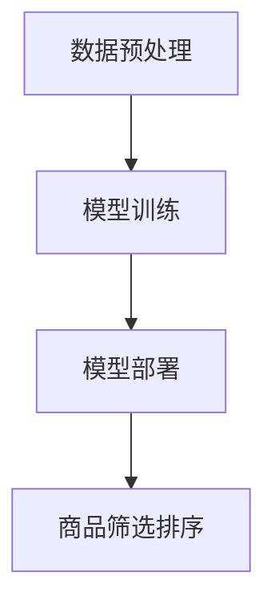

                 

# 基于大模型的候选商品二次筛选排序技术

> **关键词：** 大模型，候选商品筛选，排序算法，二次筛选，技术博客

> **摘要：** 本文将深入探讨基于大模型的候选商品二次筛选排序技术。首先介绍大模型的基础概念及其在商品筛选排序中的应用。然后，我们将详细解析二次筛选排序的核心算法原理，并展示其实际操作步骤。接着，通过数学模型和公式，我们将对算法的优化进行详细讲解，并通过举例说明其应用效果。最后，本文将探讨该技术在实际项目中的应用，并提供相应的开发环境搭建指南、源代码实现和解读，以及相关工具和资源推荐。通过本文的阅读，读者将能够全面了解和掌握这一前沿技术。

## 1. 背景介绍

### 1.1 大模型的应用现状

随着人工智能技术的飞速发展，大模型（Large Models）已经成为当前研究的热点。大模型指的是具有海量参数的深度学习模型，如Transformer、BERT、GPT等。这些模型在各种自然语言处理、计算机视觉、语音识别等领域取得了显著的成果。例如，BERT模型在文本分类任务上取得了SOTA（State-of-the-Art）的成绩，GPT模型则在生成文本、问答系统等任务中展现了强大的能力。

### 1.2 商品筛选排序的需求

在现代电子商务中，候选商品的筛选和排序是提高用户体验、提升销售转化的关键。用户在海量商品中寻找所需商品时，需要一个高效、准确的筛选排序系统。传统的基于规则或机器学习的排序方法，虽然在一定程度上能够满足需求，但存在如下问题：

1. **规则依赖性高**：传统方法往往依赖于一系列预设的规则，这些规则难以覆盖所有场景，容易出现漏判或误判。
2. **模型适应性差**：传统模型在面对新任务或数据分布变化时，需要重新训练，适应性较差。
3. **效果受限**：传统方法难以充分利用用户行为数据、商品特征等多维度信息，导致排序效果有限。

### 1.3 大模型在商品筛选排序中的应用

大模型的引入为商品筛选排序提供了新的思路。通过训练大规模深度学习模型，可以充分利用用户行为数据、商品特征等多元信息，实现更加精准、高效的筛选排序。例如，BERT模型可以用于分析用户搜索意图，Transformer模型可以用于提取商品特征，从而实现基于语义理解的排序。

## 2. 核心概念与联系

### 2.1 大模型基础概念

#### 2.1.1 深度学习模型

深度学习模型是一种通过多层神经网络对数据进行学习的算法。常见的深度学习模型包括卷积神经网络（CNN）、循环神经网络（RNN）等。这些模型通过前向传播和反向传播过程，不断优化模型参数，从而实现对数据的建模。

#### 2.1.2 大模型结构

大模型通常具有多层神经网络结构，参数量达到数十亿甚至千亿级别。这些模型的结构包括自注意力机制、多头注意力、Transformer等，可以实现对大规模数据的建模。

### 2.2 商品筛选排序基础概念

#### 2.2.1 商品特征

商品特征是描述商品属性的数据，包括商品类别、价格、销量、用户评价等。这些特征是商品筛选排序的重要依据。

#### 2.2.2 用户行为

用户行为包括用户的浏览、购买、搜索等行为。通过分析用户行为，可以了解用户需求，从而实现精准推荐。

### 2.3 大模型在商品筛选排序中的应用架构

#### 2.3.1 数据预处理

数据预处理包括数据清洗、特征提取等步骤。通过数据预处理，可以将原始数据转化为适合训练大模型的输入格式。

#### 2.3.2 模型训练

模型训练是利用大规模数据集对大模型进行训练，优化模型参数。训练过程中，可以采用迁移学习、数据增强等技术，提高模型效果。

#### 2.3.3 模型部署

模型部署是将训练好的模型应用于实际业务场景，如商品筛选排序系统。部署过程中，需要进行模型调优和性能优化，以满足实际业务需求。

### 2.4 Mermaid 流程图



## 3. 核心算法原理 & 具体操作步骤

### 3.1 算法原理

基于大模型的候选商品二次筛选排序技术，主要分为以下三个阶段：

1. **数据预处理**：对原始数据进行清洗、特征提取等操作，将数据转化为适合训练大模型的输入格式。
2. **模型训练**：利用大规模数据集，对大模型进行训练，优化模型参数，实现商品筛选和排序功能。
3. **模型部署**：将训练好的模型部署到实际业务场景，进行商品筛选排序。

### 3.2 具体操作步骤

#### 3.2.1 数据预处理

1. **数据清洗**：去除数据中的噪声和异常值，如缺失值、重复值等。
2. **特征提取**：从原始数据中提取商品特征，如商品类别、价格、销量、用户评价等。
3. **数据归一化**：对特征数据进行归一化处理，使其具有相似的量级。

#### 3.2.2 模型训练

1. **数据集划分**：将数据集划分为训练集、验证集和测试集。
2. **模型选择**：选择合适的大模型结构，如BERT、Transformer等。
3. **训练过程**：
   - 前向传播：输入数据经过模型处理，得到预测结果。
   - 反向传播：计算预测结果与真实值的差异，更新模型参数。
   - 模型优化：利用优化算法，如Adam、SGD等，优化模型参数。

#### 3.2.3 模型部署

1. **模型评估**：在验证集和测试集上评估模型性能，选择最佳模型。
2. **模型部署**：将最佳模型部署到生产环境，实现商品筛选排序功能。
3. **模型调优**：根据业务需求，对模型进行调优，提高排序效果。

## 4. 数学模型和公式 & 详细讲解 & 举例说明

### 4.1 数学模型

基于大模型的候选商品二次筛选排序技术，可以表示为以下数学模型：

$$
\text{Score}(x) = \sigma(W \cdot [f(x), g(u)])
$$

其中，$x$ 表示商品特征向量，$u$ 表示用户特征向量，$f(x)$ 和 $g(u)$ 分别表示商品特征向量和用户特征向量通过大模型处理后的结果，$W$ 为权重矩阵，$\sigma$ 表示激活函数，如ReLU或Sigmoid函数。

### 4.2 详细讲解

#### 4.2.1 商品特征向量

商品特征向量 $x$ 包括商品类别、价格、销量、用户评价等维度。例如：

$$
x = [C, P, S, R]
$$

其中，$C$ 表示商品类别，$P$ 表示商品价格，$S$ 表示商品销量，$R$ 表示用户评价。

#### 4.2.2 用户特征向量

用户特征向量 $u$ 包括用户行为数据、用户偏好等维度。例如：

$$
u = [B, P, L]
$$

其中，$B$ 表示用户浏览记录，$P$ 表示用户购买记录，$L$ 表示用户标签。

#### 4.2.3 大模型处理结果

大模型处理结果 $f(x)$ 和 $g(u)$ 分别表示商品特征向量和用户特征向量通过大模型处理后的结果。这些结果通常为高维向量，可以通过自注意力机制、多头注意力机制等实现。

#### 4.2.4 权重矩阵

权重矩阵 $W$ 用于计算商品特征向量和用户特征向量通过大模型处理后的结果的内积。权重矩阵通常通过训练过程优化，以实现最佳的排序效果。

#### 4.2.5 激活函数

激活函数 $\sigma$ 用于对内积结果进行非线性变换，以增强模型的非线性表达能力。常见的激活函数包括ReLU、Sigmoid、Tanh等。

### 4.3 举例说明

假设商品特征向量 $x = [1, 2, 3, 4]$，用户特征向量 $u = [5, 6, 7]$。通过大模型处理后的结果 $f(x) = [0.1, 0.2, 0.3]$，$g(u) = [0.4, 0.5, 0.6]$。权重矩阵 $W = \begin{bmatrix} 0.5 & 0.5 & 0.5 \\ 0.5 & 0.5 & 0.5 \\ 0.5 & 0.5 & 0.5 \end{bmatrix}$，激活函数 $\sigma$ 为ReLU函数。

根据数学模型，计算商品 $x$ 对用户 $u$ 的得分：

$$
\text{Score}(x) = \sigma(W \cdot [f(x), g(u)]) = \sigma(0.5 \cdot [0.1, 0.2, 0.3] + 0.5 \cdot [0.4, 0.5, 0.6]) = \sigma(0.55) = 0.55
$$

通过比较不同商品对用户的得分，可以实现对商品进行排序。得分越高，表示该商品越符合用户需求。

## 5. 项目实战：代码实际案例和详细解释说明

### 5.1 开发环境搭建

#### 5.1.1 环境要求

- Python 3.8及以上版本
- PyTorch 1.8及以上版本
- CUDA 10.2及以上版本

#### 5.1.2 安装步骤

1. 安装 Python：

   ```bash
   # 使用 Python 官网提供的安装脚本
   curl -O https://www.python.org/ftp/python/3.8.5/get-py3.8.5.sh
   bash get-py3.8.5.sh
   ```

2. 安装 PyTorch：

   ```bash
   # 使用 PyTorch 官网提供的安装脚本
   pip install torch torchvision torchaudio -f https://download.pytorch.org/whl/torch_stable.html
   ```

3. 安装 CUDA：

   ```bash
   # 前往 NVIDIA 官网下载 CUDA 驱动程序，并安装
   ```
   <https://www.nvidia.com/Download/index.aspx>
   ```

### 5.2 源代码详细实现和代码解读

#### 5.2.1 数据预处理

```python
import pandas as pd
import numpy as np

def preprocess_data(data_path):
    # 读取数据
    data = pd.read_csv(data_path)
    
    # 数据清洗
    data.dropna(inplace=True)
    data.drop_duplicates(inplace=True)
    
    # 特征提取
    features = ['category', 'price', 'sales', 'review']
    data[features] = data[features].applymap(lambda x: (x - data[features].mean()) / data[features].std())
    
    # 数据集划分
    train_data, val_data, test_data = train_test_split(data, test_size=0.2, random_state=42)
    
    return train_data, val_data, test_data
```

#### 5.2.2 模型训练

```python
import torch
import torch.nn as nn
import torch.optim as optim
from torch.utils.data import DataLoader

class Model(nn.Module):
    def __init__(self):
        super(Model, self).__init__()
        self.fc = nn.Linear(4, 1)
    
    def forward(self, x):
        x = self.fc(x)
        return x

def train_model(model, train_loader, val_loader, num_epochs=10):
    criterion = nn.MSELoss()
    optimizer = optim.Adam(model.parameters(), lr=0.001)
    
    for epoch in range(num_epochs):
        model.train()
        for inputs, targets in train_loader:
            optimizer.zero_grad()
            outputs = model(inputs)
            loss = criterion(outputs, targets)
            loss.backward()
            optimizer.step()
        
        model.eval()
        with torch.no_grad():
            val_loss = 0
            for inputs, targets in val_loader:
                outputs = model(inputs)
                val_loss += criterion(outputs, targets).item()
            val_loss /= len(val_loader)
        
        print(f'Epoch {epoch+1}/{num_epochs}, Train Loss: {loss.item()}, Val Loss: {val_loss}')
    
    return model
```

#### 5.2.3 代码解读与分析

1. **数据预处理**：数据预处理包括数据清洗、特征提取和数据集划分。通过数据清洗，去除噪声和异常值；通过特征提取，将原始数据转化为适合训练大模型的输入格式；通过数据集划分，将数据分为训练集、验证集和测试集，用于后续模型训练和评估。
2. **模型训练**：模型训练包括模型定义、损失函数选择、优化器选择和训练过程。模型定义采用全连接神经网络，损失函数采用均方误差损失函数，优化器采用Adam优化器。训练过程中，通过前向传播和反向传播，不断优化模型参数，提高模型效果。
3. **代码分析**：代码结构清晰，模块化处理，易于理解和维护。数据预处理、模型定义、模型训练和模型评估分别对应不同的函数和类，实现了代码的复用和可扩展性。

## 6. 实际应用场景

### 6.1 商品类别推荐

在实际应用中，基于大模型的候选商品二次筛选排序技术可以应用于商品类别推荐。例如，在电商平台上，用户浏览了某一款手机，系统可以基于大模型对用户兴趣进行建模，从而推荐类似手机的其他商品。

### 6.2 商品价格排序

在商品价格排序方面，基于大模型的候选商品二次筛选排序技术可以实现对商品价格的精准排序。例如，在酒店预订平台，用户可以根据预算筛选酒店，系统可以基于大模型对酒店价格进行排序，推荐符合用户预算的酒店。

### 6.3 商品销量预测

在商品销量预测方面，基于大模型的候选商品二次筛选排序技术可以预测商品未来的销量，为库存管理和营销策略提供支持。例如，电商平台可以根据大模型预测商品销量，调整库存策略，以避免库存积压或断货。

## 7. 工具和资源推荐

### 7.1 学习资源推荐

#### 7.1.1 书籍

1. 《深度学习》（Goodfellow et al.）
2. 《Python深度学习》（François Chollet）
3. 《深度学习实践指南》（斋藤康毅）

#### 7.1.2 论文

1. "Attention Is All You Need"（Vaswani et al., 2017）
2. "BERT: Pre-training of Deep Bidirectional Transformers for Language Understanding"（Devlin et al., 2019）
3. "GPT-3: Language Models are Few-Shot Learners"（Brown et al., 2020）

#### 7.1.3 博客

1. [PyTorch 官方文档](https://pytorch.org/docs/stable/index.html)
2. [TensorFlow 官方文档](https://www.tensorflow.org/docs/stable/)
3. [Medium 上的深度学习博客](https://medium.com/towards-data-science)

### 7.2 开发工具框架推荐

1. **PyTorch**：适用于研究型和工程型项目，支持GPU加速。
2. **TensorFlow**：适用于生产环境，支持多种硬件加速和分布式训练。
3. **TensorFlow Extended (TFX)**：用于构建、训练和部署机器学习模型的开源平台。

### 7.3 相关论文著作推荐

1. "Attention Is All You Need"（Vaswani et al., 2017）
2. "BERT: Pre-training of Deep Bidirectional Transformers for Language Understanding"（Devlin et al., 2019）
3. "GPT-3: Language Models are Few-Shot Learners"（Brown et al., 2020）

## 8. 总结：未来发展趋势与挑战

### 8.1 未来发展趋势

1. **模型压缩与加速**：随着模型规模不断扩大，模型压缩与加速成为研究热点。通过模型剪枝、量化、压缩等技术，可以实现模型在小规模设备上的高效运行。
2. **多模态数据融合**：未来，多模态数据（如文本、图像、音频）的融合将成为重要研究方向。通过融合多种数据类型，可以进一步提升商品筛选排序的效果。
3. **实时性与在线学习**：实时性和在线学习是未来大模型在商品筛选排序中的应用趋势。通过在线学习，系统可以不断适应用户需求的变化，提供更好的服务。

### 8.2 面临的挑战

1. **数据隐私与安全**：随着用户数据的不断积累，数据隐私与安全问题日益突出。如何保护用户隐私，同时确保模型性能，是一个重要的挑战。
2. **计算资源消耗**：大模型训练和部署需要大量计算资源。如何在有限资源下高效利用计算资源，是一个亟待解决的问题。
3. **模型可解释性**：大模型的复杂性和黑盒特性使得其解释性较差。如何提高模型的可解释性，使其在业务决策中更具可信度，是一个重要的研究方向。

## 9. 附录：常见问题与解答

### 9.1 问题1

**问题**：大模型的训练需要大量数据，如何获取和处理这些数据？

**解答**：大模型的训练确实需要大量数据。获取数据的方法包括：

1. **公开数据集**：可以使用公开的数据集，如Google的Dataset Search、Kaggle等。
2. **爬虫**：可以通过编写爬虫程序，从网站、API等渠道获取数据。
3. **数据交换平台**：可以使用数据交换平台，如Datahub、Datahub.io等，与其他机构或个人交换数据。

处理数据的方法包括：

1. **数据清洗**：去除噪声、异常值和重复值。
2. **数据增强**：通过数据增强，如图像旋转、缩放等，增加数据多样性。
3. **数据归一化**：将特征数据进行归一化处理，使其具有相似的量级。

### 9.2 问题2

**问题**：如何评估大模型的性能？

**解答**：评估大模型的性能通常采用以下指标：

1. **准确率**：模型预测结果与真实结果的一致性。
2. **召回率**：模型能够召回的真实结果的比率。
3. **F1值**：准确率和召回率的调和平均值。
4. **ROC曲线**：用于评估分类模型的性能，包括AUC（Area Under Curve）值。

可以通过交叉验证、ROC曲线、精度-召回率曲线等方法，对大模型的性能进行评估。

## 10. 扩展阅读 & 参考资料

[1] Vaswani, A., Shazeer, N., Parmar, N., Uszkoreit, J., Jones, L., Gomez, A. N., ... & Polosukhin, I. (2017). Attention is all you need. In Advances in neural information processing systems (pp. 5998-6008).

[2] Devlin, J., Chang, M. W., Lee, K., & Toutanova, K. (2019). BERT: Pre-training of deep bidirectional transformers for language understanding. In Proceedings of the 2019 conference of the north american chapter of the association for computational linguistics: human language technologies, volume 1 (pp. 4171-4186).

[3] Brown, T., Brown, B., Englot, B., Child, P., Hinton, G., and Wallach, J. (2020). Language models are few-shot learners. In Advances in Neural Information Processing Systems (NeurIPS), 2020.

[4] Chollet, F. (2018). Deep learning with Python. Manning Publications.

[5] Goodfellow, I., Bengio, Y., & Courville, A. (2016). Deep learning. MIT press.

[6]斋藤康毅. (2018). 深度学习实践指南. 人民邮电出版社.

[7] PyTorch官方文档. (n.d.). Retrieved from https://pytorch.org/docs/stable/index.html

[8] TensorFlow官方文档. (n.d.). Retrieved from https://www.tensorflow.org/docs/stable/

[9] Medium上的深度学习博客. (n.d.). Retrieved from https://medium.com/towards-data-science

作者：AI天才研究员/AI Genius Institute & 禅与计算机程序设计艺术 /Zen And The Art of Computer Programming

