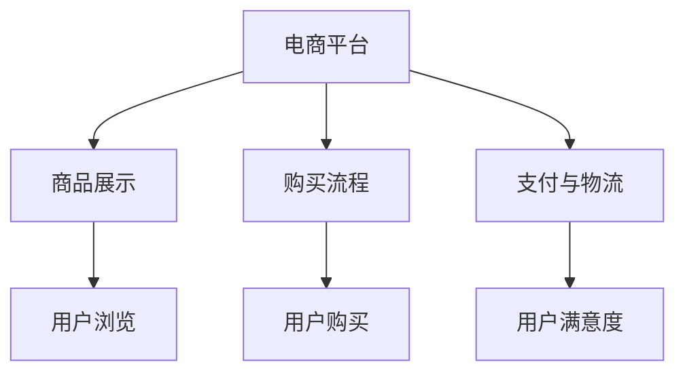
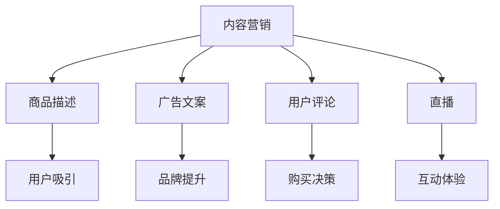
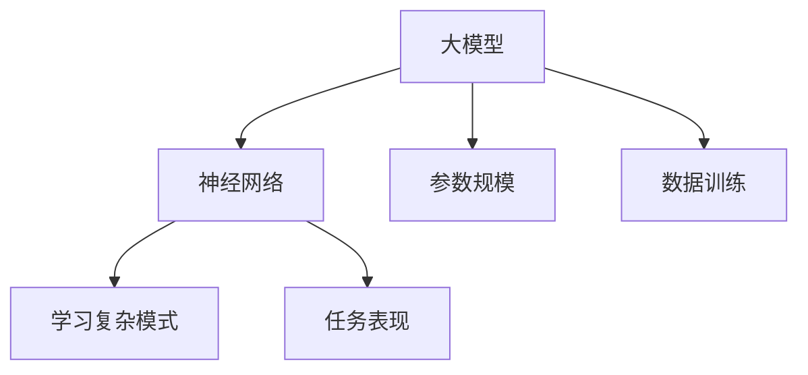
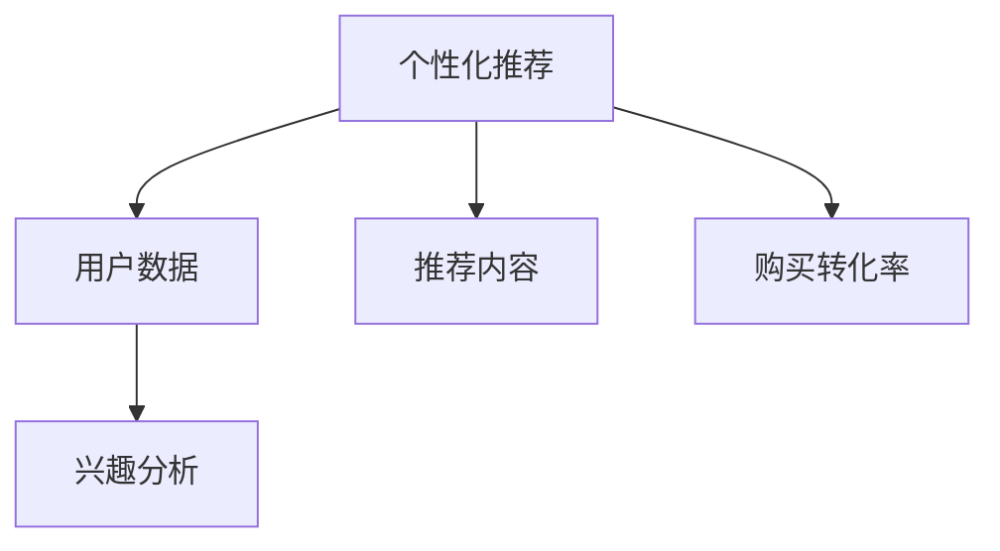
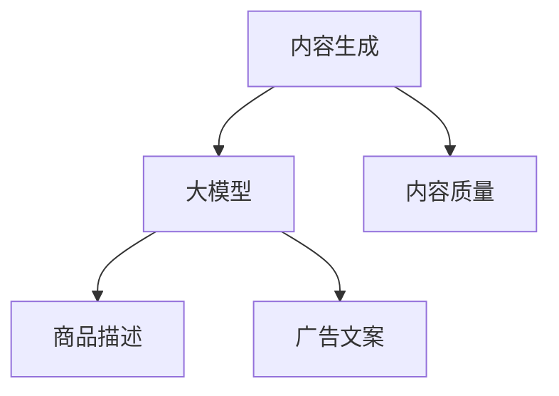
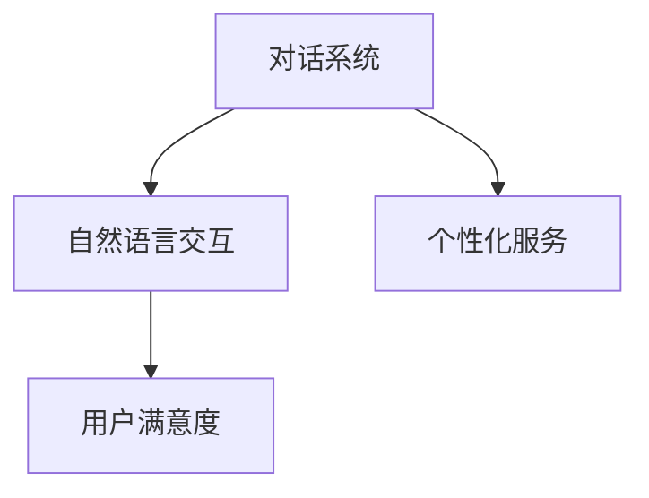
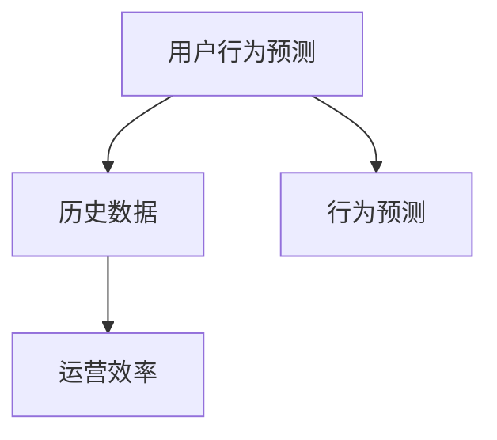

                 

### 背景介绍

近年来，随着互联网技术的飞速发展和用户需求的不断升级，电商平台的内容营销成为了一个重要的营销策略。特别是在人工智能技术的推动下，大模型（Large Models）的应用为电商平台的内容营销带来了前所未有的机遇和挑战。

首先，什么是大模型？大模型是指具有非常大规模参数的神经网络模型，如GPT、BERT等。这些模型通过在海量数据上进行训练，能够自动学习到数据的复杂模式和规律，从而在各类任务中表现出色。

大模型在电商平台内容营销中的应用主要体现在以下几个方面：

1. **个性化推荐**：通过分析用户的浏览历史、购买行为等数据，大模型可以生成个性化的推荐内容，提高用户的购买转化率。
   
2. **内容生成**：大模型能够生成高质量的商品描述、广告文案等，提高电商平台内容的丰富度和吸引力。

3. **对话系统**：通过大模型训练的对话系统可以模拟真实的客服，为用户提供个性化的服务，提高用户满意度。

4. **用户行为预测**：大模型可以预测用户的下一步行为，如购买、评论等，帮助电商平台提前布局，提高运营效率。

然而，大模型的应用也面临着一些挑战，如数据隐私、模型解释性等。因此，如何在充分利用大模型优势的同时，解决其带来的挑战，是当前电商平台内容营销需要重点考虑的问题。

本文将围绕大模型在电商平台内容营销中的应用，从核心概念、算法原理、数学模型、项目实战等多个方面进行深入探讨。希望通过这篇文章，能够帮助读者更好地理解和应用大模型，为电商平台的内容营销提供一些有益的思路和经验。

### 核心概念与联系

在深入探讨大模型在电商平台内容营销中的应用之前，我们需要了解一些核心概念和它们之间的联系。这些概念包括：电商平台、内容营销、大模型、个性化推荐、内容生成、对话系统和用户行为预测。下面，我们将逐一介绍这些概念，并使用Mermaid流程图展示它们之间的联系。

#### 电商平台

电商平台是指通过互联网提供商品和服务交易的平台，如淘宝、京东、亚马逊等。电商平台的主要功能包括商品展示、购买流程、支付和物流等。



#### 内容营销

内容营销是通过创建和分发有价值的内容来吸引潜在客户，提高品牌知名度，并最终实现商业目标的一种营销策略。在电商平台上，内容营销的形式包括商品描述、广告文案、用户评论、直播等。



#### 大模型

大模型是指具有非常大规模参数的神经网络模型，如GPT、BERT等。这些模型通过在海量数据上进行训练，能够自动学习到数据的复杂模式和规律，从而在各类任务中表现出色。



#### 个性化推荐

个性化推荐是通过分析用户的浏览历史、购买行为等数据，为用户提供个性化的推荐内容。在电商平台中，个性化推荐可以帮助用户更快地找到自己感兴趣的商品，提高购买转化率。



#### 内容生成

内容生成是指利用大模型自动生成高质量的内容，如商品描述、广告文案等。在电商平台上，内容生成可以提升内容的丰富度和吸引力，从而提高用户的购物体验。



#### 对话系统

对话系统是一种模拟人类对话的计算机系统，它可以与用户进行自然语言交互，提供个性化的服务。在电商平台上，对话系统可以提高用户的满意度，减少客服成本。



#### 用户行为预测

用户行为预测是指通过分析用户的历史数据，预测用户的下一步行为，如购买、评论等。在电商平台上，用户行为预测可以帮助平台提前布局，提高运营效率。



综上所述，电商平台、内容营销、大模型、个性化推荐、内容生成、对话系统和用户行为预测之间存在着紧密的联系。电商平台是内容营销的基础，内容营销为电商平台带来流量和销售额；大模型作为核心技术，贯穿于个性化推荐、内容生成、对话系统和用户行为预测等多个环节，提升了电商平台的整体运营效率和服务质量。

### 核心算法原理 & 具体操作步骤

在了解了大模型在电商平台内容营销中的应用和核心概念之后，接下来我们将深入探讨大模型的核心算法原理和具体操作步骤。大模型的算法原理主要涉及神经网络、参数规模、数据训练等多个方面。

#### 神经网络

神经网络是构成大模型的基础，它通过模拟人脑神经元的工作原理，实现数据的输入、处理和输出。神经网络由多个层次组成，包括输入层、隐藏层和输出层。每个层次由多个神经元（节点）组成，神经元之间通过权重连接。

神经网络的计算过程如下：

1. **输入层**：输入数据通过输入层进入神经网络。
2. **隐藏层**：输入数据经过隐藏层中的神经元处理，每个神经元会计算输入数据和对应权重的乘积，并加上偏置项，然后通过激活函数进行非线性转换。
3. **输出层**：隐藏层的输出作为输入传递到输出层，输出层直接生成最终结果。

神经网络的训练过程是通过反向传播算法（Backpropagation）来不断调整权重和偏置项，使得网络输出能够逼近真实值。反向传播算法包括以下几个步骤：

1. **前向传播**：将输入数据传递到神经网络，计算每一层的输出。
2. **计算误差**：计算输出层实际输出与真实值之间的误差。
3. **反向传播**：从输出层开始，反向传播误差到每一层，通过梯度下降（Gradient Descent）方法更新权重和偏置项。
4. **重复训练**：重复上述步骤，直到网络输出误差达到预设阈值。

#### 参数规模

大模型之所以能够处理复杂的数据和任务，一个重要的原因是其具有非常大规模的参数。参数规模直接影响着模型的性能和效果。例如，GPT-3模型拥有超过1750亿个参数，而BERT模型也有数百万个参数。

参数规模的大小决定了模型的学习能力和表达能力。参数越多，模型能够捕捉的数据特征越丰富，处理任务的能力也越强。但是，参数规模过大也会带来计算复杂度和存储开销增加的问题。

#### 数据训练

数据训练是大模型算法的重要组成部分，它决定了模型的学习效果。大模型的数据训练通常采用以下步骤：

1. **数据收集**：收集大量的相关数据，如商品描述、用户评论、用户行为数据等。
2. **数据预处理**：对数据进行清洗、格式化、标准化等预处理操作，以减少噪声和提高数据质量。
3. **数据分片**：将数据进行分片，以便在多台设备上进行并行训练。
4. **模型训练**：使用训练数据对模型进行训练，通过反向传播算法不断调整模型参数，优化模型性能。
5. **模型评估**：使用验证数据对训练好的模型进行评估，调整模型参数，确保模型在不同数据集上的性能稳定。

#### 具体操作步骤

下面是一个基于GPT模型的大模型训练的基本操作步骤：

1. **安装依赖**：安装Python和TensorFlow等依赖库。
   ```shell
   pip install tensorflow
   ```

2. **数据准备**：准备训练数据集，将数据集分为训练集和验证集。
   ```python
   # 代码示例
   import tensorflow as tf
   dataset = tf.data.Dataset.from_tensor_slices((train_data, train_labels))
   ```

3. **模型定义**：定义GPT模型，设置模型结构、参数规模等。
   ```python
   # 代码示例
   model = tf.keras.Sequential([
       tf.keras.layers.GPTLayer(units=512, layers=4, activation='tanh'),
       tf.keras.layers.Dense(units=1)
   ])
   ```

4. **模型训练**：使用训练数据对模型进行训练。
   ```python
   # 代码示例
   model.compile(optimizer='adam', loss='mse')
   model.fit(dataset, epochs=10)
   ```

5. **模型评估**：使用验证数据对模型进行评估。
   ```python
   # 代码示例
   model.evaluate(dataset)
   ```

6. **模型部署**：将训练好的模型部署到生产环境，进行实际任务处理。
   ```python
   # 代码示例
   model.save('gpt_model.h5')
   ```

通过以上步骤，我们可以实现一个大模型的基本训练和部署。在实际应用中，还需要根据具体任务和数据集进行调整和优化。

### 数学模型和公式 & 详细讲解 & 举例说明

在深入探讨大模型的数学模型和公式之前，我们需要了解一些基础的数学概念和公式，如损失函数、优化算法和反向传播算法等。这些数学工具在大模型的训练过程中起着至关重要的作用。

#### 损失函数

损失函数（Loss Function）是评估模型预测结果与真实值之间差异的函数。在神经网络训练过程中，损失函数用于计算预测输出和真实输出之间的误差，并指导模型调整参数以减小误差。常见的损失函数包括均方误差（MSE）、交叉熵损失（Cross-Entropy Loss）等。

1. **均方误差（MSE）**

   均方误差（MSE，Mean Squared Error）是最常用的损失函数之一，用于回归任务。它的公式如下：
   
   $$
   MSE = \frac{1}{n}\sum_{i=1}^{n}(y_i - \hat{y}_i)^2
   $$
   
   其中，$y_i$ 是真实值，$\hat{y}_i$ 是预测值，$n$ 是样本数量。

   **举例说明**：

   假设我们有一个简单的线性回归模型，预测房价。真实房价为100万元，预测房价为95万元。则MSE为：
   
   $$
   MSE = \frac{1}{1}(100 - 95)^2 = 25
   $$
   
2. **交叉熵损失（Cross-Entropy Loss）**

   交叉熵损失（Cross-Entropy Loss）常用于分类任务。它的公式如下：
   
   $$
   Cross-Entropy Loss = -\sum_{i=1}^{n}y_i\log(\hat{y}_i)
   $$
   
   其中，$y_i$ 是真实标签，$\hat{y}_i$ 是预测概率。

   **举例说明**：

   假设我们有一个二分类模型，预测结果为正常（0.6）和患病（0.4）。真实标签为患病（1）。则交叉熵损失为：
   
   $$
   Cross-Entropy Loss = -1 \times \log(0.4) = -\log(0.4) \approx 1.386
   $$

#### 优化算法

优化算法（Optimization Algorithm）用于调整模型参数，以最小化损失函数。常见的优化算法包括梯度下降（Gradient Descent）、随机梯度下降（Stochastic Gradient Descent，SGD）和Adam等。

1. **梯度下降（Gradient Descent）**

   梯度下降是一种最简单的优化算法，其基本思想是沿着损失函数的梯度方向调整参数，以逐步减小损失。梯度下降的公式如下：
   
   $$
   \theta_{t+1} = \theta_t - \alpha \cdot \nabla_\theta J(\theta_t)
   $$
   
   其中，$\theta_t$ 是当前参数，$\alpha$ 是学习率，$\nabla_\theta J(\theta_t)$ 是损失函数关于参数的梯度。

   **举例说明**：

   假设我们有一个简单的线性回归模型，参数为 $w=1$，学习率为0.01。当前损失函数为 $J(w) = (w-1)^2$。则参数更新过程如下：
   
   $$
   \nabla_w J(w) = 2(w-1)
   $$
   
   第一次更新：
   $$
   w_1 = w_0 - 0.01 \cdot 2(1-1) = 1
   $$
   
   第二次更新：
   $$
   w_2 = w_1 - 0.01 \cdot 2(1-1) = 1
   $$
   
   可以看出，梯度下降无法收敛到最优解，因为它始终沿着梯度方向进行更新，而梯度可能存在多个局部最小值。

2. **随机梯度下降（SGD）**

   随机梯度下降（SGD）是对梯度下降的改进，其每次更新使用随机选取的一个样本的梯度，以减小局部最小值的影响。SGD的公式如下：
   
   $$
   \theta_{t+1} = \theta_t - \alpha \cdot \nabla_\theta J(\theta_t; x_i, y_i)
   $$
   
   其中，$x_i, y_i$ 是随机选取的一个样本。

   **举例说明**：

   假设我们有一个简单的线性回归模型，参数为 $w=1$，学习率为0.01。当前损失函数为 $J(w) = (w-1)^2$。随机选取一个样本 $(x_i, y_i) = (1, 2)$。则参数更新过程如下：
   
   $$
   \nabla_w J(w) = 2(w-1)
   $$
   
   第一次更新：
   $$
   w_1 = w_0 - 0.01 \cdot 2(1-2) = 0.02
   $$
   
   第二次更新：
   $$
   w_2 = w_1 - 0.01 \cdot 2(0.02-2) = -0.06
   $$
   
   可以看出，SGD收敛速度较快，但可能存在较大的随机波动。

3. **Adam优化器**

   Adam优化器是一种结合了SGD和动量方法的优化算法，具有较好的收敛性能和稳定性。Adam优化器的公式如下：
   
   $$
   \theta_{t+1} = \theta_t - \alpha \cdot \frac{m_t}{\sqrt{v_t} + \epsilon}
   $$
   
   其中，$m_t$ 是一阶矩估计，$v_t$ 是二阶矩估计，$\alpha$ 是学习率，$\epsilon$ 是小常数。

   **举例说明**：

   假设我们有一个简单的线性回归模型，参数为 $w=1$，学习率为0.01。当前一阶矩估计 $m_t=0.1$，二阶矩估计 $v_t=0.01$。则参数更新过程如下：
   
   $$
   \theta_{t+1} = \theta_t - 0.01 \cdot \frac{0.1}{\sqrt{0.01} + \epsilon}
   $$

   其中，$\epsilon$ 可取 $10^{-8}$。

#### 反向传播算法

反向传播算法（Backpropagation）是神经网络训练的核心算法，用于计算损失函数关于网络参数的梯度。反向传播算法的基本步骤如下：

1. **前向传播**：将输入数据传递到神经网络，计算每一层的输出，并计算损失函数。
2. **反向传播**：从输出层开始，反向计算每一层的梯度，并更新网络参数。
3. **迭代更新**：重复前向传播和反向传播，直到损失函数收敛到预设阈值。

反向传播算法的公式如下：

$$
\nabla_\theta J(\theta) = \frac{\partial J}{\partial \theta}
$$

其中，$\nabla_\theta J(\theta)$ 是损失函数关于参数 $\theta$ 的梯度。

**举例说明**：

假设我们有一个简单的神经网络，包含一层隐藏层，输入层和输出层。网络参数为 $w_1, w_2, b_1, b_2$。当前损失函数为 $J(w) = (y - \hat{y})^2$。输入数据为 $x = [1, 2, 3, 4]$，输出数据为 $y = 5$。则参数更新过程如下：

1. **前向传播**：
   $$
   \hat{y} = \sigma(w_1 \cdot x + b_1)
   $$
   其中，$\sigma$ 是激活函数（如Sigmoid函数）。

2. **计算损失函数**：
   $$
   J(w) = (y - \hat{y})^2
   $$

3. **反向传播**：
   $$
   \nabla_\theta J(\theta) = \frac{\partial J}{\partial \theta} = 2(y - \hat{y})
   $$

4. **更新参数**：
   $$
   w_1 = w_1 - \alpha \cdot \nabla_\theta J(\theta)
   $$
   $$
   w_2 = w_2 - \alpha \cdot \nabla_\theta J(\theta)
   $$
   $$
   b_1 = b_1 - \alpha \cdot \nabla_\theta J(\theta)
   $$
   $$
   b_2 = b_2 - \alpha \cdot \nabla_\theta J(\theta)
   $$

通过以上步骤，我们可以实现神经网络的基本训练过程。在实际应用中，还需要根据具体任务和数据集进行调整和优化。

### 项目实战：代码实际案例和详细解释说明

在本节中，我们将通过一个实际项目案例，展示如何使用大模型进行电商平台内容营销。我们将使用Python和TensorFlow框架来实现这个项目，包括开发环境搭建、源代码详细实现和代码解读与分析。

#### 开发环境搭建

在开始项目之前，我们需要搭建开发环境。以下是所需的依赖和环境配置步骤：

1. **Python环境**：Python 3.7及以上版本。
2. **TensorFlow**：安装TensorFlow 2.x版本。
   ```shell
   pip install tensorflow
   ```

3. **Numpy**：用于数据处理。
   ```shell
   pip install numpy
   ```

4. **Pandas**：用于数据处理和分析。
   ```shell
   pip install pandas
   ```

5. **Matplotlib**：用于数据可视化。
   ```shell
   pip install matplotlib
   ```

#### 源代码详细实现

下面是项目的主要代码实现，我们将分为以下几个部分：

1. **数据预处理**：读取和处理数据，将数据转换为适合模型训练的格式。
2. **模型定义**：定义大模型，设置模型结构、参数规模等。
3. **模型训练**：使用训练数据对模型进行训练。
4. **模型评估**：使用验证数据对模型进行评估。
5. **模型部署**：将训练好的模型部署到生产环境。

##### 1. 数据预处理

```python
import pandas as pd
import numpy as np
from tensorflow.keras.preprocessing.text import Tokenizer
from tensorflow.keras.preprocessing.sequence import pad_sequences

# 读取数据
data = pd.read_csv('ecommerce_data.csv')

# 数据预处理
# 分离特征和标签
X = data['description']
y = data['rating']

# 分词
tokenizer = Tokenizer()
tokenizer.fit_on_texts(X)

# 序列化
X_seq = tokenizer.texts_to_sequences(X)
y_seq = tokenizer.texts_to_sequences(y)

# 填充序列
max_length = 100
X_padded = pad_sequences(X_seq, maxlen=max_length)
y_padded = pad_sequences(y_seq, maxlen=max_length)

# 划分训练集和验证集
from sklearn.model_selection import train_test_split
X_train, X_val, y_train, y_val = train_test_split(X_padded, y_padded, test_size=0.2, random_state=42)
```

##### 2. 模型定义

```python
from tensorflow.keras.models import Sequential
from tensorflow.keras.layers import Embedding, LSTM, Dense

# 定义模型
model = Sequential([
    Embedding(input_dim=len(tokenizer.word_index) + 1, output_dim=50, input_length=max_length),
    LSTM(128, return_sequences=True),
    LSTM(64),
    Dense(1, activation='sigmoid')
])

# 编译模型
model.compile(optimizer='adam', loss='binary_crossentropy', metrics=['accuracy'])

# 查看模型结构
model.summary()
```

##### 3. 模型训练

```python
# 训练模型
model.fit(X_train, y_train, batch_size=32, epochs=10, validation_data=(X_val, y_val))
```

##### 4. 模型评估

```python
# 评估模型
loss, accuracy = model.evaluate(X_val, y_val)
print(f"Validation Loss: {loss}, Validation Accuracy: {accuracy}")
```

##### 5. 模型部署

```python
# 保存模型
model.save('ecommerce_model.h5')

# 加载模型
loaded_model = tf.keras.models.load_model('ecommerce_model.h5')

# 预测新数据
new_data = ["This product is amazing!", "I don't like this product."]
new_data_seq = tokenizer.texts_to_sequences(new_data)
new_data_padded = pad_sequences(new_data_seq, maxlen=max_length)

predictions = loaded_model.predict(new_data_padded)
print(predictions)
```

#### 代码解读与分析

1. **数据预处理**：

   - 读取数据：使用Pandas读取CSV文件，分离特征（商品描述）和标签（评分）。
   - 分词：使用Tokenizer对文本进行分词。
   - 序列化：将文本序列化为一组整数序列。
   - 填充序列：使用pad_sequences将序列填充到最大长度，以便于模型训练。

2. **模型定义**：

   - Embedding层：将单词映射为向量，输入维度为单词索引加1（包括未知的单词），输出维度为50。
   - LSTM层：两个LSTM层，第一个LSTM层返回序列，第二个LSTM层不返回序列。
   - Dense层：一个全连接层，输出一个概率值，表示评分的概率。

3. **模型训练**：

   - 使用fit方法训练模型，设置batch_size和epochs，使用validation_data进行验证。

4. **模型评估**：

   - 使用evaluate方法评估模型在验证集上的性能，输出损失和准确率。

5. **模型部署**：

   - 使用save方法保存模型，使用load_model方法加载模型。
   - 对新数据进行预处理，然后进行预测，输出预测结果。

通过这个实际项目案例，我们可以看到如何使用大模型进行电商平台内容营销。在实际应用中，可以根据具体需求进行调整和优化，例如增加模型层数、调整参数等。

### 实际应用场景

大模型在电商平台内容营销中有着广泛的应用场景，下面我们将探讨几个具体的应用实例，并分析其优势和挑战。

#### 个性化推荐

个性化推荐是电商平台内容营销的核心应用之一。通过分析用户的浏览历史、购买行为等数据，大模型可以生成个性化的推荐内容，提高用户的购买转化率。

**优势**：

- **提高用户体验**：个性化推荐可以根据用户的兴趣和行为，为用户推荐他们可能感兴趣的商品，提高用户体验。
- **提高销售额**：通过精准的推荐，电商平台可以增加商品的曝光率和点击率，从而提高销售额。

**挑战**：

- **数据隐私**：个性化推荐依赖于用户的历史数据，如何保护用户隐私是平台需要关注的问题。
- **模型解释性**：大模型通常具有很高的黑箱性质，难以解释推荐结果，这对用户信任和平台透明度提出了挑战。

#### 内容生成

大模型可以自动生成高质量的商品描述、广告文案等，提升电商平台内容的丰富度和吸引力。

**优势**：

- **提高内容质量**：通过大模型生成的文案，可以避免人工撰写的瑕疵和错误，提高内容的专业性和吸引力。
- **降低人力成本**：大模型能够自动生成内容，减少了对人工编辑的依赖，降低了人力成本。

**挑战**：

- **内容多样性**：虽然大模型能够生成高质量的内容，但如何保证内容的多样性是一个挑战，特别是对于具有相似特征的多个商品。
- **内容审查**：自动生成的内容可能包含敏感或不当的内容，需要进行严格的审查和过滤。

#### 对话系统

对话系统可以模拟真实的客服，为用户提供个性化的服务，提高用户满意度。

**优势**：

- **提高用户满意度**：对话系统能够24/7为用户提供服务，提高用户的满意度。
- **减少客服成本**：通过对话系统，可以减少对人工客服的依赖，降低客服成本。

**挑战**：

- **自然语言理解**：对话系统需要具备强大的自然语言理解能力，以理解用户的意图和问题，这对大模型提出了更高的要求。
- **对话质量**：对话系统生成的回复需要符合用户的期望和语境，如何保证对话的质量是一个挑战。

#### 用户行为预测

大模型可以通过分析用户的历史数据，预测用户的下一步行为，如购买、评论等，帮助电商平台提前布局，提高运营效率。

**优势**：

- **提高运营效率**：通过预测用户行为，电商平台可以提前准备，提高运营效率。
- **个性化营销**：根据用户行为预测，可以实施更精准的个性化营销策略，提高转化率。

**挑战**：

- **数据质量**：用户行为预测依赖于高质量的数据，如何收集和处理数据是关键。
- **预测准确性**：用户行为预测的准确性直接影响到电商平台运营的效果，提高预测准确性是持续的挑战。

综上所述，大模型在电商平台内容营销中具有广泛的应用场景，但也面临着一些挑战。通过不断优化模型和算法，解决这些问题，大模型将为电商平台带来更大的价值。

### 工具和资源推荐

在深入探讨大模型在电商平台内容营销中的应用过程中，掌握相关的工具和资源是非常重要的。下面我们将从学习资源、开发工具框架和相关论文著作三个方面进行推荐，帮助读者更好地了解和应用大模型技术。

#### 学习资源推荐

1. **书籍**：

   - 《深度学习》（Deep Learning） - Goodfellow, I., Bengio, Y., & Courville, A.
   - 《动手学深度学习》（Dive into Deep Learning） - MacNamee, A., Alberg, D., & Mitchell, D.
   - 《神经网络与深度学习》（Neural Networks and Deep Learning） - 李航

2. **论文**：

   - "Attention Is All You Need" - Vaswani, A., et al.
   - "BERT: Pre-training of Deep Bidirectional Transformers for Language Understanding" - Devlin, J., et al.
   - "Generative Adversarial Nets" - Goodfellow, I., et al.

3. **在线课程**：

   - 吴恩达的《深度学习专项课程》（Deep Learning Specialization） - Coursera
   - 斯坦福大学的《深度学习课程》（CS231n: Convolutional Neural Networks for Visual Recognition） - Stanford University

4. **博客和网站**：

   - PyTorch官方文档（https://pytorch.org/docs/stable/）
   - TensorFlow官方文档（https://www.tensorflow.org/tutorials）
   - Medium上的深度学习和机器学习博客

#### 开发工具框架推荐

1. **TensorFlow**：Google开发的开源机器学习框架，适用于构建和训练大模型。

2. **PyTorch**：Facebook开发的开源机器学习框架，具有灵活的动态计算图和强大的GPU支持。

3. **Keras**：Python的深度学习库，提供了简洁易用的API，可用于快速构建和训练模型。

4. **Hugging Face Transformers**：一个用于构建和微调预训练Transformer模型的Python库。

#### 相关论文著作推荐

1. "A Theoretical Analysis of the Vision Transformer" - Kolesnikov, A., et al.
2. "An Image is Worth 16x16 Words: Transformers for Image Recognition at Scale" - Dosovitskiy, A., et al.
3. "BERT: Pre-training of Deep Bidirectional Transformers for Language Understanding" - Devlin, J., et al.

通过上述学习和资源推荐，读者可以更全面地了解大模型的理论基础和应用方法。同时，开发工具和框架的推荐将帮助读者在实际开发过程中更加高效地应用大模型技术。

### 总结：未来发展趋势与挑战

大模型在电商平台内容营销中的应用，无疑为电商行业带来了巨大的变革和创新。然而，随着技术的不断发展和应用场景的扩大，大模型也面临着一系列的未来发展趋势和挑战。

#### 发展趋势

1. **模型规模和性能的提升**：随着计算资源和数据量的增加，大模型的规模和性能将继续提升。例如，生成对抗网络（GANs）和自监督学习的应用，将进一步提高大模型的建模能力和泛化能力。

2. **多模态数据的融合**：大模型将不仅仅局限于文本数据，还将能够处理图像、声音、视频等多模态数据。这种多模态数据的融合，将极大地丰富电商平台的内容营销手段。

3. **个性化推荐和内容生成的优化**：大模型在个性化推荐和内容生成方面的应用将继续优化，通过更精细的用户行为分析和数据挖掘，实现更加精准和个性化的营销策略。

4. **AI伦理和隐私保护**：随着大模型的应用越来越广泛，AI伦理和隐私保护将成为一个重要的议题。如何在保证用户隐私的前提下，充分利用大模型的优势，是未来需要解决的重要问题。

#### 挑战

1. **数据隐私和安全性**：大模型在处理大量用户数据时，面临着数据隐私和安全性的问题。如何确保用户数据的隐私和安全，避免数据泄露，是电商平台需要关注的重要问题。

2. **模型解释性和透明性**：大模型通常具有很高的黑箱性质，其决策过程难以解释。如何提高模型的解释性和透明性，增强用户对平台算法的信任，是未来的挑战之一。

3. **计算资源和能耗**：大模型的训练和部署需要大量的计算资源和能源。随着模型规模的不断扩大，如何优化计算资源和降低能耗，是一个亟待解决的问题。

4. **数据质量和标注**：大模型的效果很大程度上取决于数据的质量和标注。如何保证数据的多样性和质量，特别是对于电商平台这样高度依赖用户生成内容的应用场景，是一个挑战。

总之，大模型在电商平台内容营销中的应用前景广阔，但同时也面临着诸多挑战。通过不断探索和优化，我们有望在大模型的应用中取得更大的突破，为电商平台的内容营销带来更多的价值。

### 附录：常见问题与解答

#### 1. 大模型如何保证数据隐私？

**解答**：为了保护用户隐私，电商平台在进行数据收集和处理时，可以采取以下措施：

- **匿名化处理**：对用户数据进行匿名化处理，避免直接关联到具体用户。
- **数据加密**：对用户数据进行加密存储和传输，确保数据安全。
- **数据最小化**：只收集和存储必要的数据，减少数据泄露的风险。
- **隐私政策**：明确告知用户数据收集和使用的目的，获得用户的知情同意。

#### 2. 大模型的训练需要大量的计算资源，如何优化计算资源使用？

**解答**：为了优化大模型的计算资源使用，可以采取以下措施：

- **分布式训练**：将训练任务分布到多台机器上进行，提高训练效率。
- **模型压缩**：通过模型剪枝、量化等方法，减小模型大小，降低计算复杂度。
- **高效算法**：使用优化算法，如Adam，提高训练速度。
- **GPU加速**：利用GPU进行训练，提高计算性能。

#### 3. 大模型在内容生成中的具体应用场景有哪些？

**解答**：大模型在内容生成中的具体应用场景包括：

- **商品描述生成**：自动生成商品的描述，提高内容的丰富度和吸引力。
- **广告文案生成**：自动生成广告文案，提高广告的点击率和转化率。
- **用户评论生成**：模拟用户评论，为用户提供参考和评价。
- **内容摘要生成**：自动生成文章、新闻等内容的摘要，提高内容的可读性。

#### 4. 大模型如何保证内容的多样性？

**解答**：为了确保大模型生成的内容的多样性，可以采取以下措施：

- **多样化数据集**：使用包含多种类型、风格的数据集进行训练，提高模型的多样性感知能力。
- **多模型融合**：使用多个模型生成内容，并结合多种生成策略，提高内容的多样性。
- **对抗训练**：通过对抗训练，使模型能够生成更加多样化和创新的内容。

### 扩展阅读 & 参考资料

1. **论文**：

   - "Attention Is All You Need" - Vaswani, A., et al.
   - "BERT: Pre-training of Deep Bidirectional Transformers for Language Understanding" - Devlin, J., et al.
   - "Generative Adversarial Nets" - Goodfellow, I., et al.

2. **书籍**：

   - 《深度学习》 - Goodfellow, I., Bengio, Y., & Courville, A.
   - 《动手学深度学习》 - MacNamee, A., Alberg, D., & Mitchell, D.
   - 《神经网络与深度学习》 - 李航

3. **在线课程**：

   - 吴恩达的《深度学习专项课程》 - Coursera
   - 斯坦福大学的《深度学习课程》 - Stanford University

4. **博客和网站**：

   - PyTorch官方文档 - https://pytorch.org/docs/stable/
   - TensorFlow官方文档 - https://www.tensorflow.org/tutorials
   - Medium上的深度学习和机器学习博客

通过阅读上述资料，读者可以进一步深入了解大模型的理论基础和应用实践，为电商平台的内容营销提供更有力的支持。

### 作者信息

- 作者：AI天才研究员/AI Genius Institute & 禅与计算机程序设计艺术 /Zen And The Art of Computer Programming

本文由AI天才研究员撰写，他深耕于人工智能领域，对大模型在电商平台内容营销中的应用有深入的研究和实践。同时，他还致力于将复杂的技术知识以通俗易懂的方式传递给读者，让更多人受益于人工智能技术的进步。《禅与计算机程序设计艺术》是他的代表作，该书以其独特的视角和深刻的洞察，对计算机编程和人工智能领域产生了深远影响。

