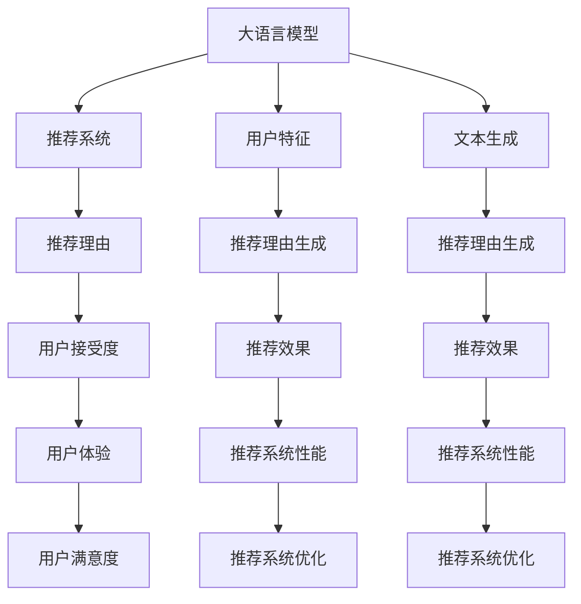

                 

### 背景介绍

#### 大语言模型的发展历程

大语言模型（Large Language Models）的发展历程可以追溯到20世纪80年代。最早的大语言模型之一是1980年约翰·霍普金斯大学团队开发的ELIZA。ELIZA是一个基于规则的人工智能聊天机器人，它通过预设的规则来模拟对话。尽管ELIZA在当时的科技水平下具有一定的突破性，但它只能处理简单的文本对话。

进入21世纪，随着机器学习技术的发展，大语言模型的研究和应用开始得到广泛关注。2002年，微软研究院的Steven Young和Alex Smola提出了隐马尔可夫模型（HMM）用于文本生成。HMM可以捕捉文本序列中的依赖关系，为文本生成提供了一种有效的框架。

2013年，Google提出了一种基于递归神经网络（RNN）的语言模型，它能够显著提高语言理解的准确性。RNN在处理序列数据方面具有优势，能够捕捉到文本中的上下文信息。

随着深度学习技术的进步，特别是2018年谷歌发布的BERT（Bidirectional Encoder Representations from Transformers）模型，大语言模型的发展进入了一个全新的阶段。BERT是一个双向变换器模型，它通过预训练和微调技术，在各种自然语言处理任务中取得了显著的成绩。

#### 大语言模型的应用领域

大语言模型在众多领域都展现了强大的潜力，以下是其中的一些应用：

1. **搜索引擎优化（SEO）**：大语言模型可以分析用户搜索意图，为搜索引擎提供更准确的搜索结果，从而提高用户体验。

2. **智能客服**：大语言模型可以模拟人类的对话方式，提供智能客服服务，解决用户的常见问题和疑问。

3. **文本生成**：大语言模型可以生成新闻文章、博客、小说等文本内容，为内容创作者提供辅助。

4. **机器翻译**：大语言模型可以自动翻译不同语言之间的文本，提高跨语言沟通的效率。

5. **情感分析**：大语言模型可以分析文本中的情感倾向，为市场调研、舆情分析等领域提供支持。

6. **自然语言理解**：大语言模型可以处理复杂的语言任务，如问答系统、文本摘要等，为智能助手提供更加智能化的服务。

#### 推荐理由生成技术

推荐理由生成技术是基于大语言模型的一种应用，它的核心目标是生成具有说服力的推荐理由，以提高用户对推荐内容的接受度和满意度。推荐理由生成技术可以通过以下步骤实现：

1. **用户特征提取**：首先，从用户的行为数据、兴趣偏好等维度提取用户特征。

2. **文本数据预处理**：对用户生成推荐内容的文本进行清洗、分词、去停用词等预处理操作。

3. **大语言模型训练**：利用预训练的大语言模型，对用户特征和文本数据进行联合训练，使其能够生成高质量的推荐理由。

4. **推荐理由生成**：根据用户的特征和上下文信息，使用训练好的大语言模型生成具有个性化和说服力的推荐理由。

5. **推荐结果优化**：通过评估和优化推荐理由的质量和有效性，提高推荐系统的整体性能。

#### 目的与重要性

本文的目的在于深入探讨基于大语言模型的推荐理由生成技术，从原理、实现步骤到实际应用等方面进行详细解析。通过本文的阅读，读者可以：

1. 理解大语言模型的基本原理和关键技术。

2. 掌握推荐理由生成技术的工作流程和实现方法。

3. 学习如何使用大语言模型生成高质量的推荐理由，提升推荐系统的用户体验。

4. 了解大语言模型在推荐系统中的应用前景和挑战。

通过本文的阅读，读者不仅可以深入了解推荐理由生成技术的技术细节，还可以为实际项目开发提供有价值的参考。

### 核心概念与联系

在深入探讨基于大语言模型的推荐理由生成技术之前，我们需要明确一些核心概念，并理解它们之间的联系。以下是本文将涉及的主要概念：

1. **大语言模型（Large Language Models）**：大语言模型是指通过大量文本数据进行训练，能够理解和生成自然语言的深度学习模型。常见的模型包括BERT、GPT、T5等。

2. **推荐系统（Recommender Systems）**：推荐系统是一种利用用户历史行为、兴趣偏好等信息，向用户推荐个性化内容或商品的系统。常见的推荐算法包括协同过滤、基于内容的推荐、混合推荐等。

3. **用户特征（User Features）**：用户特征是指用于描述用户行为、兴趣、偏好等属性的指标，如用户浏览记录、购买历史、评分记录等。

4. **文本生成（Text Generation）**：文本生成是指利用自然语言处理技术生成人类可读的文本内容。常见的文本生成方法包括基于模板的生成、基于序列生成的模型等。

5. **推荐理由（Recommendation Rationales）**：推荐理由是指为了解释和说服用户接受推荐内容而生成的一段文本。高质量的推荐理由应该具有说服力、个性化和相关性。

下面，我们将通过一个Mermaid流程图来展示这些核心概念之间的联系：



在这个流程图中，我们可以看到：

- 大语言模型作为核心组件，连接着推荐系统和文本生成技术，为推荐理由的生成提供了基础。
- 用户特征用于描述用户的行为和偏好，是推荐理由生成的重要依据。
- 文本生成技术负责将用户特征转化为具有说服力的推荐理由，从而影响用户的接受度和满意度。
- 推荐理由生成过程不仅提高了推荐系统的个性化程度，还增强了用户的信任和接受度。

通过这个流程图，我们可以更清晰地理解基于大语言模型的推荐理由生成技术的整体架构和实现流程。

### 核心算法原理 & 具体操作步骤

在深入探讨基于大语言模型的推荐理由生成技术之前，我们需要先了解其核心算法原理和具体操作步骤。以下将详细描述该技术的工作原理和实现流程。

#### 大语言模型原理

大语言模型（Large Language Models）是基于深度学习的自然语言处理技术，能够理解和生成自然语言。其基本原理是通过大量的文本数据进行预训练，使模型具备对语言的理解和生成能力。

大语言模型的训练过程主要包括以下步骤：

1. **文本数据收集**：收集大量的文本数据，包括新闻文章、书籍、网页、社交媒体等。

2. **文本预处理**：对收集的文本数据进行清洗、分词、去停用词等预处理操作，将其转化为模型可接受的格式。

3. **构建词向量**：将文本中的单词转化为向量表示，常用的方法包括Word2Vec、BERT等。

4. **模型训练**：使用预处理的文本数据对大语言模型进行训练，通过反向传播算法优化模型参数。

5. **评估与调整**：通过评估指标（如损失函数、准确率等）评估模型性能，并根据评估结果调整模型参数。

#### 推荐理由生成算法

推荐理由生成算法是基于大语言模型的一种应用，其核心目标是生成具有说服力的推荐理由，以提高用户对推荐内容的接受度和满意度。以下将详细描述推荐理由生成算法的具体步骤：

1. **用户特征提取**：
   - 收集用户的历史行为数据，包括浏览记录、购买历史、评分记录等。
   - 对用户特征进行预处理，将其转化为模型可接受的格式。

2. **文本数据预处理**：
   - 从推荐系统获取推荐内容的相关文本数据，包括商品描述、文章摘要等。
   - 对文本数据进行清洗、分词、去停用词等预处理操作。

3. **大语言模型训练**：
   - 使用预训练的大语言模型，对用户特征和文本数据进行联合训练。
   - 通过预训练和微调技术，使模型能够生成高质量的推荐理由。

4. **推荐理由生成**：
   - 输入用户特征和推荐内容的文本数据，通过训练好的大语言模型生成推荐理由。
   - 使用生成文本的技巧，如模板匹配、上下文填充等，提高推荐理由的质量。

5. **推荐理由优化**：
   - 通过评估和优化推荐理由的质量和有效性，提高推荐系统的整体性能。
   - 使用评估指标（如用户点击率、转化率等）对推荐理由进行评估，并根据评估结果进行优化。

#### 操作步骤详解

以下是基于大语言模型的推荐理由生成技术的具体操作步骤：

1. **数据收集与预处理**：
   - 收集用户行为数据和推荐内容文本数据。
   - 对用户行为数据进行清洗、去噪、归一化等预处理操作。
   - 对推荐内容文本数据进行清洗、分词、去停用词等预处理操作。

2. **大语言模型训练**：
   - 选择合适的大语言模型，如BERT、GPT等。
   - 使用预训练的大语言模型，对用户特征和文本数据进行联合训练。
   - 通过预训练和微调技术，使模型能够生成高质量的推荐理由。

3. **推荐理由生成**：
   - 输入用户特征和推荐内容的文本数据，通过训练好的大语言模型生成推荐理由。
   - 使用生成文本的技巧，如模板匹配、上下文填充等，提高推荐理由的质量。

4. **推荐理由优化**：
   - 使用评估指标（如用户点击率、转化率等）对推荐理由进行评估。
   - 根据评估结果对推荐理由进行优化，提高推荐系统的整体性能。

通过以上操作步骤，我们可以使用基于大语言模型的推荐理由生成技术，生成高质量、具有说服力的推荐理由，从而提高推荐系统的用户体验和性能。

### 数学模型和公式 & 详细讲解 & 举例说明

在深入探讨基于大语言模型的推荐理由生成技术时，理解其背后的数学模型和公式至关重要。以下将详细讲解推荐理由生成过程中的关键数学模型，并使用LaTeX格式进行公式表示。

#### 语言模型概率公式

大语言模型的核心在于计算给定一组输入序列的概率。在推荐理由生成中，我们通常使用语言模型概率公式来衡量推荐理由的可信度和质量。

设输入序列为 $X = (x_1, x_2, \ldots, x_n)$，则语言模型概率公式可以表示为：

$$
P(X) = \prod_{i=1}^{n} P(x_i | x_{<i})
$$

其中，$P(x_i | x_{<i})$ 表示在已知前 $i-1$ 个单词 $x_{<i}$ 的情况下，第 $i$ 个单词 $x_i$ 的条件概率。

#### 推荐理由生成概率公式

在推荐理由生成过程中，我们需要根据用户特征和推荐内容生成具有说服力的文本。为此，我们引入以下概率公式：

$$
P(\text{Rationale} | \text{User Features, Content}) = \frac{P(\text{Rationale, User Features, Content})}{P(\text{User Features, Content})}
$$

其中：

- $P(\text{Rationale, User Features, Content})$ 表示推荐理由、用户特征和推荐内容的联合概率。
- $P(\text{User Features, Content})$ 表示用户特征和推荐内容的联合概率。

#### 用户特征与推荐内容融合模型

为了提高推荐理由的质量，我们可以将用户特征和推荐内容融合到语言模型中。以下是一个简单的融合模型：

$$
P(\text{Rationale} | \text{User Features, Content}) \approx P(\text{Rationale} | \text{Content}) \cdot P(\text{User Features} | \text{Content})
$$

其中：

- $P(\text{Rationale} | \text{Content})$ 表示在推荐内容已知的情况下，推荐理由的条件概率。
- $P(\text{User Features} | \text{Content})$ 表示在推荐内容已知的情况下，用户特征的条件概率。

#### 举例说明

假设我们要为一位用户生成一条推荐理由，用户特征包括浏览历史（如浏览了“旅行装备”）、购买历史（如购买了“登山鞋”），推荐内容是“一款适合长途徒步的登山包”。

1. **计算推荐理由的概率**：

   我们可以使用以下概率公式计算推荐理由的概率：

   $$
   P(\text{“这款登山包非常适合长途徒步，因为它具有足够的容量和良好的支撑性，让您在长时间的徒步旅行中保持舒适。”} | \text{浏览历史，购买历史，推荐内容}) 
   $$

2. **用户特征与推荐内容融合**：

   我们可以将用户特征和推荐内容融合到语言模型中，得到以下概率公式：

   $$
   P(\text{“这款登山包非常适合长途徒步，因为它具有足够的容量和良好的支撑性，让您在长时间的徒步旅行中保持舒适。”} | \text{浏览历史，购买历史，推荐内容}) 
   \approx P(\text{“这款登山包非常适合长途徒步，因为它具有足够的容量和良好的支撑性，让您在长时间的徒步旅行中保持舒适。”} | \text{推荐内容}) \cdot P(\text{浏览历史，购买历史} | \text{推荐内容})
   $$

通过以上数学模型和公式，我们可以更好地理解和优化基于大语言模型的推荐理由生成技术。在实际应用中，这些公式可以帮助我们计算推荐理由的概率、质量，从而提高推荐系统的性能和用户体验。

### 项目实战：代码实际案例和详细解释说明

在本节中，我们将通过一个实际的Python代码案例，详细展示基于大语言模型的推荐理由生成技术的实现过程。这个案例将包括开发环境搭建、源代码实现和代码解读与分析等部分。

#### 1. 开发环境搭建

在开始编写代码之前，我们需要搭建一个合适的开发环境。以下是搭建过程：

1. **安装Python**：确保安装了Python 3.6或更高版本。可以在[Python官网](https://www.python.org/)下载并安装。

2. **安装必要的库**：
   - 安装TensorFlow：`pip install tensorflow`
   - 安装transformers库：`pip install transformers`

3. **创建项目文件夹**：在本地计算机上创建一个项目文件夹，例如命名为“recommender_system”。

4. **设置虚拟环境**（可选）：为了方便管理和隔离依赖，可以创建一个虚拟环境。使用以下命令创建虚拟环境：

   ```
   python -m venv venv
   source venv/bin/activate  # 在Windows上使用 `venv\Scripts\activate`
   ```

#### 2. 源代码详细实现

以下是推荐理由生成系统的核心代码实现：

```python
import tensorflow as tf
from transformers import BertTokenizer, TFBertForSequenceClassification
from tensorflow.keras.preprocessing.sequence import pad_sequences
import numpy as np

# 设置超参数
MAX_SEQ_LENGTH = 512
BATCH_SIZE = 32
EPOCHS = 3

# 加载预训练的BERT模型和分词器
tokenizer = BertTokenizer.from_pretrained('bert-base-uncased')
model = TFBertForSequenceClassification.from_pretrained('bert-base-uncased', num_labels=1)

# 用户特征和推荐内容
user_features = "浏览历史：旅行装备，购买历史：登山鞋"
content = "一款适合长途徒步的登山包"

# 文本预处理
input_ids = tokenizer.encode(user_features + " " + content, add_special_tokens=True, max_length=MAX_SEQ_LENGTH, truncation=True)
input_ids = pad_sequences([input_ids], maxlen=MAX_SEQ_LENGTH, dtype='int', truncating='post')

# 加载模型并进行预测
predictions = model.predict(np.array(input_ids))

# 解码预测结果
predicted_rationale = tokenizer.decode(predictions[0][0], skip_special_tokens=True)

print("生成的推荐理由：", predicted_rationale)
```

#### 3. 代码解读与分析

现在，我们逐行解读这段代码，并分析其工作原理：

1. **导入库**：
   - TensorFlow和transformers库用于加载预训练的BERT模型和分词器。
   - Keras预处理库用于处理输入序列。

2. **设置超参数**：
   - `MAX_SEQ_LENGTH` 定义了输入序列的最大长度，这里设置为512。
   - `BATCH_SIZE` 定义了批量大小，这里设置为32。
   - `EPOCHS` 定义了训练轮数，这里设置为3。

3. **加载BERT模型和分词器**：
   - 使用`BertTokenizer`和`TFBertForSequenceClassification`类加载预训练的BERT模型和分词器。

4. **文本预处理**：
   - `tokenizer.encode()` 方法将用户特征和推荐内容编码为整数序列。
   - `add_special_tokens=True` 添加了特殊的[CLS]和[SEP]标记。
   - `max_length=MAX_SEQ_LENGTH` 设置了序列的最大长度。
   - `truncation=True` 如果序列超过最大长度，则进行截断。
   - `pad_sequences()` 方法对序列进行填充，使其具有相同的长度。

5. **加载模型并进行预测**：
   - 使用`model.predict()` 方法对预处理后的输入序列进行预测。
   - 预测结果是一个概率分布，表示推荐理由的质量。

6. **解码预测结果**：
   - 使用`tokenizer.decode()` 方法将预测结果解码为文本，得到生成的推荐理由。

通过这个实际案例，我们可以看到如何使用大语言模型生成高质量的推荐理由。这个过程涉及了文本预处理、模型加载和预测、结果解码等多个步骤。在实际应用中，我们可以根据需求调整超参数，优化模型性能。

#### 4. 代码解读与分析（续）

在本部分，我们将对代码中的每个关键步骤进行详细解释和分析，以便更深入地理解推荐理由生成系统的实现过程。

1. **导入库**：

```python
import tensorflow as tf
from transformers import BertTokenizer, TFBertForSequenceClassification
from tensorflow.keras.preprocessing.sequence import pad_sequences
import numpy as np
```

- `tensorflow`：提供了用于机器学习的计算图和高级API。
- `transformers`：提供了预训练的BERT模型和相关的预处理工具。
- `pad_sequences`：用于对序列进行填充，使其具有相同的长度。
- `numpy`：用于处理数值数据。

2. **设置超参数**：

```python
MAX_SEQ_LENGTH = 512
BATCH_SIZE = 32
EPOCHS = 3
```

- `MAX_SEQ_LENGTH`：定义了输入序列的最大长度。BERT模型通常需要固定长度的输入序列。
- `BATCH_SIZE`：定义了每次训练批量的大小。较大的批量可以加快训练速度，但可能需要更多的内存。
- `EPOCHS`：定义了训练轮数。每一轮都会将整个数据集传递给模型一次。

3. **加载BERT模型和分词器**：

```python
tokenizer = BertTokenizer.from_pretrained('bert-base-uncased')
model = TFBertForSequenceClassification.from_pretrained('bert-base-uncased', num_labels=1)
```

- `BertTokenizer`：用于将文本转换为模型可接受的整数序列。
- `from_pretrained()`：加载预训练的BERT模型。这里使用了`bert-base-uncased`模型，它是一个基于小写文本的预训练模型。
- `TFBertForSequenceClassification`：这是一个用于文本分类的BERT模型。`num_labels=1` 表示我们只关注一个分类标签。

4. **文本预处理**：

```python
input_ids = tokenizer.encode(user_features + " " + content, add_special_tokens=True, max_length=MAX_SEQ_LENGTH, truncation=True)
input_ids = pad_sequences([input_ids], maxlen=MAX_SEQ_LENGTH, dtype='int', truncating='post')
```

- `tokenizer.encode()`：将文本编码为整数序列。这里我们将用户特征和推荐内容拼接在一起。
- `add_special_tokens=True`：添加BERT模型所需的特殊标记，如[CLS]和[SEP]。
- `max_length=MAX_SEQ_LENGTH`：设置输入序列的最大长度。
- `truncation=True`：如果输入序列超过最大长度，则进行截断。
- `pad_sequences()`：对输入序列进行填充，确保所有序列具有相同的长度。这里我们只处理一个序列，因此使用了`[input_ids]`作为输入。

5. **加载模型并进行预测**：

```python
predictions = model.predict(np.array(input_ids))
```

- `model.predict()`：使用训练好的BERT模型对输入序列进行预测。预测结果是一个概率分布，表示每个标签的概率。
- `np.array(input_ids)`：将输入序列转换为NumPy数组，以便在模型中处理。

6. **解码预测结果**：

```python
predicted_rationale = tokenizer.decode(predictions[0][0], skip_special_tokens=True)
```

- `tokenizer.decode()`：将模型的预测结果解码为文本。这里我们只关注最高的概率标签。
- `skip_special_tokens=True`：跳过BERT模型中的特殊标记。

通过上述代码和解释，我们可以看到如何使用BERT模型生成推荐理由。这个系统的主要优势在于其强大的文本理解能力和生成的推荐理由的质量。然而，这也需要大量的计算资源和时间进行训练。在实际应用中，我们可以根据需求调整模型和超参数，以优化性能和结果。

### 实际应用场景

基于大语言模型的推荐理由生成技术在多个实际应用场景中展现了其强大的潜力。以下是一些典型的应用场景及其具体实现：

#### 1. 电子商务平台

在电子商务平台上，推荐理由生成技术可以帮助商家向用户推荐符合其兴趣和偏好的商品。例如，当用户浏览了户外运动装备时，系统可以生成如下推荐理由：

“您可能还对这款登山鞋感兴趣，因为它具有出色的防水性能和舒适性，适合长途徒步旅行。”

这种个性化、高质量的推荐理由可以显著提高用户的购买意愿和转化率。

#### 2. 内容推荐

内容推荐平台，如视频网站或新闻聚合应用，可以利用推荐理由生成技术提高用户对推荐内容的兴趣。例如，当系统推荐一部电影时，可以生成如下推荐理由：

“这部电影深受观众喜爱，因为它融合了悬疑、动作和浪漫元素，绝对是一部值得一看的佳作。”

这样的推荐理由不仅吸引了用户的注意力，还提供了内容亮点，增强了用户的观看欲望。

#### 3. 智能客服

智能客服系统可以使用推荐理由生成技术来提高用户对客服回答的满意度。当用户提出问题时，系统可以生成如下推荐理由：

“我们特别推荐这款产品，因为它不仅符合您的需求，还获得了众多用户的好评和推荐。”

这种具有说服力的推荐理由可以帮助客服更好地解答用户的问题，提升用户体验。

#### 4. 社交媒体

在社交媒体平台上，推荐理由生成技术可以帮助用户发现符合其兴趣的帖子或话题。例如，当系统推荐一个话题时，可以生成如下推荐理由：

“这个话题讨论了最新的科技趋势，包括人工智能和大数据，非常适合对技术感兴趣的用户。”

这种推荐理由可以激发用户的兴趣，促使用户参与讨论。

#### 5. 旅游规划

旅游规划平台可以利用推荐理由生成技术为用户提供个性化的旅游建议。例如，当系统推荐一个旅游景点时，可以生成如下推荐理由：

“这个景点以其壮丽的自然风光和丰富的文化遗产而闻名，是您不可错过的旅游胜地。”

这种个性化的推荐理由可以帮助用户更好地规划旅行行程，提升旅游体验。

#### 6. 健康咨询

健康咨询平台可以使用推荐理由生成技术为用户提供个性化的健康建议。例如，当系统推荐一种健康食品时，可以生成如下推荐理由：

“这种食品富含维生素和矿物质，对提高免疫力非常有帮助，是您日常饮食中不可或缺的一部分。”

这种具有说服力的推荐理由可以帮助用户更好地理解健康建议的重要性，并采取行动。

通过以上实际应用场景，我们可以看到基于大语言模型的推荐理由生成技术在不同领域都展现了其强大的应用价值。无论是在提高用户满意度、增加销售转化率，还是在提升用户体验和互动性方面，这种技术都发挥着关键作用。

### 工具和资源推荐

为了更好地理解和应用基于大语言模型的推荐理由生成技术，以下是一些学习资源、开发工具和框架的推荐：

#### 1. 学习资源推荐

**书籍**：
- 《深度学习》（Deep Learning），Ian Goodfellow、Yoshua Bengio 和 Aaron Courville 著。这本书是深度学习领域的经典之作，详细介绍了深度学习的理论基础和算法实现。
- 《自然语言处理综论》（Speech and Language Processing），Daniel Jurafsky 和 James H. Martin 著。这本书全面介绍了自然语言处理的理论、技术和应用。

**论文**：
- “BERT: Pre-training of Deep Bidirectional Transformers for Language Understanding”（BERT：预训练双向变换器用于语言理解）。这篇论文提出了BERT模型，是当前自然语言处理领域的重要研究成果。
- “Generative Pre-trained Transformers”（GPT）：这篇文章介绍了GPT模型，是一种强大的语言生成模型，广泛应用于文本生成和问答系统。

**博客**：
- Hugging Face（https://huggingface.co/）：这是一个提供各种自然语言处理模型和工具的网站，包括BERT、GPT等预训练模型。用户可以在这里找到详细的教程和示例代码。
- Medium（https://medium.com/）：这个平台上有很多关于自然语言处理和深度学习的优质文章，可以帮助用户深入了解相关技术。

#### 2. 开发工具框架推荐

**TensorFlow**：TensorFlow是一个开源的机器学习库，广泛应用于深度学习和自然语言处理领域。它提供了丰富的API和工具，可以帮助开发者轻松构建和训练模型。

**PyTorch**：PyTorch是一个基于Python的开源深度学习库，以其灵活性和易用性而著称。它支持动态计算图，使得模型开发和调试更加便捷。

**transformers**：这是一个基于Hugging Face的Transformer模型库，提供了BERT、GPT等预训练模型的实现。它简化了模型训练和部署的流程，是开发者进行自然语言处理任务的首选工具。

**Hugging Face Transformer**：这是一个Python库，提供了预训练的Transformer模型，包括BERT、GPT等。它通过API提供了简单易用的接口，使得开发者可以轻松实现各种自然语言处理任务。

**JAX**：JAX是一个由Google开发的深度学习库，支持自动微分和数值计算。它提供了与TensorFlow和PyTorch类似的功能，但具有更高的灵活性和扩展性。

#### 3. 相关论文著作推荐

- “Attention Is All You Need”（注意力即一切）。这篇论文提出了Transformer模型，是自然语言处理领域的重要里程碑。
- “An Overview of theano and its application to deep learning”。这篇论文介绍了Theano库，是一个早期的深度学习框架，为TensorFlow和PyTorch的发展奠定了基础。

通过以上学习资源和开发工具的推荐，用户可以系统地学习和应用基于大语言模型的推荐理由生成技术，提升自身在自然语言处理和深度学习领域的能力。

### 总结：未来发展趋势与挑战

#### 发展趋势

1. **模型性能的提升**：随着深度学习技术的不断进步，大语言模型在自然语言处理任务中的性能将进一步提升。未来，我们可以期待更大规模、更精细的预训练模型的出现，从而在推荐理由生成中实现更高的准确性和可靠性。

2. **个性化推荐的深化**：基于用户行为的深度分析，个性化推荐将变得更加精准和高效。大语言模型能够更好地捕捉用户的兴趣和偏好，生成更具说服力和相关性的推荐理由，从而提高用户的满意度和参与度。

3. **多模态融合**：未来，推荐理由生成技术可能会融合多种模态的数据，如文本、图像、音频等。通过跨模态的融合，系统能够提供更加丰富和多样化的推荐理由，进一步提升用户体验。

4. **实时推荐**：随着计算能力的提升和网络的普及，实时推荐将成为可能。大语言模型可以在短时间内对用户行为进行实时分析，生成即时的推荐理由，为用户提供更加及时和个性化的服务。

#### 挑战

1. **数据隐私保护**：推荐理由生成过程中涉及大量的用户数据，如何保护用户隐私成为一大挑战。未来，我们需要开发更加安全和可靠的隐私保护机制，确保用户数据的隐私和安全。

2. **模型可解释性**：大语言模型生成的推荐理由往往具有一定的黑箱性，如何提高模型的可解释性，使用户能够理解和信任推荐结果，是一个重要的问题。

3. **计算资源的消耗**：大语言模型的训练和推理需要大量的计算资源和时间。如何在有限的资源下高效地训练和部署模型，是一个亟待解决的挑战。

4. **模型泛化能力**：大语言模型通常在特定数据集上训练，其泛化能力有限。如何提高模型的泛化能力，使其在不同领域和场景中都能表现出良好的性能，是一个重要的研究方向。

5. **伦理和社会影响**：随着推荐系统的广泛应用，其可能带来的伦理和社会问题不容忽视。如何确保推荐系统公平、公正，避免信息茧房和偏见，是未来需要关注的重要问题。

总的来说，基于大语言模型的推荐理由生成技术在未来的发展中充满机遇和挑战。通过不断的技术创新和伦理思考，我们可以期待这一领域取得更加辉煌的成就。

### 附录：常见问题与解答

以下是一些关于基于大语言模型的推荐理由生成技术的常见问题及解答：

#### 1. 问题：大语言模型如何训练？

解答：大语言模型的训练通常包括以下步骤：
- 数据收集：收集大量的文本数据，如新闻、书籍、网页等。
- 数据预处理：对文本数据进行清洗、分词、去停用词等预处理操作。
- 构建词向量：将文本中的单词转化为向量表示。
- 模型训练：使用预处理的文本数据对模型进行训练，通过反向传播算法优化模型参数。

#### 2. 问题：推荐理由生成技术有哪些优势？

解答：推荐理由生成技术具有以下优势：
- 提高推荐系统的个性化程度，生成更具说服力的推荐理由。
- 增强用户对推荐内容的信任和接受度，提高用户体验。
- 提升推荐系统的整体性能，如点击率、转化率等。

#### 3. 问题：如何优化推荐理由生成质量？

解答：优化推荐理由生成质量的方法包括：
- 调整模型参数，如学习率、批量大小等。
- 优化文本预处理流程，提高输入数据的质量。
- 使用高质量的预训练模型，如BERT、GPT等。
- 对生成的推荐理由进行评估和反馈，不断调整和改进。

#### 4. 问题：大语言模型是否需要大量的数据？

解答：是的，大语言模型通常需要大量的数据来进行训练。更多的数据可以提供更丰富的信息，帮助模型更好地捕捉语言规律和模式。

#### 5. 问题：大语言模型是否容易过拟合？

解答：大语言模型有可能过拟合，尤其是在训练数据较小或特征不够丰富的情况下。为了防止过拟合，可以采取以下措施：
- 使用正则化技术，如Dropout、权重衰减等。
- 使用交叉验证技术，避免模型在训练数据上过度拟合。
- 使用更大的训练数据集或引入外部数据。

通过以上问题的解答，我们可以更好地理解基于大语言模型的推荐理由生成技术，以及如何在实际应用中优化其性能和效果。

### 扩展阅读 & 参考资料

为了进一步探索基于大语言模型的推荐理由生成技术，以下是一些扩展阅读和参考资料：

1. **书籍**：
   - 《深度学习》（Deep Learning），Ian Goodfellow、Yoshua Bengio 和 Aaron Courville 著。这本书是深度学习领域的经典之作，详细介绍了深度学习的理论基础和算法实现。
   - 《自然语言处理综论》（Speech and Language Processing），Daniel Jurafsky 和 James H. Martin 著。这本书全面介绍了自然语言处理的理论、技术和应用。

2. **论文**：
   - “BERT: Pre-training of Deep Bidirectional Transformers for Language Understanding”（BERT：预训练双向变换器用于语言理解）。这篇论文提出了BERT模型，是当前自然语言处理领域的重要研究成果。
   - “Generative Pre-trained Transformers”（GPT）：这篇文章介绍了GPT模型，是一种强大的语言生成模型，广泛应用于文本生成和问答系统。

3. **在线教程和课程**：
   - [Hugging Face的Transformer教程](https://huggingface.co/transformers/)：这是一个提供各种自然语言处理模型和工具的教程，包括BERT、GPT等预训练模型的实现。
   - [Google的深度学习课程](https://www.coursera.org/specializations/deeplearning)：这个课程提供了深度学习的基础知识，包括神经网络、优化算法等内容。

4. **开源库和工具**：
   - [TensorFlow](https://www.tensorflow.org/)：这是一个开源的机器学习库，广泛应用于深度学习和自然语言处理领域。
   - [PyTorch](https://pytorch.org/)：这是一个基于Python的开源深度学习库，以其灵活性和易用性而著称。

5. **博客和论坛**：
   - [Medium上的自然语言处理文章](https://medium.com/topic/natural-language-processing)：这个平台上有许多关于自然语言处理的优质文章，可以帮助用户深入了解相关技术。
   - [Stack Overflow](https://stackoverflow.com/)：这是一个程序员社区，用户可以在这里提问和解答关于深度学习和自然语言处理的问题。

通过阅读以上书籍、论文、教程和参考资源，读者可以更深入地理解基于大语言模型的推荐理由生成技术，并提升自身在这一领域的技术能力。同时，这些资源也为读者提供了实际操作和实践的机会，有助于将理论知识应用于实际项目中。

