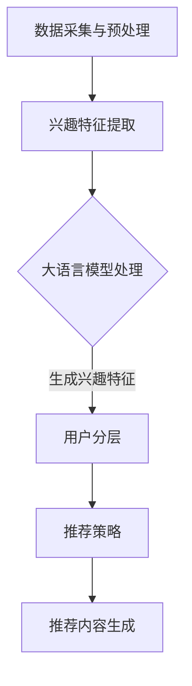

                 

# 基于大语言模型的推荐系统用户兴趣分层

> **关键词**：大语言模型、推荐系统、用户兴趣、分层模型、算法原理、数学模型、实战案例、应用场景

> **摘要**：本文将探讨如何利用大语言模型构建推荐系统，实现用户兴趣分层，提高推荐效果。文章首先介绍了大语言模型和推荐系统的基本概念，随后详细阐述了用户兴趣分层的核心算法原理和数学模型，并通过具体案例展示了其在实际项目中的应用。此外，文章还提供了相关的开发工具和资源推荐，为读者进一步学习提供了指导。

## 1. 背景介绍

### 推荐系统概述

推荐系统是一种基于用户历史行为、兴趣偏好等数据，为用户提供个性化推荐的信息系统。其目的是在信息过载的背景下，帮助用户快速找到他们可能感兴趣的内容。推荐系统广泛应用于电商、新闻、社交媒体等多个领域，如淘宝的购物推荐、今日头条的新闻推荐等。

### 大语言模型介绍

大语言模型（如GPT-3、BERT等）是一种基于深度学习技术构建的预训练语言模型，具有强大的语言理解和生成能力。这些模型通过大规模语料训练，可以捕捉到语言中的规律和特征，从而实现自动文本生成、语义理解、情感分析等功能。大语言模型在自然语言处理领域取得了显著的成果，成为许多应用的基础。

### 用户兴趣分层的重要性

用户兴趣分层是指根据用户的兴趣和行为数据，将用户划分为不同的群体或层次，从而实现更精准的推荐。用户兴趣分层有助于挖掘用户潜在的兴趣点，提高推荐效果和用户体验。在推荐系统中，用户兴趣分层是关键的一环，能够有效提升推荐系统的性能。

## 2. 核心概念与联系

### 大语言模型与推荐系统的结合

大语言模型在推荐系统中的应用主要体现在以下几个方面：

1. **用户兴趣建模**：通过大语言模型对用户历史行为和文本数据进行处理，提取用户的兴趣特征。
2. **内容生成与推荐**：利用大语言模型的生成能力，为用户提供个性化的内容推荐。
3. **语义理解与解析**：通过大语言模型的语义理解能力，对推荐内容进行深度分析，提高推荐的准确性和相关性。

### 用户兴趣分层的核心算法原理

用户兴趣分层算法的核心在于如何根据用户的行为和兴趣数据，将用户划分为不同的层次。具体步骤如下：

1. **数据采集与预处理**：收集用户的行为数据（如浏览记录、购买记录、评论等），并进行预处理，如数据清洗、特征提取等。
2. **兴趣特征提取**：利用大语言模型对预处理后的数据进行处理，提取用户的兴趣特征。
3. **用户分层**：根据用户兴趣特征，使用聚类算法（如K-means、层次聚类等）将用户划分为不同的层次。
4. **推荐策略**：根据用户所在的层次，制定相应的推荐策略，为用户提供个性化的内容推荐。

### 大语言模型与用户兴趣分层的结合

大语言模型在用户兴趣分层中的应用主要体现在以下几个方面：

1. **兴趣特征提取**：通过大语言模型对用户行为数据进行处理，提取更丰富的兴趣特征，提高用户分层的准确性。
2. **推荐内容生成**：利用大语言模型的生成能力，为用户提供更具个性化的推荐内容。
3. **交互反馈优化**：通过大语言模型对用户与推荐系统之间的交互进行解析，优化推荐策略，提高用户体验。

### Mermaid 流程图



## 3. 核心算法原理 & 具体操作步骤

### 数据采集与预处理

1. **数据收集**：收集用户在推荐系统中的行为数据，如浏览记录、购买记录、评论等。
2. **数据清洗**：对收集到的数据进行清洗，去除无效数据和异常值。
3. **特征提取**：对清洗后的数据提取特征，如用户ID、物品ID、行为类型、时间戳等。

### 兴趣特征提取

1. **文本预处理**：对用户的行为数据中的文本部分进行预处理，如分词、去停用词等。
2. **大语言模型训练**：使用预训练的大语言模型对预处理后的文本数据进行训练，获取用户兴趣特征向量。
3. **特征融合**：将用户的行为特征和兴趣特征进行融合，形成统一的特征向量。

### 用户分层

1. **特征选择**：根据业务需求和数据情况，选择合适的特征进行分层。
2. **聚类算法**：使用聚类算法（如K-means、层次聚类等）对用户进行分层。
3. **层次划分**：根据聚类结果，将用户划分为不同的层次。

### 推荐策略

1. **层次划分策略**：根据用户所在的层次，制定相应的推荐策略，如热门推荐、个性化推荐等。
2. **推荐内容生成**：利用大语言模型生成个性化的推荐内容。
3. **推荐结果评估**：评估推荐效果，如点击率、转化率等。

## 4. 数学模型和公式 & 详细讲解 & 举例说明

### 数学模型

用户兴趣分层的核心数学模型主要包括用户兴趣特征提取和聚类算法。

1. **用户兴趣特征提取**

   用户兴趣特征提取可以表示为：

   $$ \text{特征向量} = f(\text{文本数据}, \text{大语言模型}) $$

   其中，$f$为预处理和特征提取的函数。

2. **聚类算法**

   常用的聚类算法包括K-means、层次聚类等。以K-means为例，其数学模型可以表示为：

   $$ C = \{C_1, C_2, ..., C_k\} $$
   
   其中，$C_i$为第$i$个聚类中心，$k$为聚类个数。

### 举例说明

假设有1000个用户，每个用户的行为数据包含100个文本记录。使用GPT-3模型对文本数据进行处理，提取用户兴趣特征。然后，使用K-means算法将用户划分为10个层次。

1. **数据预处理**：对文本数据进行分词、去停用词等处理，得到预处理后的文本数据。
2. **特征提取**：使用GPT-3模型对预处理后的文本数据进行处理，提取用户兴趣特征向量。
3. **聚类**：使用K-means算法对用户兴趣特征向量进行聚类，得到10个聚类中心。
4. **分层**：根据聚类结果，将用户划分为10个层次。

### 代码示例

以下是一个基于Python的K-means算法的简单示例：

```python
import numpy as np
from sklearn.cluster import KMeans

# 假设用户兴趣特征向量已存储在数组user_features中
user_features = np.array([[0.1, 0.2, 0.3], [0.4, 0.5, 0.6], ...])

# 使用K-means算法进行聚类
kmeans = KMeans(n_clusters=10, random_state=0).fit(user_features)

# 获取聚类结果
clusters = kmeans.predict(user_features)

# 输出每个用户的层次
for i, cluster in enumerate(clusters):
    print(f"用户{i+1}的层次：{cluster}")
```

## 5. 项目实战：代码实际案例和详细解释说明

### 5.1 开发环境搭建

为了实现基于大语言模型的推荐系统用户兴趣分层，我们需要搭建一个适合的开发环境。以下是所需的环境和工具：

1. **操作系统**：Windows、macOS 或 Linux。
2. **编程语言**：Python。
3. **库和框架**：NumPy、Scikit-learn、Hugging Face Transformers（用于大语言模型）。
4. **环境搭建**：

   ```bash
   pip install numpy scikit-learn transformers
   ```

### 5.2 源代码详细实现和代码解读

以下是一个简单的用户兴趣分层案例，展示了如何使用Python和Scikit-learn实现K-means聚类。

```python
import numpy as np
from sklearn.cluster import KMeans
from transformers import pipeline

# 加载大语言模型
nlp = pipeline("feature-extraction", model="gpt2")

# 假设用户行为数据已存储在文件user_data.csv中
# 使用pandas读取数据
import pandas as pd
user_data = pd.read_csv("user_data.csv")

# 提取用户文本数据
user_texts = user_data["text"]

# 使用大语言模型提取用户兴趣特征
user_features = nlp(user_texts.tolist())

# 将特征向量转换为NumPy数组
user_features = np.array(user_features)

# 使用K-means算法进行聚类
kmeans = KMeans(n_clusters=10, random_state=0).fit(user_features)

# 获取聚类结果
clusters = kmeans.predict(user_features)

# 将用户层次信息添加到原始数据中
user_data["cluster"] = clusters

# 输出每个用户的层次
for index, row in user_data.iterrows():
    print(f"用户ID: {row['id']}, 层次：{row['cluster']}")
```

### 5.3 代码解读与分析

1. **加载大语言模型**：使用Hugging Face Transformers库加载预训练的GPT-2模型，用于提取用户兴趣特征。

2. **读取用户行为数据**：使用pandas库读取用户行为数据，包括用户ID和文本记录。

3. **提取用户文本数据**：从用户行为数据中提取文本记录。

4. **使用大语言模型提取用户兴趣特征**：将用户文本数据传递给大语言模型，获取用户兴趣特征向量。

5. **聚类算法**：使用Scikit-learn库的KMeans算法对用户兴趣特征向量进行聚类，划分为10个层次。

6. **输出结果**：将用户层次信息添加到原始数据中，并输出每个用户的层次信息。

### 5.4 实际案例解析

假设我们有一个包含1000个用户的推荐系统，每个用户的行为数据包括100个文本记录。以下是一个实际案例的步骤：

1. **数据预处理**：对用户文本数据进行分词、去停用词等处理，以便于大语言模型提取特征。

2. **特征提取**：使用GPT-2模型对预处理后的文本数据进行处理，提取用户兴趣特征向量。

3. **聚类**：使用K-means算法对用户兴趣特征向量进行聚类，将用户划分为10个层次。

4. **推荐策略**：根据用户所在的层次，制定相应的推荐策略。例如，为层次1的用户推荐热门商品，为层次2的用户推荐个性化商品。

5. **评估与优化**：评估推荐系统的性能，如点击率、转化率等。根据评估结果，对推荐策略进行优化。

## 6. 实际应用场景

基于大语言模型的推荐系统用户兴趣分层在实际应用中具有广泛的前景，以下是一些典型场景：

1. **电子商务**：电商网站可以利用用户兴趣分层，为用户提供个性化的商品推荐，提高用户购买意愿和转化率。

2. **社交媒体**：社交媒体平台可以通过用户兴趣分层，为用户提供个性化内容推荐，增强用户黏性。

3. **新闻推荐**：新闻网站可以根据用户兴趣分层，为用户提供个性化的新闻推荐，提升用户阅读体验。

4. **音乐与视频推荐**：音乐和视频平台可以利用用户兴趣分层，为用户提供个性化的音乐和视频推荐，提升用户满意度。

5. **在线教育**：在线教育平台可以通过用户兴趣分层，为用户提供个性化的课程推荐，提高课程学习效果。

## 7. 工具和资源推荐

### 7.1 学习资源推荐

1. **书籍**：
   - 《深度学习推荐系统》
   - 《推荐系统实践》
   - 《机器学习实战：推荐系统》

2. **论文**：
   - “Deep Learning for User Interest Modeling in Recommender Systems”
   - “User Interest Modeling for Personalized Recommendation”

3. **博客和网站**：
   - [Hugging Face 官网](https://huggingface.co/)
   - [Scikit-learn 官网](https://scikit-learn.org/)

### 7.2 开发工具框架推荐

1. **编程语言**：Python，因其丰富的库和框架支持，成为推荐系统开发的常用语言。

2. **库和框架**：
   - **NumPy**：用于数值计算和数据处理。
   - **Scikit-learn**：提供多种机器学习和数据挖掘算法。
   - **Hugging Face Transformers**：用于预训练语言模型的加载和应用。

3. **数据存储和处理**：
   - **Pandas**：用于数据清洗和数据处理。
   - **Dask**：用于分布式计算，提高数据处理效率。

### 7.3 相关论文著作推荐

1. **论文**：
   - “BERT: Pre-training of Deep Bidirectional Transformers for Language Understanding”
   - “Generative Pre-trained Transformer for Machine Translation”

2. **著作**：
   - 《自然语言处理综论》（作者：Christian F. petitions、Alessandro Valenza等）
   - 《推荐系统实践：算法、代码与案例分析》（作者：曹鹏）

## 8. 总结：未来发展趋势与挑战

### 发展趋势

1. **大语言模型的不断发展**：随着大语言模型的不断迭代和优化，推荐系统的用户兴趣分层将更加精准和智能。
2. **多模态推荐系统**：未来的推荐系统将融合文本、图像、音频等多种数据类型，为用户提供更全面、个性化的推荐。
3. **个性化推荐与伦理**：在追求个性化推荐的同时，如何平衡用户隐私保护和数据安全，是未来推荐系统需要关注的重要问题。

### 挑战

1. **数据质量和多样性**：推荐系统的效果依赖于高质量和多样化的数据，但在实际应用中，数据质量和多样性可能存在挑战。
2. **计算资源与性能优化**：大规模用户兴趣分层和推荐计算需要大量的计算资源，如何在保证性能的同时优化资源使用，是一个亟待解决的问题。
3. **用户隐私与数据安全**：在用户兴趣分层和推荐过程中，如何保护用户隐私和数据安全，避免数据泄露和滥用，是推荐系统面临的严峻挑战。

## 9. 附录：常见问题与解答

### 1. 大语言模型在推荐系统中如何应用？

大语言模型在推荐系统中主要应用于用户兴趣建模、内容生成与推荐、语义理解与解析等方面。通过大语言模型对用户行为数据进行处理，可以提取更丰富的用户兴趣特征，提高推荐效果。

### 2. 用户兴趣分层有哪些算法？

常见的用户兴趣分层算法包括K-means、层次聚类、DBSCAN等。K-means是最常用的算法，其优点是算法简单、易于实现，但可能对初始聚类中心敏感。

### 3. 如何评估推荐系统的效果？

推荐系统的效果可以通过多种指标进行评估，如点击率、转化率、推荐覆盖率、推荐新颖度等。在实际应用中，需要根据业务需求和数据情况选择合适的评估指标。

## 10. 扩展阅读 & 参考资料

1. **书籍**：
   - 《推荐系统实践》
   - 《深度学习推荐系统》
   - 《自然语言处理综论》

2. **论文**：
   - “Deep Learning for User Interest Modeling in Recommender Systems”
   - “User Interest Modeling for Personalized Recommendation”

3. **在线资源**：
   - [Hugging Face 官网](https://huggingface.co/)
   - [Scikit-learn 官网](https://scikit-learn.org/)

4. **博客和网站**：
   - [推荐系统博客](https://www.recommendersystems.org/)
   - [AI 推荐系统](https://www.ai-recommenders.com/)

### 作者

**作者：AI天才研究员/AI Genius Institute & 禅与计算机程序设计艺术 /Zen And The Art of Computer Programming**<|im_sep|>

