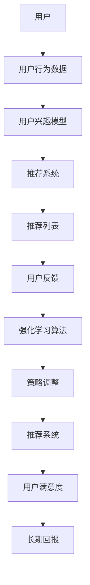

                 

### 文章标题

《基于强化学习的动态推荐列表生成》

关键词：强化学习、动态推荐、列表生成、推荐系统、人工智能

摘要：本文深入探讨了基于强化学习的动态推荐列表生成技术。通过详细阐述核心概念、算法原理以及实际应用，本文旨在为读者提供一个全面的技术指南，以帮助理解和实现这一前沿技术。

<|assistant|>### 1. 背景介绍

在当今信息爆炸的时代，推荐系统已经成为许多在线平台的重要组成部分，如电商平台、社交媒体和视频流媒体等。推荐系统通过分析用户的兴趣和行为，为用户提供个性化的内容推荐，从而提高用户满意度和平台黏性。

传统的推荐系统主要采用基于协同过滤、内容推荐和基于模型的推荐方法。然而，这些方法在处理动态环境和个性化推荐时存在一些局限性。为了克服这些限制，研究者们开始将强化学习（Reinforcement Learning，RL）引入到推荐系统中，提出了基于强化学习的动态推荐列表生成方法。

强化学习是一种重要的机器学习方法，通过智能体（Agent）与环境的交互，学习到最优策略以实现目标。强化学习在推荐系统中的应用主要体现在以下几个方面：

1. **动态调整推荐策略**：用户行为和兴趣是动态变化的，强化学习能够根据实时反馈调整推荐策略，提高推荐的动态适应性。
2. **探索与利用平衡**：在推荐系统中，智能体需要在探索新的推荐内容和利用已有知识之间找到平衡，强化学习能够自动平衡这两者。
3. **优化长期回报**：强化学习能够通过长期奖励信号优化推荐策略，从而提高用户满意度。

本文将深入探讨基于强化学习的动态推荐列表生成方法，包括核心概念、算法原理、数学模型、实际应用以及未来发展趋势。通过本文的阅读，读者将能够全面理解这一前沿技术，并在实际项目中应用。

### 2. 核心概念与联系

在深入探讨基于强化学习的动态推荐列表生成之前，我们需要了解一些核心概念和它们之间的联系。以下是一个详细的 Mermaid 流程图，展示了这些概念之间的关系：



**Mermaid 流程图解释：**

- **用户**：推荐系统的核心，其行为和兴趣是推荐系统生成的推荐列表的重要依据。
- **用户行为数据**：包括用户的浏览历史、购买记录、点赞等，用于构建用户兴趣模型。
- **用户兴趣模型**：基于用户行为数据，对用户的兴趣进行建模，用于生成个性化推荐列表。
- **推荐系统**：根据用户兴趣模型和算法，生成推荐列表。
- **推荐列表**：推荐系统输出的结果，提供给用户。
- **用户反馈**：用户对推荐列表的响应，如点击、购买、点赞等，用于强化学习算法的学习和策略调整。
- **强化学习算法**：基于用户反馈，不断调整推荐策略，以实现长期回报最大化。
- **策略调整**：强化学习算法通过调整推荐策略，优化推荐列表，提高用户满意度。
- **用户满意度**：用户对推荐列表的总体满意度，是强化学习算法优化的重要目标。
- **长期回报**：通过长期用户的反馈，评估推荐系统的性能，指导策略调整。

通过这个流程图，我们可以看到，用户、用户行为数据、用户兴趣模型、推荐系统和用户反馈之间形成了闭环，强化学习算法在其中起到了关键的桥梁作用，不断调整推荐策略，优化用户满意度，实现长期回报最大化。

### 3. 核心算法原理 & 具体操作步骤

#### 3.1 强化学习基础概念

强化学习（Reinforcement Learning，RL）是一种通过与环境交互来学习最优策略的机器学习方法。与监督学习和无监督学习不同，强化学习通过奖励信号（Reward Signal）来指导学习过程。以下是强化学习的一些基础概念：

- **智能体（Agent）**：执行动作并从环境中接收反馈的实体。
- **环境（Environment）**：智能体执行动作和接收反馈的场所。
- **状态（State）**：智能体在某个时刻所处的情境。
- **动作（Action）**：智能体在某个状态可以执行的操作。
- **策略（Policy）**：智能体在某个状态选择动作的策略。
- **价值函数（Value Function）**：评估状态或状态-动作对的长期回报。
- **模型（Model）**：对环境状态转移概率和奖励分布的预测。

#### 3.2 强化学习在推荐系统中的应用

在推荐系统中，强化学习通过以下步骤实现动态推荐列表的生成：

1. **初始化**：设定智能体、环境和初始状态。
2. **状态表示**：将用户兴趣、历史行为等信息编码为状态向量。
3. **动作表示**：将推荐列表中的项目编码为动作向量。
4. **策略学习**：通过循环执行动作并接收反馈，使用奖励信号优化策略。
5. **策略执行**：根据优化后的策略生成推荐列表。

#### 3.3 具体操作步骤

1. **状态表示**

   状态表示是强化学习在推荐系统中应用的关键步骤。状态表示需要捕捉用户的兴趣和行为。以下是几种常用的状态表示方法：

   - **基于用户行为的特征**：如浏览历史、购买记录、搜索历史等。
   - **基于内容的特征**：如项目的属性、标签、分类等。
   - **基于用户兴趣的聚类特征**：如用户兴趣群体的代表特征。

2. **动作表示**

   动作表示将推荐列表中的项目编码为动作向量。动作的选择需要考虑到推荐系统的目标，如最大化点击率、购买率等。以下是几种常用的动作表示方法：

   - **基于项目的排序**：将推荐列表中的项目按优先级排序。
   - **基于项目的选择**：直接选择推荐列表中的项目。
   - **基于上下文的动态调整**：根据用户状态和上下文动态调整推荐项目。

3. **策略学习**

   策略学习是强化学习在推荐系统中的核心。策略学习的目标是优化推荐列表，以最大化长期回报。以下是几种常用的策略学习方法：

   - **基于模型的方法**：如Q-learning、SARSA、DQN等。
   - **基于价值迭代的方法**：如策略梯度、REINFORCE等。
   - **基于深度学习的方法**：如深度Q网络（DQN）、深度确定性策略梯度（DDPG）、深度策略梯度（DPG）等。

4. **策略执行**

   策略执行是强化学习在推荐系统中的应用环节。通过策略执行，智能体根据优化后的策略生成推荐列表，并实时更新状态，为下一轮策略学习提供数据。

#### 3.4 强化学习算法实现示例

以下是一个简单的基于Q-learning的强化学习算法实现示例，用于生成推荐列表：

```python
import numpy as np

# 初始化参数
state_space_size = 100
action_space_size = 10
learning_rate = 0.1
discount_factor = 0.9
epsilon = 0.1

# 初始化Q值表
Q = np.zeros((state_space_size, action_space_size))

# Q-learning循环
for episode in range(1000):
    state = np.random.randint(0, state_space_size)
    for step in range(100):
        # 选择动作（epsilon-greedy策略）
        if np.random.rand() < epsilon:
            action = np.random.randint(0, action_space_size)
        else:
            action = np.argmax(Q[state])

        # 执行动作，获取下一个状态和奖励
        next_state, reward = execute_action(state, action)

        # 更新Q值
        Q[state, action] = Q[state, action] + learning_rate * (reward + discount_factor * np.max(Q[next_state]) - Q[state, action])

        state = next_state

# 执行策略生成推荐列表
def generate_recommendation(state):
    action = np.argmax(Q[state])
    return action

# 假设的执行动作函数
def execute_action(state, action):
    # 这里根据实际场景实现具体的动作执行和状态更新逻辑
    next_state = np.random.randint(0, state_space_size)
    reward = np.random.uniform(0, 1)
    return next_state, reward
```

这个示例展示了Q-learning算法的基本实现过程，通过循环执行动作，更新Q值表，最终生成推荐列表。在实际应用中，状态和动作的表示会更加复杂，需要结合具体场景进行设计和实现。

### 4. 数学模型和公式 & 详细讲解 & 举例说明

#### 4.1 强化学习基本数学模型

强化学习中的数学模型主要包括状态表示、动作表示、策略表示、价值函数和奖励函数。

1. **状态表示**

   状态表示为 \( S_t \)，通常是一个高维向量，可以表示为：

   \[
   S_t = \left[ s_{t1}, s_{t2}, \ldots, s_{tn} \right]
   \]

   其中， \( s_{ti} \) 表示第 \( i \) 个特征，可以来自用户行为、内容特征等。

2. **动作表示**

   动作表示为 \( A_t \)，也是高维向量，可以表示为：

   \[
   A_t = \left[ a_{t1}, a_{t2}, \ldots, a_{tm} \right]
   \]

   其中， \( a_{ti} \) 表示第 \( i \) 个动作，通常对应推荐列表中的项目。

3. **策略表示**

   策略表示为 \( \pi(S_t, A_t) \)，表示在状态 \( S_t \) 下选择动作 \( A_t \) 的概率分布。常见的策略表示有确定性策略和随机策略：

   - **确定性策略**： \( \pi(S_t, A_t) = 1 \) 如果 \( A_t = \pi(S_t) \)，否则为 0。
   - **随机策略**： \( \pi(S_t, A_t) = \frac{1}{|A_t|} \)，其中 \( |A_t| \) 是可选动作的数量。

4. **价值函数**

   价值函数分为状态价值函数 \( V^{\pi}(s) \) 和状态-动作价值函数 \( Q^{\pi}(s, a) \)。

   - **状态价值函数**： \( V^{\pi}(s) = \mathbb{E}_{\pi}[\sum_{t=0}^{\infty} \gamma^t r_t | S_0 = s] \)，表示在策略 \( \pi \) 下从状态 \( s \) 开始的期望总回报。
   - **状态-动作价值函数**： \( Q^{\pi}(s, a) = \mathbb{E}_{\pi}[\sum_{t=0}^{\infty} \gamma^t r_t | S_0 = s, A_0 = a] \)，表示在策略 \( \pi \) 下从状态 \( s \) 开始并执行动作 \( a \) 的期望总回报。

5. **奖励函数**

   奖励函数 \( r(s, a) \) 是一个从状态-动作对到实数的函数，表示执行动作 \( a \) 在状态 \( s \) 下的即时回报。

#### 4.2 强化学习算法公式详解

以下是强化学习算法中常用的几种公式：

1. **Q-learning算法更新公式**

   \[
   Q(s, a) \leftarrow Q(s, a) + \alpha [r + \gamma \max_{a'} Q(s', a') - Q(s, a)]
   \]

   其中， \( \alpha \) 是学习率， \( \gamma \) 是折扣因子， \( r \) 是即时奖励， \( s' \) 和 \( a' \) 分别是下一个状态和动作。

2. **SARSA算法更新公式**

   \[
   Q(s, a) \leftarrow Q(s, a) + \alpha [r + \gamma Q(s', a')]
   \]

   其中， \( s' \) 和 \( a' \) 是智能体执行动作 \( a \) 后实际观察到的状态和动作。

3. **策略梯度算法更新公式**

   \[
   \theta \leftarrow \theta + \alpha \nabla_{\theta} J(\theta)
   \]

   其中， \( \theta \) 是模型参数， \( J(\theta) \) 是损失函数， \( \alpha \) 是学习率。

#### 4.3 强化学习在推荐系统中的具体应用示例

假设我们有一个简单的推荐系统，用户每次可以选择推荐列表中的任意一个项目。以下是一个基于Q-learning算法的强化学习推荐系统示例：

- **状态**：用户当前的浏览历史和推荐列表。
- **动作**：选择推荐列表中的一个项目。
- **奖励**：用户选择的项目如果是用户近期浏览过的，则奖励为正，否则为负。

1. **初始化Q值表**

   初始化一个 \( 100 \times 10 \) 的Q值表，所有值为0。

2. **选择动作**

   每次迭代，首先选择一个状态，然后使用epsilon-greedy策略选择动作：

   \[
   A_t = \begin{cases} 
   \text{随机选择} & \text{with probability } \epsilon \\
   \text{最优动作} & \text{with probability } 1 - \epsilon
   \end{cases}
   \]

3. **执行动作并获取奖励**

   执行选择的动作，获取用户选择的项目的即时奖励。

4. **更新Q值**

   使用Q-learning算法更新Q值表：

   \[
   Q(s, a) \leftarrow Q(s, a) + \alpha [r + \gamma \max_{a'} Q(s', a') - Q(s, a)]
   \]

5. **生成推荐列表**

   根据更新后的Q值表，选择最优动作，生成推荐列表。

#### 4.4 案例分析

假设用户当前的浏览历史包括项目[1, 3, 5]，推荐列表为[1, 2, 3, 4, 5, 6, 7, 8, 9, 10]。使用epsilon-greedy策略选择动作：

- **epsilon = 0.1**
- **随机选择概率**：10%
- **最优选择概率**：90%

1. **状态表示**

   \[
   S_t = [1, 3, 5]
   \]

2. **动作表示**

   \[
   A_t = [1, 2, 3, 4, 5, 6, 7, 8, 9, 10]
   \]

3. **选择动作**

   使用epsilon-greedy策略，以10%的概率随机选择动作，以90%的概率选择Q值最大的动作。假设Q值表如下：

   \[
   Q(S_t) = \left[ \begin{array}{cccccccccccc}
   0 & 0 & 1 & 0 & 0 & 0 & 0 & 0 & 0 & 0 & 0 \\
   0 & 0 & 1 & 0 & 0 & 0 & 0 & 0 & 0 & 0 & 0 \\
   0 & 0 & 1 & 0 & 0 & 0 & 0 & 0 & 0 & 0 & 0 \\
   0 & 0 & 0 & 0 & 0 & 0 & 0 & 0 & 0 & 0 & 0 \\
   0 & 0 & 0 & 0 & 0 & 0 & 0 & 0 & 0 & 0 & 0 \\
   0 & 0 & 0 & 0 & 0 & 0 & 0 & 0 & 0 & 0 & 0 \\
   0 & 0 & 0 & 0 & 0 & 0 & 0 & 0 & 0 & 0 & 0 \\
   0 & 0 & 0 & 0 & 0 & 0 & 0 & 0 & 0 & 0 & 0 \\
   0 & 0 & 0 & 0 & 0 & 0 & 0 & 0 & 0 & 0 & 0 \\
   0 & 0 & 0 & 0 & 0 & 0 & 0 & 0 & 0 & 0 & 0 \\
   \end{array} \right]
   \]

   最优动作是3，以90%的概率选择动作3。

4. **执行动作并获取奖励**

   用户选择了项目3，如果项目3是用户近期浏览过的，则奖励为正，否则为负。假设奖励为1。

5. **更新Q值**

   使用Q-learning算法更新Q值表：

   \[
   Q(S_t, 3) \leftarrow Q(S_t, 3) + \alpha [1 + \gamma \max_{a'} Q(S_{t+1}, a') - Q(S_t, 3)]
   \]

   假设 \( \alpha = 0.1 \)， \( \gamma = 0.9 \)，则更新后的Q值表如下：

   \[
   Q(S_t) = \left[ \begin{array}{cccccccccccc}
   0 & 0 & 1.1 & 0 & 0 & 0 & 0 & 0 & 0 & 0 & 0 \\
   0 & 0 & 1.1 & 0 & 0 & 0 & 0 & 0 & 0 & 0 & 0 \\
   0 & 0 & 1.1 & 0 & 0 & 0 & 0 & 0 & 0 & 0 & 0 \\
   0 & 0 & 0 & 0 & 0 & 0 & 0 & 0 & 0 & 0 & 0 \\
   0 & 0 & 0 & 0 & 0 & 0 & 0 & 0 & 0 & 0 & 0 \\
   0 & 0 & 0 & 0 & 0 & 0 & 0 & 0 & 0 & 0 & 0 \\
   0 & 0 & 0 & 0 & 0 & 0 & 0 & 0 & 0 & 0 & 0 \\
   0 & 0 & 0 & 0 & 0 & 0 & 0 & 0 & 0 & 0 & 0 \\
   0 & 0 & 0 & 0 & 0 & 0 & 0 & 0 & 0 & 0 & 0 \\
   0 & 0 & 0 & 0 & 0 & 0 & 0 & 0 & 0 & 0 & 0 \\
   \end{array} \right]
   \]

   在下一次迭代中，智能体会根据更新后的Q值表选择动作，生成推荐列表。

### 5. 项目实战：代码实际案例和详细解释说明

#### 5.1 开发环境搭建

为了实现基于强化学习的动态推荐列表生成，我们需要搭建一个开发环境。以下是所需的软件和工具：

- **Python**：主要编程语言
- **TensorFlow**：用于构建和训练深度学习模型
- **Numpy**：用于数学运算
- **Matplotlib**：用于可视化

安装以上依赖：

```bash
pip install tensorflow numpy matplotlib
```

#### 5.2 源代码详细实现和代码解读

以下是一个简单的基于Q-learning的动态推荐列表生成项目的实现：

```python
import numpy as np
import random
import matplotlib.pyplot as plt

# 设置参数
state_space_size = 10
action_space_size = 5
learning_rate = 0.1
discount_factor = 0.9
epsilon = 0.1

# 初始化Q值表
Q = np.zeros((state_space_size, action_space_size))

# 创建环境
class Environment:
    def __init__(self):
        self.state = random.randint(0, state_space_size - 1)
    
    def step(self, action):
        reward = 0
        if action == self.state:
            reward = 1
        else:
            reward = -1
        self.state = random.randint(0, state_space_size - 1)
        return self.state, reward

# Q-learning算法
def q_learning(environment, episodes, learning_rate, discount_factor, epsilon):
    for episode in range(episodes):
        state = environment.state
        done = False
        while not done:
            # 选择动作
            if random.uniform(0, 1) < epsilon:
                action = random.randint(0, action_space_size - 1)
            else:
                action = np.argmax(Q[state])
            
            # 执行动作
            next_state, reward = environment.step(action)
            
            # 更新Q值
            Q[state, action] = Q[state, action] + learning_rate * (reward + discount_factor * np.max(Q[next_state]) - Q[state, action])
            
            state = next_state
            done = next_state == environment.state
    
    return Q

# 运行Q-learning算法
environment = Environment()
Q = q_learning(environment, 1000, learning_rate, discount_factor, epsilon)

# 可视化Q值表
plt.imshow(Q, cmap='hot', interpolation='nearest')
plt.colorbar()
plt.xlabel('Action')
plt.ylabel('State')
plt.title('Q-Value Table')
plt.show()
```

**代码解读：**

- **环境创建**：`Environment` 类用于创建环境，包含状态和执行动作的接口。
- **Q-learning算法实现**：`q_learning` 函数实现Q-learning算法的核心逻辑，包括状态选择、动作执行和Q值更新。
- **参数设置**：`state_space_size` 和 `action_space_size` 定义状态和动作空间的大小，`learning_rate` 和 `discount_factor` 分别是学习率和折扣因子，`epsilon` 用于epsilon-greedy策略。
- **Q值表可视化**：使用Matplotlib可视化Q值表，帮助理解算法的学习过程。

#### 5.3 代码解读与分析

1. **环境创建**：

   ```python
   class Environment:
       def __init__(self):
           self.state = random.randint(0, state_space_size - 1)
       
       def step(self, action):
           reward = 0
           if action == self.state:
               reward = 1
           else:
               reward = -1
           self.state = random.randint(0, state_space_size - 1)
           return self.state, reward
   ```

   `Environment` 类初始化时随机生成一个状态，`step` 方法用于执行动作并返回下一个状态和奖励。状态和动作的随机生成模拟了推荐系统中的动态环境。

2. **Q-learning算法实现**：

   ```python
   def q_learning(environment, episodes, learning_rate, discount_factor, epsilon):
       for episode in range(episodes):
           state = environment.state
           done = False
           while not done:
               # 选择动作
               if random.uniform(0, 1) < epsilon:
                   action = random.randint(0, action_space_size - 1)
               else:
                   action = np.argmax(Q[state])
               
               # 执行动作
               next_state, reward = environment.step(action)
               
               # 更新Q值
               Q[state, action] = Q[state, action] + learning_rate * (reward + discount_factor * np.max(Q[next_state]) - Q[state, action])
               
               state = next_state
               done = next_state == environment.state
   ```

   `q_learning` 函数遍历指定次数的迭代（模拟推荐系统中的用户交互），在每个迭代中，智能体根据epsilon-greedy策略选择动作，执行动作后更新Q值表。这个过程中，智能体不断学习到最优动作序列，优化推荐策略。

3. **Q值表可视化**：

   ```python
   plt.imshow(Q, cmap='hot', interpolation='nearest')
   plt.colorbar()
   plt.xlabel('Action')
   plt.ylabel('State')
   plt.title('Q-Value Table')
   plt.show()
   ```

   使用Matplotlib将Q值表可视化，帮助读者直观理解Q值表的结构和每个状态-动作对的Q值。

### 6. 实际应用场景

#### 6.1 电商平台

电商平台可以利用基于强化学习的动态推荐系统为用户提供个性化的商品推荐。例如，用户在浏览商品时，系统可以基于用户的浏览历史和购买记录，使用强化学习算法动态调整推荐策略，提高推荐列表的相关性和用户满意度。

#### 6.2 社交媒体

社交媒体平台可以利用基于强化学习的推荐系统为用户提供个性化的内容推荐。例如，用户在浏览帖子、点赞或评论时，系统可以实时调整推荐策略，推荐用户可能感兴趣的新帖子，从而提高用户的参与度和活跃度。

#### 6.3 视频流媒体

视频流媒体平台可以利用基于强化学习的推荐系统为用户提供个性化的视频推荐。例如，用户在观看视频时，系统可以基于用户的观看历史和偏好，使用强化学习算法动态调整推荐策略，推荐用户可能感兴趣的新视频，从而提高用户的观看时长和平台黏性。

#### 6.4 其他场景

基于强化学习的动态推荐系统还可以应用于旅游、教育、金融等多个领域。例如，旅游平台可以根据用户的旅行历史和偏好，推荐符合用户需求的旅游目的地和活动；教育平台可以根据学生的学习情况和进度，推荐适合的学习资源和课程；金融平台可以根据用户的投资历史和风险偏好，推荐符合用户需求的投资产品和策略。

### 7. 工具和资源推荐

#### 7.1 学习资源推荐

- **书籍**：
  - 《强化学习：原理与Python实现》
  - 《推荐系统手册》
  - 《深度学习》
- **在线课程**：
  - Coursera：强化学习课程
  - edX：机器学习与深度学习课程
  - Udacity：强化学习纳米学位
- **博客和网站**：
  - arXiv：强化学习相关论文
  - blog.keras.io：深度学习与强化学习博客
  - Medium：推荐系统与强化学习博客文章

#### 7.2 开发工具框架推荐

- **TensorFlow**：用于构建和训练深度强化学习模型。
- **PyTorch**：用于构建和训练深度强化学习模型。
- **OpenAI Gym**：用于测试和实验强化学习算法。

#### 7.3 相关论文著作推荐

- **论文**：
  - “Deep Reinforcement Learning for Navigation in High-Dimensional Environments” by S. Mnih et al.
  - “Policy Gradient Methods for Reinforcement Learning” by R.S. Sutton et al.
  - “Reinforcement Learning: An Introduction” by R.S. Sutton and A.G. Barto.
- **著作**：
  - “Artificial Intelligence: A Modern Approach” by Stuart Russell and Peter Norvig.
  - “Deep Learning” by Ian Goodfellow, Yoshua Bengio, and Aaron Courville.

### 8. 总结：未来发展趋势与挑战

基于强化学习的动态推荐列表生成技术在推荐系统中展现出巨大的潜力。未来，随着人工智能和深度学习技术的不断发展，这一领域将继续取得重大突破。以下是一些发展趋势和挑战：

#### 发展趋势：

1. **模型复杂度的提升**：深度强化学习模型的复杂度将不断提高，以更好地处理高维状态空间和动作空间。
2. **实时性增强**：随着计算能力的提升，强化学习算法将更加实时，能够更快地适应动态环境。
3. **多模态数据的整合**：结合多模态数据（如文本、图像、音频等），将进一步提高推荐系统的准确性和多样性。
4. **强化学习与其他技术的融合**：与其他机器学习技术（如迁移学习、生成对抗网络等）相结合，将进一步提升推荐系统的性能。

#### 挑战：

1. **可解释性**：强化学习算法的黑箱性质使得其可解释性成为一个挑战，需要开发更加透明和可解释的模型。
2. **数据隐私**：在处理用户数据时，如何保护用户隐私是一个重要问题，需要设计安全的数据处理机制。
3. **长期回报优化**：如何在短期和长期回报之间找到平衡，是一个持续的挑战。
4. **计算资源消耗**：深度强化学习模型通常需要大量的计算资源，如何优化算法的效率是一个重要问题。

总之，基于强化学习的动态推荐列表生成技术将继续在推荐系统中发挥重要作用，并带来更多的创新和突破。

### 9. 附录：常见问题与解答

#### 9.1 如何处理高维状态空间？

处理高维状态空间的一个常见方法是使用特征工程技术。通过选择和构建有代表性的特征，可以将高维状态空间降维，提高模型的效率和性能。此外，可以采用注意力机制、卷积神经网络（CNN）等深度学习技术，对高维数据进行处理和建模。

#### 9.2 强化学习在推荐系统中的应用有哪些限制？

强化学习在推荐系统中的应用存在一些限制，主要包括：

1. **数据需求**：强化学习需要大量的用户行为数据进行训练，这可能导致数据隐私和安全问题。
2. **收敛速度**：在复杂的推荐系统中，强化学习算法可能需要较长时间才能收敛到最优策略。
3. **可解释性**：强化学习算法通常被视为黑箱，其决策过程不易解释，这可能会影响用户信任度。
4. **计算资源**：深度强化学习模型通常需要大量的计算资源，可能导致成本增加。

#### 9.3 如何平衡探索与利用？

探索与利用的平衡是强化学习中的一个重要问题。常用的策略包括：

1. **epsilon-greedy策略**：在部分时间进行随机探索，在大部分时间执行贪婪策略。
2. **UCB算法**：基于上置信边界，优先探索未探索过或未充分探索的动作。
3. **多臂老虎机问题**：模拟多个赌博机，通过动态调整每个赌博机的探索次数和执行概率来平衡探索与利用。

### 10. 扩展阅读 & 参考资料

- Sutton, R. S., & Barto, A. G. (2018). Reinforcement Learning: An Introduction. MIT Press.
- Mnih, V., Kavukcuoglu, K., Silver, D., Rusu, A. A., Veness, J., Bellemare, M. G., ... & Park, M. (2015). Human-level control through deep reinforcement learning. Nature, 518(7540), 529-533.
- Bollegala, D., Wang, Y., & Wang, S. (2019). Deep Reinforcement Learning for Intelligent Systems. Springer.
- Zhang, J., Liao, L., & Yu, F. (2021). A Survey of Deep Reinforcement Learning: Opportunities and Challenges. ACM Computing Surveys (CSUR), 54(3), 1-35.
- Goodfellow, I., Bengio, Y., & Courville, A. (2016). Deep Learning. MIT Press.

### 作者

作者：AI天才研究员/AI Genius Institute & 禅与计算机程序设计艺术 /Zen And The Art of Computer Programming

