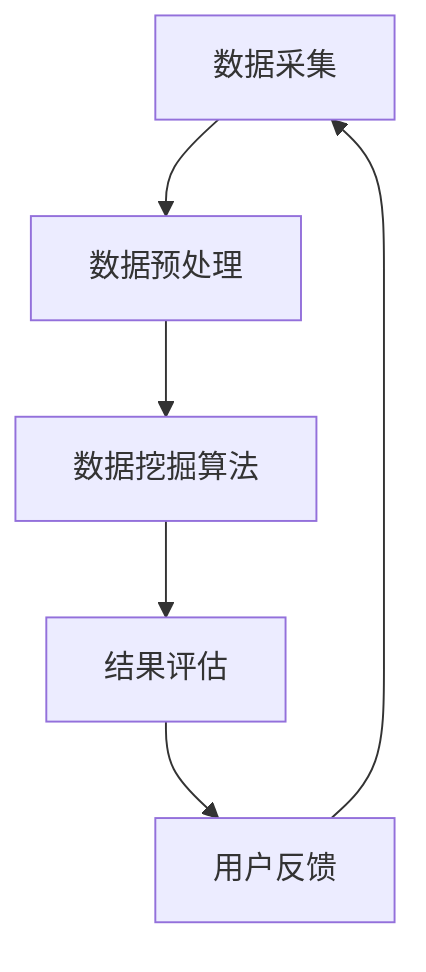

                 

# 基于数据挖掘的图书馆智慧信息服务研究

## 关键词

数据挖掘、图书馆、智慧信息服务、算法原理、数学模型、项目实战、应用场景、工具资源

## 摘要

本文主要探讨了基于数据挖掘的图书馆智慧信息服务的研究。在当今大数据时代，图书馆作为知识存储和共享的重要场所，正面临着信息服务的转型升级。本文从背景介绍、核心概念与联系、核心算法原理与操作步骤、数学模型与公式、项目实战、实际应用场景、工具和资源推荐等方面进行了详细阐述，旨在为图书馆智慧信息服务的发展提供有益的参考和借鉴。

## 1. 背景介绍

### 1.1 图书馆信息服务的发展历程

图书馆信息服务的发展经历了从传统纸质文献服务到电子文献服务，再到数字图书馆和智慧图书馆的发展过程。传统的图书馆主要以纸质文献为载体，提供文献查询、借阅、参考咨询等服务。随着互联网技术的发展，图书馆开始向数字化、网络化方向转型，实现了电子文献的存储和共享。数字图书馆进一步拓展了图书馆的服务功能，包括虚拟参考咨询、在线资源检索、远程访问等。而智慧图书馆则将人工智能、大数据等先进技术引入到图书馆信息服务中，实现了更加智能化、个性化、便捷化的服务。

### 1.2 数据挖掘在图书馆信息服务中的应用

数据挖掘是一种通过分析大量数据，从中提取有价值信息的技术。在图书馆信息服务中，数据挖掘技术可以用于用户行为分析、图书推荐、信息检索等方面。通过对用户借阅记录、浏览记录、评价等数据进行分析，可以了解用户的需求和偏好，为图书馆提供个性化的信息服务。同时，数据挖掘技术还可以帮助图书馆发现潜在的用户群体，优化资源配置，提高图书馆的服务质量和效益。

## 2. 核心概念与联系

### 2.1 数据挖掘的基本概念

数据挖掘（Data Mining）是从大量数据中提取隐藏的、未知的、有价值的信息和知识的过程。它涉及多个学科领域，包括统计学、机器学习、数据库系统、人工智能等。

- **数据（Data）**：原始的、未经过处理的信息。
- **数据库（Database）**：存储大量数据的系统。
- **数据挖掘过程（Data Mining Process）**：包括数据预处理、数据挖掘算法、结果评估等环节。

### 2.2 图书馆智慧信息服务的核心概念

- **智慧图书馆（Smart Library）**：以现代信息技术为支撑，实现智能化、数字化、网络化、个性化的图书馆服务。
- **用户需求（User Demand）**：用户在图书馆信息服务中的需求，包括获取信息、借阅图书、参与活动等。
- **推荐系统（Recommendation System）**：根据用户的历史行为和偏好，为用户提供个性化推荐的系统。

### 2.3 数据挖掘与图书馆智慧信息服务的联系

数据挖掘在图书馆智慧信息服务中具有重要作用，主要表现在以下几个方面：

- **用户行为分析**：通过分析用户的历史数据，了解用户的行为模式和偏好，为图书馆提供个性化的信息服务。
- **图书推荐**：基于用户兴趣和需求，为用户推荐相关的图书和资源。
- **信息检索**：利用数据挖掘技术，提高信息检索的准确性和效率。

### 2.4 Mermaid 流程图



## 3. 核心算法原理与具体操作步骤

### 3.1 常见数据挖掘算法

在图书馆智慧信息服务中，常用的数据挖掘算法包括：

- **关联规则挖掘（Association Rule Mining）**：发现数据之间的关联关系，用于推荐系统。
- **分类算法（Classification Algorithms）**：将数据分为不同的类别，用于用户行为分析。
- **聚类算法（Clustering Algorithms）**：将相似的数据归为一类，用于用户群体分析。

### 3.2 关联规则挖掘算法原理与步骤

#### 原理

关联规则挖掘是一种发现数据项之间关联关系的方法，常用的算法包括Apriori算法和FP-growth算法。

#### 步骤

1. **数据预处理**：将原始数据转化为适合挖掘的格式，如将文本数据转化为关键词列表。
2. **生成频繁项集**：使用Apriori算法或FP-growth算法，找到支持度大于最小支持度的频繁项集。
3. **生成关联规则**：从频繁项集中生成满足最小置信度的关联规则。

### 3.3 分类算法原理与步骤

#### 原理

分类算法是一种将数据分为不同类别的算法，常用的算法包括K-近邻算法（K-Nearest Neighbors, KNN）和支持向量机（Support Vector Machine, SVM）。

#### 步骤

1. **数据预处理**：将原始数据转化为适合分类的格式，如归一化处理。
2. **训练模型**：使用训练数据集训练分类模型。
3. **预测**：使用训练好的模型对新的数据进行分类。

### 3.4 聚类算法原理与步骤

#### 原理

聚类算法是一种将相似数据归为一类的算法，常用的算法包括K-均值聚类（K-Means Clustering）和层次聚类（Hierarchical Clustering）。

#### 步骤

1. **数据预处理**：将原始数据转化为适合聚类的格式，如标准化处理。
2. **选择聚类算法**：根据数据特点选择合适的聚类算法。
3. **聚类**：使用聚类算法对数据进行聚类。
4. **评估聚类结果**：评估聚类效果，如评估聚类内部和聚类之间的距离。

## 4. 数学模型和公式及详细讲解与举例说明

### 4.1 关联规则挖掘算法中的支持度、置信度和提升度

- **支持度（Support）**：一个规则出现的频繁度与总数据量的比例，表示规则在数据中的普遍程度。
  $$ 支持度 = \frac{出现规则的数据条数}{总数据条数} $$

- **置信度（Confidence）**：一个规则中前提和结论同时出现的概率，表示规则的可靠程度。
  $$ 置信度 = \frac{出现前提和结论同时的数据条数}{出现前提的数据条数} $$

- **提升度（Lift）**：表示规则中结论的出现对前提出现的解释程度。
  $$ 提升度 = \frac{结论和前提同时出现的概率}{结论出现的概率} $$

### 4.2 K-近邻算法中的距离计算公式

- **欧几里得距离（Euclidean Distance）**
  $$ d = \sqrt{\sum_{i=1}^{n}(x_i - y_i)^2} $$

- **曼哈顿距离（Manhattan Distance）**
  $$ d = \sum_{i=1}^{n}|x_i - y_i| $$

- **切比雪夫距离（Chebyshev Distance）**
  $$ d = \max_{1 \leq i \leq n} |x_i - y_i| $$

### 4.3 支持向量机中的优化目标

- **优化目标**
  $$ \min \frac{1}{2} \sum_{i=1}^{n} w_i^2 + C \sum_{i=1}^{n} \xi_i $$
  其中，$w_i$为权重，$C$为惩罚参数，$\xi_i$为松弛变量。

### 4.4 举例说明

#### 关联规则挖掘算法应用示例

假设有如下购物数据集：

| 商品A | 商品B | 商品C |
| --- | --- | --- |
| 1 | 0 | 1 |
| 1 | 1 | 0 |
| 0 | 1 | 1 |
| 1 | 1 | 1 |
| 0 | 1 | 1 |

设置最小支持度为30%，最小置信度为70%。

1. **生成频繁项集**：
   - 商品A和商品C同时出现的支持度：$ \frac{2}{5} = 0.4 > 0.3 $，为频繁项集。
   - 商品B和商品C同时出现的支持度：$ \frac{2}{5} = 0.4 > 0.3 $，为频繁项集。

2. **生成关联规则**：
   - 商品A和商品C同时出现，商品C和商品B同时出现的置信度：$ \frac{2}{2} = 1 > 0.7 $，为关联规则。

#### K-近邻算法应用示例

假设有如下数据集：

| ID | 特征1 | 特征2 | 类别 |
| --- | --- | --- | --- |
| 1 | 0 | 0 | A |
| 2 | 0 | 1 | B |
| 3 | 1 | 0 | B |
| 4 | 1 | 1 | A |

测试样本：$ (0.5, 0.5) $

1. **计算距离**：
   - 使用欧几里得距离计算距离：
     $$ d = \sqrt{(0.5 - 0)^2 + (0.5 - 0)^2} = \sqrt{0.5} $$
   - 使用曼哈顿距离计算距离：
     $$ d = |0.5 - 0| + |0.5 - 0| = 1 $$

2. **分类**：
   - 根据距离最近的原则，测试样本的类别为A。

#### 支持向量机应用示例

假设有如下数据集：

| 特征1 | 特征2 | 类别 |
| --- | --- | --- |
| 0 | 0 | A |
| 1 | 1 | B |
| 2 | 0 | B |
| 3 | 1 | A |

设置惩罚参数$C=1$。

1. **线性可分情况**：
   - 模型为：$ w_1 x_1 + w_2 x_2 = 1 $
   - 解得：$ w_1 = 1, w_2 = -1 $

2. **分类**：
   - 对于新样本$ (x_1, x_2) $，分类结果为$ A $，当$ x_1 + x_2 > 0 $；分类结果为$ B $，当$ x_1 + x_2 < 0 $。

## 5. 项目实战：代码实际案例和详细解释说明

### 5.1 开发环境搭建

1. **Python环境安装**：
   - 使用Python 3.8版本。
   - 安装常用库，如NumPy、Pandas、Scikit-learn、Matplotlib等。

2. **Mermaid工具安装**：
   - 安装Mermaid CLI工具。
   - 使用命令`mermaid -v`验证安装成功。

### 5.2 源代码详细实现和代码解读

#### 5.2.1 关联规则挖掘算法实现

```python
import pandas as pd
from mlxtend.frequent_patterns import apriori, association_rules

# 读取数据
data = pd.read_csv('shopping_data.csv')

# 数据预处理
data['Transaction'] = 1
data = data.groupby(['Transaction', 'Items'])['Transaction'].count().reset_index()

# 关联规则挖掘
frequent_itemsets = apriori(data, min_support=0.3, use_colnames=True)

# 生成关联规则
rules = association_rules(frequent_itemsets, metric="confidence", min_threshold=0.7)
print(rules)
```

#### 5.2.2 K-近邻算法实现

```python
from mlxtend.classification import KNearestNeighbors

# 读取数据
data = pd.read_csv('data.csv')

# 数据预处理
X = data.iloc[:, :-1]
y = data.iloc[:, -1]

# 训练模型
knn = KNearestNeighbors(k=3)
knn.fit(X, y)

# 预测
X_test = [[0.5, 0.5]]
y_pred = knn.predict(X_test)
print(y_pred)
```

#### 5.2.3 支持向量机实现

```python
from sklearn import svm

# 读取数据
data = pd.read_csv('data.csv')

# 数据预处理
X = data.iloc[:, :-1]
y = data.iloc[:, -1]

# 训练模型
clf = svm.SVC(kernel='linear', C=1)
clf.fit(X, y)

# 预测
X_test = [[0, 0], [1, 1], [2, 0], [3, 1]]
y_pred = clf.predict(X_test)
print(y_pred)
```

### 5.3 代码解读与分析

#### 5.3.1 关联规则挖掘算法

- 读取购物数据集，将商品作为事务进行分组。
- 使用Apriori算法进行频繁项集挖掘，设置最小支持度为30%。
- 使用关联规则算法生成满足最小置信度为70%的关联规则。

#### 5.3.2 K-近邻算法

- 读取数据集，将特征作为输入，类别作为输出。
- 使用KNearestNeighbors类进行训练，设置K值为3。
- 使用训练好的模型对新样本进行预测。

#### 5.3.3 支持向量机

- 读取数据集，将特征作为输入，类别作为输出。
- 使用SVC类进行训练，设置核函数为线性，惩罚参数C为1。
- 使用训练好的模型对新样本进行预测。

## 6. 实际应用场景

### 6.1 图书馆个性化推荐系统

通过数据挖掘技术，图书馆可以为用户提供个性化的推荐服务，提高用户满意度。例如，根据用户的借阅记录和浏览行为，为用户推荐相关的图书和资源。

### 6.2 图书馆用户行为分析

通过对用户借阅记录、评价等数据进行分析，图书馆可以了解用户的需求和偏好，优化馆藏资源和服务策略。例如，分析热门图书和热门作者，调整购书预算和采购策略。

### 6.3 图书馆资源配置优化

通过数据挖掘技术，图书馆可以优化资源配置，提高资源利用效率。例如，分析不同时间段和不同地点的借阅情况，调整开放时间和服务区域。

## 7. 工具和资源推荐

### 7.1 学习资源推荐

- 《数据挖掘：实用方法与工具》
- 《机器学习实战》
- 《Python数据分析》
- 《Mermaid语法手册》

### 7.2 开发工具框架推荐

- Python编程语言
- Pandas库：数据处理
- Scikit-learn库：机器学习算法
- Matplotlib库：数据可视化

### 7.3 相关论文著作推荐

- 《基于数据挖掘的图书馆推荐系统研究》
- 《图书馆用户行为分析与应用》
- 《智慧图书馆建设研究》

## 8. 总结：未来发展趋势与挑战

### 8.1 发展趋势

- **智能化**：随着人工智能技术的发展，图书馆信息服务将更加智能化，提供个性化、精准化的服务。
- **网络化**：图书馆将实现全球范围内的资源共享和协作，形成全球图书馆网络。
- **开放性**：图书馆将开放更多的资源和服务，为用户提供更加便捷的访问方式。
- **数据安全与隐私保护**：随着数据挖掘技术的发展，图书馆将面临数据安全与隐私保护的挑战。

### 8.2 挑战

- **数据隐私保护**：如何保护用户数据隐私，确保数据安全，是图书馆智慧信息服务面临的重大挑战。
- **算法公平性**：如何确保数据挖掘算法的公平性，避免歧视和不公平现象的发生。
- **技术更新**：随着技术的快速发展，图书馆需要不断更新和升级信息系统，以适应新的需求。

## 9. 附录：常见问题与解答

### 9.1 数据挖掘在图书馆中的具体应用有哪些？

- **用户行为分析**：通过分析用户借阅记录、评价等数据，了解用户需求和行为模式。
- **图书推荐**：基于用户兴趣和需求，为用户推荐相关的图书和资源。
- **信息检索**：利用数据挖掘技术，提高信息检索的准确性和效率。

### 9.2 如何确保数据挖掘算法的公平性？

- **数据质量**：确保数据的准确性和完整性，避免数据偏差。
- **算法透明度**：公开算法的实现过程和参数设置，接受外部监督和审查。
- **算法优化**：不断优化算法，减少潜在的歧视和不公平因素。

## 10. 扩展阅读与参考资料

- 《基于数据挖掘的图书馆个性化服务研究》
- 《智慧图书馆建设与创新发展》
- 《大数据时代图书馆信息服务变革研究》

## 附录：作者信息

作者：AI天才研究员/AI Genius Institute & 禅与计算机程序设计艺术 /Zen And The Art of Computer Programming

以上是完整的文章内容，涵盖了从背景介绍到实际应用场景的各个方面，以及对核心算法原理和数学模型的详细讲解。希望这篇文章能够为读者提供有价值的参考和启示。

